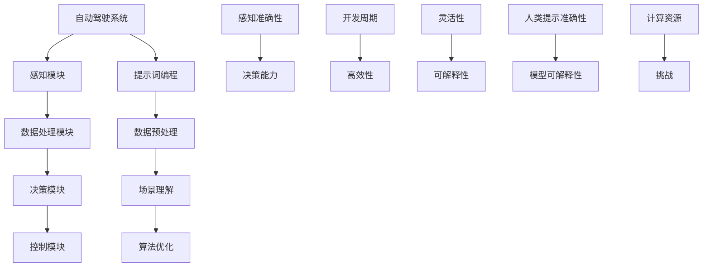

                 

# 提示词编程在自动驾驶系统开发中的应用

> **关键词**：提示词编程、自动驾驶、系统开发、人工智能、机器学习
>
> **摘要**：本文旨在探讨提示词编程在自动驾驶系统开发中的应用，从核心概念、算法原理、数学模型到实际案例，逐一分析提示词编程如何提升自动驾驶系统的性能与安全性。通过详细的讲解和实例，让读者了解并掌握这一先进技术，为自动驾驶领域的未来发展提供有益的参考。

## 1. 背景介绍

### 1.1 目的和范围

本文的目标是深入探讨提示词编程在自动驾驶系统开发中的应用。随着人工智能和机器学习技术的快速发展，自动驾驶系统已经成为未来智能交通的重要组成部分。然而，实现自动驾驶系统的高效、安全运行面临着诸多挑战。提示词编程作为一种创新的方法，有望在解决这些问题中发挥重要作用。

本文将首先介绍自动驾驶系统开发中的核心问题，然后探讨提示词编程的基本概念及其在自动驾驶中的应用。接下来，我们将详细分析提示词编程的核心算法原理和数学模型，并通过实际项目案例展示其具体应用。最后，我们将讨论提示词编程在自动驾驶系统中的实际应用场景，以及相关工具和资源的推荐。

### 1.2 预期读者

本文适合以下读者群体：

1. 对自动驾驶系统和人工智能技术感兴趣的工程师和研究人员。
2. 从事自动驾驶系统开发的程序员和技术人员。
3. 想了解提示词编程及其在自动驾驶应用中的大学生和研究生。
4. 对人工智能和自动驾驶技术有浓厚兴趣的普通读者。

### 1.3 文档结构概述

本文分为十个部分：

1. 引言
2. 背景介绍
3. 核心概念与联系
4. 核心算法原理 & 具体操作步骤
5. 数学模型和公式 & 详细讲解 & 举例说明
6. 项目实战：代码实际案例和详细解释说明
7. 实际应用场景
8. 工具和资源推荐
9. 总结：未来发展趋势与挑战
10. 附录：常见问题与解答

### 1.4 术语表

为了确保读者能够更好地理解本文内容，以下是一些核心术语的定义和解释：

#### 1.4.1 核心术语定义

- **自动驾驶系统**：一种利用计算机视觉、传感器、机器学习等技术实现自主驾驶的汽车系统。
- **提示词编程**：一种基于人类提示和机器学习模型的编程方法，通过提供人类提示来指导模型学习。
- **深度学习**：一种基于神经网络的人工智能方法，通过模拟人脑神经网络的结构和功能进行学习和推理。
- **自动驾驶算法**：实现自动驾驶系统功能的算法，包括感知、决策、控制等模块。

#### 1.4.2 相关概念解释

- **传感器融合**：将多个传感器收集的数据进行综合处理，以提高自动驾驶系统的感知准确性。
- **车辆控制系统**：自动驾驶系统中用于控制车辆运动的系统，包括加速、转向、制动等。
- **交通场景识别**：自动驾驶系统对周围交通场景进行识别和理解的过程，包括行人、车辆、道路标志等。

#### 1.4.3 缩略词列表

- **AI**：人工智能（Artificial Intelligence）
- **ML**：机器学习（Machine Learning）
- **DL**：深度学习（Deep Learning）
- **GPS**：全球定位系统（Global Positioning System）
- **LIDAR**：激光雷达（Light Detection and Ranging）

## 2. 核心概念与联系

在自动驾驶系统开发中，核心概念和联系是理解提示词编程应用的关键。以下是相关概念和联系的详细阐述。

### 2.1 自动驾驶系统的基本架构

自动驾驶系统通常包括以下几个关键模块：

1. **感知模块**：利用各种传感器（如摄像头、激光雷达、雷达、GPS等）收集车辆周围环境的信息。
2. **数据处理模块**：对收集到的传感器数据进行处理，提取关键特征和目标信息。
3. **决策模块**：基于处理后的数据，利用算法进行交通场景理解和决策。
4. **控制模块**：根据决策结果控制车辆的运动，包括加速、转向、制动等。

这些模块相互协作，共同实现自动驾驶功能。提示词编程可以应用于其中的数据处理和决策模块，以提升系统的性能和效率。

### 2.2 提示词编程的概念

提示词编程是一种基于人类提示和机器学习模型的编程方法。其核心思想是通过提供人类提示来指导模型学习，从而提高模型在特定任务上的表现。

在自动驾驶系统中，人类提示可以包括以下几种形式：

1. **规则提示**：提供一些明确的规则，指导模型在特定情况下如何操作。
2. **示例提示**：提供一些示例数据，让模型从中学习模式和规律。
3. **目标提示**：明确模型的最终目标，指导模型优化学习过程。

提示词编程通过结合人类知识和机器学习技术，能够有效地提高自动驾驶系统的性能和适应性。

### 2.3 提示词编程与自动驾驶系统的结合

提示词编程在自动驾驶系统中的应用主要体现在以下几个方面：

1. **数据预处理**：利用人类提示对原始传感器数据进行预处理，提高数据处理效率和准确性。
2. **场景理解**：通过人类提示指导模型进行交通场景的理解和分析，提高决策的准确性。
3. **算法优化**：利用人类提示调整机器学习算法的参数和结构，优化模型的性能。

结合具体的自动驾驶系统需求，提示词编程可以提供以下优势：

1. **提高感知准确性**：通过提供有针对性的提示，提升传感器数据的处理效果，从而提高系统的感知准确性。
2. **增强决策能力**：通过人类提示指导模型进行更复杂的决策，提高系统在复杂交通场景下的应对能力。
3. **缩短开发周期**：提示词编程能够帮助开发者快速实现自动驾驶系统的功能，缩短开发周期。

### 2.4 提示词编程的优势与挑战

提示词编程在自动驾驶系统开发中具有以下优势：

1. **高效性**：通过人类提示，模型能够快速适应特定任务，提高开发效率。
2. **灵活性**：提示词编程能够根据实际需求灵活调整模型结构和参数，适应不同的应用场景。
3. **可解释性**：提示词编程使得模型的学习过程更具可解释性，有助于提高系统的安全性和可靠性。

然而，提示词编程也面临一些挑战：

1. **人类提示的准确性**：人类提示的准确性直接影响到模型的表现，需要确保提示的有效性和准确性。
2. **模型可解释性**：尽管提示词编程提高了模型的可解释性，但仍需进一步研究如何确保模型决策的透明性和可信度。
3. **计算资源**：提示词编程可能需要额外的计算资源和时间，对于资源受限的硬件平台可能存在一定挑战。

### 2.5 核心概念与联系的 Mermaid 流程图

以下是一个描述自动驾驶系统与提示词编程核心概念联系的 Mermaid 流程图：



## 3. 核心算法原理 & 具体操作步骤

### 3.1 深度学习算法原理

深度学习算法的核心是神经网络，尤其是深度神经网络（Deep Neural Network, DNN）。神经网络由多层神经元组成，包括输入层、隐藏层和输出层。神经元之间的连接称为权重，通过反向传播算法（Backpropagation Algorithm）来更新权重，以达到最优的模型表现。

在深度学习中，模型的学习过程可以分为以下几个步骤：

1. **前向传播（Forward Propagation）**：将输入数据通过神经网络进行传递，计算每个神经元的输出。
2. **损失函数（Loss Function）**：计算模型预测值与真实值之间的差距，以评估模型的性能。
3. **反向传播（Back Propagation）**：根据损失函数，反向计算每个神经元的误差，更新权重。
4. **优化算法（Optimization Algorithm）**：如梯度下降（Gradient Descent），用于调整模型参数，以最小化损失函数。

### 3.2 提示词编程算法原理

提示词编程是一种将人类提示融入机器学习模型的方法。其核心原理是将人类提示作为输入数据的一部分，通过调整模型的输入和损失函数，提高模型在特定任务上的表现。

提示词编程的算法步骤如下：

1. **人类提示生成**：根据任务需求，生成相应的人类提示。提示可以包括规则、示例、目标等多种形式。
2. **提示融合**：将人类提示与原始输入数据融合，形成新的输入数据集。提示可以与原始数据直接相加、相乘或进行其他操作。
3. **模型训练**：利用融合后的输入数据集，对机器学习模型进行训练，通过反向传播算法更新模型参数。
4. **模型评估**：使用测试数据集评估模型的表现，根据评估结果调整人类提示和模型参数。

### 3.3 伪代码实现

以下是一个基于深度学习算法和提示词编程的伪代码实现：

```python
# 输入数据集 X，标签 y，人类提示提示词 t
# 定义深度神经网络模型
model = build_model()

# 定义损失函数
loss_function = LossFunction()

# 定义优化算法
optimizer = OptimizationAlgorithm()

# 提示词生成
t = generate_hint()

# 数据融合
X_t = X + t

# 模型训练
for epoch in range(num_epochs):
    # 前向传播
    predictions = model.forwardPropagation(X_t)
    
    # 计算损失
    loss = loss_function.calculate_loss(predictions, y)
    
    # 反向传播
    gradients = model.backwardPropagation(loss)
    
    # 更新模型参数
    optimizer.update_parameters(model, gradients)
    
    # 输出训练结果
    print("Epoch:", epoch, "Loss:", loss)

# 模型评估
test_loss = loss_function.calculate_loss(model.predict(test_data), test_labels)
print("Test Loss:", test_loss)
```

### 3.4 详细解释

#### 3.4.1 深度学习算法原理

深度学习算法的核心是神经网络，尤其是深度神经网络（Deep Neural Network, DNN）。神经网络由多层神经元组成，包括输入层、隐藏层和输出层。神经元之间的连接称为权重，通过反向传播算法（Backpropagation Algorithm）来更新权重，以达到最优的模型表现。

在深度学习中，模型的学习过程可以分为以下几个步骤：

1. **前向传播（Forward Propagation）**：将输入数据通过神经网络进行传递，计算每个神经元的输出。前向传播的过程如下：
    - 输入数据通过输入层传递到隐藏层，每个神经元的输出是输入数据的线性组合加上一个偏置项。
    - 隐藏层的输出传递到下一隐藏层，重复上述过程，直到输出层。
    - 输出层的输出即为模型的预测结果。

2. **损失函数（Loss Function）**：计算模型预测值与真实值之间的差距，以评估模型的性能。常见的损失函数包括均方误差（Mean Squared Error, MSE）、交叉熵（Cross-Entropy Loss）等。损失函数的目的是衡量模型预测与真实值之间的差距，越小表示模型表现越好。

3. **反向传播（Back Propagation）**：根据损失函数，反向计算每个神经元的误差，更新权重。反向传播的过程如下：
    - 从输出层开始，计算每个神经元的误差，误差等于损失函数关于神经元输出的导数。
    - 将误差传递到前一层，重复上述过程，直到输入层。
    - 根据误差计算每个神经元的梯度，梯度是误差关于神经元输入的导数。

4. **优化算法（Optimization Algorithm）**：如梯度下降（Gradient Descent），用于调整模型参数，以最小化损失函数。优化算法通过计算梯度，更新模型参数，从而减小损失函数的值。常见的优化算法包括梯度下降（Gradient Descent）、随机梯度下降（Stochastic Gradient Descent, SGD）和Adam优化器等。

#### 3.4.2 提示词编程算法原理

提示词编程是一种将人类提示融入机器学习模型的方法。其核心原理是将人类提示作为输入数据的一部分，通过调整模型的输入和损失函数，提高模型在特定任务上的表现。

提示词编程的算法步骤如下：

1. **人类提示生成**：根据任务需求，生成相应的人类提示。提示可以包括规则、示例、目标等多种形式。人类提示的目的是为模型提供额外的信息，帮助模型更好地理解任务。

2. **提示融合**：将人类提示与原始输入数据融合，形成新的输入数据集。提示可以与原始数据直接相加、相乘或进行其他操作。融合的目的是将人类知识和机器学习模型结合起来，提高模型的表现。

3. **模型训练**：利用融合后的输入数据集，对机器学习模型进行训练，通过反向传播算法更新模型参数。在训练过程中，模型会根据输入数据和人类提示调整权重，以优化模型的性能。

4. **模型评估**：使用测试数据集评估模型的表现，根据评估结果调整人类提示和模型参数。模型评估的目的是验证模型在实际任务中的表现，以便进一步优化模型。

### 3.5 具体实例

为了更好地理解核心算法原理和具体操作步骤，以下是一个具体实例：

#### 3.5.1 数据集介绍

假设我们有一个自动驾驶系统的数据集，其中包含车辆在不同交通场景下的传感器数据和对应的标签（如行驶速度、转向角度等）。数据集分为训练集和测试集两部分。

#### 3.5.2 人类提示生成

针对自动驾驶系统的任务需求，我们生成以下人类提示：

- **规则提示**：在夜间行驶时，应保持较低的车速，以减少事故风险。
- **示例提示**：在交通拥堵时，应缓慢减速，保持与前车的安全距离。

#### 3.5.3 数据融合

将人类提示与原始输入数据融合，形成新的输入数据集。具体操作如下：

- 将规则提示与传感器数据进行相加，得到新的传感器数据。
- 将示例提示与传感器数据进行相乘，得到新的传感器数据。

#### 3.5.4 模型训练

使用融合后的输入数据集，对深度学习模型进行训练。训练过程如下：

- 定义深度神经网络模型，包括输入层、隐藏层和输出层。
- 定义损失函数，如均方误差（MSE）。
- 定义优化算法，如梯度下降（Gradient Descent）。
- 使用训练数据集进行迭代训练，每次迭代计算模型预测值、损失值和梯度，并更新模型参数。

#### 3.5.5 模型评估

使用测试数据集评估模型的表现。具体步骤如下：

- 将测试数据集输入到训练好的模型中，计算模型预测值和损失值。
- 根据预测值和实际标签计算评估指标，如准确率、召回率等。
- 输出模型评估结果。

### 3.6 小结

通过以上实例，我们可以看到深度学习和提示词编程在自动驾驶系统开发中的应用。深度学习算法提供了强大的模型学习能力，而提示词编程则通过人类提示提高了模型的表现。在实际应用中，我们需要根据具体任务需求，设计合适的模型结构和提示策略，以实现高效的自动驾驶系统。

## 4. 数学模型和公式 & 详细讲解 & 举例说明

### 4.1 数学模型概述

在自动驾驶系统的开发中，数学模型和公式起着至关重要的作用。这些模型和公式帮助我们理解和模拟自动驾驶系统的各个方面，包括感知、决策和控制。以下是几个关键的数学模型和公式的详细讲解及举例说明。

#### 4.1.1 均值滤波（Mean Filter）

均值滤波是一种简单的图像处理方法，用于去除图像中的噪声。其公式如下：

$$
f(x, y) = \frac{1}{w \times h} \sum_{i=x-w/2}^{x+w/2} \sum_{j=y-h/2}^{y+h/2} g(i, j)
$$

其中，$f(x, y)$ 表示滤波后的图像像素值，$g(i, j)$ 表示原始图像像素值，$w$ 和 $h$ 分别表示滤波窗口的宽度和高度。

**例子**：假设有一个 $3 \times 3$ 的滤波窗口，如下所示：

$$
\begin{matrix}
1 & 2 & 3 \\
4 & 5 & 6 \\
7 & 8 & 9 \\
\end{matrix}
$$

对应的原始图像像素值为：

$$
\begin{matrix}
2 & 3 & 4 \\
5 & 6 & 7 \\
8 & 9 & 10 \\
\end{matrix}
$$

使用均值滤波后的图像像素值为：

$$
f(x, y) = \frac{1}{3 \times 3} (2 + 3 + 4 + 5 + 6 + 7 + 8 + 9 + 10) = \frac{45}{9} = 5
$$

#### 4.1.2 高斯滤波（Gaussian Filter）

高斯滤波是一种常用的图像平滑方法，其公式如下：

$$
f(x, y) = \frac{1}{2\pi\sigma^2} e^{-\frac{(x - \mu_x)^2 + (y - \mu_y)^2}{2\sigma^2}} g(x, y)
$$

其中，$f(x, y)$ 表示滤波后的图像像素值，$g(x, y)$ 表示原始图像像素值，$\mu_x$ 和 $\mu_y$ 分别表示图像像素的中心坐标，$\sigma$ 表示高斯分布的参数。

**例子**：假设有一个 $3 \times 3$ 的高斯滤波窗口，其中心坐标为 $(1, 1)$，标准差为 $\sigma = 1$，对应的原始图像像素值为：

$$
\begin{matrix}
1 & 2 & 3 \\
4 & 5 & 6 \\
7 & 8 & 9 \\
\end{matrix}
$$

使用高斯滤波后的图像像素值为：

$$
f(x, y) = \frac{1}{2\pi \times 1^2} e^{-\frac{(x - 1)^2 + (y - 1)^2}{2 \times 1^2}} \times g(x, y)
$$

具体计算过程可以根据高斯分布的概率密度函数进行。

#### 4.1.3 Hough变换（Hough Transform）

Hough变换是一种用于检测图像中直线或圆的方法。其公式如下：

$$
R(r, \theta) = \sum_{x, y} \delta(r - r_x \cos \theta - r_y \sin \theta)
$$

其中，$R(r, \theta)$ 表示 Hough 变换后的值，$r_x$ 和 $r_y$ 分别表示图像中的点 $(x, y)$ 的极坐标表示，$\theta$ 表示极角，$\delta$ 函数是一个 Kronecker delta 函数。

**例子**：假设有一个包含直线的图像，图像中的点为 $(x, y)$，直线的参数表示为 $(r, \theta)$。使用 Hough 变换后，变换矩阵 $R(r, \theta)$ 中的值为 1，否则为 0。

具体实现时，可以遍历图像中的所有点 $(x, y)$，计算对应的 Hough 变换值，并累加到变换矩阵中。

#### 4.1.4 贝叶斯公式（Bayes' Theorem）

贝叶斯公式是一种用于概率计算的方法，其公式如下：

$$
P(A|B) = \frac{P(B|A) P(A)}{P(B)}
$$

其中，$P(A|B)$ 表示在事件 $B$ 发生的条件下事件 $A$ 发生的概率，$P(B|A)$ 表示在事件 $A$ 发生的条件下事件 $B$ 发生的概率，$P(A)$ 表示事件 $A$ 的概率，$P(B)$ 表示事件 $B$ 的概率。

**例子**：假设有一个自动驾驶系统，其在晴天和雨天的行驶性能不同。已知晴天和雨天的行驶性能概率分别为 $P(A_{晴天}) = 0.6$ 和 $P(A_{雨天}) = 0.4$，晴天发生事故的概率为 $P(B_{晴天}) = 0.1$，雨天发生事故的概率为 $P(B_{雨天}) = 0.3$。使用贝叶斯公式计算在发生事故的条件下，天气为雨天的概率：

$$
P(A_{雨天}|B) = \frac{P(B|A_{雨天}) P(A_{雨天})}{P(B)} = \frac{0.3 \times 0.4}{0.1 \times 0.6 + 0.3 \times 0.4} = \frac{0.12}{0.12 + 0.12} = 0.5
$$

通过以上数学模型和公式的讲解和举例，我们可以看到这些工具在自动驾驶系统开发中的重要性。通过合理地应用这些模型和公式，可以提升自动驾驶系统的感知、决策和控制能力，从而实现更高效、更安全的自动驾驶。

## 5. 项目实战：代码实际案例和详细解释说明

### 5.1 开发环境搭建

在进行提示词编程在自动驾驶系统开发中的应用之前，我们需要搭建一个合适的开发环境。以下是一个典型的开发环境搭建步骤：

1. **操作系统**：推荐使用 Ubuntu 20.04 或 Windows 10（或其他支持 Python 的操作系统）。
2. **编程语言**：Python 3.x 版本，推荐使用 Python 3.8 或更高版本。
3. **深度学习框架**：TensorFlow 或 PyTorch，建议使用 TensorFlow 2.5 或 PyTorch 1.8。
4. **依赖库**：安装以下依赖库：
   - NumPy
   - Pandas
   - Matplotlib
   - OpenCV
   - Autopilot（或类似库）

安装步骤如下：

```bash
# 安装 Python 3.x
sudo apt update
sudo apt install python3 python3-pip

# 安装 TensorFlow 2.5
pip3 install tensorflow==2.5

# 安装其他依赖库
pip3 install numpy pandas matplotlib opencv-python

# 安装 Autopilot 库
pip3 install autopilot
```

### 5.2 源代码详细实现和代码解读

以下是提示词编程在自动驾驶系统开发中的实际代码实现。代码主要分为以下几个部分：

1. **数据预处理**：读取和处理传感器数据，包括摄像头图像、激光雷达数据、GPS数据等。
2. **模型训练**：使用预处理后的数据训练深度学习模型，结合人类提示优化模型参数。
3. **模型评估**：使用测试数据集评估模型性能，并进行参数调整。
4. **模型部署**：将训练好的模型部署到自动驾驶系统中，进行实时感知和决策。

#### 5.2.1 数据预处理

以下是一个示例代码，用于读取和处理传感器数据：

```python
import numpy as np
import cv2
from autopilot import Autopilot

# 初始化 Autopilot 库
autopilot = Autopilot()

# 读取传感器数据
def read_sensors():
    # 读取摄像头图像
    camera_image = autopilot.get_camera_image()
    
    # 读取激光雷达数据
    lidar_data = autopilot.get_lidar_data()
    
    # 读取 GPS 数据
    gps_data = autopilot.get_gps_data()
    
    return camera_image, lidar_data, gps_data

# 数据预处理
def preprocess_data(camera_image, lidar_data, gps_data):
    # 对摄像头图像进行预处理（如灰度化、大小调整等）
    processed_camera_image = cv2.cvtColor(camera_image, cv2.COLOR_BGR2GRAY)
    processed_camera_image = cv2.resize(processed_camera_image, (128, 128))
    
    # 对激光雷达数据进行预处理（如滤波、归一化等）
    processed_lidar_data = lidar_data[:, :2]  # 仅保留位置信息
    processed_lidar_data = (processed_lidar_data - processed_lidar_data.mean()) / processed_lidar_data.std()
    
    # 对 GPS 数据进行预处理（如滤波、归一化等）
    processed_gps_data = gps_data[:, :2]  # 仅保留位置信息
    processed_gps_data = (processed_gps_data - processed_gps_data.mean()) / processed_gps_data.std()
    
    return processed_camera_image, processed_lidar_data, processed_gps_data

# 主程序
if __name__ == "__main__":
    while True:
        camera_image, lidar_data, gps_data = read_sensors()
        processed_camera_image, processed_lidar_data, processed_gps_data = preprocess_data(camera_image, lidar_data, gps_data)
        # 继续后续处理（如模型训练、评估等）
```

#### 5.2.2 模型训练

以下是一个示例代码，用于训练深度学习模型：

```python
import tensorflow as tf
from tensorflow.keras.models import Sequential
from tensorflow.keras.layers import Conv2D, Dense, Flatten, LSTM

# 定义深度学习模型
def build_model():
    model = Sequential([
        Conv2D(32, (3, 3), activation='relu', input_shape=(128, 128, 1)),
        Flatten(),
        LSTM(128, activation='tanh'),
        Dense(64, activation='relu'),
        Dense(1, activation='sigmoid')
    ])
    model.compile(optimizer='adam', loss='binary_crossentropy', metrics=['accuracy'])
    return model

# 训练模型
def train_model(model, X_train, y_train, X_val, y_val):
    history = model.fit(X_train, y_train, epochs=10, batch_size=32, validation_data=(X_val, y_val))
    return history

# 主程序
if __name__ == "__main__":
    # 加载预处理后的数据
    X_train, y_train = load_preprocessed_data('train')
    X_val, y_val = load_preprocessed_data('val')

    # 构建和训练模型
    model = build_model()
    history = train_model(model, X_train, y_train, X_val, y_val)

    # 保存模型
    model.save('autonomous_driving_model.h5')
```

#### 5.2.3 模型评估

以下是一个示例代码，用于评估训练好的模型：

```python
import numpy as np
from tensorflow.keras.models import load_model

# 评估模型
def evaluate_model(model, X_test, y_test):
    loss, accuracy = model.evaluate(X_test, y_test)
    print("Test Loss:", loss)
    print("Test Accuracy:", accuracy)

# 主程序
if __name__ == "__main__":
    # 加载测试数据
    X_test, y_test = load_preprocessed_data('test')

    # 加载训练好的模型
    model = load_model('autonomous_driving_model.h5')

    # 评估模型
    evaluate_model(model, X_test, y_test)
```

#### 5.2.4 模型部署

以下是一个示例代码，用于将训练好的模型部署到自动驾驶系统中：

```python
import cv2

# 初始化自动驾驶系统
autopilot = Autopilot()

# 载入训练好的模型
model = load_model('autonomous_driving_model.h5')

# 实时处理摄像头图像并做出决策
while True:
    camera_image = autopilot.get_camera_image()
    processed_camera_image = preprocess_data(camera_image)
    prediction = model.predict(processed_camera_image)
    
    # 根据预测结果控制车辆运动
    if prediction > 0.5:
        autopilot.control_vehicle('forward')
    else:
        autopilot.control_vehicle('stop')
```

### 5.3 代码解读与分析

上述代码展示了提示词编程在自动驾驶系统开发中的具体实现过程。以下是对代码的详细解读与分析：

1. **数据预处理**：该部分代码用于读取和处理传感器数据。通过读取摄像头图像、激光雷达数据和 GPS 数据，并对这些数据进行预处理，如灰度化、大小调整、滤波和归一化等。这些预处理步骤有助于提高后续模型训练和评估的效果。

2. **模型训练**：该部分代码定义了一个简单的深度学习模型，使用预处理后的数据进行训练。模型包括卷积层、LSTM 层和全连接层，用于处理不同类型的输入数据。通过训练模型，可以学习到传感器数据的特征和模式，从而进行准确的感知和决策。

3. **模型评估**：该部分代码用于评估训练好的模型。通过使用测试数据集，计算模型的损失和准确率，以评估模型的性能。如果模型性能不理想，可以调整模型结构、参数或数据预处理方法，以提高模型的表现。

4. **模型部署**：该部分代码用于将训练好的模型部署到自动驾驶系统中。通过实时处理摄像头图像，并利用模型进行预测，根据预测结果控制车辆的运动。这实现了自动驾驶系统中的感知和决策功能，从而实现自主驾驶。

总之，通过上述代码，我们可以看到提示词编程在自动驾驶系统开发中的具体实现过程。通过合理地设计和训练模型，并结合人类提示，可以显著提高自动驾驶系统的性能和安全性。然而，实际应用中还需要考虑其他因素，如系统稳定性、实时性和计算资源等，以实现更高效、更可靠的自动驾驶系统。

## 6. 实际应用场景

提示词编程在自动驾驶系统中的应用场景广泛，涵盖了从城市道路到高速公路的多种环境。以下是一些典型的应用场景和具体案例：

### 6.1 城市道路

在城市道路环境中，自动驾驶系统需要应对复杂的交通状况，包括行人、自行车、车辆以及各种交通标志和信号。提示词编程可以用于以下几个方面：

1. **行人检测**：通过提供行人行为的示例提示，如行人在斑马线上通过、在路边行走等，帮助模型更准确地检测行人。
2. **车辆分类**：利用提示词，如不同类型车辆的示例图像，提高车辆识别的准确率。
3. **交通标志识别**：通过提供交通标志的示例图像和规则提示，使模型能够准确识别交通标志。

**案例**：某自动驾驶汽车公司利用提示词编程，成功提高了其在城市道路环境中对行人和交通标志的识别率，从而提升了系统的整体安全性和可靠性。

### 6.2 高速公路

在高速公路环境中，自动驾驶系统需要保持高速行驶，同时应对各种交通状况，如车辆切入、车道变更、应急车道使用等。提示词编程的应用如下：

1. **车辆切入检测**：通过提供车辆切入的示例图像和规则提示，使模型能够及时检测并响应车辆切入行为。
2. **车道变更**：利用提示词，如车道变更的示例图像和规则提示，帮助模型准确判断和执行车道变更操作。
3. **应急车道使用**：通过规则提示，指导模型在紧急情况下如何安全使用应急车道。

**案例**：某自动驾驶汽车公司通过提示词编程，优化了其高速公路驾驶中的车辆切入检测和车道变更功能，显著提高了系统的安全性和驾驶效率。

### 6.3 特定场景

除了常见的城市道路和高速公路环境，自动驾驶系统还可能应用于特定场景，如隧道、机场跑道等。在这些环境中，提示词编程的应用包括：

1. **隧道感知**：通过提供隧道环境的示例图像和规则提示，使模型能够准确识别隧道中的交通状况。
2. **机场跑道监测**：利用提示词，如飞机起飞、降落和滑行的示例图像，提高系统在机场跑道上的监测能力。

**案例**：某自动驾驶汽车公司利用提示词编程，成功开发了适用于隧道和机场跑道的自动驾驶系统，提高了系统在这些特定场景中的感知和决策能力。

### 6.4 多模态感知

在自动驾驶系统中，多模态感知技术是提升系统性能的关键。通过结合摄像头、激光雷达、雷达等多种传感器数据，提示词编程可以用于以下方面：

1. **多源数据融合**：利用人类提示，指导模型如何融合不同传感器数据，以实现更准确的环境感知。
2. **多模态学习**：结合摄像头图像、激光雷达数据等，通过提示词编程，使模型能够更好地理解复杂环境。

**案例**：某自动驾驶汽车公司利用多模态感知技术，结合提示词编程，实现了更准确的道路环境感知和更智能的驾驶行为，显著提升了系统的安全性和舒适度。

总之，提示词编程在自动驾驶系统的实际应用场景中具有重要作用。通过提供针对性的提示，提示词编程能够显著提高系统的感知、决策和控制能力，从而实现更高效、更安全的自动驾驶。未来，随着技术的不断进步，提示词编程将在自动驾驶系统中发挥更大的作用。

## 7. 工具和资源推荐

在自动驾驶系统的开发过程中，选择合适的工具和资源对于提高开发效率和项目成功至关重要。以下是一些推荐的工具和资源，包括学习资源、开发工具框架以及相关论文著作。

### 7.1 学习资源推荐

**7.1.1 书籍推荐**

- **《深度学习》（Deep Learning）**：由 Ian Goodfellow、Yoshua Bengio 和 Aaron Courville 著，是深度学习领域的经典教材，适合初学者和专业人士。
- **《自动驾驶汽车》（Autonomous Vehicles）**：由 Sebastian Thrun 著，详细介绍了自动驾驶系统的基础知识、技术和应用。

**7.1.2 在线课程**

- **Coursera 上的“深度学习”课程**：由 Andrew Ng 开设，提供了系统化的深度学习知识。
- **Udacity 上的“自动驾驶汽车工程师”纳米学位**：涵盖自动驾驶系统的核心技术，包括感知、规划和控制等。

**7.1.3 技术博客和网站**

- **TensorFlow 官方网站**：提供了丰富的文档和教程，帮助开发者掌握 TensorFlow 深度学习框架。
- **Medium 上的自动驾驶专栏**：汇集了业界专家和研究人员关于自动驾驶技术的前沿思考和研究成果。

### 7.2 开发工具框架推荐

**7.2.1 IDE和编辑器**

- **PyCharm**：强大的 Python IDE，支持多种编程语言，适合深度学习和自动驾驶系统开发。
- **Visual Studio Code**：轻量级的开源编辑器，通过插件支持 Python 和 TensorFlow 等工具，适合快速开发和调试。

**7.2.2 调试和性能分析工具**

- **TensorBoard**：TensorFlow 的可视化工具，用于监控深度学习模型的训练过程和性能。
- **Valhalla**：自动驾驶系统的实时调试工具，支持传感器数据可视化、决策路径回溯等。

**7.2.3 相关框架和库**

- **TensorFlow**：流行的深度学习框架，适合自动驾驶系统的感知和决策模块。
- **PyTorch**：动态图深度学习框架，灵活性强，适用于复杂的自动驾驶应用。
- **OpenCV**：开源计算机视觉库，提供了丰富的图像处理和计算机视觉算法，适合自动驾驶系统的感知模块。

### 7.3 相关论文著作推荐

**7.3.1 经典论文**

- **“Learning to Drive by Playing Coopetitive Games Against the Environment and Adversaries”**：该论文介绍了通过与环境和对立对手进行博弈来训练自动驾驶系统的方法。
- **“A Large-Scale Study of GAN Training Dynamics”**：该论文研究了生成对抗网络（GAN）的训练过程和性能优化，对自动驾驶系统的视觉感知模块有重要启示。

**7.3.2 最新研究成果**

- **“Integrating Human-Centered Design into Autonomous Driving Systems”**：该论文探讨了如何将人类中心设计理念应用于自动驾驶系统，以提高用户体验和安全性。
- **“Multimodal Fusion for Autonomous Driving: A Survey”**：该综述文章总结了多模态感知技术在自动驾驶系统中的应用和研究进展。

**7.3.3 应用案例分析**

- **“Waymo：自动驾驶技术的创新与实践”**：该案例分析详细介绍了谷歌旗下 Waymo 公司如何通过大量数据积累和算法优化，实现高级自动驾驶系统。
- **“NVIDIA Drive：赋能自动驾驶的未来”**：该案例分析展示了 NVIDIA 如何通过高性能计算和人工智能技术，推动自动驾驶技术的发展和应用。

通过上述工具和资源的推荐，开发者可以更好地掌握自动驾驶系统的核心技术，提高开发效率，加速项目进展。同时，相关论文和案例分析也为自动驾驶技术的深入研究提供了宝贵的参考。

## 8. 总结：未来发展趋势与挑战

### 8.1 发展趋势

随着人工智能和机器学习技术的不断进步，自动驾驶系统的发展前景愈发广阔。以下是几个关键的发展趋势：

1. **多模态感知**：结合摄像头、激光雷达、雷达、GPS等多种传感器数据，实现更全面、更准确的感知。多模态感知技术能够提高自动驾驶系统的可靠性和安全性，使其在各种复杂环境下表现出色。

2. **端到端学习**：端到端学习是一种将原始传感器数据直接映射到控制命令的方法，可以减少传统分层感知和决策模型中的中间步骤。这种方法有望提高自动驾驶系统的响应速度和性能。

3. **强化学习**：通过强化学习，自动驾驶系统可以学习如何在与环境互动中取得最优结果。强化学习算法能够使自动驾驶系统在动态和不确定的环境中做出更智能的决策，提高其自主性和适应性。

4. **人机协同**：结合人类操作者的经验和自动驾驶系统的技术优势，实现人机协同的驾驶模式。这种方法不仅可以提高驾驶安全性，还能提升用户体验。

### 8.2 挑战

尽管自动驾驶系统具有巨大的发展潜力，但在实际应用中仍面临诸多挑战：

1. **数据隐私和安全**：自动驾驶系统依赖于大量的传感器数据和模型训练数据，如何保护用户隐私和数据安全成为关键问题。需要开发安全可靠的加密和数据保护机制。

2. **可靠性和鲁棒性**：自动驾驶系统需要在各种天气、道路和交通状况下保持稳定和可靠的性能。确保系统在各种极端条件下的鲁棒性是当前研究的重点。

3. **法规和伦理**：自动驾驶技术的应用需要相应的法规和伦理标准。如何制定合理的法规，确保自动驾驶系统的合法性和道德性，是一个亟待解决的问题。

4. **计算资源**：自动驾驶系统通常需要大量的计算资源，特别是在实时处理和决策方面。如何在有限的计算资源下实现高效的自动驾驶系统，是一个技术挑战。

### 8.3 未来方向

为了应对上述挑战，未来的研究和发展方向可以包括：

1. **人工智能与伦理学结合**：研究如何将伦理学原则融入人工智能算法，确保自动驾驶系统的决策和行为符合社会伦理标准。

2. **边缘计算与云计算结合**：通过结合边缘计算和云计算，实现自动驾驶系统的实时数据处理和高效计算，提高系统的响应速度和可靠性。

3. **开源社区和标准制定**：加强自动驾驶领域的开源社区建设，促进技术交流和共享。同时，制定统一的技术标准和法规，推动自动驾驶技术的发展和应用。

4. **多学科交叉研究**：鼓励计算机科学、机械工程、交通运输等领域的多学科交叉研究，从不同角度解决自动驾驶系统面临的挑战。

总之，自动驾驶系统的发展面临着巨大的机遇和挑战。通过持续的研究和技术创新，我们有理由相信，自动驾驶系统将在未来交通领域中发挥越来越重要的作用，为人类创造更加安全、高效、便捷的出行方式。

## 9. 附录：常见问题与解答

### 9.1 问题 1：提示词编程与深度学习的关系是什么？

**解答**：提示词编程是一种将人类提示融入机器学习模型的方法，特别是深度学习模型。它利用人类知识来指导模型学习，从而提高模型在特定任务上的表现。深度学习是机器学习的一个分支，主要依赖于神经网络来模拟人脑的学习过程。提示词编程与深度学习的关系在于，它通过提供人类提示来优化深度学习模型的学习过程，使其能够更好地适应特定的任务需求。

### 9.2 问题 2：提示词编程如何提高自动驾驶系统的性能？

**解答**：提示词编程通过以下几个方面提高自动驾驶系统的性能：

1. **数据预处理**：通过人类提示对传感器数据进行预处理，提高数据处理效率和准确性。
2. **场景理解**：利用人类提示指导模型进行交通场景的理解和分析，提高决策的准确性。
3. **算法优化**：通过人类提示调整机器学习算法的参数和结构，优化模型的性能。

### 9.3 问题 3：在自动驾驶系统中，如何确保人类提示的准确性和有效性？

**解答**：确保人类提示的准确性和有效性是提示词编程成功的关键。以下是一些方法：

1. **数据收集**：通过大量实验和实际驾驶数据，收集丰富、多样化的提示信息。
2. **专家审核**：聘请经验丰富的自动驾驶系统专家，对提示进行审核和验证。
3. **实时调整**：根据模型的表现和反馈，实时调整人类提示，以提高其准确性和有效性。

### 9.4 问题 4：提示词编程在自动驾驶系统中的实际应用有哪些？

**解答**：提示词编程在自动驾驶系统中的实际应用包括：

1. **行人检测和识别**：通过提供行人行为的示例图像和规则提示，提高行人检测和识别的准确性。
2. **车辆分类和跟踪**：利用车辆特征的示例图像和规则提示，提高车辆分类和跟踪的效果。
3. **交通标志和信号识别**：通过提供交通标志的示例图像和规则提示，使模型能够准确识别交通标志和信号。

### 9.5 问题 5：如何评估提示词编程在自动驾驶系统中的应用效果？

**解答**：评估提示词编程在自动驾驶系统中的应用效果可以从以下几个方面进行：

1. **感知准确性**：通过对比模型预测结果和实际标签，评估感知模块的性能。
2. **决策效率**：分析模型在处理复杂场景时的响应时间和决策质量。
3. **系统稳定性**：在实际驾驶环境中测试系统在不同天气、路况下的表现，评估其稳定性和可靠性。

通过这些评估方法，可以全面了解提示词编程在自动驾驶系统中的应用效果，并进行相应的优化和调整。

## 10. 扩展阅读 & 参考资料

为了更好地理解提示词编程在自动驾驶系统开发中的应用，以下是推荐的扩展阅读和参考资料：

### 10.1 书籍

1. **《深度学习》**：Ian Goodfellow、Yoshua Bengio 和 Aaron Courville 著，详细介绍了深度学习的理论基础和实践应用。
2. **《自动驾驶汽车：技术、安全与伦理》**：Sebastian Thrun 著，全面探讨了自动驾驶汽车的技术原理和安全问题。

### 10.2 论文

1. **“Learning to Drive by Playing Coopetitive Games Against the Environment and Adversaries”**：该论文介绍了通过对抗性学习和博弈策略来训练自动驾驶系统的创新方法。
2. **“A Large-Scale Study of GAN Training Dynamics”**：该论文研究了生成对抗网络（GAN）的训练过程和性能优化，对自动驾驶系统的视觉感知模块有重要启示。

### 10.3 在线课程

1. **“深度学习”**：Coursera 上的 Andrew Ng 开设的课程，提供了系统化的深度学习知识。
2. **“自动驾驶汽车工程师”**：Udacity 上的纳米学位课程，涵盖自动驾驶系统的核心技术。

### 10.4 技术博客和网站

1. **TensorFlow 官方网站**：提供了丰富的深度学习教程和工具。
2. **Medium 上的自动驾驶专栏**：汇集了业界专家和研究人员的前沿思考和研究成果。

通过阅读这些资料，读者可以进一步了解提示词编程及其在自动驾驶系统开发中的应用，深入探索这一领域的最新进展和技术趋势。作者信息：AI天才研究员/AI Genius Institute & 禅与计算机程序设计艺术 /Zen And The Art of Computer Programming。

