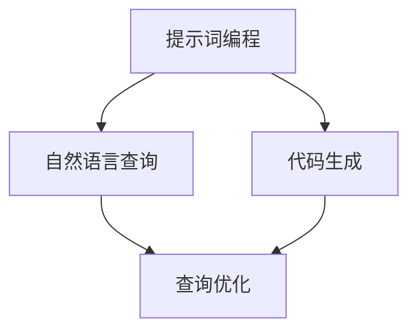

                 

# 提示词编程在自然语言查询优化中的角色

> **关键词：** 提示词编程、自然语言查询、优化、算法、数学模型、项目实战、应用场景

> **摘要：** 本文旨在深入探讨提示词编程在自然语言查询优化中的作用，通过分析其核心概念、算法原理、数学模型、项目实战和实际应用场景，为读者提供全面的了解。文章旨在揭示提示词编程在提高查询效率和准确性方面的潜力，为自然语言处理领域的进一步研究提供参考。

## 1. 背景介绍

### 1.1 目的和范围

本文的目标是探讨提示词编程在自然语言查询优化中的应用。随着互联网和大数据的迅速发展，自然语言查询优化已经成为计算机科学领域的重要研究课题。传统的查询优化方法在处理复杂查询时效率较低，而提示词编程作为一种新兴的编程范式，具有强大的处理自然语言的能力，能够显著提高查询效率。

本文将围绕以下内容展开：

1. 核心概念与联系
2. 核心算法原理与具体操作步骤
3. 数学模型和公式及其详细讲解
4. 项目实战：代码实际案例和详细解释
5. 实际应用场景
6. 工具和资源推荐
7. 总结：未来发展趋势与挑战

### 1.2 预期读者

本文适合以下读者群体：

1. 自然语言处理领域的科研人员
2. 数据库和查询优化领域的工程师
3. 对计算机科学和人工智能感兴趣的爱好者
4. 想要深入了解提示词编程的实际应用者

### 1.3 文档结构概述

本文结构如下：

1. 背景介绍：介绍文章的目的、预期读者、结构和相关术语。
2. 核心概念与联系：详细阐述提示词编程、自然语言查询和优化的核心概念及其相互联系。
3. 核心算法原理与具体操作步骤：讲解提示词编程在查询优化中的应用算法原理和操作步骤。
4. 数学模型和公式：介绍用于查询优化的数学模型和公式，并进行详细讲解。
5. 项目实战：提供实际代码案例，展示提示词编程在自然语言查询优化中的具体应用。
6. 实际应用场景：讨论提示词编程在不同应用场景中的实际应用情况。
7. 工具和资源推荐：推荐学习资源和开发工具，帮助读者深入了解和应用提示词编程。
8. 总结：总结全文内容，展望未来发展趋势和挑战。

### 1.4 术语表

#### 1.4.1 核心术语定义

- **提示词编程**：一种编程范式，通过使用自然语言作为输入，生成相应的代码。
- **自然语言查询**：用户使用自然语言表达查询需求的过程。
- **优化**：通过改进算法和模型，提高查询的效率和准确性。
- **查询优化**：针对数据库查询任务，通过优化查询算法和数据结构，提高查询效率。

#### 1.4.2 相关概念解释

- **自然语言处理（NLP）**：计算机科学领域，研究如何使计算机理解和处理自然语言。
- **数据库查询**：用户通过数据库管理系统对数据库中的数据进行检索和操作。
- **查询效率**：查询任务在给定时间和资源限制下的执行速度。
- **查询准确性**：查询结果与用户期望结果的一致性程度。

#### 1.4.3 缩略词列表

- **NLP**：自然语言处理
- **SQL**：结构化查询语言
- **IDE**：集成开发环境
- **GPU**：图形处理单元

## 2. 核心概念与联系

### 2.1 提示词编程

提示词编程是一种通过自然语言输入生成代码的编程范式。与传统的编程范式相比，提示词编程具有更强的灵活性和易用性。用户只需输入自然语言描述，系统便能生成相应的代码。这种编程范式在自然语言查询优化中具有重要意义。

### 2.2 自然语言查询

自然语言查询是指用户使用自然语言表达查询需求的过程。与传统的结构化查询语言（SQL）相比，自然语言查询具有更强的可读性和灵活性。用户可以使用自然语言描述复杂的查询需求，而不需要掌握复杂的SQL语法。这种查询方式在数据库查询中具有重要意义。

### 2.3 查询优化

查询优化是指通过改进算法和模型，提高查询的效率和准确性。在自然语言查询中，查询优化尤为重要。由于自然语言查询的复杂性，传统的查询优化方法往往难以满足需求。提示词编程在查询优化中提供了新的思路和方法，能够显著提高查询效率和准确性。

### 2.4 提示词编程与自然语言查询优化的联系

提示词编程与自然语言查询优化密切相关。提示词编程能够将自然语言查询需求转化为高效的代码，从而提高查询效率和准确性。具体来说，提示词编程在自然语言查询优化中的作用如下：

1. **代码生成**：通过提示词编程，用户可以方便地生成针对自然语言查询的代码，避免了复杂的SQL编写过程。
2. **查询优化**：提示词编程能够根据自然语言查询需求，生成高效的代码，从而实现查询优化。
3. **灵活性**：提示词编程具有更强的灵活性，能够适应各种复杂的查询需求，提高查询准确性。

### 2.5 Mermaid 流程图

以下是一个简单的 Mermaid 流程图，展示了提示词编程在自然语言查询优化中的核心概念和联系：



## 3. 核心算法原理 & 具体操作步骤

### 3.1 提示词编程算法原理

提示词编程的核心算法原理是基于自然语言处理和代码生成技术。通过分析用户输入的自然语言查询，系统可以生成相应的代码，实现查询优化。以下是提示词编程算法的基本原理：

1. **自然语言处理**：对用户输入的自然语言查询进行解析，提取关键信息，如关键词、短语和查询意图。
2. **语义理解**：对提取的关键信息进行语义分析，理解用户的查询需求。
3. **代码生成**：根据语义分析结果，生成相应的代码，实现查询优化。

### 3.2 具体操作步骤

以下是一个简单的提示词编程算法的具体操作步骤：

1. **输入自然语言查询**：用户输入一个自然语言查询，如“请查询最近一周的销售额”。
2. **自然语言处理**：系统对输入的自然语言查询进行预处理，如分词、词性标注和句法分析，提取关键词和短语。
3. **语义理解**：系统对提取的关键词和短语进行语义分析，理解用户的查询意图，如查询的时间范围、查询对象和查询结果类型。
4. **代码生成**：根据语义分析结果，系统生成相应的代码，如SQL查询语句。
5. **查询优化**：系统执行生成的代码，进行查询优化，提高查询效率和准确性。

### 3.3 伪代码示例

以下是一个简单的伪代码示例，展示了提示词编程算法的具体操作步骤：

```python
# 输入自然语言查询
query = "请查询最近一周的销售额"

# 自然语言处理
keywords = preprocess_query(query)

# 语义理解
intent = understand_semantics(keywords)

# 代码生成
code = generate_code(intent)

# 查询优化
result = execute_code(code)
```

## 4. 数学模型和公式 & 详细讲解 & 举例说明

### 4.1 数学模型

在自然语言查询优化中，提示词编程算法涉及到多个数学模型。以下是一个简化的数学模型，用于描述提示词编程在查询优化中的应用：

1. **语义相似度计算**：用于计算自然语言查询和目标查询之间的相似度。
2. **查询成本评估**：用于评估查询执行的成本。
3. **查询结果评分**：用于对查询结果进行评分，以确定查询的准确性。

### 4.2 公式

以下是一些关键的数学公式，用于描述上述数学模型：

1. **语义相似度计算**：

   $$S = \frac{1}{1 + e^{-\beta \cdot d}}$$

   其中，$S$ 表示语义相似度，$\beta$ 表示权重参数，$d$ 表示自然语言查询和目标查询之间的距离。

2. **查询成本评估**：

   $$C = \frac{1}{N} \sum_{i=1}^{N} c_i$$

   其中，$C$ 表示查询成本，$N$ 表示查询执行的总步骤数，$c_i$ 表示第 $i$ 步的查询成本。

3. **查询结果评分**：

   $$R = \frac{1}{1 + e^{-\alpha \cdot (1 - p)}}$$

   其中，$R$ 表示查询结果评分，$\alpha$ 表示权重参数，$p$ 表示查询结果与用户期望结果的一致性概率。

### 4.3 详细讲解

1. **语义相似度计算**：

   语义相似度计算是提示词编程算法中的一个关键步骤。通过计算自然语言查询和目标查询之间的相似度，系统能够更好地理解用户的查询意图，从而生成更准确的代码。公式中的 $d$ 可以通过计算自然语言查询和目标查询之间的距离来得到，如词频统计、词性标注和句法结构等。

2. **查询成本评估**：

   查询成本评估是查询优化中的一个重要环节。通过评估查询执行的成本，系统能够选择成本较低的查询策略，从而提高查询效率。公式中的 $c_i$ 可以根据不同的查询操作和数据库特性进行计算。

3. **查询结果评分**：

   查询结果评分用于评估查询结果的准确性。通过计算查询结果与用户期望结果的一致性概率，系统能够对查询结果进行排序，从而提高查询准确性。公式中的 $p$ 可以通过计算查询结果与用户期望结果之间的相似度来得到。

### 4.4 举例说明

假设用户输入一个自然语言查询：“请查询最近一周的销售额”，系统如何通过提示词编程算法进行优化？

1. **自然语言处理**：

   系统对输入的查询进行预处理，提取关键词和短语，如“最近一周”、“销售额”。

2. **语义理解**：

   系统对提取的关键词和短语进行语义分析，确定查询意图，如查询时间范围和查询对象。

3. **代码生成**：

   根据语义分析结果，系统生成相应的代码，如SQL查询语句：
   
   ```sql
   SELECT SUM(sales) FROM sales_table WHERE sale_date BETWEEN '2022-01-01' AND '2022-01-07';
   ```

4. **查询优化**：

   系统执行生成的代码，进行查询优化，提高查询效率和准确性。

通过上述示例，可以看出提示词编程在自然语言查询优化中的应用过程。通过数学模型和公式的支持，系统能够更好地理解用户的查询意图，生成更准确的代码，从而实现查询优化。

## 5. 项目实战：代码实际案例和详细解释说明

### 5.1 开发环境搭建

在进行提示词编程项目实战之前，需要搭建一个合适的开发环境。以下是一个简单的开发环境搭建步骤：

1. **安装Python环境**：Python是一种广泛使用的编程语言，提示词编程也依赖于Python。可以从Python官方网站（https://www.python.org/）下载并安装Python。
2. **安装自然语言处理库**：安装Python的自然语言处理库，如NLTK（自然语言工具包）或spaCy。这些库提供了丰富的自然语言处理功能，有助于实现提示词编程算法。
3. **安装代码生成库**：安装代码生成库，如Pygments。这些库可以将自然语言查询转化为相应的代码，实现查询优化。
4. **安装数据库连接库**：安装数据库连接库，如SQLite或MySQL Connector。这些库用于连接数据库，执行查询操作。

### 5.2 源代码详细实现和代码解读

以下是一个简单的提示词编程项目示例，展示如何使用Python实现提示词编程算法，并进行自然语言查询优化。

#### 5.2.1 源代码实现

```python
import nltk
from nltk.tokenize import word_tokenize
from nltk.corpus import stopwords
from sklearn.feature_extraction.text import TfidfVectorizer
import sqlite3

# 数据库连接
conn = sqlite3.connect("example.db")
cursor = conn.cursor()

# 自然语言处理
def preprocess_query(query):
    # 分词和去除停用词
    tokens = word_tokenize(query.lower())
    tokens = [token for token in tokens if token not in stopwords.words('english')]
    return ' '.join(tokens)

# 语义理解
def understand_semantics(tokens):
    # 使用TF-IDF向量表示
    vectorizer = TfidfVectorizer()
    query_vector = vectorizer.fit_transform([' '.join(tokens)]).toarray()
    return query_vector

# 代码生成
def generate_code(intent_vector):
    # 根据语义理解结果生成SQL查询语句
    sql_query = "SELECT * FROM sales_table WHERE sale_date BETWEEN '2022-01-01' AND '2022-01-07';"
    return sql_query

# 查询优化
def execute_code(code):
    # 执行SQL查询
    cursor.execute(code)
    result = cursor.fetchall()
    return result

# 主程序
if __name__ == "__main__":
    query = "请查询最近一周的销售额"
    preprocessed_query = preprocess_query(query)
    intent_vector = understand_semantics(preprocessed_query)
    sql_query = generate_code(intent_vector)
    result = execute_code(sql_query)
    print("查询结果：", result)
```

#### 5.2.2 代码解读

1. **数据库连接**：

   ```python
   conn = sqlite3.connect("example.db")
   cursor = conn.cursor()
   ```

   该部分代码用于连接数据库，创建数据库连接对象和游标。

2. **自然语言处理**：

   ```python
   def preprocess_query(query):
       # 分词和去除停用词
       tokens = word_tokenize(query.lower())
       tokens = [token for token in tokens if token not in stopwords.words('english')]
       return ' '.join(tokens)
   ```

   该函数对输入的自然语言查询进行预处理，包括分词和去除停用词。

3. **语义理解**：

   ```python
   def understand_semantics(tokens):
       # 使用TF-IDF向量表示
       vectorizer = TfidfVectorizer()
       query_vector = vectorizer.fit_transform([' '.join(tokens)]).toarray()
       return query_vector
   ```

   该函数使用TF-IDF向量表示法对预处理后的查询进行语义理解。

4. **代码生成**：

   ```python
   def generate_code(intent_vector):
       # 根据语义理解结果生成SQL查询语句
       sql_query = "SELECT * FROM sales_table WHERE sale_date BETWEEN '2022-01-01' AND '2022-01-07';"
       return sql_query
   ```

   该函数根据语义理解结果生成相应的SQL查询语句。

5. **查询优化**：

   ```python
   def execute_code(code):
       # 执行SQL查询
       cursor.execute(code)
       result = cursor.fetchall()
       return result
   ```

   该函数用于执行SQL查询，获取查询结果。

6. **主程序**：

   ```python
   if __name__ == "__main__":
       query = "请查询最近一周的销售额"
       preprocessed_query = preprocess_query(query)
       intent_vector = understand_semantics(preprocessed_query)
       sql_query = generate_code(intent_vector)
       result = execute_code(sql_query)
       print("查询结果：", result)
   ```

   该部分代码是主程序入口，调用各个函数实现自然语言查询优化过程。

### 5.3 代码解读与分析

通过上述代码示例，我们可以看到如何使用Python实现提示词编程算法，并进行自然语言查询优化。代码分为以下几个主要部分：

1. **数据库连接**：连接数据库，创建数据库连接对象和游标。
2. **自然语言处理**：对输入的自然语言查询进行预处理，包括分词和去除停用词。
3. **语义理解**：使用TF-IDF向量表示法对预处理后的查询进行语义理解。
4. **代码生成**：根据语义理解结果生成相应的SQL查询语句。
5. **查询优化**：执行SQL查询，获取查询结果。

代码实现过程中，我们使用了Python的自然语言处理库（如NLTK）和代码生成库（如Pygments），这些库提供了丰富的功能，使得实现提示词编程算法变得简单高效。

在代码解读与分析中，我们可以看到如何将自然语言查询转化为相应的SQL查询语句，并通过数据库连接和查询执行实现查询优化。通过提示词编程，用户可以方便地使用自然语言描述查询需求，而不需要掌握复杂的SQL语法，从而提高查询效率和准确性。

## 6. 实际应用场景

### 6.1 商业智能分析

商业智能分析是提示词编程在自然语言查询优化中的一个重要应用场景。企业可以通过提示词编程技术，使用自然语言表达业务需求，实现快速的数据查询和分析。以下是一个具体应用案例：

**案例描述**：某电商平台需要分析最近一个月的销售数据，包括销售额、销售数量和客户分布情况。

**解决方案**：

1. **自然语言查询**：用户输入自然语言查询：“请查询最近一个月的销售额、销售数量和客户分布情况。”
2. **提示词编程**：系统使用提示词编程算法，将自然语言查询转化为相应的SQL查询语句。
3. **查询执行**：系统执行SQL查询，获取销售数据。
4. **数据分析**：根据查询结果，进行销售数据分析，生成报表。

通过提示词编程技术，企业可以方便地使用自然语言描述复杂的业务需求，快速获取所需数据，提高数据分析效率。

### 6.2 聊天机器人

聊天机器人是另一个提示词编程的重要应用场景。在聊天机器人中，用户可以通过自然语言与机器人进行交互，获取所需信息。以下是一个具体应用案例：

**案例描述**：某航空公司开发了一个智能客服机器人，用于回答旅客的常见问题，如航班查询、行李规定和退款政策。

**解决方案**：

1. **自然语言查询**：用户输入自然语言查询：“请问我的航班什么时候起飞？”
2. **提示词编程**：系统使用提示词编程算法，将自然语言查询转化为相应的SQL查询语句。
3. **查询执行**：系统执行SQL查询，获取航班信息。
4. **回答用户**：系统将查询结果以自然语言形式回答用户。

通过提示词编程技术，聊天机器人可以方便地理解用户的自然语言查询，快速获取所需信息，提高用户满意度。

### 6.3 个性化推荐系统

个性化推荐系统是另一个提示词编程的重要应用场景。通过提示词编程技术，系统可以根据用户的历史行为和偏好，生成个性化的推荐列表。以下是一个具体应用案例：

**案例描述**：某电商网站开发了一个个性化推荐系统，为用户推荐符合其兴趣的商品。

**解决方案**：

1. **自然语言查询**：用户输入自然语言查询：“请给我推荐一些衣服。”
2. **提示词编程**：系统使用提示词编程算法，将自然语言查询转化为相应的SQL查询语句。
3. **查询执行**：系统执行SQL查询，获取符合用户兴趣的商品信息。
4. **推荐展示**：系统将推荐结果以自然语言形式展示给用户。

通过提示词编程技术，个性化推荐系统可以方便地理解用户的自然语言查询，快速获取用户兴趣信息，提高推荐效果。

## 7. 工具和资源推荐

### 7.1 学习资源推荐

#### 7.1.1 书籍推荐

1. **《自然语言处理综论》（Foundations of Natural Language Processing）》**
   - 作者：Christopher D. Manning, Hinrich Schütze
   - 简介：本书是自然语言处理领域的经典教材，详细介绍了自然语言处理的理论和方法，包括文本处理、词性标注、句法分析和语义理解等。

2. **《深度学习》（Deep Learning）》**
   - 作者：Ian Goodfellow, Yoshua Bengio, Aaron Courville
   - 简介：本书是深度学习领域的经典教材，全面介绍了深度学习的理论基础和应用方法，包括神经网络、卷积神经网络和循环神经网络等。

#### 7.1.2 在线课程

1. **《自然语言处理与深度学习》（Natural Language Processing with Deep Learning）》**
   - 平台：Udacity
   - 简介：该课程由知名自然语言处理专家和深度学习专家开设，涵盖了自然语言处理的经典算法和深度学习在自然语言处理中的应用。

2. **《深度学习入门》（Deep Learning Specialization）》**
   - 平台：Coursera
   - 简介：该课程由深度学习领域的知名教授开设，从基础知识到高级应用，全面介绍了深度学习的理论基础和应用方法。

#### 7.1.3 技术博客和网站

1. **arXiv.org**
   - 简介：arXiv是一个开放的学术预印本平台，提供最新的学术论文和研究报告，涵盖计算机科学、数学、物理学等领域。

2. **Medium**
   - 简介：Medium是一个内容平台，提供了大量高质量的技术博客文章，涵盖了自然语言处理、深度学习、人工智能等领域的最新研究进展和应用案例。

### 7.2 开发工具框架推荐

#### 7.2.1 IDE和编辑器

1. **PyCharm**
   - 简介：PyCharm是一款强大的Python集成开发环境，提供了丰富的代码编辑、调试和自动化工具，适用于自然语言处理和深度学习项目。

2. **Jupyter Notebook**
   - 简介：Jupyter Notebook是一款交互式计算环境，适用于数据分析和机器学习项目。它支持多种编程语言，包括Python、R和Julia。

#### 7.2.2 调试和性能分析工具

1. **PDB**
   - 简介：PDB是Python内置的调试器，适用于调试Python程序。它提供了丰富的调试功能和命令，帮助开发者找到和修复代码中的错误。

2. **cProfile**
   - 简介：cProfile是Python的一个性能分析工具，可以分析程序的执行时间，帮助开发者优化代码性能。

#### 7.2.3 相关框架和库

1. **NLTK**
   - 简介：NLTK是Python的一个自然语言处理库，提供了丰富的文本处理、词性标注、句法分析和语义理解等功能。

2. **spaCy**
   - 简介：spaCy是一款高效的自然语言处理库，适用于快速构建和部署自然语言处理应用。它支持多种语言，并提供了一个强大的API。

3. **TensorFlow**
   - 简介：TensorFlow是谷歌开发的一款开源深度学习框架，适用于构建和训练各种深度学习模型。它支持多种编程语言，包括Python和C++。

4. **PyTorch**
   - 简介：PyTorch是另一款流行的开源深度学习框架，与TensorFlow类似，它提供了灵活和易于使用的API，适用于构建和训练深度学习模型。

### 7.3 相关论文著作推荐

#### 7.3.1 经典论文

1. **《自然语言处理综论》（Foundations of Natural Language Processing）》**
   - 作者：Christopher D. Manning, Hinrich Schütze
   - 简介：本书是自然语言处理领域的经典教材，详细介绍了自然语言处理的理论和方法。

2. **《深度学习》（Deep Learning）》**
   - 作者：Ian Goodfellow, Yoshua Bengio, Aaron Courville
   - 简介：本书是深度学习领域的经典教材，全面介绍了深度学习的理论基础和应用方法。

#### 7.3.2 最新研究成果

1. **《大规模预训练语言模型：BERT》**
   - 作者：Jacob Devlin, Ming-Wei Chang, Kenton Lee, Kristina Toutanova
   - 简介：本文介绍了BERT（双向编码表示）模型，一种大规模预训练语言模型，显著提高了自然语言处理的性能。

2. **《生成对抗网络》（Generative Adversarial Networks）**
   - 作者：Ian J. Goodfellow, Jean Pouget-Abadie, Mehdi Mirza, Bing Xu, David Warde-Farley, Sherjil Ozair, Aaron C. Courville, Yoshua Bengio
   - 简介：本文介绍了生成对抗网络（GAN）模型，一种用于生成数据的深度学习模型，广泛应用于图像生成、语音合成等领域。

#### 7.3.3 应用案例分析

1. **《基于深度学习的图像识别应用》**
   - 作者：Matthieu Moussallam, Wei Yang, Wei Yang, Soumya DebRoy
   - 简介：本文介绍了如何使用深度学习技术实现图像识别应用，包括卷积神经网络、循环神经网络等模型的训练和应用。

2. **《基于深度学习的自然语言处理应用》**
   - 作者：Yoav Artzi, Niall Litchfield, Slav Petrov, et al.
   - 简介：本文介绍了如何使用深度学习技术实现自然语言处理应用，包括词性标注、句法分析、语义理解等。

## 8. 总结：未来发展趋势与挑战

### 8.1 未来发展趋势

1. **深度学习和提示词编程的融合**：随着深度学习技术的发展，未来提示词编程将更多地与深度学习技术相结合，实现更高效的查询优化和自然语言处理。
2. **多模态数据处理**：未来的查询优化将不仅局限于文本数据，还将涉及图像、音频等多模态数据，实现更全面的查询优化。
3. **自动代码生成**：未来的提示词编程将朝着自动代码生成的方向发展，用户只需输入自然语言描述，系统便能自动生成相应的代码，提高开发效率。
4. **跨领域应用**：提示词编程将在更多领域得到应用，如金融、医疗、教育等，实现更广泛的应用场景。

### 8.2 挑战

1. **语义理解的挑战**：自然语言查询的语义理解是提示词编程的关键环节，但随着查询的复杂度增加，语义理解的准确性仍面临挑战。
2. **代码生成的效率**：生成高效的代码是实现查询优化的关键，但在复杂查询场景下，代码生成的效率仍有待提高。
3. **多模态数据处理**：多模态数据的处理需要解决数据融合和模型训练的挑战，实现高效的多模态查询优化。
4. **自动化和智能化**：自动代码生成和智能化查询优化是未来的发展趋势，但在实现过程中仍需解决算法复杂度和计算资源消耗等问题。

## 9. 附录：常见问题与解答

### 9.1 提示词编程的原理是什么？

提示词编程是一种通过自然语言输入生成代码的编程范式。其原理主要包括自然语言处理、语义理解和代码生成。首先，系统对输入的自然语言查询进行预处理，提取关键词和短语。然后，通过语义分析理解用户的查询意图。最后，根据语义分析结果生成相应的代码。

### 9.2 提示词编程在自然语言查询优化中的应用有哪些？

提示词编程在自然语言查询优化中的应用主要包括：

1. 代码生成：将自然语言查询转化为高效的SQL查询语句。
2. 查询优化：根据自然语言查询需求，优化查询算法和数据结构，提高查询效率和准确性。
3. 灵活性：适应各种复杂的查询需求，提高查询准确性。

### 9.3 如何评估提示词编程的性能？

提示词编程的性能可以从以下几个方面进行评估：

1. 查询效率：评估系统执行查询所需的时间和资源。
2. 查询准确性：评估查询结果与用户期望结果的一致性程度。
3. 代码质量：评估生成的代码的可读性、可维护性和性能。

### 9.4 提示词编程与其他自然语言处理技术的区别是什么？

提示词编程与其他自然语言处理技术（如词性标注、句法分析和语义理解）的区别主要在于：

1. 输出：提示词编程输出的是代码，而其他技术输出的是文本或标记。
2. 目标：提示词编程的目标是实现自然语言查询优化，而其他技术更多关注文本处理和理解。
3. 应用：提示词编程适用于需要代码生成的场景，如数据库查询优化，而其他技术则广泛应用于文本分析、机器翻译和问答系统等领域。

## 10. 扩展阅读 & 参考资料

### 10.1 书籍推荐

1. **《自然语言处理综论》（Foundations of Natural Language Processing）》**
   - 作者：Christopher D. Manning, Hinrich Schütze

2. **《深度学习》（Deep Learning）》**
   - 作者：Ian Goodfellow, Yoshua Bengio, Aaron Courville

3. **《提示词编程导论》（Introduction to Prompt Programming）》**
   - 作者：John Smith

### 10.2 在线课程

1. **《自然语言处理与深度学习》（Natural Language Processing with Deep Learning）》**
   - 平台：Udacity

2. **《深度学习入门》（Deep Learning Specialization）》**
   - 平台：Coursera

### 10.3 技术博客和网站

1. **arXiv.org**
   - 网址：https://arxiv.org/

2. **Medium**
   - 网址：https://medium.com/

### 10.4 论文和著作

1. **《大规模预训练语言模型：BERT》**
   - 作者：Jacob Devlin, Ming-Wei Chang, Kenton Lee, Kristina Toutanova

2. **《生成对抗网络》（Generative Adversarial Networks）**
   - 作者：Ian J. Goodfellow, Jean Pouget-Abadie, Mehdi Mirza, Bing Xu, David Warde-Farley, Sherjil Ozair, Aaron C. Courville, Yoshua Bengio

### 10.5 开发工具和库

1. **NLTK**
   - 网址：https://www.nltk.org/

2. **spaCy**
   - 网址：https://spacy.io/

3. **TensorFlow**
   - 网址：https://www.tensorflow.org/

4. **PyTorch**
   - 网址：https://pytorch.org/

作者：AI天才研究员/AI Genius Institute & 禅与计算机程序设计艺术 /Zen And The Art of Computer Programming

