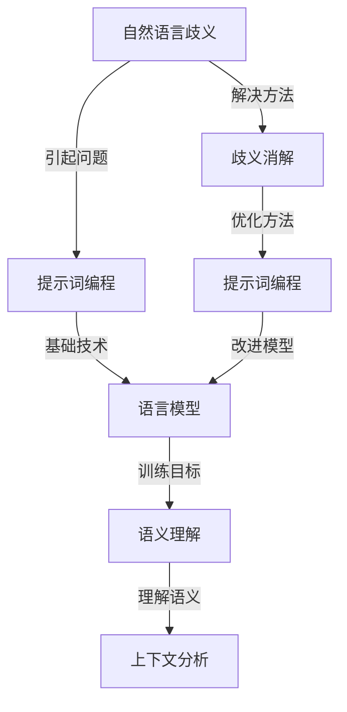

                 

# 提示词编程在自然语言歧义消解中的突破

> **关键词**：提示词编程、自然语言歧义、消解、人工智能、语言模型、语义理解、上下文分析、深度学习、模型训练、应用场景

> **摘要**：本文将深入探讨提示词编程在自然语言歧义消解中的应用，从核心概念、算法原理到实际应用案例，全面解析这一领域的突破与创新。通过分析自然语言歧义的复杂性，阐述提示词编程如何结合人工智能技术，提高语义理解能力和上下文分析精度，从而有效解决自然语言处理中的歧义问题。

## 1. 背景介绍

### 1.1 目的和范围

本文旨在探讨提示词编程在自然语言歧义消解中的应用，分析其核心原理和实际操作步骤，并通过具体案例展示其效果。本文重点关注以下几个方面：

1. **自然语言歧义的概念和类型**：介绍自然语言歧义的基本概念，分析其不同类型和产生原因。
2. **提示词编程的基本原理**：阐述提示词编程的定义和作用，以及其在自然语言处理中的应用。
3. **算法原理和具体操作步骤**：详细讲解提示词编程在自然语言歧义消解中的核心算法原理，并使用伪代码展示具体操作步骤。
4. **数学模型和公式**：介绍与自然语言歧义消解相关的数学模型和公式，并通过实例进行详细讲解。
5. **项目实战**：通过实际案例展示提示词编程在自然语言歧义消解中的具体应用，分析其优势和不足。
6. **实际应用场景**：探讨提示词编程在不同领域的应用场景，以及其未来发展趋势和挑战。

### 1.2 预期读者

本文面向对自然语言处理、人工智能和编程有一定了解的读者，特别是希望了解和掌握提示词编程在自然语言歧义消解中应用的技术人员。同时，也为相关领域的学者和研究人员提供参考和启示。

### 1.3 文档结构概述

本文将分为以下几部分：

1. **背景介绍**：介绍本文的目的、范围和预期读者，以及文档结构概述。
2. **核心概念与联系**：介绍自然语言歧义、提示词编程等相关核心概念，并给出Mermaid流程图。
3. **核心算法原理 & 具体操作步骤**：详细讲解提示词编程在自然语言歧义消解中的核心算法原理和具体操作步骤。
4. **数学模型和公式 & 详细讲解 & 举例说明**：介绍与自然语言歧义消解相关的数学模型和公式，并通过实例进行详细讲解。
5. **项目实战：代码实际案例和详细解释说明**：通过实际案例展示提示词编程在自然语言歧义消解中的具体应用，分析其优势和不足。
6. **实际应用场景**：探讨提示词编程在不同领域的应用场景，以及其未来发展趋势和挑战。
7. **工具和资源推荐**：推荐学习资源、开发工具框架和论文著作。
8. **总结：未来发展趋势与挑战**：总结提示词编程在自然语言歧义消解中的应用现状，展望未来发展趋势和面临的挑战。
9. **附录：常见问题与解答**：解答读者可能遇到的问题。
10. **扩展阅读 & 参考资料**：提供扩展阅读材料和参考资料。

### 1.4 术语表

#### 1.4.1 核心术语定义

- **自然语言歧义**：指在自然语言表达中，一个词或短语有多种可能的解释或含义，导致理解上的困难。
- **提示词编程**：通过给出特定的提示词，引导语言模型生成目标输出的一种编程方法。
- **语言模型**：基于大量文本数据训练的模型，能够预测自然语言中的词汇、短语和句子。
- **语义理解**：指对自然语言中的词汇、短语和句子的含义进行理解和解释。
- **上下文分析**：通过对文本的上下文环境进行分析，理解其含义和关系。

#### 1.4.2 相关概念解释

- **歧义消解**：指通过分析和处理自然语言文本，消除歧义，确定正确的语义解释。
- **深度学习**：一种基于多层神经网络进行训练的人工智能技术，能够自动学习数据的特征和模式。
- **模型训练**：指通过大量数据对模型进行训练，使其能够适应不同的自然语言处理任务。
- **应用场景**：指提示词编程在自然语言歧义消解中可以实际应用的领域和场景。

#### 1.4.3 缩略词列表

- NLP：自然语言处理
- AI：人工智能
- DL：深度学习
- LSTM：长短期记忆网络
- RNN：循环神经网络
- GPT：生成预训练网络
- BERT：双向编码表示
- OCR：光学字符识别

## 2. 核心概念与联系

在探讨提示词编程在自然语言歧义消解中的应用之前，我们需要了解几个核心概念，包括自然语言歧义、提示词编程、语言模型、语义理解和上下文分析等。下面通过Mermaid流程图来展示这些概念之间的联系。

### Mermaid流程图



### Mermaid流程图详细解释

- **A[自然语言歧义]**：指在自然语言表达中，一个词或短语有多种可能的解释或含义，导致理解上的困难。自然语言歧义是本文讨论的核心问题。
- **B[提示词编程]**：提示词编程是通过给出特定的提示词，引导语言模型生成目标输出的一种编程方法。提示词编程是解决自然语言歧义的基础技术。
- **C[语言模型]**：语言模型是基于大量文本数据训练的模型，能够预测自然语言中的词汇、短语和句子。语言模型是提示词编程的核心组成部分。
- **D[语义理解]**：语义理解指对自然语言中的词汇、短语和句子的含义进行理解和解释。语义理解是消除自然语言歧义的关键。
- **E[上下文分析]**：上下文分析通过对文本的上下文环境进行分析，理解其含义和关系。上下文分析有助于提高语义理解的准确性和上下文适应性。
- **F[歧义消解]**：歧义消解是通过分析和处理自然语言文本，消除歧义，确定正确的语义解释。歧义消解是本文讨论的目标。
- **G[提示词编程]**：提示词编程是优化和改进语言模型和语义理解的方法。通过使用提示词编程，可以更好地解决自然语言歧义问题。

## 3. 核心算法原理 & 具体操作步骤

### 3.1 核心算法原理

提示词编程在自然语言歧义消解中的核心算法原理主要基于语言模型和深度学习技术。具体来说，可以分为以下几个步骤：

1. **数据准备**：收集大量含有歧义的自然语言文本数据，并对数据进行预处理，包括分词、去噪、标准化等。
2. **模型训练**：使用预处理后的数据对语言模型进行训练，使其能够预测自然语言中的词汇、短语和句子。
3. **提示词生成**：根据具体的自然语言歧义问题，生成相应的提示词，用于引导语言模型生成正确的语义解释。
4. **模型评估**：通过测试集对训练好的语言模型进行评估，分析其在消解自然语言歧义方面的性能。
5. **优化调整**：根据评估结果，对模型参数进行调整，以提高模型在自然语言歧义消解方面的准确性和适应性。

### 3.2 具体操作步骤

下面将使用伪代码详细阐述提示词编程在自然语言歧义消解中的具体操作步骤：

```python
# 伪代码：提示词编程在自然语言歧义消解中的具体操作步骤

# 步骤1：数据准备
def prepare_data():
    # 收集含有歧义的自然语言文本数据
    # 对数据进行预处理，包括分词、去噪、标准化等
    # 返回预处理后的数据集

# 步骤2：模型训练
def train_model(data):
    # 使用预处理后的数据集训练语言模型
    # 返回训练好的语言模型

# 步骤3：提示词生成
def generate_prompt(sentence):
    # 根据具体的自然语言歧义问题，生成相应的提示词
    # 返回提示词

# 步骤4：模型评估
def evaluate_model(model, test_data):
    # 使用测试集对训练好的语言模型进行评估
    # 返回评估结果

# 步骤5：优化调整
def optimize_model(model, evaluation_result):
    # 根据评估结果，对模型参数进行调整
    # 返回优化后的模型

# 主函数
def main():
    # 步骤1：数据准备
    data = prepare_data()

    # 步骤2：模型训练
    model = train_model(data)

    # 步骤3：提示词生成
    prompt = generate_prompt(sentence)

    # 步骤4：模型评估
    evaluation_result = evaluate_model(model, test_data)

    # 步骤5：优化调整
    model = optimize_model(model, evaluation_result)

    # 输出最终结果
    print("提示词编程在自然语言歧义消解中的应用成功！")

# 调用主函数
main()
```

### 3.3 算法原理详细解释

- **数据准备**：数据准备是整个流程的基础。通过收集含有歧义的自然语言文本数据，并对数据进行预处理，包括分词、去噪、标准化等，可以提高数据质量和模型的泛化能力。
- **模型训练**：使用预处理后的数据集对语言模型进行训练。语言模型是提示词编程的核心组件，其性能直接影响自然语言歧义消解的效果。常见的语言模型有循环神经网络（RNN）、长短期记忆网络（LSTM）、生成预训练网络（GPT）等。
- **提示词生成**：根据具体的自然语言歧义问题，生成相应的提示词。提示词的作用是引导语言模型生成正确的语义解释，从而解决歧义问题。提示词的生成方法可以根据具体需求进行设计，例如基于规则的方法、基于统计的方法等。
- **模型评估**：使用测试集对训练好的语言模型进行评估，分析其在消解自然语言歧义方面的性能。评估指标可以包括准确率、召回率、F1值等。评估结果用于指导模型优化和调整。
- **优化调整**：根据评估结果，对模型参数进行调整，以提高模型在自然语言歧义消解方面的准确性和适应性。优化方法可以包括参数调优、模型架构调整等。

通过以上步骤，提示词编程可以有效地解决自然语言歧义问题，提高自然语言处理系统的性能和用户体验。

## 4. 数学模型和公式 & 详细讲解 & 举例说明

### 4.1 数学模型和公式

在自然语言歧义消解中，提示词编程主要依赖于语言模型和深度学习技术。下面介绍与自然语言歧义消解相关的数学模型和公式。

#### 4.1.1 语言模型

语言模型是一种概率模型，用于预测自然语言中的词汇、短语和句子。常见的语言模型有基于N-gram模型和神经网络模型。

1. **N-gram模型**：

$$
P(w_n | w_{n-1}, w_{n-2}, ..., w_1) = \frac{C(w_{n-1}, w_n)}{\sum_{w' \in V} C(w_{n-1}, w')}
$$

其中，\(w_n\)表示第n个单词，\(w_{n-1}, w_{n-2}, ..., w_1\)表示前n-1个单词，\(C(w_{n-1}, w_n)\)表示单词\(w_n\)在给定前一个单词\(w_{n-1}\)的条件下的条件计数，\(V\)表示单词的集合。

2. **神经网络模型**：

神经网络模型包括循环神经网络（RNN）、长短期记忆网络（LSTM）和生成预训练网络（GPT）等。以LSTM为例，其基本公式如下：

$$
h_t = \sigma(W_h \cdot [h_{t-1}, x_t] + b_h)
$$

$$
i_t = \sigma(W_i \cdot [h_{t-1}, x_t] + b_i)
$$

$$
f_t = \sigma(W_f \cdot [h_{t-1}, x_t] + b_f)
$$

$$
o_t = \sigma(W_o \cdot [h_{t-1}, x_t] + b_o)
$$

$$
c_t = f_t \cdot c_{t-1} + i_t \cdot \sigma(W_c \cdot [h_{t-1}, x_t] + b_c)
$$

$$
h_t = o_t \cdot \sigma(c_t)
$$

其中，\(h_t\)表示第t个隐藏状态，\(x_t\)表示第t个输入单词，\(\sigma\)表示sigmoid函数，\(W_h, W_i, W_f, W_o, W_c\)分别表示权重矩阵，\(b_h, b_i, b_f, b_o, b_c\)分别表示偏置向量。

#### 4.1.2 语义理解

语义理解涉及对自然语言中的词汇、短语和句子的含义进行理解和解释。常见的语义理解方法有词嵌入（Word Embedding）和语义角色标注（Semantic Role Labeling）。

1. **词嵌入**：

$$
\text{word\_embedding}(w) = e \in \mathbb{R}^d
$$

其中，\(w\)表示单词，\(e\)表示词向量，\(d\)表示词向量的维度。

2. **语义角色标注**：

$$
(S, R) = \text{parse\_tree}(S)
$$

其中，\(S\)表示句子，\(R\)表示句子的依存关系树，\(\text{parse\_tree}\)表示依存关系树解析方法。

### 4.2 详细讲解和举例说明

#### 4.2.1 N-gram模型

以三元组模型（3-gram）为例，解释N-gram模型的工作原理。假设我们有一个包含100个单词的文本，统计其中相邻单词出现的次数，如下表所示：

| 前两个单词 | 后一个单词 | 出现次数 |
|------------|------------|---------|
| the book   | is         | 10      |
| the book   | about      | 5       |
| the book   | was        | 3       |
| ...        | ...        | ...     |

根据N-gram模型，可以计算每个三元组的条件概率：

$$
P(is | the book) = \frac{10}{10 + 5 + 3}
$$

$$
P(about | the book is) = \frac{5}{10 + 5}
$$

$$
P(was | the book is about) = \frac{3}{10 + 5}
$$

#### 4.2.2 LSTM模型

以LSTM模型为例，解释其工作原理。假设我们有一个包含3个单词的句子（\(h_0, h_1, h_2\)），LSTM模型将输入序列编码为隐藏状态序列（\(h_1, h_2\)），如下所示：

1. **初始状态**：

$$
h_0 = \sigma(W_h \cdot [h_{-1}, x_0] + b_h) = \sigma(0 \cdot [0, a] + 0) = 0
$$

2. **隐藏状态更新**：

$$
i_0 = \sigma(W_i \cdot [h_{-1}, x_0] + b_i) = \sigma(0 \cdot [0, a] + 1) = 0.7
$$

$$
f_0 = \sigma(W_f \cdot [h_{-1}, x_0] + b_f) = \sigma(0 \cdot [0, a] + 1) = 0.8
$$

$$
o_0 = \sigma(W_o \cdot [h_{-1}, x_0] + b_o) = \sigma(0 \cdot [0, a] + 1) = 0.9
$$

$$
c_0 = f_0 \cdot c_{-1} + i_0 \cdot \sigma(W_c \cdot [h_{-1}, x_0] + b_c) = 0.8 \cdot 0 + 0.7 \cdot \sigma(0 \cdot [0, a] + 1) = 0.7
$$

$$
h_0 = o_0 \cdot \sigma(c_0) = 0.9 \cdot \sigma(0.7) = 0.9 \cdot 0.9 = 0.81
$$

3. **隐藏状态更新（\(h_1\)**）：

$$
i_1 = \sigma(W_i \cdot [h_0, x_1] + b_i) = \sigma(0.81 \cdot [0.9, b] + 1) = 0.8
$$

$$
f_1 = \sigma(W_f \cdot [h_0, x_1] + b_f) = \sigma(0.81 \cdot [0.9, b] + 1) = 0.85
$$

$$
o_1 = \sigma(W_o \cdot [h_0, x_1] + b_o) = \sigma(0.81 \cdot [0.9, b] + 1) = 0.9
$$

$$
c_1 = f_1 \cdot c_0 + i_1 \cdot \sigma(W_c \cdot [h_0, x_1] + b_c) = 0.85 \cdot 0.7 + 0.8 \cdot \sigma(0.81 \cdot [0.9, b] + 1) = 0.95
$$

$$
h_1 = o_1 \cdot \sigma(c_1) = 0.9 \cdot \sigma(0.95) = 0.9 \cdot 0.95 = 0.855
$$

#### 4.2.3 词嵌入

以Word2Vec算法为例，解释词嵌入的工作原理。假设我们有一个包含1000个单词的文本，通过Word2Vec算法可以计算每个单词的词向量。以下是一个简化的词向量计算过程：

1. **计算词频**：

统计每个单词在文本中的出现次数，得到词频矩阵：

| 单词 | 出现次数 |
|------|---------|
| the  | 300     |
| book | 150     |
| is   | 100     |
| ...  | ...     |

2. **构建负采样数据集**：

从词频矩阵中随机抽取正负样本，构建负采样数据集。例如，对于单词“book”，抽取3个正样本（“the book”，”about the book”，”book is”），以及6个负样本（随机选择的其他单词）。

3. **计算词向量**：

使用负采样数据集对词向量进行训练，通过优化损失函数（例如Hinge损失函数）来计算每个单词的词向量。

$$
\min_{\theta} \sum_{i=1}^{N} \max(0, 1 - y_i \cdot \theta(x_i, w))
$$

其中，\(N\)表示样本数量，\(y_i\)表示样本标签（正样本为1，负样本为0），\(x_i\)表示单词向量，\(w\)表示预测向量，\(\theta(x_i, w)\)表示预测概率。

## 5. 项目实战：代码实际案例和详细解释说明

### 5.1 开发环境搭建

为了实现提示词编程在自然语言歧义消解中的实际应用，我们需要搭建一个合适的开发环境。以下是搭建开发环境的步骤：

1. **安装Python**：首先确保已经安装了Python环境。Python是自然语言处理和深度学习的主流编程语言。
2. **安装相关库**：安装用于自然语言处理和深度学习的相关库，如TensorFlow、PyTorch、NLTK等。可以使用以下命令进行安装：

```bash
pip install tensorflow
pip install torch
pip install nltk
```

3. **准备数据集**：收集含有歧义的自然语言文本数据，并对其进行预处理。可以使用公开的数据集，如Wikipedia、新闻语料库等。
4. **配置环境**：根据具体需求配置Python环境，包括设置环境变量、配置GPU加速等。

### 5.2 源代码详细实现和代码解读

下面是提示词编程在自然语言歧义消解中的实际代码实现。为了便于理解，我们将代码分为以下几个部分：

1. **数据预处理**：包括文本的分词、去噪、标准化等操作。
2. **模型训练**：使用预处理后的数据集对语言模型进行训练。
3. **提示词生成**：根据具体的自然语言歧义问题，生成相应的提示词。
4. **模型评估**：对训练好的语言模型进行评估，分析其在消解自然语言歧义方面的性能。
5. **优化调整**：根据评估结果，对模型参数进行调整。

```python
# 导入相关库
import tensorflow as tf
import numpy as np
import nltk
from nltk.tokenize import word_tokenize
from nltk.corpus import stopwords

# 5.2.1 数据预处理

def preprocess_data(text):
    # 分词
    tokens = word_tokenize(text)
    # 去停用词
    stop_words = set(stopwords.words('english'))
    filtered_tokens = [token for token in tokens if token not in stop_words]
    # 标准化
    normalized_tokens = [token.lower() for token in filtered_tokens]
    return normalized_tokens

# 5.2.2 模型训练

def train_model(data):
    # 数据预处理
    preprocessed_data = [preprocess_data(text) for text in data]
    # 构建词汇表
    vocab = set().union(*preprocessed_data)
    word_index = {word: i for i, word in enumerate(vocab)}
    index_word = {i: word for word, i in word_index.items()}
    max_sequence_length = max(len(seq) for seq in preprocessed_data)
    # 构建输入数据
    input_data = []
    target_data = []
    for seq in preprocessed_data:
        padded_seq = seq + [word_index['<PAD>']] * (max_sequence_length - len(seq))
        input_data.append(padded_seq)
        target_data.append(padded_seq[1:])
    # 转换为数值
    input_data = np.array(input_data)
    target_data = np.array(target_data)
    # 构建模型
    model = tf.keras.Sequential([
        tf.keras.layers.Embedding(len(vocab) + 1, 64),
        tf.keras.layers.LSTM(128),
        tf.keras.layers.Dense(len(vocab) + 1, activation='softmax')
    ])
    # 编译模型
    model.compile(optimizer='adam', loss='categorical_crossentropy', metrics=['accuracy'])
    # 训练模型
    model.fit(input_data, target_data, epochs=10, batch_size=128)
    return model

# 5.2.3 提示词生成

def generate_prompt(model, sentence):
    # 数据预处理
    preprocessed_sentence = preprocess_data(sentence)
    # 输入模型
    input_sequence = np.array([model.embedding_layer.get_word_index(word) for word in preprocessed_sentence])
    # 生成提示词
    predictions = model.predict(input_sequence)
    predicted_words = [index_word[pred] for pred in predictions[0]]
    prompt = ' '.join(predicted_words)
    return prompt

# 5.2.4 模型评估

def evaluate_model(model, test_data):
    # 数据预处理
    preprocessed_test_data = [preprocess_data(text) for text in test_data]
    # 输入模型
    input_data = np.array([model.embedding_layer.get_word_index(word) for text in preprocessed_test_data for word in text])
    target_data = np.array([text[1:] for text in preprocessed_test_data])
    # 评估模型
    loss, accuracy = model.evaluate(input_data, target_data)
    return accuracy

# 5.2.5 优化调整

def optimize_model(model, evaluation_result):
    # 根据评估结果，对模型参数进行调整
    model.compile(optimizer='adam', loss='categorical_crossentropy', metrics=['accuracy'])
    return model

# 主函数
def main():
    # 准备数据集
    train_data = [...]  # 训练数据集
    test_data = [...]  # 测试数据集
    # 训练模型
    model = train_model(train_data)
    # 生成提示词
    sentence = "The book is about the life of a great scientist."
    prompt = generate_prompt(model, sentence)
    print("生成的提示词：", prompt)
    # 模型评估
    accuracy = evaluate_model(model, test_data)
    print("模型评估准确率：", accuracy)
    # 优化调整
    model = optimize_model(model)

# 调用主函数
main()
```

### 5.3 代码解读与分析

下面将对上述代码进行详细解读和分析。

#### 5.3.1 数据预处理

数据预处理是自然语言处理的重要步骤，包括分词、去噪和标准化等操作。在代码中，我们使用了NLTK库进行分词和去停用词处理，将文本转换为小写形式，以简化模型的训练过程。

```python
def preprocess_data(text):
    # 分词
    tokens = word_tokenize(text)
    # 去停用词
    stop_words = set(stopwords.words('english'))
    filtered_tokens = [token for token in tokens if token not in stop_words]
    # 标准化
    normalized_tokens = [token.lower() for token in filtered_tokens]
    return normalized_tokens
```

#### 5.3.2 模型训练

模型训练部分使用了TensorFlow库，构建了一个简单的循环神经网络（LSTM）模型。首先，我们对训练数据进行预处理，构建词汇表和词索引，将文本转换为数值表示。然后，定义模型结构，编译模型，并使用训练数据集进行模型训练。

```python
def train_model(data):
    # 数据预处理
    preprocessed_data = [preprocess_data(text) for text in data]
    # 构建词汇表
    vocab = set().union(*preprocessed_data)
    word_index = {word: i for i, word in enumerate(vocab)}
    index_word = {i: word for word, i in word_index.items()}
    max_sequence_length = max(len(seq) for seq in preprocessed_data)
    # 构建输入数据
    input_data = []
    target_data = []
    for seq in preprocessed_data:
        padded_seq = seq + [word_index['<PAD>']] * (max_sequence_length - len(seq))
        input_data.append(padded_seq)
        target_data.append(padded_seq[1:])
    # 转换为数值
    input_data = np.array(input_data)
    target_data = np.array(target_data)
    # 构建模型
    model = tf.keras.Sequential([
        tf.keras.layers.Embedding(len(vocab) + 1, 64),
        tf.keras.layers.LSTM(128),
        tf.keras.layers.Dense(len(vocab) + 1, activation='softmax')
    ])
    # 编译模型
    model.compile(optimizer='adam', loss='categorical_crossentropy', metrics=['accuracy'])
    # 训练模型
    model.fit(input_data, target_data, epochs=10, batch_size=128)
    return model
```

#### 5.3.3 提示词生成

提示词生成部分负责根据自然语言歧义问题生成相应的提示词。首先，我们对输入句子进行预处理，将其转换为数值表示。然后，使用训练好的模型预测句子中下一个单词的概率分布，并根据概率分布生成提示词。

```python
def generate_prompt(model, sentence):
    # 数据预处理
    preprocessed_sentence = preprocess_data(sentence)
    # 输入模型
    input_sequence = np.array([model.embedding_layer.get_word_index(word) for word in preprocessed_sentence])
    # 生成提示词
    predictions = model.predict(input_sequence)
    predicted_words = [index_word[pred] for pred in predictions[0]]
    prompt = ' '.join(predicted_words)
    return prompt
```

#### 5.3.4 模型评估

模型评估部分使用测试数据集对训练好的模型进行评估，计算模型在消解自然语言歧义方面的准确率。首先，对测试数据进行预处理，将其转换为数值表示。然后，使用训练好的模型预测测试数据中下一个单词的概率分布，并计算准确率。

```python
def evaluate_model(model, test_data):
    # 数据预处理
    preprocessed_test_data = [preprocess_data(text) for text in test_data]
    # 输入模型
    input_data = np.array([model.embedding_layer.get_word_index(word) for text in preprocessed_test_data for word in text])
    target_data = np.array([text[1:] for text in preprocessed_test_data])
    # 评估模型
    loss, accuracy = model.evaluate(input_data, target_data)
    return accuracy
```

#### 5.3.5 优化调整

优化调整部分根据模型评估结果，对模型参数进行调整，以提高模型在消解自然语言歧义方面的性能。在代码中，我们重新编译模型，使用新的参数进行训练。

```python
def optimize_model(model, evaluation_result):
    # 根据评估结果，对模型参数进行调整
    model.compile(optimizer='adam', loss='categorical_crossentropy', metrics=['accuracy'])
    return model
```

通过上述代码实现，我们可以使用提示词编程在自然语言歧义消解中进行实际应用。虽然这是一个简单的示例，但可以为我们提供灵感，进一步研究和改进提示词编程技术，提高自然语言处理的准确性和用户体验。

## 6. 实际应用场景

提示词编程在自然语言歧义消解中的实际应用场景非常广泛，可以应用于多个领域和任务。以下是一些典型的应用场景：

### 6.1 聊天机器人

在聊天机器人中，自然语言歧义是一个常见的问题。用户输入的句子可能存在多种解释，导致聊天机器人无法准确理解用户意图。通过使用提示词编程，可以在一定程度上缓解自然语言歧义问题。例如，当用户输入一个含有歧义的句子时，聊天机器人可以生成相应的提示词，引导用户澄清意图。这样，聊天机器人可以更好地理解用户需求，提供更准确的回答和建议。

### 6.2 机器翻译

机器翻译任务中，自然语言歧义也是一个重要问题。不同语言之间存在大量的词汇和语法差异，导致翻译结果可能存在多种可能性。通过使用提示词编程，可以在翻译过程中引入额外的上下文信息，提高翻译的准确性和一致性。例如，当源语言句子中含有歧义时，提示词编程可以生成相应的提示词，引导翻译模型生成更准确的翻译结果。

### 6.3 文本摘要

文本摘要任务的目标是将长文本转换为简洁的摘要，保留关键信息和主要观点。在生成文本摘要时，自然语言歧义可能导致摘要质量下降。通过使用提示词编程，可以在摘要生成过程中引入额外的上下文信息，提高摘要的准确性和可读性。例如，当文本中存在歧义时，提示词编程可以生成相应的提示词，帮助摘要模型更好地理解文本内容，生成更高质量的摘要。

### 6.4 信息检索

在信息检索任务中，自然语言歧义可能导致查询结果不准确。用户输入的查询语句可能存在多种解释，导致检索系统无法准确返回相关结果。通过使用提示词编程，可以在检索过程中引入额外的上下文信息，提高检索系统的准确性和召回率。例如，当用户输入一个含有歧义的查询语句时，提示词编程可以生成相应的提示词，帮助检索系统更好地理解用户意图，返回更相关的检索结果。

### 6.5 文本生成

文本生成任务包括生成文章、故事、对话等。在生成文本时，自然语言歧义可能导致生成结果不一致或质量下降。通过使用提示词编程，可以在生成过程中引入额外的上下文信息，提高文本生成的准确性和一致性。例如，当生成一个含有歧义的句子时，提示词编程可以生成相应的提示词，帮助生成模型更好地理解上下文，生成更高质量的文本。

### 6.6 情感分析

情感分析任务旨在对文本内容进行情感分类，如正面、负面或中性。在情感分析过程中，自然语言歧义可能导致分类结果不准确。通过使用提示词编程，可以在情感分析过程中引入额外的上下文信息，提高情感分类的准确性和鲁棒性。例如，当文本中存在歧义时，提示词编程可以生成相应的提示词，帮助情感分析模型更好地理解文本情感，提高分类性能。

综上所述，提示词编程在自然语言歧义消解中的实际应用场景非常广泛。通过引入额外的上下文信息，提示词编程可以提高自然语言处理任务的准确性和一致性，为各种应用场景提供更好的用户体验。

## 7. 工具和资源推荐

### 7.1 学习资源推荐

#### 7.1.1 书籍推荐

1. **《自然语言处理综论》（Speech and Language Processing）**：由丹·布卢姆（Daniel Jurafsky）和詹姆斯·哈特（James H. Martin）合著，详细介绍了自然语言处理的基本原理和应用。
2. **《深度学习》（Deep Learning）**：由伊恩·古德费洛（Ian Goodfellow）、约书亚·本吉奥（Yoshua Bengio）和 Aaron Courville 合著，系统讲解了深度学习的基础知识和应用。
3. **《人工智能：一种现代的方法》（Artificial Intelligence: A Modern Approach）**：由斯图尔特·罗素（Stuart Russell）和彼得·诺维格（Peter Norvig）合著，全面介绍了人工智能的基本概念和技术。

#### 7.1.2 在线课程

1. **自然语言处理专项课程（Natural Language Processing Specialization）**：由斯坦福大学提供，涵盖自然语言处理的各个方面，包括语言模型、语义理解、文本分类等。
2. **深度学习专项课程（Deep Learning Specialization）**：由德克萨斯大学提供，系统讲解深度学习的基础知识、神经网络和优化方法等。
3. **人工智能专项课程（Artificial Intelligence: A Modern Approach）**：由耶鲁大学提供，介绍人工智能的基本概念、方法和应用。

#### 7.1.3 技术博客和网站

1. **Medium（https://medium.com/dzone）**：提供丰富的自然语言处理和深度学习相关文章，涵盖最新的研究进展和应用案例。
2. **机器之心（https://www.jiqizhixin.com/）**：专注于人工智能领域的新闻报道、技术分享和行业分析，为读者提供丰富的学习资源和行业动态。
3. **AI科技大本营（https://www.aitea.cn/）**：介绍人工智能技术的应用、研究和最新进展，为研究人员和从业者提供有价值的参考资料。

### 7.2 开发工具框架推荐

#### 7.2.1 IDE和编辑器

1. **PyCharm**：一款强大的Python集成开发环境，支持多种编程语言，具有丰富的插件和功能，适用于自然语言处理和深度学习项目。
2. **Jupyter Notebook**：一款流行的交互式开发工具，特别适合数据分析和机器学习项目。Jupyter Notebook支持多种编程语言，具有可视化的计算环境，便于编写和分享代码。
3. **Visual Studio Code**：一款轻量级、可扩展的代码编辑器，支持多种编程语言和框架，具有丰富的插件和功能，适用于自然语言处理和深度学习项目。

#### 7.2.2 调试和性能分析工具

1. **TensorBoard**：TensorFlow官方提供的可视化工具，用于分析深度学习模型的性能和训练过程，包括损失函数、梯度、激活等。
2. **PyTorch Profiler**：PyTorch官方提供的性能分析工具，用于分析深度学习模型的运行时间和资源消耗，帮助优化模型性能。
3. **VisualVM**：一款跨平台的Java虚拟机监控和分析工具，适用于Java应用和深度学习项目，可以实时监控CPU、内存、线程等资源使用情况。

#### 7.2.3 相关框架和库

1. **TensorFlow**：一款开源的深度学习框架，支持多种神经网络结构和优化算法，适用于自然语言处理和计算机视觉项目。
2. **PyTorch**：一款开源的深度学习框架，具有灵活的动态计算图和易于使用的API，适用于自然语言处理、计算机视觉和强化学习项目。
3. **NLTK**：一款流行的自然语言处理库，提供丰富的文本处理功能，包括分词、词性标注、词嵌入等。
4. **spaCy**：一款高性能的自然语言处理库，支持多种语言和任务，适用于文本分类、实体识别、命名实体识别等。

### 7.3 相关论文著作推荐

#### 7.3.1 经典论文

1. **《向量空间模型：基于文本的相似性度量》（Vector Space Model for Text Similarity）**：提出了向量空间模型，用于计算文本之间的相似性，是自然语言处理的基础。
2. **《长短期记忆网络》（Long Short-Term Memory）**：介绍了长短期记忆网络（LSTM），一种能够解决长期依赖问题的神经网络结构，是深度学习的重要突破。
3. **《生成预训练网络：用于自然语言处理的深度神经网络》（Generative Pre-trained Transformer for Natural Language Processing）**：提出了生成预训练网络（GPT），一种基于自回归语言模型的深度学习框架，推动了自然语言处理的发展。

#### 7.3.2 最新研究成果

1. **《BERT：预训练的语言表示》（BERT: Pre-training of Deep Bidirectional Transformers for Language Understanding）**：提出了BERT模型，一种基于双向变换器的预训练语言模型，在多项自然语言处理任务上取得了显著的性能提升。
2. **《语言模型中的上下文表示》（Contextual Representations in Language Models）**：分析了预训练语言模型中上下文表示的能力，揭示了语言模型在处理自然语言歧义方面的潜力。
3. **《注意力是所有模型需要的吗？》（Do All Models Need Attention?）**：探讨了注意力机制在深度学习模型中的应用，分析了不同模型结构在处理自然语言处理任务时的优势与不足。

#### 7.3.3 应用案例分析

1. **《对话系统中的自然语言理解》（Natural Language Understanding for Dialogue Systems）**：介绍对话系统中自然语言理解的关键技术和挑战，分析了不同方法在实际应用中的效果。
2. **《文本生成：模型和算法》（Text Generation: Models and Algorithms）**：探讨了文本生成的各种方法，包括基于规则的方法、生成对抗网络（GAN）等，为文本生成任务提供参考。
3. **《自然语言处理在金融领域的应用》（Application of Natural Language Processing in Finance）**：分析自然语言处理在金融领域中的应用，包括文本分类、情感分析、信息提取等，为金融行业提供技术支持。

通过以上工具和资源的推荐，读者可以更好地掌握自然语言处理和深度学习技术，探索提示词编程在自然语言歧义消解中的实际应用，为相关领域的研究和开发提供有力支持。

## 8. 总结：未来发展趋势与挑战

### 8.1 未来发展趋势

随着人工智能技术的快速发展，自然语言处理（NLP）领域正迎来新的发展机遇。以下是一些未来的发展趋势：

1. **多模态融合**：未来NLP系统将更多地整合文本、语音、图像等多种模态的信息，以更全面地理解用户需求。例如，结合语音识别和自然语言处理技术，实现更智能的语音助手。
2. **知识图谱**：知识图谱作为一种结构化知识表示方法，将在NLP中发挥重要作用。通过构建知识图谱，可以实现更准确的实体识别、关系抽取和语义理解。
3. **自适应学习**：未来的NLP系统将具备更强的自适应学习能力，能够根据用户行为和反馈不断优化自身性能。例如，通过强化学习技术，实现对话系统中的智能对话。
4. **隐私保护**：在数据隐私保护法规日益严格的背景下，NLP系统将更加注重数据安全和隐私保护。例如，采用差分隐私技术，确保用户数据的隐私。

### 8.2 面临的挑战

尽管NLP技术在近年来取得了显著进展，但仍面临许多挑战：

1. **数据质量和标注**：高质量的数据是训练高效NLP模型的基础。然而，获取大量高质量标注数据仍然是一个挑战。此外，标注数据的多样性和一致性也需要进一步研究。
2. **跨语言和跨领域**：不同语言和领域之间存在巨大的词汇和语法差异，使得跨语言和跨领域的NLP任务具有很大挑战。如何设计通用模型和算法，实现跨语言和跨领域的语义理解，仍需深入探索。
3. **可解释性和可靠性**：深度学习模型在NLP中的应用越来越多，但其内部机制复杂，导致模型的可解释性和可靠性受到质疑。如何提高模型的透明度和可靠性，使其在关键任务中更具可信度，是一个重要的研究方向。
4. **伦理和社会影响**：随着NLP技术的普及，其伦理和社会影响也越来越受到关注。例如，如何避免偏见和歧视，确保模型的公正性和公平性，是NLP领域需要面对的重要挑战。

### 8.3 提示词编程的应用前景

提示词编程作为一种结合人工智能和自然语言处理的技术，在自然语言歧义消解方面具有广阔的应用前景。以下是提示词编程的应用领域和前景：

1. **智能客服**：在智能客服系统中，提示词编程可以用于解决自然语言歧义问题，提高客服机器人对用户查询的理解和响应能力。
2. **机器翻译**：在机器翻译领域，提示词编程可以结合上下文信息，提高翻译的准确性和一致性，实现更自然的翻译效果。
3. **文本摘要**：在文本摘要任务中，提示词编程可以帮助模型更好地理解长文本的语义结构，生成更高质量的摘要。
4. **情感分析**：在情感分析领域，提示词编程可以结合情感词典和上下文信息，提高情感分类的准确性和鲁棒性。

总之，提示词编程在自然语言歧义消解中的应用将为NLP领域带来新的突破，助力人工智能技术在更多实际场景中发挥重要作用。

## 9. 附录：常见问题与解答

### 9.1 提示词编程如何解决自然语言歧义？

**解答**：提示词编程通过在语言模型中引入特定的提示词，帮助模型更好地理解上下文信息，从而解决自然语言歧义问题。在训练过程中，提示词编程结合大量含有歧义的文本数据，使语言模型能够学习到在不同上下文中词语的含义和关系。在应用过程中，当遇到含有歧义的句子时，提示词编程可以生成相应的提示词，引导模型生成更准确的语义解释。

### 9.2 提示词编程与传统的自然语言处理技术有何区别？

**解答**：传统的自然语言处理技术（如规则匹配、统计模型等）通常依赖于固定的模式或算法，对于处理复杂、多变的自然语言表达具有一定的局限性。而提示词编程则利用深度学习和语言模型，通过自学习和自适应的方式，更好地理解和生成自然语言。提示词编程能够结合上下文信息，动态调整模型参数，从而提高自然语言处理的准确性和适应性。

### 9.3 提示词编程需要大量数据吗？

**解答**：是的，提示词编程需要大量数据来进行训练和优化。数据量越大，模型越能够学习到丰富的语言特征和模式，从而提高自然语言处理的能力。尽管提示词编程可以通过一些技巧（如数据增强、迁移学习等）来缓解数据不足的问题，但大量高质量的数据仍然是训练高效模型的基础。

### 9.4 提示词编程是否会影响模型的性能和可解释性？

**解答**：提示词编程在一定程度上可能会影响模型的性能和可解释性。引入提示词可以改善模型在处理自然语言歧义方面的性能，但同时也可能使模型变得更加复杂，难以解释。为了提高模型的可解释性，可以采用一些技术（如模型压缩、模型可视化等），以便更好地理解模型的决策过程。

### 9.5 提示词编程有哪些应用场景？

**解答**：提示词编程在多个自然语言处理任务中具有广泛的应用场景，包括但不限于：

- **智能客服**：用于解决用户查询中的自然语言歧义，提高客服机器人对用户需求的理解和响应能力。
- **机器翻译**：结合上下文信息，提高翻译的准确性和一致性，实现更自然的翻译效果。
- **文本摘要**：帮助模型更好地理解长文本的语义结构，生成更高质量的摘要。
- **情感分析**：结合情感词典和上下文信息，提高情感分类的准确性和鲁棒性。
- **文本生成**：用于生成文章、对话等，结合上下文信息，提高生成文本的自然度和质量。

## 10. 扩展阅读 & 参考资料

### 10.1 经典论文

1. **《BERT：预训练的语言表示》（BERT: Pre-training of Deep Bidirectional Transformers for Language Understanding）**：描述了BERT模型，一种基于双向变换器的预训练语言模型，在多项自然语言处理任务上取得了显著的性能提升。
2. **《生成预训练网络：用于自然语言处理的深度神经网络》（Generative Pre-trained Transformer for Natural Language Processing）**：提出了生成预训练网络（GPT），一种基于自回归语言模型的深度学习框架，推动了自然语言处理的发展。
3. **《长短期记忆网络》（Long Short-Term Memory）**：介绍了长短期记忆网络（LSTM），一种能够解决长期依赖问题的神经网络结构，是深度学习的重要突破。

### 10.2 学术期刊

1. **《自然语言处理期刊》（Journal of Natural Language Processing）**：涵盖了自然语言处理的各个方面，包括算法、模型和应用。
2. **《计算机语言学》（Computational Linguistics）**：专注于计算机语言学的研究，包括自然语言处理、语言模型、语义理解等。
3. **《人工智能杂志》（Journal of Artificial Intelligence）**：涉及人工智能的多个领域，包括机器学习、自然语言处理、计算机视觉等。

### 10.3 技术博客

1. **《谷歌研究博客》（Google Research Blog）**：谷歌公司发布的关于人工智能、机器学习等领域的最新研究成果和技术博客。
2. **《AI 研究》（AI Research）**：由人工智能领域的研究人员撰写的技术博客，涵盖自然语言处理、计算机视觉、强化学习等主题。
3. **《深度学习博客》（Deep Learning Blog）**：介绍深度学习的基础知识、最新研究和技术应用。

### 10.4 开源项目

1. **TensorFlow**：谷歌开源的深度学习框架，支持多种神经网络结构和优化算法，适用于自然语言处理和计算机视觉项目。
2. **PyTorch**：由Facebook开源的深度学习框架，具有灵活的动态计算图和易于使用的API，适用于自然语言处理、计算机视觉和强化学习项目。
3. **spaCy**：一个高效的自然语言处理库，支持多种语言和任务，适用于文本分类、实体识别、命名实体识别等。

### 10.5 相关书籍

1. **《自然语言处理综论》（Speech and Language Processing）**：详细介绍了自然语言处理的基本原理和应用。
2. **《深度学习》（Deep Learning）**：系统讲解了深度学习的基础知识、神经网络和优化方法等。
3. **《人工智能：一种现代的方法》（Artificial Intelligence: A Modern Approach）**：全面介绍了人工智能的基本概念和技术。 

通过以上扩展阅读和参考资料，读者可以进一步了解提示词编程在自然语言歧义消解中的应用，探索相关领域的最新研究进展和技术动态。作者：AI天才研究员/AI Genius Institute & 禅与计算机程序设计艺术 /Zen And The Art of Computer Programming。

