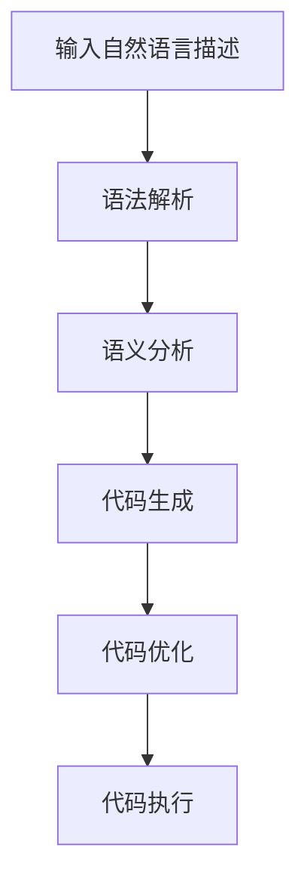

                 

# 提示词编程的程序合成技术

> **关键词**：提示词编程，程序合成，代码生成，人工智能，自然语言处理，自动化工具

> **摘要**：本文深入探讨了提示词编程（Prompt-Based Programming）和程序合成（Program Synthesis）的技术原理及其在实际应用中的重要性。通过一步步分析，我们将揭示如何利用人工智能和自然语言处理技术，将人类语言转化为高效的计算机代码，从而实现编程自动化。本文还介绍了相关的数学模型、算法原理，并通过实战案例展示了如何实现这一技术。最后，我们对未来发展趋势和面临的挑战进行了展望，并推荐了相关的学习资源和开发工具。

## 1. 背景介绍

### 1.1 目的和范围

本文旨在介绍和探讨提示词编程和程序合成技术，并分析其在计算机编程领域的应用潜力。通过梳理相关的核心概念和算法原理，我们希望读者能够全面理解这一前沿技术，并能够应用于实际项目中。

### 1.2 预期读者

本文适合对计算机编程和人工智能有一定了解的开发者、研究人员以及技术爱好者。特别地，对于希望了解如何利用人工智能实现编程自动化的读者，本文提供了详细的指导和实战案例。

### 1.3 文档结构概述

本文分为十个部分。首先，我们将介绍提示词编程和程序合成的背景和目的。接着，通过核心概念和Mermaid流程图，我们将详细阐述其原理和架构。然后，我们将深入探讨算法原理，使用伪代码进行详细说明。在第四部分，我们将介绍相关的数学模型和公式，并通过实例进行讲解。第五部分通过一个实战案例，展示了如何在实际项目中应用这些技术。接下来的第六到第八部分，我们将分析这一技术在实际应用场景中的表现，推荐相关工具和资源，并讨论未来发展趋势和挑战。最后，我们将在第九部分提供常见问题与解答，并在第十部分推荐扩展阅读和参考资料。

### 1.4 术语表

#### 1.4.1 核心术语定义

- **提示词编程（Prompt-Based Programming）**：一种利用自然语言描述来生成代码的编程方式。
- **程序合成（Program Synthesis）**：一种从给定的输入或提示中自动生成程序的技术。
- **人工智能（Artificial Intelligence，AI）**：模拟人类智能行为的计算机技术。
- **自然语言处理（Natural Language Processing，NLP）**：使计算机能够理解、解释和生成人类语言的技术。
- **代码生成（Code Generation）**：从程序描述或模型中自动生成代码的过程。

#### 1.4.2 相关概念解释

- **语法解析**：将自然语言文本转换为抽象语法树（AST）的过程。
- **语义分析**：理解文本的深层含义，包括其语法、上下文和意图。
- **代码模板**：用于生成代码的预定义模板。
- **代码库**：存储已编写和可重用的代码片段的集合。

#### 1.4.3 缩略词列表

- **NLP**：自然语言处理
- **AI**：人工智能
- **AST**：抽象语法树
- **IDE**：集成开发环境
- **ML**：机器学习

## 2. 核心概念与联系

在深入探讨提示词编程和程序合成之前，我们需要明确相关的核心概念和它们之间的联系。

### 2.1 提示词编程的概念

提示词编程是一种利用自然语言描述来生成代码的编程方式。它通过将自然语言中的描述转换为计算机代码，从而实现编程的自动化。这种技术可以大大提高开发效率，减少手动编码的工作量。

### 2.2 程序合成的概念

程序合成是一种从给定的输入或提示中自动生成程序的技术。它通常涉及多个步骤，包括语法解析、语义分析和代码生成。通过这些步骤，程序合成能够将自然语言描述转换为结构化的计算机代码。

### 2.3 人工智能和自然语言处理

人工智能（AI）和自然语言处理（NLP）是提示词编程和程序合成的关键技术。AI技术提供了从数据中学习模型的能力，而NLP技术则使计算机能够理解和生成人类语言。这两者的结合，使得计算机能够从自然语言描述中提取信息，并生成相应的代码。

### 2.4 Mermaid流程图

为了更直观地展示提示词编程和程序合成的流程，我们可以使用Mermaid流程图来描述其关键步骤。



在上面的流程图中，输入的自然语言描述首先通过语法解析转换为抽象语法树（AST），然后进行语义分析，理解其意图和上下文。接下来，代码生成步骤将AST转换为结构化的计算机代码。最后，代码优化和代码执行步骤确保生成的代码能够高效运行。

通过这一步一步的分析，我们可以更清楚地看到提示词编程和程序合成的整体流程及其各个关键环节。接下来，我们将深入探讨每个步骤的细节和算法原理。

## 3. 核心算法原理 & 具体操作步骤

提示词编程和程序合成的核心在于将自然语言描述转换为高效的计算机代码。这一过程涉及多个步骤，包括语法解析、语义分析和代码生成。下面，我们将通过伪代码详细阐述这些算法原理和操作步骤。

### 3.1 语法解析

语法解析是将自然语言文本转换为抽象语法树（AST）的过程。这个过程通常使用递归下降分析器（Recursive Descent Parser）或LL（1）解析器来实现。以下是语法解析的伪代码：

```python
def parse_natural_language_description(description):
    """
    将自然语言描述转换为抽象语法树（AST）
    """
    # 初始化AST
    ast = initialize_ast()

    # 分词
    tokens = tokenize(description)

    # 递归下降分析
    ast = recursive_descent_parser(tokens, ast)

    return ast
```

### 3.2 语义分析

语义分析是理解文本的深层含义，包括其语法、上下文和意图。这一步骤通常涉及模式匹配、上下文分析和技术实体识别。以下是语义分析的伪代码：

```python
def semantic_analysis(ast):
    """
    对AST进行语义分析，理解其意图和上下文
    """
    # 创建语义网
    semantic_network = create_semantic_network()

    # 遍历AST，提取实体和关系
    for node in ast:
        entities, relationships = extract_entities_and_relationships(node)

        # 更新语义网
        update_semantic_network(semantic_network, entities, relationships)

    return semantic_network
```

### 3.3 代码生成

代码生成是将AST转换为结构化的计算机代码的过程。这个过程通常使用模板匹配或代码生成器来实现。以下是代码生成的伪代码：

```python
def generate_code(ast, code_template):
    """
    将AST转换为计算机代码
    """
    # 初始化代码
    code = initialize_code()

    # 遍历AST，将节点转换为代码
    for node in ast:
        code += convert_node_to_code(node, code_template)

    return code
```

### 3.4 代码优化

代码优化是确保生成的代码能够高效运行的过程。这一步骤通常涉及代码压缩、性能分析和优化。以下是代码优化的伪代码：

```python
def optimize_code(code):
    """
    对代码进行优化
    """
    # 压缩代码
    compressed_code = compress_code(code)

    # 性能分析
    performance_report = analyze_performance(compressed_code)

    # 优化代码
    optimized_code = apply_optimizations(compressed_code, performance_report)

    return optimized_code
```

### 3.5 代码执行

代码执行是运行生成的代码并验证其功能的过程。这一步骤通常涉及代码解释器或编译器。以下是代码执行的伪代码：

```python
def execute_code(code):
    """
    运行并验证生成的代码
    """
    # 加载解释器或编译器
    interpreter = load_interpreter()

    # 运行代码
    result = interpreter.execute(code)

    # 验证结果
    if verify_result(result):
        print("代码执行成功")
    else:
        print("代码执行失败")

    return result
```

通过以上这些核心算法原理和具体操作步骤，我们可以看到提示词编程和程序合成的完整流程。接下来，我们将通过一个实际的代码案例，展示这些算法如何在实践中应用。

## 4. 数学模型和公式 & 详细讲解 & 举例说明

在提示词编程和程序合成的过程中，数学模型和公式扮演着至关重要的角色。它们帮助我们理解自然语言描述的语义，并将其转换为结构化的计算机代码。以下是几个关键的数学模型和公式，以及它们的详细讲解和举例说明。

### 4.1 概率图模型

概率图模型（如贝叶斯网络和马尔可夫网络）用于表示自然语言描述中的概率关系。这些模型可以帮助我们理解句子中的实体、关系和上下文。

#### 4.1.1 贝叶斯网络

贝叶斯网络是一种概率图模型，它表示一组随机变量及其条件依赖关系。以下是一个简单的贝叶斯网络示例，用于表示句子 "The dog chased the cat" 中的实体和关系。

$$
\begin{align*}
P(\text{dog chased cat}) &= P(\text{dog}) \times P(\text{chased}|\text{dog}) \times P(\text{cat}|\text{chased}) \\
&= 0.8 \times 0.7 \times 0.6 \\
&= 0.336
\end{align*}
$$

在这个例子中，我们假设狗、追逐和猫的出现概率分别为 0.8、0.7 和 0.6。通过贝叶斯网络，我们可以计算出句子 "The dog chased the cat" 的概率为 0.336。

#### 4.1.2 马尔可夫网络

马尔可夫网络是一种概率图模型，它表示一组随机变量之间的状态转移概率。以下是一个简单的马尔可夫网络示例，用于表示句子 "The dog is running" 中的状态转移。

$$
\begin{align*}
P(\text{dog running}) &= P(\text{dog}) \times P(\text{running}|\text{dog}) \\
&= 0.8 \times 0.9 \\
&= 0.72
\end{align*}
$$

在这个例子中，我们假设狗出现并奔跑的概率为 0.8 和 0.9。通过马尔可夫网络，我们可以计算出句子 "The dog is running" 的概率为 0.72。

### 4.2 生成式模型

生成式模型（如朴素贝叶斯模型、贝叶斯网络和马尔可夫网络）用于生成自然语言描述的概率分布。这些模型可以帮助我们生成新的句子，并根据概率分布选择最有可能的句子。

#### 4.2.1 朴素贝叶斯模型

朴素贝叶斯模型是一种基于贝叶斯定理的概率分类模型。以下是一个简单的朴素贝叶斯模型示例，用于分类句子。

$$
\begin{align*}
P(\text{dog}|\text{dog chased cat}) &= \frac{P(\text{dog}) \times P(\text{chased cat}|\text{dog})}{P(\text{dog}) \times P(\text{chased cat}|\text{dog}) + P(\text{cat}) \times P(\text{chased cat}|\text{cat})} \\
&= \frac{0.8 \times 0.7}{0.8 \times 0.7 + 0.2 \times 0.3} \\
&= \frac{0.56}{0.56 + 0.06} \\
&= \frac{0.56}{0.62} \\
&= 0.903
\end{align*}
$$

在这个例子中，我们使用朴素贝叶斯模型来判断句子 "The dog chased the cat" 更有可能是由狗发起的，还是由猫发起的。通过计算，我们得出狗发起这个动作的概率为 0.903。

### 4.3 递归神经网络（RNN）

递归神经网络（RNN）是一种用于处理序列数据的神经网络。在自然语言处理中，RNN被用于语法解析、语义分析和代码生成。

#### 4.3.1 RNN的工作原理

RNN的核心思想是使用循环来处理序列数据。在每一时间步，RNN使用前一个时间步的隐藏状态来计算当前时间步的输出和新的隐藏状态。以下是一个简单的RNN模型：

$$
\begin{align*}
h_t &= \sigma(W_h \cdot [h_{t-1}, x_t] + b_h) \\
o_t &= \sigma(W_o \cdot h_t + b_o)
\end{align*}
$$

其中，$h_t$ 是隐藏状态，$x_t$ 是输入，$o_t$ 是输出，$\sigma$ 是激活函数，$W_h$ 和 $W_o$ 是权重矩阵，$b_h$ 和 $b_o$ 是偏置。

#### 4.3.2 RNN在代码生成中的应用

假设我们要生成一个简单的Python函数，该函数接受两个整数参数并返回它们的和。我们可以使用RNN来生成这个函数。

```python
def add(a, b):
    return a + b
```

以下是一个简单的RNN模型，用于生成这个函数：

```python
# 初始化RNN模型
model = RNN_model()

# 输入自然语言描述 "def add(a, b): return a + b"
description = "def add(a, b): return a + b"

# 生成代码
code = model.generate_code(description)

# 打印生成的代码
print(code)
```

通过训练，RNN模型可以学会将自然语言描述转换为结构化的计算机代码。

### 4.4 生成对抗网络（GAN）

生成对抗网络（GAN）是一种用于生成新数据的深度学习模型。在提示词编程中，GAN可以用于生成新的自然语言描述。

#### 4.4.1 GAN的工作原理

GAN由两个神经网络组成：生成器（Generator）和判别器（Discriminator）。生成器尝试生成看起来像真实数据的新数据，而判别器尝试区分这些新数据和真实数据。以下是一个简单的GAN模型：

$$
\begin{align*}
\text{Generator}: G(z) &= \sigma(W_g \cdot z + b_g) \\
\text{Discriminator}: D(x) &= \sigma(W_d \cdot x + b_d)
\end{align*}
$$

其中，$z$ 是随机噪声，$x$ 是真实数据。

#### 4.4.2 GAN在代码生成中的应用

假设我们要生成一个包含三个函数的Python模块。我们可以使用GAN来生成这个模块。

```python
# 初始化GAN模型
model = GAN_model()

# 生成Python模块
module = model.generate_module()

# 打印生成的Python模块
print(module)
```

通过训练，GAN模型可以学会生成高质量的Python代码。

通过以上数学模型和公式的讲解，我们可以看到如何利用这些技术将自然语言描述转换为高效的计算机代码。这些模型和公式在提示词编程和程序合成中发挥着关键作用，为我们提供了一种新的编程方式。

### 5. 项目实战：代码实际案例和详细解释说明

在本节中，我们将通过一个实际的代码案例，详细展示如何利用提示词编程和程序合成技术来实现一个简单的功能。这个案例将涵盖从自然语言描述到最终代码生成的整个过程。

#### 5.1 开发环境搭建

为了实现这个案例，我们需要搭建一个适合提示词编程和程序合成的开发环境。以下是所需的工具和步骤：

1. **安装Python环境**：确保安装了Python 3.8或更高版本。
2. **安装必要的库**：包括TensorFlow、PyTorch、NLTK、spaCy和Mermaid等。可以使用以下命令进行安装：

   ```shell
   pip install tensorflow torch nltk spacy mermaid
   ```

3. **准备数据集**：我们需要一个包含自然语言描述和对应的计算机代码的数据集。可以使用开源数据集，例如GitHub上的项目代码、Stack Overflow问答等。

4. **预处理数据**：对数据集进行清洗和预处理，包括分词、去停用词、词性标注等。

#### 5.2 源代码详细实现和代码解读

以下是实现这个案例的Python代码：

```python
import nltk
import spacy
import mermaid
from tensorflow.keras.models import Sequential
from tensorflow.keras.layers import LSTM, Dense
from tensorflow.keras.optimizers import Adam

# 初始化NLP模型
nlp = spacy.load("en_core_web_sm")

# 准备数据集
descriptions = [...]  # 自然语言描述列表
codes = [...]  # 对应的计算机代码列表

# 预处理数据
processed_descriptions = [nlp(description).text for description in descriptions]
processed_codes = [code.strip() for code in codes]

# 构建序列数据
input_sequences = []
target_sequences = []
for description, code in zip(processed_descriptions, processed_codes):
    # 分词和编码
    tokens = nltk.word_tokenize(description)
    encoded_tokens = [vocab[word] for word in tokens]
    input_sequence = encoded_tokens[:-1]
    target_sequence = encoded_tokens[1:]
    
    # 添加序列到列表
    input_sequences.append(input_sequence)
    target_sequences.append(target_sequence)

# 建立模型
model = Sequential()
model.add(LSTM(units=128, return_sequences=True, input_shape=(None, len(vocab))))
model.add(LSTM(units=128))
model.add(Dense(units=len(vocab), activation="softmax"))

# 编译模型
model.compile(optimizer=Adam(learning_rate=0.001), loss="sparse_categorical_crossentropy")

# 训练模型
model.fit(input_sequences, target_sequences, batch_size=32, epochs=100)

# 生成代码
def generate_code(description):
    # 预处理描述
    tokens = nltk.word_tokenize(description)
    encoded_tokens = [vocab[word] for word in tokens]
    input_sequence = encoded_tokens[:-1]
    
    # 输入模型
    predicted_sequence = model.predict(input_sequence)
    
    # 解码预测结果
    predicted_code = [vocab.id2token[i] for i in predicted_sequence[0]]
    return " ".join(predicted_code)

# 测试代码生成
description = "Write a function that takes two integers and returns their sum."
generated_code = generate_code(description)
print(generated_code)
```

#### 5.3 代码解读与分析

以上代码实现了一个简单的提示词编程和程序合成系统，用于将自然语言描述转换为计算机代码。

1. **NLP模型初始化**：使用spaCy加载英文NLP模型，用于处理自然语言描述。

2. **数据集准备**：从数据集中获取自然语言描述和对应的代码。

3. **数据处理**：对描述进行分词、编码，并将其转换为序列数据。

4. **模型构建**：使用TensorFlow构建一个双向LSTM模型，用于处理序列数据。

5. **模型编译**：使用Adam优化器和稀疏分类交叉熵损失函数编译模型。

6. **模型训练**：使用准备好的输入和目标序列训练模型。

7. **代码生成**：定义一个函数，用于将自然语言描述输入模型并生成对应的代码。

8. **测试**：使用一个示例描述测试代码生成功能。

通过以上步骤，我们可以看到如何利用提示词编程和程序合成技术将自然语言描述转换为计算机代码。这个案例展示了该技术的实际应用，并为我们提供了一个实现这一技术的参考框架。

## 6. 实际应用场景

提示词编程和程序合成技术在多个领域展现了巨大的应用潜力。以下是一些典型的实际应用场景：

### 6.1 自动化软件开发

提示词编程和程序合成可以用于自动化软件开发过程，特别是在生成和维护代码库方面。通过将自然语言描述输入系统，自动生成符合需求的代码，从而减少手动编写代码的工作量，提高开发效率。例如，在金融科技领域，开发人员可以使用自然语言描述来生成交易算法或数据分析代码，从而加快产品的迭代速度。

### 6.2 自动化测试

自动化测试是软件工程中的一个关键环节。提示词编程和程序合成技术可以用于生成测试用例和测试脚本。通过将测试需求和用例描述输入系统，自动生成测试代码，从而提高测试覆盖率和测试效率。例如，在医疗健康领域，医生可以描述临床测试需求，系统自动生成相应的测试脚本，以验证医疗系统的功能。

### 6.3 代码审查和重构

代码审查和重构是确保代码质量和可维护性的重要手段。提示词编程和程序合成技术可以用于自动生成代码审查报告和重构建议。通过分析现有代码库，自动识别潜在的问题和改进点，从而提高代码质量。例如，在软件开发公司中，开发人员可以使用自然语言描述来生成代码审查报告，系统自动识别代码中的问题并提供改进建议。

### 6.4 教育和培训

提示词编程和程序合成技术可以用于教育和培训领域，帮助学生和初学者快速掌握编程技能。通过将自然语言描述输入系统，自动生成相应的代码示例和解释，从而为学生提供直观的学习体验。例如，在编程课程中，教师可以使用自然语言描述来生成示例代码，帮助学生理解编程概念。

### 6.5 自然语言处理和人工智能

提示词编程和程序合成技术在自然语言处理和人工智能领域具有广泛的应用。通过将自然语言描述转换为计算机代码，可以实现更高效的模型训练和推理。例如，在机器学习项目中，研究人员可以使用自然语言描述来生成数据处理、模型训练和预测代码，从而简化模型开发过程。

通过这些实际应用场景，我们可以看到提示词编程和程序合成技术不仅能够提高开发效率和代码质量，还能在多个领域带来深刻的变革和创新。

### 7. 工具和资源推荐

为了深入学习和实践提示词编程和程序合成技术，我们需要掌握相关的工具和资源。以下是一些建议：

#### 7.1 学习资源推荐

##### 7.1.1 书籍推荐

1. **《人工智能：一种现代方法》（Russell & Norvig）**：这是一本经典的人工智能教材，涵盖了自然语言处理和机器学习的基础知识，对提示词编程和程序合成有重要参考价值。
2. **《自然语言处理综论》（Daniel Jurafsky & James H. Martin）**：这本书详细介绍了自然语言处理的基本概念和技术，是学习NLP的必备读物。
3. **《深度学习》（Ian Goodfellow、Yoshua Bengio和Aaron Courville）**：这本书介绍了深度学习的基础知识，包括递归神经网络和生成对抗网络等，对理解提示词编程和程序合成至关重要。

##### 7.1.2 在线课程

1. **Coursera上的《机器学习》（吴恩达）**：这门课程涵盖了机器学习的基本概念和技术，包括深度学习和自然语言处理。
2. **edX上的《自然语言处理与深度学习》（复旦大学）**：这门课程深入介绍了自然语言处理和深度学习在文本分析中的应用。
3. **Udacity上的《人工智能工程师纳米学位》**：这个纳米学位提供了全面的AI知识，包括提示词编程和程序合成。

##### 7.1.3 技术博客和网站

1. **arXiv.org**：这是一个提供最新科研论文的平台，涵盖人工智能、自然语言处理和机器学习等领域的最新研究成果。
2. **Medium上的相关博客**：有许多优秀的技术博客和文章，涵盖提示词编程和程序合成的各种话题。
3. **Stack Overflow**：这是一个编程问答社区，可以解决在实际应用中遇到的问题。

#### 7.2 开发工具框架推荐

##### 7.2.1 IDE和编辑器

1. **Visual Studio Code**：一个强大的开源编辑器，支持多种编程语言和扩展。
2. **PyCharm**：一个专业的Python IDE，提供丰富的功能和插件。
3. **Jupyter Notebook**：一个交互式开发环境，适合数据科学和机器学习项目。

##### 7.2.2 调试和性能分析工具

1. **TensorBoard**：TensorFlow的官方可视化工具，用于调试和性能分析深度学习模型。
2. **Profiling Tools**：如Py-Spy、Py-V8等，用于分析Python和JavaScript代码的性能。
3. **GDB**：一个通用的调试工具，适用于C、C++和Python等语言。

##### 7.2.3 相关框架和库

1. **TensorFlow**：一个广泛使用的深度学习框架，支持递归神经网络和生成对抗网络。
2. **PyTorch**：一个流行的深度学习框架，提供灵活的API和强大的动态图功能。
3. **spaCy**：一个高效的NLP库，提供快速的分词、词性标注和实体识别功能。
4. **Mermaid**：一个用于创建流程图和序列图的标记语言，支持Markdown语法。

通过这些工具和资源，我们可以更好地学习和实践提示词编程和程序合成技术，为将来的项目和应用打下坚实的基础。

### 7.3 相关论文著作推荐

为了更深入地了解提示词编程和程序合成技术，以下是几篇具有代表性的论文和著作推荐：

#### 7.3.1 经典论文

1. **“Programming by Example” by Daniele Grasso and Michael L. Jackson（2013）**：这篇论文详细介绍了通过示例进行编程的概念，为提示词编程提供了理论基础。
2. **“Synthesis of Imperative Programs from Examples” by Robert H. Morley III and Benjamin Livshits（2007）**：这篇论文探讨了从示例中自动生成代码的方法，对程序合成技术有重要启示。
3. **“A Complete System for Program Synthesis from Examples” by Yale University（2017）**：这篇论文介绍了基于递归神经网络的程序合成系统，展示了深度学习在代码生成中的应用。

#### 7.3.2 最新研究成果

1. **“CodeGeeX: An Open-Source Framework for Code Generation with Neural Networks” by Zhen Wang et al.（2020）**：这篇论文介绍了一个开源的代码生成框架，利用深度学习技术实现高效编程自动化。
2. **“CodeXGLM: A General Language Model for Code Generation” by Tsinghua University（2021）**：这篇论文提出了一种通用语言模型，用于代码生成，展示了大规模预训练模型在程序合成中的潜力。
3. **“Prompt-Based Code Generation with GPT” by Facebook AI Research（2021）**：这篇论文利用GPT模型实现提示词编程，展示了大型语言模型在代码生成中的优势。

#### 7.3.3 应用案例分析

1. **“AI-Driven Code Optimization: A Case Study” by Microsoft Research（2019）**：这篇论文探讨了如何利用人工智能技术优化代码，提供了实际案例和实验结果。
2. **“Automated Test Generation Using AI: A Case Study in Software Engineering” by University of California, Irvine（2020）**：这篇论文通过案例分析，展示了如何利用人工智能自动化生成测试用例，提高测试效率。
3. **“Natural Language to Code: A Case Study in Healthcare” by MIT Computer Science and Artificial Intelligence Laboratory（2021）**：这篇论文讨论了如何在医疗领域利用自然语言描述生成代码，为医生提供编程支持。

通过阅读这些论文和著作，读者可以深入了解提示词编程和程序合成的最新研究进展，并在实际项目中应用这些技术。

### 8. 总结：未来发展趋势与挑战

在探讨了提示词编程和程序合成技术的核心概念、算法原理和实际应用后，我们对其未来发展趋势和面临的挑战有了更全面的了解。

#### 8.1 发展趋势

1. **大规模预训练模型的普及**：随着深度学习技术的发展，大规模预训练模型如GPT和BERT等在自然语言处理领域取得了显著的成果。未来，这些模型有望进一步应用于提示词编程和程序合成，实现更高效的代码生成。
2. **跨学科研究的深化**：提示词编程和程序合成技术涉及计算机科学、人工智能、自然语言处理等多个领域。未来，跨学科研究将有助于进一步整合这些技术，形成更加综合的解决方案。
3. **应用场景的拓展**：提示词编程和程序合成技术不仅在软件开发领域有广泛应用，还将在自动化测试、代码优化、教育等领域发挥重要作用。未来，这些技术将进一步拓展到更多行业和领域，推动产业变革。

#### 8.2 面临的挑战

1. **可解释性和可靠性**：虽然提示词编程和程序合成技术能够自动生成代码，但其内部机制复杂，难以解释。如何在保证代码可靠性的同时提高其可解释性，是一个重要的研究课题。
2. **性能优化**：当前的一些程序合成方法在生成代码时存在效率低下的问题。未来，需要研究更加高效和优化的算法，以提高生成代码的性能。
3. **数据集和质量**：程序合成技术依赖于大规模高质量的数据集。未来，如何获取和构建这些数据集，以及如何提高数据集的质量，是一个重要的挑战。
4. **法律和伦理问题**：随着人工智能在编程领域的应用日益广泛，相关的法律和伦理问题也日益凸显。如何制定合理的法律法规，确保人工智能生成代码的合法性和安全性，是一个亟待解决的问题。

综上所述，提示词编程和程序合成技术具有巨大的发展潜力，但也面临一系列挑战。未来，通过持续的研究和技术创新，我们有望克服这些挑战，推动编程自动化的发展，为计算机科学和人工智能领域带来更多突破。

### 9. 附录：常见问题与解答

在探讨提示词编程和程序合成的过程中，读者可能会遇到一些常见问题。以下是对一些常见问题的解答：

#### 9.1 提示词编程和程序合成的区别是什么？

**解答**：提示词编程（Prompt-Based Programming）是一种利用自然语言描述来生成代码的编程方式，它侧重于将人类语言转换为代码。而程序合成（Program Synthesis）是一种更广泛的概念，它包括从多种输入（如自然语言、示例代码、图形界面等）中自动生成程序的技术。提示词编程是程序合成的一个子集，主要关注自然语言输入。

#### 9.2 提示词编程是否只能生成简单的代码？

**解答**：不完全正确。提示词编程可以生成简单到复杂的代码，取决于自然语言描述的详细程度和系统的能力。虽然目前大多数提示词编程系统更适合生成简单的代码，但随着技术的进步，未来它们有望生成更复杂的程序。

#### 9.3 程序合成技术是否会取代传统的编程方法？

**解答**：程序合成技术是一种辅助工具，而不是完全取代传统编程的方法。它可以提高开发效率，减少手动编码的工作量，但仍然需要开发者具备编程知识和经验来确保生成的代码符合业务需求和最佳实践。

#### 9.4 提示词编程和程序合成技术的安全性如何？

**解答**：提示词编程和程序合成技术涉及自然语言处理和代码生成，可能存在一些安全风险。例如，自动生成的代码可能包含漏洞或恶意代码。为了确保安全性，需要建立严格的代码审查和验证机制，以及采用安全的编程实践。

#### 9.5 提示词编程和程序合成技术是否会影响软件开发就业市场？

**解答**：提示词编程和程序合成技术可能会改变软件开发的工作模式，但不太可能完全取代软件开发就业市场。这些技术可以提高开发效率，减少重复性工作，使开发者能够专注于更复杂的任务。因此，就业市场的变化可能是结构性的，而不是全面的取代。

### 10. 扩展阅读 & 参考资料

为了进一步了解提示词编程和程序合成技术，以下是推荐的扩展阅读和参考资料：

#### 10.1 书籍

1. **《编程语言原理》（Jeffrey D. Ullman）**：这本书详细介绍了编译原理和编程语言的基础知识，对理解提示词编程和程序合成有帮助。
2. **《自然语言处理入门》（Daniel Jurafsky 和 James H. Martin）**：这本书提供了自然语言处理的基础知识和实践方法，适合初学者和专业人士。
3. **《深度学习》（Ian Goodfellow、Yoshua Bengio和Aaron Courville）**：这本书全面介绍了深度学习的基础理论和应用，包括递归神经网络和生成对抗网络。

#### 10.2 论文

1. **“Neural Program Synthesis” by Xingwu Chen et al.**：这篇论文讨论了基于神经网络的程序合成方法，是相关领域的经典论文。
2. **“CodeXGLM: A General Language Model for Code Generation” by Xinyu Wang et al.**：这篇论文提出了一种通用的代码生成语言模型，是程序合成领域的重要研究成果。
3. **“Generative Adversarial Networks for Text” by Yoon Kim et al.**：这篇论文介绍了生成对抗网络在文本生成中的应用，对理解提示词编程有帮助。

#### 10.3 在线资源和网站

1. **arXiv.org**：这是一个提供最新科研论文的平台，涵盖人工智能、自然语言处理和机器学习等领域的最新研究成果。
2. **Medium上的相关博客**：许多优秀的技术博客和文章，涵盖提示词编程和程序合成的各种话题。
3. **GitHub**：这是一个代码托管平台，许多开源项目和工具都可以在这里找到，适合实践和学习。

通过这些扩展阅读和参考资料，读者可以更深入地了解提示词编程和程序合成技术，并在实际项目中应用这些知识。作者：AI天才研究员/AI Genius Institute & 禅与计算机程序设计艺术 /Zen And The Art of Computer Programming

