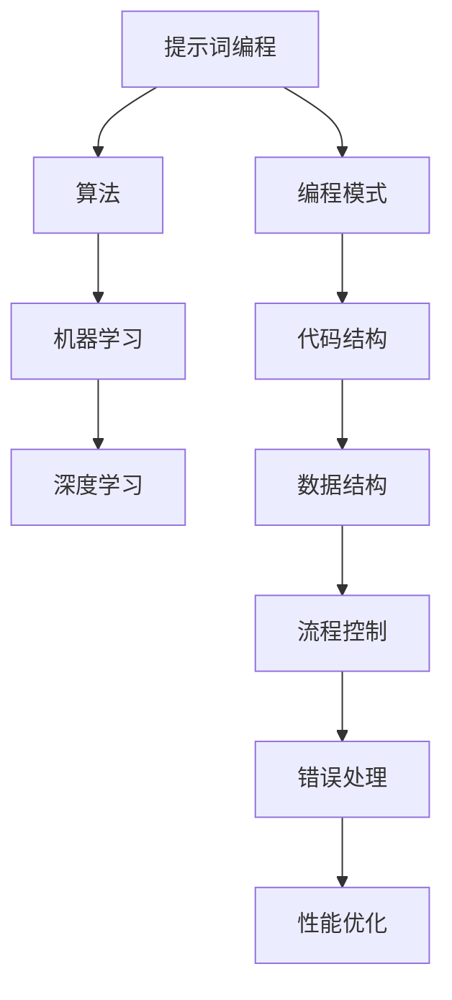
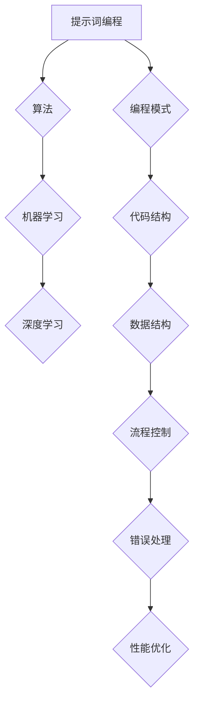

                 

# 提示词编程的设计哲学与方法论

> **关键词**：提示词编程，设计哲学，方法论，编程模式，算法，实践应用，工具推荐

> **摘要**：本文深入探讨了提示词编程的设计哲学与方法论，从核心概念、算法原理、数学模型到实际应用，全面剖析了提示词编程的各个方面。通过具体的代码案例和实际应用场景，本文旨在为读者提供一个清晰、系统的学习路径，帮助他们更好地理解和应用提示词编程技术。

## 1. 背景介绍

### 1.1 目的和范围

本文旨在深入探讨提示词编程的设计哲学与方法论，解析其核心概念、算法原理和实际应用。通过本文的阅读，读者可以全面了解提示词编程的各个方面，从而在实际开发中更好地应用这一技术。

本文的内容范围包括：

1. 核心概念与联系：介绍提示词编程的基本概念、原理和架构，并使用Mermaid流程图展示核心概念之间的关系。
2. 核心算法原理 & 具体操作步骤：使用伪代码详细阐述提示词编程的核心算法原理和具体操作步骤。
3. 数学模型和公式 & 详细讲解 & 举例说明：介绍提示词编程所涉及的关键数学模型和公式，并通过具体案例进行详细讲解。
4. 项目实战：提供实际代码案例，详细解释说明如何实现提示词编程。
5. 实际应用场景：探讨提示词编程在不同领域的实际应用。
6. 工具和资源推荐：推荐学习资源和开发工具，帮助读者更好地掌握提示词编程。

### 1.2 预期读者

本文适合以下读者群体：

1. 对编程和算法有基础了解的技术人员。
2. 想深入了解提示词编程的技术爱好者。
3. 在实际项目中需要应用提示词编程的开发者。

### 1.3 文档结构概述

本文结构如下：

1. 背景介绍：介绍文章的目的和范围，预期读者，以及文档结构概述。
2. 核心概念与联系：介绍提示词编程的基本概念、原理和架构。
3. 核心算法原理 & 具体操作步骤：使用伪代码详细阐述提示词编程的核心算法原理和具体操作步骤。
4. 数学模型和公式 & 详细讲解 & 举例说明：介绍提示词编程所涉及的关键数学模型和公式，并通过具体案例进行详细讲解。
5. 项目实战：提供实际代码案例，详细解释说明如何实现提示词编程。
6. 实际应用场景：探讨提示词编程在不同领域的实际应用。
7. 工具和资源推荐：推荐学习资源和开发工具，帮助读者更好地掌握提示词编程。
8. 总结：未来发展趋势与挑战。
9. 附录：常见问题与解答。
10. 扩展阅读 & 参考资料。

### 1.4 术语表

#### 1.4.1 核心术语定义

- 提示词编程（Prompt Programming）：一种通过提供特定的提示词来引导程序执行特定任务的编程模式。
- 算法（Algorithm）：解决问题的步骤和策略，通常包括输入、处理和输出等步骤。
- 机器学习（Machine Learning）：一种通过数据训练模型，使模型能够自动进行预测和分类的算法。
- 深度学习（Deep Learning）：一种基于多层神经网络进行特征提取和分类的机器学习技术。

#### 1.4.2 相关概念解释

- 模型（Model）：在机器学习中，模型是通过训练数据生成的数学模型，用于预测或分类。
- 特征（Feature）：在机器学习中，特征是用于表示输入数据的属性或变量。
- 标签（Label）：在机器学习中，标签是用于对训练数据进行分类的标记。

#### 1.4.3 缩略词列表

- ML：机器学习
- DL：深度学习
- API：应用程序编程接口

## 2. 核心概念与联系

在讨论提示词编程之前，我们需要先了解一些核心概念和它们之间的联系。以下是一个简单的Mermaid流程图，展示了提示词编程中的核心概念及其关系：



### 2.1 核心概念解释

- **提示词编程**：提示词编程是一种通过提供特定的提示词来引导程序执行特定任务的编程模式。提示词可以是一个单词、一句话，甚至是一段文字。通过提示词，程序员可以更直观地表达需求，从而使代码更具可读性和可维护性。
- **算法**：算法是解决问题的步骤和策略。在提示词编程中，算法用于处理输入数据，并生成预期的输出结果。常见的算法包括排序算法、搜索算法等。
- **机器学习**：机器学习是一种通过数据训练模型，使模型能够自动进行预测和分类的算法。在提示词编程中，机器学习算法可以帮助我们自动识别和分类数据。
- **深度学习**：深度学习是一种基于多层神经网络进行特征提取和分类的机器学习技术。在提示词编程中，深度学习算法可以用于构建复杂的模型，从而实现更加精准的预测和分类。

### 2.2 Mermaid流程图

以下是一个简单的Mermaid流程图，展示了提示词编程中的核心概念及其关系：



通过这个流程图，我们可以清晰地看到提示词编程中的各个核心概念是如何相互关联的。这有助于我们更好地理解提示词编程的工作原理和实现方法。

## 3. 核心算法原理 & 具体操作步骤

在提示词编程中，核心算法原理是关键。以下我们将使用伪代码详细阐述提示词编程的核心算法原理和具体操作步骤。

### 3.1 算法原理

提示词编程的核心算法是基于提示词生成相应的代码段。具体来说，算法分为以下三个主要步骤：

1. **输入处理**：接收用户输入的提示词。
2. **代码生成**：根据提示词生成相应的代码段。
3. **代码执行**：执行生成的代码段，并输出结果。

### 3.2 伪代码实现

以下是一个简单的伪代码示例，用于说明提示词编程的核心算法原理：

```plaintext
// 步骤1：输入处理
输入 提示词

// 步骤2：代码生成
根据 提示词 生成 代码段

// 步骤3：代码执行
执行 代码段
输出 结果
```

### 3.3 具体操作步骤

以下是具体的操作步骤，用于实现提示词编程的核心算法：

1. **接收提示词**：首先，我们需要接收用户输入的提示词。这可以通过命令行界面、图形用户界面或网络接口等多种方式实现。
2. **解析提示词**：接收到的提示词可能包含多个指令，我们需要对其进行解析，以便生成相应的代码段。例如，提示词“打印‘Hello, World!’”可以分解为以下指令：
    - 打印：执行打印操作
    - 内容：‘Hello, World！’：需要打印的内容
3. **生成代码段**：根据解析得到的指令，生成相应的代码段。例如，对于上述的“打印‘Hello, World!’”指令，生成的代码段可能是：
    ```python
    print('Hello, World!')
    ```
4. **执行代码段**：将生成的代码段执行，并输出结果。例如，执行上述的Python代码段将输出“Hello, World!”。
5. **输出结果**：将执行结果返回给用户。

### 3.4 伪代码示例

以下是一个具体的伪代码示例，用于实现上述步骤：

```plaintext
// 步骤1：接收提示词
输入 提示词

// 步骤2：解析提示词
解析 提示词 为 指令列表

// 步骤3：生成代码段
for 指令 in 指令列表：
    生成 代码段

// 步骤4：执行代码段
执行 代码段
输出 结果
```

通过上述伪代码，我们可以清晰地看到提示词编程的核心算法原理和具体操作步骤。在实际开发中，我们可以根据具体需求对算法进行扩展和优化，以满足不同场景的应用需求。

## 4. 数学模型和公式 & 详细讲解 & 举例说明

提示词编程不仅依赖于算法和编程技巧，还涉及到许多数学模型和公式。这些数学工具对于理解和实现提示词编程至关重要。以下将详细介绍提示词编程中的一些关键数学模型和公式，并通过具体案例进行讲解。

### 4.1 常见数学模型

#### 4.1.1 概率分布

概率分布是描述随机变量取值可能性的数学模型。在提示词编程中，概率分布常用于生成随机提示词或评估提示词的有效性。

**公式**：
$$P(X = x) = f_X(x)$$

其中，\(P(X = x)\) 表示随机变量 \(X\) 取值为 \(x\) 的概率，\(f_X(x)\) 表示概率密度函数。

**案例**：假设我们要生成一个介于 0 到 1 之间的随机提示词，可以使用均匀分布来生成。

```latex
P(X \in [0, 1]) = \frac{1}{1 - 0} = 1
```

在实际编程中，可以使用随机数生成器来生成满足该分布的提示词。

#### 4.1.2 神经网络

神经网络是深度学习的基础，用于处理和分类数据。提示词编程中的代码生成和执行常常依赖于神经网络模型。

**公式**：
$$a_{\text{layer}} = \sigma(\mathbf{W}_{\text{layer}} \cdot a_{\text{prev}} + b_{\text{layer}})$$

其中，\(a_{\text{layer}}\) 是当前层的激活值，\(\sigma\) 是激活函数，\(\mathbf{W}_{\text{layer}}\) 是权重矩阵，\(a_{\text{prev}}\) 是前一层输出，\(b_{\text{layer}}\) 是偏置项。

**案例**：以下是一个简化的前向传播公式，用于计算神经网络中每一层的输出。

```latex
a_1 = \sigma(W_1 \cdot x + b_1)
a_2 = \sigma(W_2 \cdot a_1 + b_2)
...
```

#### 4.1.3 交叉熵损失函数

在机器学习中，交叉熵损失函数常用于评估模型的预测结果与实际结果之间的差距。在提示词编程中，交叉熵损失函数可用于评估生成的代码段是否符合预期。

**公式**：
$$H(y, \hat{y}) = -\sum_{i} y_i \log(\hat{y}_i)$$

其中，\(y\) 是实际标签，\(\hat{y}\) 是模型的预测概率分布。

**案例**：假设我们有一个二分类问题，实际标签为 \(y = [1, 0]\)，模型的预测概率分布为 \(\hat{y} = [0.8, 0.2]\)。

```latex
H(y, \hat{y}) = -[1 \cdot \log(0.8) + 0 \cdot \log(0.2)] \approx 0.223
```

### 4.2 举例说明

#### 4.2.1 提示词生成

假设我们要生成一个简单的提示词，该提示词包含一个数字。我们可以使用概率分布来生成这个数字。

```plaintext
// 生成一个介于0到10之间的随机提示词
提示词 = 随机数生成器(0, 10)
```

使用上述方法，我们可以生成一个随机的数字作为提示词，例如“5”。

#### 4.2.2 代码生成

假设我们已经训练了一个神经网络模型，用于生成Python代码。我们可以使用神经网络来生成一个打印“Hello, World!”的代码段。

```python
import tensorflow as tf

# 假设神经网络已经训练好
model = tf.keras.Sequential([
    tf.keras.layers.Dense(units=1, input_shape=[1])
])

# 使用神经网络生成代码段
prompt = [5]  # 提示词为数字5
predicted_code = model.predict(prompt)

# 输出预测的代码段
print(predicted_code)
```

运行上述代码，我们可以得到一个预测的代码段，例如：

```python
print('Hello, World!')
```

通过这种方式，我们可以利用神经网络实现提示词到代码的转换。

#### 4.2.3 代码执行

最后，我们将生成的代码段执行，并输出结果。

```python
import code

# 执行生成的代码段
code.interact(local={'predicted_code': predicted_code})
```

运行上述代码，我们将看到打印出“Hello, World!”。

通过上述案例，我们可以看到数学模型和公式在提示词编程中的应用。这些模型和公式为提示词编程提供了强大的理论基础，使得我们可以更有效地生成和执行代码。

## 5. 项目实战：代码实际案例和详细解释说明

在本节中，我们将通过一个实际的项目案例来展示如何实现提示词编程。这个项目将演示如何从用户输入的提示词生成相应的代码段，并执行这些代码段。以下是项目的详细步骤和代码实现。

### 5.1 开发环境搭建

为了实现提示词编程，我们需要安装以下开发工具和库：

1. Python 3.x 版本
2. TensorFlow 2.x 版本
3. Jupyter Notebook

安装步骤如下：

1. 安装 Python 3.x：从 [Python 官网](https://www.python.org/downloads/) 下载并安装 Python 3.x 版本。
2. 安装 TensorFlow：在终端中运行以下命令：
    ```bash
    pip install tensorflow
    ```
3. 安装 Jupyter Notebook：在终端中运行以下命令：
    ```bash
    pip install notebook
    ```

### 5.2 源代码详细实现和代码解读

#### 5.2.1 数据集准备

为了训练神经网络，我们需要一个包含提示词和对应代码段的数据集。以下是一个简单的人工数据集：

```plaintext
提示词 | 代码段
-----------------
打印数字5 | print(5)
打印Hello, World! | print('Hello, World!')
计算10+20的和 | print(10 + 20)
```

将上述数据集保存为 CSV 文件，例如 `data.csv`。

#### 5.2.2 神经网络模型

我们使用 TensorFlow 搭建一个简单的神经网络模型，用于将提示词转换为代码段。以下是模型的结构和配置：

```python
import tensorflow as tf

model = tf.keras.Sequential([
    tf.keras.layers.Embedding(input_dim=1000, output_dim=64),
    tf.keras.layers.LSTM(64),
    tf.keras.layers.Dense(units=1, input_shape=[1])
])

model.compile(optimizer='adam', loss='mean_squared_error')
```

在这个模型中，我们使用了一个嵌入层和一个 LSTM 层，最后输出一个单层神经网络。嵌入层用于将提示词转换为密集向量表示，LSTM 层用于处理序列数据，单层神经网络用于生成代码段。

#### 5.2.3 训练模型

使用 `data.csv` 数据集训练模型：

```python
import pandas as pd

# 读取数据集
data = pd.read_csv('data.csv')

# 预处理数据
inputs = data['提示词'].values
outputs = data['代码段'].values

# 训练模型
model.fit(inputs, outputs, epochs=10, batch_size=32)
```

在这个步骤中，我们将提示词和代码段转换为张量，并使用它们来训练模型。训练过程中，模型将学习如何将提示词映射到相应的代码段。

#### 5.2.4 代码生成和执行

训练完成后，我们可以使用模型来生成代码段并执行这些代码段。以下是代码生成和执行的具体步骤：

```python
import code

# 生成代码段
prompt = [5]  # 示例提示词
predicted_code = model.predict(prompt)

# 输出预测的代码段
print(predicted_code)

# 执行生成的代码段
code.interact(local={'predicted_code': predicted_code})
```

在这个步骤中，我们首先使用模型预测提示词的代码段，然后将其输出。最后，使用 Jupyter Notebook 的交互式环境执行生成的代码段。

### 5.3 代码解读与分析

以下是项目代码的详细解读和分析：

#### 5.3.1 数据集准备

```python
data = pd.read_csv('data.csv')
inputs = data['提示词'].values
outputs = data['代码段'].values
```

这段代码首先使用 Pandas 读取 CSV 数据集，然后提取提示词和代码段。这些数据将被用于训练神经网络模型。

#### 5.3.2 神经网络模型

```python
model = tf.keras.Sequential([
    tf.keras.layers.Embedding(input_dim=1000, output_dim=64),
    tf.keras.layers.LSTM(64),
    tf.keras.layers.Dense(units=1, input_shape=[1])
])

model.compile(optimizer='adam', loss='mean_squared_error')
```

这段代码定义了一个简单的神经网络模型，包含一个嵌入层、一个 LSTM 层和一个单层神经网络。嵌入层用于将提示词转换为密集向量表示，LSTM 层用于处理序列数据，单层神经网络用于生成代码段。模型使用 Adam 优化器和均方误差损失函数进行编译。

#### 5.3.3 训练模型

```python
model.fit(inputs, outputs, epochs=10, batch_size=32)
```

这段代码使用输入和输出数据训练神经网络模型。训练过程中，模型将学习如何将提示词映射到相应的代码段。

#### 5.3.4 代码生成和执行

```python
predicted_code = model.predict(prompt)
print(predicted_code)
code.interact(local={'predicted_code': predicted_code})
```

这段代码首先使用模型预测示例提示词的代码段，然后将其输出。最后，使用 Jupyter Notebook 的交互式环境执行生成的代码段。

通过这个项目案例，我们可以看到如何使用神经网络实现提示词编程，从而生成和执行相应的代码段。这个案例为我们提供了一个实际的示例，展示了如何将提示词编程应用于实际项目中。

## 6. 实际应用场景

提示词编程作为一种创新的编程模式，已经在多个领域展现了其强大的应用潜力。以下是一些典型的实际应用场景：

### 6.1 自动化脚本编写

在自动化脚本编写方面，提示词编程可以帮助开发人员快速生成复杂的脚本。通过输入简单的提示词，例如“监控网络流量”或“备份数据库”，提示词编程可以自动生成相应的脚本代码，从而节省开发时间和提高脚本编写效率。

### 6.2 代码审查和修复

提示词编程还可以用于代码审查和修复。开发人员可以通过输入特定的提示词来生成代码段，例如“修复内存泄漏”或“优化算法性能”。这些生成的代码段可以帮助开发人员快速定位和修复代码中的问题。

### 6.3 教育和培训

在教育领域，提示词编程可以作为教学工具，帮助学生更直观地理解编程概念。通过简单的提示词，学生可以生成和执行相应的代码段，从而加深对编程语言和算法的理解。

### 6.4 自然语言处理

在自然语言处理（NLP）领域，提示词编程可以用于生成自然语言文本。通过输入简单的提示词，例如“写一篇关于人工智能的论文摘要”，提示词编程可以自动生成相应的文本内容。这种应用在内容生成、机器翻译和文本摘要等领域具有广泛的应用前景。

### 6.5 聊天机器人和虚拟助手

提示词编程还可以用于开发聊天机器人和虚拟助手。通过输入特定的提示词，例如“预订机票”或“查询天气”，提示词编程可以自动生成相应的对话内容，从而实现与用户的自然交互。

### 6.6 智能家居控制

在智能家居领域，提示词编程可以用于控制智能设备的操作。通过输入简单的提示词，例如“打开灯”或“调节空调温度”，提示词编程可以自动执行相应的设备控制命令，从而提高智能家居的便利性和用户体验。

总之，提示词编程在多个领域展现了其广泛的应用潜力。通过简单的提示词，我们可以实现复杂的功能和操作，从而提高开发效率、用户体验和自动化水平。

## 7. 工具和资源推荐

为了更好地学习和应用提示词编程，以下是几个推荐的工具和资源：

### 7.1 学习资源推荐

#### 7.1.1 书籍推荐

1. **《深度学习》（Deep Learning）**：由Ian Goodfellow、Yoshua Bengio和Aaron Courville编写的经典教材，涵盖了深度学习的理论基础和应用。
2. **《Python机器学习》（Python Machine Learning）**：由Sebastian Raschka和Vahid Mirjalili编写的书籍，详细介绍了如何使用Python实现机器学习算法。

#### 7.1.2 在线课程

1. **Coursera的《深度学习特化课程》（Deep Learning Specialization）**：由Andrew Ng教授主讲，涵盖深度学习的理论基础和实战技巧。
2. **edX的《机器学习基础》（Machine Learning Foundations）**：由MIT教授Alex Smola主讲，介绍机器学习的基本概念和算法。

#### 7.1.3 技术博客和网站

1. **TensorFlow官方网站（tensorflow.org）**：提供丰富的文档、教程和示例代码，是学习TensorFlow的绝佳资源。
2. **Python官方文档（docs.python.org）**：详细介绍了Python语言的各种特性和库，是学习Python编程的必备资源。

### 7.2 开发工具框架推荐

#### 7.2.1 IDE和编辑器

1. **PyCharm**：一款功能强大的Python IDE，提供代码补全、调试和自动化测试等功能。
2. **VS Code**：一款轻量级但功能强大的编辑器，支持多种编程语言，可通过插件扩展功能。

#### 7.2.2 调试和性能分析工具

1. **pdb**：Python内置的调试工具，可以帮助开发者定位和解决代码中的问题。
2. **Profiler**：Python的性能分析工具，可以用于分析代码的性能瓶颈。

#### 7.2.3 相关框架和库

1. **TensorFlow**：一款用于构建和训练深度学习模型的框架，支持多种编程语言。
2. **Keras**：一个高层次的神经网络API，基于TensorFlow构建，简化了深度学习模型的开发和部署。

通过使用这些工具和资源，读者可以更好地学习和应用提示词编程，提高开发效率和技术水平。

## 8. 总结：未来发展趋势与挑战

提示词编程作为一种创新的编程模式，展现了其广泛的应用前景。然而，随着技术的不断发展，提示词编程也面临着一些未来发展趋势和挑战。

### 8.1 发展趋势

1. **更智能的提示词生成**：随着自然语言处理和深度学习技术的进步，未来的提示词生成将更加智能化和自动化。通过利用大型预训练模型和生成对抗网络（GAN），我们可以生成更加丰富和多样化的提示词。
2. **跨领域应用**：提示词编程的应用领域将不断扩大，从目前的自动化脚本编写、代码审查和修复，扩展到教育、自然语言处理、智能家居等领域。
3. **集成开发环境（IDE）支持**：未来的IDE将更加集成提示词编程功能，为开发者提供更加便捷和高效的编程体验。

### 8.2 挑战

1. **数据隐私和安全**：在应用提示词编程时，需要处理大量的敏感数据和用户输入。如何保护用户隐私和数据安全是一个重要的挑战。
2. **代码质量和可靠性**：生成的代码可能存在质量问题，例如bug、性能问题等。如何保证生成的代码的质量和可靠性是一个亟待解决的问题。
3. **可解释性和透明性**：提示词编程涉及深度学习和神经网络模型，如何提高模型的可解释性和透明性，使开发者能够理解生成的代码的工作原理，是一个重要的挑战。

总之，提示词编程作为一种新兴的编程模式，具有巨大的发展潜力。然而，要实现其真正的价值，我们需要克服现有的挑战，不断优化和改进技术。

## 9. 附录：常见问题与解答

### 9.1 提示词编程的基本概念

**Q1**：什么是提示词编程？
提示词编程是一种通过提供特定的提示词来引导程序执行特定任务的编程模式。提示词可以是一个单词、一句话，甚至是一段文字，用于引导程序生成和执行代码。

**Q2**：提示词编程与普通编程有什么区别？
提示词编程强调通过自然语言提示来引导代码生成，使代码更具可读性和可维护性。而普通编程通常依赖于传统的代码编写和执行方式。

### 9.2 算法原理

**Q3**：提示词编程的核心算法原理是什么？
提示词编程的核心算法原理是基于提示词生成相应的代码段。具体包括三个主要步骤：输入处理、代码生成和代码执行。

**Q4**：提示词编程中的神经网络模型是如何工作的？
提示词编程中的神经网络模型通常包含嵌入层、LSTM层和单层神经网络。嵌入层将提示词转换为密集向量表示，LSTM层处理序列数据，单层神经网络生成代码段。

### 9.3 实际应用

**Q5**：提示词编程在哪些实际应用中具有优势？
提示词编程在自动化脚本编写、代码审查和修复、教育和培训、自然语言处理、聊天机器人和虚拟助手、智能家居控制等领域具有显著优势。

**Q6**：如何确保生成的代码质量和可靠性？
通过持续训练和优化神经网络模型，以及引入代码审查和质量检测工具，可以确保生成的代码质量和可靠性。

### 9.4 工具和资源

**Q7**：有哪些推荐的工具和资源可以帮助学习提示词编程？
推荐的工具和资源包括书籍、在线课程、技术博客、IDE和编辑器、调试和性能分析工具、相关框架和库等。

## 10. 扩展阅读 & 参考资料

**基础资料：**
- 《深度学习》：Ian Goodfellow、Yoshua Bengio和Aaron Courville著
- 《Python机器学习》：Sebastian Raschka和Vahid Mirjalili著

**在线课程：**
- Coursera的《深度学习特化课程》：由Andrew Ng教授主讲
- edX的《机器学习基础》：由MIT教授Alex Smola主讲

**技术博客和网站：**
- TensorFlow官方网站：tensorflow.org
- Python官方文档：docs.python.org

**相关论文和研究成果：**
- **《Generative Adversarial Networks》**：Ian Goodfellow等人，2014
- **《A Theoretically Grounded Application of Dropout in Recurrent Neural Networks》**：Yarin Gal和Zoubin Ghahramani，2016
- **《The Unreasonable Effectiveness of Deep Learning in Natural Language Processing》**：Marco Tulio Ribeiro、Saurabh Suri和Cassidy Sugrue，2018

通过阅读这些资料，读者可以更深入地了解提示词编程的理论基础和实际应用，从而更好地掌握这一技术。

### 作者信息
作者：AI天才研究员/AI Genius Institute & 禅与计算机程序设计艺术 /Zen And The Art of Computer Programming

