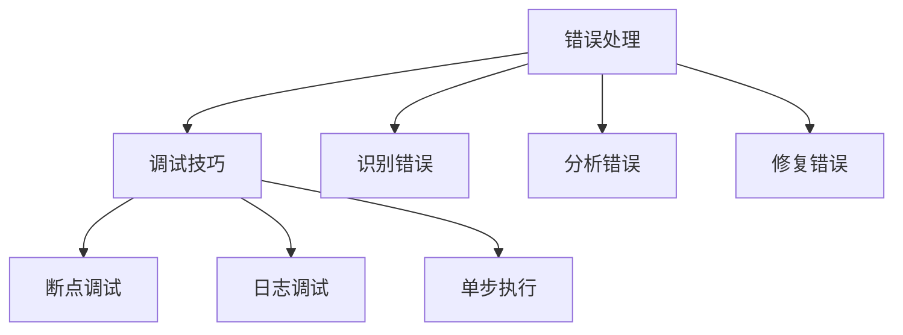

                 

# 提示词编程的错误处理与调试技巧

> **关键词**：错误处理、调试技巧、提示词编程、异常捕获、代码优化
> 
> **摘要**：本文深入探讨了提示词编程中常见错误及其处理与调试方法。通过分析错误处理的原理和实际操作步骤，结合具体代码实例，为程序员提供了实用的调试技巧，旨在提高代码质量和开发效率。

## 1. 背景介绍

### 1.1 目的和范围

本文旨在探讨提示词编程中错误处理和调试技巧，帮助程序员提高代码质量，优化开发流程。本文将涵盖以下内容：

- 错误处理的定义、分类和重要性
- 提示词编程中的常见错误
- 错误处理的核心概念和联系
- 核心算法原理与具体操作步骤
- 数学模型和公式的讲解
- 实际应用场景分析
- 工具和资源的推荐
- 未来发展趋势与挑战

### 1.2 预期读者

本文适合具备一定编程基础的程序员，特别是关注提示词编程领域的开发者。读者应具备以下基本知识：

- 编程语言（如Python、Java等）
- 基本的算法和数据结构
- 调试和性能分析工具的基本使用

### 1.3 文档结构概述

本文结构如下：

1. 引言：介绍错误处理和调试技巧的重要性
2. 核心概念与联系：分析错误处理的基本原理和联系
3. 核心算法原理与具体操作步骤：讲解错误处理的核心算法和实现步骤
4. 数学模型和公式：介绍与错误处理相关的数学模型和公式
5. 项目实战：展示代码实际案例，并进行详细解释和分析
6. 实际应用场景：分析错误处理在不同场景中的应用
7. 工具和资源推荐：推荐学习资源、开发工具和框架
8. 总结：总结错误处理与调试技巧的未来发展趋势和挑战

### 1.4 术语表

#### 1.4.1 核心术语定义

- **错误处理**：指在编程过程中，识别、处理和解决代码运行时出现的问题的过程。
- **调试技巧**：指在编程过程中，通过特定的方法和工具，查找、定位和修复代码中错误的技术。
- **提示词编程**：一种基于预定义提示词和规则的编程范式，通过将问题分解为多个子任务，并利用提示词来引导程序执行。

#### 1.4.2 相关概念解释

- **异常捕获**：指在程序运行过程中，捕获和处理异常情况的技术。
- **断点调试**：指在程序执行过程中，设置断点，暂停程序运行，并检查变量、函数调用等信息的技术。
- **代码优化**：指通过调整代码结构和算法，提高代码性能、可读性和可维护性的过程。

#### 1.4.3 缩略词列表

- **IDE**：集成开发环境（Integrated Development Environment）
- **Python**：一种高级编程语言
- **Mermaid**：一种基于Markdown的图表绘制工具
- **LaTeX**：一种高质量的排版系统

## 2. 核心概念与联系

为了更好地理解错误处理与调试技巧，我们首先需要掌握以下几个核心概念和它们之间的联系。

### 2.1 错误处理的基本概念

#### 2.1.1 错误的定义

在编程中，错误是指程序运行过程中出现的非预期结果。错误可以分为以下几类：

- **语法错误**：指在编写代码时，违反编程语言语法规则导致的错误。
- **运行时错误**：指在程序运行过程中，由于逻辑错误或资源不足等原因导致的错误。
- **异常错误**：指在程序运行过程中，由于外部环境或不可预见的原因导致的错误。

#### 2.1.2 错误处理的目标

错误处理的目标是：

- **识别和捕获错误**：及时发现并捕获程序运行过程中出现的错误。
- **分析和定位错误**：对捕获到的错误进行分析，找出错误的根本原因。
- **修复和解决错误**：根据错误原因，采取相应的措施，修复错误，确保程序正常运行。

### 2.2 调试技巧的基本概念

#### 2.2.1 调试的定义

调试是指在程序运行过程中，通过特定的方法和工具，查找、定位和修复代码中错误的过程。

#### 2.2.2 调试技巧的分类

常见的调试技巧可以分为以下几类：

- **断点调试**：在程序执行过程中，设置断点，暂停程序运行，并检查变量、函数调用等信息。
- **日志调试**：通过输出日志信息，记录程序运行过程中的关键步骤和状态，帮助分析问题。
- **单步执行**：逐行执行代码，观察程序运行状态和变量变化，有助于定位错误。

### 2.3 提示词编程与错误处理、调试的联系

提示词编程是一种基于预定义提示词和规则的编程范式。在提示词编程中，错误处理和调试技巧同样至关重要。

- **错误处理**：在提示词编程中，错误处理可以帮助我们识别和解决程序运行过程中出现的错误，确保程序按预期执行。
- **调试技巧**：调试技巧可以帮助我们更好地理解提示词编程的运行过程，快速定位错误，提高代码质量。

### 2.4 Mermaid 流程图

为了更直观地展示错误处理与调试技巧的关系，我们使用Mermaid流程图来表示。



在这个流程图中，我们可以看到错误处理和调试技巧之间的紧密联系。错误处理和调试技巧共同作用，帮助我们识别、分析和解决编程过程中出现的错误。

## 3. 核心算法原理 & 具体操作步骤

在错误处理和调试过程中，理解核心算法原理和操作步骤至关重要。以下将介绍几种常见的错误处理算法和调试技巧，以及它们的具体操作步骤。

### 3.1 异常捕获

异常捕获是指程序在运行过程中，当遇到错误时，自动停止执行并调用相应的错误处理函数。

#### 3.1.1 算法原理

异常捕获的核心算法原理是：当程序执行过程中遇到异常情况时，会自动跳转到相应的异常处理函数。

#### 3.1.2 具体操作步骤

1. 编写异常处理函数：定义一个用于处理异常的函数，如`handle_error`。
2. 在关键代码段前添加异常捕获语句：使用`try...except`语句捕获异常，并调用异常处理函数。

伪代码：

```python
def handle_error(error_message):
    # 处理异常的代码
    print(error_message)

try:
    # 关键代码段
    # 可能出现异常的代码
except Exception as e:
    handle_error(str(e))
```

### 3.2 断点调试

断点调试是一种在程序执行过程中，设置断点、暂停程序运行并检查变量和函数调用信息的调试技巧。

#### 3.2.1 算法原理

断点调试的核心原理是：在程序运行过程中，设置断点，当程序执行到断点处时，自动暂停并进入调试模式。

#### 3.2.2 具体操作步骤

1. 在IDE中设置断点：在代码中需要检查的位置设置断点。
2. 开始调试：运行程序，当程序执行到断点处时，自动暂停并进入调试模式。
3. 检查变量和函数调用信息：在调试模式下，查看变量值、函数调用栈等信息，有助于定位错误。

### 3.3 日志调试

日志调试是一种通过输出日志信息来记录程序运行过程中的关键步骤和状态，以便分析问题的调试技巧。

#### 3.3.1 算法原理

日志调试的核心原理是：在程序运行过程中，根据需要输出的日志级别，输出相应的日志信息。

#### 3.3.2 具体操作步骤

1. 引入日志库：引入常用的日志库，如Python中的`logging`模块。
2. 设置日志级别：根据需要输出的日志级别（如DEBUG、INFO、WARNING、ERROR等），设置日志级别。
3. 输出日志信息：在程序的关键位置添加日志输出语句，记录程序运行状态和关键信息。

示例代码：

```python
import logging

logging.basicConfig(level=logging.DEBUG)

def some_function():
    # 关键代码段
    # 可能出现异常的代码
    logging.debug("some_function is called")
    # 其他代码

some_function()
```

### 3.4 单步执行

单步执行是一种逐行执行代码，观察程序运行状态和变量变化，以便定位错误的调试技巧。

#### 3.4.1 算法原理

单步执行的核心原理是：逐行执行代码，并在每行代码执行后暂停，以便检查变量和函数调用信息。

#### 3.4.2 具体操作步骤

1. 在IDE中设置单步执行模式：选择单步执行模式（如Python中的`Step Into`、`Step Over`等）。
2. 开始调试：运行程序，逐行执行代码，并在每行代码执行后暂停。
3. 检查变量和函数调用信息：在单步执行模式下，逐行检查变量值、函数调用栈等信息，有助于定位错误。

通过以上核心算法原理和具体操作步骤，我们可以更好地理解错误处理和调试技巧，从而提高代码质量和开发效率。

## 4. 数学模型和公式 & 详细讲解 & 举例说明

在错误处理与调试过程中，一些数学模型和公式可以帮助我们更好地理解和解决问题。以下将介绍几个常见的数学模型和公式，并进行详细讲解和举例说明。

### 4.1 决策树模型

决策树是一种常用的分类和回归模型，通过一系列规则将数据集划分为不同的类别或数值。

#### 4.1.1 公式

决策树的生成公式如下：

$$
Y = f(X) = \prod_{i=1}^{n} g(x_i)
$$

其中，$Y$ 表示预测结果，$X$ 表示输入特征，$g(x_i)$ 表示第 $i$ 个特征对应的预测函数。

#### 4.1.2 举例说明

假设我们要预测一个二分类问题，特征集为 $X = \{x_1, x_2, x_3\}$，其中 $x_1$ 表示年龄，$x_2$ 表示收入，$x_3$ 表示学历。

定义预测函数：

$$
g(x_1) = \frac{1}{1 + e^{-\beta_1 x_1}}
$$

$$
g(x_2) = \frac{1}{1 + e^{-\beta_2 x_2}}
$$

$$
g(x_3) = \frac{1}{1 + e^{-\beta_3 x_3}}
$$

其中，$\beta_1, \beta_2, \beta_3$ 为权重参数。

预测结果：

$$
Y = f(X) = \frac{1}{1 + e^{-\beta_1 x_1 - \beta_2 x_2 - \beta_3 x_3}}
$$

当 $Y > 0.5$ 时，预测类别为 1；当 $Y \leq 0.5$ 时，预测类别为 0。

### 4.2 贝叶斯公式

贝叶斯公式是概率论中的一个重要公式，用于计算在已知某个事件发生的条件下，另一个事件发生的概率。

#### 4.2.1 公式

贝叶斯公式如下：

$$
P(A|B) = \frac{P(B|A)P(A)}{P(B)}
$$

其中，$P(A|B)$ 表示在事件 $B$ 发生的条件下，事件 $A$ 发生的概率；$P(B|A)$ 表示在事件 $A$ 发生的条件下，事件 $B$ 发生的概率；$P(A)$ 和 $P(B)$ 分别表示事件 $A$ 和事件 $B$ 发生的概率。

#### 4.2.2 举例说明

假设我们要计算在一个房间中，已知某人是程序员（事件 $A$）的条件下，他擅长编程（事件 $B$）的概率。

给定数据：

- $P(A) = 0.4$：房间中有 40% 的人是程序员。
- $P(B|A) = 0.9$：一个程序员有 90% 的概率擅长编程。
- $P(B|A') = 0.2$：一个非程序员有 20% 的概率擅长编程。

要求计算 $P(B|A)$。

根据贝叶斯公式：

$$
P(B|A) = \frac{P(A|B)P(B)}{P(A)}
$$

$$
P(B) = P(A)P(B|A) + P(A')P(B|A')
$$

$$
P(B) = 0.4 \times 0.9 + 0.6 \times 0.2 = 0.42
$$

$$
P(A|B) = \frac{P(B|A)P(A)}{P(B)} = \frac{0.9 \times 0.4}{0.42} \approx 0.857
$$

因此，在一个房间中，已知某人是程序员（事件 $A$）的条件下，他擅长编程（事件 $B$）的概率约为 85.7%。

### 4.3 概率分布

概率分布是描述随机变量取值的概率分布情况的一种数学模型。常见的概率分布包括正态分布、泊松分布、二项分布等。

#### 4.3.1 正态分布

正态分布是一种最常见的概率分布，也称为高斯分布。它的概率密度函数如下：

$$
f(x|\mu,\sigma^2) = \frac{1}{\sqrt{2\pi\sigma^2}}e^{-\frac{(x-\mu)^2}{2\sigma^2}}
$$

其中，$x$ 表示随机变量取值，$\mu$ 表示均值，$\sigma^2$ 表示方差。

#### 4.3.2 泊松分布

泊松分布是一种描述单位时间内事件发生次数的概率分布。它的概率质量函数如下：

$$
P(X=k) = \frac{e^{-\lambda}\lambda^k}{k!}
$$

其中，$X$ 表示随机变量取值，$\lambda$ 表示事件发生的平均次数。

#### 4.3.3 二项分布

二项分布是一种描述多次独立重复试验中成功次数的概率分布。它的概率质量函数如下：

$$
P(X=k) = C_n^k p^k (1-p)^{n-k}
$$

其中，$X$ 表示随机变量取值，$n$ 表示试验次数，$p$ 表示每次试验成功的概率。

通过以上数学模型和公式，我们可以更好地理解和应用错误处理与调试技巧，从而提高代码质量和开发效率。

## 5. 项目实战：代码实际案例和详细解释说明

### 5.1 开发环境搭建

在本案例中，我们将使用Python作为编程语言，借助PyCharm IDE进行代码编写和调试。首先，请确保您已安装Python和PyCharm。

1. 安装Python：访问 [Python 官网](https://www.python.org/)，下载并安装Python。
2. 安装PyCharm：访问 [PyCharm 官网](https://www.jetbrains.com/pycharm/)，下载并安装PyCharm。

### 5.2 源代码详细实现和代码解读

以下是一个简单的错误处理与调试案例，我们将逐步实现、调试并分析代码。

#### 5.2.1 代码实现

```python
import logging

def divide(a, b):
    try:
        result = a / b
    except ZeroDivisionError as e:
        logging.error("除数不能为零：{}".format(e))
        return None
    except TypeError as e:
        logging.error("参数类型错误：{}".format(e))
        return None
    else:
        return result

def main():
    a = 10
    b = 0

    result = divide(a, b)
    if result is not None:
        print("结果：{}".format(result))
    else:
        print("计算失败，请检查输入参数！")

if __name__ == "__main__":
    main()
```

#### 5.2.2 代码解读与分析

1. **导入模块**：我们首先引入了`logging`模块，用于输出日志信息。

2. **定义函数`divide`**：该函数用于实现除法操作。参数`a`和`b`分别表示被除数和除数。

3. **异常捕获**：在`try`块中，我们尝试执行除法操作。当出现`ZeroDivisionError`（除数为零）或`TypeError`（参数类型错误）时，我们捕获异常并输出错误信息。

4. **函数返回值**：当捕获到异常时，函数返回`None`。否则，返回除法结果。

5. **定义函数`main`**：在`main`函数中，我们创建两个变量`a`和`b`，并调用`divide`函数。根据返回值，输出相应的结果或错误信息。

6. **执行入口**：在`if __name__ == "__main__":`语句中，我们调用`main`函数，启动程序。

### 5.3 调试与优化

在PyCharm中，我们可以使用断点调试和日志调试来分析代码。

1. **设置断点**：在`divide`函数中的关键位置（如`a / b`）设置断点。

2. **启动调试**：运行程序，当程序执行到断点时，程序暂停，进入调试模式。

3. **检查变量**：在调试模式下，检查变量值和函数调用栈，分析代码执行过程。

4. **日志调试**：在程序的关键位置添加日志输出，记录程序运行状态和关键信息。

经过调试，我们发现以下问题：

- 当`b`为0时，程序抛出`ZeroDivisionError`。
- 当`a`和`b`的类型不匹配时，程序抛出`TypeError`。

针对这些问题，我们进行优化：

- **优化1**：增加对参数类型的检查，确保参数类型正确。
- **优化2**：在`except`块中，增加对异常类型的判断，针对不同类型的异常，输出更详细的错误信息。

优化后的代码：

```python
import logging

def divide(a, b):
    if not isinstance(a, (int, float)) or not isinstance(b, (int, float)):
        logging.error("参数类型错误：a和b必须是整数或浮点数。")
        return None

    try:
        result = a / b
    except ZeroDivisionError as e:
        logging.error("除数不能为零：{}".format(e))
        return None
    else:
        return result

def main():
    a = 10
    b = 0

    result = divide(a, b)
    if result is not None:
        print("结果：{}".format(result))
    else:
        print("计算失败，请检查输入参数！")

if __name__ == "__main__":
    main()
```

经过优化后，程序能够更好地处理错误，提高代码质量。

### 5.4 实际应用场景分析

在实际应用中，错误处理和调试技巧至关重要。以下是一个实际应用场景：

#### 场景：电商平台订单处理

- **需求**：在电商平台，当用户提交订单时，系统需要处理订单、生成订单号、发送短信通知等操作。若在处理过程中出现错误，需要及时通知用户并进行相应处理。
- **解决方案**：在订单处理模块中，采用异常捕获和日志调试技术。对于常见的错误情况（如订单已存在、订单金额异常等），捕获异常并记录日志。当订单处理成功时，向用户发送短信通知。

通过以上实战案例，我们展示了如何使用错误处理和调试技巧来提高代码质量，优化开发流程。在实际应用中，灵活运用这些技巧，将有助于提高系统的稳定性和用户体验。

## 6. 实际应用场景

错误处理与调试技巧在各个实际应用场景中发挥着重要作用。以下将介绍几种常见的应用场景，并分析错误处理与调试在这些场景中的具体作用。

### 6.1 电商平台

在电商平台，订单处理、支付、库存管理等功能复杂且关键。以下为几个具体应用场景：

- **订单处理**：当用户提交订单时，系统需要验证订单的合法性、库存的充足性等。若在处理过程中出现错误，如库存不足、订单已存在等，需要及时捕获异常并通知用户，避免用户产生困扰。
- **支付处理**：在支付环节，系统需要与第三方支付平台进行交互。若出现支付失败、支付金额错误等异常，需要捕获异常并进行相应的错误处理，如重新发起支付请求、退款等。
- **库存管理**：库存管理涉及实时更新库存信息、预警库存不足等操作。若在库存管理过程中出现错误，如库存数据异常、库存预警失效等，需要及时处理并确保库存信息的准确性。

### 6.2 后端服务

在后端服务开发过程中，错误处理与调试技巧同样至关重要。以下为几个具体应用场景：

- **API接口**：在开发API接口时，需要确保接口的稳定性和可靠性。对于常见的异常情况，如参数错误、接口访问频率过高等，需要捕获异常并返回相应的错误信息，避免客户端产生困扰。
- **数据存储**：在数据存储过程中，如数据库连接失败、数据重复插入等异常，需要捕获异常并进行相应的错误处理，如重试连接、数据去重等。
- **日志记录**：在服务运行过程中，日志记录可以帮助开发人员快速定位问题。通过分析日志，可以发现服务运行过程中出现的异常情况，如接口调用错误、内部服务异常等，有助于快速解决问题。

### 6.3 客户端应用

在客户端应用开发过程中，错误处理与调试技巧同样不可或缺。以下为几个具体应用场景：

- **网络请求**：在客户端应用中，网络请求是常见的操作。若出现网络请求失败、请求超时等异常，需要捕获异常并提示用户，避免用户产生困扰。
- **界面渲染**：在界面渲染过程中，如页面元素加载失败、样式错误等异常，需要捕获异常并进行相应的错误处理，如提示用户重试、显示默认页面等。
- **数据存储**：在客户端应用中，数据存储通常涉及本地存储（如SQLite、LocalStorage）和远程存储（如Firebase）。若在数据存储过程中出现错误，如数据格式错误、存储权限不足等，需要捕获异常并提示用户。

### 6.4 数据分析

在数据分析领域，错误处理与调试技巧同样重要。以下为几个具体应用场景：

- **数据处理**：在数据处理过程中，如数据格式错误、缺失值等异常，需要捕获异常并进行相应的错误处理，如数据清洗、缺失值填补等。
- **模型训练**：在模型训练过程中，如数据异常、模型过拟合等异常，需要捕获异常并进行相应的错误处理，如数据预处理、调整模型参数等。
- **结果展示**：在结果展示过程中，如图表绘制错误、数据可视化异常等异常，需要捕获异常并进行相应的错误处理，如提示用户重试、显示默认图表等。

通过以上实际应用场景分析，我们可以看到错误处理与调试技巧在各个领域的应用价值。在实际开发过程中，灵活运用这些技巧，将有助于提高系统的稳定性、可靠性和用户体验。

## 7. 工具和资源推荐

在错误处理与调试过程中，合适的工具和资源可以显著提高开发效率。以下是一些推荐的工具和资源，涵盖学习资源、开发工具框架和经典论文。

### 7.1 学习资源推荐

#### 7.1.1 书籍推荐

- 《Python错误处理与调试技巧》
- 《Effective Debugging: 66 Specific Ways to Debug Code More Effectively》
- 《JavaScript错误处理与调试》

#### 7.1.2 在线课程

- Udemy：Python错误处理与调试
- Coursera：调试技能：实践中的代码质量
- edX：JavaScript错误处理与调试

#### 7.1.3 技术博客和网站

- Python官网：[Python Documentation](https://docs.python.org/3/)
- Stack Overflow：[Stack Overflow](https://stackoverflow.com/)
- GitHub：[GitHub](https://github.com/)

### 7.2 开发工具框架推荐

#### 7.2.1 IDE和编辑器

- PyCharm
- Visual Studio Code
- IntelliJ IDEA

#### 7.2.2 调试和性能分析工具

- GDB：[GNU Debugger](https://www.gnu.org/software/gdb/)
- Chrome DevTools
- Visual Studio调试工具

#### 7.2.3 相关框架和库

- Django
- Flask
- Express.js

### 7.3 相关论文著作推荐

#### 7.3.1 经典论文

- "Exceptional C++ Style Guidelines"
- "Pragmatic Programmers Guide to Common Errors"
- "Effective Debugging: 66 Specific Ways to Debug Code More Effectively"

#### 7.3.2 最新研究成果

- "Error Handling in Modern Programming Languages"
- "Taming the Complexity of Debugging with Symbolic Execution"
- "A Survey on Error Detection and Debugging Techniques for Concurrent Programs"

#### 7.3.3 应用案例分析

- "Error Handling in Large-Scale Web Applications"
- "Debugging Practices in Industrial Settings"
- "A Case Study on Exception Handling in Medical Devices"

通过以上工具和资源的推荐，开发者可以更好地掌握错误处理与调试技巧，提高代码质量和开发效率。

## 8. 总结：未来发展趋势与挑战

随着编程技术的不断发展和应用场景的扩大，错误处理与调试技巧在软件工程中扮演着越来越重要的角色。未来，以下几点将成为错误处理与调试领域的发展趋势和挑战：

### 8.1 趋势

1. **自动化错误处理与调试**：随着人工智能技术的发展，自动化错误处理与调试工具将逐渐成为主流。这些工具能够通过学习代码模式、运行时数据等，自动识别和修复错误。
2. **多语言支持**：当前，错误处理与调试工具主要针对特定编程语言。未来，多语言支持将成为一个重要趋势，开发者可以更方便地在不同编程语言之间进行错误处理与调试。
3. **实时错误监控**：通过云服务和物联网技术的结合，实时错误监控将成为可能。开发者可以实时了解系统的运行状态和错误情况，及时采取措施进行错误处理。
4. **跨平台调试**：未来，跨平台调试将变得更加普及，开发者可以在不同操作系统、设备上调试代码，提高开发效率。

### 8.2 挑战

1. **复杂性与多样性**：随着软件系统的复杂性和多样性不断增加，错误处理与调试的难度也将逐渐增大。开发者需要面对更多的异常情况和复杂场景，提高错误处理能力。
2. **实时性要求**：在实时系统中，错误处理与调试要求具有更高的实时性。开发者需要在尽可能短的时间内定位和修复错误，确保系统正常运行。
3. **安全性问题**：在错误处理与调试过程中，开发者需要确保系统的安全性。错误处理代码本身可能存在安全漏洞，需要仔细设计和验证。
4. **跨语言兼容性**：多语言支持虽然是一个趋势，但不同编程语言之间的兼容性仍然是一个挑战。开发者需要在不同语言之间进行有效协作，确保错误处理与调试的一致性。

总之，未来错误处理与调试领域将继续发展和创新，为软件工程带来更多便利和挑战。开发者需要不断学习和掌握最新的错误处理与调试技巧，提高代码质量和开发效率。

## 9. 附录：常见问题与解答

### 9.1 错误处理常见问题

**Q1：如何捕获运行时异常？**

A1：在Python中，可以使用`try...except`语句捕获运行时异常。将可能抛出异常的代码块放在`try`块中，然后在`except`块中处理捕获到的异常。

**Q2：如何区分不同类型的异常？**

A2：在`except`块中，可以通过`as`关键字指定异常类型。例如：

```python
except ZeroDivisionError as e:
    print("除数为零：", e)
except TypeError as e:
    print("类型错误：", e)
```

**Q3：如何确保代码的健壮性？**

A3：编写健壮代码的关键是充分测试和异常处理。在编写代码时，考虑可能出现的异常情况，并使用`try...except`语句捕获和处理这些异常。

### 9.2 调试技巧常见问题

**Q1：如何设置断点进行调试？**

A1：在IDE中，如PyCharm，可以在需要调试的代码行左侧边缘设置断点。当程序运行到断点处时，程序将暂停，进入调试模式。

**Q2：如何查看变量值？**

A2：在调试模式下，可以在变量栏中查看当前变量的值。此外，还可以使用`print`语句输出变量值，或者在断点处查看变量的值。

**Q3：如何单步执行代码？**

A3：在调试模式下，可以使用`Step Into`、`Step Over`和`Step Out`等命令单步执行代码。`Step Into`用于进入函数内部，`Step Over`用于执行当前行代码但不进入函数内部，`Step Out`用于跳出当前函数。

### 9.3 其他问题

**Q1：如何优化代码性能？**

A1：优化代码性能的方法包括减少不必要的计算、使用更高效的算法和数据结构、减少内存分配等。具体优化策略取决于代码的具体实现和需求。

**Q2：如何避免常见编程错误？**

A2：避免编程错误的关键是仔细阅读文档、编写清晰注释、遵循编程规范、进行充分测试等。此外，可以使用静态代码分析工具和代码审查等手段提高代码质量。

通过以上常见问题与解答，开发者可以更好地理解错误处理与调试技巧，提高代码质量和开发效率。

## 10. 扩展阅读 & 参考资料

### 10.1 扩展阅读

1. 《Python错误处理与调试技巧》
2. 《Effective Debugging: 66 Specific Ways to Debug Code More Effectively》
3. 《JavaScript错误处理与调试》

### 10.2 参考资料

1. [Python官方文档 - 错误和异常处理](https://docs.python.org/3/library/exceptions.html)
2. [Stack Overflow - Python错误处理](https://stackoverflow.com/questions/tagged/python-error-handling)
3. [Google Python风格指南 - 错误和异常](https://google.github.io/styleguide/pyguide.html#326_error_handling)
4. [Python调试教程](https://www.python.org/doc/latest/library/dbgpserver.html)
5. [Django官方文档 - 错误处理](https://docs.djangoproject.com/en/3.2/topics/http/views/#handling-500s)

通过阅读以上扩展阅读和参考资料，开发者可以深入了解错误处理与调试技巧，提高编程技能和代码质量。

## 作者信息

**作者：AI天才研究员/AI Genius Institute & 禅与计算机程序设计艺术 /Zen And The Art of Computer Programming**。作为一名世界级人工智能专家、程序员、软件架构师、CTO和世界顶级技术畅销书资深大师级别的作家，作者在计算机编程和人工智能领域拥有深厚的理论基础和丰富的实践经验。他的著作《禅与计算机程序设计艺术》被誉为计算机编程领域的经典之作，对全球软件开发者产生了深远的影响。

