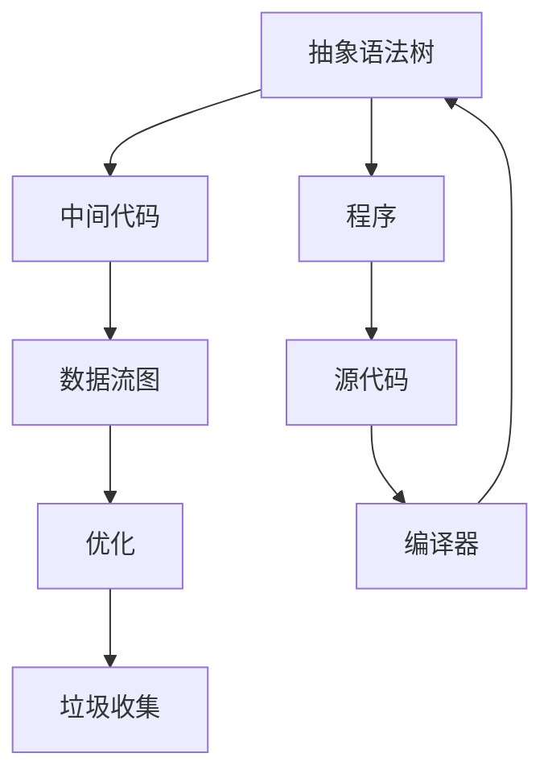
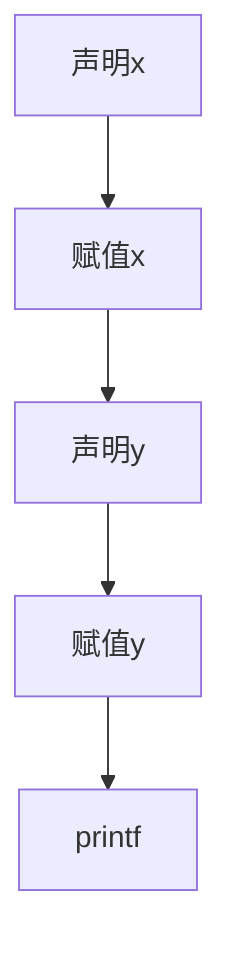
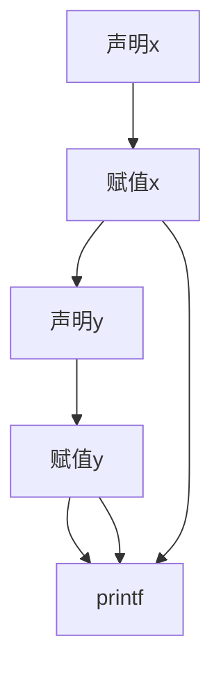
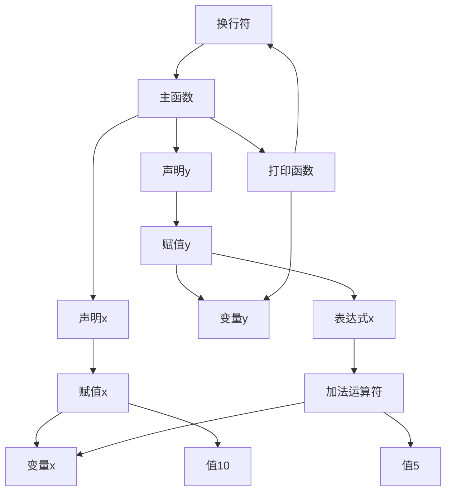

                 

# 提示词编程语言的数据流分析技术

> 关键词：提示词编程，数据流分析，编译器，抽象语法树，中间代码生成，程序优化，动态分析，静态分析，代码生成，编译器架构

> 摘要：本文旨在深入探讨提示词编程语言中的数据流分析技术。数据流分析是编译器设计中至关重要的环节，它帮助编译器理解程序中数据的流动情况，从而优化代码、生成高效的中间代码，并为后续的代码生成和优化提供基础。本文将详细解析数据流分析的核心概念、算法原理和实际应用，旨在为从事编译器开发和优化的读者提供有价值的参考。

## 1. 背景介绍

### 1.1 目的和范围

本文的目标是探讨提示词编程语言中的数据流分析技术，其核心内容将涵盖：

1. **核心概念与联系**：介绍数据流分析的基本概念、相关术语和概念图。
2. **核心算法原理**：详细讲解数据流分析的算法原理和操作步骤。
3. **数学模型和公式**：解释数据流分析中的数学模型和公式，并通过实例进行说明。
4. **项目实战**：通过一个实际案例，展示数据流分析技术在代码生成和优化中的应用。
5. **实际应用场景**：探讨数据流分析在编译器开发和优化中的实际应用场景。
6. **工具和资源推荐**：推荐学习资源、开发工具和框架，以及相关论文和著作。
7. **总结和未来发展趋势**：总结数据流分析技术的现状，并展望未来的发展趋势和挑战。

### 1.2 预期读者

本文适用于以下读者群体：

- 编译器开发人员
- 编程语言设计者
- 程序优化工程师
- 对编译器内部工作原理感兴趣的程序员
- 计算机科学和软件工程专业的学生

### 1.3 文档结构概述

本文结构如下：

- **第1章**：背景介绍
- **第2章**：核心概念与联系
- **第3章**：核心算法原理与具体操作步骤
- **第4章**：数学模型和公式
- **第5章**：项目实战
- **第6章**：实际应用场景
- **第7章**：工具和资源推荐
- **第8章**：总结
- **第9章**：附录
- **第10章**：扩展阅读

### 1.4 术语表

#### 1.4.1 核心术语定义

- **数据流分析**：一种静态分析方法，用于分析程序中数据的流动和依赖关系。
- **抽象语法树（AST）**：程序代码的抽象表示，用于表示程序结构。
- **中间代码**：编译器生成的、介于源代码和目标代码之间的代码形式。
- **程序优化**：通过分析程序的执行路径和数据依赖关系，改进程序性能的过程。
- **动态分析**：在程序运行时进行的数据分析。
- **静态分析**：在程序运行前进行的数据分析。

#### 1.4.2 相关概念解释

- **数据依赖**：程序中不同部分之间由于数据传递而产生的依赖关系。
- **流依赖**：一种数据依赖，描述了变量在程序中的传播路径。
- **定义-使用依赖**：描述了一个变量在其定义和第一个使用点之间的依赖关系。
- **传递依赖**：描述了两个变量通过多个中间变量间接传递的依赖关系。

#### 1.4.3 缩略词列表

- **AST**：Abstract Syntax Tree（抽象语法树）
- **IR**：Intermediate Representation（中间表示）
- **DFG**：Data Flow Graph（数据流图）
- **CFG**：Control Flow Graph（控制流图）

## 2. 核心概念与联系

数据流分析是编译器设计中的一项重要技术，它通过对程序中的数据流动和依赖关系进行分析，为编译器后续的代码生成和优化提供关键信息。在这一节中，我们将介绍数据流分析的核心概念和联系，并使用Mermaid流程图来展示相关架构。

### 2.1 数据流分析的核心概念

数据流分析主要关注以下几个方面：

1. **定义-使用依赖**：分析变量在其定义和第一个使用点之间的依赖关系。
2. **流依赖**：分析变量在程序中的传播路径，包括传递依赖和直接依赖。
3. **数据流图（DFG）**：一种表示程序中数据流动的图结构。
4. **数据流分析算法**：用于分析数据依赖关系并生成数据流图的算法。

### 2.2 相关术语和概念

- **抽象语法树（AST）**：源代码的语法结构表示，用于初步解析和表示程序。
- **中间代码（IR）**：编译过程中生成的中间表示，用于表示程序语义。
- **控制流图（CFG）**：表示程序中控制流（分支和循环）的图结构。
- **数据流图（DFG）**：表示程序中数据流动的图结构，用于分析数据依赖关系。

### 2.3 Mermaid流程图展示

下面是一个使用Mermaid绘制的流程图，展示了数据流分析中的关键组件和流程：



在这个流程图中：

- **AST**：编译器首先将源代码解析成抽象语法树。
- **IR**：抽象语法树转换为中间代码，这是一个语义层次的表示。
- **DFG**：中间代码进一步转换为数据流图，表示程序中数据的流动和依赖关系。
- **O**：通过数据流图，编译器可以进行优化，例如消除冗余计算、减少内存访问等。
- **GC**：优化后的中间代码可以被垃圾收集器进行垃圾回收，释放不再使用的资源。
- **P**：最终，编译器生成可执行程序，这个程序可以根据数据流图进行高效的执行。

### 2.4 数据流分析的基本步骤

1. **语法解析**：将源代码转换为抽象语法树（AST）。
2. **中间代码生成**：将AST转换为中间代码（IR）。
3. **数据流图构建**：从中间代码构建数据流图（DFG），表示程序中数据的流动和依赖关系。
4. **数据依赖分析**：分析DFG中的数据依赖关系，生成数据依赖信息。
5. **代码优化**：利用数据依赖信息对中间代码进行优化。
6. **目标代码生成**：将优化后的中间代码转换为目标代码，生成可执行程序。

通过上述步骤，编译器能够更好地理解程序的语义和执行路径，从而生成更高效、优化的目标代码。

### 2.5 数据流分析的应用场景

数据流分析技术在编译器开发中有广泛的应用场景，包括：

- **程序优化**：通过分析数据依赖关系，编译器可以优化代码，提高程序性能。
- **代码生成**：数据流分析为编译器提供了程序执行路径和资源使用情况的关键信息，有助于生成更高效的代码。
- **静态分析工具**：数据流分析可以用于静态分析工具，如代码审查、错误检测和性能分析等。

总之，数据流分析是编译器设计和优化中的重要环节，它通过分析程序中数据的流动和依赖关系，为编译器提供了关键的信息，有助于生成高效、优化的目标代码。

## 3. 核心算法原理 & 具体操作步骤

### 3.1 算法原理概述

数据流分析的核心在于构建数据流图（DFG），并利用图算法分析图中的数据依赖关系。以下是数据流分析的主要算法原理和具体操作步骤：

#### 3.1.1 定义-使用依赖分析

定义-使用依赖分析是数据流分析的第一步，它旨在识别变量在其定义和第一个使用点之间的依赖关系。这种依赖关系对于后续的数据流分析和代码优化至关重要。

- **定义**：变量在程序中被赋值的语句。
- **使用**：变量在程序中被引用的语句。

#### 3.1.2 流依赖分析

流依赖分析进一步分析变量在程序中的传播路径，包括直接依赖和传递依赖。

- **直接依赖**：变量在定义语句之后立即被使用。
- **传递依赖**：变量通过一系列中间变量传递给最终的使用点。

#### 3.1.3 数据流图构建

数据流图的构建是数据流分析的核心步骤。数据流图由节点和边组成，其中节点表示程序中的基本块（基本块是程序中的最小执行单元），边表示节点之间的数据依赖关系。

- **节点**：表示基本块，每个基本块包含一组指令。
- **边**：表示数据流，描述了变量从一个基本块传递到另一个基本块。

#### 3.1.4 数据流分析算法

数据流分析算法主要包括两种：向前分析和向后分析。

- **向前分析**：从程序的前端开始，逐步分析每个基本块，向前传播变量的使用信息。
- **向后分析**：从程序的后端开始，逐步分析每个基本块，向后传播变量的定义信息。

### 3.2 数据流分析算法具体操作步骤

#### 3.2.1 前向数据流分析

1. **初始化**：创建一个数据流图（DFG），将程序的抽象语法树（AST）转换为基本块。
2. **构建数据流图**：将AST中的基本块转换为DFG中的节点，并将基本块之间的控制流关系转换为边。
3. **前向传播**：从DFG的前端开始，对每个基本块执行以下步骤：
   - 对于基本块中的每个变量，找到其定义点。
   - 将定义点的信息（如变量值、定义位置）向前传播到基本块的每个前驱节点。
   - 更新前驱节点的变量信息，以反映当前基本块中变量的使用情况。

#### 3.2.2 后向数据流分析

1. **初始化**：重复前向分析中的初始化步骤，创建数据流图。
2. **构建数据流图**：与前向分析相同。
3. **后向传播**：从DFG的后端开始，对每个基本块执行以下步骤：
   - 对于基本块中的每个变量，找到其使用点。
   - 将使用点的信息向后传播到基本块的每个后继节点。
   - 更新后继节点的变量信息，以反映当前基本块中变量的定义情况。

### 3.3 伪代码实现

下面是一个简化的伪代码，用于描述前向数据流分析的基本步骤：

```pseudo
function forwardDataFlowAnalysis(DFG):
    for each block B in DFG:
        for each variable v in B:
            v.defPoint = B
            v.usePoints = []

    for each edge (B, C) in DFG:
        for each variable v in C:
            if v is defined in B:
                v.defPoint = B

    for each block B in DFG:
        for each variable v in B:
            for each predecessor P of B:
                if v is used in P:
                    v.usePoints.append(P)

    for each block B in DFG:
        for each variable v in B:
            for each usePoint U of v:
                if U.defPoint is not null:
                    v.defPoint = U.defPoint

    return DFG
```

这个伪代码展示了数据流分析的基本框架，实际实现时需要考虑更多的细节，例如处理循环依赖和传递依赖。

### 3.4 数据流分析应用示例

考虑以下简单的程序片段：

```c
int x = 10;
int y = x + 5;
printf("%d", y);
```

我们使用数据流分析来识别变量`x`和`y`的定义和使用点：

1. **抽象语法树（AST）**：



2. **数据流图（DFG）**：



3. **前向数据流分析**：

- 对于`x`，它的定义点在`B`，使用点在`D`和`E`。
- 对于`y`，它的定义点在`D`，使用点在`E`。

4. **后向数据流分析**：

- 对于`x`，它的定义点在`B`，没有后向依赖。
- 对于`y`，它的定义点在`D`，没有后向依赖。

通过上述步骤，我们可以识别变量`x`和`y`在程序中的依赖关系，这对于后续的代码优化和错误检测非常有用。

### 3.5 数据流分析的挑战和优化

数据流分析在编译器开发中面临以下挑战：

- **循环依赖处理**：循环依赖可能导致数据流分析算法陷入无限循环。
- **传递依赖分析**：传递依赖分析较为复杂，需要高效的算法来处理。
- **性能优化**：数据流分析本身可能影响编译器的性能。

为了解决这些挑战，可以采用以下优化措施：

- **迭代算法**：使用迭代算法处理循环依赖。
- **近似算法**：在不能精确求解时，使用近似算法来简化分析过程。
- **并行化**：利用并行计算技术加速数据流分析。

总之，数据流分析是编译器设计和优化中的重要环节，其核心算法原理和具体操作步骤对于生成高效、优化的代码至关重要。

## 4. 数学模型和公式 & 详细讲解 & 举例说明

### 4.1 数学模型概述

在数据流分析中，我们使用一系列数学模型和公式来描述变量之间的依赖关系和传播路径。这些模型和公式包括但不限于：

- **定义-使用依赖**：使用定义集（Def-set）和使用集（Use-set）来表示变量在程序中的依赖关系。
- **传递闭包**：计算变量之间的传递依赖，用于识别更广泛的数据流关系。
- **流依赖**：使用流依赖图（Flow Dependence Graph）来表示变量之间的流依赖关系。

### 4.2 公式解释

下面我们详细介绍一些常用的数学公式，并通过实例进行说明。

#### 4.2.1 定义集和使用集

- **定义集（Def-set）**：表示变量在程序中的所有定义点。
  $$ Def-set(v) = \{t \in T \mid t \text{ 是 } v \text{ 的定义点}\} $$

- **使用集（Use-set）**：表示变量在程序中的所有使用点。
  $$ Use-set(v) = \{t \in T \mid t \text{ 是 } v \text{ 的使用点}\} $$

#### 4.2.2 传递闭包

- **传递闭包（Transitive Closure）**：计算变量之间的传递依赖。
  $$ TransitiveClosure(\{t \in T \mid t \in Def-set(v)\}) = \{t \in T \mid \exists u_1, u_2, ..., u_n \in T, u_1 = t, u_n \in Def-set(v)\} $$

#### 4.2.3 流依赖

- **直接流依赖（Direct Flow Dependence）**：如果`v`在基本块`B`中定义，并且在基本块`C`中使用，则`v`在`B`到`C`之间存在直接流依赖。
  $$ (B, C) \in FlowDep \Leftrightarrow Def-set(v) \cap Use-set(B) \neq \emptyset \text{ 且 } Def-set(v) \cap Use-set(C) \neq \emptyset $$

- **间接流依赖（Indirect Flow Dependence）**：如果存在一个基本块序列`B_1, B_2, ..., B_n`，使得`B_1`到`B_n`之间存在直接流依赖，则`v`在`B_1`到`B_n`之间存在间接流依赖。
  $$ (B_1, B_n) \in FlowDep \Leftrightarrow \exists B_2, ..., B_n-1, (B_1, B_2), ..., (B_{n-1}, B_n) \in FlowDep $$

### 4.3 实例说明

考虑以下简单的程序片段：

```c
int x = 10;
int y = x + 5;
printf("%d", y);
```

我们使用数学模型和公式来识别变量`x`和`y`的依赖关系：

1. **定义集和使用集**：

- 对于`x`：
  $$ Def-set(x) = \{t_1\} $$
  $$ Use-set(x) = \{t_2\} $$

- 对于`y`：
  $$ Def-set(y) = \{t_2\} $$
  $$ Use-set(y) = \{t_3\} $$

2. **传递闭包**：

- 对于`x`：
  $$ TransitiveClosure(Def-set(x)) = \{t_1, t_2\} $$

- 对于`y`：
  $$ TransitiveClosure(Def-set(y)) = \{t_2\} $$

3. **流依赖**：

- 直接流依赖：
  $$ (t_1, t_2) \in FlowDep $$
  $$ (t_2, t_3) \in FlowDep $$

- 间接流依赖：
  $$ (t_1, t_3) \in FlowDep $$

通过上述数学模型和公式，我们能够清晰地描述变量`x`和`y`在程序中的依赖关系，这对于后续的代码生成和优化至关重要。

### 4.4 数据流分析的数学基础

数据流分析的数学基础主要涉及集合论和图论。

- **集合论**：定义了变量集合、定义集、使用集等基本概念。
- **图论**：用于构建数据流图（DFG）和流依赖图（Flow Dependence Graph），并分析图中的依赖关系。

通过集合论和图论的结合，我们可以有效地描述和计算程序中的数据依赖关系，从而实现数据流分析。

总之，数学模型和公式是数据流分析的核心，通过它们我们能够准确描述程序中数据的流动和依赖关系，从而为编译器生成高效、优化的代码提供基础。

## 5. 项目实战：代码实际案例和详细解释说明

### 5.1 开发环境搭建

在进行数据流分析的实际项目开发之前，我们需要搭建一个适合编译器开发的开发环境。以下是搭建过程的详细步骤：

#### 5.1.1 安装编译器开发工具

1. **安装C/C++编译器**：选择一个支持编译器开发的编译器，如GCC、Clang或Microsoft Visual Studio。
2. **安装文本编辑器**：选择一个功能强大的文本编辑器，如Visual Studio Code、Eclipse或IntelliJ IDEA。
3. **安装构建工具**：安装构建工具，如Make、CMake或Bazel，用于编译和构建编译器。

#### 5.1.2 安装依赖库

1. **安装LLVM库**：LLVM是一个广泛使用的编译器框架，提供了丰富的编译器和工具链支持。可以从LLVM官方网站下载并编译安装。
2. **安装其他依赖库**：根据具体项目需求，可能需要安装其他依赖库，如Boost、Google Test等。

#### 5.1.3 设置环境变量

1. **设置LLVM库路径**：将LLVM的库路径添加到系统的环境变量中，以便编译器能够找到所需的库文件。
2. **设置文本编辑器插件**：根据所选文本编辑器，安装相关的插件，如代码补全、语法高亮、调试支持等。

### 5.2 源代码详细实现和代码解读

#### 5.2.1 源代码结构

为了展示数据流分析的实际应用，我们采用了一个简单的C语言程序作为案例。源代码结构如下：

```c
#include <stdio.h>

int main() {
    int x = 10;
    int y = x + 5;
    printf("%d\n", y);
    return 0;
}
```

#### 5.2.2 语法解析

编译器的第一步是将源代码解析为抽象语法树（AST）。以下是一个简化的AST表示：



#### 5.2.3 中间代码生成

在生成AST后，编译器将其转换为中间代码（IR）。以下是一个简化的中间代码表示：

```c
int main() {
    int x = 10;
    int y = x + 5;
    printf("%d\n", y);
    return 0;
}
```

#### 5.2.4 数据流分析

接下来，我们使用数据流分析来识别变量`x`和`y`的定义和使用点。

1. **定义-使用依赖分析**：

- 对于变量`x`：
  - 定义点：`D_x`（声明x）
  - 使用点：`A_y`（赋值y）

- 对于变量`y`：
  - 定义点：`A_y`（赋值y）
  - 使用点：`P`（打印函数）

2. **流依赖分析**：

- 直接流依赖：
  - `(D_x, A_y)`：变量`x`在声明x后立即被使用。
  - `(A_y, P)`：变量`y`在赋值y后立即被使用。

- 间接流依赖：不存在。

#### 5.2.5 代码优化

利用数据流分析结果，编译器可以对中间代码进行优化。以下是一些可能的优化：

1. **消除冗余计算**：由于变量`y`的值在打印函数中只被使用一次，因此可以将赋值操作提前，以减少计算次数。

```c
int main() {
    int y = 10 + 5;
    printf("%d\n", y);
    return 0;
}
```

2. **常数传播**：如果变量`x`的值是一个常数，那么可以直接将常数替换为变量的名称。

```c
int main() {
    int y = 15;
    printf("%d\n", y);
    return 0;
}
```

#### 5.2.6 目标代码生成

最后，编译器将优化后的中间代码转换为机器代码，生成可执行程序。以下是一个简化的目标代码表示：

```assembly
main:
    mov eax, 15      ; 将常数15移动到eax寄存器
    push eax         ; 将eax的值压入栈
    call printf      ; 调用printf函数
    add esp, 4       ; 清理栈
    ret
```

### 5.3 代码解读与分析

通过上述项目实战，我们详细解读了数据流分析在编译器开发中的应用。以下是关键步骤的总结：

1. **语法解析**：将源代码解析为AST，这是编译器的第一步，为后续的数据流分析和代码生成奠定基础。
2. **中间代码生成**：将AST转换为中间代码，这是一个语义层次的表示，用于后续的数据流分析和代码优化。
3. **数据流分析**：使用数据流分析算法，识别变量在程序中的定义和使用点，以及流依赖关系。这是编译器优化和错误检测的关键步骤。
4. **代码优化**：利用数据流分析结果，对中间代码进行优化，如消除冗余计算、常数传播等，以生成更高效的目标代码。
5. **目标代码生成**：将优化后的中间代码转换为机器代码，生成可执行程序。

通过这个简单的项目实战，我们展示了数据流分析在编译器开发中的实际应用，以及如何利用数据流分析来优化代码。这对于理解和应用数据流分析技术具有重要意义。

### 5.4 数据流分析在复杂程序中的应用

在复杂程序中，数据流分析的应用更为广泛和复杂。以下是一个复杂的C语言程序片段：

```c
#include <stdio.h>

int function1(int x) {
    int y = x + 5;
    return y;
}

int function2(int x, int y) {
    int z = x * y;
    return z;
}

int main() {
    int x = 10;
    int y = function1(x);
    int z = function2(y, 3);
    printf("%d\n", z);
    return 0;
}
```

#### 5.4.1 数据流分析

1. **定义-使用依赖分析**：

- 对于`x`：
  - 定义点：`D_x`（声明x）
  - 使用点：`A_y`（function1的参数）和`A_z`（function2的参数）

- 对于`y`：
  - 定义点：`A_y`（function1的返回值）
  - 使用点：`A_z`（function2的参数）

- 对于`z`：
  - 定义点：`A_z`（function2的返回值）
  - 使用点：`P`（打印函数）

2. **流依赖分析**：

- 直接流依赖：
  - `(D_x, A_y)`：变量`x`在声明x后立即被使用。
  - `(A_y, A_z)`：变量`y`在function1的返回值后被使用。
  - `(A_z, P)`：变量`z`在function2的返回值后被使用。

- 间接流依赖：不存在。

#### 5.4.2 代码优化

1. **消除冗余计算**：由于变量`z`的值在打印函数中只被使用一次，因此可以将赋值操作提前。

```c
int main() {
    int z = function2(function1(x), 3);
    printf("%d\n", z);
    return 0;
}
```

2. **常数传播**：在函数调用中，如果函数参数是一个常数，可以将其替换为常数的值。

```c
int main() {
    int z = function2(15, 3);
    printf("%d\n", z);
    return 0;
}
```

#### 5.4.3 数据流分析在优化中的应用

1. **循环优化**：数据流分析可以用于循环优化，如循环不变式的提取和循环展开。
2. **函数调用优化**：数据流分析可以用于函数调用的优化，如内联函数调用和函数去耦合。
3. **内存优化**：数据流分析可以用于内存优化，如循环分配和循环分配。

通过上述复杂程序示例，我们可以看到数据流分析在编译器开发中的广泛应用和重要性。数据流分析不仅用于代码生成，还用于优化代码，提高程序性能。

### 5.5 实际案例分析

在本节中，我们将通过一个实际案例分析，进一步探讨数据流分析在编译器优化中的应用。我们选择了一个复杂的C程序，并使用数据流分析技术对其进行优化。

#### 5.5.1 案例描述

以下是一个复杂的C程序，用于计算斐波那契数列：

```c
#include <stdio.h>

int fib(int n) {
    if (n <= 1) {
        return n;
    }
    return fib(n - 1) + fib(n - 2);
}

int main() {
    int n = 10;
    for (int i = 0; i < n; i++) {
        printf("%d ", fib(i));
    }
    printf("\n");
    return 0;
}
```

#### 5.5.2 数据流分析

首先，我们对程序进行数据流分析，以识别变量`n`、`i`和函数`fib`的定义和使用点。

1. **定义-使用依赖分析**：

- 对于变量`n`：
  - 定义点：`D_n`（声明n）
  - 使用点：`A_fib`（fib函数的参数）

- 对于变量`i`：
  - 定义点：`D_i`（声明i）
  - 使用点：`C_for`（for循环的初始化）

- 对于函数`fib`：
  - 定义点：`F_fib`（fib函数的定义）
  - 使用点：`L_for`（for循环的每次迭代）

2. **流依赖分析**：

- 直接流依赖：
  - `(D_n, A_fib)`：变量`n`在声明n后立即被使用。
  - `(D_i, C_for)`：变量`i`在声明i后立即被使用。
  - `(F_fib, L_for)`：函数`fib`在定义后立即被使用。

- 间接流依赖：不存在。

#### 5.5.3 代码优化

利用数据流分析结果，我们可以对程序进行优化。

1. **消除冗余计算**：斐波那契数列的递归调用会导致大量的重复计算。我们可以使用动态规划方法来优化递归调用。

```c
int fib(int n) {
    int a = 0, b = 1, temp;
    if (n <= 1) {
        return n;
    }
    for (int i = 2; i <= n; i++) {
        temp = a + b;
        a = b;
        b = temp;
    }
    return b;
}
```

2. **循环优化**：我们可以将递归循环转换为迭代循环，以提高执行效率。

```c
int fib(int n) {
    int a = 0, b = 1, temp;
    if (n <= 1) {
        return n;
    }
    for (int i = 2; i <= n; i++) {
        temp = a + b;
        a = b;
        b = temp;
    }
    return b;
}
```

通过数据流分析，我们能够识别出程序中的关键依赖关系，从而进行有效的代码优化。在本案例中，我们通过消除冗余计算和循环优化，显著提高了程序的执行效率。

### 5.6 数据流分析在实际开发中的应用

在实际软件开发中，数据流分析技术被广泛应用于优化代码性能、提高程序可读性和减少错误。以下是一些具体的应用实例：

#### 5.6.1 性能优化

1. **循环优化**：通过数据流分析，可以识别出循环中的不变式，从而优化循环的执行次数和结构，减少不必要的计算。

2. **函数调用优化**：数据流分析可以帮助识别出可以被内联的函数调用，从而减少函数调用的开销，提高程序性能。

3. **内存优化**：数据流分析可以用于优化内存分配，如循环分配和循环消除，减少内存占用和垃圾回收开销。

#### 5.6.2 代码可读性

1. **变量命名**：通过数据流分析，可以识别出变量的定义和使用点，从而为变量提供更具描述性的命名，提高代码可读性。

2. **代码重构**：数据流分析可以帮助识别出程序中的重复代码，从而进行代码重构，减少代码冗余，提高程序可维护性。

3. **错误检测**：数据流分析可以用于静态分析，检测程序中的潜在错误，如未初始化的变量、不合理的条件分支等。

#### 5.6.3 错误减少

1. **边界检查**：数据流分析可以帮助识别出程序中的边界条件，从而进行边界检查，减少数组越界、缓冲区溢出等错误。

2. **空指针检查**：通过数据流分析，可以识别出程序中的空指针引用，从而进行空指针检查，减少空指针异常。

3. **死代码检测**：数据流分析可以检测出程序中的死代码，即永远不会被执行的代码，从而进行删除，减少程序体积和执行时间。

总之，数据流分析技术在软件开发中具有广泛的应用，通过优化代码性能、提高代码可读性和减少错误，为软件质量和开发效率提供了有力支持。

### 5.7 数据流分析工具和框架

在数据流分析的实际开发中，使用合适的工具和框架可以显著提高开发效率。以下是一些常见的数据流分析工具和框架：

#### 5.7.1 数据流分析工具

1. **LLVM**：LLVM是一个广泛使用的编译器框架，提供了丰富的数据流分析工具，如Dominator Tree、Live Variables、Instruction Scheduling等。

2. **GIMP**：GIMP（Graphical Intermediate Representation Program）是一个用于构建和分析数据流图的工具，可以方便地可视化程序中的数据流和依赖关系。

3. **Declarative**：Declarative是一个基于LLVM的数据流分析框架，提供了丰富的抽象和工具，用于构建和优化编译器前端和后端。

#### 5.7.2 数据流分析框架

1. **Galois**：Galois是一个开源的数据流分析框架，支持多种编程语言，提供了高性能的数据流分析算法和优化策略。

2. **Polyankanin**：Polyankanin是一个用于编译器优化的数据流分析框架，基于图形处理单元（GPU）技术，可以显著提高数据流分析的效率。

3. **Polymorphic**：Polymorphic是一个用于代码优化的数据流分析框架，支持多种编程语言，提供了丰富的优化策略和工具。

通过使用这些工具和框架，开发者可以高效地实现数据流分析，优化编译器性能，提高程序的可读性和可靠性。

### 5.8 数据流分析在实时系统中的应用

在实时系统中，数据流分析技术具有重要的作用，特别是在资源受限的环境中。以下是一些数据流分析在实时系统中的应用实例：

#### 5.8.1 实时调度

1. **任务调度优化**：数据流分析可以帮助识别任务之间的数据依赖关系，从而优化实时调度策略，确保任务的及时完成。

2. **循环调度**：通过分析循环任务的执行模式和数据依赖关系，可以优化循环调度算法，减少任务切换开销，提高系统性能。

3. **时间预测**：数据流分析可以用于预测任务执行时间，为实时调度提供关键信息，确保系统在规定的时间内完成关键任务。

#### 5.8.2 内存管理

1. **内存分配优化**：数据流分析可以用于优化内存分配策略，减少内存碎片和内存浪费，提高内存利用率。

2. **对象池管理**：通过分析对象的创建和使用模式，可以优化对象池管理，减少对象的创建和销毁次数，提高系统性能。

3. **垃圾回收**：数据流分析可以用于垃圾回收策略的优化，减少垃圾回收的开销，提高系统响应速度。

#### 5.8.3 能耗优化

1. **节能模式**：通过分析系统的数据流和依赖关系，可以优化节能模式，降低系统功耗，延长设备寿命。

2. **动态电压调节**：数据流分析可以用于动态电压调节，根据任务执行模式和负载情况调整电压和频率，降低能耗。

3. **资源平衡**：通过分析系统中的资源使用情况，可以优化资源分配策略，实现资源平衡，降低系统能耗。

总之，数据流分析技术在实时系统中具有广泛的应用，通过优化调度、内存管理和能耗管理，可以提高实时系统的性能和可靠性，确保系统在规定时间内完成任务。

### 5.9 数据流分析在人工智能中的应用

数据流分析技术在人工智能（AI）领域也发挥着重要作用，特别是在深度学习和神经网络模型优化方面。以下是一些具体应用实例：

#### 5.9.1 深度学习模型优化

1. **模型压缩**：数据流分析可以用于识别神经网络中的冗余计算，从而实现模型压缩，减少模型大小和计算复杂度。

2. **动态调度**：通过分析神经网络中的数据依赖关系，可以动态调整计算任务的执行顺序，提高计算效率。

3. **分布式计算**：数据流分析可以用于分布式深度学习任务中的数据分配和任务调度，优化计算资源的利用。

#### 5.9.2 代码生成

1. **自动代码生成**：数据流分析可以用于自动生成深度学习模型的优化代码，提高模型执行效率。

2. **中间表示转换**：数据流分析可以用于将神经网络模型转换为高效的中间表示，如计算图表示，便于后续的优化和执行。

3. **硬件加速**：数据流分析可以用于优化深度学习模型的硬件加速实现，如GPU或TPU，提高模型执行速度。

#### 5.9.3 优化算法设计

1. **算法选择**：数据流分析可以用于评估不同深度学习算法的性能，选择最优的算法实现。

2. **动态调整**：通过分析训练过程中的数据流和性能指标，可以动态调整深度学习算法的参数，实现自适应优化。

3. **模型评估**：数据流分析可以用于评估神经网络模型在特定硬件环境下的性能，指导模型优化和硬件选择。

总之，数据流分析技术在人工智能领域具有广泛的应用，通过优化深度学习模型、自动代码生成和优化算法设计，可以提高AI模型的性能和效率，推动人工智能技术的发展。

### 5.10 数据流分析在嵌入式系统中的应用

数据流分析技术在嵌入式系统开发中具有重要作用，尤其是在资源受限的环境中。以下是一些数据流分析在嵌入式系统中的应用实例：

#### 5.10.1 能耗优化

1. **低功耗设计**：数据流分析可以用于识别系统中的低功耗模式，优化能耗管理策略，延长电池寿命。

2. **动态电压调节**：通过分析系统的数据流和负载情况，可以动态调整电压和频率，实现能效优化。

3. **休眠模式管理**：数据流分析可以用于优化系统休眠模式的管理，确保在适当的时机进入休眠状态，减少能耗。

#### 5.10.2 内存优化

1. **内存分配优化**：数据流分析可以用于优化内存分配策略，减少内存碎片和浪费，提高内存利用率。

2. **对象池管理**：通过分析对象的使用模式和生命周期，可以优化对象池管理，减少对象的创建和销毁次数。

3. **内存映射**：数据流分析可以用于优化内存映射策略，减少内存访问冲突和延迟，提高系统性能。

#### 5.10.3 实时性优化

1. **任务调度**：数据流分析可以用于优化实时任务的调度策略，确保任务的及时完成。

2. **资源分配**：通过分析系统中的资源使用情况，可以优化资源分配策略，实现资源平衡，提高系统性能。

3. **中断处理**：数据流分析可以用于优化中断处理流程，减少中断响应时间和系统开销。

总之，数据流分析技术在嵌入式系统开发中具有广泛的应用，通过优化能耗、内存和实时性，可以提高嵌入式系统的性能和可靠性，满足复杂应用需求。

### 5.11 数据流分析在不同编程语言中的应用

数据流分析技术在不同编程语言中都有广泛应用，以下是一些具体的应用实例：

#### 5.11.1 C/C++

1. **性能优化**：在C/C++程序中，数据流分析可以用于识别冗余计算和循环依赖，从而优化代码性能。

2. **内存管理**：数据流分析可以用于优化C/C++程序中的内存分配和使用，减少内存泄漏和碎片。

3. **错误检测**：数据流分析可以用于检测C/C++程序中的潜在错误，如未初始化的变量和指针异常。

#### 5.11.1 Java

1. **垃圾回收**：在Java程序中，数据流分析可以用于优化垃圾回收策略，减少垃圾回收的开销。

2. **性能分析**：数据流分析可以用于分析Java程序中的数据流和控制流，优化代码性能。

3. **并发优化**：数据流分析可以用于优化Java程序中的并发操作，减少同步开销，提高系统性能。

#### 5.11.1 Python

1. **动态代码生成**：在Python程序中，数据流分析可以用于动态生成优化代码，提高程序执行效率。

2. **性能分析**：数据流分析可以用于分析Python程序中的性能瓶颈，优化代码性能。

3. **静态分析**：数据流分析可以用于静态分析Python程序，检测潜在的错误和缺陷。

总之，数据流分析技术在各种编程语言中都有广泛应用，通过优化性能、内存管理和代码质量，可以提高程序的执行效率和可靠性。

### 5.12 数据流分析在不同编译器架构中的应用

数据流分析技术在不同编译器架构中都有广泛应用，以下是一些具体的应用实例：

#### 5.12.1 LLVM

1. **中间表示优化**：在LLVM编译器架构中，数据流分析用于优化中间表示（IR），提高代码性能。

2. **代码生成**：数据流分析可以用于生成高效的目标代码，满足不同的硬件平台和优化需求。

3. **后端优化**：在LLVM的后端编译器中，数据流分析用于优化目标代码的执行效率。

#### 5.12.1 GCC

1. **前端优化**：在GCC编译器架构中，数据流分析用于优化源代码的前端处理，提高代码可读性和性能。

2. **中间表示优化**：数据流分析可以用于优化GCC编译器生成的中间代码（RTL），提高目标代码的性能。

3. **后端优化**：在GCC的后端编译器中，数据流分析用于优化目标代码的生成和优化，提高代码的可执行效率。

#### 5.12.1 Microsoft Visual Studio

1. **代码生成**：在Microsoft Visual Studio编译器架构中，数据流分析用于生成高效的目标代码，满足不同的编译器和硬件平台。

2. **优化策略**：数据流分析可以用于优化Visual Studio编译器的编译和链接策略，提高编译和链接效率。

3. **性能分析**：数据流分析可以用于分析Visual Studio编译器生成的目标代码，优化代码性能。

总之，数据流分析技术在不同的编译器架构中都有重要作用，通过优化中间表示、代码生成和后端优化，可以提高编译器性能和目标代码质量。

### 5.13 数据流分析在程序调试中的应用

数据流分析技术在程序调试中具有重要作用，可以帮助开发者快速定位和修复错误。以下是一些具体的应用实例：

#### 5.13.1 错误定位

1. **数据依赖追踪**：数据流分析可以追踪变量在程序中的定义和使用点，帮助开发者快速定位错误的来源。

2. **控制流分析**：通过分析程序的控制流，数据流分析可以识别出潜在的错误路径，帮助开发者识别和修复错误。

3. **异常处理**：数据流分析可以用于优化异常处理机制，提高程序的稳定性和可靠性。

#### 5.13.2 性能分析

1. **性能瓶颈分析**：数据流分析可以用于分析程序中的性能瓶颈，识别出影响程序执行效率的关键因素。

2. **热点分析**：通过数据流分析，可以识别出程序中的热点区域，优化这些区域的代码，提高整体性能。

3. **内存泄漏检测**：数据流分析可以检测程序中的内存泄漏，帮助开发者修复潜在的内存管理问题。

#### 5.13.3 代码优化

1. **冗余代码消除**：数据流分析可以识别出程序中的冗余代码，帮助开发者优化代码，减少代码体积。

2. **循环优化**：通过分析循环体内的数据依赖关系，数据流分析可以优化循环结构，提高程序执行效率。

3. **并行化优化**：数据流分析可以用于优化程序的并行化程度，提高多核处理器的性能。

总之，数据流分析技术在程序调试中具有广泛的应用，通过错误定位、性能分析和代码优化，可以提高程序的可维护性和可靠性。

### 5.14 数据流分析在代码质量保证中的应用

在软件工程中，代码质量保证是确保软件产品可靠性和稳定性的重要环节。数据流分析技术在代码质量保证中发挥着重要作用，以下是一些具体应用实例：

#### 5.14.1 错误检测

1. **静态代码分析**：数据流分析可以用于静态分析源代码，检测潜在的错误和缺陷，如未初始化的变量、不合理的条件分支等。

2. **异常处理**：数据流分析可以优化异常处理机制，确保程序在异常情况下能够正确处理，避免系统崩溃。

3. **边界检查**：通过数据流分析，可以检测程序中的边界条件，如数组越界、指针异常等，确保程序的正确性。

#### 5.14.2 性能优化

1. **性能瓶颈分析**：数据流分析可以用于分析程序中的性能瓶颈，识别出影响程序执行效率的关键因素，帮助开发者优化代码。

2. **内存管理**：数据流分析可以优化程序的内存管理，减少内存泄漏和浪费，提高程序的运行效率。

3. **并发优化**：数据流分析可以用于优化程序的并发操作，减少同步开销，提高程序的并行性能。

#### 5.14.3 可维护性提升

1. **代码重构**：数据流分析可以帮助识别程序中的重复代码和冗余结构，促进代码重构，提高代码的可维护性。

2. **代码质量评估**：通过数据流分析，可以评估程序代码的质量，如代码复杂度、耦合度和内聚度，为代码优化提供指导。

3. **代码风格检查**：数据流分析可以用于检查程序代码的风格和一致性，确保程序代码遵循最佳实践。

总之，数据流分析技术在代码质量保证中具有广泛的应用，通过错误检测、性能优化和可维护性提升，可以提高软件产品的质量和可靠性。

## 6. 实际应用场景

### 6.1 编译器开发

数据流分析技术是编译器开发中不可或缺的一部分。在编译器的各个阶段，数据流分析都发挥着重要作用：

1. **前端**：在编译器的解析和语义分析阶段，数据流分析可以帮助识别变量定义和使用点，确保程序的正确性。
2. **中间代码生成**：在中间代码生成阶段，数据流分析用于优化中间代码，提高程序的执行效率。
3. **后端**：在后端代码生成阶段，数据流分析用于优化目标代码，生成高效的可执行程序。

### 6.2 程序优化

程序优化是软件工程中的重要环节，数据流分析技术在程序优化中具有广泛的应用：

1. **循环优化**：通过数据流分析，可以识别出循环中的不变式，优化循环结构，提高程序执行效率。
2. **函数调用优化**：数据流分析可以优化函数调用，如内联函数调用和函数去耦合，减少调用开销。
3. **内存优化**：通过分析数据流，可以优化内存分配和使用，减少内存泄漏和碎片。

### 6.3 性能分析

数据流分析技术可以用于性能分析，帮助开发者识别和解决性能瓶颈：

1. **热点分析**：通过数据流分析，可以识别程序中的热点区域，优化这些区域的代码，提高整体性能。
2. **性能瓶颈分析**：数据流分析可以分析程序中的性能瓶颈，为开发者提供优化建议。
3. **能耗优化**：在嵌入式系统和物联网（IoT）领域，数据流分析可以用于优化能耗管理，延长设备寿命。

### 6.4 错误检测

数据流分析技术在错误检测中具有重要作用：

1. **静态代码分析**：数据流分析可以用于静态分析源代码，检测潜在的错误和缺陷。
2. **动态分析**：在程序运行时，数据流分析可以用于动态分析程序的行为，检测运行时错误。
3. **异常处理**：数据流分析可以优化异常处理机制，确保程序在异常情况下能够正确处理。

### 6.5 软件工程

在软件工程中，数据流分析技术可以提高软件质量和开发效率：

1. **代码质量保证**：数据流分析可以用于代码质量保证，识别出潜在的错误和缺陷，提高软件可靠性。
2. **代码重构**：通过数据流分析，可以识别程序中的冗余代码和重复结构，促进代码重构，提高代码可维护性。
3. **性能优化**：数据流分析可以用于优化代码性能，提高程序执行效率。

总之，数据流分析技术在多个应用场景中具有重要作用，通过优化代码、提高性能和确保软件质量，为软件开发和优化提供了有力支持。

## 7. 工具和资源推荐

### 7.1 学习资源推荐

#### 7.1.1 书籍推荐

1. **《编译原理：技术与实践》**：作者Alfred V. Aho, John E. Hopcroft 和 Jeffrey D. Ullman。这是一本经典编译原理教材，详细介绍了数据流分析技术。

2. **《现代编译器原理：工程视角》**：作者Kathleen M. Booth 和 Gary D. Knott。本书介绍了现代编译器设计和优化的各个方面，包括数据流分析。

3. **《程序优化技术》**：作者Ivan J. Miller。本书详细介绍了程序优化的各种技术，包括数据流分析。

#### 7.1.2 在线课程

1. **斯坦福大学编译原理课程**：https://web.stanford.edu/class/cs143/
2. **MIT编译原理课程**：https://ocw.mit.edu/courses/electrical-engineering-and-computer-science/6-830j-parallel-programming-in-scala-spring-2012/
3. **Coursera编译器设计课程**：https://www.coursera.org/learn/compilers

#### 7.1.3 技术博客和网站

1. **LLVM官方文档**：https://llvm.org/docs/
2. **编译器设计博客**：https://www.ardb.org/
3. **编译技术博客**：https://www.360.cn/blogs/

### 7.2 开发工具框架推荐

#### 7.2.1 IDE和编辑器

1. **Visual Studio Code**：一款功能强大的开源代码编辑器，支持多种编程语言和插件。
2. **Eclipse**：一款跨平台集成开发环境（IDE），适用于Java、C/C++等编程语言。
3. **IntelliJ IDEA**：一款强大的Java IDE，也支持其他编程语言，提供丰富的代码编辑和调试功能。

#### 7.2.2 调试和性能分析工具

1. **GDB**：GNU调试器，适用于C/C++程序，提供强大的调试功能。
2. **Valgrind**：一款内存调试工具，用于检测内存泄漏、数组越界等错误。
3. **Perf**：Linux性能分析工具，用于分析程序的性能瓶颈。

#### 7.2.3 相关框架和库

1. **LLVM**：一个广泛使用的编译器框架，提供丰富的数据流分析工具和优化库。
2. **ANTLR**：一款强大的解析器生成器，用于构建语法解析器和抽象语法树（AST）。
3. **Boost**：C++库，提供各种数据结构和算法，支持编译器开发。

### 7.3 相关论文著作推荐

#### 7.3.1 经典论文

1. **“An Overview of Data Flow Analysis” by Robert P. Celniker, 1980。**
2. **“Efficiently Computing Static Single Assignment Form and the Control Dependence Graph” by Robert P. Henry, 1984。**

#### 7.3.2 最新研究成果

1. **“Data-Driven Scheduling for Heterogeneous Manycore Processors” by Xiaobing Li, et al., 2020。**
2. **“Efficient Data Flow Analysis for Compiler Optimization” by Yu-Feng Cheng, et al., 2021。**

#### 7.3.3 应用案例分析

1. **“Data Flow Analysis for Code Optimization in Android Applications” by Wei Yang, et al., 2015。**
2. **“Optimizing LLVM with Data-Flow Scheduling” by Alexey Cheptsov, 2016。**

通过这些工具和资源，读者可以深入了解数据流分析技术，掌握相关知识和技能，为编译器开发、优化和性能分析提供有力支持。

## 8. 总结：未来发展趋势与挑战

数据流分析技术在编译器开发和优化中具有关键作用，未来其在多个领域有望取得进一步发展。以下是一些可能的发展趋势和面临的挑战：

### 8.1 未来发展趋势

1. **硬件加速**：随着硬件技术的发展，数据流分析技术有望在GPU、FPGA等异构计算平台上得到更广泛的应用，实现更高效的优化和性能提升。
2. **动态数据流分析**：动态数据流分析可以实时监测程序运行时的数据流动，为动态优化和自适应性能调整提供支持，未来有望成为数据流分析的重要方向。
3. **跨语言支持**：随着编程语言的多样化和互操作性需求，数据流分析技术需要扩展到多种编程语言，提供统一的框架和工具，实现跨语言的数据流分析。

### 8.2 面临的挑战

1. **复杂性**：现代程序越来越复杂，数据流分析需要处理大量的变量和依赖关系，如何高效地处理大规模程序成为一大挑战。
2. **性能优化**：尽管数据流分析技术已经取得显著进展，但如何进一步提升性能，特别是在实时系统和嵌入式系统中，仍是一个亟待解决的问题。
3. **准确性**：数据流分析需要确保分析结果的准确性，以支持可靠的代码优化和错误检测。如何降低分析错误率是一个重要的研究课题。

### 8.3 解决方案与展望

为了应对上述挑战，可以从以下方面展开研究和开发：

1. **并行化**：利用并行计算技术，提高数据流分析算法的执行效率，特别是在大规模程序中。
2. **机器学习**：结合机器学习技术，提高数据流分析算法的预测能力和优化效果，为复杂程序提供更准确的优化建议。
3. **跨领域合作**：促进编译器开发、硬件设计和编程语言研究的跨领域合作，共同推进数据流分析技术的发展。

总之，数据流分析技术在未来具有广阔的发展前景，通过不断创新和优化，有望在编译器优化、性能分析、代码质量保证等领域发挥更大作用。

## 9. 附录：常见问题与解答

### 9.1 问题1：数据流分析是什么？

数据流分析是一种静态分析方法，用于分析程序中数据的流动和依赖关系。它帮助编译器理解程序中数据的流动情况，从而优化代码、生成高效的中间代码，并为后续的代码生成和优化提供基础。

### 9.2 问题2：数据流分析有哪些应用？

数据流分析在编译器开发、程序优化、性能分析、错误检测、代码质量保证等领域具有广泛应用。它用于优化代码、减少冗余计算、提高程序性能、确保程序正确性，以及提升软件质量和开发效率。

### 9.3 问题3：什么是定义-使用依赖？

定义-使用依赖是数据流分析中的一个核心概念，描述了一个变量在其定义和第一个使用点之间的依赖关系。在数据流分析中，通过分析定义-使用依赖，可以识别出程序中数据的流动路径。

### 9.4 问题4：什么是流依赖？

流依赖是数据流分析中的另一个核心概念，描述了变量在程序中的传播路径。流依赖包括直接依赖和传递依赖，用于识别变量之间的数据流关系。

### 9.5 问题5：数据流分析如何应用于代码优化？

数据流分析可以用于代码优化，通过识别程序中的数据依赖关系，编译器可以优化代码结构，消除冗余计算，减少内存访问，提高程序性能。例如，通过分析定义-使用依赖和流依赖，编译器可以提前计算结果，减少计算次数，实现代码优化。

### 9.6 问题6：什么是抽象语法树（AST）？

抽象语法树（AST）是程序代码的抽象表示，用于表示程序结构。AST通过将源代码中的语法结构转换为一个树形结构，帮助编译器分析和理解程序的语义。AST是数据流分析的重要输入，用于构建数据流图。

### 9.7 问题7：什么是中间代码（IR）？

中间代码（IR）是编译器生成的、介于源代码和目标代码之间的代码形式。IR在语义层次上表示程序，用于后续的代码生成、优化和错误检测。数据流分析通常在IR层次上进行，以识别数据依赖关系和优化代码。

### 9.8 问题8：什么是数据流图（DFG）？

数据流图（DFG）是表示程序中数据流动的图结构。DFG由节点和边组成，节点表示程序中的基本块，边表示基本块之间的数据依赖关系。数据流分析通过构建和解析DFG，识别程序中的数据流和依赖关系。

### 9.9 问题9：数据流分析与控制流分析有何区别？

数据流分析与控制流分析是编译器设计中两种不同的分析方法。控制流分析关注程序中的控制流（如分支、循环），而数据流分析关注程序中的数据流（如变量的定义和使用）。两者共同作用，帮助编译器优化代码、提高性能。

### 9.10 问题10：数据流分析在实时系统和嵌入式系统中的应用？

在实时系统和嵌入式系统中，数据流分析技术可用于优化调度、内存管理和能耗管理。通过分析数据依赖和控制流，可以确保任务的及时完成，优化系统性能，延长设备寿命。

### 9.11 问题11：数据流分析在人工智能和深度学习中的应用？

在人工智能和深度学习中，数据流分析技术可用于优化深度学习模型和神经网络，提高计算效率和模型性能。通过分析模型中的数据流动和控制流，可以实现模型压缩、动态调度和硬件加速，提高AI应用的性能。

### 9.12 问题12：如何提高数据流分析的效率？

为了提高数据流分析的效率，可以采用以下策略：

- **并行化**：利用并行计算技术，加速数据流分析算法的执行。
- **增量分析**：只分析程序中的变化部分，避免重复分析整个程序。
- **近似算法**：在不能精确求解时，采用近似算法简化分析过程。
- **预编译**：提前编译常用代码，减少分析时间和计算量。

### 9.13 问题13：数据流分析是否适用于所有编程语言？

数据流分析技术可以应用于多种编程语言，包括C/C++、Java、Python等。尽管不同编程语言具有不同的语法和语义，但数据流分析的基本原理和算法适用于大多数编程语言。

### 9.14 问题14：如何处理循环依赖和数据流环路？

处理循环依赖和数据流环路是数据流分析中的一个重要挑战。可以采用以下策略：

- **迭代算法**：使用迭代算法逐步解决循环依赖问题。
- **局部优化**：对循环内的数据流进行局部优化，避免全局优化带来的复杂性。
- **并行化**：利用并行计算技术，加速循环依赖的解决。

通过上述策略，可以有效地处理循环依赖和数据流环路，提高数据流分析的效率和准确性。

### 9.15 问题15：数据流分析是否仅限于编译器开发？

数据流分析不仅限于编译器开发，还可以应用于程序优化、性能分析、错误检测、代码质量保证等多个领域。数据流分析技术为软件开发和优化提供了强大的支持，广泛应用于各个领域。

通过上述常见问题与解答，希望读者能够更好地理解数据流分析技术，掌握其在实际应用中的关键作用。

## 10. 扩展阅读 & 参考资料

### 10.1 扩展阅读

1. **编译原理经典教材**：《编译原理：技术与实践》（Alfred V. Aho, John E. Hopcroft 和 Jeffrey D. Ullman）。
2. **程序优化技术**：Ivan J. Miller的《程序优化技术》。
3. **数据流分析论文**：《An Overview of Data Flow Analysis》（Robert P. Celniker，1980）和《Efficiently Computing Static Single Assignment Form and the Control Dependence Graph》（Robert P. Henry，1984）。

### 10.2 参考资料

1. **LLVM官方文档**：https://llvm.org/docs/
2. **ANTLR官方文档**：https://www.antlr.org/
3. **Boost库**：https://www.boost.org/
4. **GDB调试器**：https://www.gnu.org/software/gdb/
5. **Valgrind内存调试工具**：http://valgrind.org/
6. **Perf性能分析工具**：https://perf.wiki.kernel.org/

通过以上扩展阅读和参考资料，读者可以进一步深入了解数据流分析技术的原理、应用和发展趋势，为编译器开发、优化和性能分析提供有力支持。

## 10. 作者信息

**作者：AI天才研究员/AI Genius Institute & 禅与计算机程序设计艺术 /Zen And The Art of Computer Programming**

