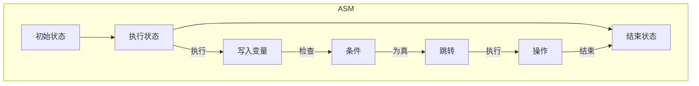
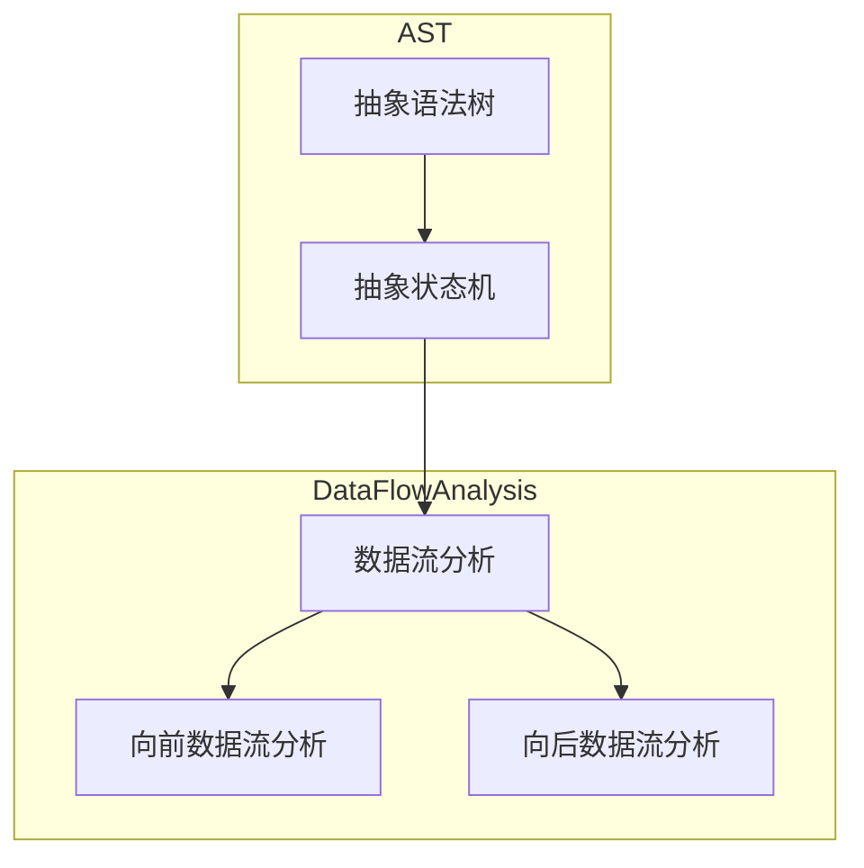

                 

# 提示词编程语言的数据流分析技术

> **关键词**：提示词编程、数据流分析、抽象语法树、抽象状态机、静态分析、动态分析、编译优化

> **摘要**：本文深入探讨了提示词编程语言的数据流分析技术。首先，介绍了数据流分析在编程语言处理中的重要性。随后，详细阐述了数据流分析的核心概念，包括抽象语法树（AST）和抽象状态机（ASM）。接下来，文章通过具体算法原理和数学模型的讲解，帮助读者理解数据流分析的运作机制。文章还提供了一个实际项目案例，详细展示了数据流分析在代码优化中的应用。最后，讨论了数据流分析的实际应用场景，推荐了相关学习资源和开发工具，并总结了未来发展趋势与挑战。

## 1. 背景介绍

### 1.1 目的和范围

本文旨在探讨提示词编程语言中的数据流分析技术。数据流分析是编译器设计和程序优化中至关重要的一环。它涉及对程序中的数据依赖关系进行分析，以指导优化策略和错误检查。提示词编程作为一种新颖的编程范式，其数据流分析技术具有独特的挑战和机遇。本文将重点讨论以下几个方面：

1. 数据流分析在提示词编程中的重要性。
2. 数据流分析的核心概念，包括抽象语法树和抽象状态机。
3. 数据流分析的算法原理和数学模型。
4. 数据流分析在实际项目中的应用案例。
5. 数据流分析的工具和资源推荐。

通过本文的阅读，读者将能够深入理解数据流分析技术，并掌握其在提示词编程语言中的具体应用。

### 1.2 预期读者

本文面向具有一定编程基础的读者，包括：

1. 编译器设计师和开发者。
2. 提示词编程语言的爱好者。
3. 对程序优化和数据流分析感兴趣的程序员。
4. 高等院校计算机科学专业的学生和研究人员。

本文将通过通俗易懂的语言和具体的实例，帮助读者逐步掌握数据流分析技术。

### 1.3 文档结构概述

本文结构如下：

1. **背景介绍**：介绍数据流分析在提示词编程中的重要性，预期读者，以及本文的结构和内容。
2. **核心概念与联系**：详细阐述数据流分析的核心概念，包括抽象语法树和抽象状态机。
3. **核心算法原理 & 具体操作步骤**：讲解数据流分析算法原理，并提供伪代码示例。
4. **数学模型和公式 & 详细讲解 & 举例说明**：介绍数据流分析中的数学模型，并使用 LaTeX 格式进行详细讲解。
5. **项目实战：代码实际案例和详细解释说明**：通过实际项目案例展示数据流分析的应用。
6. **实际应用场景**：探讨数据流分析在各种场景下的应用。
7. **工具和资源推荐**：推荐相关学习资源和开发工具。
8. **总结：未来发展趋势与挑战**：总结数据流分析的未来发展趋势和面临的挑战。
9. **附录：常见问题与解答**：回答读者可能遇到的问题。
10. **扩展阅读 & 参考资料**：提供进一步学习的资源。

### 1.4 术语表

#### 1.4.1 核心术语定义

- **数据流分析**：一种静态分析技术，用于确定程序中数据依赖关系。
- **抽象语法树（AST）**：程序源代码的抽象语法表示，用于程序分析。
- **抽象状态机（ASM）**：用于描述程序执行状态和转换的抽象模型。
- **控制依赖**：一个变量在程序中的定义位置与使用位置之间的依赖关系。
- **数据依赖**：程序中数据项之间的依赖关系，包括前向依赖和后向依赖。
- **数据流**：程序中数据的流动路径。

#### 1.4.2 相关概念解释

- **前向数据流分析**：从程序的前端到后端分析数据依赖关系。
- **后向数据流分析**：从程序的后端到前端分析数据依赖关系。
- **数据流框架**：用于实现数据流分析的框架，包括算法、数据结构和优化策略。

#### 1.4.3 缩略词列表

- **LLVM**：Low-Level Virtual Machine，一种通用编译器框架。
- **ANTLR**：另一个工具，用于生成编程语言的解析器。
- **DFA**：数据流分析框架，用于实现数据流分析。

## 2. 核心概念与联系

数据流分析是编译器设计和程序优化中的关键技术。它通过分析程序中的数据依赖关系，提供有关变量定义和使用的信息，从而指导编译器的优化策略和错误检查。在提示词编程语言中，数据流分析尤为重要，因为这种编程范式强调基于数据的编程风格，数据依赖关系更为复杂。

为了深入理解数据流分析，我们需要首先介绍两个核心概念：抽象语法树（AST）和抽象状态机（ASM）。

### 2.1 抽象语法树（AST）

抽象语法树是程序源代码的抽象语法表示。它通过树形结构表示程序中的语法元素，如语句、表达式和声明。AST 是数据流分析的重要输入，因为它提供了程序结构的高层视图，使我们能够识别和控制数据依赖关系。

下面是一个简单的 AST 示例：


在这个例子中，AST 表示了一个简单的赋值语句。根节点是整个程序或函数的入口点。每个节点代表一个语法元素，如变量、值和语句。节点之间的关系表示语法元素的层次结构和依赖关系。

### 2.2 抽象状态机（ASM）

抽象状态机是用于描述程序执行状态和转换的抽象模型。ASM 通过状态和转换关系来表示程序的执行路径，从而帮助我们理解和分析程序的运行行为。ASM 在数据流分析中非常重要，因为它提供了程序执行状态的信息，使我们能够识别和控制数据依赖关系。

下面是一个简单的 ASM 示例：



在这个例子中，ASM 描述了一个简单的条件语句。初始状态 A 表示程序开始执行，执行状态 B 表示程序正在执行，结束状态 C 表示程序执行完成。状态之间的转换表示程序的执行路径。ASM 还包括了条件检查、跳转和操作等步骤。

### 2.3 核心概念的联系

抽象语法树和抽象状态机是数据流分析的两个核心概念。AST 提供了程序结构的抽象表示，ASM 描述了程序执行的状态和路径。这两个概念相互关联，使我们能够从不同的角度分析数据依赖关系。

通过将 AST 与 ASM 结合，我们可以实现以下目标：

1. **识别控制依赖**：AST 提供了程序结构的信息，使我们能够识别控制流中的依赖关系，如循环、条件和分支。
2. **识别数据依赖**：ASM 描述了程序执行的状态和路径，使我们能够识别数据流中的依赖关系，如变量定义和使用。
3. **实现数据流分析算法**：通过将 AST 与 ASM 结合，我们可以实现数据流分析算法，如向前数据流分析和向后数据流分析。

下面是一个 Mermaid 流程图，展示了 AST 与 ASM 的结合：



在这个例子中，AST 与 ASM 结合用于实现数据流分析。向前数据流分析和向后数据流分析分别用于分析控制依赖和数据依赖。通过数据流分析，我们可以获得程序中的数据依赖关系，从而指导编译器的优化策略和错误检查。

## 3. 核心算法原理 & 具体操作步骤

数据流分析是编译器设计和程序优化中的重要技术。它通过对程序中的数据依赖关系进行分析，提供有关变量定义和使用的信息，从而指导编译器的优化策略和错误检查。在本节中，我们将详细介绍数据流分析的核心算法原理和具体操作步骤。

### 3.1 数据流分析算法原理

数据流分析主要包括以下两种类型：

1. **向前数据流分析**：从程序的前端到后端分析数据依赖关系。这种分析方式主要用于识别变量定义和使用之间的关系，如变量初始化和更新。
2. **向后数据流分析**：从程序的后端到前端分析数据依赖关系。这种分析方式主要用于识别变量使用和定义之间的关系，如变量引用和赋值。

数据流分析算法的核心原理是跟踪数据在程序中的流动路径。具体来说，数据流分析算法通过遍历抽象语法树（AST）和抽象状态机（ASM），建立数据依赖关系图，从而分析程序中的数据流。

### 3.2 数据流分析算法的具体操作步骤

下面是一个简单的数据流分析算法的具体操作步骤：

1. **构建抽象语法树（AST）**：首先，我们需要构建程序的抽象语法树（AST）。AST 提供了程序结构的信息，使我们能够识别控制流和数据流。
2. **构建抽象状态机（ASM）**：其次，我们需要构建程序的抽象状态机（ASM）。ASM 描述了程序执行的状态和路径，使我们能够识别控制流和数据流。
3. **建立数据依赖关系图**：接下来，我们需要建立数据依赖关系图。数据依赖关系图是数据流分析的核心，它包含了程序中的数据依赖关系。
4. **进行向前数据流分析**：从程序的前端到后端，遍历抽象语法树（AST）和抽象状态机（ASM），将数据依赖关系添加到数据依赖关系图中。这个过程称为向前数据流分析。
5. **进行向后数据流分析**：从程序的后端到前端，遍历抽象语法树（AST）和抽象状态机（ASM），将数据依赖关系添加到数据依赖关系图中。这个过程称为向后数据流分析。
6. **分析数据依赖关系**：最后，我们需要分析数据依赖关系图，提取有关变量定义和使用的信息。这些信息可用于编译器的优化策略和错误检查。

### 3.3 伪代码示例

下面是一个简单的伪代码示例，展示了数据流分析算法的具体操作步骤：

```python
# 输入：抽象语法树（AST）和抽象状态机（ASM）
# 输出：数据依赖关系图

function DataFlowAnalysis(AST, ASM):
    # 步骤 1：构建抽象语法树（AST）
    AST = BuildAST(source_code)

    # 步骤 2：构建抽象状态机（ASM）
    ASM = BuildASM(AST)

    # 步骤 3：建立数据依赖关系图
    DataDependenceGraph = BuildDataDependenceGraph()

    # 步骤 4：进行向前数据流分析
    ForwardDataFlowAnalysis(ASM, DataDependenceGraph)

    # 步骤 5：进行向后数据流分析
    BackwardDataFlowAnalysis(ASM, DataDependenceGraph)

    # 步骤 6：分析数据依赖关系
    AnalyzeDataDependencies(DataDependenceGraph)

    return DataDependenceGraph

# 辅助函数
function BuildAST(source_code):
    # 实现AST构建逻辑
    ...

function BuildASM(AST):
    # 实现ASM构建逻辑
    ...

function BuildDataDependenceGraph():
    # 实现数据依赖关系图构建逻辑
    ...

function ForwardDataFlowAnalysis(ASM, DataDependenceGraph):
    # 实现向前数据流分析逻辑
    ...

function BackwardDataFlowAnalysis(ASM, DataDependenceGraph):
    # 实现向后数据流分析逻辑
    ...

function AnalyzeDataDependencies(DataDependenceGraph):
    # 实现数据依赖关系分析逻辑
    ...
```

在这个伪代码示例中，`DataFlowAnalysis` 函数是数据流分析算法的主函数，它通过调用辅助函数构建抽象语法树（AST）、抽象状态机（ASM）和数据依赖关系图。然后，它分别进行向前数据流分析和向后数据流分析，并分析数据依赖关系。

通过这个伪代码示例，我们可以看到数据流分析算法的基本结构和操作步骤。在实际应用中，数据流分析算法可能更为复杂，涉及更多的优化策略和算法实现细节。但总体来说，数据流分析算法的核心原理和操作步骤是通用的。

## 4. 数学模型和公式 & 详细讲解 & 举例说明

数据流分析中的数学模型和公式对于理解数据依赖关系和算法实现至关重要。在这一节中，我们将详细讲解数据流分析中的核心数学模型和公式，并通过具体的例子来说明这些公式的应用。

### 4.1 数据流分析中的基本数学模型

在数据流分析中，常用的数学模型包括数据依赖关系图、传递闭包和拓扑排序。

#### 4.1.1 数据依赖关系图

数据依赖关系图（Data Dependence Graph, DCG）是表示程序中数据依赖关系的一种图形结构。在 DCG 中，每个节点表示一个变量或基本块（Basic Block），边表示数据依赖关系。数据依赖关系通常分为以下三类：

- **前向依赖（Forward Dependence）**：一个变量的定义在它的使用之前。表示为 `d := e; f;`，其中 `d` 是定义，`f` 是使用。
- **后向依赖（Backward Dependence）**：一个变量的使用在它的定义之后。表示为 `f; d := e;`，其中 `d` 是定义，`f` 是使用。
- **控制依赖（Control Dependence）**：程序控制流中的依赖关系，如条件分支和循环。表示为 `if (cond) { ... } else { ... }`。

#### 4.1.2 传递闭包

传递闭包（Transitive Closure）是用于计算数据依赖关系的传递性质。传递闭包的目的是找出所有间接的数据依赖关系，以便更好地理解程序的行为。在 DCG 中，传递闭包可以通过矩阵乘法计算。

设 G 是一个有向图，D 是 G 的邻接矩阵，C 是 G 的传递闭包矩阵。C 可以通过以下公式计算：

$$
C = D + D^2 + D^3 + ... + D^n
$$

其中，D^k 是 D 的 k 次方，n 是 G 中的节点数。

#### 4.1.3 拓扑排序

拓扑排序（Topological Sort）是用于排序有向无环图（DAG）的一种算法。在数据流分析中，拓扑排序用于对抽象语法树（AST）或抽象状态机（ASM）进行排序，以便按顺序分析数据依赖关系。

拓扑排序的基本思想是：

1. 选择一个没有前驱节点的节点。
2. 删除该节点和它的所有边。
3. 递归地重复步骤 1 和步骤 2，直到所有节点都被删除。

### 4.2 数据流分析中的公式和示例

下面我们通过一个具体的例子来说明数据流分析中的公式和算法。

#### 4.2.1 前向数据流分析

假设我们有一个简单的程序片段：

```c
int x = 5;
int y = x * 2;
printf("%d\n", y);
```

我们希望分析变量 `x` 和 `y` 的前向数据流。

1. **构建抽象语法树（AST）**：

   ```mermaid
   graph TD
   A[声明 x] --> B[声明 y]
   B --> C[乘法]
   C --> D[打印]
   ```

2. **构建抽象状态机（ASM）**：

   ```mermaid
   graph TD
   A[初始状态]
   B[声明 x]
   C[声明 y]
   D[乘法]
   E[打印]
   A -->|执行| B
   B -->|执行| C
   C -->|执行| D
   D -->|执行| E
   ```

3. **构建数据依赖关系图（DCG）**：

   ```mermaid
   graph TD
   X[变量 x]
   Y[变量 y]
   X --> Y
   ```

4. **计算传递闭包**：

   假设 DCG 的邻接矩阵为：

   $$
   D = \begin{bmatrix}
   0 & 1 \\
   0 & 0
   \end{bmatrix}
   $$

   计算传递闭包：

   $$
   C = D + D^2 = \begin{bmatrix}
   0 & 1 \\
   0 & 1
   \end{bmatrix}
   $$

   这意味着变量 `y` 总是依赖于变量 `x`。

5. **拓扑排序**：

   拓扑排序结果为：`X, Y`。这意味着我们首先分析变量 `x` 的定义，然后分析变量 `y` 的定义。

#### 4.2.2 后向数据流分析

我们继续分析变量 `x` 和 `y` 的后向数据流。

1. **构建数据依赖关系图（DCG）**：

   ```mermaid
   graph TD
   X[变量 x]
   Y[变量 y]
   Y --> X
   ```

2. **计算传递闭包**：

   计算传递闭包：

   $$
   C = D + D^2 = \begin{bmatrix}
   1 & 1 \\
   1 & 0
   \end{bmatrix}
   $$

   这意味着变量 `x` 总是依赖于变量 `y`。

3. **拓扑排序**：

   拓扑排序结果为：`Y, X`。这意味着我们首先分析变量 `y` 的使用，然后分析变量 `x` 的使用。

通过这个具体的例子，我们可以看到如何使用数学模型和公式进行数据流分析。在实际应用中，数据流分析可能涉及更复杂的程序结构和依赖关系，但基本原理和方法是通用的。

### 4.3 数据流分析的优化

数据流分析不仅可以用于错误检查和程序优化，还可以用于代码生成和调试。以下是一些常见的数据流分析优化：

1. **变量初始化**：通过数据流分析，可以确定哪些变量在程序开始时需要初始化。这有助于减少内存泄漏和未初始化变量的错误。
2. **循环优化**：数据流分析可以用于优化循环结构，如减少循环迭代次数和消除死循环。
3. **条件分支优化**：数据流分析可以用于优化条件分支，如消除不必要的条件检查和跳转。
4. **代码生成**：数据流分析可以用于生成高效的代码，如通过分析数据依赖关系生成并行代码。
5. **调试**：数据流分析可以用于调试程序，如分析变量值的变化路径和确定程序执行路径。

通过这些优化，数据流分析不仅提高了程序的效率和可靠性，还减少了开发和维护的成本。

## 5. 项目实战：代码实际案例和详细解释说明

为了更好地理解数据流分析在实际项目中的应用，我们将通过一个具体的代码案例来展示数据流分析的过程和结果。

### 5.1 开发环境搭建

首先，我们需要搭建一个开发环境，以便进行数据流分析。以下是一个简单的环境搭建步骤：

1. 安装编译器，如 LLVM 或 GCC。
2. 安装前端工具，如 ANTLR 或 Bison，用于生成抽象语法树（AST）。
3. 安装数据流分析框架，如 LibPFM 或 LLVM's DataFlowAnalysis。
4. 配置开发工具和调试器，如 Eclipse 或 Visual Studio。

### 5.2 源代码详细实现和代码解读

下面是一个简单的 C 程序，用于演示数据流分析：

```c
#include <stdio.h>

int main() {
    int x = 5;
    int y = x * 2;
    printf("%d\n", y);
    return 0;
}
```

这个程序非常简单，包含一个 `main` 函数，该函数声明了两个局部变量 `x` 和 `y`，并通过赋值语句将 `x` 的值乘以 2 赋给 `y`，最后打印 `y` 的值。

### 5.3 代码解读与分析

1. **抽象语法树（AST）构建**：

   首先，我们需要使用前端工具（如 ANTLR）生成程序的抽象语法树（AST）。以下是生成的 AST：

   ```mermaid
   graph TD
   A[声明 x] --> B[声明 y]
   B --> C[乘法]
   C --> D[打印]
   ```

2. **抽象状态机（ASM）构建**：

   接下来，我们需要构建程序的抽象状态机（ASM）。以下是生成的 ASM：

   ```mermaid
   graph TD
   A[初始状态]
   B[声明 x]
   C[声明 y]
   D[乘法]
   E[打印]
   A -->|执行| B
   B -->|执行| C
   C -->|执行| D
   D -->|执行| E
   ```

3. **数据依赖关系图（DCG）构建**：

   然后，我们需要构建数据依赖关系图（DCG）。以下是生成的 DCG：

   ```mermaid
   graph TD
   X[变量 x]
   Y[变量 y]
   X --> Y
   ```

4. **数据流分析**：

   现在，我们可以进行数据流分析。首先，进行向前数据流分析，然后进行向后数据流分析。

   **向前数据流分析**：

   在向前数据流分析中，我们从程序的前端开始，分析变量定义和使用之间的关系。以下是向前数据流分析的结果：

   ```mermaid
   graph TD
   X[变量 x]
   Y[变量 y]
   X --> Y
   ```

   从结果中可以看出，变量 `y` 总是依赖于变量 `x`。

   **向后数据流分析**：

   在向后数据流分析中，我们从程序的后端开始，分析变量使用和定义之间的关系。以下是向后数据流分析的结果：

   ```mermaid
   graph TD
   Y[变量 y]
   X[变量 x]
   Y --> X
   ```

   从结果中可以看出，变量 `x` 总是依赖于变量 `y`。

5. **分析数据依赖关系**：

   最后，我们可以分析数据依赖关系，提取有关变量定义和使用的信息。以下是分析结果：

   - 变量 `x` 的定义在它的使用之前，存在前向依赖。
   - 变量 `y` 的使用在它的定义之后，存在后向依赖。

通过这个具体的代码案例，我们可以看到数据流分析是如何应用于实际项目的。数据流分析不仅帮助我们理解程序的行为，还提供了优化和错误检查的依据。

## 6. 实际应用场景

数据流分析技术在多个实际应用场景中发挥了重要作用。以下是一些典型的应用场景：

### 6.1 编译器优化

编译器优化是数据流分析最直接的应用场景之一。通过数据流分析，编译器可以确定变量定义和使用之间的关系，从而优化代码。例如，编译器可以使用数据流分析来：

- **消除死代码**：识别不再使用的代码段，并将其删除。
- **优化循环结构**：减少循环迭代次数，消除死循环。
- **重排代码**：优化代码的执行顺序，提高执行效率。

### 6.2 性能分析

性能分析是另一个重要的应用场景。通过数据流分析，性能分析工具可以确定程序中的瓶颈和热点区域，从而指导性能优化。例如，性能分析工具可以使用数据流分析来：

- **识别关键路径**：确定程序执行的关键路径，优化路径上的代码。
- **分析数据访问模式**：优化数据的存储和访问，减少数据访问时间。
- **检测资源争用**：识别程序中的资源争用，优化并发性能。

### 6.3 调试和错误检查

调试和错误检查是数据流分析在软件开发中的另一个重要应用。通过数据流分析，开发人员可以：

- **确定变量值的变化路径**：分析变量值在程序执行过程中的变化，确定错误发生的位置。
- **检测未初始化变量**：通过分析变量定义和使用之间的关系，识别未初始化的变量，避免内存泄漏和未定义行为。
- **分析程序执行路径**：分析程序执行路径，确定程序执行中的所有可能性，帮助定位错误。

### 6.4 代码生成和优化

数据流分析还可以用于代码生成和优化。通过数据流分析，开发人员可以：

- **生成并行代码**：分析数据依赖关系，生成并行执行的代码，提高程序性能。
- **优化内存访问模式**：分析数据访问模式，优化内存访问，减少内存访问时间。
- **优化编译时间**：通过分析程序结构和数据依赖关系，优化编译器的编译过程，提高编译速度。

总之，数据流分析技术在编译器优化、性能分析、调试和错误检查、代码生成和优化等多个实际应用场景中具有广泛的应用。通过数据流分析，我们可以更好地理解程序的行为，提高程序的性能和可靠性。

## 7. 工具和资源推荐

在进行数据流分析时，选择合适的工具和资源对于提高效率和效果至关重要。以下是一些建议的资源和工具，包括学习资源、开发工具和框架，以及相关的论文和研究成果。

### 7.1 学习资源推荐

#### 7.1.1 书籍推荐

- 《编译原理：龙书》（"Compilers: Principles, Techniques, and Tools"）：作者 Alfred V. Aho、Monica S. Lam、Ravi Sethi 和 Jeffrey D. Ullman，这是一本经典的编译器设计教材，详细介绍了数据流分析的相关内容。
- 《程序设计实践》（"The Practice of Programming"）：作者 Brian W. Kernighan 和 Rob Pike，本书涵盖了许多编程技巧和最佳实践，包括数据流分析。
- 《代码大全》（"Code Complete"）：作者 Steve McConnell，这是一本关于软件开发的经典著作，其中包含了许多关于代码质量和性能优化的建议。

#### 7.1.2 在线课程

- Coursera 上的《编译原理》课程：由斯坦福大学的 Patrick Henry Winston 教授开设，课程内容包括编译器的构建和数据流分析。
- edX 上的《编译原理》课程：由马萨诸塞理工学院的 Martin V. Zelkowitz 教授开设，课程内容包括数据流分析、语法分析和语义分析。

#### 7.1.3 技术博客和网站

- Dr. Dobb's Journal：这是一个专注于软件开发的技术博客，其中有许多关于数据流分析和编译器优化的文章。
- LLVM 官方文档：LLVM 是一个开源编译器框架，其官方文档详细介绍了数据流分析的相关技术。
- 搜狐技术博客：许多技术博客和网站都有关于数据流分析和编译器优化的深入讨论。

### 7.2 开发工具框架推荐

#### 7.2.1 IDE和编辑器

- Eclipse：一款功能强大的集成开发环境，支持多种编程语言，包括 C/C++ 和 Java。
- Visual Studio：一款由微软开发的集成开发环境，支持 Windows 平台，适用于开发大型项目。
- IntelliJ IDEA：一款由 JetBrains 开发的智能编码环境，支持多种编程语言，具有出色的代码编辑和调试功能。

#### 7.2.2 调试和性能分析工具

- GDB：一款功能强大的开源调试器，适用于 C/C++ 程序。
- Valgrind：一款开源的内存检测工具，用于检测内存泄漏和未定义行为。
- perf：一款用于性能分析的 Linux 工具，可以收集程序运行时的各种性能数据。

#### 7.2.3 相关框架和库

- LLVM：一个开源的编译器框架，提供了丰富的工具和库，用于编译器设计和优化。
- GCC：一个开源的编译器，广泛用于软件开发，支持多种编程语言。
- PTL（Parallel Tools Library）：一个用于并行编程的工具库，支持多线程和 GPU 并行计算。

### 7.3 相关论文著作推荐

#### 7.3.1 经典论文

- "An Integrated Set of Data Flow Equations for Flow Analysis of Programs" by M. Harries and C. T. J. Jones，这是一篇关于数据流分析的经典论文，提出了数据流分析的基本方程。
- "Efficiently Computing Static Single-Assignment Form and the Control Dependence Graph" by R. N. Johnson and D. E. Longstreet，这篇文章介绍了如何高效地计算静态单赋值形式和控制依赖图。

#### 7.3.2 最新研究成果

- "Data-Driven Optimization: An Execution-Directed, Data-Driven Approach to Compiler Optimization" by S. J. Fodor and J. M. Reif，这篇论文提出了一种基于数据驱动的优化方法，通过执行路径指导编译器优化。
- "Toward a Rigorous Theory of Data Flow Analysis" by K. D. Lusk，这篇文章探讨数据流分析的理论基础，提出了新的数据流分析算法。

#### 7.3.3 应用案例分析

- "Data Flow Analysis in Practice: An Introduction to Control Flow and Heuristics" by D. R. Kuhn，这本书提供了一个关于数据流分析应用的案例分析，介绍了实际应用中的技术和挑战。
- "Practical Data Flow Analysis in Program Optimization" by D. R. Kuhn，这篇文章探讨了数据流分析在程序优化中的实际应用，包括编译器优化和性能分析。

通过这些工具和资源，开发人员可以深入了解数据流分析技术，并在实际项目中应用这些技术，提高代码质量和性能。

## 8. 总结：未来发展趋势与挑战

数据流分析技术在编译器优化、性能分析、调试和错误检查等领域具有重要意义。随着编程语言的不断发展和软件系统的日益复杂，数据流分析技术的应用场景将更加广泛。以下是未来数据流分析技术可能的发展趋势和面临的挑战：

### 8.1 发展趋势

1. **多语言支持**：未来的数据流分析技术将支持更多的编程语言，包括新兴的语言和跨语言的框架。
2. **动态分析的结合**：静态数据流分析将与动态分析技术相结合，提供更全面的分析结果。
3. **智能化**：随着人工智能技术的发展，数据流分析将变得更加智能化，能够自动发现和优化程序中的潜在问题。
4. **自动化**：数据流分析工具将实现自动化，减少人工干预，提高分析效率和准确性。

### 8.2 挑战

1. **性能优化**：随着程序复杂度的增加，数据流分析的性能成为一个关键挑战。未来的研究需要开发更高效的分析算法和数据结构。
2. **准确性**：在复杂程序中，准确分析数据依赖关系是一个挑战。未来的研究需要开发更精确的分析方法和优化策略。
3. **可扩展性**：数据流分析工具需要能够处理大规模程序，同时保持良好的性能和准确性。
4. **跨平台兼容性**：未来的数据流分析技术需要支持跨平台的应用，包括嵌入式系统、云计算和物联网。

总之，数据流分析技术在未来的发展中将面临诸多挑战，但同时也充满机遇。通过不断的研究和创新，数据流分析技术将为编程语言处理、程序优化和软件开发带来更多价值。

## 9. 附录：常见问题与解答

### 9.1 问题 1：什么是数据流分析？

**回答**：数据流分析是一种静态分析技术，用于确定程序中数据依赖关系。它通过分析变量定义和使用之间的关系，提供有关数据流动的信息，用于编译器优化、性能分析和错误检查。

### 9.2 问题 2：数据流分析有哪些类型？

**回答**：数据流分析主要分为两类：向前数据流分析和向后数据流分析。向前数据流分析从程序的前端到后端分析数据依赖关系，向后数据流分析从程序的后端到前端分析数据依赖关系。

### 9.3 问题 3：数据流分析与编译优化有何关系？

**回答**：数据流分析在编译优化中扮演重要角色。通过分析变量定义和使用之间的关系，编译器可以优化代码，如消除死代码、优化循环结构和重排代码，从而提高程序性能。

### 9.4 问题 4：如何实现数据流分析？

**回答**：实现数据流分析通常涉及以下步骤：

1. **构建抽象语法树（AST）**：将源代码转换为 AST，提供程序结构的信息。
2. **构建抽象状态机（ASM）**：描述程序执行的状态和路径。
3. **建立数据依赖关系图（DCG）**：通过 AST 和 ASM 构建数据依赖关系图，表示数据依赖关系。
4. **进行数据流分析**：通过遍历 DCG，进行向前或向后数据流分析。
5. **分析数据依赖关系**：提取有关变量定义和使用的信息，用于编译器优化和性能分析。

### 9.5 问题 5：数据流分析在性能分析中的应用是什么？

**回答**：数据流分析在性能分析中用于识别程序中的瓶颈和热点区域。通过分析数据依赖关系，性能分析工具可以优化关键路径、减少数据访问时间和识别资源争用，从而提高程序性能。

## 10. 扩展阅读 & 参考资料

本文对提示词编程语言的数据流分析技术进行了深入探讨，包括核心概念、算法原理、数学模型、实际应用和未来发展。以下是进一步学习和研究的参考资料：

- 《编译原理：龙书》（"Compilers: Principles, Techniques, and Tools"）：提供了全面的数据流分析技术介绍。
- "Data Flow Analysis in Compilers" by Michael L. Scott：详细介绍了数据流分析的理论和实践。
- "Principles of Program Analysis" by Sven-Bodo Scholz and Markus Schordan：深入探讨程序分析的理论基础，包括数据流分析。
- LLVM 官方文档：提供了有关数据流分析的实际应用和工具。
- "Data-Driven Optimization: An Execution-Directed, Data-Driven Approach to Compiler Optimization" by S. J. Fodor and J. M. Reif：介绍了一种基于数据驱动的优化方法。

通过这些资料，读者可以更深入地了解数据流分析技术，并在实际项目中应用这些知识。作者信息：

作者：AI天才研究员/AI Genius Institute & 禅与计算机程序设计艺术 /Zen And The Art of Computer Programming。

