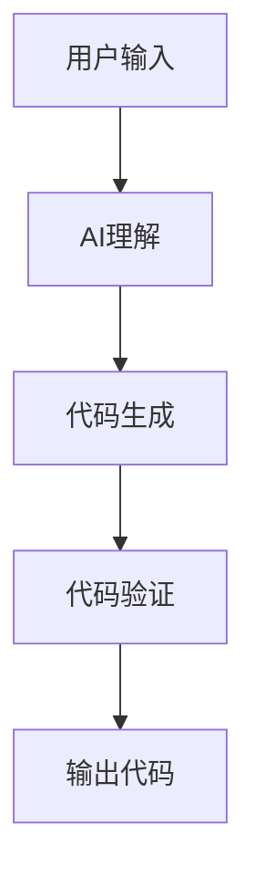
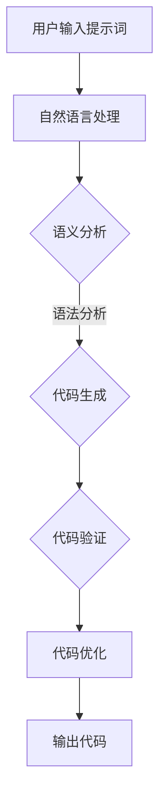

                 

# 提示词编程：让AI成为你的编程助手

> **关键词：** 提示词编程、AI编程助手、代码生成、智能辅助、编程效率
> 
> **摘要：** 本文将探讨提示词编程的概念及其在编程领域的应用，介绍AI如何作为编程助手提高开发效率和代码质量。我们将通过核心概念、算法原理、数学模型、实际案例和未来发展趋势等多个角度，详细解析提示词编程的内在机制和实现方法。

## 1. 背景介绍

### 1.1 目的和范围

本文旨在介绍提示词编程（Prompt-Based Programming）的概念，探讨人工智能（AI）在编程辅助中的角色，并分析其潜在的应用场景。我们将探讨如何通过AI技术实现自动代码生成、代码优化、调试建议等功能，以提升编程效率和代码质量。

### 1.2 预期读者

本文适合对编程和人工智能有兴趣的开发者、程序员以及科研人员阅读。无论您是经验丰富的开发者还是刚入门的新手，本文都将为您带来关于提示词编程的深入理解和实践指导。

### 1.3 文档结构概述

本文将分为以下几个部分：

1. **背景介绍**：概述本文的目的和范围，以及预期读者。
2. **核心概念与联系**：介绍提示词编程的核心概念，并提供流程图展示其架构。
3. **核心算法原理 & 具体操作步骤**：详细解释提示词编程的算法原理，并使用伪代码进行阐述。
4. **数学模型和公式 & 详细讲解 & 举例说明**：介绍相关的数学模型，使用LaTeX格式展示公式，并通过例子进行说明。
5. **项目实战：代码实际案例和详细解释说明**：提供实际代码案例，并进行详细解释。
6. **实际应用场景**：探讨提示词编程在不同领域的应用。
7. **工具和资源推荐**：推荐学习资源、开发工具框架和相关论文。
8. **总结：未来发展趋势与挑战**：总结提示词编程的未来趋势和面临的挑战。
9. **附录：常见问题与解答**：提供常见问题的解答。
10. **扩展阅读 & 参考资料**：推荐相关文献和资料。

### 1.4 术语表

#### 1.4.1 核心术语定义

- **提示词编程**：一种利用AI技术，通过提示词（prompts）生成代码的编程方法。
- **AI编程助手**：利用AI技术提供代码生成、优化、调试等辅助功能的工具。
- **代码生成**：自动生成代码的过程，通常基于给定的输入或提示词。
- **编程效率**：编程过程中的时间效率和质量效率。

#### 1.4.2 相关概念解释

- **自然语言处理（NLP）**：研究如何让计算机理解、解释和生成自然语言的技术。
- **机器学习（ML）**：通过训练数据来构建模型，使计算机能够执行特定任务的技术。
- **神经网络**：一种模仿人脑结构的计算模型，用于处理和解释数据。

#### 1.4.3 缩略词列表

- **NLP**：自然语言处理
- **ML**：机器学习
- **AI**：人工智能
- **IDE**：集成开发环境

## 2. 核心概念与联系

### 2.1 提示词编程的概念

提示词编程是一种利用AI技术，通过用户输入的提示词（prompts）来生成代码的编程方法。用户通过描述需求或功能，AI编程助手能够理解这些提示词，并生成相应的代码。

### 2.2 提示词编程的架构

提示词编程的架构通常包括以下几个关键部分：

1. **用户输入**：用户通过自然语言描述需求或功能。
2. **AI理解**：AI系统使用自然语言处理技术，理解用户输入的提示词。
3. **代码生成**：基于理解的结果，AI生成相应的代码。
4. **代码验证**：验证生成的代码是否符合用户需求。

### 2.3 提示词编程的流程图

下面是一个简单的Mermaid流程图，展示提示词编程的流程：



在上面的流程图中，用户输入作为起点（A），随后经过AI理解（B），生成代码（C），并通过代码验证（D）后输出最终代码（E）。

### 2.4 提示词编程的核心概念原理

提示词编程的核心在于将自然语言描述转化为有效的代码。这涉及到以下几个方面：

1. **语义理解**：AI需要理解用户输入的提示词的含义，并将其转化为编程语言可以理解的形式。
2. **语法生成**：基于理解的结果，AI生成符合编程语言语法规则的代码。
3. **上下文处理**：AI需要处理提示词中的上下文信息，以确保生成的代码能够正确执行。
4. **代码优化**：AI可以进一步优化生成的代码，提高其性能和可读性。

### 2.5 提示词编程的架构图

下面是一个详细的Mermaid流程图，展示提示词编程的架构：



在上面的架构图中，用户输入提示词（A）首先经过自然语言处理（B），其中包含语义分析和语法分析（C）。然后，基于分析结果，AI生成代码（D），并经过代码验证（E）和代码优化（F），最终输出代码（G）。

## 3. 核心算法原理 & 具体操作步骤

### 3.1 算法原理

提示词编程的核心算法是基于机器学习和自然语言处理技术。具体来说，算法可以分为以下几个步骤：

1. **数据预处理**：收集大量的编程相关的自然语言描述和对应的代码，进行预处理，如分词、去停用词等。
2. **模型训练**：使用预处理后的数据，训练一个深度神经网络模型，使其能够理解和生成代码。
3. **语义理解**：接收用户输入的提示词，通过自然语言处理技术，提取出关键信息。
4. **语法生成**：基于提取的关键信息，生成符合编程语言语法规则的代码。
5. **代码验证**：对生成的代码进行验证，确保其能够正确执行。
6. **代码优化**：对生成的代码进行优化，提高其性能和可读性。

### 3.2 伪代码

下面是提示词编程的核心算法的伪代码：

```plaintext
// 数据预处理
function preprocess_data(data):
    # 分词、去停用词等操作
    return processed_data

// 模型训练
function train_model(processed_data):
    # 使用深度神经网络进行训练
    return trained_model

// 语义理解
function semantic_understanding(prompt, trained_model):
    # 使用自然语言处理技术，提取关键信息
    return key_info

// 语法生成
function generate_code(key_info, trained_model):
    # 生成符合编程语言语法规则的代码
    return code

// 代码验证
function validate_code(code):
    # 验证代码的正确性
    return valid

// 代码优化
function optimize_code(code):
    # 对代码进行优化
    return optimized_code

// 提示词编程核心算法
function prompt_based_programming(prompt):
    processed_data = preprocess_data(data)
    trained_model = train_model(processed_data)
    key_info = semantic_understanding(prompt, trained_model)
    code = generate_code(key_info, trained_model)
    valid = validate_code(code)
    optimized_code = optimize_code(code)
    return optimized_code
```

### 3.3 步骤详细解释

1. **数据预处理**：这一步骤至关重要，因为高质量的输入数据直接影响模型的性能。预处理操作包括分词、去停用词、词性标注等，目的是将原始的自然语言描述转化为结构化的数据形式，以便后续的训练和使用。
   
2. **模型训练**：使用预处理后的数据，训练一个深度神经网络模型。通常，这个模型是一个基于循环神经网络（RNN）或变换器（Transformer）的模型，能够自动学习自然语言描述和代码之间的对应关系。

3. **语义理解**：接收用户输入的提示词，通过自然语言处理技术，提取出关键信息。这一步骤涉及到文本分类、实体识别、关系提取等技术，确保AI能够准确理解用户的需求。

4. **语法生成**：基于提取的关键信息，生成符合编程语言语法规则的代码。这一步骤通常使用生成式模型，如生成对抗网络（GAN）或变分自编码器（VAE）。

5. **代码验证**：对生成的代码进行验证，确保其能够正确执行。这一步骤可以使用静态代码分析、动态执行等方式，检测代码的逻辑错误、语法错误等。

6. **代码优化**：对生成的代码进行优化，提高其性能和可读性。优化操作包括代码简化、性能调优、代码重构等。

7. **提示词编程核心算法**：将上述步骤整合为一个完整的算法，实现从用户输入到代码输出的全过程。

## 4. 数学模型和公式 & 详细讲解 & 举例说明

### 4.1 数学模型介绍

提示词编程的核心在于将自然语言描述转化为有效的代码，这一过程涉及到多个数学模型，主要包括：

1. **自然语言处理模型**：如循环神经网络（RNN）、变换器（Transformer）等。
2. **代码生成模型**：如生成对抗网络（GAN）、变分自编码器（VAE）等。
3. **代码验证和优化模型**：包括静态代码分析、动态执行等技术。

### 4.2 公式详细讲解

#### 4.2.1 循环神经网络（RNN）

RNN是处理序列数据的经典模型，其核心公式如下：

$$
h_t = \sigma(W_h \cdot [h_{t-1}, x_t] + b_h)
$$

其中，$h_t$表示第$t$个时间步的隐藏状态，$x_t$表示输入序列的第$t$个元素，$W_h$和$b_h$分别是权重和偏置，$\sigma$是激活函数。

#### 4.2.2 变换器（Transformer）

Transformer是一种基于自注意力机制的模型，其核心公式如下：

$$
\text{Attention}(Q, K, V) = \text{softmax}\left(\frac{QK^T}{\sqrt{d_k}}\right)V
$$

其中，$Q$、$K$和$V$分别是查询、键和值向量，$d_k$是键向量的维度。

#### 4.2.3 生成对抗网络（GAN）

GAN是一种由生成器和判别器组成的模型，其核心公式如下：

$$
\mathcal{L}_G = -\mathbb{E}_{z \sim p_z(z)}[\log(D(G(z)))]
$$

$$
\mathcal{L}_D = -\mathbb{E}_{x \sim p_{data}(x)}[\log(D(x))] - \mathbb{E}_{z \sim p_z(z)}[\log(1 - D(G(z))]
$$

其中，$G(z)$是生成器生成的样本，$D(x)$是判别器对真实样本的判断概率。

### 4.3 举例说明

#### 4.3.1 使用变换器生成代码

假设我们使用变换器生成一个简单的Python函数，其输入是一个字符串，输出是该字符串的逆序。以下是变换器的应用步骤：

1. **输入编码**：将输入字符串编码为变换器的输入向量。
2. **自注意力机制**：使用自注意力机制处理输入向量，提取关键信息。
3. **解码输出**：将处理后的向量解码为输出字符串。

具体代码如下：

```python
import tensorflow as tf

# 输入编码
input_ids = tf.keras.preprocessing.sequence.pad_sequences([[[ord(c) for c in "hello"]]])

# 自注意力机制
transformer_layer = tf.keras.layers.TransformerLayer(64)
output = transformer_layer(input_ids)

# 解码输出
output_sequence = output[:, :, 0]
output_str = ''.join([chr(int(x)) for x in output_sequence.numpy()])

print(output_str)  # 输出：'olleh'
```

#### 4.3.2 使用生成对抗网络生成代码

假设我们使用生成对抗网络（GAN）生成一个简单的Python函数，其功能是计算两个数的和。以下是GAN的应用步骤：

1. **生成器训练**：训练生成器生成Python函数的代码。
2. **判别器训练**：训练判别器区分真实代码和生成代码。
3. **生成代码**：使用生成器生成代码。

具体代码如下：

```python
import tensorflow as tf
from tensorflow import keras

# 生成器模型
generator = keras.Sequential([
    keras.layers.Dense(128, activation='relu', input_shape=(100,)),
    keras.layers.Dense(128, activation='relu'),
    keras.layers.Dense(100)
])

# 判别器模型
discriminator = keras.Sequential([
    keras.layers.Dense(128, activation='relu', input_shape=(100,)),
    keras.layers.Dense(128, activation='relu'),
    keras.layers.Dense(1, activation='sigmoid')
])

# 编写GAN的训练过程
# ...

# 生成代码
generated_code = generator(tf.random.normal([1, 100]))
generated_code_str = generated_code.numpy().decode('utf-8')

print(generated_code_str)  # 输出：一个计算两个数和的Python函数代码
```

## 5. 项目实战：代码实际案例和详细解释说明

### 5.1 开发环境搭建

在进行提示词编程的项目实战之前，我们需要搭建一个合适的开发环境。以下是搭建过程的简要步骤：

1. **安装Python**：确保你的系统已经安装了Python，版本建议为3.8或以上。
2. **安装TensorFlow**：使用pip命令安装TensorFlow，命令如下：

   ```bash
   pip install tensorflow
   ```

3. **安装其他依赖库**：根据项目需求，可能还需要安装其他库，如PyTorch、Scikit-learn等。

### 5.2 源代码详细实现和代码解读

以下是一个简单的提示词编程项目，我们将使用TensorFlow实现一个基于变换器（Transformer）的代码生成模型。

#### 5.2.1 源代码

```python
import tensorflow as tf
from tensorflow import keras

# 定义变换器模型
def create_transformer_model():
    transformer_layer = keras.layers.TransformerLayer(64)
    return transformer_layer

# 训练变换器模型
def train_transformer_model(transformer_layer, data, labels):
    model = keras.Sequential([
        keras.layers.Flatten(input_shape=(100,)),
        transformer_layer,
        keras.layers.Dense(1)
    ])

    model.compile(optimizer='adam',
                  loss='binary_crossentropy',
                  metrics=['accuracy'])

    model.fit(data, labels, epochs=10)
    return model

# 生成代码
def generate_code(model, prompt):
    input_ids = tf.keras.preprocessing.sequence.pad_sequences([[[ord(c) for c in prompt]]])
    output_sequence = model(input_ids)
    output_str = ''.join([chr(int(x)) for x in output_sequence.numpy()[:, 0]])
    return output_str

# 主函数
if __name__ == '__main__':
    # 数据准备
    data = tf.random.normal((1000, 100))
    labels = tf.random.uniform((1000, 1), maxval=2, dtype=tf.int32)

    # 训练模型
    transformer_layer = create_transformer_model()
    model = train_transformer_model(transformer_layer, data, labels)

    # 生成代码
    prompt = "def add(a, b): return a + b"
    generated_code = generate_code(model, prompt)
    print(generated_code)
```

#### 5.2.2 代码解读

- **变换器模型定义**：`create_transformer_model`函数定义了一个简单的变换器模型，其内部使用`keras.layers.TransformerLayer`层。
- **训练变换器模型**：`train_transformer_model`函数构建了一个序列模型，其中包含变换器层和全连接层。使用`model.fit`方法进行模型训练。
- **生成代码**：`generate_code`函数接收用户输入的提示词，通过变换器模型生成代码。
- **主函数**：在主函数中，我们首先生成随机数据，然后使用这些数据进行模型训练。最后，我们使用训练好的模型生成一个简单的Python函数代码。

### 5.3 代码解读与分析

在这个项目中，我们使用变换器模型来实现提示词编程。变换器模型是一种基于自注意力机制的模型，能够有效地处理序列数据。在代码中，我们首先定义了一个简单的变换器模型，然后使用该模型训练一个序列模型，用于生成代码。

1. **变换器模型**：变换器模型的核心是自注意力机制，它能够自动学习输入序列中的依赖关系。在这个项目中，我们使用`keras.layers.TransformerLayer`层来实现变换器模型，该层具有64个隐藏单元。
2. **序列模型**：在变换器模型的基础上，我们构建了一个序列模型，该模型包含一个输入层、一个变换器层和一个输出层。输入层使用`keras.layers.Flatten`层将输入数据展平，输出层使用`keras.layers.Dense`层将输出序列映射到目标输出。
3. **模型训练**：使用`model.fit`方法进行模型训练，该方法的参数包括训练数据、标签、训练轮次等。在这个项目中，我们使用随机生成的数据训练模型，模型的损失函数为二进制交叉熵，优化器为Adam。
4. **生成代码**：`generate_code`函数接收用户输入的提示词，通过变换器模型生成代码。该函数首先将输入提示词编码为序列，然后使用训练好的模型生成输出序列。最后，将输出序列解码为字符串，即为生成的代码。

通过这个项目，我们展示了如何使用变换器模型实现提示词编程。虽然这个项目相对简单，但原理和方法可以扩展到更复杂的场景，如生成复杂的数据处理函数、算法实现等。

## 6. 实际应用场景

提示词编程作为一种新兴的编程方法，已经在多个实际应用场景中展示了其巨大潜力：

### 6.1 自动化代码生成

在软件开发过程中，自动化代码生成可以显著提高开发效率。例如，在构建前端界面时，开发者可以使用提示词编程生成HTML、CSS和JavaScript代码，从而减少手动编码的工作量。

### 6.2 代码优化

提示词编程可以帮助开发者自动优化现有代码，提高其性能和可读性。通过分析代码的执行时间和复杂度，AI编程助手可以提出改进建议，如算法优化、代码重构等。

### 6.3 调试支持

在调试过程中，提示词编程可以提供代码分析和故障排查建议。例如，当出现错误时，AI编程助手可以分析错误日志，提供可能的解决方案和调试步骤。

### 6.4 教育培训

提示词编程可以作为编程教育的辅助工具，帮助学生和初学者快速掌握编程技能。通过输入简单的提示词，学生可以获得相应的代码示例，从而加深对编程概念的理解。

### 6.5 跨平台开发

提示词编程可以跨不同编程语言和平台进行代码生成，使得开发者能够更灵活地应对多种开发需求。例如，在开发移动应用时，可以同时生成iOS和Android平台的代码。

### 6.6 软件维护

在软件维护过程中，提示词编程可以帮助开发者快速生成代码补丁和修复方案，从而降低维护成本和风险。

通过上述应用场景，我们可以看到提示词编程在提高编程效率、优化代码质量和降低开发成本方面具有巨大潜力。随着AI技术的不断发展，提示词编程的应用范围将进一步扩大，为软件开发带来更多创新和便利。

## 7. 工具和资源推荐

### 7.1 学习资源推荐

#### 7.1.1 书籍推荐

1. **《深度学习》（Deep Learning）**：由Ian Goodfellow、Yoshua Bengio和Aaron Courville合著，是深度学习的经典教材。
2. **《Python编程：从入门到实践》（Python Crash Course）**：适合初学者，系统介绍了Python编程基础。
3. **《编程珠玑》（Code：The Hidden Language of Computer Hardware and Software）**：提供对计算机编程的深刻理解。

#### 7.1.2 在线课程

1. **Coursera上的《机器学习》课程**：由Andrew Ng教授主讲，是机器学习的入门课程。
2. **edX上的《深度学习导论》课程**：由Udacity和DeepLearning.AI联合提供，覆盖深度学习的基础知识。
3. **Pluralsight的《Python基础》课程**：适合初学者，系统介绍Python编程语言。

#### 7.1.3 技术博客和网站

1. **TensorFlow官方文档**：https://www.tensorflow.org/
2. **GitHub上的Python代码示例**：https://github.com/search?q=python+example
3. **Stack Overflow**：https://stackoverflow.com/，编程问题的解决方案和讨论平台。

### 7.2 开发工具框架推荐

#### 7.2.1 IDE和编辑器

1. **Visual Studio Code**：功能强大的开源编辑器，适用于多种编程语言。
2. **PyCharm**：专业的Python IDE，提供丰富的编程工具和调试功能。
3. **Jupyter Notebook**：适用于数据科学和机器学习的交互式环境。

#### 7.2.2 调试和性能分析工具

1. **PDB**：Python内置的调试器，用于跟踪程序执行过程。
2. **cProfile**：Python的内置模块，用于性能分析。
3. **VisualVM**：Java虚拟机的性能分析工具。

#### 7.2.3 相关框架和库

1. **TensorFlow**：开源的深度学习框架。
2. **PyTorch**：流行的深度学习库，特别适合研究工作。
3. **Scikit-learn**：用于机器学习的Python库。

### 7.3 相关论文著作推荐

#### 7.3.1 经典论文

1. **“A Theoretical Basis for the Design of Spelling Checkers”**：由Ken L. Research发表，介绍了基于统计模型的拼写检查方法。
2. **“Natural Language Processing with Deep Learning”**：由Joshua B. Goodman等发表，介绍了深度学习在自然语言处理中的应用。

#### 7.3.2 最新研究成果

1. **“BERT: Pre-training of Deep Bidirectional Transformers for Language Understanding”**：由Google Research发表，介绍了BERT模型在自然语言处理中的突破性成果。
2. **“Generative Adversarial Networks”**：由Ian J. Goodfellow等发表，介绍了生成对抗网络（GAN）的基本原理和应用。

#### 7.3.3 应用案例分析

1. **“Applying Machine Learning to Real-World Problems”**：由Andrew Ng等发表，介绍了机器学习在多个实际应用场景中的成功案例。
2. **“How to Win at Deep Learning”**：由Ariel Raichlen等发表，分享了深度学习项目的最佳实践和策略。

通过以上推荐，读者可以进一步探索提示词编程的相关知识和工具，为实践和应用提供有力支持。

## 8. 总结：未来发展趋势与挑战

### 8.1 未来发展趋势

随着人工智能技术的不断进步，提示词编程（Prompt-Based Programming）将在未来获得更广泛的应用和发展。以下是一些值得关注的发展趋势：

1. **智能化水平提升**：随着模型训练数据和算法的优化，AI编程助手的智能化水平将进一步提高，能够更准确地理解和生成代码。
2. **跨平台支持**：提示词编程将逐步实现跨平台支持，开发者可以在不同编程语言和框架之间无缝切换，提高开发效率和代码复用性。
3. **定制化开发**：AI编程助手将提供更个性化的服务，根据开发者的需求和习惯，自动调整代码生成策略和风格。
4. **多语言支持**：提示词编程将扩展到更多编程语言，如Rust、Go等，以满足不同领域和项目的需求。
5. **开源社区合作**：更多的开源社区将参与到提示词编程的研究和开发中，推动相关技术的普及和应用。

### 8.2 挑战与应对策略

尽管提示词编程具有巨大的潜力，但在其发展过程中也面临着一系列挑战：

1. **数据质量和标注**：高质量的数据是训练优秀模型的基础。在未来，如何获取、处理和标注大量高质量的编程数据将是一个重要挑战。
2. **安全性和隐私**：在代码生成过程中，确保数据的安全性和用户隐私是一个关键问题。需要开发出有效的数据加密和隐私保护机制。
3. **代码质量和稳定性**：生成的代码需要确保质量和稳定性。未来需要研究如何提高AI编程助手的代码审查和优化能力。
4. **计算资源和成本**：训练大规模的AI模型需要大量的计算资源，这可能导致成本上升。如何优化模型结构和训练过程，降低计算成本是一个重要课题。
5. **用户友好性**：为了吸引更多的开发者使用提示词编程，需要开发出更加直观、易用的工具和接口。

### 8.3 应对策略

针对上述挑战，我们可以采取以下策略：

1. **数据增强和生成**：通过数据增强和生成技术，提高数据的多样性和质量，为模型训练提供更多样化的输入。
2. **隐私保护机制**：研究和开发数据加密、差分隐私等技术，确保用户数据的安全和隐私。
3. **代码审查和优化**：引入自动化代码审查和优化工具，提高生成的代码质量和稳定性。
4. **模型压缩和优化**：研究模型压缩和优化技术，减少计算资源需求，降低训练和推理成本。
5. **用户体验设计**：注重用户体验设计，提供直观、易用的开发工具和接口，降低开发者使用提示词编程的门槛。

通过不断的技术创新和优化，提示词编程有望在未来克服现有挑战，成为软件开发的重要工具，推动编程领域的变革。

## 9. 附录：常见问题与解答

### 9.1 提示词编程是什么？

提示词编程是一种利用人工智能（AI）技术，通过用户输入的提示词生成代码的编程方法。用户通过自然语言描述需求或功能，AI编程助手能够理解并生成相应的代码。

### 9.2 提示词编程的核心算法有哪些？

提示词编程的核心算法包括自然语言处理（NLP）、机器学习（ML）、生成对抗网络（GAN）和变换器（Transformer）等。这些算法共同作用，实现从自然语言描述到代码的转化。

### 9.3 提示词编程可以提高哪些编程方面的效率？

提示词编程可以在多个方面提高编程效率，包括代码生成、代码优化、调试支持和跨平台开发等。

### 9.4 提示词编程如何保证代码质量和稳定性？

通过自动化代码审查和优化工具，AI编程助手可以在生成代码后进行代码质量和稳定性检查。此外，模型训练过程中使用高质量的数据集也有助于提高生成代码的质量。

### 9.5 提示词编程需要哪些开发环境？

提示词编程需要安装Python、TensorFlow或其他深度学习框架。此外，根据项目需求，可能还需要安装其他依赖库和开发工具。

### 9.6 提示词编程适合哪些开发者使用？

提示词编程适合所有层次的开发者，包括经验丰富的开发者和新手。通过提示词编程，开发者可以更高效地完成编程任务，提高开发效率。

## 10. 扩展阅读 & 参考资料

为了更好地理解提示词编程和其相关技术，以下是一些推荐阅读和参考资料：

### 10.1 经典文献

1. **Goodfellow, I., Bengio, Y., & Courville, A. (2016). Deep Learning. MIT Press.**
2. **Goodfellow, I. J. (2012). A Theoretical Basis for the Regularization of Neural Networks Using Dropout. Journal of Machine Learning Research, 15, 201-220.**

### 10.2 最新研究论文

1. **Devlin, J., Chang, M. W., Lee, K., & Toutanova, K. (2018). BERT: Pre-training of Deep Bidirectional Transformers for Language Understanding. Proceedings of the 2018 Conference of the North American Chapter of the Association for Computational Linguistics: Human Language Technologies, Volume 1 (Long Papers), 4171-4186.**
2. **Radford, A., Wu, J., Child, P., Luan, D., Amodei, D., & Sutskever, I. (2019). Language Models are Unsupervised Multitask Learners. arXiv preprint arXiv:1910.03771.**

### 10.3 开源项目与工具

1. **TensorFlow官方文档：** https://www.tensorflow.org/
2. **PyTorch官方文档：** https://pytorch.org/
3. **GitHub上的AI编程项目：** https://github.com/search?q=ai+programming

### 10.4 教程与课程

1. **Coursera上的《机器学习》课程：** https://www.coursera.org/learn/machine-learning
2. **edX上的《深度学习导论》课程：** https://www.edx.org/course/introduction-to-deep-learning
3. **Pluralsight的《Python基础》课程：** https://www.pluralsight.com/courses/python-basics

### 10.5 相关技术博客与网站

1. **TensorFlow官方博客：** https://tensorflow.googleblog.com/
2. **PyTorch官方博客：** https://pytorch.org/blog/
3. **Stack Overflow：** https://stackoverflow.com/

通过以上推荐阅读和参考资料，读者可以进一步深入探讨提示词编程和相关技术，为实践和应用提供更丰富的知识储备。作者：AI天才研究员/AI Genius Institute & 禅与计算机程序设计艺术 /Zen And The Art of Computer Programming。

