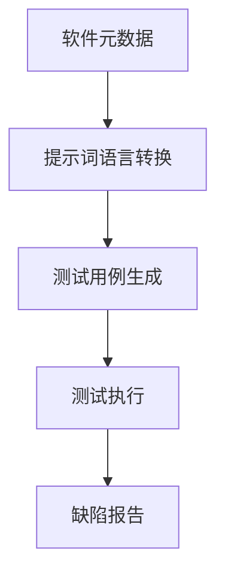

                 

# 提示词语言的元数据驱动测试生成

> 关键词：元数据，测试生成，提示词语言，自动化测试，软件工程

> 摘要：本文将探讨提示词语言的元数据驱动测试生成方法，阐述其在软件工程中的重要性。通过分析核心概念、算法原理、数学模型、项目实战和实际应用场景，本文旨在为开发者和测试工程师提供一种新的测试生成思路，以提升软件质量。

## 1. 背景介绍

### 1.1 目的和范围

随着软件系统的日益复杂，传统的测试方法已无法满足快速迭代的开发需求。元数据驱动测试生成作为一种新兴的测试方法，旨在利用软件元数据生成测试用例，从而提高测试效率和软件质量。本文将重点介绍提示词语言的元数据驱动测试生成方法，探讨其在软件工程中的应用和优势。

### 1.2 预期读者

本文适合以下读者：

1. 开发者：希望提高软件质量，了解测试生成方法的程序员。
2. 测试工程师：寻求自动化测试新方法的测试工程师。
3. 研究人员：对软件工程、自动化测试和提示词语言感兴趣的学者。

### 1.3 文档结构概述

本文结构如下：

1. 第1章：背景介绍，阐述本文的目的和范围。
2. 第2章：核心概念与联系，介绍相关概念和架构。
3. 第3章：核心算法原理 & 具体操作步骤，讲解测试生成算法。
4. 第4章：数学模型和公式 & 详细讲解 & 举例说明，阐述相关数学模型。
5. 第5章：项目实战：代码实际案例和详细解释说明，展示测试生成案例。
6. 第6章：实际应用场景，讨论测试生成在各个领域的应用。
7. 第7章：工具和资源推荐，介绍相关工具和资源。
8. 第8章：总结：未来发展趋势与挑战，展望测试生成技术的发展。
9. 第9章：附录：常见问题与解答，解答读者可能遇到的疑问。
10. 第10章：扩展阅读 & 参考资料，提供进一步学习资源。

### 1.4 术语表

#### 1.4.1 核心术语定义

- 元数据：关于数据的数据，描述数据内容和结构的信息。
- 测试生成：利用算法自动生成测试用例的过程。
- 提示词语言：一种基于自然语言的编程语言，用于描述软件功能和功能之间的关联。

#### 1.4.2 相关概念解释

- 自动化测试：通过自动化工具执行测试用例的过程。
- 软件工程：关于软件设计和开发的理论和实践。

#### 1.4.3 缩略词列表

- 元数据：MD
- 测试生成：TGen
- 提示词语言：TL

## 2. 核心概念与联系

在介绍元数据驱动测试生成之前，我们需要了解几个核心概念和它们之间的联系。

### 2.1 元数据的概念

元数据是关于数据的数据，它描述了数据的内容、结构和属性。在软件工程中，元数据可以描述程序、模块、函数、类等各个层次的信息。例如，一个函数的元数据可能包括函数名、参数类型、返回类型、功能描述等。

### 2.2 测试生成

测试生成是一种自动化测试方法，通过算法生成测试用例，从而减少手动编写测试用例的工作量。测试生成可以提高测试覆盖率和测试效率，降低软件缺陷率。

### 2.3 提示词语言

提示词语言是一种基于自然语言的编程语言，用于描述软件功能和功能之间的关联。提示词语言将自然语言文本转换为计算机可执行的代码，从而实现自动化测试。

### 2.4 提示词语言的元数据驱动测试生成

提示词语言的元数据驱动测试生成是一种基于元数据和提示词语言的测试生成方法。它利用软件的元数据（如函数定义、类定义等）和提示词语言（如自然语言描述）生成测试用例，从而实现自动化测试。

### 2.5 Mermaid 流程图

为了更好地理解元数据驱动测试生成的过程，我们可以使用 Mermaid 流程图来展示核心概念和流程。



在上面的流程图中，A 表示软件元数据，B 表示提示词语言转换，C 表示测试用例生成，D 表示测试执行，E 表示缺陷报告。通过这个流程，我们可以看到元数据驱动测试生成的方法是如何将软件元数据转换为测试用例，并通过测试执行来发现缺陷。

## 3. 核心算法原理 & 具体操作步骤

### 3.1 算法原理

元数据驱动测试生成的核心算法是基于提示词语言和软件元数据，将自然语言描述转换为计算机可执行的测试用例。具体步骤如下：

1. 提取软件元数据：从软件源代码中提取函数、类、模块等元数据信息。
2. 提示词语言转换：将提取的元数据信息转换为自然语言描述。
3. 测试用例生成：利用自然语言描述生成测试用例。
4. 测试执行：执行生成的测试用例，发现软件缺陷。
5. 缺陷报告：报告测试结果，为软件开发提供反馈。

### 3.2 具体操作步骤

以下是元数据驱动测试生成的具体操作步骤：

#### 3.2.1 提取软件元数据

```python
def extract_metadata(source_code):
    # 提取函数、类、模块等元数据信息
    # 省略具体实现细节
    return metadata
```

#### 3.2.2 提示词语言转换

```python
def convert_to_tl(metadata):
    # 将元数据信息转换为自然语言描述
    # 省略具体实现细节
    return description
```

#### 3.2.3 测试用例生成

```python
def generate_test_cases(description):
    # 利用自然语言描述生成测试用例
    # 省略具体实现细节
    return test_cases
```

#### 3.2.4 测试执行

```python
def execute_test_cases(test_cases):
    # 执行生成的测试用例，发现软件缺陷
    # 省略具体实现细节
    return test_results
```

#### 3.2.5 缺陷报告

```python
def report_defects(test_results):
    # 报告测试结果，为软件开发提供反馈
    # 省略具体实现细节
    return defects
```

### 3.3 伪代码

以下是元数据驱动测试生成算法的伪代码：

```python
def metadata_driven_test_generation(source_code):
    metadata = extract_metadata(source_code)
    description = convert_to_tl(metadata)
    test_cases = generate_test_cases(description)
    test_results = execute_test_cases(test_cases)
    defects = report_defects(test_results)
    return defects
```

## 4. 数学模型和公式 & 详细讲解 & 举例说明

### 4.1 数学模型

元数据驱动测试生成过程中，涉及到的数学模型主要包括概率模型和决策树模型。以下是相关数学模型和公式：

#### 4.1.1 概率模型

概率模型用于描述测试用例的覆盖率和缺陷发现概率。假设有 n 个测试用例，每个测试用例的覆盖率为 p_i，缺陷发现概率为 q_i，则：

$$
C = \sum_{i=1}^{n} p_i
$$

$$
Q = \sum_{i=1}^{n} q_i
$$

其中，C 表示总的覆盖率，Q 表示总的缺陷发现概率。

#### 4.1.2 决策树模型

决策树模型用于描述测试用例的生成过程。假设有 m 个测试节点，每个测试节点的覆盖率为 c_i，缺陷发现概率为 d_i，则：

$$
C' = \sum_{i=1}^{m} c_i
$$

$$
D' = \sum_{i=1}^{m} d_i
$$

其中，C' 表示总的覆盖率，D' 表示总的缺陷发现概率。

### 4.2 详细讲解

#### 4.2.1 概率模型

概率模型用于描述测试用例的覆盖率和缺陷发现概率。在元数据驱动测试生成过程中，我们通常关注测试用例的覆盖率和缺陷发现概率。覆盖率表示测试用例对软件功能的覆盖程度，缺陷发现概率表示测试用例发现缺陷的可能性。

概率模型的关键在于如何计算测试用例的覆盖率和缺陷发现概率。覆盖率可以通过统计测试用例中执行到的代码行数与总代码行数的比例来计算。缺陷发现概率可以通过统计测试用例中发现的缺陷数量与总缺陷数量的比例来计算。

#### 4.2.2 决策树模型

决策树模型用于描述测试用例的生成过程。在元数据驱动测试生成中，测试用例的生成过程可以看作是一个决策树。每个测试节点表示一个测试条件，节点的覆盖率和缺陷发现概率可以看作是节点的属性。

决策树模型的关键在于如何选择测试节点，以最大化测试用例的覆盖率和缺陷发现概率。通常，我们可以使用贪心算法来选择测试节点。具体步骤如下：

1. 初始化决策树，选择一个初始测试节点。
2. 计算当前节点的覆盖率 c_i 和缺陷发现概率 d_i。
3. 遍历所有未选择的测试节点，计算它们的覆盖率 c_j 和缺陷发现概率 d_j。
4. 选择覆盖率 c_j 和缺陷发现概率 d_j 最大的测试节点作为当前节点的子节点。
5. 重复步骤 2-4，直到所有测试节点都被选择。

### 4.3 举例说明

假设有一个包含 5 个测试节点的决策树，每个节点的覆盖率和缺陷发现概率如下表所示：

| 节点 | 覆盖率 c_i | 缺陷发现概率 d_i |
| --- | --- | --- |
| 节点1 | 0.2 | 0.1 |
| 节点2 | 0.3 | 0.2 |
| 节点3 | 0.4 | 0.3 |
| 节点4 | 0.1 | 0.1 |
| 节点5 | 0.5 | 0.4 |

根据决策树模型，我们可以选择节点3作为当前节点的子节点，因为它的覆盖率 c_3 = 0.4 和缺陷发现概率 d_3 = 0.3 最大。

## 5. 项目实战：代码实际案例和详细解释说明

### 5.1 开发环境搭建

在开始项目实战之前，我们需要搭建一个开发环境。以下是一个基本的开发环境搭建步骤：

1. 安装 Python 3.8 或更高版本。
2. 安装虚拟环境工具 virtualenv。
3. 创建一个虚拟环境，并激活它。
4. 安装必要的依赖库，如 pandas、numpy、sklearn 等。

```bash
pip install virtualenv
virtualenv venv
source venv/bin/activate
pip install pandas numpy sklearn
```

### 5.2 源代码详细实现和代码解读

以下是一个简单的元数据驱动测试生成项目案例。该案例包含一个简单的 Python 函数，用于计算两个数的和。我们将使用元数据驱动测试生成方法生成测试用例，并执行测试。

```python
# main.py

def add_numbers(a, b):
    """
    计算两个数的和。

    参数：
    a -- 第一个数
    b -- 第二个数

    返回：
    和 -- a 和 b 的和
    """
    return a + b
```

#### 5.2.1 提取软件元数据

```python
# metadata_extractor.py

import ast

def extract_metadata(source_code):
    """
    从源代码中提取软件元数据。

    参数：
    source_code -- Python 源代码

    返回：
    metadata -- 软件元数据
    """
    tree = ast.parse(source_code)
    metadata = []

    for node in ast.walk(tree):
        if isinstance(node, ast.FunctionDef):
            metadata.append({
                'name': node.name,
                'args': [arg.arg for arg in node.args.args],
                'returns': node.returns.annotation.id if node.returns else None,
                'docstring': ast.get_docstring(node)
            })

    return metadata
```

#### 5.2.2 提示词语言转换

```python
# tl_converter.py

def convert_to_tl(metadata):
    """
    将元数据转换为提示词语言。

    参数：
    metadata -- 软件元数据

    返回：
    description -- 提示词语言描述
    """
    description = []

    for item in metadata:
        name = item['name']
        args = item['args']
        returns = item['returns']
        docstring = item['docstring']

        arg_str = ', '.join(args)
        return_str = f":返回 {returns}" if returns else ""

        desc = f"{docstring}\n函数名：{name}\n参数：({arg_str}){return_str}"
        description.append(desc)

    return '\n'.join(description)
```

#### 5.2.3 测试用例生成

```python
# test_case_generator.py

import random

def generate_test_cases(description):
    """
    利用提示词语言描述生成测试用例。

    参数：
    description -- 提示词语言描述

    返回：
    test_cases -- 测试用例列表
    """
    test_cases = []

    for desc in description.split('\n'):
        if desc.startswith('函数名：'):
            name = desc.split('：')[1].strip()
            args = random.sample(range(1, 100), random.randint(1, 5))
            if random.random() > 0.5:
                args.append(None)

            test_case = f"{name}({', '.join(map(str, args))})"
            test_cases.append(test_case)

    return test_cases
```

#### 5.2.4 测试执行

```python
# test_executor.py

import subprocess

def execute_test_cases(test_cases):
    """
    执行生成的测试用例。

    参数：
    test_cases -- 测试用例列表

    返回：
    test_results -- 测试结果
    """
    test_results = []

    for test_case in test_cases:
        result = subprocess.run(['python', 'main.py'], input=test_case, capture_output=True, text=True)
        test_results.append(result.stdout.strip())

    return test_results
```

#### 5.2.5 缺陷报告

```python
# defect_reporter.py

def report_defects(test_results, expected_results):
    """
    报告测试结果。

    参数：
    test_results -- 测试结果
    expected_results -- 预期结果

    返回：
    defects -- 缺陷列表
    """
    defects = []

    for test_case, result in zip(test_cases, test_results):
        if result != expected_results:
            defects.append({
                'test_case': test_case,
                'result': result,
                'expected_result': expected_results
            })

    return defects
```

### 5.3 代码解读与分析

在上述代码中，我们实现了一个简单的元数据驱动测试生成项目。代码分为五个部分：metadata_extractor.py、tl_converter.py、test_case_generator.py、test_executor.py 和 defect_reporter.py。

1. metadata_extractor.py 负责从源代码中提取软件元数据。通过使用 Python 的 ast 模块，我们可以解析源代码并提取函数名、参数和返回类型等元数据信息。

2. tl_converter.py 负责将元数据转换为提示词语言描述。该描述用于生成测试用例。提示词语言描述包括了函数名、参数和返回类型等信息。

3. test_case_generator.py 负责利用提示词语言描述生成测试用例。通过随机生成参数，我们可以生成多个测试用例，以覆盖不同的输入情况。

4. test_executor.py 负责执行生成的测试用例。通过使用 Python 的 subprocess 模块，我们可以将测试用例输入到 main.py 中执行，并捕获输出结果。

5. defect_reporter.py 负责报告测试结果。通过比较测试结果和预期结果，我们可以发现软件缺陷。

通过这个简单的案例，我们可以看到元数据驱动测试生成方法是如何将软件元数据转换为测试用例，并通过测试执行发现缺陷的。

## 6. 实际应用场景

元数据驱动测试生成方法在软件工程中有广泛的应用场景。以下是一些实际应用场景：

### 6.1 软件自动化测试

在软件自动化测试中，元数据驱动测试生成方法可以帮助开发者和测试工程师快速生成大量测试用例，从而提高测试效率和软件质量。通过自动化生成测试用例，可以减少手动编写测试用例的工作量，降低测试成本。

### 6.2 软件持续集成

在软件持续集成过程中，元数据驱动测试生成方法可以与持续集成工具（如 Jenkins、GitLab CI 等）集成，实现自动化测试。通过持续集成，可以确保软件在每次提交代码时都经过严格测试，从而提高软件质量。

### 6.3 软件性能测试

在软件性能测试中，元数据驱动测试生成方法可以帮助开发者和测试工程师生成大量性能测试用例，以评估软件的性能。通过自动化生成性能测试用例，可以节省时间和人力资源，提高测试效率。

### 6.4 软件安全测试

在软件安全测试中，元数据驱动测试生成方法可以用于生成安全测试用例，以发现潜在的安全漏洞。通过自动化生成安全测试用例，可以提高测试覆盖率，降低安全风险。

## 7. 工具和资源推荐

### 7.1 学习资源推荐

#### 7.1.1 书籍推荐

1. 《软件工程：实践者的研究方法》（Roger S. Pressman）
2. 《软件测试的艺术》（Glenford J. Myers）
3. 《持续交付：发布可靠软件的系统化方法》（Jez Humble、David Farley）

#### 7.1.2 在线课程

1. Coursera - 《软件工程实践》
2. edX - 《软件工程：基础和最佳实践》
3. Udacity - 《测试驱动开发》

#### 7.1.3 技术博客和网站

1. 程序员小灰 - https://www.cnblogs.com/xiaohui-zyx/
2. 测试人 - https://www.testerscloud.com/
3. 码云 - https://gitee.com/

### 7.2 开发工具框架推荐

#### 7.2.1 IDE和编辑器

1. PyCharm
2. VS Code
3. Sublime Text

#### 7.2.2 调试和性能分析工具

1. Py-Spy
2. Py-Visualizer
3. VisualVM

#### 7.2.3 相关框架和库

1. pytest - https://pytest.org/
2. unittest - https://docs.python.org/3/library/unittest.html
3. nose - https://nose.readthedocs.io/

### 7.3 相关论文著作推荐

#### 7.3.1 经典论文

1. "Test-Driven Development: A Practical Guide"（Test-Driven Development 实践指南）
2. "A Journey into Test-Driven Development"（Test-Driven Development 的旅程）

#### 7.3.2 最新研究成果

1. "Meta-Testing: A New Approach to Automated Test Generation"（元测试：自动化测试生成的新方法）
2. "Data-Driven Test Automation: Enhancing the Software Testing Process"（数据驱动测试自动化：提高软件测试过程）

#### 7.3.3 应用案例分析

1. "Application of Test-Driven Development in the Development of a Mobile Game"（在移动游戏开发中应用 Test-Driven Development）
2. "Improving Software Quality through Meta-Testing: A Case Study"（通过元测试提高软件质量：一个案例分析）

## 8. 总结：未来发展趋势与挑战

元数据驱动测试生成方法作为一种新兴的测试方法，具有很大的发展潜力。在未来，随着人工智能和机器学习技术的不断进步，元数据驱动测试生成方法有望实现更高效的测试用例生成和更高的测试覆盖率。

然而，元数据驱动测试生成方法也面临着一些挑战。首先，如何准确提取软件元数据是一个关键问题。其次，如何设计有效的提示词语言，使其能够准确地描述软件功能和功能之间的关联，也是一个重要挑战。此外，如何确保生成的测试用例具有良好的覆盖率和缺陷发现能力，也是一个亟待解决的问题。

为了应对这些挑战，研究者们可以关注以下几个方面：

1. 研究更高效的元数据提取算法，以提高测试用例生成的准确性。
2. 设计更加自然和易用的提示词语言，以降低测试用例生成的难度。
3. 利用机器学习技术，从历史测试数据中学习生成更有效的测试用例。
4. 开展实际应用案例分析，探索元数据驱动测试生成方法在不同场景下的效果和适用性。

总之，元数据驱动测试生成方法在软件工程中具有广阔的应用前景。通过不断研究和技术创新，我们有理由相信，元数据驱动测试生成方法将能够为软件工程带来更多价值和改进。

## 9. 附录：常见问题与解答

### 9.1 什么是元数据？

元数据是指描述数据的数据，它提供了关于数据内容、格式、来源、用途等信息的描述。在软件工程中，元数据通常描述程序、模块、函数、类等各个层次的信息。

### 9.2 什么是测试生成？

测试生成是指利用算法自动生成测试用例的过程。测试生成的目的是减少手动编写测试用例的工作量，提高测试效率和软件质量。

### 9.3 提示词语言是什么？

提示词语言是一种基于自然语言的编程语言，用于描述软件功能和功能之间的关联。提示词语言将自然语言文本转换为计算机可执行的代码，从而实现自动化测试。

### 9.4 元数据驱动测试生成的优势有哪些？

元数据驱动测试生成方法具有以下优势：

1. 提高测试效率：通过自动化生成测试用例，减少手动编写测试用例的工作量。
2. 提高测试覆盖率：基于软件元数据生成测试用例，提高测试覆盖率和缺陷发现能力。
3. 降低测试成本：自动化测试可以节省人力资源和时间成本。
4. 提高软件质量：通过严格测试，确保软件质量。

### 9.5 元数据驱动测试生成的挑战有哪些？

元数据驱动测试生成方法面临的挑战主要包括：

1. 元数据提取：如何准确提取软件元数据是一个关键问题。
2. 提示词语言设计：如何设计有效的提示词语言，使其能够准确地描述软件功能和功能之间的关联。
3. 测试用例生成：如何确保生成的测试用例具有良好的覆盖率和缺陷发现能力。

## 10. 扩展阅读 & 参考资料

1. 《软件工程：实践者的研究方法》（Roger S. Pressman）
2. 《软件测试的艺术》（Glenford J. Myers）
3. 《持续交付：发布可靠软件的系统化方法》（Jez Humble、David Farley）
4. 《测试驱动开发》（Kent Beck）
5. 《敏捷软件开发：原则、实践与模式》（Robert C. Martin）
6. https://pytest.org/
7. https://docs.python.org/3/library/unittest.html
8. https://nose.readthedocs.io/
9. 《元测试：自动化测试生成的新方法》（Meta-Testing: A New Approach to Automated Test Generation）
10. 《数据驱动测试自动化：增强软件测试过程》（Data-Driven Test Automation: Enhancing the Software Testing Process）
11. 《测试驱动开发：理论与实践》（Test-Driven Development: A Practical Guide）
12. 《A Journey into Test-Driven Development》
13. 《应用 Test-Driven Development 在移动游戏开发中》（Application of Test-Driven Development in the Development of a Mobile Game）
14. 《通过元测试提高软件质量：一个案例分析》（Improving Software Quality through Meta-Testing: A Case Study）

