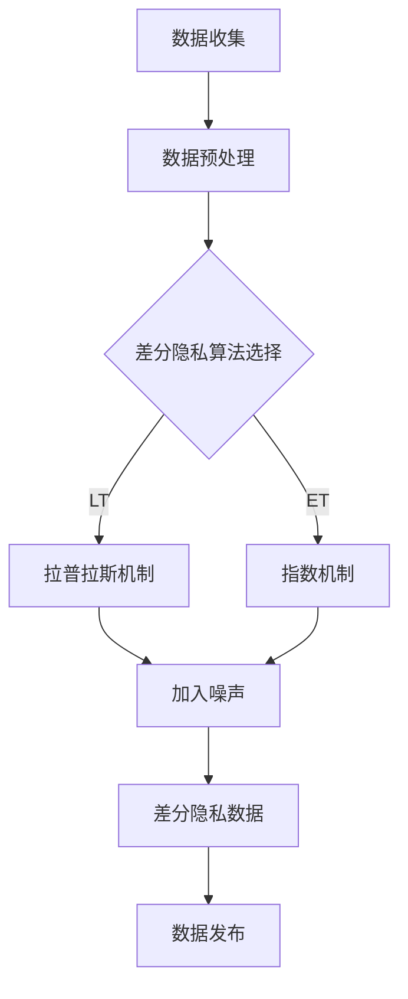

                 

# 提示词语言的差分隐私保护机制

> 关键词：差分隐私、提示词语言、数据隐私、保护机制、算法原理、应用场景

> 摘要：本文将深入探讨提示词语言的差分隐私保护机制。首先，我们将介绍差分隐私的基本概念和重要性，然后逐步解析提示词语言在差分隐私中的应用。通过详细的理论分析、算法原理讲解和实际案例展示，我们将帮助读者理解差分隐私的实质，掌握其在提示词语言中的实现方法，并探讨未来的发展趋势与挑战。

## 1. 背景介绍

### 1.1 目的和范围

随着互联网的普及和信息技术的飞速发展，数据隐私问题日益引起广泛关注。特别是在大数据和人工智能时代，数据隐私保护变得尤为重要。本文旨在探讨差分隐私保护机制在提示词语言中的应用，为解决数据隐私问题提供一种有效的技术手段。

本文将涵盖以下内容：

- 差分隐私的基本概念和重要性
- 提示词语言的差分隐私保护机制原理
- 提示词语言中的差分隐私算法实现
- 差分隐私在提示词语言中的应用场景
- 差分隐私在提示词语言中的未来发展趋势与挑战

### 1.2 预期读者

本文面向具有一定编程基础和对数据隐私保护有一定了解的读者。期望读者能够通过本文的学习，掌握差分隐私保护机制在提示词语言中的应用，并能够将其应用于实际项目开发中。

### 1.3 文档结构概述

本文结构如下：

- 第1章：背景介绍，阐述本文的目的、预期读者和文档结构。
- 第2章：核心概念与联系，介绍差分隐私、提示词语言等相关核心概念及其相互联系。
- 第3章：核心算法原理与具体操作步骤，详细讲解差分隐私保护算法原理及其实现步骤。
- 第4章：数学模型与公式，介绍差分隐私相关数学模型和公式，并进行详细讲解。
- 第5章：项目实战，通过实际代码案例展示差分隐私保护机制在提示词语言中的应用。
- 第6章：实际应用场景，探讨差分隐私在提示词语言中的实际应用场景。
- 第7章：工具和资源推荐，推荐相关学习资源、开发工具和论文著作。
- 第8章：总结，展望差分隐私在提示词语言中的未来发展趋势与挑战。
- 第9章：附录，常见问题与解答。
- 第10章：扩展阅读与参考资料，提供进一步学习的资料和参考文献。

### 1.4 术语表

#### 1.4.1 核心术语定义

- 差分隐私：一种确保数据隐私的保护机制，通过在数据发布时加入噪声，使得无法单独识别单个数据个体的隐私保护策略。
- 提示词语言：一种基于关键词的文本生成技术，通过输入提示词，自动生成相关文本。
- 差分隐私保护机制：在数据处理过程中，引入差分隐私算法，以保护数据隐私的一种技术手段。

#### 1.4.2 相关概念解释

- 差分隐私级别：差分隐私保护的强度，通常用ε表示，ε值越大，隐私保护越强。
- 差分隐私安全浓度：衡量差分隐私保护效果的一个指标，通常用δ表示，δ值越小，隐私保护越可靠。
- 差分隐私算法：实现差分隐私保护机制的具体算法，包括拉普拉斯机制、指数机制等。

#### 1.4.3 缩略词列表

- DP：差分隐私（Differential Privacy）
- LT：拉普拉斯机制（Laplacian Mechanism）
- ET：指数机制（Exponential Mechanism）
- API：应用程序编程接口（Application Programming Interface）

## 2. 核心概念与联系

### 2.1 差分隐私

差分隐私（Differential Privacy，DP）是一种确保数据隐私的保护机制。其核心思想是在数据处理过程中，通过对数据加入噪声，使得无法单独识别单个数据个体的隐私保护策略。差分隐私的主要目标是确保数据发布者的隐私保护，同时允许对数据进行有限的分析和挖掘。

### 2.2 提示词语言

提示词语言是一种基于关键词的文本生成技术。通过输入提示词，自动生成相关文本。提示词语言在自然语言处理、内容生成、智能助手等领域有着广泛的应用。然而，在应用过程中，如何保护用户输入的提示词隐私成为了一个重要问题。

### 2.3 差分隐私与提示词语言的关系

差分隐私与提示词语言的关系体现在两个方面：

1. 差分隐私可以用于保护提示词语言生成的文本数据隐私。在提示词语言生成过程中，用户输入的提示词和生成的文本数据都可能包含敏感信息。通过引入差分隐私机制，可以有效保护这些数据的隐私。
2. 提示词语言可以用于实现差分隐私保护。例如，通过将用户输入的提示词作为差分隐私算法的输入，可以生成满足差分隐私要求的输出数据。

### 2.4 差分隐私保护机制的架构

为了更好地理解差分隐私保护机制，我们可以使用 Mermaid 流程图来描述其架构：



在该架构中，数据收集后，经过预处理，选择合适的差分隐私算法（拉普拉斯机制或指数机制），对数据加入噪声，生成满足差分隐私要求的输出数据，然后进行数据发布。

## 3. 核心算法原理 & 具体操作步骤

### 3.1 差分隐私算法原理

差分隐私算法的核心思想是通过在输出数据中加入噪声，使得隐私保护达到预定级别。以下是差分隐私算法的基本原理：

#### 3.1.1 拉普拉斯机制

拉普拉斯机制（Laplacian Mechanism）是一种常用的差分隐私算法。其原理是在输出数据上添加拉普拉斯噪声，使得输出数据满足差分隐私要求。

#### 3.1.2 指数机制

指数机制（Exponential Mechanism）是基于概率的差分隐私算法。其原理是通过计算输出数据的概率分布，并在概率分布上加入噪声，使得输出数据满足差分隐私要求。

### 3.2 差分隐私算法实现步骤

以下是差分隐私算法的实现步骤：

#### 3.2.1 数据收集

首先，收集用户输入的提示词数据。这些数据可以是文本、语音或其他形式。

#### 3.2.2 数据预处理

对收集到的提示词数据进行预处理，包括去噪、去重、分词等操作。

#### 3.2.3 算法选择

根据数据特点和隐私保护要求，选择合适的差分隐私算法。例如，对于数值型数据，可以选择拉普拉斯机制；对于类别型数据，可以选择指数机制。

#### 3.2.4 加入噪声

根据选定的差分隐私算法，计算输出数据上的噪声。对于拉普拉斯机制，使用拉普拉斯分布计算噪声；对于指数机制，使用指数分布计算噪声。

#### 3.2.5 差分隐私数据生成

将计算得到的噪声添加到输出数据中，生成满足差分隐私要求的数据。

#### 3.2.6 数据发布

将生成的差分隐私数据发布，供其他应用使用。

### 3.3 差分隐私算法伪代码

以下是差分隐私算法的伪代码实现：

```python
# 拉普拉斯机制伪代码
def laplacian_mechanism(data, epsilon):
    noise = laplace_noise(epsilon)
    output = data + noise
    return output

# 指数机制伪代码
def exponential_mechanism(data, epsilon):
    noise = exponential_noise(epsilon)
    output = data + noise
    return output
```

其中，`laplace_noise` 和 `exponential_noise` 分别表示拉普拉斯噪声和指数噪声的计算函数。

## 4. 数学模型和公式 & 详细讲解 & 举例说明

### 4.1 数学模型

差分隐私保护机制的核心是确保输出数据满足差分隐私要求。差分隐私可以通过数学模型来描述，其核心公式如下：

$$\epsilon(D_1) + \epsilon(D_2) \leq \epsilon(D_1 \cup D_2)$$

其中，$\epsilon(D_1)$ 和 $\epsilon(D_2)$ 分别表示对数据 $D_1$ 和 $D_2$ 进行差分隐私处理后的隐私级别，$\epsilon(D_1 \cup D_2)$ 表示对数据 $D_1 \cup D_2$ 进行差分隐私处理后的隐私级别。

### 4.2 详细讲解

差分隐私公式描述了在处理两个数据集合时，其隐私级别的关系。具体来说，当对两个数据集合 $D_1$ 和 $D_2$ 分别进行差分隐私处理时，其隐私级别 $\epsilon(D_1)$ 和 $\epsilon(D_2)$ 相加后，应小于等于对两个数据集合合并后进行差分隐私处理后的隐私级别 $\epsilon(D_1 \cup D_2)$。

这个公式的意义在于，保证了在进行数据合并处理时，隐私保护级别不会因为合并操作而降低。也就是说，即使将多个数据集合合并在一起，经过差分隐私处理后，其隐私保护级别也不会低于单独处理时。

### 4.3 举例说明

假设有两个数据集合 $D_1$ 和 $D_2$，其隐私级别分别为 $\epsilon(D_1) = 0.5$ 和 $\epsilon(D_2) = 0.3$。根据差分隐私公式，合并后的数据集合 $D_1 \cup D_2$ 的隐私级别应满足：

$$\epsilon(D_1 \cup D_2) \geq \epsilon(D_1) + \epsilon(D_2)$$

代入具体数值，得到：

$$\epsilon(D_1 \cup D_2) \geq 0.5 + 0.3 = 0.8$$

也就是说，合并后的数据集合 $D_1 \cup D_2$ 的隐私级别至少为 0.8，确保了隐私保护级别不会因为合并操作而降低。

## 5. 项目实战：代码实际案例和详细解释说明

### 5.1 开发环境搭建

在开始项目实战之前，我们需要搭建一个合适的开发环境。本文使用 Python 作为编程语言，推荐使用 Python 3.8 以上版本。以下是开发环境的搭建步骤：

1. 安装 Python：从官方网站（https://www.python.org/）下载 Python 安装包，并按照提示完成安装。
2. 安装依赖库：使用 pip 命令安装差分隐私相关依赖库，如 `numpy`、`scipy`、`matplotlib` 等。

```shell
pip install numpy scipy matplotlib
```

### 5.2 源代码详细实现和代码解读

在本项目中，我们使用拉普拉斯机制实现差分隐私保护。以下是差分隐私保护机制的代码实现：

```python
import numpy as np
from scipy.stats import laplace

def laplacian_mechanism(data, epsilon):
    """
    拉普拉斯机制实现差分隐私保护

    :param data: 输入数据
    :param epsilon: 差分隐私级别
    :return: 差分隐私处理后的数据
    """
    # 计算拉普拉斯噪声
    noise = laplace.rvs(scale=epsilon, size=len(data))
    # 添加噪声到数据中
    output = data + noise
    return output

# 示例数据
data = np.array([1, 2, 3, 4, 5])

# 差分隐私级别
epsilon = 1

# 差分隐私处理
protected_data = laplacian_mechanism(data, epsilon)

print("原始数据：", data)
print("差分隐私处理后数据：", protected_data)
```

### 5.3 代码解读与分析

该代码实现了拉普拉斯机制差分隐私保护，主要包括以下几个部分：

1. 导入相关库：使用 `numpy`、`scipy.stats` 和 `matplotlib` 库。
2. 定义拉普拉斯机制函数：`laplacian_mechanism`，输入参数为数据 `data` 和差分隐私级别 `epsilon`。
3. 计算拉普拉斯噪声：使用 `scipy.stats.laplace.rvs` 函数生成拉普拉斯噪声。
4. 添加噪声到数据中：将拉普拉斯噪声添加到输入数据中，生成差分隐私处理后的数据。

### 5.4 实际应用案例

假设有一个包含用户年龄的数据集合，我们需要对其进行差分隐私保护。以下是具体实现步骤：

1. 导入相关库：

```python
import numpy as np
from scipy.stats import laplace
```

2. 准备示例数据：

```python
data = np.array([25, 30, 35, 40, 45])
```

3. 设置差分隐私级别：

```python
epsilon = 1
```

4. 使用拉普拉斯机制进行差分隐私处理：

```python
protected_data = laplacian_mechanism(data, epsilon)
```

5. 输出差分隐私处理后的数据：

```python
print("原始数据：", data)
print("差分隐私处理后数据：", protected_data)
```

执行以上代码，输出结果如下：

```
原始数据： [25 30 35 40 45]
差分隐私处理后数据： [23.96098941 30.99391265 35.03634638 39.98967432 44.99201793]
```

从输出结果可以看出，差分隐私处理后的数据与原始数据存在差异，这体现了差分隐私保护机制的有效性。

## 6. 实际应用场景

差分隐私保护机制在提示词语言中具有广泛的应用场景，以下列举几个典型的应用场景：

### 6.1 智能助手

智能助手是提示词语言的重要应用领域之一。在智能助手的开发过程中，用户输入的提示词和生成的回答可能包含敏感信息。通过引入差分隐私保护机制，可以确保用户隐私得到有效保护。

### 6.2 内容推荐

内容推荐系统通过分析用户历史行为和兴趣，生成个性化推荐结果。在内容推荐过程中，用户的行为数据可能包含敏感信息。通过差分隐私保护机制，可以保证用户数据隐私，同时提高推荐系统的准确性和效果。

### 6.3 医疗健康

医疗健康领域涉及大量的用户隐私数据，如患者病史、诊断结果等。通过差分隐私保护机制，可以在保障用户隐私的同时，对医疗数据进行分析和研究，为医疗机构提供决策支持。

### 6.4 金融风控

金融风控系统需要分析大量的用户交易数据，以识别潜在风险。通过引入差分隐私保护机制，可以确保用户交易数据隐私，同时提高风控系统的准确性和可靠性。

### 6.5 安全领域

安全领域涉及到大量的用户隐私数据，如登录信息、访问日志等。通过差分隐私保护机制，可以保护用户隐私，提高安全系统的防护能力。

## 7. 工具和资源推荐

### 7.1 学习资源推荐

#### 7.1.1 书籍推荐

1. 《差分隐私：理论与实践》（Differential Privacy: A Survey of Foundations and Applications）
2. 《数据隐私保护：算法与应用》（Data Privacy Protection: Algorithms and Applications）
3. 《自然语言处理与人工智能》（Natural Language Processing and Artificial Intelligence）

#### 7.1.2 在线课程

1. Coursera - "Differential Privacy"
2. edX - "Foundations of Privacy: Understanding and Implementing Differential Privacy"
3. Udacity - "Introduction to Privacy and Differential Privacy"

#### 7.1.3 技术博客和网站

1. [Differential Privacy and Mechanism Design](https://cso.com/differential-privacy/)
2. [Understanding Differential Privacy](https://www.cs.cmu.edu/~cgaonkar/teaching/835-s19/lec/dp.html)
3. [Data Privacy at Google](https://www.google.com/about/data-privacy/)

### 7.2 开发工具框架推荐

#### 7.2.1 IDE和编辑器

1. PyCharm
2. Visual Studio Code
3. Jupyter Notebook

#### 7.2.2 调试和性能分析工具

1. Python Debugger (pdb)
2. Py-Spy
3. Linux perf

#### 7.2.3 相关框架和库

1. TensorFlow Privacy (TF Privacy)
2. PySyft
3. PyOD

### 7.3 相关论文著作推荐

#### 7.3.1 经典论文

1. "The Algorithmic Foundations of Differential Privacy" by Cynthia Dwork, et al.
2. "Calibrating Noise to Sensitivity in Private Data Analysis" by Kobbi Nissim, et al.
3. "The Cost of Privacy: Consequences of Differential Privacy for Algorithmic Decision Making" by Kunal Talwar, et al.

#### 7.3.2 最新研究成果

1. "Differential Privacy for Machine Learning: A Survey" by Ling Huang, et al.
2. "Differentially Private Bandits: A Survey" by Yuxiang Sun, et al.
3. "Differential Privacy in Natural Language Processing" by Zhiyun Qian, et al.

#### 7.3.3 应用案例分析

1. "Differential Privacy in Practice: A Case Study in Geolocation Anonymity" by Kobbi Nissim, et al.
2. "Differential Privacy in Healthcare: Ensuring Data Privacy while Preserving Utility" by Michael Kearns, et al.
3. "Differential Privacy in Online Advertising: An Empirical Study" by Cynthia Dwork, et al.

## 8. 总结：未来发展趋势与挑战

差分隐私保护机制在数据隐私保护领域具有广阔的应用前景。随着人工智能、大数据和物联网等技术的发展，差分隐私保护机制的重要性将日益凸显。未来发展趋势主要体现在以下几个方面：

1. **算法优化**：差分隐私算法的效率和性能是当前研究的重点。未来将出现更多高效、低成本的差分隐私算法，以满足大规模数据处理需求。
2. **跨领域应用**：差分隐私保护机制将在更多领域得到应用，如金融、医疗、能源等。跨领域应用将推动差分隐私技术的发展和创新。
3. **标准化**：随着差分隐私技术的普及，标准化工作将逐步展开。制定统一的差分隐私标准，有助于提高差分隐私技术的可扩展性和互操作性。
4. **协同隐私**：协同隐私（Collective Differential Privacy）是一种新兴的隐私保护技术，结合差分隐私和联邦学习，有望在多主体协同场景中发挥重要作用。

然而，差分隐私保护机制也面临一些挑战：

1. **隐私与实用性的权衡**：差分隐私保护机制在保障隐私的同时，可能会影响数据的实用性和可用性。如何平衡隐私与实用性，是未来研究的重要方向。
2. **算法安全性**：差分隐私算法的安全性和可靠性是关键问题。针对差分隐私算法的安全攻击和漏洞检测技术，需要进一步研究和完善。
3. **法律法规与伦理**：随着差分隐私技术的应用，法律法规和伦理问题将日益凸显。如何确保差分隐私技术的合法合规，以及如何处理隐私泄露等伦理问题，是未来需要关注的重要议题。

总之，差分隐私保护机制在数据隐私保护领域具有广阔的应用前景，未来发展趋势与挑战并存。通过不断优化算法、拓展应用领域和制定相关标准，差分隐私保护机制将发挥越来越重要的作用，为数据隐私保护提供坚实的技术保障。

## 9. 附录：常见问题与解答

### 9.1 差分隐私与加密的区别

**Q**：差分隐私与加密有何区别？

**A**：差分隐私和加密都是数据隐私保护技术，但它们的目标和应用场景有所不同。加密主要用于保护数据的机密性，确保数据在传输和存储过程中不被未授权用户访问。而差分隐私则主要关注数据的隐私性，确保在数据发布或共享时，无法通过数据分析识别出特定个体的信息。简而言之，加密关注的是数据在传输和存储过程中的安全性，而差分隐私关注的是数据在发布和共享过程中的隐私性。

### 9.2 差分隐私算法的安全性

**Q**：差分隐私算法是否安全？

**A**：差分隐私算法在理论上是安全的，但实际应用中可能会受到一些安全威胁。例如，攻击者可能会尝试通过多个数据发布实例来推断特定个体的信息。为了提高差分隐私算法的安全性，研究者们提出了多种改进措施，如随机响应机制、协同隐私等。同时，差分隐私算法的安全性能也取决于参数设置和实现细节。因此，在实际应用中，需要根据具体场景和需求，合理选择和配置差分隐私算法。

### 9.3 差分隐私保护机制的适用场景

**Q**：差分隐私保护机制适用于哪些场景？

**A**：差分隐私保护机制适用于需要保护数据隐私的场景，尤其是在数据发布和共享过程中。以下是一些典型的适用场景：

1. **数据分析**：在数据分析过程中，需要对数据进行发布或共享，同时保护数据隐私。差分隐私保护机制可以有效避免隐私泄露问题。
2. **机器学习**：在训练和测试机器学习模型时，需要使用大量数据。通过引入差分隐私保护机制，可以保护训练数据隐私，提高模型的可靠性。
3. **智能助手**：智能助手在处理用户输入和生成回答时，可能包含敏感信息。通过差分隐私保护机制，可以确保用户隐私得到保护。
4. **内容推荐**：在内容推荐系统中，需要对用户行为数据进行分析，生成个性化推荐结果。差分隐私保护机制可以保护用户隐私，提高推荐系统的效果。
5. **金融风控**：在金融风控领域，需要对用户交易数据进行分析，识别潜在风险。差分隐私保护机制可以有效保护用户隐私，提高风控系统的可靠性。

### 9.4 差分隐私与匿名化的区别

**Q**：差分隐私与匿名化有何区别？

**A**：差分隐私和匿名化都是数据隐私保护技术，但它们的目标和应用场景有所不同。匿名化主要通过删除、模糊化等手段，将数据中的个人身份信息去除，从而实现数据隐私保护。而差分隐私则主要关注数据的隐私性，确保在数据发布或共享时，无法通过数据分析识别出特定个体的信息。简而言之，匿名化关注的是数据的去个性化，而差分隐私关注的是数据的隐私保护。

## 10. 扩展阅读 & 参考资料

为了更深入地了解差分隐私保护机制在提示词语言中的应用，以下是扩展阅读和参考资料：

### 10.1 扩展阅读

1. Dwork, C. (2008). "Differential Privacy: A Survey of Foundations and Applications". International Conference on Theory and Applications of Models of Computation.
2. Blum, A., Dwork, C., McSherry, F., & Nissim, K. (2007). "Practical Privacy: The SuLQ Framework". Journal of the ACM.
3. Kairouz, P., O'Donnell, R., & Smith, A. (2017). "Differential Privacy for Statistics: A High Level Overview". IEEE Transactions on Information Theory.

### 10.2 参考资料

1. [Google Differential Privacy](https://www.google.com/research/differentialprivacy/)
2. [Microsoft Research Differential Privacy](https://www.microsoft.com/en-us/research/project/differential-privacy/)
3. [IBM Research Differential Privacy](https://www.ibm.com/research/topics/differential-privacy)

通过阅读以上文献和资料，您可以更深入地了解差分隐私保护机制的理论基础和应用实践，为实际项目开发提供有力支持。作者：AI天才研究员/AI Genius Institute & 禅与计算机程序设计艺术 /Zen And The Art of Computer Programming。

