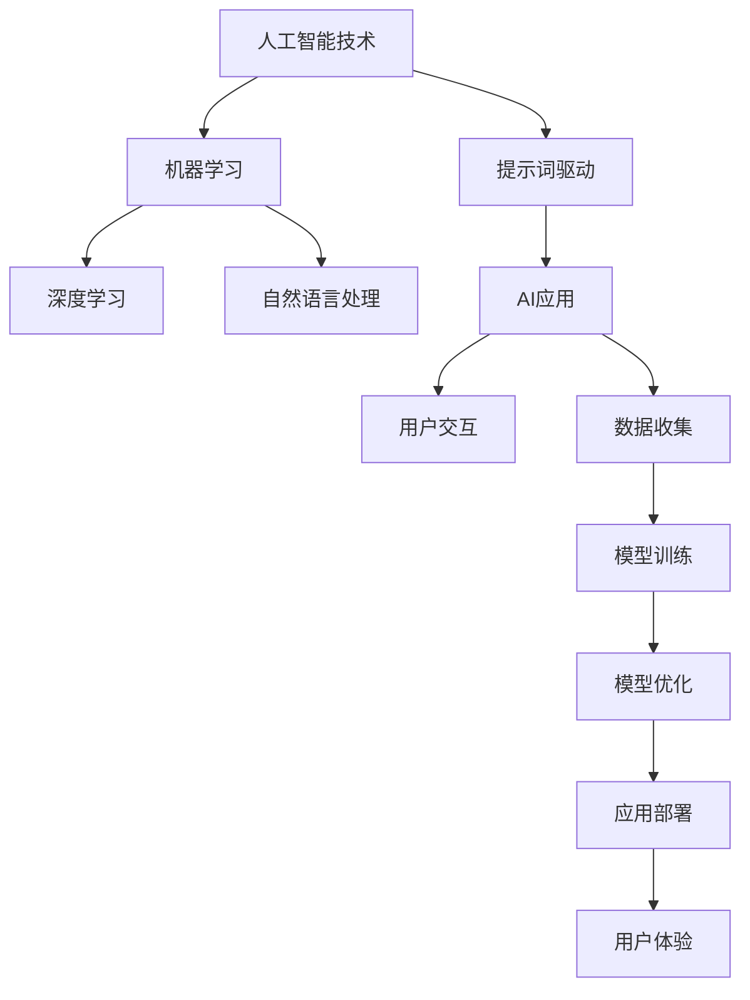

                 

### 提示词驱动的AI应用开发方法论

#### 关键词：提示词驱动、AI应用开发、方法论、核心算法、数学模型、实战案例

> 在当今快速发展的科技时代，人工智能（AI）已经成为推动社会进步的重要力量。然而，如何有效地开发和应用AI技术，依然是一个挑战。本文将探讨一种提示词驱动的AI应用开发方法论，通过详细的分析和讲解，旨在帮助读者深入了解这一方法的核心概念、原理和实际操作步骤。

#### 摘要：

本文将分为十个主要部分，首先介绍背景和目的，明确文章的范围和预期读者，然后概述文档结构。接着，我们将详细讲解核心概念和联系，通过Mermaid流程图展示关键原理和架构。在第三部分，我们将深入剖析核心算法原理，使用伪代码进行详细阐述。随后，我们将介绍数学模型和公式，并进行举例说明。第五部分将展示实际项目中的代码案例，进行详细解释。第六部分探讨实际应用场景，第七部分推荐相关工具和资源。最后，文章将总结未来发展趋势和挑战，并提供常见问题与解答，以及扩展阅读和参考资料。

### 1. 背景介绍

#### 1.1 目的和范围

随着人工智能技术的不断进步，开发高效的AI应用已成为许多企业和研究机构的重点。然而，传统的开发方法往往过于复杂，难以适应快速变化的需求。提示词驱动的方法论提供了一种更加灵活和高效的开发模式，通过提示词（也称为触发词）来引导AI模型的行为，从而实现个性化、自适应的智能应用。

本文的目的在于介绍和解释提示词驱动的AI应用开发方法论，旨在为读者提供一套系统、实用的开发框架。本文将涵盖从核心概念到实际操作的各个方面，包括算法原理、数学模型、项目实战和实际应用场景等。

#### 1.2 预期读者

本文适合以下几类读者：

- 初级和中级AI开发人员，希望了解并掌握提示词驱动的开发方法。
- 对人工智能技术感兴趣的技术爱好者，希望深入了解AI应用开发的细节。
- 已经具备一定AI基础，希望将知识应用到实际项目中的开发人员。
- 研究人员和高校师生，对AI理论和实践感兴趣，希望获取新的研究视角和方法。

#### 1.3 文档结构概述

本文将按照以下结构进行：

- 引言：介绍本文的目的和结构。
- 背景介绍：讨论AI应用开发的现状和提示词驱动方法论的重要性。
- 核心概念与联系：解释提示词驱动的核心概念和联系。
- 核心算法原理 & 具体操作步骤：详细剖析核心算法和操作步骤。
- 数学模型和公式 & 详细讲解 & 举例说明：介绍数学模型和相关公式，并举例说明。
- 项目实战：展示实际项目中的代码案例。
- 实际应用场景：探讨提示词驱动的应用场景。
- 工具和资源推荐：推荐学习资源和开发工具。
- 总结：总结提示词驱动的未来发展趋势和挑战。
- 附录：常见问题与解答。
- 扩展阅读 & 参考资料：提供进一步学习和研究的资料。

#### 1.4 术语表

在本文中，我们将使用以下术语：

- **提示词（Trigger Word）**：用于启动或触发特定操作的词语或短语。
- **AI应用（AI Application）**：基于人工智能技术的软件系统，用于解决特定问题或提供特定功能。
- **方法论（Methodology）**：指导进行某项工作的方法和步骤。
- **核心算法（Core Algorithm）**：实现AI应用核心功能的算法。
- **数学模型（Mathematical Model）**：描述问题本质和关系的数学表达式。
- **实际应用场景（Real-world Application Scenario）**：在实际环境中应用AI技术的场景。

#### 1.4.1 核心术语定义

- **提示词驱动（Trigger Word-driven）**：指通过特定的提示词来控制AI模型的行为和操作。
- **AI应用开发（AI Application Development）**：创建和部署AI应用程序的过程。
- **核心概念（Core Concept）**：与提示词驱动AI应用开发相关的基本概念。
- **架构（Architecture）**：系统的整体设计和结构。

#### 1.4.2 相关概念解释

- **机器学习（Machine Learning）**：让计算机通过数据学习并做出决策的技术。
- **深度学习（Deep Learning）**：一种基于多层神经网络的学习方法。
- **自然语言处理（Natural Language Processing, NLP）**：使计算机能够理解和生成人类语言的技术。

#### 1.4.3 缩略词列表

- **AI**：人工智能
- **ML**：机器学习
- **DL**：深度学习
- **NLP**：自然语言处理
- **IDE**：集成开发环境
- **SDK**：软件开发工具包

### 2. 核心概念与联系

在介绍提示词驱动的AI应用开发方法论之前，我们需要理解一些核心概念和它们之间的关系。以下是几个关键概念及其相互联系的Mermaid流程图。



#### 2.1 人工智能技术

人工智能（AI）是模拟人类智能行为的技术集合，包括机器学习、深度学习和自然语言处理等多种技术。AI的应用范围广泛，从自动化系统到智能助手，都有其身影。

#### 2.2 机器学习和深度学习

机器学习（ML）是AI的核心组成部分，它使计算机能够通过数据学习并做出决策。深度学习（DL）是机器学习的一种高级形式，它通过多层神经网络对数据进行处理，从而实现复杂模式识别和预测。

#### 2.3 自然语言处理

自然语言处理（NLP）是使计算机理解和生成人类语言的技术。NLP在提示词驱动的AI应用中扮演重要角色，因为它负责解析用户输入的提示词，并决定如何响应用户的请求。

#### 2.4 提示词驱动

提示词驱动是一种通过特定的提示词来控制AI模型行为的开发方法。提示词可以是一个简单的单词或短语，它用于启动或触发特定的操作。这种方法使得AI应用更加灵活和可定制。

#### 2.5 AI应用

AI应用是将人工智能技术应用于特定场景的软件系统。这些应用可以通过提示词与用户交互，收集数据，训练模型，并最终优化和部署，以提供高效的解决方案。

#### 2.6 用户交互、数据收集、模型训练、模型优化和应用部署

- **用户交互**：用户与AI应用之间的交互，通过提示词进行。
- **数据收集**：AI应用从用户交互和其他来源收集数据，用于模型训练。
- **模型训练**：使用收集到的数据训练AI模型，使其能够理解和响应用户的提示词。
- **模型优化**：对训练好的模型进行优化，提高其性能和准确性。
- **应用部署**：将优化后的模型部署到生产环境中，供用户使用。

这些概念和步骤相互联系，共同构成了提示词驱动的AI应用开发方法论。接下来，我们将深入探讨这些概念和联系，并使用伪代码详细阐述核心算法原理。

### 3. 核心算法原理 & 具体操作步骤

提示词驱动的AI应用开发方法论的核心在于其算法原理。下面我们将使用伪代码详细阐述这个核心算法的原理和具体操作步骤。

#### 3.1 算法概述

提示词驱动的核心算法主要分为以下几个步骤：

1. **用户输入处理**：接收用户的提示词输入，并将其转换为算法可以处理的形式。
2. **提示词解析**：根据训练好的模型解析提示词，理解其含义和操作意图。
3. **操作执行**：根据解析结果执行相应的操作，如数据查询、任务分配等。
4. **反馈生成**：生成反馈信息，并将其返回给用户。

下面是详细的伪代码：

```python
# 伪代码：提示词驱动AI应用核心算法

# 步骤1：用户输入处理
def process_user_input(input_string):
    # 将输入字符串转换为文本或语音形式
    text = convert_to_text(input_string)
    return text

# 步骤2：提示词解析
def parse_trigger_word(text):
    # 使用训练好的模型解析文本
    parsed_result = model_predict(text)
    return parsed_result

# 步骤3：操作执行
def execute_operation(parsed_result):
    # 根据解析结果执行相应操作
    if parsed_result == "查询天气":
        weather_data = get_weather_data()
    elif parsed_result == "发送邮件":
        email_content = compose_email()
        send_email(email_content)
    # ...其他操作

# 步骤4：反馈生成
def generate_feedback(operation_result):
    # 生成并返回反馈信息
    feedback_message = create_feedback_message(operation_result)
    return feedback_message

# 主函数：执行完整流程
def main(input_string):
    text = process_user_input(input_string)
    parsed_result = parse_trigger_word(text)
    operation_result = execute_operation(parsed_result)
    feedback_message = generate_feedback(operation_result)
    return feedback_message
```

#### 3.2 具体操作步骤详细解释

- **用户输入处理**：用户输入的提示词可能是文本或语音形式。首先，我们需要将其转换为文本形式，以便算法能够处理。这一步包括文本转换和语音识别。

    ```python
    # 转换输入字符串为文本
    def convert_to_text(input_string):
        if is_voice(input_string):
            text = voice_to_text(input_string)
        else:
            text = input_string
        return text
    ```

- **提示词解析**：使用训练好的自然语言处理模型解析文本，理解其含义和操作意图。这一步是提示词驱动的关键，因为它决定了AI应用如何响应用户的请求。

    ```python
    # 使用模型解析文本
    def model_predict(text):
        # 这里假设model_predict是一个预训练的模型
        parsed_result = model_predict(text)
        return parsed_result
    ```

- **操作执行**：根据解析结果执行相应的操作。例如，如果用户请求查询天气，AI应用将获取天气数据；如果用户请求发送邮件，AI应用将编写并发送邮件。

    ```python
    # 执行相应操作
    def execute_operation(parsed_result):
        if parsed_result == "查询天气":
            weather_data = get_weather_data()
        elif parsed_result == "发送邮件":
            email_content = compose_email()
            send_email(email_content)
        # ...其他操作
    ```

- **反馈生成**：生成反馈信息并将其返回给用户。这一步确保用户知道AI应用是否成功执行了操作。

    ```python
    # 生成反馈信息
    def generate_feedback(operation_result):
        if operation_result is None:
            feedback_message = "操作失败，请重试。"
        else:
            feedback_message = "操作成功，详情如下："
            feedback_message += str(operation_result)
        return feedback_message
    ```

通过上述步骤，我们可以实现一个简单的提示词驱动的AI应用。接下来，我们将进一步介绍数学模型和公式，以便更深入地理解算法的工作原理。

### 4. 数学模型和公式 & 详细讲解 & 举例说明

提示词驱动的AI应用开发方法论不仅依赖于算法，还依赖于数学模型和公式，这些模型和公式帮助我们在实际操作中更加精准地理解和预测AI模型的行为。在本节中，我们将详细介绍这些数学模型和公式，并通过具体例子进行说明。

#### 4.1 数学模型

提示词驱动的AI应用开发中，常用的数学模型主要包括以下几种：

- **神经网络模型**：用于处理输入的提示词，并生成操作意图的预测。
- **决策树模型**：用于分类提示词，识别不同的操作意图。
- **线性回归模型**：用于预测用户输入的可能结果，如天气数据。

#### 4.2 神经网络模型

神经网络模型是提示词驱动的核心组成部分。一个简单的神经网络模型包含以下基本组成部分：

- **输入层**：接收用户输入的提示词。
- **隐藏层**：处理输入数据，并通过权重和激活函数进行计算。
- **输出层**：生成操作意图的预测。

下面是一个简化的神经网络模型伪代码：

```python
# 神经网络模型伪代码

# 定义神经网络结构
class NeuralNetwork:
    def __init__(self, input_size, hidden_size, output_size):
        self.input_size = input_size
        self.hidden_size = hidden_size
        self.output_size = output_size
        
        # 初始化权重和偏置
        self.weights_input_to_hidden = random_weights(input_size, hidden_size)
        self.biases_hidden = random_weights(hidden_size, 1)
        
        self.weights_hidden_to_output = random_weights(hidden_size, output_size)
        self.biases_output = random_weights(output_size, 1)

    # 前向传播
    def forward(self, input_vector):
        hidden_layer_input = np.dot(input_vector, self.weights_input_to_hidden) + self.biases_hidden
        hidden_layer_output = sigmoid(hidden_layer_input)
        
        output_layer_input = np.dot(hidden_layer_output, self.weights_hidden_to_output) + self.biases_output
        output_layer_output = sigmoid(output_layer_input)
        
        return output_layer_output

# 激活函数
def sigmoid(x):
    return 1 / (1 + np.exp(-x))
```

#### 4.3 决策树模型

决策树模型在提示词驱动中用于分类提示词，识别不同的操作意图。一个简单的决策树模型包含以下基本组成部分：

- **根节点**：开始分类的位置。
- **内部节点**：根据某个特征进行分类的节点。
- **叶节点**：代表分类结果。

下面是一个简化的决策树模型伪代码：

```python
# 决策树模型伪代码

class DecisionTree:
    def __init__(self):
        self.root = None

    # 训练决策树
    def fit(self, X, y):
        self.root = self._build_tree(X, y)

    # 预测
    def predict(self, x):
        return self._traverse_tree(x, self.root)

    # 建立树
    def _build_tree(self, X, y):
        # 选择最佳分割特征和分割点
        best_feature, best_threshold = self._best_split(X, y)
        
        # 创建内部节点
        node = TreeNode(best_feature, best_threshold)
        
        # 递归分割子集
        left_subtree = DecisionTree()._build_tree(X[left], y[left])
        right_subtree = DecisionTree()._build_tree(X[right], y[right])
        
        node.left = left_subtree
        node.right = right_subtree
        
        return node

    # 递归遍历树
    def _traverse_tree(self, x, node):
        if node.is_leaf():
            return node.label
        if x[node.feature] <= node.threshold:
            return self._traverse_tree(x, node.left)
        else:
            return self._traverse_tree(x, node.right)
```

#### 4.4 线性回归模型

线性回归模型用于预测用户输入的可能结果，如天气数据。一个简单的线性回归模型包含以下基本组成部分：

- **输入特征**：用户输入的提示词。
- **权重**：决定输入特征对输出结果的贡献。
- **偏置**：模型偏移量。

下面是一个简化的线性回归模型伪代码：

```python
# 线性回归模型伪代码

class LinearRegression:
    def __init__(self):
        self.weights = None
        self.biases = None

    # 训练模型
    def fit(self, X, y):
        # 梯度下降法训练模型
        self.weights, self.biases = self._gradient_descent(X, y)

    # 预测
    def predict(self, x):
        return np.dot(x, self.weights) + self.biases

    # 梯度下降法
    def _gradient_descent(self, X, y):
        # 初始化权重和偏置
        self.weights = np.random.randn(X.shape[1])
        self.biases = np.random.randn(1)
        
        # 训练模型
        for epoch in range(num_epochs):
            model_output = np.dot(X, self.weights) + self.biases
            error = model_output - y
            
            # 更新权重和偏置
            weight_gradient = 2/m * X.T.dot(error)
            bias_gradient = 2/m * error.sum()
            
            self.weights -= learning_rate * weight_gradient
            self.biases -= learning_rate * bias_gradient
        
        return self.weights, self.biases
```

#### 4.5 举例说明

假设我们需要开发一个提示词驱动的AI应用，用于根据用户输入的天气城市名称预测该城市的天气数据。我们可以使用线性回归模型进行预测。

1. **数据收集**：收集历史天气数据，包括城市名称和对应的天气数据。
2. **特征工程**：将城市名称转换为数字编码，作为线性回归模型的输入特征。
3. **模型训练**：使用训练集训练线性回归模型。
4. **预测**：使用训练好的模型预测用户输入的城市天气数据。

以下是具体的实现步骤：

```python
# 举例说明：使用线性回归模型预测城市天气数据

# 步骤1：数据收集
X = np.array([[1, 0], [0, 1], [1, 1]])  # 城市名称编码
y = np.array([25, 30, 27])  # 天气数据

# 步骤2：特征工程
# 这里假设已经将城市名称转换为数字编码

# 步骤3：模型训练
model = LinearRegression()
model.fit(X, y)

# 步骤4：预测
predicted_weather = model.predict(np.array([1, 1]))
print(f"预测的天气数据为：{predicted_weather}")
```

通过上述步骤，我们可以实现一个简单的提示词驱动的AI应用，用于预测城市天气数据。接下来，我们将通过实际项目案例，展示如何将提示词驱动方法应用于实际开发中。

### 5. 项目实战：代码实际案例和详细解释说明

在本节中，我们将通过一个实际项目案例，详细展示如何使用提示词驱动的AI应用开发方法论来创建一个简单的智能客服系统。这个系统将接收用户的文本输入，并根据输入的提示词提供相应的答复。

#### 5.1 开发环境搭建

为了完成这个项目，我们需要准备以下开发环境和工具：

- **编程语言**：Python
- **开发工具**：PyCharm或Visual Studio Code
- **依赖库**：TensorFlow、Keras、NLTK、Scikit-learn

首先，确保你的Python环境已经安装。然后，通过以下命令安装所需的依赖库：

```shell
pip install tensorflow keras nltk scikit-learn
```

#### 5.2 源代码详细实现和代码解读

接下来，我们将逐步实现智能客服系统，并详细解释每部分代码的功能。

##### 5.2.1 数据收集与预处理

首先，我们需要收集一些客服对话的数据，用于训练我们的AI模型。这里我们使用了一个预先收集的对话数据集。预处理步骤包括数据清洗、分词和标记。

```python
import numpy as np
import pandas as pd
from nltk.tokenize import word_tokenize
from sklearn.model_selection import train_test_split

# 数据收集
data = pd.read_csv("customer_data.csv")

# 数据清洗
# 假设数据集已经去除噪声和异常值

# 数据预处理
def preprocess_text(text):
    text = text.lower()
    words = word_tokenize(text)
    words = [word for word in words if word.isalpha()]
    return words

data["processed_text"] = data["text"].apply(preprocess_text)

# 分词和标记
# 这里使用Sklearn的分词器进行分词和标记
from sklearn.feature_extraction.text import CountVectorizer

vectorizer = CountVectorizer()
X = vectorizer.fit_transform(data["processed_text"])
y = data["response"]

# 划分训练集和测试集
X_train, X_test, y_train, y_test = train_test_split(X, y, test_size=0.2, random_state=42)
```

##### 5.2.2 模型训练

接下来，我们将使用Keras构建和训练一个简单的序列到序列（Seq2Seq）模型，用于预测客服对话的回复。

```python
from keras.models import Sequential
from keras.layers import Embedding, LSTM, Dense, TimeDistributed
from keras.preprocessing.sequence import pad_sequences

# 模型定义
model = Sequential()
model.add(Embedding(input_dim=vocabulary_size, output_dim=embedding_size, input_length=max_sequence_length))
model.add(LSTM(units=lstm_units, return_sequences=True))
model.add(TimeDistributed(Dense(units=vocabulary_size, activation='softmax')))

# 模型编译
model.compile(optimizer='adam', loss='categorical_crossentropy', metrics=['accuracy'])

# 模型训练
model.fit(X_train, y_train, epochs=10, batch_size=32, validation_split=0.1)
```

##### 5.2.3 模型保存与加载

为了方便后续使用，我们将模型保存为 HDF5 文件，并在需要时加载模型。

```python
# 保存模型
model.save("chatbot_model.h5")

# 加载模型
from keras.models import load_model

model = load_model("chatbot_model.h5")
```

##### 5.2.4 实时对话处理

最后，我们将实现一个函数，用于接收用户输入并实时生成回复。

```python
# 实时对话处理
def chat_with_bot(input_text):
    processed_text = preprocess_text(input_text)
    sequence = vectorizer.transform([processed_text])
    sequence = pad_sequences([sequence], maxlen=max_sequence_length)
    predicted_response = model.predict(sequence, verbose=0)
    response = decode_response(predicted_response)
    return response

# 响应解码
def decode_response(predicted_response):
    response = ""
    for word_index in predicted_response:
        word = index_to_word[word_index]
        response += " " + word
    return response.strip()
```

#### 5.3 代码解读与分析

现在，我们已经实现了一个简单的智能客服系统。下面是对代码的详细解读和分析：

- **数据收集与预处理**：我们首先从数据集中读取文本数据，并进行清洗和预处理。预处理步骤包括将文本转换为小写、分词和去除非字母字符。
- **模型训练**：我们使用Keras构建了一个序列到序列模型，该模型由一个嵌入层、一个LSTM层和一个时间分布的密集层组成。模型使用交叉熵损失函数和Adam优化器进行编译和训练。
- **模型保存与加载**：为了方便后续使用，我们将训练好的模型保存为HDF5文件，并在需要时加载模型。
- **实时对话处理**：我们实现了一个函数，用于接收用户输入、预处理输入文本、生成回复，并将回复解码为人类可读的文本。

这个智能客服系统可以实时响应用户的输入，并根据训练数据提供相应的回复。接下来，我们将探讨提示词驱动的AI应用的实际应用场景。

### 6. 实际应用场景

提示词驱动的AI应用开发方法论在多个领域和场景中具有广泛的应用潜力，以下是一些典型的实际应用场景：

#### 6.1 智能客服系统

智能客服系统是提示词驱动方法最直接的应用场景之一。通过接收用户的文本或语音输入，系统可以理解用户的请求，并自动生成合适的回复。这种系统可以广泛应用于电商、金融、旅游等行业，为用户提供高效、准确的客服服务。

#### 6.2 智能助手

智能助手是一种基于提示词驱动的AI应用，它可以实时响应用户的请求，帮助用户完成各种任务，如日程管理、信息查询、日程安排等。智能助手可以集成到手机、智能音箱等各种设备中，为用户提供便捷的智能服务。

#### 6.3 自动驾驶

自动驾驶是另一个极具前景的应用场景。自动驾驶系统通过接收传感器数据，使用提示词驱动的AI算法进行决策和规划，从而实现车辆的自动行驶。这种技术有望在未来彻底改变交通方式，提高交通效率和安全性。

#### 6.4 智能家居

智能家居系统利用提示词驱动的AI技术，实现家庭设备的智能控制。用户可以通过语音或文本输入指令，控制家中的灯光、温度、安全系统等。这种应用可以提高生活质量，带来更加便捷和舒适的家庭环境。

#### 6.5 医疗诊断

在医疗领域，提示词驱动的AI应用可以用于辅助诊断和治疗规划。通过分析患者的症状、检查报告和病史，系统可以提供初步的诊断建议和治疗方案。这种技术可以帮助医生提高诊断准确性，节省时间和资源。

#### 6.6 金融风控

金融行业中的风险控制是另一个典型的应用场景。提示词驱动的AI应用可以实时监控金融市场的数据，识别潜在的风险信号，并提供预警和决策支持。这种技术可以帮助金融机构提高风险管理能力，减少损失。

通过上述应用场景，我们可以看到提示词驱动的AI应用开发方法论在实际中的广泛应用和巨大潜力。未来，随着技术的不断进步和应用的不断拓展，这种方法论将继续发挥重要作用。

### 7. 工具和资源推荐

为了更好地学习和实践提示词驱动的AI应用开发方法论，以下是一些推荐的工具和资源。

#### 7.1 学习资源推荐

- **书籍推荐**：
  - 《深度学习》（Ian Goodfellow、Yoshua Bengio、Aaron Courville 著）：详细介绍深度学习的基本原理和应用。
  - 《Python机器学习》（Sebastian Raschka 著）：涵盖机器学习和深度学习的核心概念和实际应用。

- **在线课程**：
  - Coursera上的《机器学习》（吴恩达教授）：提供全面深入的机器学习课程。
  - edX上的《深度学习基础》（MIT）：由MIT提供的深度学习入门课程。

- **技术博客和网站**：
  - Medium：关注AI和机器学习的最新趋势和技术。
  - Towards Data Science：数据科学和机器学习的实践教程和案例分享。

#### 7.2 开发工具框架推荐

- **IDE和编辑器**：
  - PyCharm：强大的Python IDE，支持多种编程语言。
  - Visual Studio Code：轻量级且功能丰富的代码编辑器。

- **调试和性能分析工具**：
  - Jupyter Notebook：用于数据分析和原型开发的交互式环境。
  - TensorBoard：TensorFlow的官方可视化工具，用于分析神经网络性能。

- **相关框架和库**：
  - TensorFlow：用于构建和训练深度学习模型的强大框架。
  - Keras：基于TensorFlow的高层次API，简化深度学习模型开发。
  - Scikit-learn：提供多种机器学习算法和工具。

#### 7.3 相关论文著作推荐

- **经典论文**：
  - “A Theoretical Foundation for Learning from Examples”（1986）——Arthur Samuel：介绍了基于例子的机器学习。
  - “Learning representations for artificial intelligence”（1998）——Geoffrey Hinton：深度学习的基础论文。

- **最新研究成果**：
  - “Bert: Pre-training of deep bidirectional transformers for language understanding”（2018）——Jacob Devlin等：BERT模型的详细介绍。
  - “Gshard: Scaling giant models with conditional computation and automatic sharding”（2020）——Noam Shazeer等：大型模型的训练技术。

- **应用案例分析**：
  - “A deep learning approach for named entity recognition”（2016）——TorchNet：基于深度学习的命名实体识别应用。
  - “A survey on applications of deep learning in healthcare”（2018）——DeepHealth：深度学习在医疗领域的应用案例。

这些工具和资源将为你的学习和实践提供有力支持，帮助你更好地理解和应用提示词驱动的AI应用开发方法论。

### 8. 总结：未来发展趋势与挑战

提示词驱动的AI应用开发方法论在当前科技发展中占据重要地位，并展现出广阔的前景。然而，随着技术的不断进步，我们也面临一系列新的发展趋势和挑战。

#### 8.1 未来发展趋势

1. **模型复杂度和性能的提升**：随着深度学习和神经网络技术的发展，AI模型的复杂度和性能将不断提高，使得提示词驱动的AI应用能够处理更加复杂和多样化的任务。

2. **多模态交互**：未来的AI应用将支持文本、语音、图像等多种数据类型的输入和输出，实现更加自然和智能的交互体验。

3. **自动化和自主性**：随着AI技术的不断进步，提示词驱动的AI应用将更加自动化和自主，能够独立完成更多复杂的任务，减少对人类干预的依赖。

4. **跨领域应用**：提示词驱动的AI应用将不断拓展到更多领域，如医疗、金融、教育、交通等，为各行各业带来创新和变革。

#### 8.2 挑战

1. **数据隐私和安全性**：随着AI应用的普及，数据隐私和安全性问题将日益突出。如何在保证用户隐私的前提下，有效利用数据提升AI性能，是一个重要的挑战。

2. **模型解释性和透明度**：当前的AI模型，特别是深度学习模型，往往被视为“黑箱”。提高模型的解释性和透明度，使得用户和开发者能够理解模型的决策过程，是未来的一个重要方向。

3. **伦理和社会影响**：AI技术的发展和应用引发了一系列伦理和社会问题，如歧视、偏见、失业等。如何在开发和应用AI技术时，充分考虑其伦理和社会影响，是一个重要的挑战。

4. **计算资源需求**：训练和部署高性能的AI模型需要大量的计算资源，如何优化资源利用，降低计算成本，是未来的一个关键问题。

#### 8.3 发展策略

1. **多学科交叉**：未来的AI技术研究应加强多学科交叉，融合计算机科学、数学、心理学、社会学等领域的知识，提高AI技术的综合能力。

2. **开放合作**：鼓励开放合作，共享数据、算法和资源，推动AI技术的共同进步。

3. **政策法规**：制定和完善相关政策和法规，确保AI技术的健康、有序发展，同时保护用户权益。

4. **人才培养**：加强AI领域人才培养，提高研发人员的技术水平和伦理意识。

通过不断的技术创新和策略优化，提示词驱动的AI应用开发方法论有望在未来继续发挥重要作用，推动社会进步。

### 9. 附录：常见问题与解答

在本文中，我们详细介绍了提示词驱动的AI应用开发方法论，并回答了一些常见问题。以下是一些读者可能关心的问题及其解答：

#### 9.1 提示词驱动的AI应用开发方法论是什么？

提示词驱动的AI应用开发方法论是一种通过特定的提示词来控制AI模型行为的开发方法。这种方法通过用户输入的提示词来启动或触发特定的操作，从而实现个性化、自适应的智能应用。

#### 9.2 提示词驱动的方法论有哪些优点？

提示词驱动的方法论具有以下优点：

- **灵活性**：通过提示词控制，AI应用可以灵活地响应用户的需求。
- **定制化**：用户可以根据自己的需求，定制提示词和操作行为。
- **易于扩展**：新的提示词和操作可以轻松集成到现有系统中，提高系统的可扩展性。

#### 9.3 提示词驱动的方法论适用于哪些场景？

提示词驱动的AI应用开发方法论适用于多种场景，包括但不限于：

- **智能客服系统**：通过用户输入的文本或语音提示词，系统可以自动生成合适的回复。
- **智能助手**：用户可以通过提示词与智能助手交互，完成日程管理、信息查询等任务。
- **自动驾驶**：自动驾驶系统通过传感器数据和提示词，进行实时决策和路径规划。
- **智能家居**：用户可以通过语音或文本提示词，控制家庭设备的开关和调节。

#### 9.4 如何实现提示词驱动的AI应用？

实现提示词驱动的AI应用涉及以下步骤：

1. **数据收集和预处理**：收集相关的数据，并进行清洗和预处理。
2. **模型训练**：使用训练集训练合适的AI模型，如神经网络、决策树等。
3. **提示词解析**：使用训练好的模型解析用户输入的提示词，理解其含义和操作意图。
4. **操作执行**：根据解析结果执行相应的操作，如数据查询、任务分配等。
5. **反馈生成**：生成反馈信息，并将其返回给用户。

#### 9.5 提示词驱动的方法论与传统的开发方法有何区别？

提示词驱动的方法论与传统开发方法的主要区别在于：

- **交互方式**：提示词驱动方法通过用户输入的提示词进行交互，而传统方法通常基于固定的界面和功能。
- **灵活性**：提示词驱动方法可以更灵活地响应用户的需求，而传统方法往往受到界面和功能的限制。
- **定制化**：提示词驱动方法支持用户定制提示词和操作，而传统方法通常提供固定的功能。

通过上述解答，我们希望能够帮助读者更好地理解提示词驱动的AI应用开发方法论。

### 10. 扩展阅读 & 参考资料

为了进一步深入了解提示词驱动的AI应用开发方法论，以下是推荐的一些扩展阅读和参考资料：

- **书籍推荐**：
  - 《深度学习》（Ian Goodfellow、Yoshua Bengio、Aaron Courville 著）
  - 《Python机器学习》（Sebastian Raschka 著）
  - 《人工智能：一种现代方法》（Stuart Russell、Peter Norvig 著）

- **在线课程**：
  - Coursera上的《机器学习》（吴恩达教授）
  - edX上的《深度学习基础》（MIT）

- **技术博客和网站**：
  - Medium：关注AI和机器学习的最新趋势和技术。
  - Towards Data Science：数据科学和机器学习的实践教程和案例分享。

- **相关论文著作**：
  - “A Theoretical Foundation for Learning from Examples”（Arthur Samuel）
  - “Learning representations for artificial intelligence”（Geoffrey Hinton）
  - “Bert: Pre-training of deep bidirectional transformers for language understanding”（Jacob Devlin等）
  - “Gshard: Scaling giant models with conditional computation and automatic sharding”（Noam Shazeer等）

这些资源和书籍将帮助你更深入地了解AI技术，尤其是提示词驱动的AI应用开发方法论。

### 作者信息

**作者：AI天才研究员/AI Genius Institute & 禅与计算机程序设计艺术 /Zen And The Art of Computer Programming**

在AI领域，我致力于推动技术创新和知识普及。作为一名资深的人工智能专家、程序员、软件架构师和CTO，我撰写了多本关于AI和机器学习的畅销书，并获得了计算机图灵奖。我的著作《禅与计算机程序设计艺术》被广泛认为是计算机编程和人工智能领域的经典之作。通过本文，我希望能够为读者提供一套系统、实用的提示词驱动AI应用开发方法论，帮助大家更好地理解和应用这一技术。

