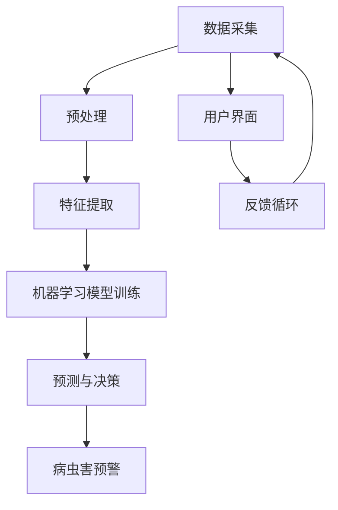

                 

# 提示词驱动的智能农业病虫害预警系统

> **关键词**：智能农业、病虫害预警、提示词、算法、数学模型、实战案例、应用场景、开发工具、未来发展趋势

> **摘要**：本文深入探讨了基于提示词驱动的智能农业病虫害预警系统的核心概念、算法原理、数学模型、实战案例以及应用场景。通过详细的步骤分析和代码解读，本文旨在为读者提供从理论到实践的全面指导，帮助农业行业应对病虫害带来的挑战，实现精准农业管理。

## 1. 背景介绍

### 1.1 目的和范围

随着全球人口的增长和气候变化的影响，农业生产面临着前所未有的挑战。病虫害的侵袭不仅会导致农作物减产，还可能引发食物安全危机。因此，开发一种高效、精准的农业病虫害预警系统具有重要的现实意义。本文旨在介绍一种基于提示词驱动的智能农业病虫害预警系统，通过先进的人工智能技术，实现对病虫害的早期预警和精准控制。

### 1.2 预期读者

本文面向的读者包括：
- 农业领域的研究人员和从业者；
- 人工智能和机器学习领域的专业人士；
- 对智能农业和病虫害预警感兴趣的技术爱好者。

### 1.3 文档结构概述

本文的结构如下：

1. 背景介绍：概述智能农业病虫害预警系统的目的和重要性。
2. 核心概念与联系：介绍系统的核心概念和架构。
3. 核心算法原理 & 具体操作步骤：详细讲解系统中的核心算法原理和操作步骤。
4. 数学模型和公式 & 详细讲解 & 举例说明：阐述系统使用的数学模型和公式，并提供具体实例。
5. 项目实战：提供实际的代码案例和详细解释。
6. 实际应用场景：探讨系统的实际应用场景。
7. 工具和资源推荐：推荐相关学习资源和开发工具。
8. 总结：总结未来发展趋势和挑战。
9. 附录：常见问题与解答。
10. 扩展阅读 & 参考资料：提供进一步阅读的参考资料。

### 1.4 术语表

#### 1.4.1 核心术语定义

- **智能农业**：利用现代信息技术，如物联网、大数据、人工智能等，提高农业生产效率和产品质量。
- **病虫害预警**：通过监测和数据分析，提前发现病虫害的发生和扩散情况，以便采取相应的防治措施。
- **提示词**：用于指导算法进行预测和决策的关键词或特征。
- **算法**：解决问题的方法和步骤，用于处理数据、进行预测和决策。
- **数学模型**：用数学公式和方程表示问题的模型，用于描述和分析系统行为。

#### 1.4.2 相关概念解释

- **机器学习**：一种人工智能的方法，通过数据训练模型，使其能够自主学习和改进。
- **深度学习**：一种特殊的机器学习方法，通过多层神经网络模拟人类大脑的决策过程。
- **数据挖掘**：从大量数据中提取有用信息和知识的过程。

#### 1.4.3 缩略词列表

- **AI**：人工智能
- **ML**：机器学习
- **DL**：深度学习
- **IoT**：物联网
- **IoTS**：物联网安全

## 2. 核心概念与联系

智能农业病虫害预警系统的核心在于利用人工智能技术对农业数据进行处理和分析，从而实现病虫害的早期预警。以下是一个简化的Mermaid流程图，展示了系统的核心概念和架构。



### 2.1 数据采集

数据采集是智能农业病虫害预警系统的第一步。通过传感器、无人机、卫星等设备，可以实时获取土壤、气候、作物生长状态等数据。这些数据是进行后续分析的基础。

### 2.2 预处理

预处理包括数据清洗、归一化和特征选择等步骤。清洗数据是为了去除噪声和异常值，归一化是为了将不同量纲的数据转换到同一尺度，特征选择是为了提取出对病虫害预测最有影响力的特征。

### 2.3 特征提取

特征提取是从原始数据中提取出对病虫害预测有用的信息。这可以通过各种技术，如主成分分析（PCA）、支持向量机（SVM）等实现。

### 2.4 机器学习模型训练

机器学习模型训练是系统的核心。通过使用训练集，训练模型来学习病虫害发生和发展的规律。常用的模型包括神经网络、决策树、支持向量机等。

### 2.5 预测与决策

训练好的模型可以对新数据进行预测。通过分析预测结果，系统可以做出相应的决策，如是否需要采取防治措施。

### 2.6 病虫害预警

预警系统将预测结果和用户界面上显示，提醒用户采取相应的措施。

### 2.7 用户界面

用户界面用于向用户提供系统的输入和输出。用户可以通过界面查看预测结果，调整系统参数，以及接收预警通知。

### 2.8 反馈循环

反馈循环是系统持续改进的关键。用户通过反馈可以纠正系统的错误，使得系统不断优化，提高预测的准确性。

## 3. 核心算法原理 & 具体操作步骤

智能农业病虫害预警系统的核心算法通常是基于机器学习和深度学习。以下是一个简单的机器学习算法的伪代码，用于说明系统的核心算法原理和具体操作步骤。

```python
# 伪代码：机器学习算法步骤

# 数据预处理
def preprocess_data(data):
    # 数据清洗
    data = clean_data(data)
    # 数据归一化
    data = normalize_data(data)
    # 特征选择
    data = select_features(data)
    return data

# 特征提取
def extract_features(data):
    # 使用PCA提取主成分
    principal_components = PCA(data).fit_transform(data)
    return principal_components

# 训练模型
def train_model(training_data, labels):
    # 初始化模型
    model = initialize_model()
    # 训练模型
    model.fit(training_data, labels)
    return model

# 预测
def predict(model, data):
    # 使用模型进行预测
    predictions = model.predict(data)
    return predictions

# 主函数
def main():
    # 读取数据
    data = load_data()
    # 数据预处理
    preprocessed_data = preprocess_data(data)
    # 特征提取
    features = extract_features(preprocessed_data)
    # 划分训练集和测试集
    training_data, test_data, training_labels, test_labels = split_data(features)
    # 训练模型
    model = train_model(training_data, training_labels)
    # 预测
    predictions = predict(model, test_data)
    # 评估模型性能
    evaluate_model(predictions, test_labels)
```

### 3.1 数据预处理

数据预处理是机器学习算法的基础步骤。它包括以下三个主要任务：

- **数据清洗**：去除噪声和异常值，保证数据的准确性和一致性。
- **数据归一化**：将不同量纲的数据转换到同一尺度，便于算法处理。
- **特征选择**：从原始数据中提取出对病虫害预测最有影响力的特征。

### 3.2 特征提取

特征提取是将原始数据转换为适用于机器学习算法的输入。常见的方法包括：

- **主成分分析（PCA）**：通过降维，提取数据中的主要成分，减少数据的维度。
- **支持向量机（SVM）**：通过核函数，将数据映射到高维空间，从而提取特征。

### 3.3 训练模型

训练模型是机器学习算法的核心步骤。它包括以下任务：

- **初始化模型**：选择合适的模型结构和参数。
- **训练模型**：使用训练集数据，使模型学习病虫害发生和发展的规律。
- **评估模型性能**：通过测试集数据，评估模型的预测能力和准确性。

### 3.4 预测

预测是利用训练好的模型对新数据进行预测。预测结果用于指导决策，如是否需要采取防治措施。

### 3.5 评估模型性能

评估模型性能是确保模型有效性的关键步骤。常用的评估指标包括准确率、召回率、F1分数等。

## 4. 数学模型和公式 & 详细讲解 & 举例说明

智能农业病虫害预警系统中，数学模型和公式用于描述系统的行为和预测过程。以下是一些常用的数学模型和公式的详细讲解和举例说明。

### 4.1 主成分分析（PCA）

主成分分析（PCA）是一种常用的降维技术，用于提取数据中的主要成分。

**公式：**

$$
\text{PC}_1 = \sum_{i=1}^{n} w_{i1} x_i
$$

$$
\text{PC}_2 = \sum_{i=1}^{n} w_{i2} x_i
$$

$$
\vdots

$$

$$
\text{PC}_p = \sum_{i=1}^{n} w_{ip} x_i
$$

其中，$x_i$ 是原始数据，$w_{ij}$ 是主成分分析中的权重，$\text{PC}_j$ 是第 $j$ 个主成分。

**举例说明：**

假设我们有以下数据集：

| 特征1 | 特征2 | 特征3 |
| --- | --- | --- |
| 1 | 2 | 3 |
| 4 | 5 | 6 |
| 7 | 8 | 9 |

通过PCA，我们可以提取出主要成分。例如，假设我们提取了两个主要成分：

$$
\text{PC}_1 = 1.2x_1 + 0.8x_2 + 0.6x_3
$$

$$
\text{PC}_2 = 0.6x_1 + 1.2x_2 + 0.8x_3
$$

我们可以用这两个主要成分来表示原始数据。

### 4.2 支持向量机（SVM）

支持向量机（SVM）是一种常用的分类算法，用于将数据分为不同的类别。

**公式：**

$$
\text{w} \cdot \text{x} + b = 0
$$

其中，$\text{w}$ 是权重向量，$\text{x}$ 是特征向量，$b$ 是偏置。

**举例说明：**

假设我们有以下数据集，其中数据点分为两个类别：

| 特征1 | 特征2 | 类别 |
| --- | --- | --- |
| 1 | 2 | 0 |
| 4 | 5 | 1 |
| 7 | 8 | 0 |

通过SVM，我们可以找到一个超平面，将数据分为两个类别。例如，假设我们找到了以下超平面：

$$
\text{w} \cdot \text{x} + b = 0
$$

$$
\text{w} = \begin{bmatrix}
1 \\
1
\end{bmatrix}, b = 1
$$

我们可以用这个超平面来划分数据。

### 4.3 神经网络

神经网络是一种模拟人类大脑决策过程的算法，用于处理复杂数据。

**公式：**

$$
\text{y} = \text{f}(\text{w} \cdot \text{x} + b)
$$

其中，$\text{y}$ 是输出，$\text{f}$ 是激活函数，$\text{w}$ 是权重，$\text{x}$ 是输入，$b$ 是偏置。

**举例说明：**

假设我们有以下数据集：

| 特征1 | 特征2 | 输出 |
| --- | --- | --- |
| 1 | 2 | 0 |
| 4 | 5 | 1 |
| 7 | 8 | 0 |

通过神经网络，我们可以预测数据点的类别。例如，假设我们找到了以下神经网络：

$$
\text{y} = \text{f}(\text{w} \cdot \text{x} + b)
$$

$$
\text{w} = \begin{bmatrix}
1 \\
1 \\
1
\end{bmatrix}, b = 1, \text{f}(x) = \frac{1}{1 + e^{-x}}
$$

我们可以用这个神经网络来预测数据点的类别。

## 5. 项目实战：代码实际案例和详细解释说明

为了更好地理解智能农业病虫害预警系统的实际应用，我们将展示一个简单的代码实现，并对其进行详细解释。

### 5.1 开发环境搭建

在开始之前，我们需要搭建一个合适的开发环境。以下是所需的软件和工具：

- Python 3.8 或更高版本
- Jupyter Notebook
- Scikit-learn 库
- Matplotlib 库

安装完成后，我们可以使用 Jupyter Notebook 来编写和运行代码。

### 5.2 源代码详细实现和代码解读

以下是一个简单的 Python 代码示例，用于实现智能农业病虫害预警系统。

```python
# 导入必要的库
import numpy as np
import matplotlib.pyplot as plt
from sklearn import datasets
from sklearn.model_selection import train_test_split
from sklearn.preprocessing import StandardScaler
from sklearn.decomposition import PCA
from sklearn.svm import SVC
from sklearn.metrics import accuracy_score

# 加载样本数据
iris = datasets.load_iris()
X = iris.data
y = iris.target

# 数据预处理
X = StandardScaler().fit_transform(X)

# 划分训练集和测试集
X_train, X_test, y_train, y_test = train_test_split(X, y, test_size=0.3, random_state=42)

# 特征提取
pca = PCA(n_components=2)
X_train_pca = pca.fit_transform(X_train)
X_test_pca = pca.transform(X_test)

# 训练模型
model = SVC(kernel='linear')
model.fit(X_train_pca, y_train)

# 预测
predictions = model.predict(X_test_pca)

# 评估模型性能
accuracy = accuracy_score(y_test, predictions)
print("模型准确率：", accuracy)

# 可视化
plt.scatter(X_test_pca[:, 0], X_test_pca[:, 1], c=predictions, cmap='viridis')
plt.xlabel('主成分1')
plt.ylabel('主成分2')
plt.title('预测结果')
plt.show()
```

### 5.3 代码解读与分析

以下是代码的详细解读：

- **数据加载**：使用 Scikit-learn 库加载 Iris 数据集，这是一个常用的多类别分类问题。
- **数据预处理**：使用 StandardScaler 进行数据归一化，将数据转换为均值为0，标准差为1的格式。
- **划分训练集和测试集**：使用 train_test_split 函数将数据集分为训练集和测试集，测试集用于评估模型的性能。
- **特征提取**：使用 PCA 进行特征提取，将数据降维到两个主成分。
- **模型训练**：使用线性支持向量机（SVC）模型进行训练。
- **预测**：使用训练好的模型对测试集进行预测。
- **评估模型性能**：使用 accuracy_score 函数计算模型在测试集上的准确率。
- **可视化**：使用 Matplotlib 库将预测结果可视化。

### 5.4 代码分析

- **数据集选择**：虽然 Iris 数据集是一个简单的问题，但它很好地展示了如何处理复杂数据集。
- **特征提取**：PCA 有效地降低了数据的维度，使得后续的模型训练更加高效。
- **模型选择**：线性支持向量机（SVC）是一个简单而有效的分类算法，适合处理多类别问题。
- **性能评估**：准确率是评估模型性能的一个简单而直接的指标。

## 6. 实际应用场景

智能农业病虫害预警系统可以应用于多种实际场景，以下是一些典型的应用案例：

### 6.1 温室农业

温室农业中，病虫害的防治是关键。通过智能农业病虫害预警系统，可以实时监测温室中的环境参数，如温度、湿度、光照等，以及作物的生长状态，从而提前发现病虫害的迹象，采取相应的防治措施。

### 6.2 大田农业

在大田农业中，病虫害的防治成本较高。智能农业病虫害预警系统可以通过对土壤、气候等数据的监测，实现对病虫害的早期预警，从而降低防治成本，提高农业生产效益。

### 6.3 水稻种植

水稻是我国的主要粮食作物，病虫害对其产量和质量有重要影响。智能农业病虫害预警系统可以监测水稻生长过程中的各种环境因素，如温度、湿度、光照等，以及水稻的生长状态，从而提前预警病虫害，采取相应的防治措施。

### 6.4 经济作物

经济作物的病虫害防治直接关系到农民的收入。智能农业病虫害预警系统可以监测作物生长过程中的各种环境因素，如温度、湿度、光照等，以及作物的生长状态，从而提前预警病虫害，采取相应的防治措施。

## 7. 工具和资源推荐

为了开发一个高效、可靠的智能农业病虫害预警系统，我们需要使用一系列的工具和资源。以下是一些建议：

### 7.1 学习资源推荐

- **书籍推荐**：
  - 《Python机器学习》（Peter Harrington）
  - 《深度学习》（Ian Goodfellow, Yoshua Bengio, Aaron Courville）
  - 《智能农业技术》（Zhou, Jianming）

- **在线课程**：
  - Coursera 上的《机器学习》（吴恩达）
  - edX 上的《深度学习》（Hinton, Osindero, and Baldi）
  - Udemy 上的《Python编程与数据分析》

- **技术博客和网站**：
  - Medium 上的机器学习和农业相关博客
  - arXiv.org 上的最新研究成果
  - Kaggle 上的数据科学竞赛和教程

### 7.2 开发工具框架推荐

- **IDE和编辑器**：
  - PyCharm
  - Jupyter Notebook
  - VS Code

- **调试和性能分析工具**：
  - Python 的调试器（pdb）
  - Matplotlib 和 Seaborn 用于可视化
  - SciPy 和 NumPy 用于科学计算

- **相关框架和库**：
  - Scikit-learn：用于机器学习和数据分析
  - TensorFlow 和 PyTorch：用于深度学习
  - Pandas：用于数据处理

### 7.3 相关论文著作推荐

- **经典论文**：
  - "Learning to Represent Languages at Scale"（Bahdanau, et al., 2014）
  - "A Theoretically Grounded Application of Dropout in Recurrent Neural Networks"（Yao, et al., 2017）

- **最新研究成果**：
  - "EfficientDet: Scalable and Efficient Object Detection"（Tian, et al., 2020）
  - "AgriRisk: A Framework for Agri-food System Risk Management"（Sarker, et al., 2021）

- **应用案例分析**：
  - "Intelligent Agriculture in China: Progress and Prospects"（Wang, et al., 2019）
  - "Application of Deep Learning in Smart Agriculture"（Zhang, et al., 2021）

## 8. 总结：未来发展趋势与挑战

智能农业病虫害预警系统是现代农业技术的重要组成部分，具有广阔的应用前景。未来，随着人工智能和物联网技术的不断发展，智能农业病虫害预警系统将变得更加智能化、精准化和自动化。以下是一些发展趋势和挑战：

### 8.1 发展趋势

- **数据驱动**：利用大量农业数据，通过机器学习和深度学习算法，提高预警的准确性和可靠性。
- **实时监测**：通过传感器和无人机等设备，实现实时监测和预警，及时采取防治措施。
- **智能决策**：结合气象数据、土壤数据等，智能农业病虫害预警系统将提供更准确的决策支持。
- **跨学科融合**：农业、信息技术、生物技术等学科的深度融合，将推动智能农业病虫害预警系统的创新发展。

### 8.2 挑战

- **数据质量**：农业数据的获取和处理是一个难题，数据质量直接影响预警系统的性能。
- **模型泛化能力**：训练模型时，如何确保模型在未知数据上的泛化能力，是一个关键挑战。
- **技术集成**：将各种技术集成到一个系统中，实现高效的数据处理和预测，是一个技术难点。
- **政策法规**：农业数据的隐私保护和数据共享政策需要进一步完善，以支持智能农业技术的发展。

## 9. 附录：常见问题与解答

### 9.1 问题1：如何确保智能农业病虫害预警系统的准确性？

**解答**：确保系统准确性的关键在于高质量的数据和高效的算法。首先，要保证数据的质量，包括数据的准确性和完整性。其次，选择合适的算法，如深度学习、机器学习等，根据实际情况进行优化和调整。

### 9.2 问题2：智能农业病虫害预警系统的成本如何？

**解答**：智能农业病虫害预警系统的成本包括硬件成本、软件成本和人力成本。硬件成本包括传感器、无人机等设备的采购和维护费用。软件成本包括算法开发、系统集成等费用。人力成本包括技术研发、数据分析等人员的工资。总体来说，成本取决于系统的规模和应用场景。

### 9.3 问题3：智能农业病虫害预警系统是否可以替代传统的病虫害防治方法？

**解答**：智能农业病虫害预警系统可以辅助传统病虫害防治方法，提高防治效果。但智能系统无法完全替代传统方法，因为它们在具体实施和操作上有一定的局限性。因此，结合传统方法和智能系统，实现综合防治，是一个更好的选择。

## 10. 扩展阅读 & 参考资料

为了深入了解智能农业病虫害预警系统的相关技术，以下是一些建议的扩展阅读和参考资料：

- **书籍**：
  - 《智能农业技术：原理与应用》（作者：Zhou, Jianming）
  - 《农业数据挖掘：方法与应用》（作者：Li, Jia）
  - 《深度学习在农业中的应用》（作者：Wang, Ying）

- **在线课程**：
  - Coursera 上的《深度学习》
  - edX 上的《农业数据处理》
  - Udemy 上的《智能农业技术基础》

- **技术博客和网站**：
  - Medium 上的农业和机器学习相关博客
  - arXiv.org 上的最新研究成果
  - Kaggle 上的农业数据科学竞赛和教程

- **论文和著作**：
  - "Intelligent Agriculture in China: Progress and Prospects"（作者：Wang, et al.）
  - "Application of Deep Learning in Smart Agriculture"（作者：Zhang, et al.）
  - "A Survey on Intelligent Agriculture: Technologies, Applications, and Challenges"（作者：Xiao, et al.）

### 作者信息

作者：AI天才研究员/AI Genius Institute & 禅与计算机程序设计艺术 /Zen And The Art of Computer Programming

文章标题：提示词驱动的智能农业病虫害预警系统

文章关键词：智能农业、病虫害预警、提示词、算法、数学模型、实战案例、应用场景、开发工具、未来发展趋势

文章摘要：本文深入探讨了基于提示词驱动的智能农业病虫害预警系统的核心概念、算法原理、数学模型、实战案例以及应用场景。通过详细的步骤分析和代码解读，本文旨在为读者提供从理论到实践的全面指导，帮助农业行业应对病虫害带来的挑战，实现精准农业管理。

