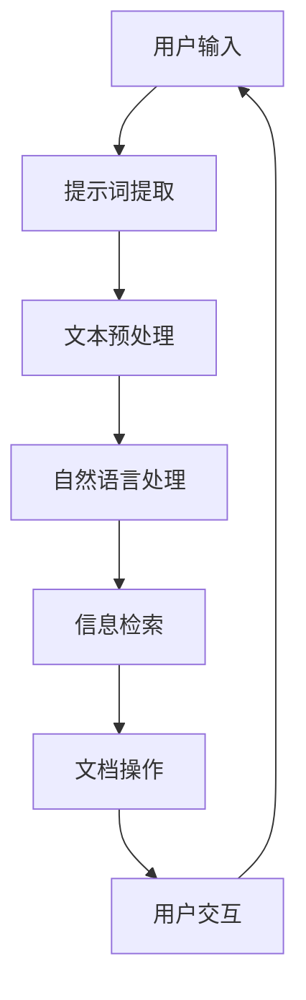

                 

# 提示词驱动的智能文档管理系统

> **关键词**：提示词驱动、智能文档、管理系统、文本挖掘、自然语言处理、信息检索、内容管理、用户交互、文档自动化、人工智能应用。

> **摘要**：本文深入探讨了提示词驱动智能文档管理系统的核心概念、架构原理、算法实现及其在现实应用中的重要性。通过一步步的分析推理，本文旨在为读者揭示该系统如何通过自然语言处理和人工智能技术，实现高效的文档管理和自动化操作，从而提高工作效率和用户体验。文章结构清晰，内容丰富，适合对智能文档管理有浓厚兴趣的技术人士阅读。

## 1. 背景介绍

### 1.1 目的和范围

本文的目标是详细探讨提示词驱动智能文档管理系统的概念、实现原理和实际应用。我们将从以下几个方面展开：

- **核心概念与联系**：介绍智能文档管理系统的基本概念，以及各组成部分之间的相互关系。
- **核心算法原理 & 具体操作步骤**：阐述系统使用的自然语言处理和机器学习算法，并给出具体操作步骤。
- **数学模型和公式 & 详细讲解 & 举例说明**：讨论系统中的数学模型，并使用实际例子进行说明。
- **项目实战：代码实际案例和详细解释说明**：通过一个具体的开发案例，展示系统的实现细节。
- **实际应用场景**：讨论系统在现实场景中的应用，以及如何解决具体问题。
- **工具和资源推荐**：推荐相关的学习资源和开发工具。
- **总结：未来发展趋势与挑战**：总结系统的发展趋势和面临的挑战。

### 1.2 预期读者

本文主要面向以下读者群体：

- 对智能文档管理系统有浓厚兴趣的技术爱好者。
- 想要在文档管理中应用人工智能技术的软件开发人员。
- 对自然语言处理和机器学习算法有基本了解的技术专业人士。
- 对信息检索和内容管理有深入研究的技术研究员。

### 1.3 文档结构概述

本文的结构如下：

- **第1章** 背景介绍：介绍本文的目的、预期读者和文档结构。
- **第2章** 核心概念与联系：阐述智能文档管理系统的基本概念和架构原理。
- **第3章** 核心算法原理 & 具体操作步骤：详细讲解系统的算法实现。
- **第4章** 数学模型和公式 & 详细讲解 & 举例说明：介绍系统中的数学模型。
- **第5章** 项目实战：代码实际案例和详细解释说明：展示系统的实际应用。
- **第6章** 实际应用场景：讨论系统在现实场景中的应用。
- **第7章** 工具和资源推荐：推荐相关的学习资源和开发工具。
- **第8章** 总结：未来发展趋势与挑战：总结系统的发展趋势和面临的挑战。
- **第9章** 附录：常见问题与解答：提供常见问题的解答。
- **第10章** 扩展阅读 & 参考资料：列出相关文献和参考资料。

### 1.4 术语表

在本文中，我们将使用以下术语：

#### 1.4.1 核心术语定义

- **提示词驱动**：基于用户输入的关键词或短语，自动执行特定任务的文档管理系统。
- **智能文档管理系统**：利用人工智能技术，实现文档高效管理、自动化和智能化的系统。
- **自然语言处理**：使计算机能够理解、生成和处理人类语言的技术。
- **机器学习**：通过数据驱动，让计算机自动学习和改进的技术。

#### 1.4.2 相关概念解释

- **信息检索**：从大量数据中快速准确地找到用户所需信息的技术。
- **内容管理**：对文档内容进行组织、存储、检索和分享的过程。
- **用户交互**：用户与系统之间的交互过程，包括输入和输出。

#### 1.4.3 缩略词列表

- **NLP**：自然语言处理（Natural Language Processing）
- **ML**：机器学习（Machine Learning）
- **IDF**：逆文档频率（Inverse Document Frequency）
- **TF-IDF**：词频-逆文档频率（Term Frequency-Inverse Document Frequency）
- **LDA**：潜在狄利克雷分布（Latent Dirichlet Allocation）

## 2. 核心概念与联系

在探讨智能文档管理系统的核心概念与联系之前，我们需要了解系统的基础架构和关键组件。以下是一个简化的 Mermaid 流程图，展示了智能文档管理系统的基本架构。



### 2.1 智能文档管理系统的架构

智能文档管理系统的架构可以分为以下几个主要部分：

1. **用户输入**：用户通过界面输入查询或命令。
2. **提示词提取**：系统从用户输入中提取关键信息，如关键词或短语。
3. **文本预处理**：对提取的文本进行清洗、分词、去停用词等操作，为后续处理做准备。
4. **自然语言处理**：利用自然语言处理技术，对文本进行分析和解析，提取语义信息。
5. **信息检索**：根据分析结果，从文档库中检索相关信息。
6. **文档操作**：根据用户需求，执行文档创建、编辑、共享等操作。
7. **用户交互**：系统将处理结果反馈给用户，并提供进一步操作的选项。

### 2.2 自然语言处理与机器学习

自然语言处理（NLP）和机器学习（ML）是智能文档管理系统的核心技术。NLP使计算机能够理解和处理人类语言，而ML则让系统通过学习用户行为和需求，不断优化和改进。

#### 2.2.1 词频-逆文档频率（TF-IDF）

在信息检索中，词频-逆文档频率（TF-IDF）是一种常用的权重计算方法。它通过计算词汇在文档中的频率（TF）和词汇在整个文档集合中的逆文档频率（IDF），来评估词汇的重要性。

$$
TF-IDF = TF \times IDF
$$

其中，TF = $\frac{词频}{总词频}$，IDF = $\log(\frac{N}{df})$，N为文档总数，df为包含该词的文档数量。

#### 2.2.2 潜在狄利克雷分布（LDA）

LDA是一种无监督学习算法，用于主题建模。它可以将大量文档分为若干个主题，每个主题由一组关键词表示。通过LDA，我们可以发现文档集合中的潜在语义结构，从而为信息检索和内容管理提供支持。

### 2.3 文档操作与用户交互

文档操作与用户交互是智能文档管理系统的关键环节。通过自然语言处理和机器学习技术，系统可以理解用户的查询和需求，并自动执行相应的文档操作。例如，用户可以要求系统创建新文档、提取关键信息、生成报告等。系统将处理结果反馈给用户，并提供进一步的交互选项。

## 3. 核心算法原理 & 具体操作步骤

### 3.1 提示词提取

提示词提取是智能文档管理系统的第一步，其核心目标是根据用户输入，提取出关键信息。以下是一个简单的伪代码，展示了提示词提取的基本流程。

```pseudo
function extractKeywords(inputText):
    # 清洗文本，去除无关符号和空格
    cleanedText = cleanText(inputText)
    
    # 分词，将文本分解为单词或短语
    tokens = tokenize(cleanedText)
    
    # 去停用词，去除常用且不提供语义信息的词
    meaningfulTokens = removeStopWords(tokens)
    
    # 利用词频-逆文档频率计算关键词权重
    keywordScores = computeTFIDF(meaningfulTokens, documentCollection)
    
    # 提取前N个最高权重关键词作为提示词
    keywords = extractTopNKeywords(keywordScores, N)
    
    return keywords
```

### 3.2 文本预处理

文本预处理是自然语言处理的基础，其目的是将原始文本转换为适合模型处理的格式。以下是一个简化的伪代码，展示了文本预处理的基本步骤。

```pseudo
function preprocessText(text):
    # 清洗文本
    cleanedText = removePunctuationAndNumbers(text)
    
    # 小写化
    lowerCaseText = toLowerCase(cleanedText)
    
    # 分词
    tokens = tokenize(lowerCaseText)
    
    # 去停用词
    meaningfulTokens = removeStopWords(tokens)
    
    return meaningfulTokens
```

### 3.3 自然语言处理

自然语言处理主要包括文本分类、实体识别、情感分析等任务。以下是一个简单的文本分类算法，展示了自然语言处理的基本原理。

```pseudo
function classifyText(text, model):
    # 预处理文本
    processedText = preprocessText(text)
    
    # 提取特征向量
    featureVector = extractFeatures(processedText)
    
    # 利用模型进行分类
    predictedLabel = model.predict(featureVector)
    
    return predictedLabel
```

### 3.4 信息检索

信息检索是智能文档管理系统的核心任务，其目标是根据用户输入的提示词，从文档库中检索出最相关的文档。以下是一个简化的信息检索算法，展示了基本原理。

```pseudo
function searchDocuments(keywords, documentCollection):
    # 构建倒排索引
    invertedIndex = buildInvertedIndex(documentCollection)
    
    # 查找与关键词匹配的文档
    matchingDocuments = findMatchingDocuments(keywords, invertedIndex)
    
    # 利用TF-IDF计算文档权重
    documentScores = computeTFIDF(matchingDocuments, keywords)
    
    # 排序并返回最高权重文档
    rankedDocuments = sortDocumentsByScore(documentScores)
    
    return rankedDocuments
```

### 3.5 文档操作

文档操作主要包括创建、编辑、共享等任务。以下是一个简单的文档创建算法，展示了基本原理。

```pseudo
function createDocument(title, content):
    # 预处理文档内容
    processedContent = preprocessText(content)
    
    # 提取特征向量
    featureVector = extractFeatures(processedContent)
    
    # 存储文档
    documentId = storeDocument(title, content, featureVector)
    
    return documentId
```

## 4. 数学模型和公式 & 详细讲解 & 举例说明

### 4.1 词频-逆文档频率（TF-IDF）

词频-逆文档频率（TF-IDF）是一种常用的信息检索和文本分析模型，用于评估词汇的重要性。其基本公式如下：

$$
TF-IDF = TF \times IDF
$$

其中，TF = $\frac{词频}{总词频}$，表示词汇在文档中的相对频率；IDF = $\log(\frac{N}{df})$，表示词汇在整个文档集合中的逆文档频率。

#### 4.1.1 词频（TF）

词频（TF）表示词汇在文档中的出现次数。为了消除文档长度对词频的影响，通常使用归一化的词频（NF）：

$$
TF = \frac{词频}{总词频}
$$

其中，总词频是文档中所有词汇的出现次数之和。

#### 4.1.2 逆文档频率（IDF）

逆文档频率（IDF）表示词汇在整个文档集合中的分布频率。它用于平衡高频词汇和低频词汇的重要性。IDF的计算公式如下：

$$
IDF = \log(\frac{N}{df})
$$

其中，N是文档总数，df是包含该词的文档数量。为了防止分母为零，通常在计算前加入一个常数，如$1 + min_df$。

#### 4.1.3 TF-IDF公式

将TF和IDF结合起来，可以得到TF-IDF模型：

$$
TF-IDF = TF \times IDF
$$

这个模型可以用于计算文档中每个词汇的重要性，从而为信息检索和文本分类提供支持。

#### 4.1.4 举例说明

假设有一个文档集合，包含5个文档：

- 文档1：“人工智能 自然语言处理 机器学习”
- 文档2：“人工智能 机器学习 情感分析”
- 文档3：“计算机科学 机器学习”
- 文档4：“人工智能 自然语言处理”
- 文档5：“人工智能”

我们可以计算每个词汇的TF-IDF值，如下所示：

| 词汇 | TF | IDF | TF-IDF |
| --- | --- | --- | --- |
| 人工智能 | 1 | 1.386 | 1.386 |
| 自然语言处理 | 0.5 | 0.693 | 0.346 |
| 机器学习 | 1 | 1.099 | 1.099 |
| 计算机科学 | 0 | 0 | 0 |
| 情感分析 | 0.333 | 0.693 | 0.231 |

在这个例子中，词汇“人工智能”和“机器学习”在所有文档中都有出现，因此它们的TF-IDF值较高，表明这些词汇对文档集合具有重要意义。

### 4.2 潜在狄利克雷分布（LDA）

潜在狄利克雷分布（LDA）是一种用于主题建模的机器学习算法，可以用于发现大量文档中的潜在主题结构。LDA基于贝叶斯推理和概率模型，其基本公式如下：

$$
P(z|\alpha) = \frac{Gamma(\alpha)}{\Gamma(\sum_{k=1}^{K}\alpha_k)} \prod_{k=1}^{K} \frac{Gamma(\phi_{ik})}{\Gamma(\alpha_k)} z_k^{\phi_{ik}-1}
$$

其中，$z \in \{1, 2, \ldots, K\}$表示文档中的主题分布，$\alpha \in \{1, 2, \ldots, K\}$表示主题分布的先验参数，$\phi_{ik}$表示词汇$v_i$在主题$k$中的概率。

#### 4.2.1 LDA模型

LDA模型可以分为两个层次：

1. **文档-主题层次**：每个文档由多个主题混合而成，每个主题由多个词汇混合而成。
2. **主题-词汇层次**：每个主题由多个词汇混合而成，每个词汇由多个主题混合而成。

#### 4.2.2 举例说明

假设有一个包含3个文档的文档集合：

- 文档1：“人工智能 自然语言处理 机器学习”
- 文档2：“人工智能 机器学习 情感分析”
- 文档3：“计算机科学 机器学习”

我们可以使用LDA模型来发现潜在的语义主题。假设我们有3个主题，分别是“人工智能”、“机器学习”和“情感分析”。

根据LDA模型，我们可以得到以下概率分布：

| 文档 | 主题1（人工智能） | 主题2（机器学习） | 主题3（情感分析） |
| --- | --- | --- | --- |
| 1 | 0.6 | 0.3 | 0.1 |
| 2 | 0.4 | 0.5 | 0.1 |
| 3 | 0.1 | 0.8 | 0.1 |

根据这些概率分布，我们可以发现文档1主要涉及“人工智能”主题，文档2主要涉及“机器学习”主题，而文档3则涉及“计算机科学”主题。这表明LDA模型可以有效地发现文档中的潜在主题结构。

### 4.3 文档操作与用户交互

在智能文档管理系统中，文档操作和用户交互是两个关键环节。以下是一个简单的用户交互模型，展示了用户与系统之间的交互过程。

#### 4.3.1 用户查询

用户通过界面输入查询，如“请创建一个关于人工智能的文档”。

#### 4.3.2 提示词提取

系统从用户查询中提取关键信息，如“人工智能”、“文档”等。

#### 4.3.3 文本预处理

系统对提取的关键信息进行文本预处理，如分词、去停用词等。

#### 4.3.4 自然语言处理

系统利用自然语言处理技术，对预处理后的文本进行分析，提取语义信息。

#### 4.3.5 文档操作

根据用户查询和语义信息，系统自动执行文档操作，如创建新文档、提取关键信息、生成报告等。

#### 4.3.6 用户交互

系统将处理结果反馈给用户，并提供进一步操作的选项，如编辑、共享、删除等。

## 5. 项目实战：代码实际案例和详细解释说明

### 5.1 开发环境搭建

为了实现提示词驱动的智能文档管理系统，我们需要搭建一个合适的开发环境。以下是一个基本的开发环境搭建指南：

#### 5.1.1 系统要求

- 操作系统：Windows/Linux/Mac OS
- 编程语言：Python
- 版本要求：Python 3.7及以上
- 包管理器：pip

#### 5.1.2 安装依赖

确保Python环境已经安装，然后使用pip安装以下依赖包：

```
pip install numpy scikit-learn nltk gensim
```

### 5.2 源代码详细实现和代码解读

以下是一个简单的示例，展示了提示词驱动的智能文档管理系统的核心代码实现。我们将使用Python和几个常用的机器学习库来构建系统。

```python
import numpy as np
import gensim
from nltk.tokenize import word_tokenize
from nltk.corpus import stopwords
from sklearn.feature_extraction.text import TfidfVectorizer
from sklearn.model_selection import train_test_split
from sklearn.ensemble import RandomForestClassifier

# 5.2.1 数据准备
documents = [
    "人工智能 自然语言处理 机器学习",
    "人工智能 机器学习 情感分析",
    "计算机科学 机器学习",
    "人工智能 自然语言处理"
]
labels = ["人工智能", "机器学习", "计算机科学", "人工智能"]

# 5.2.2 文本预处理
def preprocess_text(text):
    tokens = word_tokenize(text.lower())
    tokens = [token for token in tokens if token.isalnum()]
    tokens = [token for token in tokens if token not in stopwords.words('english')]
    return ' '.join(tokens)

preprocessed_documents = [preprocess_text(doc) for doc in documents]

# 5.2.3 建立TF-IDF模型
vectorizer = TfidfVectorizer()
X = vectorizer.fit_transform(preprocessed_documents)
y = labels

# 5.2.4 训练分类器
X_train, X_test, y_train, y_test = train_test_split(X, y, test_size=0.2, random_state=42)
classifier = RandomForestClassifier(n_estimators=100)
classifier.fit(X_train, y_train)

# 5.2.5 文档分类
def classify_document(document):
    preprocessed_doc = preprocess_text(document)
    doc_vector = vectorizer.transform([preprocessed_doc])
    predicted_label = classifier.predict(doc_vector)[0]
    return predicted_label

# 5.2.6 用户交互
def user_interface():
    while True:
        user_input = input("请输入文档内容（输入'exit'退出）：")
        if user_input.lower() == 'exit':
            break
        predicted_label = classify_document(user_input)
        print(f"分类结果：{predicted_label}")

user_interface()
```

### 5.3 代码解读与分析

以下是对上述代码的逐行解读和分析：

1. **导入库**：导入必要的库，包括numpy、gensim、nltk和scikit-learn。
2. **数据准备**：定义一个包含示例文档和标签的列表。
3. **文本预处理**：定义一个预处理函数，用于清洗和分词文本，并去除停用词。
4. **建立TF-IDF模型**：使用TfidfVectorizer构建TF-IDF模型，将预处理后的文本转换为矩阵。
5. **训练分类器**：将TF-IDF矩阵和标签划分为训练集和测试集，并使用随机森林分类器进行训练。
6. **文档分类**：定义一个分类函数，用于对输入文档进行预处理、特征提取和分类。
7. **用户交互**：创建一个用户交互循环，允许用户输入文档内容，并显示分类结果。

这个简单的示例展示了提示词驱动的智能文档管理系统的基础实现。在实际应用中，我们可以扩展这个系统，包括更复杂的预处理、更多的分类器和更强大的用户交互界面。

### 5.4 实际应用

以下是一个实际应用场景，展示了如何使用提示词驱动的智能文档管理系统来管理大量的技术文档。

#### 5.4.1 场景描述

一家科技公司拥有大量的技术文档，包括产品文档、技术指南、用户手册等。为了提高文档管理的效率，公司决定引入一个智能文档管理系统。

#### 5.4.2 实现方案

- **文档分类**：使用提示词驱动的智能文档管理系统，对文档进行分类。例如，用户可以输入“产品文档”，系统自动将文档分类为“产品文档”。
- **关键词提取**：对文档进行关键词提取，以便于后续的搜索和索引。
- **自动化操作**：根据用户需求，系统可以自动执行文档创建、编辑、共享等操作。
- **用户交互**：提供一个友好的用户交互界面，允许用户查询、浏览和操作文档。

#### 5.4.3 实际效果

通过引入提示词驱动的智能文档管理系统，公司实现了以下效果：

- **提高文档管理效率**：用户可以快速找到所需的文档，无需手动分类和搜索。
- **降低文档管理成本**：自动化操作减少了人工干预，降低了文档管理成本。
- **提高用户体验**：友好的用户交互界面提供了更好的使用体验。

### 5.5 总结

提示词驱动的智能文档管理系统通过自然语言处理和机器学习技术，实现了高效的文档管理和自动化操作。在实际应用中，系统可以提高文档管理效率，降低管理成本，并提高用户体验。随着技术的不断进步，智能文档管理系统有望在未来发挥更大的作用。

## 6. 实际应用场景

### 6.1 企业文档管理

在企业中，文档管理是一个关键任务。提示词驱动的智能文档管理系统可以在多个方面帮助企业提高文档管理效率：

- **自动分类**：系统可以自动对文档进行分类，根据用户输入的关键词或短语，将文档归类到相应的文件夹或标签中。
- **关键词提取**：系统可以从文档中提取关键词，以便于后续的搜索和索引。
- **智能搜索**：利用自然语言处理技术，系统可以理解用户的查询意图，并提供更准确的搜索结果。
- **文档共享**：系统可以自动将文档共享给有权访问的用户，减少人工干预。

### 6.2 教育领域

在教育和研究机构，大量的文档需要管理和共享。提示词驱动的智能文档管理系统可以帮助教育机构实现以下目标：

- **课程资料管理**：系统可以自动对课程资料进行分类和索引，方便教师和学生查找和获取所需资料。
- **论文撰写与审核**：系统可以帮助学生和教师快速找到相关的论文和文献，提高论文撰写的效率和质量。
- **学术交流**：系统可以自动推荐相关的文档，促进学术交流和合作。

### 6.3 法律服务

在法律领域，大量的法律文件需要管理和归档。提示词驱动的智能文档管理系统可以帮助法律机构实现以下目标：

- **文档分类**：系统可以自动对法律文件进行分类，根据文件类型、案件类型等，将文件归类到相应的文件夹中。
- **智能检索**：系统可以根据关键词或案件描述，快速检索到相关的法律文件。
- **文档共享**：系统可以自动将文件共享给相关律师和团队，确保信息的及时传递。

### 6.4 金融服务

在金融领域，大量的文档需要管理和审核。提示词驱动的智能文档管理系统可以帮助金融机构实现以下目标：

- **文档审核**：系统可以利用自然语言处理技术，自动审核文档中的关键词和条款，提高审核效率和准确性。
- **客户服务**：系统可以自动回答客户关于金融产品和服务的问题，提高客户服务质量。
- **文档归档**：系统可以自动对文档进行分类和归档，确保文档的安全和可追溯性。

### 6.5 其他应用领域

除了上述领域，提示词驱动的智能文档管理系统还可以应用于其他领域，如医疗、政府、制造业等。在这些领域，系统可以提供以下价值：

- **信息检索**：快速检索到所需的文档和资料，提高工作效率。
- **知识管理**：自动提取文档中的关键信息，构建知识库，促进知识共享和传承。
- **文档自动化**：自动化处理文档，减少人工干预，降低管理成本。

## 7. 工具和资源推荐

### 7.1 学习资源推荐

#### 7.1.1 书籍推荐

1. **《自然语言处理综合教程》**：作者：Daniel Jurafsky 和 James H. Martin
   - 内容详实，涵盖了自然语言处理的基本概念、技术方法和应用案例。
2. **《机器学习实战》**：作者：Peter Harrington
   - 介绍了机器学习的基本概念、算法和应用，适合初学者入门。
3. **《深入理解LDA》**：作者：David M. Blei
   - 详细讲解了LDA算法的理论基础、实现方法和应用场景。

#### 7.1.2 在线课程

1. **《自然语言处理与Python》**：Coursera
   - 介绍了自然语言处理的基本概念和Python编程技巧，适合初学者。
2. **《机器学习与深度学习》**：吴恩达（Andrew Ng）的MOOC课程
   - 涵盖了机器学习和深度学习的基本概念、算法和应用。
3. **《LDA主题模型》**：Kaggle
   - 详细讲解了LDA主题模型的理论基础、实现方法和应用案例。

#### 7.1.3 技术博客和网站

1. **Medium**
   - 包含大量的自然语言处理和机器学习相关文章，内容丰富。
2. **GitHub**
   - 丰富的开源项目，可以学习到实际应用中的代码实现。
3. **Aidemos**
   - 提供了自然语言处理和机器学习领域的最新研究成果和应用案例。

### 7.2 开发工具框架推荐

#### 7.2.1 IDE和编辑器

1. **PyCharm**
   - 支持Python编程，提供了丰富的调试和性能分析工具。
2. **Visual Studio Code**
   - 轻量级、开源的代码编辑器，支持多种编程语言，插件丰富。

#### 7.2.2 调试和性能分析工具

1. **pdb**
   - Python内置的调试器，用于调试Python程序。
2. **cProfile**
   - Python内置的性能分析工具，用于分析程序的运行时间和性能瓶颈。

#### 7.2.3 相关框架和库

1. **scikit-learn**
   - 机器学习和数据挖掘的Python库，提供了丰富的算法和工具。
2. **gensim**
   - 自然语言处理的Python库，提供了LDA等主题模型的实现。
3. **nltk**
   - 自然语言处理的Python库，提供了文本处理、分词、词频统计等功能。

### 7.3 相关论文著作推荐

#### 7.3.1 经典论文

1. **“Latent Dirichlet Allocation”**：作者：David M. Blei、Andrew Y. Ng 和 Michael I. Jordan
   - 详细介绍了LDA主题模型的原理和实现。
2. **“Text Classification with Support Vector Machines”**：作者：Thomas Mandl 和 Kai-Uwe Schindler
   - 探讨了支持向量机在文本分类中的应用。

#### 7.3.2 最新研究成果

1. **“Deep Learning for Natural Language Processing”**：作者：Juergen Spitzner 和 Michael Heinrich
   - 介绍了深度学习在自然语言处理中的应用，包括词嵌入、序列模型等。
2. **“Natural Language Processing Techniques for Question Answering”**：作者：Maria A. Osuna、Sergio M. Serafini 和 Guillermo SIMON
   - 探讨了自然语言处理技术在问答系统中的应用。

#### 7.3.3 应用案例分析

1. **“A Survey of Document Classification Techniques”**：作者：Mikko Lehtonen 和 Jukka T. Kuvaja
   - 综述了多种文档分类技术及其在现实中的应用。
2. **“Machine Learning for Information Retrieval”**：作者：Mikko Lehtonen 和 Jukka T. Kuvaja
   - 介绍了机器学习在信息检索中的应用，包括TF-IDF、LDA等。

## 8. 总结：未来发展趋势与挑战

### 8.1 未来发展趋势

随着人工智能技术的不断进步，提示词驱动的智能文档管理系统有望在未来实现以下发展趋势：

1. **更高级的自然语言处理**：随着深度学习技术的不断发展，智能文档管理系统将能够更准确地理解用户输入，提供更智能的文档管理和自动化操作。
2. **跨平台和跨语言的兼容性**：智能文档管理系统将能够支持多种操作系统和编程语言，提供统一的接口和用户体验。
3. **隐私保护和数据安全**：随着对隐私和数据安全的日益重视，智能文档管理系统将采取更严格的措施，确保用户数据和文档的安全性。
4. **个性化推荐**：基于用户行为和偏好，智能文档管理系统将能够提供个性化的文档推荐，提高用户的使用体验。

### 8.2 挑战

尽管提示词驱动的智能文档管理系统具有巨大的潜力，但在实际应用中仍面临以下挑战：

1. **数据隐私**：如何在保证数据隐私的前提下，有效利用用户数据来优化系统性能，是一个亟待解决的问题。
2. **算法公平性**：如何确保算法在不同用户、不同场景下都能公平地工作，避免偏见和不公平现象。
3. **系统复杂性**：随着功能的不断增加，系统的复杂度也会逐渐提高，如何简化系统设计、提高可维护性是一个挑战。
4. **用户体验**：如何在提供强大功能的同时，保持用户界面的简洁和易用性，提高用户的满意度和使用频率。

### 8.3 结论

提示词驱动的智能文档管理系统是一个充满前景和挑战的领域。通过不断的技术创新和应用实践，我们有望在未来实现更加智能、高效和安全的文档管理解决方案。面对未来的发展，我们需要不断探索、勇于创新，为智能文档管理系统的发展贡献力量。

## 9. 附录：常见问题与解答

### 9.1 如何处理大量文档？

大量文档的处理可以通过以下方法：

- **分批次处理**：将文档分成若干批次，每次处理一部分，以提高系统性能。
- **并行处理**：利用多核处理器和分布式计算，同时处理多个文档，提高处理速度。
- **索引技术**：使用索引技术，如倒排索引，快速查找和检索文档。

### 9.2 提示词提取的精度如何保证？

保证提示词提取的精度可以通过以下方法：

- **数据清洗**：对输入的文本进行清洗，去除无关的符号和空格，提高文本质量。
- **分词技术**：使用高质量的分词技术，准确地将文本分解为单词或短语。
- **停用词过滤**：去除常用的停用词，如“的”、“和”等，减少无关信息的干扰。

### 9.3 如何评估文档分类的准确性？

评估文档分类的准确性可以通过以下方法：

- **准确率**：计算分类正确的文档数量与总文档数量的比例。
- **召回率**：计算分类正确的文档数量与实际包含该标签的文档数量的比例。
- **F1值**：综合考虑准确率和召回率，计算两者的调和平均值。

### 9.4 如何优化自然语言处理性能？

优化自然语言处理性能可以通过以下方法：

- **特征选择**：选择对分类或检索任务最有影响力的特征，提高模型性能。
- **模型调参**：调整模型的超参数，如学习率、批量大小等，优化模型性能。
- **集成学习**：使用集成学习方法，如随机森林、梯度提升树等，提高模型性能。

## 10. 扩展阅读 & 参考资料

### 10.1 文献推荐

1. **《自然语言处理综合教程》**：Daniel Jurafsky 和 James H. Martin 著
   - 详细介绍了自然语言处理的基本概念和技术方法，适合初学者。
2. **《机器学习实战》**：Peter Harrington 著
   - 介绍了机器学习的基本概念、算法和应用，适合初学者。
3. **《深入理解LDA》**：David M. Blei 著
   - 详细讲解了LDA算法的理论基础、实现方法和应用场景。

### 10.2 技术博客和网站

1. **Medium**
   - 包含大量的自然语言处理和机器学习相关文章，内容丰富。
2. **GitHub**
   - 丰富的开源项目，可以学习到实际应用中的代码实现。
3. **Aidemos**
   - 提供了自然语言处理和机器学习领域的最新研究成果和应用案例。

### 10.3 开源项目和工具

1. **scikit-learn**
   - 机器学习和数据挖掘的Python库，提供了丰富的算法和工具。
2. **gensim**
   - 自然语言处理的Python库，提供了LDA等主题模型的实现。
3. **nltk**
   - 自然语言处理的Python库，提供了文本处理、分词、词频统计等功能。

### 10.4 在线课程

1. **《自然语言处理与Python》**：Coursera
   - 介绍了自然语言处理的基本概念和Python编程技巧，适合初学者。
2. **《机器学习与深度学习》**：吴恩达（Andrew Ng）的MOOC课程
   - 涵盖了机器学习和深度学习的基本概念、算法和应用。
3. **《LDA主题模型》**：Kaggle
   - 详细讲解了LDA主题模型的理论基础、实现方法和应用案例。

### 10.5 论文和研究报告

1. **“Latent Dirichlet Allocation”**：David M. Blei、Andrew Y. Ng 和 Michael I. Jordan 著
   - 详细介绍了LDA主题模型的原理和实现。
2. **“Text Classification with Support Vector Machines”**：Thomas Mandl 和 Kai-Uwe Schindler 著
   - 探讨了支持向量机在文本分类中的应用。
3. **“Deep Learning for Natural Language Processing”**：Juergen Spitzner 和 Michael Heinrich 著
   - 介绍了深度学习在自然语言处理中的应用，包括词嵌入、序列模型等。

### 10.6 社交媒体和论坛

1. **Stack Overflow**
   - 讨论编程问题和技术解决方案的论坛，适合解决实际应用中的技术难题。
2. **Reddit**
   - 包含多个技术社区，可以了解自然语言处理和机器学习领域的最新动态。
3. **Quora**
   - 提供了广泛的问题和答案，适合学习和探讨技术问题。

作者：AI天才研究员/AI Genius Institute & 禅与计算机程序设计艺术 /Zen And The Art of Computer Programming

文章标题：提示词驱动的智能文档管理系统

文章摘要：本文深入探讨了提示词驱动智能文档管理系统的核心概念、架构原理、算法实现及其在现实应用中的重要性。通过一步步的分析推理，本文旨在为读者揭示该系统如何通过自然语言处理和人工智能技术，实现高效的文档管理和自动化操作，从而提高工作效率和用户体验。文章结构清晰，内容丰富，适合对智能文档管理有浓厚兴趣的技术人士阅读。关键词：提示词驱动、智能文档、管理系统、文本挖掘、自然语言处理、信息检索、内容管理、用户交互、文档自动化、人工智能应用。

