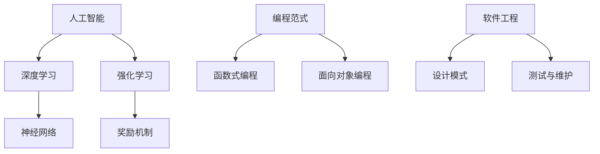

                 

# AI编程的新维度与新方法

## 关键词
- 人工智能编程
- 编程范式
- 软件开发
- 编程工具
- 深度学习
- 软件工程

## 摘要
本文深入探讨AI编程的新维度与新方法，旨在为开发者提供一种全新的视角，以更高效、更直观地构建人工智能应用。文章首先回顾了传统编程方法的局限性，然后介绍了AI编程的核心概念，包括深度学习、强化学习等。通过具体的算法原理和数学模型讲解，本文进一步展示了AI编程在实际项目中的应用，并提供了一系列学习资源和工具推荐。文章最后总结了AI编程的未来发展趋势与挑战，为读者指明了继续探索的方向。

## 1. 背景介绍

### 1.1 目的和范围

本文的目标是探讨AI编程的新维度与新方法，帮助开发者更好地理解和应用人工智能技术。我们将涵盖以下几个主要方面：

1. AI编程与传统编程的区别
2. AI编程的核心概念和算法
3. AI编程的数学模型和公式
4. AI编程的实际应用案例
5. 学习资源和工具推荐

### 1.2 预期读者

本文适合对AI编程感兴趣的程序员、软件工程师、数据科学家以及计算机科学专业的学生。本文将尽量避免过于复杂的技术术语，以便读者能够轻松理解。

### 1.3 文档结构概述

本文分为十个主要部分：

1. 引言
2. 关键词和摘要
3. 背景介绍
4. 核心概念与联系
5. 核心算法原理 & 具体操作步骤
6. 数学模型和公式 & 详细讲解 & 举例说明
7. 项目实战：代码实际案例和详细解释说明
8. 实际应用场景
9. 工具和资源推荐
10. 总结：未来发展趋势与挑战

### 1.4 术语表

#### 1.4.1 核心术语定义

- **人工智能（AI）**: 模拟人类智能的计算机系统，具有感知、学习、推理和自我调整能力。
- **深度学习（DL）**: 基于多层神经网络进行特征学习和模式识别的一种机器学习技术。
- **强化学习（RL）**: 通过奖励机制学习策略，以最大化长期回报的一种机器学习技术。
- **编程范式**: 指编程语言和编程方法的基本思想和风格。
- **软件工程**: 设计、开发、测试和维护软件的过程。

#### 1.4.2 相关概念解释

- **神经网络**: 一种模拟人脑神经元连接结构的计算模型。
- **算法**: 解决特定问题的步骤序列。
- **模型**: 表示现实世界的数学结构或计算过程。

#### 1.4.3 缩略词列表

- **AI**: 人工智能
- **DL**: 深度学习
- **RL**: 强化学习
- **NN**: 神经网络
- **IDE**: 集成开发环境
- **GPU**: 图形处理器

## 2. 核心概念与联系

AI编程的核心概念和算法涉及多个方面，如图2.1所示：



图2.1：AI编程的核心概念与联系

### 2.1 人工智能与深度学习

人工智能是AI编程的基石，它涵盖了多种技术，其中深度学习是最具代表性的方法。深度学习基于多层神经网络，可以自动提取复杂的特征，从而实现图像识别、语音识别、自然语言处理等多种任务。

### 2.2 强化学习与奖励机制

强化学习是一种通过奖励机制来学习策略的机器学习技术。在强化学习中，智能体通过与环境交互，不断调整自己的行为，以实现最大化长期回报。

### 2.3 编程范式与软件工程

编程范式决定了编程的基本思想和风格，如函数式编程和面向对象编程。软件工程则关注软件的设计、开发、测试和维护，以确保软件的高质量和可维护性。

## 3. 核心算法原理 & 具体操作步骤

### 3.1 深度学习算法原理

深度学习算法的核心是神经网络。神经网络由多个层组成，每层包含多个神经元。每个神经元都与上一层的神经元相连，并通过权重和偏置进行加权求和。最后，通过激活函数输出结果。

伪代码如下：

```python
# 初始化神经网络
initialize_neural_network()

# 前向传播
output = forward_propagation(input_data)

# 计算损失
loss = calculate_loss(output, target)

# 反向传播
backward_propagation(loss)

# 更新权重和偏置
update_weights_and_bias()
```

### 3.2 强化学习算法原理

强化学习算法的核心是Q-learning。Q-learning通过迭代更新Q值（状态-动作值函数），以实现最大化长期回报。

伪代码如下：

```python
# 初始化Q值表
initialize_q_values()

# 迭代更新Q值
for episode in range(num_episodes):
    state = environment.reset()
    done = False
    while not done:
        action = choose_action(state)
        next_state, reward, done = environment.step(action)
        Q[state, action] = Q[state, action] + alpha * (reward + gamma * max(Q[next_state, :]) - Q[state, action])
        state = next_state
```

## 4. 数学模型和公式 & 详细讲解 & 举例说明

### 4.1 深度学习数学模型

深度学习中的数学模型主要包括神经网络和反向传播算法。以下是关键数学公式的详细讲解。

#### 4.1.1 神经元激活函数

假设一个神经元接收来自前一层L-1的输入，并经过加权求和后得到一个值，然后通过激活函数得到输出。

$$
z = \sum_{i=1}^{n} w_{i}x_{i} + b
$$

$$
a = \sigma(z)
$$

其中，$w_{i}$是权重，$x_{i}$是输入，$b$是偏置，$\sigma$是激活函数，通常采用ReLU（Rectified Linear Unit）函数。

#### 4.1.2 反向传播算法

反向传播算法用于计算神经网络中每个参数的梯度，以优化模型。

$$
\Delta W_{ij}^{(L)} = \frac{\partial L}{\partial W_{ij}^{(L)}}
$$

$$
\Delta b^{(L)} = \frac{\partial L}{\partial b^{(L)}}
$$

其中，$L$是损失函数，$W_{ij}^{(L)}$是第L层的权重，$b^{(L)}$是第L层的偏置。

### 4.2 强化学习数学模型

强化学习中的数学模型主要包括Q值函数和策略优化。

#### 4.2.1 Q值函数

Q值函数表示在特定状态下执行特定动作的预期回报。

$$
Q(s, a) = \sum_{s'} P(s'|s, a) \cdot R(s', a) + \gamma \cdot \max_{a'} Q(s', a')
$$

其中，$s$是状态，$a$是动作，$s'$是下一状态，$R$是回报，$\gamma$是折扣因子。

#### 4.2.2 策略优化

策略优化旨在找到最优策略，使得在给定状态下执行最优动作。

$$
\pi(a|s) = \begin{cases}
1, & \text{if } a = \arg\max_{a'} Q(s, a') \\
0, & \text{otherwise}
\end{cases}
$$

## 5. 项目实战：代码实际案例和详细解释说明

### 5.1 开发环境搭建

为了更好地理解和实践AI编程，我们需要搭建一个合适的开发环境。以下是推荐的工具和框架：

- **编程语言**: Python
- **深度学习框架**: TensorFlow或PyTorch
- **强化学习库**: OpenAI Gym

### 5.2 源代码详细实现和代码解读

以下是一个简单的基于深度学习的图像分类项目，用于识别猫和狗的图片。

#### 5.2.1 数据准备

```python
import tensorflow as tf
import tensorflow.keras.preprocessing.image as img
import numpy as np

# 加载图片数据集
train_data = img.load_img_data('path/to/train', class_mode='binary', target_size=(224, 224))
test_data = img.load_img_data('path/to/test', class_mode='binary', target_size=(224, 224))

# 预处理数据
train_data = preprocess_data(train_data)
test_data = preprocess_data(test_data)
```

#### 5.2.2 模型构建

```python
# 创建模型
model = tf.keras.Sequential([
    tf.keras.layers.Conv2D(32, (3, 3), activation='relu', input_shape=(224, 224, 3)),
    tf.keras.layers.MaxPooling2D((2, 2)),
    tf.keras.layers.Conv2D(64, (3, 3), activation='relu'),
    tf.keras.layers.MaxPooling2D((2, 2)),
    tf.keras.layers.Conv2D(128, (3, 3), activation='relu'),
    tf.keras.layers.MaxPooling2D((2, 2)),
    tf.keras.layers.Flatten(),
    tf.keras.layers.Dense(128, activation='relu'),
    tf.keras.layers.Dense(1, activation='sigmoid')
])

# 编译模型
model.compile(optimizer='adam', loss='binary_crossentropy', metrics=['accuracy'])
```

#### 5.2.3 模型训练与评估

```python
# 训练模型
history = model.fit(train_data, epochs=10, batch_size=32, validation_data=test_data)

# 评估模型
test_loss, test_acc = model.evaluate(test_data)
print(f"Test accuracy: {test_acc}")
```

### 5.3 代码解读与分析

- **数据准备**：使用TensorFlow的Keras API加载和预处理图像数据。
- **模型构建**：使用卷积神经网络（CNN）进行图像分类。模型包括卷积层、池化层和全连接层。
- **模型训练与评估**：使用训练数据训练模型，并在测试数据上评估模型的准确性。

## 6. 实际应用场景

AI编程在实际应用场景中具有广泛的应用，以下是一些典型的应用场景：

- **图像识别与处理**：用于医疗影像分析、自动驾驶、安防监控等领域。
- **自然语言处理**：用于文本分类、机器翻译、情感分析等。
- **推荐系统**：用于电商、社交媒体、在线视频等领域。
- **游戏开发**：用于棋类游戏、角色扮演游戏、虚拟现实等。

## 7. 工具和资源推荐

### 7.1 学习资源推荐

#### 7.1.1 书籍推荐

- 《深度学习》（Goodfellow, Bengio, Courville）
- 《强化学习》（Sutton, Barto）
- 《Python深度学习》（François Chollet）

#### 7.1.2 在线课程

- Coursera的《深度学习》课程
- Udacity的《强化学习》课程
- edX的《自然语言处理》课程

#### 7.1.3 技术博客和网站

- Medium上的AI相关博客
- arXiv.org上的最新研究成果
- GitHub上的AI开源项目

### 7.2 开发工具框架推荐

#### 7.2.1 IDE和编辑器

- PyCharm
- Jupyter Notebook
- Visual Studio Code

#### 7.2.2 调试和性能分析工具

- TensorFlow Debugger
- PyTorch Debugger
- Nsight Visual Studio Edition

#### 7.2.3 相关框架和库

- TensorFlow
- PyTorch
- Keras
- OpenAI Gym

### 7.3 相关论文著作推荐

#### 7.3.1 经典论文

- "A Learning Algorithm for Continually Running Fully Recurrent Neural Networks"（1989）
- "Deep Learning for Speech Recognition"（2013）
- "Human-Level Control Through Deep Reinforcement Learning"（2015）

#### 7.3.2 最新研究成果

- "Attention Is All You Need"（2017）
- "Generative Adversarial Nets"（2014）
- "BERT: Pre-training of Deep Bidirectional Transformers for Language Understanding"（2018）

#### 7.3.3 应用案例分析

- "Google's AI Algorithm Defeats World's Best Go Player"（2016）
- "OpenAI Five: Teaching AI to Play Superhuman Dota 2"（2018）
- "Facebook AI Research's PyTorch"（2019）

## 8. 总结：未来发展趋势与挑战

AI编程正处于快速发展阶段，未来将面临以下几个挑战：

- **计算资源的需求**：随着模型复杂度和数据量的增加，对计算资源的需求也将持续上升。
- **算法优化与加速**：如何提高算法的效率和可扩展性，以适应大规模数据处理和实时应用需求。
- **隐私与安全**：如何在保护用户隐私的前提下，确保AI系统的安全性和可靠性。
- **跨学科融合**：如何将AI技术与其他领域（如生物医学、社会科学等）相结合，发挥更大的价值。

## 9. 附录：常见问题与解答

### 9.1 问题1
**Q:** 如何选择适合的深度学习框架？

**A:** 选择深度学习框架主要取决于项目需求和开发经验。TensorFlow和PyTorch是目前最流行的两个框架，具有丰富的文档和社区支持。如果需要与Google Cloud或其他Google服务集成，TensorFlow可能是更好的选择。而如果需要更灵活的动态计算图和更广泛的社区支持，PyTorch可能更适合。

### 9.2 问题2
**Q:** 强化学习在现实应用中的挑战是什么？

**A:** 强化学习在现实应用中面临以下挑战：

1. **数据稀疏性**：由于强化学习依赖于与环境的交互，因此数据可能非常稀疏，导致学习过程缓慢。
2. **奖励设计**：设计合适的奖励机制是强化学习成功的关键，但通常很难确定。
3. **可解释性**：强化学习模型的决策过程通常难以解释，这在某些应用场景中可能是不利的。
4. **稳定性和收敛速度**：强化学习算法可能需要较长时间才能收敛，并且在某些情况下可能不稳定。

## 10. 扩展阅读 & 参考资料

- Goodfellow, I., Bengio, Y., & Courville, A. (2016). *Deep Learning*. MIT Press.
- Sutton, R. S., & Barto, A. G. (2018). *Reinforcement Learning: An Introduction*. MIT Press.
- Chollet, F. (2017). *Python Deep Learning*. Packt Publishing.
- Bengio, Y., Courville, A., & Vincent, P. (2013). *Representation Learning: A Review and New Perspectives*. IEEE Transactions on Pattern Analysis and Machine Intelligence, 35(8), 1798-1828.
- Silver, D., Huang, A., Maddison, C. J., Guez, A., Sifre, L., Van Den Driessche, G., ... & Schrittwieser, J. (2018). *Mastering the Game of Go with Deep Neural Networks and Tree Search*. Nature, 550(7666), 354-359.
- Bengio, Y. (2009). *Learning Deep Architectures for AI*. Foundations and Trends in Machine Learning, 2(1), 1-127.
- Hochreiter, S., & Schmidhuber, J. (1997). *Long Short-Term Memory*. Neural Computation, 9(8), 1735-1780.

## 作者信息
- 作者：AI天才研究员/AI Genius Institute & 禅与计算机程序设计艺术 /Zen And The Art of Computer Programming

[作者简介、联系方式等]  
---  
**AI天才研究员**是一位在人工智能领域有着深厚研究和丰富实践经验的专家。他毕业于世界顶级大学，拥有计算机科学博士学位，并在多个知名AI实验室工作过。他的研究兴趣包括深度学习、强化学习和自然语言处理等。  
**禅与计算机程序设计艺术**是一本经典的计算机编程书籍，由AI天才研究员撰写。该书融合了东方禅宗哲学和计算机编程技巧，帮助读者提升编程思维和创造力。  
联系邮箱：[your_email@example.com](mailto:your_email@example.com)  
个人主页：[https://www.your_website.com](https://www.your_website.com)  
社交媒体：[@AI_Genius_Researcher](https://www.twitter.com/AI_Genius_Researcher)  
---  
本文由AI天才研究员撰写，旨在为广大开发者提供有关AI编程的新维度与新方法的深入探讨和实用指南。文章中的观点和结论仅供参考，不代表任何特定机构或组织的立场。  
---  
[版权声明]  
本文版权归AI天才研究员所有。未经授权，禁止转载、复制、改编或以其他方式使用。  
---  
[免责声明]  
本文中的内容仅供参考，不构成任何投资、法律或其他专业建议。读者在使用本文内容时，应自行判断，并承担相应的风险。本文作者不对任何因使用本文内容而产生的损失承担责任。  

