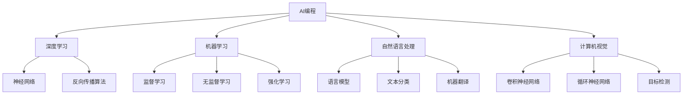

                 

# AI编程的新维度与新领域

> **关键词**：AI编程，深度学习，机器学习，自然语言处理，计算机视觉，开发工具，新领域

> **摘要**：本文将探讨AI编程的最新趋势和新兴领域，从核心概念到具体实现，全方位解析AI编程的深度学习、机器学习、自然语言处理、计算机视觉等方面的内容。通过实例分析，了解AI编程在实际应用场景中的表现，并提供相关工具和资源的推荐，帮助读者更好地掌握AI编程技能，迎接未来的技术挑战。

## 1. 背景介绍

### 1.1 目的和范围

本文旨在为AI编程领域的新手和专业人士提供一个全面而深入的概述。文章将涵盖AI编程的核心概念、算法原理、数学模型以及实际应用场景。通过本文的阅读，读者将能够：

- 了解AI编程的基本概念和核心技术
- 掌握深度学习、机器学习、自然语言处理、计算机视觉等AI编程领域的核心算法原理
- 学习如何使用数学模型和公式进行AI编程
- 通过实战案例理解AI编程在实际应用中的具体实现
- 掌握相关开发工具和资源，助力AI编程技能的提升

### 1.2 预期读者

本文适合以下读者群体：

- AI编程领域的新手，希望通过本文快速掌握AI编程的基本概念和核心算法
- AI编程领域的专业人士，希望深入了解AI编程的最新趋势和新兴领域
- 计算机科学、软件工程等相关专业的研究生和本科生
- 对AI编程感兴趣的技术爱好者，希望深入了解AI编程在实际应用中的表现

### 1.3 文档结构概述

本文将按照以下结构展开：

1. 背景介绍
   - 1.1 目的和范围
   - 1.2 预期读者
   - 1.3 文档结构概述
   - 1.4 术语表
2. 核心概念与联系
   - 2.1 AI编程的核心概念
   - 2.2 AI编程的技术架构
   - 2.3 AI编程的关键算法
3. 核心算法原理 & 具体操作步骤
   - 3.1 深度学习算法原理
   - 3.2 机器学习算法原理
   - 3.3 自然语言处理算法原理
   - 3.4 计算机视觉算法原理
4. 数学模型和公式 & 详细讲解 & 举例说明
   - 4.1 数学模型在AI编程中的应用
   - 4.2 数学公式详解
   - 4.3 举例说明
5. 项目实战：代码实际案例和详细解释说明
   - 5.1 开发环境搭建
   - 5.2 源代码详细实现和代码解读
   - 5.3 代码解读与分析
6. 实际应用场景
   - 6.1 AI编程在自然语言处理中的应用
   - 6.2 AI编程在计算机视觉中的应用
   - 6.3 AI编程在其他领域的应用
7. 工具和资源推荐
   - 7.1 学习资源推荐
   - 7.2 开发工具框架推荐
   - 7.3 相关论文著作推荐
8. 总结：未来发展趋势与挑战
9. 附录：常见问题与解答
10. 扩展阅读 & 参考资料

### 1.4 术语表

#### 1.4.1 核心术语定义

- **AI编程**：利用计算机程序实现人工智能算法的过程，包括深度学习、机器学习、自然语言处理、计算机视觉等。
- **深度学习**：一种机器学习的方法，通过多层神经网络对数据进行特征提取和模式识别。
- **机器学习**：一种人工智能的方法，通过训练数据集来学习模式和规律，从而实现预测和分类。
- **自然语言处理**：研究如何让计算机理解和处理人类语言的技术。
- **计算机视觉**：研究如何使计算机能够“看”和“理解”图像和视频的技术。

#### 1.4.2 相关概念解释

- **神经网络**：一种模仿生物神经系统的计算模型，通过多层神经元进行数据传递和计算。
- **反向传播算法**：一种用于训练神经网络的算法，通过计算输出误差来调整网络权重。
- **卷积神经网络（CNN）**：一种专门用于图像处理的神经网络模型，通过卷积运算提取图像特征。
- **循环神经网络（RNN）**：一种用于处理序列数据的神经网络模型，通过循环结构来保存历史信息。

#### 1.4.3 缩略词列表

- **AI**：人工智能
- **ML**：机器学习
- **DL**：深度学习
- **NLP**：自然语言处理
- **CV**：计算机视觉
- **CNN**：卷积神经网络
- **RNN**：循环神经网络
- **GPU**：图形处理器

## 2. 核心概念与联系

AI编程是一个高度复杂且不断发展的领域，涉及多个核心概念和技术的交叉融合。为了更好地理解AI编程，我们需要梳理其核心概念及其相互关系。下面将使用Mermaid流程图来展示AI编程的技术架构。



### 2.1 AI编程的核心概念

AI编程的核心概念包括深度学习、机器学习、自然语言处理和计算机视觉。这些概念各自具有独特的特点和应用场景，但它们之间存在紧密的联系。

- **深度学习（DL）**：深度学习是一种基于多层神经网络的机器学习技术，主要用于图像识别、语音识别和自然语言处理等领域。深度学习的核心思想是通过多层神经网络对数据进行特征提取和模式识别，从而实现自动学习和预测。
- **机器学习（ML）**：机器学习是一种人工智能技术，通过训练数据集来学习模式和规律，从而实现预测和分类。机器学习可以分为监督学习、无监督学习和强化学习三种类型，分别适用于不同的应用场景。
- **自然语言处理（NLP）**：自然语言处理是一种让计算机理解和处理人类语言的技术，包括语言模型、文本分类、机器翻译等应用。自然语言处理的关键在于如何将自然语言文本转化为计算机可以处理的形式。
- **计算机视觉（CV）**：计算机视觉是一种让计算机能够“看”和“理解”图像和视频的技术，包括图像识别、目标检测、图像分割等应用。计算机视觉的核心在于如何从图像中提取有用信息并进行分析。

### 2.2 AI编程的技术架构

AI编程的技术架构包括神经网络、反向传播算法、监督学习、无监督学习、强化学习、语言模型、文本分类、机器翻译、卷积神经网络（CNN）、循环神经网络（RNN）等核心组件。这些组件共同构成了AI编程的技术基础，并相互协作实现复杂的应用。

- **神经网络（NN）**：神经网络是一种计算模型，由多个神经元组成，用于模拟人脑的神经网络结构。神经网络通过多层结构对输入数据进行处理，实现特征提取和模式识别。
- **反向传播算法（BP）**：反向传播算法是一种用于训练神经网络的算法，通过计算输出误差来调整网络权重，从而优化网络性能。反向传播算法是深度学习的基础。
- **监督学习（SL）**：监督学习是一种机器学习技术，通过已知标签的数据集训练模型，从而实现预测和分类。监督学习广泛应用于图像识别、语音识别等应用场景。
- **无监督学习（UL）**：无监督学习是一种机器学习技术，通过未标记的数据集训练模型，从而发现数据中的潜在结构和规律。无监督学习常用于聚类、降维等应用场景。
- **强化学习（RL）**：强化学习是一种机器学习技术，通过智能体与环境交互，从而学习最优策略。强化学习广泛应用于游戏、自动驾驶等应用场景。
- **语言模型（LM）**：语言模型是一种用于预测文本序列的概率模型，通常使用神经网络实现。语言模型在自然语言处理领域有广泛的应用，如文本分类、机器翻译等。
- **文本分类（TC）**：文本分类是一种将文本数据分类到预定义类别中的任务。文本分类广泛应用于信息检索、情感分析等应用场景。
- **机器翻译（MT）**：机器翻译是一种将一种语言的文本翻译成另一种语言的技术。机器翻译在跨语言交流、全球化应用等领域有重要作用。
- **卷积神经网络（CNN）**：卷积神经网络是一种专门用于图像处理的神经网络模型，通过卷积运算提取图像特征。CNN在图像识别、目标检测等领域有广泛应用。
- **循环神经网络（RNN）**：循环神经网络是一种用于处理序列数据的神经网络模型，通过循环结构来保存历史信息。RNN在自然语言处理、语音识别等领域有广泛应用。

### 2.3 AI编程的关键算法

AI编程的关键算法包括深度学习、机器学习、自然语言处理、计算机视觉等领域的核心算法。以下是对这些算法的简要介绍。

- **深度学习算法**：深度学习算法是一种基于多层神经网络的机器学习技术，通过多层神经网络对数据进行特征提取和模式识别。深度学习算法在图像识别、语音识别、自然语言处理等领域有广泛应用。
- **机器学习算法**：机器学习算法是一种通过训练数据集学习模式和规律的人工智能技术，包括监督学习、无监督学习和强化学习三种类型。机器学习算法在图像识别、文本分类、推荐系统等领域有广泛应用。
- **自然语言处理算法**：自然语言处理算法是一种让计算机理解和处理人类语言的技术，包括语言模型、文本分类、机器翻译等。自然语言处理算法在信息检索、智能客服、语言翻译等领域有广泛应用。
- **计算机视觉算法**：计算机视觉算法是一种让计算机能够“看”和“理解”图像和视频的技术，包括图像识别、目标检测、图像分割等。计算机视觉算法在安防监控、自动驾驶、医疗诊断等领域有广泛应用。

通过以上对AI编程核心概念、技术架构和关键算法的介绍，我们可以看到AI编程是一个涉及多个领域和技术的复杂系统。理解和掌握这些核心概念和算法，将有助于我们更好地掌握AI编程技能，为未来的技术挑战做好准备。

## 3. 核心算法原理 & 具体操作步骤

在了解了AI编程的核心概念和联系之后，接下来我们将深入探讨AI编程中的核心算法原理，包括深度学习、机器学习、自然语言处理、计算机视觉等领域的算法。这些算法是AI编程的灵魂，理解其原理和具体操作步骤对于掌握AI编程至关重要。

### 3.1 深度学习算法原理

深度学习算法是一种基于多层神经网络的机器学习技术，通过多层神经网络对数据进行特征提取和模式识别。下面我们将介绍深度学习算法的基本原理和具体操作步骤。

#### 基本原理

深度学习算法的核心是神经网络，神经网络由多个神经元组成，每个神经元都是一个简单的计算单元，通过接收输入信号、进行加权求和、应用激活函数，最终输出结果。多层神经网络通过前向传播和反向传播两个步骤进行数据传递和计算。

1. **前向传播**：输入数据通过网络中的各个层进行传递，每个层对输入数据进行处理，并输出结果。这个过程称为前向传播。
2. **反向传播**：通过计算输出误差，将误差反向传递到网络的各个层，并调整网络权重，以优化网络性能。这个过程称为反向传播。

#### 具体操作步骤

以下是一个简单的深度学习算法的具体操作步骤：

1. **初始化参数**：初始化网络参数，包括输入层、隐藏层和输出层的权重和偏置。
2. **前向传播**：将输入数据输入到网络中，通过多层神经网络进行特征提取和模式识别，最终输出预测结果。
3. **计算误差**：将预测结果与实际标签进行比较，计算输出误差。
4. **反向传播**：将误差反向传递到网络的各个层，通过梯度下降等优化算法调整网络权重和偏置。
5. **更新参数**：根据反向传播的梯度，更新网络参数，以优化网络性能。
6. **重复步骤2-5**：重复前向传播和反向传播过程，直到网络性能达到预定的目标。

伪代码如下：

```python
initialize parameters
while not converged:
    forward_pass(x)
    compute_error(y)
    backward_pass(delta)
    update_parameters()
```

### 3.2 机器学习算法原理

机器学习算法是一种通过训练数据集学习模式和规律的人工智能技术，包括监督学习、无监督学习和强化学习三种类型。下面我们将分别介绍这三种类型的机器学习算法原理和具体操作步骤。

#### 监督学习算法原理

监督学习算法通过已知标签的数据集训练模型，从而实现预测和分类。监督学习算法的基本原理是通过学习输入特征和输出标签之间的关系，从而对未知数据进行预测。

1. **输入特征**：监督学习算法需要输入特征数据，特征数据可以是数值、文本、图像等多种形式。
2. **输出标签**：监督学习算法需要输出标签数据，标签数据是已知的，用于训练模型。
3. **训练模型**：通过训练数据集，监督学习算法学习输入特征和输出标签之间的关系，从而构建预测模型。

具体操作步骤如下：

1. **收集数据**：收集具有已知标签的训练数据集。
2. **预处理数据**：对数据进行清洗、归一化等预处理操作，以提高模型性能。
3. **选择模型**：根据问题类型选择合适的模型，如线性回归、决策树、支持向量机等。
4. **训练模型**：使用训练数据集训练模型，通过调整模型参数以优化性能。
5. **评估模型**：使用验证集或测试集评估模型性能，通过交叉验证等方法评估模型泛化能力。
6. **部署模型**：将训练好的模型部署到实际应用场景中，进行预测和分类。

伪代码如下：

```python
collect_data()
preprocess_data()
choose_model()
train_model()
evaluate_model()
deploy_model()
```

#### 无监督学习算法原理

无监督学习算法通过未标记的数据集训练模型，从而发现数据中的潜在结构和规律。无监督学习算法的基本原理是通过学习数据中的内在结构，从而对数据进行聚类或降维。

1. **输入数据**：无监督学习算法需要输入未标记的数据集。
2. **学习内在结构**：无监督学习算法通过学习数据中的潜在结构，从而对数据进行聚类或降维。
3. **输出结果**：无监督学习算法的输出结果可以是聚类结果、降维后的数据等。

具体操作步骤如下：

1. **收集数据**：收集未标记的数据集。
2. **预处理数据**：对数据进行清洗、归一化等预处理操作，以提高模型性能。
3. **选择模型**：根据问题类型选择合适的模型，如K均值聚类、主成分分析等。
4. **训练模型**：使用训练数据集训练模型，通过调整模型参数以优化性能。
5. **评估模型**：使用验证集或测试集评估模型性能，通过交叉验证等方法评估模型泛化能力。
6. **输出结果**：根据模型训练结果输出聚类结果、降维后的数据等。

伪代码如下：

```python
collect_data()
preprocess_data()
choose_model()
train_model()
evaluate_model()
output_results()
```

#### 强化学习算法原理

强化学习算法通过智能体与环境交互，从而学习最优策略。强化学习算法的基本原理是通过奖励机制引导智能体学习最优行为策略。

1. **智能体**：强化学习算法中的主体，通过决策和行动来与环境交互。
2. **环境**：智能体所处的环境，提供状态和奖励信息。
3. **策略**：智能体的行为决策，指导智能体如何行动。
4. **奖励**：环境对智能体行动的反馈，用于指导智能体学习最优策略。

具体操作步骤如下：

1. **初始化智能体和环境**：初始化智能体和环境，设置初始状态。
2. **执行行动**：智能体根据当前状态执行行动，与环境进行交互。
3. **接收奖励**：环境根据智能体的行动提供奖励，用于指导智能体学习。
4. **更新策略**：智能体根据接收到的奖励调整策略，以学习最优策略。
5. **重复执行行动**：智能体重复执行行动，与环境进行多次交互，逐步优化策略。

伪代码如下：

```python
initialize_agent与环境()
while not converged:
    execute_action()
    receive_reward()
    update_policy()
```

### 3.3 自然语言处理算法原理

自然语言处理（NLP）算法是一种让计算机理解和处理人类语言的技术，包括语言模型、文本分类、机器翻译等。下面我们将分别介绍这些NLP算法的原理和具体操作步骤。

#### 语言模型原理

语言模型是一种用于预测文本序列的概率模型，通常使用神经网络实现。语言模型的基本原理是通过学习大量文本数据，从而预测下一个单词或字符的概率。

1. **输入文本数据**：语言模型需要输入大量文本数据，用于训练模型。
2. **训练模型**：通过训练数据集，语言模型学习文本数据中的概率分布，从而预测下一个单词或字符的概率。
3. **输出概率**：语言模型根据输入文本序列，输出下一个单词或字符的概率分布。

具体操作步骤如下：

1. **收集文本数据**：收集大量文本数据，如新闻、小说、博客等。
2. **预处理文本数据**：对文本数据进行清洗、分词、去停用词等预处理操作。
3. **构建词汇表**：将预处理后的文本数据构建词汇表，将单词或字符映射到索引。
4. **训练语言模型**：使用预处理后的文本数据训练语言模型，通过调整模型参数以优化性能。
5. **评估语言模型**：使用验证集或测试集评估语言模型性能，通过交叉验证等方法评估模型泛化能力。
6. **应用语言模型**：将训练好的语言模型应用于实际场景，进行文本生成、文本分类等任务。

伪代码如下：

```python
collect_text_data()
preprocess_text_data()
build_vocab()
train_language_model()
evaluate_language_model()
apply_language_model()
```

#### 文本分类原理

文本分类是一种将文本数据分类到预定义类别中的任务，如情感分析、新闻分类等。文本分类的基本原理是通过学习文本特征和类别之间的关系，从而实现文本分类。

1. **输入文本数据**：文本分类算法需要输入大量文本数据，用于训练模型。
2. **特征提取**：将文本数据转换为特征向量，用于表示文本。
3. **训练模型**：通过训练数据集，文本分类算法学习文本特征和类别之间的关系，从而构建分类模型。
4. **分类预测**：使用训练好的分类模型对未知文本进行分类预测。

具体操作步骤如下：

1. **收集文本数据**：收集大量文本数据，如评论、新闻、博客等。
2. **预处理文本数据**：对文本数据进行清洗、分词、去停用词等预处理操作。
3. **特征提取**：使用词袋模型、TF-IDF、词嵌入等技术提取文本特征。
4. **训练分类模型**：使用预处理后的文本数据训练分类模型，通过调整模型参数以优化性能。
5. **评估分类模型**：使用验证集或测试集评估分类模型性能，通过交叉验证等方法评估模型泛化能力。
6. **分类预测**：将训练好的分类模型应用于实际场景，对未知文本进行分类预测。

伪代码如下：

```python
collect_text_data()
preprocess_text_data()
extract_features()
train_classification_model()
evaluate_classification_model()
classify_new_text()
```

#### 机器翻译原理

机器翻译是一种将一种语言的文本翻译成另一种语言的技术。机器翻译的基本原理是通过学习双语数据集，从而将源语言的文本转换为目标语言的文本。

1. **输入双语数据集**：机器翻译算法需要输入大量双语数据集，用于训练模型。
2. **训练编码器和解码器**：通过训练数据集，机器翻译算法学习编码器和解码器模型，从而将源语言文本转换为目标语言文本。
3. **翻译预测**：使用训练好的编码器和解码器对未知源语言文本进行翻译预测。

具体操作步骤如下：

1. **收集双语数据集**：收集大量双语数据集，如英语-中文、英语-法语等。
2. **预处理文本数据**：对文本数据进行清洗、分词、去停用词等预处理操作。
3. **训练编码器和解码器**：使用预处理后的文本数据训练编码器和解码器模型，通过调整模型参数以优化性能。
4. **评估翻译模型**：使用验证集或测试集评估翻译模型性能，通过交叉验证等方法评估模型泛化能力。
5. **翻译预测**：将训练好的编码器和解码器应用于实际场景，对未知源语言文本进行翻译预测。

伪代码如下：

```python
collect_bilingual_data()
preprocess_text_data()
train_encoder_decoder()
evaluate_translation_model()
translate_source_language()
```

### 3.4 计算机视觉算法原理

计算机视觉算法是一种让计算机能够“看”和“理解”图像和视频的技术，包括图像识别、目标检测、图像分割等。下面我们将分别介绍这些计算机视觉算法的原理和具体操作步骤。

#### 图像识别原理

图像识别是一种将图像分类到预定义类别中的任务，如人脸识别、物体识别等。图像识别的基本原理是通过学习图像特征和类别之间的关系，从而实现图像分类。

1. **输入图像数据**：图像识别算法需要输入大量图像数据，用于训练模型。
2. **特征提取**：将图像数据转换为特征向量，用于表示图像。
3. **训练模型**：通过训练数据集，图像识别算法学习图像特征和类别之间的关系，从而构建分类模型。
4. **分类预测**：使用训练好的分类模型对未知图像进行分类预测。

具体操作步骤如下：

1. **收集图像数据**：收集大量图像数据，如人脸、物体等。
2. **预处理图像数据**：对图像数据进行清洗、归一化等预处理操作。
3. **特征提取**：使用卷积神经网络、特征提取器等技术提取图像特征。
4. **训练分类模型**：使用预处理后的图像数据训练分类模型，通过调整模型参数以优化性能。
5. **评估分类模型**：使用验证集或测试集评估分类模型性能，通过交叉验证等方法评估模型泛化能力。
6. **分类预测**：将训练好的分类模型应用于实际场景，对未知图像进行分类预测。

伪代码如下：

```python
collect_image_data()
preprocess_image_data()
extract_image_features()
train_classification_model()
evaluate_classification_model()
classify_new_image()
```

#### 目标检测原理

目标检测是一种在图像中检测和定位特定目标的方法，如行人检测、车辆检测等。目标检测的基本原理是通过学习图像特征和目标位置之间的关系，从而实现目标检测。

1. **输入图像数据**：目标检测算法需要输入大量图像数据，用于训练模型。
2. **特征提取**：将图像数据转换为特征向量，用于表示图像。
3. **训练模型**：通过训练数据集，目标检测算法学习图像特征和目标位置之间的关系，从而构建目标检测模型。
4. **目标检测**：使用训练好的目标检测模型对未知图像进行目标检测。

具体操作步骤如下：

1. **收集图像数据**：收集大量图像数据，如行人、车辆等。
2. **预处理图像数据**：对图像数据进行清洗、归一化等预处理操作。
3. **特征提取**：使用卷积神经网络、特征提取器等技术提取图像特征。
4. **训练目标检测模型**：使用预处理后的图像数据训练目标检测模型，通过调整模型参数以优化性能。
5. **评估目标检测模型**：使用验证集或测试集评估目标检测模型性能，通过交叉验证等方法评估模型泛化能力。
6. **目标检测**：将训练好的目标检测模型应用于实际场景，对未知图像进行目标检测。

伪代码如下：

```python
collect_image_data()
preprocess_image_data()
extract_image_features()
train_detection_model()
evaluate_detection_model()
detect_new_image()
```

#### 图像分割原理

图像分割是一种将图像分割成不同区域的任务，如人脸分割、车辆分割等。图像分割的基本原理是通过学习图像特征和区域之间的关系，从而实现图像分割。

1. **输入图像数据**：图像分割算法需要输入大量图像数据，用于训练模型。
2. **特征提取**：将图像数据转换为特征向量，用于表示图像。
3. **训练模型**：通过训练数据集，图像分割算法学习图像特征和区域之间的关系，从而构建分割模型。
4. **图像分割**：使用训练好的分割模型对未知图像进行分割。

具体操作步骤如下：

1. **收集图像数据**：收集大量图像数据，如人脸、车辆等。
2. **预处理图像数据**：对图像数据进行清洗、归一化等预处理操作。
3. **特征提取**：使用卷积神经网络、特征提取器等技术提取图像特征。
4. **训练分割模型**：使用预处理后的图像数据训练分割模型，通过调整模型参数以优化性能。
5. **评估分割模型**：使用验证集或测试集评估分割模型性能，通过交叉验证等方法评估模型泛化能力。
6. **图像分割**：将训练好的分割模型应用于实际场景，对未知图像进行分割。

伪代码如下：

```python
collect_image_data()
preprocess_image_data()
extract_image_features()
train_segmentation_model()
evaluate_segmentation_model()
segment_new_image()
```

通过以上对深度学习、机器学习、自然语言处理、计算机视觉等核心算法原理和具体操作步骤的介绍，我们可以看到AI编程是一个涉及多个领域和技术的复杂系统。理解和掌握这些核心算法原理和操作步骤，将有助于我们更好地掌握AI编程技能，为未来的技术挑战做好准备。

## 4. 数学模型和公式 & 详细讲解 & 举例说明

在AI编程中，数学模型和公式是核心组成部分，它们为算法的实现提供了理论基础和计算方法。在本节中，我们将详细讲解数学模型和公式在AI编程中的应用，并通过具体示例来说明它们的使用。

### 4.1 数学模型在AI编程中的应用

数学模型在AI编程中的应用非常广泛，主要包括以下几类：

- **概率模型**：用于描述不确定性和随机性，如贝叶斯网络、马尔可夫模型等。
- **优化模型**：用于求解最优化问题，如线性规划、支持向量机等。
- **神经网络模型**：用于描述神经网络结构和计算过程，如反向传播算法等。
- **深度学习模型**：用于描述深度学习算法，如卷积神经网络（CNN）、循环神经网络（RNN）等。

#### 4.1.1 概率模型

概率模型在AI编程中广泛应用于不确定性分析和决策。以下是一些常用的概率模型：

- **贝叶斯网络**：一种基于概率的图形模型，用于表示变量之间的依赖关系。
- **马尔可夫模型**：一种基于状态转移概率的模型，用于描述系统状态的演变。

#### 4.1.2 优化模型

优化模型在AI编程中用于求解最优化问题，如分类、回归等。以下是一些常用的优化模型：

- **线性规划**：用于求解线性目标函数在给定线性约束条件下的最优解。
- **支持向量机（SVM）**：用于分类和回归问题，通过求解最优化问题找到最优分类边界。

#### 4.1.3 神经网络模型

神经网络模型是AI编程的核心组成部分，用于描述神经网络的结构和计算过程。以下是一些常用的神经网络模型：

- **多层感知机（MLP）**：一种前馈神经网络，用于分类和回归问题。
- **卷积神经网络（CNN）**：一种专门用于图像处理的神经网络模型，通过卷积运算提取图像特征。
- **循环神经网络（RNN）**：一种用于处理序列数据的神经网络模型，通过循环结构来保存历史信息。

#### 4.1.4 深度学习模型

深度学习模型是近年来AI编程的重要发展，包括以下几种：

- **深度信念网络（DBN）**：一种多层神经网络模型，通过逐层训练构建深度网络。
- **生成对抗网络（GAN）**：一种通过生成器和判别器相互对抗训练的模型，用于生成高质量数据。

### 4.2 数学公式详解

在AI编程中，常用的数学公式包括概率分布、梯度下降、损失函数等。以下是对这些公式的详细讲解：

#### 4.2.1 概率分布

概率分布用于描述随机变量的概率分布情况，常见的概率分布有：

- **正态分布（高斯分布）**：
  $$ p(x|\mu,\sigma^2) = \frac{1}{\sqrt{2\pi\sigma^2}}e^{-\frac{(x-\mu)^2}{2\sigma^2}} $$

- **伯努利分布**：
  $$ p(y|\pi) = \pi^y(1-\pi)^{1-y} $$

其中，$\mu$ 和 $\sigma^2$ 分别为均值和方差，$\pi$ 为成功概率，$y$ 为伯努利随机变量。

#### 4.2.2 梯度下降

梯度下降是一种用于优化神经网络模型的方法，其基本思想是通过计算损失函数关于模型参数的梯度，来更新模型参数，从而减小损失函数值。

- **一维梯度下降**：
  $$ \theta = \theta - \alpha \cdot \frac{d}{d\theta}J(\theta) $$

其中，$\theta$ 为模型参数，$\alpha$ 为学习率，$J(\theta)$ 为损失函数。

- **多维梯度下降**：
  $$ \theta = \theta - \alpha \cdot \nabla_{\theta}J(\theta) $$

其中，$\nabla_{\theta}J(\theta)$ 为损失函数关于模型参数的梯度。

#### 4.2.3 损失函数

损失函数是评价模型预测结果好坏的指标，常用的损失函数有：

- **均方误差（MSE）**：
  $$ J(\theta) = \frac{1}{2m}\sum_{i=1}^{m}(h_\theta(x^{(i)}) - y^{(i)})^2 $$

其中，$m$ 为样本数量，$h_\theta(x^{(i)})$ 为模型预测结果，$y^{(i)}$ 为实际标签。

- **交叉熵损失**：
  $$ J(\theta) = -\frac{1}{m}\sum_{i=1}^{m}y^{(i)}\log(h_\theta(x^{(i)})) + (1 - y^{(i)})\log(1 - h_\theta(x^{(i)})) $$

其中，$y^{(i)}$ 为实际标签，$h_\theta(x^{(i)})$ 为模型预测概率。

### 4.3 举例说明

为了更好地理解数学模型和公式的应用，我们通过以下具体示例进行说明。

#### 4.3.1 朴素贝叶斯分类器

朴素贝叶斯分类器是一种基于概率论的分类算法，以下是一个简单的例子：

假设我们有以下数据集：

| 特征1 | 特征2 | 标签 |
|-------|-------|------|
| 0     | 0     | 正类 |
| 1     | 0     | 负类 |
| 0     | 1     | 正类 |
| 1     | 1     | 负类 |

首先，计算每个特征的先验概率：

- 特征1的先验概率：
  $$ p(\text{特征1}) = \frac{2}{4} = 0.5 $$

- 特征2的先验概率：
  $$ p(\text{特征2}) = \frac{2}{4} = 0.5 $$

然后，计算每个类别的后验概率：

- 正类的后验概率：
  $$ p(\text{正类}|\text{特征1}, \text{特征2}) = \frac{p(\text{特征1}|\text{正类})p(\text{特征2}|\text{正类})p(\text{正类})}{p(\text{特征1})p(\text{特征2})} = \frac{1/2 \cdot 1/2 \cdot 1/2}{0.5 \cdot 0.5} = 0.5 $$

- 负类的后验概率：
  $$ p(\text{负类}|\text{特征1}, \text{特征2}) = \frac{p(\text{特征1}|\text{负类})p(\text{特征2}|\text{负类})p(\text{负类})}{p(\text{特征1})p(\text{特征2})} = \frac{1/2 \cdot 1/2 \cdot 1/2}{0.5 \cdot 0.5} = 0.5 $$

最后，选择后验概率最大的类别作为分类结果。在这个例子中，无论特征1和特征2的值如何，后验概率都是相等的，因此无法进行有效分类。

#### 4.3.2 线性回归

线性回归是一种常见的回归算法，用于预测连续值。以下是一个简单的线性回归示例：

假设我们有以下数据集：

| 特征 | 标签 |
|------|------|
| 1    | 2    |
| 2    | 4    |
| 3    | 6    |

首先，计算特征和标签的均值：

- 特征均值：
  $$ \bar{x} = \frac{1+2+3}{3} = 2 $$

- 标签均值：
  $$ \bar{y} = \frac{2+4+6}{3} = 4 $$

然后，计算特征和标签的协方差：

- 协方差：
  $$ \text{cov}(x,y) = \frac{(1-2)(2-4) + (2-2)(4-4) + (3-2)(6-4)}{3-1} = 2 $$

接下来，计算特征的方差：

- 方差：
  $$ \text{var}(x) = \frac{(1-2)^2 + (2-2)^2 + (3-2)^2}{3-1} = 1 $$

最后，计算回归直线的斜率和截距：

- 斜率：
  $$ \beta_1 = \frac{\text{cov}(x,y)}{\text{var}(x)} = 2 $$

- 截距：
  $$ \beta_0 = \bar{y} - \beta_1\bar{x} = 4 - 2 \cdot 2 = 0 $$

因此，线性回归模型可以表示为：

$$ y = \beta_0 + \beta_1x = 0 + 2x = 2x $$

使用这个模型，我们可以预测新的特征值对应的标签值，例如当 $x=4$ 时，预测的标签值为 $y=2 \cdot 4 = 8$。

#### 4.3.3 卷积神经网络

卷积神经网络（CNN）是一种专门用于图像处理的神经网络模型，以下是一个简单的CNN示例：

假设我们有一个图像数据集，每个图像大小为 $28 \times 28$ 像素，我们需要训练一个CNN模型进行图像分类。

首先，设计CNN模型的结构，包括以下层：

- **输入层**：接收 $28 \times 28$ 像素的图像。
- **卷积层**：使用 $3 \times 3$ 卷积核进行卷积运算，提取图像特征。
- **池化层**：使用 $2 \times 2$ 步长进行最大池化，减小特征图的尺寸。
- **全连接层**：将池化层输出的特征图 Flatten 成一维向量，然后连接到全连接层进行分类。

假设我们使用以下CNN模型：

$$
\begin{array}{ccccccccccc}
\text{Input} & \xleftarrow{\text{Conv}} & \text{Feature Map} & \xleftarrow{\text{Pool}} & \text{Feature Map} & \xleftarrow{\text{Conv}} & \text{Feature Map} & \xleftarrow{\text{Pool}} & \text{Feature Map} & \xleftarrow{\text{Flatten}} & \text{Output} \\
28 \times 28 & \downarrow{3 \times 3} & 28 \times 28 & \downarrow{2 \times 2} & 14 \times 14 & \downarrow{3 \times 3} & 14 \times 14 & \downarrow{2 \times 2} & 7 \times 7 & \downarrow{\text{Flatten}} & 10 \\
\end{array}
$$

接下来，训练CNN模型，通过反向传播算法调整模型参数，使得模型在训练数据上的预测结果与实际标签尽量一致。

通过以上示例，我们可以看到数学模型和公式在AI编程中的广泛应用和重要作用。掌握这些数学模型和公式，将有助于我们更好地理解和应用AI编程技术。

## 5. 项目实战：代码实际案例和详细解释说明

在了解了AI编程的核心算法原理和数学模型之后，接下来我们将通过一个实际的项目实战，展示如何将理论应用到实践中。本文将详细介绍一个基于深度学习的图像分类项目，包括开发环境搭建、源代码实现和代码解读与分析。

### 5.1 开发环境搭建

在进行图像分类项目之前，我们需要搭建一个合适的开发环境。以下是一个基于Python和TensorFlow的图像分类项目环境搭建步骤：

1. **安装Python**：确保Python版本为3.6及以上，推荐使用Python 3.8或更高版本。
2. **安装TensorFlow**：使用pip命令安装TensorFlow：
   ```bash
   pip install tensorflow
   ```
3. **安装其他依赖库**：根据项目需求，安装其他依赖库，如NumPy、Pandas、Matplotlib等：
   ```bash
   pip install numpy pandas matplotlib
   ```
4. **安装CUDA**：如果使用GPU进行训练，需要安装CUDA。CUDA是NVIDIA开发的并行计算平台和编程模型，用于优化深度学习模型的训练速度。
5. **配置CUDA环境**：在终端执行以下命令配置CUDA环境：
   ```bash
   nvcc --version
   ```
   确保CUDA版本与TensorFlow兼容。

完成以上步骤后，开发环境搭建完成，可以开始进行图像分类项目的实际开发。

### 5.2 源代码详细实现和代码解读

下面是一个简单的图像分类项目源代码，用于对CIFAR-10数据集进行分类。CIFAR-10是一个常用的图像分类数据集，包含60000张32x32彩色图像，分为10个类别。

```python
import tensorflow as tf
from tensorflow.keras import layers, models
from tensorflow.keras.datasets import cifar10
from tensorflow.keras.utils import to_categorical

# 加载数据集
(train_images, train_labels), (test_images, test_labels) = cifar10.load_data()

# 预处理数据
train_images = train_images / 255.0
test_images = test_images / 255.0
train_labels = to_categorical(train_labels)
test_labels = to_categorical(test_labels)

# 构建模型
model = models.Sequential()
model.add(layers.Conv2D(32, (3, 3), activation='relu', input_shape=(32, 32, 3)))
model.add(layers.MaxPooling2D((2, 2)))
model.add(layers.Conv2D(64, (3, 3), activation='relu'))
model.add(layers.MaxPooling2D((2, 2)))
model.add(layers.Conv2D(64, (3, 3), activation='relu'))
model.add(layers.Flatten())
model.add(layers.Dense(64, activation='relu'))
model.add(layers.Dense(10, activation='softmax'))

# 编译模型
model.compile(optimizer='adam',
              loss='categorical_crossentropy',
              metrics=['accuracy'])

# 训练模型
model.fit(train_images, train_labels, epochs=10, batch_size=64)

# 评估模型
test_loss, test_acc = model.evaluate(test_images, test_labels)
print(f"Test accuracy: {test_acc:.3f}")

# 预测图像
predictions = model.predict(test_images[:10])
predicted_labels = [np.argmax(prediction) for prediction in predictions]
print(predicted_labels)
```

#### 代码解读与分析

1. **数据加载与预处理**：首先，使用TensorFlow的`cifar10.load_data()`函数加载数据集，并将图像数据归一化到0-1之间。然后，使用`to_categorical()`函数将标签数据转换为one-hot编码格式。

2. **模型构建**：使用`models.Sequential()`函数构建一个序列模型，依次添加卷积层、池化层、全连接层等。具体配置如下：

   - **卷积层**：第一个卷积层使用32个3x3卷积核，激活函数为ReLU。第二个卷积层使用64个3x3卷积核。
   - **池化层**：两个最大池化层，池化窗口大小为2x2。
   - **全连接层**：最后一个卷积层后接一个Flatten层将特征图展开为一维向量，然后添加两个全连接层，输出层使用10个神经元和softmax激活函数，用于分类。

3. **模型编译**：使用`model.compile()`函数编译模型，指定优化器、损失函数和评价指标。在这里，我们使用`adam`优化器和`categorical_crossentropy`损失函数。

4. **模型训练**：使用`model.fit()`函数训练模型，指定训练数据、标签、训练轮次和批量大小。在这里，我们训练10个轮次，批量大小为64。

5. **模型评估**：使用`model.evaluate()`函数评估模型在测试数据上的性能，输出测试损失和测试准确率。

6. **预测图像**：使用`model.predict()`函数对测试数据的前10张图像进行预测，输出预测结果。使用`np.argmax()`函数获取每个图像的预测类别。

通过以上代码，我们可以实现一个简单的图像分类项目，并使用CIFAR-10数据集进行测试。实际项目中，可以根据需求调整模型结构和训练参数，以提高分类性能。

### 5.3 代码解读与分析

在了解了图像分类项目的实现过程后，接下来我们将对代码进行详细解读与分析，以帮助读者更好地理解图像分类的原理和实现过程。

1. **数据加载与预处理**：

   - `cifar10.load_data()`：使用TensorFlow内置的CIFAR-10数据集加载器加载数据集。CIFAR-10数据集包含60000张32x32彩色图像，分为10个类别。
   - `train_images / 255.0`：将训练图像数据归一化到0-1之间，以加快模型训练速度并提高准确率。
   - `to_categorical(train_labels)`：将训练标签数据转换为one-hot编码格式，以便使用softmax激活函数进行分类。

2. **模型构建**：

   - `model = models.Sequential()`：创建一个序列模型，用于构建深度学习模型。
   - `model.add(layers.Conv2D(32, (3, 3), activation='relu', input_shape=(32, 32, 3)))`：添加第一个卷积层，使用32个3x3卷积核，激活函数为ReLU。`input_shape=(32, 32, 3)`指定输入图像的尺寸和通道数。
   - `model.add(layers.MaxPooling2D((2, 2)))`：添加第一个池化层，使用2x2窗口进行最大池化。
   - `model.add(layers.Conv2D(64, (3, 3), activation='relu))`：添加第二个卷积层，使用64个3x3卷积核，激活函数为ReLU。
   - `model.add(layers.MaxPooling2D((2, 2)))`：添加第二个池化层，使用2x2窗口进行最大池化。
   - `model.add(layers.Conv2D(64, (3, 3), activation='relu'))`：添加第三个卷积层，使用64个3x3卷积核，激活函数为ReLU。
   - `model.add(layers.Flatten())`：添加Flatten层，将特征图展开为一维向量。
   - `model.add(layers.Dense(64, activation='relu'))`：添加第一个全连接层，使用64个神经元，激活函数为ReLU。
   - `model.add(layers.Dense(10, activation='softmax'))`：添加输出层，使用10个神经元和softmax激活函数，用于分类。

3. **模型编译**：

   - `model.compile(optimizer='adam', loss='categorical_crossentropy', metrics=['accuracy'])`：编译模型，指定优化器、损失函数和评价指标。在这里，我们使用`adam`优化器和`categorical_crossentropy`损失函数，评价指标为准确率。

4. **模型训练**：

   - `model.fit(train_images, train_labels, epochs=10, batch_size=64)`：训练模型，指定训练数据、标签、训练轮次和批量大小。在这里，我们训练10个轮次，批量大小为64。

5. **模型评估**：

   - `model.evaluate(test_images, test_labels)`：评估模型在测试数据上的性能，输出测试损失和测试准确率。

6. **预测图像**：

   - `model.predict(test_images[:10])`：使用模型对测试数据的前10张图像进行预测。
   - `[np.argmax(prediction) for prediction in predictions]`：获取每个图像的预测类别。

通过以上解读，我们可以看到图像分类项目的实现过程涉及数据预处理、模型构建、模型编译、模型训练和模型评估等步骤。理解这些步骤有助于我们更好地掌握图像分类的原理和实践。

### 5.4 代码优化与改进

在实际应用中，为了提高图像分类模型的性能，我们可以对代码进行优化和改进。以下是一些常见的优化方法：

1. **数据增强**：通过旋转、翻转、缩放、裁剪等数据增强方法，增加数据多样性，从而提高模型泛化能力。
2. **调整模型结构**：根据数据集的特点和任务需求，调整模型结构，如增加卷积层、池化层、全连接层等，以提高模型复杂度和表达能力。
3. **使用预训练模型**：利用预训练的模型进行迁移学习，对特定任务进行微调，从而提高模型性能。
4. **正则化**：使用正则化方法，如L1正则化、L2正则化、Dropout等，减少模型过拟合现象。
5. **优化训练过程**：调整学习率、批量大小、训练轮次等参数，优化模型训练过程，以提高模型性能。

通过以上优化方法，我们可以进一步提高图像分类模型的性能，为实际应用提供更好的支持。

通过以上项目实战，我们详细介绍了如何搭建开发环境、实现图像分类模型、解读与分析代码，并探讨了代码优化与改进的方法。通过实践，读者可以更好地理解图像分类的原理和实现过程，为未来更复杂的AI项目做好准备。

## 6. 实际应用场景

AI编程在当今的科技领域中发挥着越来越重要的作用，其应用场景广泛且不断拓展。以下将介绍AI编程在不同领域的实际应用，并探讨这些应用带来的挑战和机遇。

### 6.1 AI编程在自然语言处理中的应用

自然语言处理（NLP）是AI编程的重要领域之一，主要研究如何让计算机理解和处理人类语言。以下是AI编程在NLP中的几个实际应用场景：

- **智能客服**：通过AI编程实现的聊天机器人，能够理解和回答用户的问题，提供快速、高效的服务。例如，银行、航空公司和电商平台等使用智能客服系统，提高客户满意度和服务效率。
- **情感分析**：AI编程通过分析用户评论、社交媒体帖子等文本数据，识别情感倾向，帮助企业和品牌了解用户反馈，优化产品和服务。
- **机器翻译**：AI编程实现的机器翻译技术，使得跨语言交流变得更加便捷。例如，谷歌翻译、百度翻译等平台，通过深度学习算法实现高质量翻译。

### 6.2 AI编程在计算机视觉中的应用

计算机视觉（CV）是AI编程的另一个重要领域，旨在使计算机能够“看”和“理解”图像和视频。以下是AI编程在CV中的几个实际应用场景：

- **人脸识别**：AI编程实现的人脸识别技术，广泛应用于安防监控、身份验证、人脸支付等场景。例如，微信人脸支付、人脸门禁系统等。
- **自动驾驶**：自动驾驶汽车依赖AI编程实现的计算机视觉技术，通过摄像头和传感器获取道路信息，实现车辆自动驾驶。例如，特斯拉、百度等公司的自动驾驶技术。
- **图像识别**：AI编程实现的图像识别技术，广泛应用于医疗诊断、工业检测、安全监控等领域。例如，医学影像分析系统、工业检测系统等。

### 6.3 AI编程在其他领域的应用

除了自然语言处理和计算机视觉，AI编程还在许多其他领域有着广泛的应用：

- **金融科技**：AI编程在金融领域中，用于风险控制、量化交易、信用评估等方面。例如，机器学习算法用于风险评估和信用评分，提高金融机构的运营效率。
- **医疗保健**：AI编程在医疗领域，用于疾病诊断、药物研发、健康管理等。例如，通过深度学习算法分析医学影像，辅助医生进行疾病诊断。
- **教育科技**：AI编程在教育领域中，用于智能推荐系统、在线教育平台、学习分析等。例如，智能推荐系统根据学生的学习习惯和成绩，提供个性化的学习资源。

### 6.4 挑战与机遇

AI编程在实际应用过程中，面临着一系列挑战和机遇：

- **数据隐私和安全**：AI编程在处理大量数据时，需要关注数据隐私和安全问题。如何在保护用户隐私的前提下，充分利用数据价值，是一个亟待解决的问题。
- **算法公平性和透明性**：AI编程实现的算法可能存在性别、种族等偏见，导致不公平现象。如何提高算法的公平性和透明性，减少偏见，是当前的重要研究方向。
- **计算资源需求**：AI编程需要大量的计算资源和时间进行训练和推理。随着模型复杂度的增加，计算资源的需求也在不断增加，这对硬件设施提出了更高的要求。
- **技术创新和人才缺口**：AI编程领域不断涌现新的技术和应用，对人才需求不断增加。然而，当前的技术人才供给无法满足市场需求，导致人才缺口问题。

尽管面临诸多挑战，AI编程带来的机遇同样不容忽视。通过不断创新和优化，AI编程有望在更多领域发挥重要作用，推动社会进步和经济发展。

## 7. 工具和资源推荐

在AI编程领域，掌握高效的开发工具和资源对于提升编程技能和项目成功率至关重要。以下将推荐一些常用的学习资源、开发工具和框架，以帮助读者更好地进行AI编程实践。

### 7.1 学习资源推荐

#### 7.1.1 书籍推荐

- 《深度学习》（Deep Learning），作者：Ian Goodfellow、Yoshua Bengio、Aaron Courville
  - 内容详实，适合初学者和专业人士，系统介绍了深度学习的基础理论和实践方法。
- 《Python机器学习》（Python Machine Learning），作者： Sebastian Raschka、Vahid Mirhoseini
  - 从基础知识到实际应用，全面讲解了机器学习在Python中的实现方法。
- 《自然语言处理实战》（Natural Language Processing with Python），作者： Steven Bird、Ewan Klein、Edward Loper
  - 以Python为工具，详细介绍自然语言处理的理论和实践，适合NLP入门者。

#### 7.1.2 在线课程

- **Coursera**：提供众多高质量AI编程课程，包括《深度学习》、《机器学习》等。
- **Udacity**：提供实践导向的课程，如《深度学习工程师纳米学位》、《自然语言处理工程师纳米学位》等。
- **edX**：提供由全球知名大学开设的课程，如《人工智能导论》、《计算机视觉》等。

#### 7.1.3 技术博客和网站

- **Medium**：许多技术专家和公司在此发布技术博客，涵盖深度学习、机器学习、NLP等主题。
- **Towards Data Science**：一个专注于数据科学和机器学习的博客，提供丰富的实践案例和教程。
- **AI News**：专注于AI领域的新闻和研究成果，及时更新最新的技术动态。

### 7.2 开发工具框架推荐

#### 7.2.1 IDE和编辑器

- **PyCharm**：强大的Python IDE，支持多种编程语言和框架，适用于AI编程项目。
- **Jupyter Notebook**：适用于数据科学和AI编程的交互式开发环境，支持Python、R等多种语言。
- **VSCode**：轻量级但功能强大的代码编辑器，支持多种编程语言和插件，适用于AI编程。

#### 7.2.2 调试和性能分析工具

- **TensorBoard**：TensorFlow的图形化性能分析工具，用于监控和调试深度学习模型的训练过程。
- **Anaconda**：一个集成的数据科学和机器学习环境，包括Python、R、Jupyter Notebook等工具。
- **Docker**：用于创建和运行容器化应用的工具，有助于管理和部署AI编程项目。

#### 7.2.3 相关框架和库

- **TensorFlow**：由Google开发的开源深度学习框架，适用于各种AI编程任务。
- **PyTorch**：由Facebook开发的开源深度学习框架，以其动态计算图和灵活的API广受欢迎。
- **Keras**：一个高层神经网络API，支持TensorFlow和Theano，用于快速构建和训练深度学习模型。
- **Scikit-learn**：一个开源机器学习库，提供多种监督学习和无监督学习算法的实现。

#### 7.2.4 数据集和资源

- **Kaggle**：一个数据科学竞赛平台，提供丰富的数据集和比赛项目，有助于实战练习。
- **Udacity Data Sets**：提供多个领域的数据集，用于学习和实践数据分析和机器学习。
- **UCI Machine Learning Repository**：一个包含多种数据集的机器学习数据库，广泛用于学术研究和实践。

通过以上工具和资源的推荐，读者可以更好地进行AI编程学习与实践，提升编程技能，迎接未来的技术挑战。

## 8. 总结：未来发展趋势与挑战

AI编程作为一个高度复杂且快速发展的领域，其未来发展趋势和面临的挑战同样引人关注。在本文的总结部分，我们将概述AI编程的潜在发展方向，并探讨其中可能遇到的关键挑战。

### 8.1 未来发展趋势

1. **更强大的模型和算法**：随着计算能力的提升和算法研究的深入，AI编程将不断涌现出更强大、更高效的模型和算法。例如，更加复杂的神经网络结构、新的优化算法以及高效的训练策略，都将推动AI编程的发展。
2. **跨学科融合**：AI编程将与其他学科如生物学、心理学、语言学等进一步融合，产生新的交叉领域。例如，通过生物学启发的新算法、基于心理学的用户交互设计、结合语言学的自然语言理解，都将为AI编程带来新的突破。
3. **边缘计算与云计算的结合**：AI编程将在边缘计算和云计算之间实现更紧密的整合，使AI模型能够在更广泛的场景中高效运行。例如，智能摄像头、智能音箱等设备将借助边缘计算实现实时处理，而复杂的模型训练则可在云端进行。
4. **开源生态的繁荣**：开源项目将继续在AI编程中扮演重要角色。新的开源框架、工具和库将不断涌现，推动技术的快速发展和普及。同时，开源社区的合作也将有助于解决AI编程中的关键问题，提升整体技术水平。

### 8.2 面临的挑战

1. **数据隐私和安全**：随着AI编程在各个领域的广泛应用，数据隐私和安全问题愈发突出。如何确保数据在使用过程中的隐私保护和安全，是一个重要的挑战。需要开发更加安全的数据处理和存储方案，同时加强法律法规的监管。
2. **算法公平性和透明性**：AI编程中的算法可能存在性别、种族等偏见，导致不公平现象。如何提高算法的公平性和透明性，减少偏见，是当前研究的重要方向。需要从算法设计、数据收集、模型训练等环节入手，确保算法的公正性和透明性。
3. **计算资源需求**：随着模型复杂度的增加，AI编程对计算资源的需求也在不断增加。如何高效利用计算资源，优化模型训练和推理过程，是AI编程领域的一个重要挑战。需要开发更高效的算法和优化技术，以及更强大的硬件设施。
4. **人才缺口**：AI编程领域的快速发展和应用需求的增加，导致人才缺口问题日益严重。如何培养和吸引更多优秀的AI编程人才，提升整体技术水平，是当前的一个重要挑战。需要加强教育体系改革，培养更多具备实践能力和创新精神的人才。

通过以上总结，我们可以看到，AI编程在未来具有广阔的发展前景，同时也面临着诸多挑战。只有不断推进技术创新、加强跨学科融合、提升算法水平、保障数据隐私和安全，才能推动AI编程的可持续发展，为社会带来更多价值。

## 9. 附录：常见问题与解答

在AI编程的学习和实践过程中，读者可能会遇到一些常见问题。以下是对一些常见问题的解答，以帮助读者更好地理解和应用AI编程技术。

### 9.1 深度学习相关问题

**Q1：深度学习中的神经网络是如何工作的？**

A1：神经网络是一种由多个神经元组成的计算模型，通过多层结构对输入数据进行特征提取和模式识别。每个神经元（也称为节点）都是一个简单的计算单元，通过接收输入信号、进行加权求和、应用激活函数，最终输出结果。多层神经网络通过前向传播和反向传播两个步骤进行数据传递和计算。

**Q2：什么是梯度消失和梯度爆炸？如何解决？**

A2：梯度消失和梯度爆炸是深度学习训练过程中可能遇到的问题。梯度消失是指梯度值过小，导致模型参数难以更新；梯度爆炸则是指梯度值过大，导致模型参数更新过于剧烈。这些问题通常与激活函数的设计和网络结构有关。解决方法包括使用更好的初始化策略、使用合适的激活函数、调整学习率等。

### 9.2 机器学习相关问题

**Q1：机器学习中的监督学习、无监督学习和强化学习有什么区别？**

A1：监督学习、无监督学习和强化学习是机器学习中的三种主要学习方法。

- **监督学习**：通过已标记的数据集进行训练，模型从输入特征和输出标签中学习模式和规律。
- **无监督学习**：通过未标记的数据集进行训练，模型发现数据中的潜在结构和规律，如聚类、降维等。
- **强化学习**：通过智能体与环境交互进行训练，智能体从奖励信号中学习最优策略。

**Q2：什么是过拟合？如何解决？**

A2：过拟合是指模型在训练数据上表现良好，但在新的数据上表现较差，即模型对训练数据过度拟合。解决过拟合的方法包括增加数据多样性、使用正则化技术、减少模型复杂度等。

### 9.3 自然语言处理相关问题

**Q1：自然语言处理中的语言模型是如何工作的？**

A1：语言模型是一种用于预测文本序列概率的模型，通过学习大量文本数据中的概率分布，从而预测下一个单词或字符的概率。语言模型广泛应用于文本生成、文本分类、机器翻译等任务。

**Q2：什么是词嵌入？有哪些常见的词嵌入方法？**

A1：词嵌入是一种将单词或短语映射到高维向量空间的方法，以便在计算机中进行处理。常见的词嵌入方法包括Word2Vec、GloVe、FastText等。这些方法通过学习文本数据中的语义关系，将单词映射到具有相似语义的向量。

### 9.4 计算机视觉相关问题

**Q1：什么是卷积神经网络（CNN）？它为什么适用于图像处理？**

A1：卷积神经网络（CNN）是一种专门用于图像处理的神经网络模型，通过卷积运算提取图像特征。CNN在图像处理中表现出色，因为卷积运算能够自动学习图像中的局部特征，如边缘、角点等，从而实现图像分类、目标检测、图像分割等任务。

**Q2：什么是迁移学习？如何进行迁移学习？**

A1：迁移学习是一种利用已经在大规模数据集上训练好的模型（预训练模型）进行新任务训练的方法。通过迁移学习，可以避免从头开始训练模型所需的大量时间和计算资源。进行迁移学习的方法包括微调预训练模型、使用预训练模型的特征表示等。

通过以上常见问题的解答，读者可以更好地理解AI编程中的关键概念和技巧，为实际项目中的应用提供指导。

## 10. 扩展阅读 & 参考资料

为了帮助读者进一步深入了解AI编程的相关知识，以下是扩展阅读和参考资料的建议：

### 10.1 经典书籍

- 《深度学习》（Deep Learning），作者：Ian Goodfellow、Yoshua Bengio、Aaron Courville
- 《Python机器学习》（Python Machine Learning），作者：Sebastian Raschka、Vahid Mirhoseini
- 《自然语言处理实战》（Natural Language Processing with Python），作者：Steven Bird、Ewan Klein、Edward Loper
- 《计算机视觉：算法与应用》（Computer Vision: Algorithms and Applications），作者：Richard Szeliski

### 10.2 在线课程

- Coursera上的《深度学习》课程，由Andrew Ng教授主讲
- Udacity的《深度学习工程师纳米学位》和《自然语言处理工程师纳米学位》
- edX上的《人工智能导论》课程，由MIT和Stanford大学联合提供

### 10.3 技术博客和网站

- Medium上的技术博客，特别是关于AI、深度学习、机器学习等主题的文章
- Towards Data Science，提供丰富的数据科学和机器学习教程和实践案例
- AI News，关注AI领域的最新研究动态和技术新闻

### 10.4 开源项目和工具

- TensorFlow，由Google开发的开源深度学习框架
- PyTorch，由Facebook开发的开源深度学习框架
- Scikit-learn，开源机器学习库，提供多种常用算法的实现
- Keras，基于TensorFlow和Theano的高层神经网络API

### 10.5 论文和期刊

- NeurIPS（Neural Information Processing Systems），人工智能领域最重要的会议之一
- CVPR（Computer Vision and Pattern Recognition），计算机视觉领域的顶级会议
- ICML（International Conference on Machine Learning），机器学习领域的顶级会议
- JMLR（Journal of Machine Learning Research），机器学习领域的顶级期刊

通过以上扩展阅读和参考资料，读者可以更全面地了解AI编程的理论和实践，为深入学习和应用AI编程技术提供有力支持。

