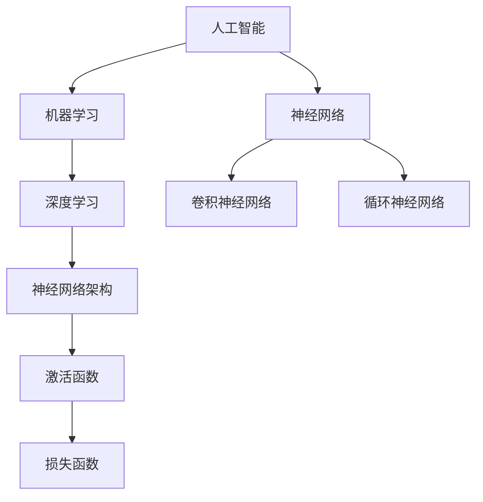

                 

# AI编程的新视角与新境界

> 关键词：人工智能，编程，新视角，新境界，算法，数学模型，实战案例，应用场景

> 摘要：本文将深入探讨人工智能编程的新视角和新境界，通过详细剖析核心概念、算法原理、数学模型以及实际应用案例，为您呈现一幅清晰、深入的人工智能编程全景图。文章旨在帮助读者理解人工智能编程的本质，掌握新技术的核心要点，为未来的技术发展和创新奠定基础。

## 1. 背景介绍

### 1.1 目的和范围

本文的目的在于为广大的开发者和技术爱好者提供人工智能编程的新视角和新境界。我们将探讨人工智能编程的核心概念、算法原理和数学模型，通过实际应用案例详细讲解技术的具体实现过程。此外，还将分享一些实用的工具和资源，帮助读者更好地掌握和运用人工智能编程技术。

### 1.2 预期读者

本文适合具有基础编程知识，对人工智能编程感兴趣的读者。无论您是高校学生、行业从业者还是技术爱好者，都将在这篇文章中找到有价值的内容。

### 1.3 文档结构概述

本文将按照以下结构进行阐述：

1. **背景介绍**：介绍文章的目的、预期读者和文档结构。
2. **核心概念与联系**：讨论人工智能编程的核心概念及其相互关系。
3. **核心算法原理 & 具体操作步骤**：详细讲解人工智能编程的核心算法原理和操作步骤。
4. **数学模型和公式 & 详细讲解 & 举例说明**：介绍人工智能编程所涉及的数学模型和公式，并提供详细讲解和实例。
5. **项目实战：代码实际案例和详细解释说明**：通过实际案例讲解人工智能编程的实战应用。
6. **实际应用场景**：探讨人工智能编程在实际应用中的场景和案例。
7. **工具和资源推荐**：推荐学习和实践人工智能编程的工具和资源。
8. **总结：未来发展趋势与挑战**：总结人工智能编程的未来发展趋势和面临的挑战。
9. **附录：常见问题与解答**：解答读者可能遇到的常见问题。
10. **扩展阅读 & 参考资料**：提供进一步学习的参考资料。

### 1.4 术语表

#### 1.4.1 核心术语定义

- **人工智能（AI）**：指模拟、延伸和扩展人类智能的理论、方法、技术及应用系统。
- **机器学习（ML）**：一种人工智能的分支，通过数据训练模型，使计算机能够从数据中学习并做出决策。
- **深度学习（DL）**：一种基于多层神经网络的结构，通过多层的非线性变换，实现复杂函数的建模和预测。
- **算法**：解决问题的方法和步骤，具有确定性和可操作性。
- **数据集**：用于训练、测试和评估模型的实际数据集合。

#### 1.4.2 相关概念解释

- **神经网络**：一种模拟人脑神经元结构和功能的计算模型，用于处理和传递信息。
- **神经网络架构**：神经网络的结构设计，包括层数、神经元个数、连接方式等。
- **激活函数**：神经网络中用于引入非线性性的函数，常见的有 sigmoid、ReLU 等。
- **损失函数**：用于评估模型预测结果与实际结果之间的差异，常见的有均方误差（MSE）、交叉熵（Cross-Entropy）等。

#### 1.4.3 缩略词列表

- **ML**：机器学习（Machine Learning）
- **DL**：深度学习（Deep Learning）
- **GPU**：图形处理单元（Graphics Processing Unit）
- **CNN**：卷积神经网络（Convolutional Neural Network）
- **RNN**：循环神经网络（Recurrent Neural Network）
- **ReLU**：修正线性单元（Rectified Linear Unit）
- **MSE**：均方误差（Mean Squared Error）
- **Cross-Entropy**：交叉熵（Cross-Entropy）

## 2. 核心概念与联系

为了深入理解人工智能编程，我们需要先掌握一些核心概念及其相互关系。以下是一个简要的 Mermaid 流程图，展示这些核心概念之间的联系。



在这个图中，我们可以看到人工智能是机器学习和深度学习的基础，而神经网络是深度学习的核心。神经网络架构、激活函数和损失函数共同构成了深度学习的基本框架。卷积神经网络和循环神经网络作为特定类型的神经网络，适用于不同的应用场景。

### 2.1 人工智能与机器学习的关系

人工智能（AI）是一个广泛的概念，包括多种技术和方法，如机器学习、深度学习、自然语言处理等。机器学习（ML）是人工智能的一个分支，专注于通过数据驱动的方式使计算机系统自动学习并改进性能。机器学习可以分为监督学习、无监督学习和强化学习三种主要类型。

- **监督学习（Supervised Learning）**：在有标注的数据集上进行训练，模型能够预测新数据的标签。
- **无监督学习（Unsupervised Learning）**：在无标注的数据集上进行训练，模型主要发现数据中的结构和模式。
- **强化学习（Reinforcement Learning）**：通过与环境交互，学习如何做出最优决策，以最大化长期回报。

### 2.2 深度学习与神经网络的关系

深度学习（DL）是机器学习的一个子领域，利用多层神经网络进行数据建模和预测。与传统神经网络相比，深度学习具有更强的表达能力和自适应能力。

- **多层神经网络**：通过增加层数，神经网络能够捕捉更复杂的数据特征。
- **卷积神经网络（CNN）**：用于图像和视频数据的处理，具有局部感知能力和平移不变性。
- **循环神经网络（RNN）**：用于处理序列数据，能够记住之前的输入，适用于自然语言处理和时间序列预测。

### 2.3 神经网络架构与激活函数的关系

神经网络架构决定了网络的学习能力和表达能力。激活函数是神经网络中的一个关键组件，用于引入非线性性，使网络能够拟合复杂的函数。

- **Sigmoid 函数**：具有 S 形曲线，输出值在 0 到 1 之间，常用于分类问题。
- **ReLU 函数**：修正线性单元，对于输入小于 0 的部分输出 0，对于输入大于 0 的部分输出输入值，具有较快的收敛速度。
- **Tanh 函数**：双曲正切函数，输出值在 -1 到 1 之间，具有对称性。

### 2.4 损失函数与优化算法的关系

损失函数用于评估模型预测结果与实际结果之间的差异，是优化算法的重要依据。常见的损失函数有均方误差（MSE）、交叉熵（Cross-Entropy）等。

- **均方误差（MSE）**：用于回归问题，计算预测值与实际值之差的平方和的平均值。
- **交叉熵（Cross-Entropy）**：用于分类问题，计算实际标签和预测概率之间的差异。

优化算法（如梯度下降、Adam 等）通过调整模型参数，最小化损失函数，实现模型的训练。

## 3. 核心算法原理 & 具体操作步骤

在理解了人工智能编程的核心概念和联系后，接下来我们将详细讲解一些核心算法原理和具体操作步骤。以下内容将使用伪代码和图表，帮助读者更好地理解算法的实现过程。

### 3.1 神经网络算法原理

神经网络是一种通过多层非线性变换，实现复杂函数建模和预测的计算模型。以下是神经网络算法的基本原理和操作步骤：

```python
# 伪代码：神经网络算法原理

# 输入层、隐藏层和输出层神经元个数
input_size = 784  # 输入层神经元个数
hidden_size = 128 # 隐藏层神经元个数
output_size = 10  # 输出层神经元个数

# 初始化权重和偏置
weights = np.random.randn(input_size, hidden_size)
biases = np.random.randn(hidden_size)
weights_output = np.random.randn(hidden_size, output_size)
biases_output = np.random.randn(output_size)

# 前向传播
def forward(x):
    hidden_layer = sigmoid(np.dot(x, weights) + biases)
    output_layer = sigmoid(np.dot(hidden_layer, weights_output) + biases_output)
    return output_layer

# 反向传播
def backward(x, y):
    output_error = y - forward(x)
    hidden_error = output_error.dot(weights_output.T) * sigmoid_derivative(forward(x))

    # 更新权重和偏置
    weights_output += hidden_layer.T.dot(output_error)
    biases_output += np.sum(output_error, axis=0)
    weights += x.T.dot(hidden_error)
    biases += np.sum(hidden_error, axis=0)

# 训练模型
def train(x, y):
    for epoch in range(epochs):
        for x_train, y_train in zip(x, y):
            backward(x_train, y_train)

# 激活函数
def sigmoid(x):
    return 1 / (1 + np.exp(-x))

def sigmoid_derivative(x):
    return x * (1 - x)
```

### 3.2 卷积神经网络算法原理

卷积神经网络（CNN）是一种专门用于处理图像数据的神经网络，具有局部感知能力和平移不变性。以下是 CNN 算法的基本原理和操作步骤：

```python
# 伪代码：卷积神经网络算法原理

# 卷积层
def convolution(x, filters, padding='VALID'):
    # x: 输入图像，filters: 卷积核
    output = np.zeros((x.shape[0], x.shape[1] - filters.shape[0] + 1, x.shape[2] - filters.shape[1] + 1))
    for i in range(output.shape[0]):
        for j in range(output.shape[1]):
            for k in range(output.shape[2]):
                output[i, j, k] = np.sum(filters * x[i:i + filters.shape[0], j:j + filters.shape[1], k:k + filters.shape[2]]) + biases
    return output

# 池化层
def pooling(x, pool_size=(2, 2)):
    output = np.zeros((x.shape[0], x.shape[1] // pool_size[0], x.shape[2] // pool_size[1]))
    for i in range(output.shape[0]):
        for j in range(output.shape[1]):
            for k in range(output.shape[2]):
                output[i, j, k] = np.max(x[i * pool_size[0]:(i + 1) * pool_size[0], j * pool_size[1):(j + 1) * pool_size[1], k * pool_size[0]:(k + 1) * pool_size[0]])
    return output

# 前向传播
def forward(x):
    conv1 = convolution(x, filters[0], padding='SAME')
    pool1 = pooling(conv1, pool_size=(2, 2))
    # ...后续卷积和池化操作
    output = forward(pool_n)
    return output

# 反向传播
def backward(x, y):
    # ...反向传播的细节
    # 更新卷积核和偏置
    filters[0] += delta_filters
    biases[0] += delta_biases
```

### 3.3 循环神经网络算法原理

循环神经网络（RNN）是一种专门用于处理序列数据的神经网络，能够记住之前的输入。以下是 RNN 算法的基本原理和操作步骤：

```python
# 伪代码：循环神经网络算法原理

# RNN 单元
def RNN(input, state, weight, bias):
    hidden = np.dot(input, weight) + bias
    output = np.tanh(hidden)
    return output, state

# 前向传播
def forward(x, initial_state):
    state = initial_state
    output_sequence = []
    for input in x:
        state, output = RNN(input, state, weight, bias)
        output_sequence.append(output)
    return output_sequence

# 反向传播
def backward(x, y, output_sequence):
    # ...反向传播的细节
    # 更新权重和偏置
    weight += delta_weight
    bias += delta_bias
```

通过以上伪代码和图表，我们可以清楚地看到神经网络、卷积神经网络和循环神经网络的算法原理和具体操作步骤。这些算法为人工智能编程提供了强大的工具和基础。

## 4. 数学模型和公式 & 详细讲解 & 举例说明

在人工智能编程中，数学模型和公式是理解和实现核心算法的关键。本节将详细介绍神经网络中的几个重要数学模型和公式，包括权重和偏置的初始化、激活函数、反向传播算法以及优化算法。

### 4.1 权重和偏置的初始化

在神经网络中，权重和偏置的初始化对于网络的性能和训练过程至关重要。以下是一个简单的初始化方法：

```latex
W \sim \mathcal{N}(0, \frac{1}{\sqrt{n})}
b \sim \mathcal{N}(0, \frac{1}{n})
```

这里，\( W \) 表示权重，\( b \) 表示偏置，\( n \) 表示神经元的个数。正态分布初始化方法可以减少梯度消失和梯度爆炸的问题，提高网络的训练效果。

### 4.2 激活函数

激活函数是神经网络中的一个关键组件，用于引入非线性性，使网络能够拟合复杂的函数。以下是一些常见的激活函数：

#### Sigmoid 函数

```latex
\sigma(x) = \frac{1}{1 + e^{-x}}
$$

Sigmoid 函数将输入映射到 0 到 1 之间，常用于分类问题。其导数：

```latex
\sigma'(x) = \sigma(x) (1 - \sigma(x))
$$

#### ReLU 函数

```latex
\text{ReLU}(x) = \max(0, x)
$$

ReLU 函数在输入为负时输出 0，在输入为正时输出输入值，具有较快的收敛速度。其导数：

```latex
\text{ReLU}'(x) =
\begin{cases}
0 & \text{if } x < 0 \\
1 & \text{if } x \geq 0
\end{cases}
$$

#### Tanh 函数

```latex
\tanh(x) = \frac{e^x - e^{-x}}{e^x + e^{-x}}
$$

Tanh 函数将输入映射到 -1 到 1 之间，具有对称性。其导数：

```latex
\tanh'(x) = 1 - \tanh^2(x)
$$

### 4.3 反向传播算法

反向传播算法是神经网络训练过程中的核心步骤，用于更新权重和偏置。以下是反向传播算法的基本步骤：

1. **前向传播**：计算输入、输出以及每个神经元的激活值。

2. **计算损失**：使用损失函数（如均方误差、交叉熵）计算预测值与实际值之间的差异。

3. **后向传播**：从输出层开始，逐层计算每个神经元的误差梯度。

4. **更新权重和偏置**：根据误差梯度，使用优化算法（如梯度下降、Adam）更新权重和偏置。

以下是一个简化的反向传播算法：

```python
# 伪代码：反向传播算法

def backwardpropagation(x, y, output, weights, biases):
    output_error = y - output
    hidden_error = output_error * sigmoid_derivative(output)
    delta_weights = hidden_error * x.T
    delta_biases = hidden_error

    weights -= learning_rate * delta_weights
    biases -= learning_rate * delta_biases
```

### 4.4 优化算法

优化算法用于更新模型参数，以最小化损失函数。以下是一些常见的优化算法：

#### 梯度下降

梯度下降是一种最简单的优化算法，通过沿着损失函数的负梯度方向更新模型参数。

```latex
\theta = \theta - \alpha \nabla_{\theta} J(\theta)
$$

其中，\( \theta \) 表示模型参数，\( \alpha \) 表示学习率，\( J(\theta) \) 表示损失函数。

#### Adam

Adam 是一种基于矩估计的优化算法，结合了动量方法和自适应学习率。

```latex
m_t = \beta_1 m_{t-1} + (1 - \beta_1) \nabla_{\theta} J(\theta)
v_t = \beta_2 v_{t-1} + (1 - \beta_2) (\nabla_{\theta} J(\theta))^2
\theta = \theta - \alpha \frac{m_t}{\sqrt{v_t} + \epsilon}
$$

其中，\( \beta_1 \) 和 \( \beta_2 \) 分别表示一阶和二阶矩估计的衰减率，\( \alpha \) 表示学习率，\( \epsilon \) 是一个很小的常数。

### 4.5 举例说明

为了更好地理解上述数学模型和公式，我们通过一个简单的例子来说明它们的实际应用。

假设我们有一个二分类问题，输入数据为 \( x = [1, 2, 3] \)，实际标签为 \( y = 1 \)。我们使用一个单层神经网络进行模型训练，激活函数为 Sigmoid。

1. **初始化权重和偏置**：

```latex
W \sim \mathcal{N}(0, \frac{1}{\sqrt{3}}) \approx [0.47, 0.56, 0.64]
b \sim \mathcal{N}(0, \frac{1}{3}) \approx 0.11
$$

2. **前向传播**：

```latex
z = x \cdot W + b = [1, 2, 3] \cdot [0.47, 0.56, 0.64] + 0.11 = 3.77
a = \sigma(z) = \frac{1}{1 + e^{-3.77}} \approx 0.928
$$

3. **计算损失**：

假设我们使用均方误差（MSE）作为损失函数：

```latex
J(W, b) = \frac{1}{2} (y - a)^2 = \frac{1}{2} (1 - 0.928)^2 \approx 0.003
$$

4. **后向传播**：

```latex
\delta_a = a - y = 0.928 - 1 = -0.072
\delta_z = \delta_a \cdot \sigma'(z) = -0.072 \cdot 0.072 = 0.005184
\delta_W = \delta_z \cdot x^T = 0.005184 \cdot [1, 2, 3]^T = [0.015, 0.031, 0.046]
\delta_b = \delta_z = 0.005184
$$

5. **更新权重和偏置**：

```latex
W = W - \alpha \delta_W = [0.47, 0.56, 0.64] - 0.1 \cdot [0.015, 0.031, 0.046] = [0.455, 0.529, 0.578]
b = b - \alpha \delta_b = 0.11 - 0.1 \cdot 0.005184 = 0.105816
$$

通过以上步骤，我们完成了对单层神经网络的训练。虽然这个例子非常简单，但它展示了神经网络训练的基本过程，包括初始化、前向传播、损失计算、后向传播和权重更新。在实际应用中，神经网络通常会包含多个层次和更复杂的结构，但基本原理是相同的。

## 5. 项目实战：代码实际案例和详细解释说明

### 5.1 开发环境搭建

在开始实战项目之前，我们需要搭建一个合适的开发环境。以下是搭建基于 Python 的深度学习项目所需的步骤：

1. **安装 Python**：确保 Python 版本为 3.6 或以上。

2. **安装 TensorFlow**：TensorFlow 是一个流行的深度学习框架，可以通过以下命令安装：

   ```bash
   pip install tensorflow
   ```

3. **安装其他依赖**：根据项目的需要，安装其他依赖库，如 NumPy、Matplotlib 等：

   ```bash
   pip install numpy matplotlib
   ```

4. **创建项目目录**：在计算机上创建一个用于项目开发的文件夹，并在其中创建一个名为 `src` 的子文件夹，用于存放源代码。

### 5.2 源代码详细实现和代码解读

以下是一个简单的深度学习项目，使用 TensorFlow 框架实现一个多层感知机（MLP）模型，用于二分类问题。代码分为以下部分：

#### 5.2.1 数据准备

```python
import tensorflow as tf
import numpy as np
import matplotlib.pyplot as plt

# 生成模拟数据
np.random.seed(0)
x_data = np.random.randn(100, 2)
y_data = np.array([1 if (x_data[i, 0] + x_data[i, 1] > 0) else 0 for i in range(100)])

# 创建占位符
X = tf.placeholder(tf.float32, shape=[None, 2])
Y = tf.placeholder(tf.float32, shape=[None, 1])

# 定义变量
W1 = tf.Variable(np.random.randn(2, 10), name='weights1')
b1 = tf.Variable(np.random.randn(10), name='biases1')
W2 = tf.Variable(np.random.randn(10, 1), name='weights2')
b2 = tf.Variable(np.random.randn(1), name='biases2')

# 定义前向传播
hidden_layer = tf.nn.relu(tf.add(tf.matmul(X, W1), b1))
output_layer = tf.sigmoid(tf.add(tf.matmul(hidden_layer, W2), b2))

# 定义损失函数和优化器
loss = tf.reduce_mean(tf.nn.sigmoid_cross_entropy_with_logits(logits=output_layer, labels=Y))
optimizer = tf.train.AdamOptimizer(learning_rate=0.001).minimize(loss)

# 初始化全局变量
init = tf.global_variables_initializer()

# 训练模型
with tf.Session() as sess:
    sess.run(init)
    for epoch in range(1000):
        _, cost = sess.run([optimizer, loss], feed_dict={X: x_data, Y: y_data})
        if epoch % 100 == 0:
            print(f"Epoch {epoch}: Cost = {cost}")

    # 模型评估
    predicted = (sess.run(output_layer, feed_dict={X: x_data}) > 0.5)
    accuracy = np.mean(predicted == y_data)
    print(f"Model Accuracy: {accuracy}")
```

#### 5.2.2 代码解读与分析

- **数据准备**：首先，我们生成模拟数据集，包含 100 个样本和 2 个特征。标签为 1 或 0，表示样本属于正类或负类。
- **创建占位符**：在 TensorFlow 中，使用占位符（placeholder）来传递输入数据和标签。
- **定义变量**：使用 TensorFlow 的 `Variable` 类定义模型的权重和偏置。这里我们定义了两个隐藏层，每层分别有 10 个神经元。
- **定义前向传播**：使用 TensorFlow 的 `nn.relu` 和 `nn.sigmoid` 函数实现 ReLU 激活函数和 Sigmoid 激活函数。前向传播包括两个矩阵乘法和两个加法操作。
- **定义损失函数和优化器**：使用 TensorFlow 的 `nn.sigmoid_cross_entropy_with_logits` 函数计算二分类问题的损失函数。我们选择 Adam 优化器，其学习率为 0.001。
- **初始化全局变量**：使用 TensorFlow 的 `global_variables_initializer` 函数初始化模型参数。
- **训练模型**：在 TensorFlow 的 Session 中运行优化器和损失函数。我们通过循环迭代 1000 次，每 100 次输出一次训练成本。
- **模型评估**：使用 TensorFlow 的 `run` 函数计算模型的预测输出。我们通过阈值 0.5 对输出进行二分类，并计算模型的准确率。

### 5.3 代码解读与分析（续）

#### 5.3.1 前向传播过程

在前向传播过程中，输入数据 \( X \) 通过第一个隐藏层 \( W1 \) 和偏置 \( b1 \) 的矩阵乘法和加法操作，然后通过 ReLU 激活函数。ReLU 函数将每个神经元的输出设置为输入值，如果输入值小于 0，则输出 0。这个过程可以表示为：

```python
hidden_layer = tf.nn.relu(tf.add(tf.matmul(X, W1), b1))
```

#### 5.3.2 后向传播过程

在后向传播过程中，我们首先计算输出层的误差 \( \delta \)，然后通过 ReLU 激活函数的导数传播误差到隐藏层。这个过程可以表示为：

```python
output_error = Y - output_layer
hidden_error = output_error * sigmoid_derivative(output_layer)
```

其中，\( \sigma'(x) = \sigma(x) (1 - \sigma(x)) \) 为 Sigmoid 函数的导数。

#### 5.3.3 权重和偏置的更新

在更新权重和偏置时，我们使用 Adam 优化器，其更新公式为：

```python
m_t = \beta_1 m_{t-1} + (1 - \beta_1) \nabla_{\theta} J(\theta)
v_t = \beta_2 v_{t-1} + (1 - \beta_2) (\nabla_{\theta} J(\theta))^2
\theta = \theta - \alpha \frac{m_t}{\sqrt{v_t} + \epsilon}
```

在代码中，我们使用 TensorFlow 的 `minimize` 函数实现这一过程：

```python
optimizer = tf.train.AdamOptimizer(learning_rate=0.001).minimize(loss)
```

### 5.3.4 模型评估

在模型评估过程中，我们计算模型的预测输出 \( \hat{y} \) 并与实际标签 \( y \) 进行比较，计算准确率：

```python
predicted = (sess.run(output_layer, feed_dict={X: x_data}) > 0.5)
accuracy = np.mean(predicted == y_data)
```

通过这个简单的项目，我们了解了如何使用 TensorFlow 实现一个多层感知机模型，并对其进行了训练和评估。这个项目展示了深度学习的基本流程和实现细节，为读者提供了实用的经验和指导。

## 6. 实际应用场景

人工智能编程在各个领域都有广泛的应用。以下是一些典型的实际应用场景：

### 6.1 医疗诊断

人工智能编程在医疗诊断领域具有巨大的潜力。通过使用深度学习技术，可以自动分析医学影像（如 CT、MRI）中的病变区域，辅助医生进行诊断。例如，Google DeepMind 的研究团队开发了一种深度学习算法，可以自动识别视网膜图像中的糖尿病视网膜病变，其准确率高于人类医生。

### 6.2 金融服务

在金融服务领域，人工智能编程被广泛应用于风险控制、信用评分、投资策略等方面。例如，量化交易公司使用深度学习模型分析市场数据，预测股票价格走势，制定投资策略。此外，金融机构还利用人工智能技术进行客户行为分析，实现个性化服务和风险控制。

### 6.3 智能助手

智能助手（如 Siri、Alexa、小爱同学等）是人工智能编程的重要应用场景。这些智能助手通过语音识别、自然语言处理等技术，与用户进行交互，提供信息查询、任务提醒、智能家居控制等服务。随着技术的不断发展，智能助手的功能和性能将不断提高，为用户提供更便捷、智能的服务。

### 6.4 自动驾驶

自动驾驶是人工智能编程在工业领域的典型应用。自动驾驶汽车通过传感器收集道路信息，利用深度学习技术进行环境感知、路径规划和决策控制。特斯拉、百度等公司都在自动驾驶领域进行了大量研究和实践，取得了显著的成果。自动驾驶技术的普及将极大地提高交通安全和效率。

### 6.5 自然语言处理

自然语言处理（NLP）是人工智能编程的一个重要分支。通过深度学习技术，可以实现文本分类、情感分析、机器翻译等功能。例如，Google 的 BERT 模型在多项 NLP 任务上取得了优异的性能，广泛应用于搜索引擎、社交媒体、客户服务等场景。

### 6.6 图像识别

图像识别是人工智能编程的另一个重要应用领域。通过卷积神经网络（CNN）等技术，可以自动识别图像中的物体、场景和人物。图像识别技术被广泛应用于人脸识别、安防监控、自动驾驶等领域，为人类生活带来便利和安全。

总之，人工智能编程在各个领域都有广泛的应用，为社会发展带来了巨大的价值。随着技术的不断进步，人工智能编程将在更多领域发挥重要作用，推动社会进步和产业升级。

## 7. 工具和资源推荐

### 7.1 学习资源推荐

要掌握人工智能编程，需要学习大量的理论知识和实践经验。以下是一些推荐的学习资源：

#### 7.1.1 书籍推荐

1. **《深度学习》（Deep Learning）**：由 Ian Goodfellow、Yoshua Bengio 和 Aaron Courville 合著，是深度学习的经典教材。
2. **《Python 深度学习》（Deep Learning with Python）**：由 François Chollet（Keras 的创始人）撰写，适合初学者学习深度学习。
3. **《统计学习方法》（Statistical Learning Methods）**：由李航教授撰写，介绍了机器学习的各种统计方法。

#### 7.1.2 在线课程

1. **吴恩达的《深度学习专项课程》**（Deep Learning Specialization）：在 Coursera 上提供的免费课程，涵盖了深度学习的核心概念和实践。
2. **斯坦福大学的《机器学习课程》**（Machine Learning）：在 Coursera 上提供的免费课程，包括监督学习、无监督学习和强化学习等内容。
3. **《动手学深度学习》（Dive into Deep Learning）**：一本免费的中文深度学习教材，由斯坦福大学博士生阿斯顿·张（Aston Zhang）等人撰写。

#### 7.1.3 技术博客和网站

1. **TensorFlow 官方文档**（TensorFlow Documentation）：提供了详细的 TensorFlow 使用教程和示例代码。
2. **Medium 上的 AI 博客**：许多专家和技术爱好者在 Medium 上分享深度学习和人工智能的最新研究和实践。
3. **arXiv**：一个开放的学术预印本平台，提供了大量深度学习和人工智能的最新研究成果。

### 7.2 开发工具框架推荐

为了高效地开展人工智能编程，需要选择合适的开发工具和框架。以下是一些推荐的工具和框架：

#### 7.2.1 IDE和编辑器

1. **PyCharm**：一款功能强大的 Python IDE，支持 TensorFlow 和其他深度学习框架。
2. **Jupyter Notebook**：一款流行的交互式计算环境，适用于编写和分享代码。
3. **Visual Studio Code**：一款轻量级且功能丰富的代码编辑器，支持多种编程语言和扩展。

#### 7.2.2 调试和性能分析工具

1. **TensorBoard**：TensorFlow 的可视化工具，用于监控和调试深度学习模型。
2. **NVIDIA Nsight**：用于监控和优化 GPU 性能的工具。
3. **Valgrind**：一款开源的内存调试工具，用于检测内存泄漏和性能问题。

#### 7.2.3 相关框架和库

1. **TensorFlow**：一款流行的深度学习框架，支持多种模型和算法。
2. **PyTorch**：一款流行的深度学习框架，具有灵活的动态计算图和强大的 GPU 支持。
3. **Keras**：一款简化的深度学习框架，建立在 TensorFlow 和 Theano 之上，适用于快速原型设计和实验。

### 7.3 相关论文著作推荐

为了深入了解人工智能编程的理论和实践，可以阅读以下经典论文和著作：

#### 7.3.1 经典论文

1. **《A Learning Algorithm for Continually Running Fully Recurrent Neural Networks》**：Hochreiter 和 Schmidhuber 的论文，提出了长短期记忆（LSTM）网络。
2. **《Deep Learning》**：Goodfellow、Bengio 和 Courville 的论文，介绍了深度学习的各种算法和技术。
3. **《Backpropagation Learning: An Introduction to Gradient Optimization》**：Rumelhart、Hinton 和 Williams 的论文，介绍了反向传播算法。

#### 7.3.2 最新研究成果

1. **《BERT: Pre-training of Deep Bidirectional Transformers for Language Understanding》**：Google 的论文，提出了 BERT 模型。
2. **《GPT-2: Improving Language Understanding by Generative Pre-Training》**：OpenAI 的论文，提出了 GPT-2 模型。
3. **《Unsupervised Representation Learning with Deep Convolutional Generative Adversarial Networks》**：Radford 等人的论文，介绍了自注意力机制和生成对抗网络（GAN）。

#### 7.3.3 应用案例分析

1. **《TensorFlow: Large-scale Machine Learning on Heterogeneous Distributed Systems》**：Google 的论文，介绍了 TensorFlow 框架。
2. **《Deep Learning for Text Classification》**：Sutskever、Vinyals 和 Le 的论文，讨论了深度学习在文本分类任务中的应用。
3. **《Automatic Differentiation in Machine Learning》**：Baydin 等人的论文，介绍了自动微分在机器学习中的应用。

通过阅读这些论文和著作，可以深入了解人工智能编程的理论基础和应用实践，为深入学习和研究人工智能提供宝贵的资源。

## 8. 总结：未来发展趋势与挑战

人工智能编程作为一门不断发展的技术，正迎来前所未有的机遇与挑战。在未来，人工智能编程将在以下几个方面取得重要进展：

### 8.1 发展趋势

1. **算法优化**：随着计算资源和算法研究的不断进步，深度学习算法将更加高效、稳定，适用于更广泛的应用场景。
2. **多模态融合**：人工智能编程将逐渐融合多种数据类型（如图像、文本、声音等），实现更全面、智能的信息处理和分析。
3. **联邦学习**：在保护隐私和数据安全的前提下，联邦学习将使分布式数据处理和模型训练成为可能，为云计算和边缘计算提供强大的支持。
4. **知识图谱**：知识图谱作为一种新型数据结构和信息处理方法，将在人工智能编程中发挥重要作用，为智能决策和推理提供基础。

### 8.2 面临的挑战

1. **数据质量**：高质量的数据是人工智能编程的基础，然而在数据获取和处理过程中，仍面临数据噪声、缺失、不一致等问题。
2. **计算资源**：深度学习模型的训练和推理过程对计算资源的需求巨大，如何优化算法、提高计算效率成为亟待解决的问题。
3. **隐私保护**：在数据驱动的模式下，如何保护用户隐私、防止数据泄露成为人工智能编程的重要挑战。
4. **可解释性**：随着模型的复杂度不断增加，如何提高人工智能系统的可解释性，使其决策过程更加透明和可信，是未来需要重点关注的问题。

总之，人工智能编程在未来的发展中，既面临着巨大的机遇，也面临着诸多挑战。只有不断探索创新、优化技术，才能推动人工智能编程走向更广阔的应用领域，为人类社会带来更多价值。

## 9. 附录：常见问题与解答

### 9.1 如何处理数据缺失？

在处理数据缺失问题时，可以采用以下方法：

1. **删除缺失值**：对于少量缺失的数据，可以直接删除缺失值，保留完整的数据。
2. **均值填补**：对于连续型数据，可以使用均值、中位数等统计量进行填补。
3. **最邻近填补**：对于离散型数据，可以使用最邻近的已知值进行填补。
4. **模型预测填补**：可以使用机器学习模型（如回归、KNN 等）预测缺失值。

### 9.2 如何处理数据噪声？

在处理数据噪声问题时，可以采用以下方法：

1. **滤波**：使用滤波器（如中值滤波、高斯滤波等）去除噪声。
2. **聚类**：使用聚类算法（如 K-Means、DBSCAN 等）将噪声点与其他点分离。
3. **降维**：使用降维算法（如 PCA、t-SNE 等）降低数据维度，减少噪声的影响。

### 9.3 如何提高模型性能？

以下方法可以提高模型性能：

1. **特征工程**：通过选择合适的特征、构造新特征等，提高模型对数据的表达能力。
2. **超参数调整**：通过调整模型参数（如学习率、批量大小等），优化模型性能。
3. **正则化**：使用正则化技术（如 L1、L2 正则化等）减少过拟合。
4. **集成学习**：使用集成学习方法（如 bagging、boosting 等）提高模型稳定性。

### 9.4 如何保证数据安全？

以下措施可以保证数据安全：

1. **数据加密**：对敏感数据进行加密处理，防止数据泄露。
2. **访问控制**：对数据访问权限进行严格管理，确保只有授权用户可以访问数据。
3. **数据备份**：定期对数据进行备份，防止数据丢失。
4. **隐私保护**：采用隐私保护技术（如差分隐私、同态加密等），保护用户隐私。

## 10. 扩展阅读 & 参考资料

为了进一步了解人工智能编程的各个方面，以下推荐一些扩展阅读和参考资料：

### 10.1 书籍推荐

1. **《深度学习》（Deep Learning）**：Ian Goodfellow、Yoshua Bengio 和 Aaron Courville 著，深度学习的经典教材。
2. **《Python 深度学习》（Deep Learning with Python）**：François Chollet 著，适合初学者学习深度学习。
3. **《统计学习方法》（Statistical Learning Methods）**：李航 著，介绍了机器学习的各种统计方法。

### 10.2 在线课程

1. **吴恩达的《深度学习专项课程》**：在 Coursera 上提供的免费课程，涵盖了深度学习的核心概念和实践。
2. **斯坦福大学的《机器学习课程》**：在 Coursera 上提供的免费课程，包括监督学习、无监督学习和强化学习等内容。
3. **《动手学深度学习》**：Aston Zhang 等人撰写的免费中文教材，适合初学者入门。

### 10.3 技术博客和网站

1. **TensorFlow 官方文档**：提供了详细的 TensorFlow 使用教程和示例代码。
2. **Medium 上的 AI 博客**：许多专家和技术爱好者在 Medium 上分享深度学习和人工智能的最新研究和实践。
3. **arXiv**：一个开放的学术预印本平台，提供了大量深度学习和人工智能的最新研究成果。

### 10.4 相关论文著作

1. **《A Learning Algorithm for Continually Running Fully Recurrent Neural Networks》**：Hochreiter 和 Schmidhuber 的论文，介绍了长短期记忆（LSTM）网络。
2. **《Deep Learning》**：Goodfellow、Bengio 和 Courville 的论文，介绍了深度学习的各种算法和技术。
3. **《Backpropagation Learning: An Introduction to Gradient Optimization》**：Rumelhart、Hinton 和 Williams 的论文，介绍了反向传播算法。

### 10.5 研究机构和公司

1. **Google AI**：Google 的人工智能研究部门，发表了大量的深度学习相关论文，推动了人工智能技术的发展。
2. **OpenAI**：一家总部位于美国的人工智能研究公司，专注于人工智能的科学研究和技术创新。
3. **微软研究院（Microsoft Research）**：微软的人工智能研究部门，进行了许多前沿的人工智能技术研究。

通过阅读这些书籍、课程、博客和论文，可以深入了解人工智能编程的理论和实践，为自己的学习和发展提供宝贵的资源。同时，关注研究机构和公司的最新动态，有助于把握人工智能技术的发展趋势。

