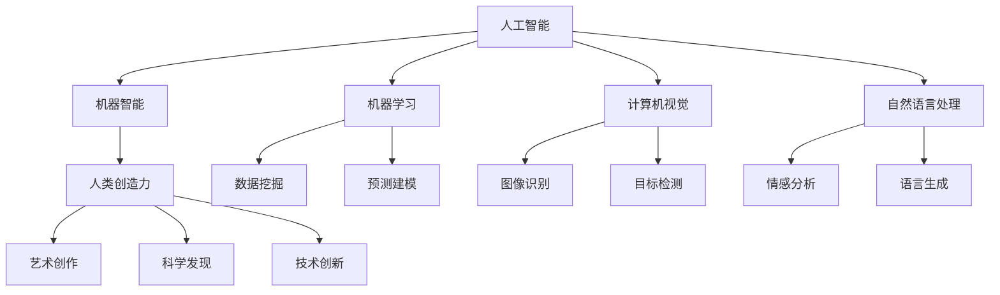

                 

# 连接人类创造力与机器智能的桥梁

> 关键词：人工智能，人类创造力，机器智能，连接，桥梁，算法原理，数学模型，项目实战，应用场景，未来趋势

> 摘要：本文旨在探讨如何通过构建有效的桥梁，将人类创造力和机器智能结合起来，实现更为强大的创新和发展。文章首先介绍相关背景，然后详细阐述核心概念和原理，并通过实际案例展示如何应用这些原理，最后对未来的发展趋势和挑战进行展望。

## 1. 背景介绍

### 1.1 目的和范围

随着人工智能技术的迅速发展，机器智能已经逐渐成为推动社会进步的重要力量。然而，人类创造力和机器智能之间存在巨大的鸿沟。本文的目标是探索如何通过构建桥梁来连接这两者，从而实现更为高效的创新和发展。

本文主要讨论以下内容：

1. 核心概念和原理的介绍。
2. 算法原理和数学模型的详细讲解。
3. 项目实战的实际案例。
4. 机器智能在各个领域的应用场景。
5. 未来发展趋势与挑战的展望。

### 1.2 预期读者

本文适合以下读者群体：

1. 对人工智能和机器智能有一定了解的技术爱好者。
2. 需要掌握人工智能技术以提升工作效率的专业人士。
3. 对机器智能应用领域感兴趣的研究人员和开发者。

### 1.3 文档结构概述

本文分为以下几个部分：

1. 背景介绍：介绍文章的目的、范围、预期读者以及文档结构。
2. 核心概念与联系：详细阐述人工智能、人类创造力、机器智能等核心概念，并使用Mermaid流程图展示它们之间的关系。
3. 核心算法原理 & 具体操作步骤：使用伪代码讲解关键算法原理，并给出具体操作步骤。
4. 数学模型和公式 & 详细讲解 & 举例说明：介绍相关的数学模型和公式，并进行详细讲解和举例说明。
5. 项目实战：提供代码实际案例，详细解释说明代码实现过程。
6. 实际应用场景：探讨机器智能在各领域的应用。
7. 工具和资源推荐：推荐学习资源、开发工具框架和相关论文著作。
8. 总结：总结未来发展趋势与挑战。
9. 附录：常见问题与解答。
10. 扩展阅读 & 参考资料：提供进一步阅读和参考资料。

### 1.4 术语表

#### 1.4.1 核心术语定义

- **人工智能**：模拟、延伸和扩展人类智能的理论、方法、技术及应用系统。
- **机器智能**：由计算机系统实现的、具有一定自我学习能力、判断能力和问题解决能力的智能。
- **人类创造力**：人类在艺术、科学、技术等领域中创新、发明和创作的能力。

#### 1.4.2 相关概念解释

- **算法**：解决问题的步骤和指导原则。
- **机器学习**：通过数据和统计方法，使计算机自动学习和改进的技术。
- **深度学习**：基于人工神经网络，通过多层非线性变换进行特征学习和模型训练的方法。

#### 1.4.3 缩略词列表

- **AI**：人工智能
- **ML**：机器学习
- **DL**：深度学习
- **GPU**：图形处理器

## 2. 核心概念与联系

在探讨如何连接人类创造力和机器智能之前，我们需要明确这些核心概念及其相互关系。

### 2.1 人工智能与机器智能

人工智能（AI）是模拟、延伸和扩展人类智能的理论、方法、技术及应用系统。而机器智能（Machine Intelligence）则是由计算机系统实现的、具有一定自我学习能力、判断能力和问题解决能力的智能。

人工智能包括多个子领域，如机器学习、计算机视觉、自然语言处理等。机器智能则是通过这些子领域的技术，实现计算机具有类似人类智能的功能。

### 2.2 人类创造力与机器智能

人类创造力是人类在艺术、科学、技术等领域中创新、发明和创作的能力。机器智能则可以通过模拟、学习和扩展人类创造力，成为连接人类创造力和机器智能的桥梁。

### 2.3 Mermaid流程图

以下是一个Mermaid流程图，展示了人工智能、人类创造力和机器智能之间的核心联系。



## 3. 核心算法原理 & 具体操作步骤

为了实现人类创造力和机器智能的连接，我们需要依赖一系列核心算法。以下是一个具体的算法原理和操作步骤的例子。

### 3.1 算法原理

#### 3.1.1 基于神经网络的机器学习算法

神经网络是一种通过模拟生物神经系统的结构和工作原理，实现数据学习和处理的人工智能模型。深度学习是神经网络的一种扩展，通过多层非线性变换进行特征学习和模型训练。

以下是一个基于神经网络的机器学习算法原理的伪代码：

```plaintext
初始化神经网络参数
对于每一轮迭代：
    对于每个训练样本：
        计算输出值
        计算误差
        更新网络参数
```

### 3.2 具体操作步骤

以下是一个简单的基于神经网络的机器学习算法操作步骤：

1. **数据准备**：收集和准备训练数据，包括输入特征和标签。
2. **神经网络初始化**：初始化神经网络结构、参数和优化器。
3. **训练循环**：对于每个训练样本，执行以下步骤：
    - **计算输出值**：通过神经网络计算预测值。
    - **计算误差**：计算预测值与实际值之间的误差。
    - **更新网络参数**：使用优化器更新网络参数，以减少误差。
4. **评估模型**：在验证集或测试集上评估模型性能，选择最佳模型。

## 4. 数学模型和公式 & 详细讲解 & 举例说明

为了深入理解核心算法，我们需要介绍相关的数学模型和公式。以下是一个简单的例子。

### 4.1 梯度下降算法

梯度下降算法是优化神经网络参数的一种常用方法。其基本思想是通过计算损失函数关于模型参数的梯度，并沿着梯度的反方向更新参数，以最小化损失函数。

以下是梯度下降算法的数学模型和公式：

#### 4.1.1 损失函数

损失函数是用来衡量模型预测值与实际值之间差异的函数。常见的损失函数包括均方误差（MSE）和交叉熵（CE）。

- **均方误差（MSE）**：

  $$MSE = \frac{1}{n}\sum_{i=1}^{n}(y_i - \hat{y}_i)^2$$

  其中，$y_i$为实际值，$\hat{y}_i$为预测值。

- **交叉熵（CE）**：

  $$CE = -\frac{1}{n}\sum_{i=1}^{n}y_i \log(\hat{y}_i) + (1 - y_i) \log(1 - \hat{y}_i)$$

  其中，$y_i$为实际值，$\hat{y}_i$为预测值。

#### 4.1.2 梯度计算

梯度计算是梯度下降算法的核心步骤。对于MSE损失函数，梯度可以表示为：

$$\nabla_{\theta}J(\theta) = \frac{\partial J(\theta)}{\partial \theta} = \frac{2}{n}\sum_{i=1}^{n}(y_i - \hat{y}_i) \cdot x_i$$

其中，$\theta$为模型参数，$J(\theta)$为损失函数，$x_i$为输入特征。

#### 4.1.3 参数更新

在梯度下降算法中，参数更新公式为：

$$\theta_{t+1} = \theta_t - \alpha \cdot \nabla_{\theta}J(\theta_t)$$

其中，$\alpha$为学习率。

### 4.2 举例说明

以下是一个简单的线性回归模型的例子，用于预测房价。

1. **数据准备**：收集房屋的面积和售价数据，作为输入特征和标签。
2. **模型初始化**：初始化模型参数（斜率和截距）。
3. **训练循环**：对于每个训练样本，执行以下步骤：
    - **计算输出值**：通过线性模型计算预测值。
    - **计算误差**：计算预测值与实际值之间的误差。
    - **更新模型参数**：使用梯度下降算法更新模型参数。
4. **评估模型**：在验证集上评估模型性能。

## 5. 项目实战：代码实际案例和详细解释说明

### 5.1 开发环境搭建

在本案例中，我们将使用Python和TensorFlow来实现一个简单的线性回归模型。首先，确保已安装以下工具和库：

- Python 3.x
- TensorFlow 2.x
- NumPy
- Matplotlib

安装命令如下：

```bash
pip install python==3.8.10
pip install tensorflow==2.7.0
pip install numpy
pip install matplotlib
```

### 5.2 源代码详细实现和代码解读

以下是项目的源代码及其详细解释说明。

```python
import tensorflow as tf
import numpy as np
import matplotlib.pyplot as plt

# 5.2.1 数据准备
# 生成模拟数据
np.random.seed(0)
X = np.random.rand(100, 1) * 10
y = 3 + 2 * X + np.random.rand(100, 1) * 0.5

# 5.2.2 模型初始化
# 创建线性回归模型
model = tf.keras.Sequential([
    tf.keras.layers.Dense(units=1, input_shape=(1,))
])

# 5.2.3 训练模型
# 编写训练步骤
model.compile(optimizer='sgd', loss='mean_squared_error')
model.fit(X, y, epochs=100)

# 5.2.4 模型预测
# 使用模型预测
X_new = np.array([[0], [10]])
y_pred = model.predict(X_new)

# 5.2.5 结果可视化
# 绘制训练过程和预测结果
plt.scatter(X, y, color='blue', label='实际值')
plt.plot(X_new, y_pred, color='red', linewidth=2, label='预测值')
plt.xlabel('X')
plt.ylabel('y')
plt.legend()
plt.show()
```

### 5.3 代码解读与分析

1. **数据准备**：使用 NumPy 生成模拟数据，包括输入特征 $X$ 和标签 $y$。
2. **模型初始化**：使用 TensorFlow 创建一个线性回归模型，输入层只有一个神经元。
3. **训练模型**：使用 `model.compile()` 设置优化器和损失函数，使用 `model.fit()` 进行训练。
4. **模型预测**：使用训练好的模型对新的输入特征进行预测。
5. **结果可视化**：使用 Matplotlib 绘制训练过程的散点图和预测结果。

## 6. 实际应用场景

### 6.1 金融领域

在金融领域，机器智能可以用于股票市场预测、风险评估和投资组合优化。通过连接人类创造力和机器智能，可以设计出更为精准的预测模型，提高投资决策的效率。

### 6.2 医疗健康

在医疗健康领域，机器智能可以用于疾病诊断、医学图像分析和个性化治疗。通过连接人类创造力和机器智能，可以加速新药研发和临床诊断，提高医疗服务的质量和效率。

### 6.3 制造业

在制造业，机器智能可以用于生产线优化、设备故障预测和质量控制。通过连接人类创造力和机器智能，可以提升生产效率和产品质量，降低生产成本。

### 6.4 教育

在教育领域，机器智能可以用于个性化教学、学习分析和教育评估。通过连接人类创造力和机器智能，可以为学生提供更加个性化的学习体验，提高教育质量。

## 7. 工具和资源推荐

### 7.1 学习资源推荐

#### 7.1.1 书籍推荐

- 《深度学习》（Goodfellow, Bengio, Courville）
- 《Python深度学习》（François Chollet）
- 《人工智能：一种现代方法》（Stuart J. Russell & Peter Norvig）

#### 7.1.2 在线课程

- Coursera：吴恩达的《深度学习》课程
- edX：MIT的《人工智能导论》课程
- Udacity：人工智能纳米学位

#### 7.1.3 技术博客和网站

- Medium：AI科技评论
- arXiv：最新研究成果的预印本
- GitHub：开源项目和代码示例

### 7.2 开发工具框架推荐

#### 7.2.1 IDE和编辑器

- PyCharm
- Visual Studio Code
- Jupyter Notebook

#### 7.2.2 调试和性能分析工具

- TensorBoard
- WSL（Windows Subsystem for Linux）
- Valgrind

#### 7.2.3 相关框架和库

- TensorFlow
- PyTorch
- Keras

### 7.3 相关论文著作推荐

#### 7.3.1 经典论文

- 《感知器》（Frank Rosenblatt，1957）
- 《深度信念网络》（Geoffrey Hinton，2006）
- 《卷积神经网络》（Yann LeCun，1998）

#### 7.3.2 最新研究成果

- arXiv：最新研究成果的预印本
- Nature：顶级学术期刊

#### 7.3.3 应用案例分析

- 《谷歌深度学习》（Google Brain Team）
- 《深度学习实践指南》（Ian Goodfellow、Yoshua Bengio、Aaron Courville）

## 8. 总结：未来发展趋势与挑战

### 8.1 发展趋势

1. **算法优化**：随着计算能力的提升和算法的改进，机器智能将在更多领域取得突破。
2. **跨学科融合**：人工智能与生物、物理、化学等学科的结合，将带来新的科研和技术创新。
3. **伦理与隐私**：随着机器智能的应用，伦理和隐私问题将日益受到关注。
4. **边缘计算**：边缘计算技术的发展，将使机器智能在更多场景中发挥重要作用。

### 8.2 挑战

1. **数据隐私**：如何确保数据隐私和安全，是一个重要挑战。
2. **算法透明性**：提高算法的透明性和可解释性，使其更容易被人类理解和接受。
3. **伦理问题**：如何确保机器智能的应用符合伦理标准，减少负面影响。
4. **人才培养**：培养更多具备跨学科知识和实践能力的人工智能专业人才。

## 9. 附录：常见问题与解答

### 9.1 问题1：什么是人工智能？

**回答**：人工智能（AI）是模拟、延伸和扩展人类智能的理论、方法、技术及应用系统。它包括多个子领域，如机器学习、计算机视觉、自然语言处理等。

### 9.2 问题2：机器智能与人工智能有什么区别？

**回答**：机器智能（Machine Intelligence）是人工智能的一个子领域，主要关注计算机系统实现具有一定自我学习能力、判断能力和问题解决能力的智能。而人工智能（AI）则是一个更广泛的概念，包括多个子领域。

### 9.3 问题3：如何连接人类创造力和机器智能？

**回答**：可以通过构建有效的算法和模型，将人类的创造力与机器智能结合起来。例如，使用机器学习算法模拟人类的决策过程，或者利用深度学习技术模仿人类的创造力。

## 10. 扩展阅读 & 参考资料

- 《深度学习》（Goodfellow, Bengio, Courville）
- 《Python深度学习》（François Chollet）
- 《人工智能：一种现代方法》（Stuart J. Russell & Peter Norvig）
- 《谷歌深度学习》（Google Brain Team）
- 《深度学习实践指南》（Ian Goodfellow、Yoshua Bengio、Aaron Courville）
- 《人工智能伦理》（Luciano Floridi）
- 《机器智能》（Tom Mitchell）

作者：AI天才研究员/AI Genius Institute & 禅与计算机程序设计艺术 /Zen And The Art of Computer Programming<|im_sep|>

