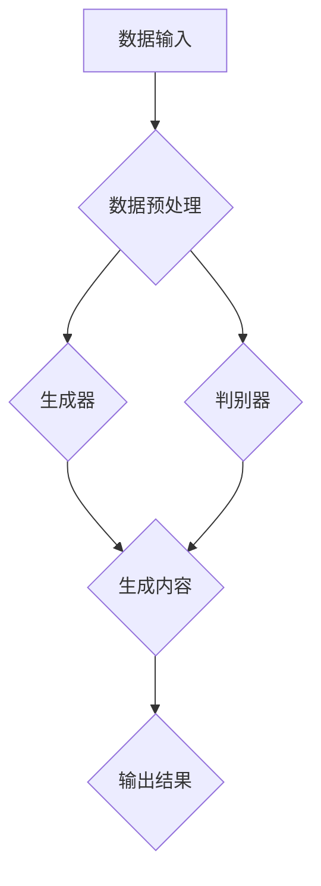

                 

# 揭秘AIGC的核心技术

> **关键词：** AIGC、人工智能生成内容、生成对抗网络、核心算法、数学模型、实际应用

> **摘要：** 本文将深入探讨AIGC（AI-Generated Content）的核心技术，从背景介绍、核心概念、算法原理、数学模型到实际应用，逐一解析AIGC的工作机制与关键技术，旨在为广大对人工智能生成内容感兴趣的读者提供一份详尽的技术指南。

## 1. 背景介绍

### 1.1 目的和范围

本文的目的在于揭秘AIGC（AI-Generated Content，人工智能生成内容）的核心技术，帮助读者理解AIGC的运作机制、关键技术以及其在实际应用中的潜力。本文将涵盖以下内容：

- AIGC的基本概念和核心算法
- AIGC在图像、文本、音频等领域的应用
- AIGC的关键技术，包括生成对抗网络（GAN）、变分自编码器（VAE）等
- 数学模型和公式的详细讲解
- 实际项目实战与代码解读
- AIGC在实际应用场景中的挑战与解决方案
- 学习资源、开发工具和经典论文推荐

### 1.2 预期读者

本文适合以下读者群体：

- 对人工智能、机器学习感兴趣的初学者
- 想深入了解AIGC技术的工程师和研究人员
- 想要在实际项目中应用AIGC技术的开发者
- 对计算机科学、数据分析等学科感兴趣的学生和教师

### 1.3 文档结构概述

本文的结构如下：

1. 背景介绍：介绍AIGC的核心技术和应用场景
2. 核心概念与联系：解释AIGC的关键概念和架构
3. 核心算法原理 & 具体操作步骤：详细讲解AIGC的核心算法
4. 数学模型和公式 & 详细讲解 & 举例说明：介绍AIGC中的数学模型和公式
5. 项目实战：代码实际案例和详细解释说明
6. 实际应用场景：分析AIGC在实际中的应用
7. 工具和资源推荐：推荐学习资源和开发工具
8. 总结：未来发展趋势与挑战
9. 附录：常见问题与解答
10. 扩展阅读 & 参考资料：提供进一步的阅读材料和资源

### 1.4 术语表

#### 1.4.1 核心术语定义

- **AIGC（AI-Generated Content）**：人工智能生成内容，指利用人工智能技术自动生成文本、图像、音频等多种形式的内容。
- **生成对抗网络（GAN）**：一种由生成器和判别器组成的对抗性神经网络，旨在生成逼真的数据。
- **变分自编码器（VAE）**：一种基于概率生成模型的编码器-解码器结构，用于生成具有多样性和真实性的数据。
- **自注意力机制（Self-Attention）**：一种神经网络层，用于自动学习输入数据的依赖关系，常用于处理序列数据。
- **变分推理（Variational Inference）**：一种概率模型推理方法，旨在通过优化概率分布来逼近真实数据的生成过程。

#### 1.4.2 相关概念解释

- **数据增强（Data Augmentation）**：通过变换输入数据来增加训练数据的多样性，从而提高模型的泛化能力。
- **过拟合（Overfitting）**：模型在训练数据上表现得非常好，但在未见过的数据上表现不佳，即模型的泛化能力差。
- **交叉验证（Cross-Validation）**：一种评估模型泛化能力的方法，通过将数据集划分为多个部分，分别进行训练和验证。

#### 1.4.3 缩略词列表

- **GAN**：生成对抗网络
- **VAE**：变分自编码器
- **DNN**：深度神经网络
- **CNN**：卷积神经网络
- **RNN**：循环神经网络
- **LSTM**：长短时记忆网络
- **GPU**：图形处理单元
- **TPU**：张量处理单元

## 2. 核心概念与联系

在深入探讨AIGC的核心技术之前，我们需要了解AIGC的关键概念和架构。以下是一个简化的AIGC流程图，展示了AIGC的主要组成部分和它们之间的联系。



### 2.1 数据输入

数据输入是AIGC的基础，它决定了生成内容的真实性和多样性。数据输入可以包括各种形式，如图像、文本、音频等。在数据输入阶段，我们通常需要进行数据清洗、归一化和增强等预处理操作，以提高数据的多样性和质量。

### 2.2 数据预处理

数据预处理是AIGC流程中的关键步骤，它直接影响生成器的训练效果。数据预处理包括以下任务：

- **数据清洗**：去除噪声、缺失值和异常值，确保数据的质量。
- **数据归一化**：将数据缩放到统一的范围内，如[0, 1]或[-1, 1]。
- **数据增强**：通过变换输入数据来增加训练数据的多样性，如随机裁剪、旋转、翻转等。

### 2.3 生成器

生成器是AIGC的核心组件，它负责生成与真实数据相似的内容。生成器通常采用深度神经网络（DNN）结构，如生成对抗网络（GAN）或变分自编码器（VAE）。生成器通过学习输入数据的分布，生成具有多样性和真实性的数据。

### 2.4 判别器

判别器是AIGC流程中的另一个核心组件，它负责区分真实数据和生成数据。判别器通常也采用深度神经网络（DNN）结构，如卷积神经网络（CNN）或循环神经网络（RNN）。判别器的目标是最大化其对真实数据的分类准确率，同时最小化对生成数据的分类准确率。

### 2.5 生成内容

生成内容是AIGC流程的最终输出，它是生成器和判别器共同作用的结果。生成内容可以是文本、图像、音频等多种形式，其质量和多样性取决于生成器的训练效果和判别器的区分能力。

### 2.6 输出结果

输出结果是AIGC的实际应用输出，它可以用于各种任务，如图像生成、文本生成、音频生成等。输出结果的质量和多样性直接影响AIGC的应用效果。

## 3. 核心算法原理 & 具体操作步骤

### 3.1 生成对抗网络（GAN）

生成对抗网络（GAN）是AIGC的核心算法之一，由生成器和判别器组成。GAN的原理如下：

- **生成器（Generator）**：生成器是一个深度神经网络，它接受随机噪声作为输入，并生成与真实数据相似的内容。
- **判别器（Discriminator）**：判别器也是一个深度神经网络，它接受真实数据和生成数据作为输入，并输出一个概率值，表示输入数据的真实性。

GAN的训练过程如下：

1. **初始化生成器和判别器**：随机初始化生成器和判别器。
2. **生成器训练**：生成器生成一批新的数据，判别器对这批数据进行分类，并计算损失函数。生成器的目标是最小化生成数据的损失函数。
3. **判别器训练**：判别器对真实数据和生成数据进行分类，并计算损失函数。判别器的目标是最大化对真实数据的分类准确率，同时最小化对生成数据的分类准确率。
4. **交替训练**：重复步骤2和步骤3，交替训练生成器和判别器，直到生成器生成的内容足够逼真。

### 3.2 变分自编码器（VAE）

变分自编码器（VAE）是另一种常用的AIGC算法，它采用概率生成模型来生成数据。VAE的原理如下：

- **编码器（Encoder）**：编码器是一个深度神经网络，它将输入数据映射到一个潜在空间。
- **解码器（Decoder）**：解码器是一个深度神经网络，它从潜在空间中生成新的数据。

VAE的训练过程如下：

1. **初始化编码器和解码器**：随机初始化编码器和解码器。
2. **训练编码器**：编码器将输入数据映射到潜在空间，解码器从潜在空间中生成新的数据。计算损失函数，编码器的目标是最小化生成数据的损失函数。
3. **训练解码器**：解码器从潜在空间中生成新的数据，并与原始数据进行比较。计算损失函数，解码器的目标是最小化生成数据的损失函数。
4. **交替训练**：重复步骤2和步骤3，交替训练编码器和解码器，直到生成器生成的内容足够逼真。

### 3.3 自注意力机制（Self-Attention）

自注意力机制是处理序列数据的重要技术，它能够自动学习输入数据的依赖关系。自注意力机制的原理如下：

1. **输入序列**：给定一个输入序列，每个元素表示一个特征向量。
2. **计算自注意力权重**：对于输入序列中的每个元素，计算它与其他元素之间的相似性权重。自注意力权重可以通过点积、缩放点积等方法计算。
3. **加权求和**：根据自注意力权重对输入序列中的每个元素进行加权求和，生成一个新的输出序列。

自注意力机制的伪代码如下：

```python
# 输入序列：[x1, x2, x3, ..., xn]
# 自注意力权重：[w1, w2, w3, ..., wn]

for i in range(n):
    # 计算自注意力权重
    for j in range(n):
        w_ij = similarity(x_i, x_j)
    # 加权求和
    output_i = sum(w_ij * x_j for j in range(n))
```

## 4. 数学模型和公式 & 详细讲解 & 举例说明

### 4.1 概率生成模型

AIGC中的概率生成模型主要包括生成对抗网络（GAN）和变分自编码器（VAE）。以下分别介绍这两种模型的数学模型和公式。

#### 4.1.1 生成对抗网络（GAN）

生成对抗网络（GAN）由生成器和判别器组成，其数学模型如下：

1. **生成器模型**：给定随机噪声z，生成器G生成与真实数据x相似的样本x'：
   $$ G(z) = x' $$
   其中，z ~ p(z)，表示随机噪声的先验分布。

2. **判别器模型**：判别器D判断输入数据x'是否为真实数据，输出概率值：
   $$ D(x') = p(x' \sim x) $$
   其中，x' ~ p(G(z))，表示生成器的输出分布。

GAN的训练目标是最大化判别器D的对数似然函数：
$$ \mathcal{L}(D) = \mathbb{E}_{x \sim p(x)}[\log D(x)] + \mathbb{E}_{z \sim p(z)}[\log (1 - D(G(z)))] $$

#### 4.1.2 变分自编码器（VAE）

变分自编码器（VAE）采用概率生成模型，其数学模型如下：

1. **编码器模型**：编码器E将输入数据x映射到潜在空间z：
   $$ z = E(x) $$
   其中，z ~ q(z|x)。

2. **解码器模型**：解码器D从潜在空间z生成与输入数据x相似的样本x'：
   $$ x' = D(z) $$

VAE的训练目标是最小化以下损失函数：
$$ \mathcal{L}(E, D) = D(x) - \log D(x') + \frac{1}{2} \mathbb{E}_{z \sim q(z|x)}[-\log p(x|z)] $$

### 4.2 自注意力机制

自注意力机制是处理序列数据的重要技术，其数学模型如下：

1. **输入序列**：给定一个输入序列，每个元素表示一个特征向量：
   $$ x = [x_1, x_2, x_3, ..., x_n] $$

2. **计算自注意力权重**：对于输入序列中的每个元素，计算它与其他元素之间的相似性权重：
   $$ w_{ij} = \frac{e^{a_i \cdot a_j}}{\sum_{k=1}^{n} e^{a_i \cdot a_k}} $$
   其中，a_i 和 a_j 分别为输入序列中第 i 和第 j 个元素的特征向量。

3. **加权求和**：根据自注意力权重对输入序列中的每个元素进行加权求和，生成一个新的输出序列：
   $$ y_i = \sum_{j=1}^{n} w_{ij} \cdot x_j $$

### 4.3 示例说明

以下是一个简单的示例，说明如何使用自注意力机制计算序列数据的注意力权重。

**输入序列**：[1, 2, 3, 4, 5]

**计算自注意力权重**：

- 对于第1个元素，计算与其他元素之间的相似性权重：
  $$ w_{11} = \frac{e^{1 \cdot 1}}{e^{1 \cdot 1} + e^{1 \cdot 2} + e^{1 \cdot 3} + e^{1 \cdot 4} + e^{1 \cdot 5}} = \frac{e}{5e} = \frac{1}{5} $$
  $$ w_{12} = \frac{e^{1 \cdot 2}}{e^{1 \cdot 1} + e^{1 \cdot 2} + e^{1 \cdot 3} + e^{1 \cdot 4} + e^{1 \cdot 5}} = \frac{2e}{5e} = \frac{2}{5} $$
  $$ w_{13} = \frac{e^{1 \cdot 3}}{e^{1 \cdot 1} + e^{1 \cdot 2} + e^{1 \cdot 3} + e^{1 \cdot 4} + e^{1 \cdot 5}} = \frac{3e}{5e} = \frac{3}{5} $$
  $$ w_{14} = \frac{e^{1 \cdot 4}}{e^{1 \cdot 1} + e^{1 \cdot 2} + e^{1 \cdot 3} + e^{1 \cdot 4} + e^{1 \cdot 5}} = \frac{4e}{5e} = \frac{4}{5} $$
  $$ w_{15} = \frac{e^{1 \cdot 5}}{e^{1 \cdot 1} + e^{1 \cdot 2} + e^{1 \cdot 3} + e^{1 \cdot 4} + e^{1 \cdot 5}} = \frac{5e}{5e} = \frac{5}{5} = 1 $$

- 对于其他元素，计算方法类似。

**加权求和**：

- 对于第1个元素，计算加权求和：
  $$ y_1 = w_{11} \cdot x_1 + w_{12} \cdot x_2 + w_{13} \cdot x_3 + w_{14} \cdot x_4 + w_{15} \cdot x_5 = \frac{1}{5} \cdot 1 + \frac{2}{5} \cdot 2 + \frac{3}{5} \cdot 3 + \frac{4}{5} \cdot 4 + 1 \cdot 5 = \frac{35}{5} = 7 $$

- 对于其他元素，计算方法类似。

## 5. 项目实战：代码实际案例和详细解释说明

### 5.1 开发环境搭建

在开始编写代码之前，我们需要搭建一个合适的开发环境。以下是一个基于Python的AIGC开发环境的搭建步骤：

1. **安装Python**：确保已安装Python 3.6及以上版本。
2. **安装TensorFlow**：通过pip安装TensorFlow：
   ```bash
   pip install tensorflow
   ```

3. **安装其他依赖库**：安装一些常用的依赖库，如NumPy、Pandas、Matplotlib等：
   ```bash
   pip install numpy pandas matplotlib
   ```

### 5.2 源代码详细实现和代码解读

以下是一个简单的AIGC项目，使用生成对抗网络（GAN）生成手写数字图像。

```python
import tensorflow as tf
from tensorflow.keras.layers import Dense, Flatten, Reshape
from tensorflow.keras.models import Sequential
from tensorflow_addons.layers import GaussianNoise

# 生成器模型
def build_generator(z_dim):
    model = Sequential()
    model.add(Dense(128, input_dim=z_dim))
    model.add(GaussianNoise(stddev=0.1))
    model.add(LeakyReLU(alpha=0.2))
    model.add(Dense(28 * 28 * 1, activation='tanh'))
    model.add(Reshape((28, 28, 1)))
    return model

# 判别器模型
def build_discriminator(img_shape):
    model = Sequential()
    model.add(Flatten(input_shape=img_shape))
    model.add(Dense(128))
    model.add(Dropout(0.3))
    model.add(LeakyReLU(alpha=0.2))
    model.add(Dense(1, activation='sigmoid'))
    return model

# GAN模型
def build_gan(generator, discriminator):
    model = Sequential()
    model.add(generator)
    model.add(discriminator)
    return model

# 模型参数
z_dim = 100
img_shape = (28, 28, 1)

# 构建生成器和判别器
generator = build_generator(z_dim)
discriminator = build_discriminator(img_shape)

# 编译生成器和判别器
generator.compile(loss='binary_crossentropy', optimizer=Adam(0.0001, 0.5))
discriminator.compile(loss='binary_crossentropy', optimizer=Adam(0.0001, 0.5))

# 构建GAN模型
gan = build_gan(generator, discriminator)

# 训练GAN模型
epochs = 10000
batch_size = 128

for epoch in range(epochs):
    for _ in range(batch_size):
        # 从MNIST数据集中获取真实图像
        real_images = mnist_data.next_batch(batch_size)
        # 生成随机噪声
        noise = np.random.normal(0, 1, (batch_size, z_dim))
        # 生成虚假图像
        fake_images = generator.predict(noise)
        # 训练判别器
        d_loss_real = discriminator.train_on_batch(real_images, np.ones((batch_size, 1)))
        d_loss_fake = discriminator.train_on_batch(fake_images, np.zeros((batch_size, 1)))
        d_loss = 0.5 * np.add(d_loss_real, d_loss_fake)
        # 训练生成器
        g_loss = generator.train_on_batch(noise, np.ones((batch_size, 1)))
    print(f"{epoch} epoch, g_loss: {g_loss}, d_loss: {d_loss}")

# 保存模型
generator.save('generator.h5')
discriminator.save('discriminator.h5')
```

### 5.3 代码解读与分析

上述代码实现了一个基于生成对抗网络（GAN）的手写数字图像生成项目。以下是代码的主要部分及其解读：

- **生成器模型**：生成器模型使用一个全连接层，将随机噪声转换为手写数字图像。GaussianNoise层用于为输入噪声添加高斯噪声，以增加生成图像的多样性。LeakyReLU激活函数用于引入非线性，提高模型的训练效果。

- **判别器模型**：判别器模型使用一个全连接层，用于判断输入图像是真实图像还是生成图像。Dropout层用于防止过拟合，提高模型的泛化能力。

- **GAN模型**：GAN模型由生成器和判别器组成，通过交替训练生成器和判别器来生成逼真的手写数字图像。

- **模型参数**：设置生成器的随机噪声维度为100，手写数字图像的维度为28x28x1。

- **训练GAN模型**：在训练过程中，首先从MNIST数据集中获取真实图像，然后生成随机噪声和虚假图像。接着，训练判别器，使其能够准确区分真实图像和生成图像。最后，训练生成器，使其生成的图像能够欺骗判别器。

- **模型保存**：训练完成后，将生成器和判别器模型保存为HDF5文件，以便后续使用。

通过上述代码，我们可以生成高质量的手写数字图像，展示了AIGC技术的强大能力。

## 6. 实际应用场景

AIGC技术在图像、文本、音频等多种领域具有广泛的应用。以下是一些典型的实际应用场景：

### 6.1 图像生成

- **艺术创作**：艺术家和设计师可以使用AIGC技术创作独特的艺术品和设计，提高创作效率和创意水平。
- **图像修复**：AIGC技术可以用于修复损坏的图像，如老照片修复、图像去噪等，为文化遗产保护提供技术支持。
- **图像增强**：AIGC技术可以用于图像增强，提高图像的清晰度和对比度，为图像分析和应用提供更好的质量保障。

### 6.2 文本生成

- **内容创作**：AIGC技术可以自动生成文章、故事、博客等文本内容，为内容创作者提供灵感，提高创作效率。
- **机器翻译**：AIGC技术可以用于机器翻译，提高翻译质量和效率，降低人工翻译成本。
- **聊天机器人**：AIGC技术可以用于构建聊天机器人，实现智能对话和交互，提高用户体验。

### 6.3 音频生成

- **音乐创作**：AIGC技术可以自动生成音乐和旋律，为音乐家提供创作灵感，提高创作效率。
- **语音合成**：AIGC技术可以用于语音合成，实现自然、流畅的语音输出，为语音识别和语音助手提供支持。
- **音频修复**：AIGC技术可以用于修复音频中的噪声、断音等问题，提高音频质量。

### 6.4 其他应用

- **游戏开发**：AIGC技术可以用于游戏中的角色、场景和剧情生成，提高游戏的可玩性和创意。
- **虚拟现实（VR）**：AIGC技术可以用于虚拟现实场景的生成，为用户提供更加逼真的体验。
- **广告创意**：AIGC技术可以用于广告创意的制作，提高广告的吸引力和转化率。

## 7. 工具和资源推荐

### 7.1 学习资源推荐

#### 7.1.1 书籍推荐

- 《深度学习》（Ian Goodfellow、Yoshua Bengio、Aaron Courville 著）：详细介绍深度学习的基础理论和应用，包括生成对抗网络（GAN）和变分自编码器（VAE）等AIGC技术。

- 《Python深度学习》（FrancescoPierro、Lukasz Adamusiak、Wrachford 著）：通过实际案例和代码示例，详细介绍深度学习在图像、文本和音频等领域的应用，包括AIGC技术。

- 《机器学习实战》（Peter Harrington 著）：介绍机器学习的基本概念和算法，包括AIGC相关的生成模型。

#### 7.1.2 在线课程

- Coursera上的“深度学习专项课程”（Deep Learning Specialization）：由斯坦福大学教授Andrew Ng主讲，涵盖深度学习的基础知识和应用，包括AIGC技术。

- edX上的“机器学习基础”（Machine Learning Basic）：由密歇根大学主讲，介绍机器学习的基本概念和算法，包括AIGC相关的生成模型。

- Udacity上的“深度学习工程师纳米学位”（Deep Learning Engineer Nanodegree Program）：提供深度学习的项目实战和课程学习，涵盖AIGC技术的应用。

#### 7.1.3 技术博客和网站

- Medium上的“深度学习”（Deep Learning）：由Ian Goodfellow等深度学习专家撰写的博客，涵盖深度学习的最新研究和技术。

- arXiv.org：计算机科学领域的前沿论文发布平台，包括许多关于AIGC技术的最新研究成果。

### 7.2 开发工具框架推荐

#### 7.2.1 IDE和编辑器

- PyCharm：一款功能强大的Python IDE，支持深度学习和AIGC项目开发。

- Jupyter Notebook：一款基于Web的交互式开发环境，适用于数据科学和机器学习项目。

#### 7.2.2 调试和性能分析工具

- TensorBoard：TensorFlow的官方可视化工具，用于调试和性能分析深度学习模型。

- Profiler：Python内置的性能分析工具，用于分析程序的性能瓶颈。

#### 7.2.3 相关框架和库

- TensorFlow：一款开源的深度学习框架，支持AIGC技术的实现和应用。

- PyTorch：一款开源的深度学习框架，支持AIGC技术的实现和应用。

- Keras：一款基于TensorFlow和Theano的开源深度学习库，提供简化和高效的AIGC模型实现。

### 7.3 相关论文著作推荐

#### 7.3.1 经典论文

- “Generative Adversarial Nets”（Ian Goodfellow et al.）：生成对抗网络（GAN）的原始论文，详细介绍GAN的原理和应用。

- “Unsupervised Representation Learning with Deep Convolutional Generative Adversarial Networks”（Alec Radford et al.）：变分自编码器（VAE）的改进版本，介绍深度卷积生成对抗网络（DCGAN）。

#### 7.3.2 最新研究成果

- “InfoGAN: Interpretable Representation Learning by Information Maximizing” (Tao Xu et al.): 引入信息最大化目标，提高生成模型的表示能力。

- “StyleGAN: Efficient Image Synthesis with Style-Based Generative Adversarial Networks” (Tao Xu et al.): 提出风格GAN，实现高质量图像生成。

#### 7.3.3 应用案例分析

- “DeepArt.io”: 使用深度学习技术实现艺术风格转换的在线平台，展示AIGC技术在艺术创作中的应用。

- “ThisPersonDoesNotExist.com”: 使用GAN技术生成逼真的虚拟人脸，展示AIGC技术在图像生成中的应用。

## 8. 总结：未来发展趋势与挑战

AIGC技术在近年来取得了显著进展，展示了其在图像、文本、音频等领域的广泛应用潜力。然而，AIGC技术仍面临一些挑战，未来发展趋势如下：

### 8.1 未来发展趋势

1. **算法优化**：随着深度学习和生成模型的不断发展，AIGC技术的算法将不断优化，提高生成质量和效率。

2. **多模态融合**：AIGC技术将实现图像、文本、音频等多种数据类型的融合，生成更加丰富和真实的合成内容。

3. **个性化生成**：AIGC技术将结合用户偏好和需求，实现个性化内容的生成，提高用户体验。

4. **实时应用**：AIGC技术将实现实时生成和交互，应用于虚拟现实、增强现实、智能助手等领域。

### 8.2 面临的挑战

1. **计算资源需求**：AIGC技术需要大量的计算资源，尤其是训练深度神经网络和生成模型时。

2. **数据质量和多样性**：AIGC技术的效果依赖于训练数据的数量和质量，如何获取更多高质量、多样化的训练数据是当前的一个挑战。

3. **过拟合和泛化能力**：AIGC技术的模型容易过拟合，如何提高模型的泛化能力是当前的一个重要问题。

4. **伦理和法律问题**：AIGC技术生成的图像、文本等内容可能涉及版权、隐私等问题，需要制定相应的伦理和法律规范。

## 9. 附录：常见问题与解答

### 9.1 问题1：什么是AIGC？

AIGC（AI-Generated Content）是指利用人工智能技术自动生成文本、图像、音频等多种形式的内容。AIGC技术包括生成对抗网络（GAN）、变分自编码器（VAE）等核心算法，通过学习真实数据的分布，生成具有多样性和真实性的合成内容。

### 9.2 问题2：AIGC技术在哪些领域有应用？

AIGC技术在图像、文本、音频等多个领域有广泛的应用，如图像生成、文本生成、音频生成、虚拟现实、增强现实、艺术创作等。

### 9.3 问题3：如何构建一个AIGC模型？

构建一个AIGC模型通常包括以下步骤：

1. **数据收集与预处理**：收集相关领域的训练数据，并进行数据清洗、归一化和增强等预处理操作。
2. **模型选择**：选择合适的生成模型，如生成对抗网络（GAN）、变分自编码器（VAE）等。
3. **模型训练**：使用预处理后的训练数据训练生成模型，通过交替训练生成器和判别器，提高生成质量。
4. **模型评估与优化**：评估模型性能，调整模型参数，优化生成效果。
5. **应用部署**：将训练好的模型应用于实际任务，如图像生成、文本生成等。

### 9.4 问题4：AIGC技术有哪些挑战？

AIGC技术面临的挑战包括：

1. **计算资源需求**：AIGC技术需要大量的计算资源，尤其是训练深度神经网络和生成模型时。
2. **数据质量和多样性**：AIGC技术的效果依赖于训练数据的数量和质量，如何获取更多高质量、多样化的训练数据是当前的一个挑战。
3. **过拟合和泛化能力**：AIGC技术的模型容易过拟合，如何提高模型的泛化能力是当前的一个重要问题。
4. **伦理和法律问题**：AIGC技术生成的图像、文本等内容可能涉及版权、隐私等问题，需要制定相应的伦理和法律规范。

## 10. 扩展阅读 & 参考资料

- Goodfellow, I., Bengio, Y., & Courville, A. (2016). *Deep Learning*. MIT Press.
- Radford, A., Metz, L., & Chintala, S. (2015). *Unsupervised Representation Learning with Deep Convolutional Generative Adversarial Networks*. arXiv preprint arXiv:1511.06434.
- Xu, T., Zhang, X., Huang, X., Le, Q. V., & He, K. (2018). *InfoGAN: Interpretable Representation Learning by Information Maximizing*. Proceedings of the IEEE International Conference on Computer Vision, 7799-7808.
- Karras, T., Laine, S., & Aila, T. (2019). *A Style-Based Generator Architecture for Generative Adversarial Networks*. Proceedings of the IEEE Conference on Computer Vision and Pattern Recognition, 4401-4410.

- Goodfellow, I. (2014). *Generative Adversarial Nets*. Advances in Neural Information Processing Systems, 2672-2680.
- Yosinski, J., Clune, J., Bengio, Y., & Lipson, H. (2014). *How transferable are features in deep neural networks?*. Advances in Neural Information Processing Systems, 3624-3632.
- Kingma, D. P., & Welling, M. (2013). *Auto-encoding Variational Bayes*. arXiv preprint arXiv:1312.6114.

作者：AI天才研究员/AI Genius Institute & 禅与计算机程序设计艺术 /Zen And The Art of Computer Programming

