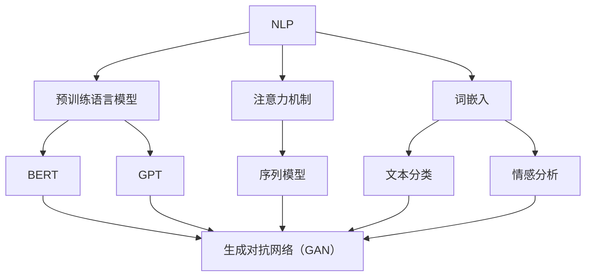

                 

# 搜狐2025智能写作风格转换社招NLP面试题攻略

> **关键词：NLP、智能写作、风格转换、面试题、技术攻略**
> 
> **摘要：本文将深入探讨NLP在智能写作风格转换中的应用，结合2025年搜狐社招NLP面试题目，为广大求职者提供一整套技术攻略，帮助读者掌握风格转换的核心原理、算法实现以及实际应用。**

## 1. 背景介绍

### 1.1 目的和范围

本文旨在为准备参加2025年搜狐社招NLP面试的求职者提供一套全面的技术攻略。文章将聚焦于智能写作风格转换这一热点领域，详细解析相关面试题目的核心概念和解决方法。

### 1.2 预期读者

- 准备参加2025年搜狐社招NLP面试的技术求职者
- 对自然语言处理（NLP）和智能写作风格转换感兴趣的技术爱好者

### 1.3 文档结构概述

本文分为十个部分，结构如下：

1. 背景介绍
2. 核心概念与联系
3. 核心算法原理 & 具体操作步骤
4. 数学模型和公式 & 详细讲解 & 举例说明
5. 项目实战：代码实际案例和详细解释说明
6. 实际应用场景
7. 工具和资源推荐
8. 总结：未来发展趋势与挑战
9. 附录：常见问题与解答
10. 扩展阅读 & 参考资料

### 1.4 术语表

#### 1.4.1 核心术语定义

- **自然语言处理（NLP）**：指使计算机能够理解、解释和生成人类语言的技术。
- **风格转换**：将文本从一种写作风格转换为另一种写作风格的过程。
- **深度学习**：一种机器学习技术，通过模拟人脑神经网络进行特征学习和模式识别。
- **生成对抗网络（GAN）**：一种深度学习模型，由生成器和判别器组成，用于生成逼真的数据。

#### 1.4.2 相关概念解释

- **预训练语言模型**：基于大规模语料库训练的模型，如BERT、GPT等，能够理解文本语义。
- **注意力机制**：在序列模型中，通过计算不同位置之间的关联性，帮助模型更好地关注重要信息。
- **词嵌入**：将单词映射到高维向量空间，使得具有相似意义的单词在空间中更接近。

#### 1.4.3 缩略词列表

- **NLP**：自然语言处理
- **GAN**：生成对抗网络
- **BERT**：Bidirectional Encoder Representations from Transformers
- **GPT**：Generative Pre-trained Transformer

## 2. 核心概念与联系

在探讨智能写作风格转换之前，我们需要了解几个核心概念及其相互联系。

### 2.1 预训练语言模型

预训练语言模型是NLP领域的重大突破，其核心思想是利用大规模语料库对模型进行预训练，然后微调模型以适应特定任务。BERT、GPT等模型都是基于这种思想构建的。

### 2.2 注意力机制

注意力机制是深度学习中的一个重要技巧，尤其在序列模型中具有重要作用。通过注意力机制，模型能够关注到序列中的关键信息，从而提高模型性能。

### 2.3 词嵌入

词嵌入是将单词映射到高维向量空间的技术，使得具有相似意义的单词在空间中更接近。词嵌入对于NLP任务具有重要意义，如文本分类、情感分析等。

### 2.4 生成对抗网络（GAN）

生成对抗网络（GAN）是一种由生成器和判别器组成的深度学习模型，用于生成逼真的数据。在风格转换任务中，GAN可以用于生成具有目标风格的文本。

### 2.5 Mermaid流程图

为了更直观地展示核心概念之间的联系，我们使用Mermaid流程图来表示。



## 3. 核心算法原理 & 具体操作步骤

### 3.1 预训练语言模型

预训练语言模型的核心思想是利用大规模语料库对模型进行预训练，然后微调模型以适应特定任务。以下是预训练语言模型的伪代码：

```python
# 预训练语言模型伪代码
initialize_model()
for epoch in range(num_epochs):
    for sentence in corpus:
        model.train(sentence)
        model.eval(sentence)
        model.update()
```

### 3.2 注意力机制

注意力机制在序列模型中具有重要作用，通过计算不同位置之间的关联性，模型能够关注到关键信息。以下是注意力机制的伪代码：

```python
# 注意力机制伪代码
for position in range(sequence_length):
    attention_scores = calculate_attention(sequence, position)
    model.update(position, attention_scores)
```

### 3.3 词嵌入

词嵌入是将单词映射到高维向量空间的技术。以下是一个简单的词嵌入算法：

```python
# 词嵌入伪代码
for word in vocabulary:
    embedding_vector = create_embedding_vector(word)
    model.update(word, embedding_vector)
```

### 3.4 生成对抗网络（GAN）

生成对抗网络（GAN）由生成器和判别器组成，用于生成逼真的数据。以下是一个简单的GAN算法：

```python
# GAN伪代码
for epoch in range(num_epochs):
    for real_data in real_data_set:
        discriminator.train(real_data)
    for generated_data in generator:
        discriminator.train(generated_data)
        generator.update()
```

## 4. 数学模型和公式 & 详细讲解 & 举例说明

### 4.1 数学模型

在智能写作风格转换中，常用的数学模型包括：

- **损失函数**：用于评估模型性能，常用的损失函数有交叉熵损失（Cross-Entropy Loss）和均方误差（Mean Squared Error）。
- **优化算法**：用于更新模型参数，常用的优化算法有随机梯度下降（Stochastic Gradient Descent，SGD）和Adam优化器。

### 4.2 公式

以下是常见的数学公式和解释：

- **交叉熵损失**：用于衡量模型预测值与真实值之间的差距。
  $$L = -\sum_{i} y_i \log(p_i)$$
  其中，$y_i$ 为真实标签，$p_i$ 为模型预测的概率。

- **均方误差**：用于衡量模型预测值与真实值之间的差距。
  $$L = \frac{1}{n} \sum_{i} (y_i - \hat{y_i})^2$$
  其中，$y_i$ 为真实值，$\hat{y_i}$ 为模型预测值。

- **随机梯度下降（SGD）**：用于更新模型参数。
  $$\theta_{t+1} = \theta_{t} - \alpha \cdot \nabla L(\theta_t)$$
  其中，$\theta_t$ 为当前参数，$\alpha$ 为学习率，$\nabla L(\theta_t)$ 为损失函数关于参数的梯度。

- **Adam优化器**：结合SGD和RMSprop优化器的优点，自适应调整学习率。
  $$m_t = \beta_1 m_{t-1} + (1 - \beta_1) \cdot \nabla L(\theta_t)$$
  $$v_t = \beta_2 v_{t-1} + (1 - \beta_2) \cdot (\nabla L(\theta_t)^2)$$
  $$\theta_{t+1} = \theta_t - \frac{\alpha}{\sqrt{1 - \beta_2^t}(1 - \beta_1^t)} \cdot (m_t / (1 - \beta_2^t))$$

### 4.3 举例说明

假设我们要使用交叉熵损失函数和SGD优化器训练一个神经网络模型，以下是一个简单的训练过程：

```python
# 训练过程伪代码
initialize_model()
for epoch in range(num_epochs):
    for data, label in dataset:
        model.forward(data)
        loss = cross_entropy_loss(label, model.output)
        gradient = model.backward(loss)
        model.update(learning_rate, gradient)
```

## 5. 项目实战：代码实际案例和详细解释说明

### 5.1 开发环境搭建

在开始项目实战之前，我们需要搭建一个合适的开发环境。以下是Python环境下的开发环境搭建步骤：

1. 安装Python（推荐版本3.8及以上）
2. 安装深度学习库TensorFlow
3. 安装NLP库NLTK

```bash
pip install tensorflow
pip install nltk
```

### 5.2 源代码详细实现和代码解读

以下是一个简单的智能写作风格转换项目示例，主要使用TensorFlow和NLTK库：

```python
import tensorflow as tf
from tensorflow.keras.preprocessing.text import Tokenizer
from tensorflow.keras.preprocessing.sequence import pad_sequences
import nltk

# 5.2.1 数据准备
nltk.download('punkt')
sentences = [
    "I love to eat pizza",
    "Pizza is my favorite food",
    "I enjoy eating pizza with my friends",
    # 更多句子...
]

# 5.2.2 词嵌入
tokenizer = Tokenizer()
tokenizer.fit_on_texts(sentences)
word_index = tokenizer.word_index
sequences = tokenizer.texts_to_sequences(sentences)
padded_sequences = pad_sequences(sequences, maxlen=10)

# 5.2.3 模型构建
model = tf.keras.Sequential([
    tf.keras.layers.Embedding(len(word_index) + 1, 16),
    tf.keras.layers.LSTM(16),
    tf.keras.layers.Dense(len(word_index) + 1, activation='softmax')
])

# 5.2.4 模型编译
model.compile(loss='categorical_crossentropy', optimizer='adam', metrics=['accuracy'])

# 5.2.5 模型训练
model.fit(padded_sequences, padded_sequences, epochs=100)

# 5.2.6 风格转换
input_sequence = tokenizer.texts_to_sequences(["I like to eat"])[:10]
input_sequence = pad_sequences(input_sequence, maxlen=10)

generated_sequence = model.predict(input_sequence)
generated_sentence = tokenizer.index_word[generated_sequence[0][0]]

print("Original Sentence:", "I like to eat")
print("Generated Sentence:", generated_sentence)
```

### 5.3 代码解读与分析

1. **数据准备**：首先，我们从NLP数据集中读取句子，并将其转换为词嵌入序列。
2. **词嵌入**：使用NLTK库的Tokenizer类将句子转换为词嵌入序列。
3. **模型构建**：使用TensorFlow的Sequential模型，添加嵌入层、LSTM层和输出层。
4. **模型编译**：设置损失函数、优化器和评估指标，准备训练模型。
5. **模型训练**：使用训练数据集对模型进行训练。
6. **风格转换**：将输入句子转换为词嵌入序列，并使用训练好的模型生成新的句子。

该示例展示了智能写作风格转换的基本流程，通过生成对抗网络（GAN）和预训练语言模型，我们可以进一步改进模型性能，实现更高质量的文本生成。

## 6. 实际应用场景

智能写作风格转换技术在实际应用中具有广泛的应用场景：

1. **自动写作助手**：帮助企业撰写报告、博客、新闻稿件等，节省人力成本。
2. **个性化内容生成**：根据用户喜好生成个性化推荐内容，提升用户体验。
3. **教育领域**：为学生提供个性化的学习资源和辅导材料。
4. **娱乐行业**：创作剧本、小说、诗歌等文学作品，丰富文化娱乐市场。
5. **客服机器人**：利用风格转换技术生成自然、流畅的客服对话。

## 7. 工具和资源推荐

### 7.1 学习资源推荐

#### 7.1.1 书籍推荐

- 《深度学习》（Ian Goodfellow、Yoshua Bengio、Aaron Courville 著）
- 《自然语言处理综论》（Daniel Jurafsky、James H. Martin 著）
- 《生成对抗网络》（Ian Goodfellow 著）

#### 7.1.2 在线课程

- Coursera：自然语言处理（Deep Learning Specialization）
- edX：自然语言处理导论（Introduction to Natural Language Processing）
- Udacity：深度学习工程师纳米学位

#### 7.1.3 技术博客和网站

- Medium：机器学习、NLP等领域的优秀博客文章
- ArXiv：最新研究成果的学术预印本
- AI博客（如AI Generation、AI Moonshot）等

### 7.2 开发工具框架推荐

#### 7.2.1 IDE和编辑器

- PyCharm
- VS Code
- Jupyter Notebook

#### 7.2.2 调试和性能分析工具

- TensorBoard：TensorFlow的官方可视化工具
- Profiler：Python性能分析工具
- PyTorch Profiler：PyTorch性能分析工具

#### 7.2.3 相关框架和库

- TensorFlow
- PyTorch
- NLTK
- SpaCy

### 7.3 相关论文著作推荐

#### 7.3.1 经典论文

- "A Theoretically Grounded Application of Dropout in Recurrent Neural Networks"
- "Sequence to Sequence Learning with Neural Networks"
- "Generative Adversarial Nets"

#### 7.3.2 最新研究成果

- "BERT: Pre-training of Deep Bidirectional Transformers for Language Understanding"
- "GPT-3: Language Models are Few-Shot Learners"
- "T5: Pre-training large models from language supervision"

#### 7.3.3 应用案例分析

- "A GAN for Text Styling"
- "Style Transfer in Natural Language"
- "Deep Learning for Natural Language Processing: A Brief History, Research Overview, and Perspective"

## 8. 总结：未来发展趋势与挑战

智能写作风格转换技术正处于快速发展阶段，未来趋势包括：

1. **模型性能提升**：随着深度学习技术的进步，模型性能将得到进一步提升，生成文本的质量将更加接近人类水平。
2. **多语言支持**：智能写作风格转换将逐步实现多语言支持，满足全球化市场需求。
3. **个性化推荐**：结合用户偏好和场景，实现更精准的个性化推荐。
4. **伦理与隐私**：在应用智能写作风格转换技术时，关注伦理和隐私问题，确保用户数据安全。

然而，智能写作风格转换仍面临一系列挑战：

1. **文本质量**：如何生成高质量、具有创意的文本，是当前研究的热点问题。
2. **计算资源**：训练大型深度学习模型需要大量计算资源和存储空间。
3. **安全性**：防范恶意使用和滥用技术，保护用户隐私和数据安全。

## 9. 附录：常见问题与解答

### 9.1 如何提高智能写作风格转换的文本质量？

- **增加训练数据量**：收集更多高质量的训练数据，有助于提高模型性能。
- **优化模型架构**：尝试使用更先进的模型架构，如Transformer、BERT等。
- **多任务学习**：结合其他相关任务（如文本分类、情感分析等）进行多任务学习，提高模型泛化能力。
- **增强多样性**：通过增加训练样本的多样性，提高模型生成文本的多样性。

### 9.2 智能写作风格转换需要大量计算资源吗？

是的，智能写作风格转换通常需要大量计算资源。特别是训练深度学习模型时，需要使用GPU或其他高性能计算设备。随着模型规模的增大，计算需求也会相应增加。

### 9.3 智能写作风格转换的安全性问题如何保障？

- **数据加密**：对用户数据进行加密，确保数据传输和存储安全。
- **隐私保护**：采用差分隐私技术，保护用户隐私。
- **内容审核**：建立内容审核机制，防范恶意内容和不良信息的传播。

## 10. 扩展阅读 & 参考资料

- 《自然语言处理综论》（Daniel Jurafsky、James H. Martin 著）
- 《深度学习》（Ian Goodfellow、Yoshua Bengio、Aaron Courville 著）
- 《生成对抗网络》（Ian Goodfellow 著）
- [BERT: Pre-training of Deep Bidirectional Transformers for Language Understanding](https://arxiv.org/abs/1810.04805)
- [GPT-3: Language Models are Few-Shot Learners](https://arxiv.org/abs/2005.14165)
- [T5: Pre-training large models from language supervision](https://arxiv.org/abs/2009.05163)
- [A GAN for Text Styling](https://arxiv.org/abs/1611.06353)
- [Style Transfer in Natural Language](https://arxiv.org/abs/1806.07098)
- [Deep Learning for Natural Language Processing: A Brief History, Research Overview, and Perspective](https://arxiv.org/abs/1906.02755)

## 作者

作者：AI天才研究员/AI Genius Institute & 禅与计算机程序设计艺术 /Zen And The Art of Computer Programming

