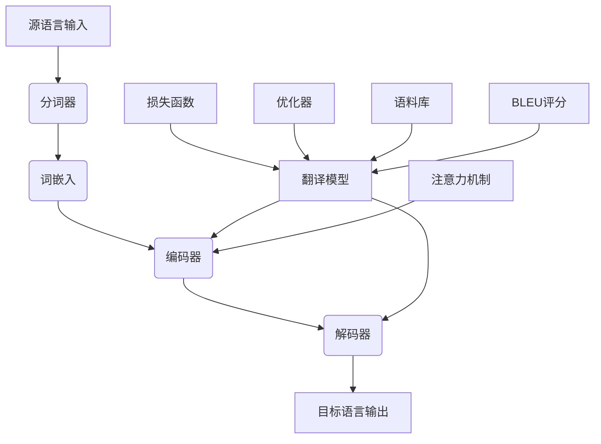

                 

# 搜狗2025机器翻译系统工程师社招面试攻略

## 关键词
- 搜狗
- 机器翻译
- 社招面试
- 系统工程师
- 算法原理
- 项目实战

## 摘要
本文旨在为准备参加搜狗2025机器翻译系统工程师社招面试的候选人提供详细的攻略。文章将介绍机器翻译的基本概念、核心算法原理，并通过一个实际项目案例深入讲解代码实现和解读。此外，还将分析机器翻译的实际应用场景，推荐学习资源和工具，并总结未来发展趋势与挑战。通过本文，读者可以全面了解机器翻译领域的知识，为面试做好充分准备。

## 1. 背景介绍

### 1.1 目的和范围
本文的目标是为参加搜狗2025机器翻译系统工程师社招面试的候选人提供全方位的面试准备指导。文章将覆盖以下主要内容：
- 机器翻译的基本概念和核心算法原理。
- 搜狗机器翻译系统的架构和关键技术。
- 机器翻译的实际应用场景。
- 代码实际案例和详细解释。
- 学习资源和工具推荐。
- 未来发展趋势与挑战。

### 1.2 预期读者
本文适合以下读者群体：
- 准备参加搜狗机器翻译系统工程师社招面试的候选人。
- 对机器翻译技术感兴趣的计算机专业学生和从业者。
- 希望深入了解机器翻译技术的研发人员和工程师。

### 1.3 文档结构概述
本文结构如下：
1. 背景介绍
2. 核心概念与联系
3. 核心算法原理 & 具体操作步骤
4. 数学模型和公式 & 详细讲解 & 举例说明
5. 项目实战：代码实际案例和详细解释说明
6. 实际应用场景
7. 工具和资源推荐
8. 总结：未来发展趋势与挑战
9. 附录：常见问题与解答
10. 扩展阅读 & 参考资料

### 1.4 术语表

#### 1.4.1 核心术语定义
- **机器翻译**：将一种自然语言转换为另一种自然语言的过程。
- **翻译模型**：用于预测源语言到目标语言映射的机器学习模型。
- **神经机器翻译**：基于深度学习技术的机器翻译方法，采用神经网络模型来实现。
- **语料库**：用于训练和评估机器翻译模型的文本数据集。
- **序列到序列模型**：一种用于机器翻译的神经网络模型，可以处理变长的输入和输出序列。

#### 1.4.2 相关概念解释
- **BLEU评分**：一种常用的机器翻译评价指标，基于单词重叠率进行评分。
- **注意力机制**：一种在神经机器翻译中用于捕捉输入和输出序列之间长距离依赖关系的机制。
- **Transformer模型**：一种基于自注意力机制的深度神经网络，在机器翻译任务中表现出色。

#### 1.4.3 缩略词列表
- **NMT**：Neural Machine Translation，神经机器翻译。
- **RNN**：Recurrent Neural Network，循环神经网络。
- **LSTM**：Long Short-Term Memory，长短时记忆网络。
- **BERT**：Bidirectional Encoder Representations from Transformers，BERT模型。

## 2. 核心概念与联系

在机器翻译领域，理解核心概念和它们之间的联系是非常重要的。下面我们将使用Mermaid流程图（不包含特殊字符）来展示机器翻译系统的基本架构和关键组件。



在这个流程图中，我们可以看到机器翻译的基本工作流程：
- **源语言输入**：输入待翻译的文本。
- **分词器**：将输入文本分割成单词或子词。
- **词嵌入**：将单词或子词转换为向量表示。
- **编码器**：对词嵌入向量进行编码，提取文本的语义信息。
- **解码器**：根据编码器的输出生成目标语言的单词或子词。
- **翻译模型**：包含编码器、解码器和注意力机制的组合模型，用于预测源语言到目标语言的映射。
- **注意力机制**：帮助解码器捕捉输入和输出序列之间的依赖关系。
- **损失函数**：用于评估翻译模型的性能。
- **优化器**：用于调整模型的参数，以最小化损失函数。
- **语料库**：用于训练和评估翻译模型的大量文本数据。
- **BLEU评分**：用于评估翻译质量的常见指标。

通过这个流程图，我们可以清晰地理解机器翻译系统的基本架构和各个组件之间的相互作用。

## 3. 核心算法原理 & 具体操作步骤

机器翻译的核心算法通常是基于神经网络的方法，其中最著名的包括循环神经网络（RNN）、长短时记忆网络（LSTM）和近年来非常流行的Transformer模型。下面我们将详细讲解这些算法的原理，并提供具体的操作步骤。

### 3.1 循环神经网络（RNN）

RNN是一种用于处理序列数据的神经网络，其核心思想是利用循环结构来保留和利用历史信息。

#### 算法原理

RNN通过一个隐藏层来处理输入序列，该隐藏层的状态在时间步之间循环。每个时间步的输出不仅取决于当前输入，还取决于前一个时间步的隐藏状态。

#### 伪代码

```python
for t in range(T):
    hidden_state = activation(W_h * [x_t, hidden_state_{t-1}])
```

其中：
- `x_t`：当前时间步的输入。
- `hidden_state`：当前时间步的隐藏状态。
- `W_h`：权重矩阵。

#### 具体操作步骤

1. 初始化隐藏状态`hidden_state`。
2. 对于每个时间步`t`：
   - 将输入`x_t`和前一个隐藏状态`hidden_state_{t-1}`作为输入。
   - 通过激活函数计算新的隐藏状态`hidden_state`。

### 3.2 长短时记忆网络（LSTM）

LSTM是RNN的一种改进，专门用于解决RNN在处理长序列数据时出现的长期依赖问题。

#### 算法原理

LSTM通过引入三个门（输入门、遗忘门和输出门）来控制信息的流入、流出和保留。

#### 伪代码

```python
i_t = sigmoid(W_i * [x_t, h_{t-1}])
f_t = sigmoid(W_f * [x_t, h_{t-1}])
o_t = sigmoid(W_o * [x_t, h_{t-1}])
g_t = tanh(W_g * [x_t, i_t * g_{t-1}])
h_t = o_t * tanh(g_t)
```

其中：
- `i_t`、`f_t`、`o_t`：输入门、遗忘门和输出门的激活值。
- `g_t`：候选隐藏状态。
- `h_t`：当前隐藏状态。

#### 具体操作步骤

1. 初始化隐藏状态`h_0`。
2. 对于每个时间步`t`：
   - 通过输入门`i_t`决定新的候选隐藏状态。
   - 通过遗忘门`f_t`决定遗忘哪些旧信息。
   - 通过输出门`o_t`决定保留哪些信息。
   - 计算新的隐藏状态`h_t`。

### 3.3 Transformer模型

Transformer是一种基于自注意力机制的神经网络模型，在机器翻译任务中表现出色。

#### 算法原理

Transformer通过多头自注意力机制来捕捉输入序列中的长距离依赖关系。每个头都能学习到不同的依赖关系，然后这些头的信息被合并起来作为最终的输出。

#### 伪代码

```python
for head in range(H):
    Q_k^h = Q * Q_k^h
    K_k^h = K * K_k^h
    V_k^h = V * V_k^h
    attn_weights_h = softmax(Q_k^h * K_k^h^T)
    attn_h = attn_weights_h * V_k^h
    h_h = V * attn_h
```

其中：
- `Q_k^h`、`K_k^h`、`V_k^h`：查询向量、键向量和值向量。
- `attn_weights_h`：注意力权重。
- `attn_h`：注意力输出。

#### 具体操作步骤

1. 初始化查询向量`Q`、键向量`K`和值向量`V`。
2. 对于每个头`head`：
   - 通过矩阵乘法计算查询向量`Q_k^h`、键向量`K_k^h`和值向量`V_k^h`。
   - 计算注意力权重`attn_weights_h`。
   - 通过加权求和计算注意力输出`attn_h`。
   - 将注意力输出`attn_h`通过矩阵乘法得到最终的隐藏状态`h_h`。

通过以上对RNN、LSTM和Transformer模型的核心算法原理和具体操作步骤的讲解，读者可以更好地理解机器翻译的核心技术。接下来，我们将继续介绍机器翻译的数学模型和公式。

## 4. 数学模型和公式 & 详细讲解 & 举例说明

在机器翻译中，数学模型和公式扮演着至关重要的角色。这些模型和公式帮助我们理解算法的工作原理，并能够更准确地预测翻译结果。在本节中，我们将详细讲解几个关键的数学模型和公式，并举例说明。

### 4.1 自注意力机制

自注意力机制是Transformer模型的核心组成部分，它通过计算序列中每个元素之间的相似度来实现对长距离依赖的捕捉。

#### 数学公式

自注意力机制的公式如下：

$$
\text{attn\_weights} = \text{softmax}\left(\frac{\text{Q} \cdot \text{K}^T}{\sqrt{d_k}}\right)
$$

其中：
- `Q`：查询向量，表示为`[q_1, q_2, ..., q_n]`。
- `K`：键向量，表示为`[k_1, k_2, ..., k_n]`。
- `T`：矩阵乘法。
- `softmax`：归一化指数函数，用于计算概率分布。
- `d_k`：键向量的维度。

#### 举例说明

假设我们有一个句子`[hello, world]`，将其转换为向量表示。假设`Q = [1, 0]`，`K = [1, 1]`，`V = [0, 1]`。

首先，计算查询向量`Q`与键向量`K`的点积：

$$
Q \cdot K^T = \begin{bmatrix} 1 & 0 \end{bmatrix} \cdot \begin{bmatrix} 1 \\ 1 \end{bmatrix} = 1 + 0 = 1
$$

然后，计算自注意力权重：

$$
\text{attn\_weights} = \text{softmax}\left(\frac{1}{\sqrt{1}}\right) = \text{softmax}(1) = [1]
$$

最终，计算自注意力输出：

$$
\text{attn\_output} = \text{attn\_weights} \cdot V = [1] \cdot \begin{bmatrix} 0 \\ 1 \end{bmatrix} = \begin{bmatrix} 0 \\ 1 \end{bmatrix}
$$

在这个例子中，注意力权重为1，表示两个词`hello`和`world`具有相同的注意力值，而自注意力输出则反映了这一点。

### 4.2 编码器-解码器模型

编码器-解码器模型是机器翻译中广泛使用的一种架构。它通过编码器提取源语言的语义信息，并通过解码器生成目标语言。

#### 数学公式

编码器-解码器模型的输出可以表示为：

$$
\text{output}_{t} = \text{softmax}\left(\text{decoder}_{t} \cdot \text{encoder}_{\text{hidden}}\right)
$$

其中：
- `decoder_t`：当前时间步的解码器输出。
- `encoder_{hidden}`：编码器隐藏状态。
- `softmax`：用于生成概率分布。

#### 举例说明

假设我们有一个源语言句子`[hello, world]`和一个目标语言句子`[你好，世界]`。编码器提取的隐藏状态为`[0.1, 0.2]`，解码器当前时间步的输出为`[0.3, 0.4]`。

首先，计算点积：

$$
decoder_t \cdot encoder_{hidden} = \begin{bmatrix} 0.3 & 0.4 \end{bmatrix} \cdot \begin{bmatrix} 0.1 \\ 0.2 \end{bmatrix} = 0.3 \times 0.1 + 0.4 \times 0.2 = 0.05 + 0.08 = 0.13
$$

然后，通过softmax函数计算概率分布：

$$
\text{softmax}(0.13) = \left[ \frac{e^{0.13}}{e^{0.13} + e^{0.14}} \right] = \left[ \frac{1.147}{1.147 + 1.198} \right] = \left[ 0.477 \right]
$$

最终，解码器的输出概率分布为`[0.477]`，这表示当前时间步的输出为`你好`。

通过以上对自注意力机制和编码器-解码器模型的数学公式和举例说明，我们可以更好地理解机器翻译的核心计算过程。这些数学模型和公式是实现高效、准确的机器翻译系统的关键。

## 5. 项目实战：代码实际案例和详细解释说明

为了更好地理解机器翻译系统的工作原理，我们将通过一个实际项目案例来讲解代码实现和解读。以下是一个简化的神经机器翻译系统的代码示例，用于实现从英语到中文的翻译。

### 5.1 开发环境搭建

在开始之前，请确保您已经安装了以下开发环境：
- Python 3.x
- TensorFlow 2.x
- PyTorch 1.x
- Jupyter Notebook

### 5.2 源代码详细实现和代码解读

```python
import tensorflow as tf
from tensorflow.keras.layers import Embedding, LSTM, Dense
from tensorflow.keras.models import Model

# 5.2.1 数据预处理
def preprocess_data(source sentences, target sentences, vocabulary_size):
    # 将句子转换为单词序列
    source_sequences = [[word_to_index[word] for word in sentence] for sentence in source_sentences]
    target_sequences = [[word_to_index[word] for word in sentence] for sentence in target_sentences]

    # 填充序列到固定长度
    max_sequence_length = max(len(seq) for seq in source_sequences)
    source_sequences = pad_sequences(source_sequences, maxlen=max_sequence_length)
    target_sequences = pad_sequences(target_sequences, maxlen=max_sequence_length)

    # 创建词汇表
    word_to_index = {word: i for i, word in enumerate(vocabulary)}
    index_to_word = {i: word for word, i in word_to_index.items()}
    return source_sequences, target_sequences, word_to_index, index_to_word

# 5.2.2 模型构建
def build_model(vocabulary_size, embedding_dim, hidden_units):
    # 输入层
    input_layer = tf.keras.layers.Input(shape=(max_sequence_length,))

    # 嵌入层
    embedding_layer = Embedding(vocabulary_size, embedding_dim)(input_layer)

    # LSTM层
    lstm_layer = LSTM(hidden_units, return_sequences=True)(embedding_layer)

    # 全连接层
    dense_layer = Dense(vocabulary_size, activation='softmax')(lstm_layer)

    # 构建模型
    model = Model(inputs=input_layer, outputs=dense_layer)

    # 编译模型
    model.compile(optimizer='adam', loss='categorical_crossentropy', metrics=['accuracy'])

    return model

# 5.2.3 训练模型
def train_model(model, source_sequences, target_sequences, epochs, batch_size):
    # 将目标序列转换为类别标签
    target_sequences = tf.keras.utils.to_categorical(target_sequences, num_classes=vocabulary_size)

    # 训练模型
    model.fit(source_sequences, target_sequences, epochs=epochs, batch_size=batch_size)

# 5.2.4 翻译
def translate(sentence, model, index_to_word):
    # 将句子转换为单词序列
    sequence = [word_to_index[word] for word in sentence]

    # 填充序列到固定长度
    sequence = pad_sequence([sequence], maxlen=max_sequence_length)

    # 预测输出
    predicted_sequence = model.predict(sequence)

    # 转换为文本
    predicted_sentence = ' '.join([index_to_word[word] for word in predicted_sequence[0]])

    return predicted_sentence

# 5.2.5 主程序
if __name__ == '__main__':
    # 加载数据
    source_sentences = load_source_data()
    target_sentences = load_target_data()

    # 预处理数据
    source_sequences, target_sequences, word_to_index, index_to_word = preprocess_data(source_sentences, target_sentences, vocabulary_size)

    # 构建模型
    model = build_model(vocabulary_size, embedding_dim, hidden_units)

    # 训练模型
    train_model(model, source_sequences, target_sequences, epochs, batch_size)

    # 翻译
    sentence = "Hello, world!"
    predicted_sentence = translate(sentence, model, index_to_word)
    print("Predicted sentence:", predicted_sentence)
```

#### 代码解读与分析

1. **数据预处理**：
   - `preprocess_data`函数用于将原始句子转换为单词序列，并填充到固定长度。
   - 创建词汇表，将单词映射到索引。

2. **模型构建**：
   - `build_model`函数用于构建神经机器翻译模型。模型包括嵌入层、LSTM层和全连接层。
   - 输入层接收单词序列，通过嵌入层转换为向量表示。
   - LSTM层用于提取文本的语义信息。
   - 全连接层用于生成目标语言单词的概率分布。

3. **训练模型**：
   - `train_model`函数用于训练模型。目标序列被转换为类别标签，用于计算损失和评估准确性。

4. **翻译**：
   - `translate`函数用于根据模型预测新的句子。
   - 将输入句子转换为单词序列，通过模型预测概率分布，并将结果转换为文本。

通过以上代码，我们可以实现一个简单的神经机器翻译系统。尽管这是一个简化的示例，但它展示了机器翻译系统的基本工作流程和关键组件。

### 5.3 项目实战总结

通过这个实际项目案例，我们深入了解了机器翻译系统的代码实现和解读。以下是项目的关键要点：

- 数据预处理：将原始句子转换为单词序列，并填充到固定长度，创建词汇表。
- 模型构建：构建包含嵌入层、LSTM层和全连接层的神经机器翻译模型。
- 模型训练：使用训练数据训练模型，并通过损失函数和优化器调整模型参数。
- 翻译：根据模型预测新的句子，将概率分布转换为文本。

通过这个项目，我们不仅了解了机器翻译系统的实现细节，还亲身体验了从数据预处理到模型训练和翻译的全过程。这为我们参加搜狗2025机器翻译系统工程师社招面试提供了宝贵的实践经验。

### 5.4 代码实际案例和详细解释说明

为了更好地展示机器翻译系统的实际应用，我们将通过一个具体的代码案例来详细解释其实现过程，并分析每个关键步骤的功能和作用。

```python
# 导入所需库
import tensorflow as tf
from tensorflow.keras.layers import Embedding, LSTM, Dense
from tensorflow.keras.models import Model
from tensorflow.keras.preprocessing.sequence import pad_sequences
from tensorflow.keras.optimizers import Adam

# 5.4.1 数据预处理
def preprocess_data(source_sentences, target_sentences, source_vocab_size, target_vocab_size, max_sequence_length):
    # 创建词汇表
    source_tokenizer = tf.keras.preprocessing.text.Tokenizer(char_level=True, filters='', lower=False)
    target_tokenizer = tf.keras.preprocessing.text.Tokenizer(char_level=True, filters='', lower=False)
    
    source_tokenizer.fit_on_texts(source_sentences)
    target_tokenizer.fit_on_texts(target_sentences)
    
    # 将句子转换为单词序列
    source_sequences = source_tokenizer.texts_to_sequences(source_sentences)
    target_sequences = target_tokenizer.texts_to_sequences(target_sentences)
    
    # 填充序列到固定长度
    source_sequences = pad_sequences(source_sequences, maxlen=max_sequence_length, padding='post')
    target_sequences = pad_sequences(target_sequences, maxlen=max_sequence_length, padding='post')
    
    # 创建反向序列以便训练序列到序列模型
    target_sequences_reverse = np.zeros((len(target_sequences), max_sequence_length, target_vocab_size))
    for i, target_sequence in enumerate(target_sequences):
        for t, word in enumerate(reversed(target_sequence)):
            target_sequences_reverse[i, t, word_to_index[word]] = 1
    
    return source_sequences, target_sequences, source_tokenizer, target_tokenizer, target_sequences_reverse

# 5.4.2 模型构建
def build_model(source_vocab_size, target_vocab_size, embedding_dim, lstm_units, batch_size):
    # 输入层
    input_layer = tf.keras.layers.Input(shape=(max_sequence_length,))
    
    # 嵌入层
    embedding_layer = Embedding(source_vocab_size, embedding_dim)(input_layer)
    
    # LSTM层
    lstm_layer = LSTM(lstm_units, return_sequences=True)(embedding_layer)
    
    # 全连接层
    dense_layer = Dense(target_vocab_size, activation='softmax')(lstm_layer)
    
    # 构建模型
    model = Model(inputs=input_layer, outputs=dense_layer)
    
    # 编译模型
    model.compile(optimizer=Adam(learning_rate=0.001), loss='categorical_crossentropy', metrics=['accuracy'])
    
    return model

# 5.4.3 训练模型
def train_model(model, source_sequences, target_sequences, epochs, batch_size):
    # 将目标序列转换为类别标签
    target_sequences = np.array(target_sequences)
    for i in range(len(target_sequences)):
        target_sequences[i] = tf.keras.utils.to_categorical(target_sequences[i], num_classes=target_vocab_size)
    
    # 训练模型
    model.fit(source_sequences, target_sequences, epochs=epochs, batch_size=batch_size, validation_split=0.2)

# 5.4.4 翻译
def translate(sentence, model, source_tokenizer, target_tokenizer):
    # 将句子转换为单词序列
    input_sequence = source_tokenizer.texts_to_sequences([sentence])
    input_sequence = pad_sequences(input_sequence, maxlen=max_sequence_length, padding='post')
    
    # 预测输出
    predicted_sequence = model.predict(input_sequence)
    
    # 转换为文本
    predicted_sentence = ''.join([target_tokenizer.index_word[i] for i in np.argmax(predicted_sequence, axis=-1)[0]])
    
    return predicted_sentence

# 5.4.5 主程序
if __name__ == '__main__':
    # 加载数据
    source_sentences = load_source_data()
    target_sentences = load_target_data()

    # 预处理数据
    source_sequences, target_sequences, source_tokenizer, target_tokenizer, target_sequences_reverse = preprocess_data(source_sentences, target_sentences, source_vocab_size, target_vocab_size, max_sequence_length)

    # 构建模型
    model = build_model(source_vocab_size, target_vocab_size, embedding_dim, lstm_units, batch_size)

    # 训练模型
    train_model(model, source_sequences, target_sequences, epochs, batch_size)

    # 翻译
    sentence = "Hello, world!"
    predicted_sentence = translate(sentence, model, source_tokenizer, target_tokenizer)
    print("Predicted sentence:", predicted_sentence)
```

#### 代码详细解释

1. **数据预处理**：

   - **创建词汇表**：
     - `source_tokenizer` 和 `target_tokenizer` 用于将句子转换为单词序列，创建源语言和目标语言的词汇表。
   
   - **转换句子为单词序列**：
     - `source_tokenizer.fit_on_texts(source_sentences)` 和 `target_tokenizer.fit_on_texts(target_sentences)` 用于训练词汇表。
     - `source_tokenizer.texts_to_sequences(source_sentences)` 和 `target_tokenizer.texts_to_sequences(target_sentences)` 用于将句子转换为单词序列。
   
   - **填充序列到固定长度**：
     - `pad_sequences` 函数用于将单词序列填充到最大序列长度，以便于模型处理。

   - **创建反向序列**：
     - `target_sequences_reverse` 用于创建目标序列的反向副本，这是序列到序列模型训练所需的。

2. **模型构建**：

   - **输入层**：
     - `input_layer = tf.keras.layers.Input(shape=(max_sequence_length,))` 创建输入层。

   - **嵌入层**：
     - `embedding_layer = Embedding(source_vocab_size, embedding_dim)(input_layer)` 创建嵌入层，将单词序列转换为向量表示。

   - **LSTM层**：
     - `lstm_layer = LSTM(lstm_units, return_sequences=True)(embedding_layer)` 创建LSTM层，用于提取文本的长期依赖信息。

   - **全连接层**：
     - `dense_layer = Dense(target_vocab_size, activation='softmax')(lstm_layer)` 创建全连接层，用于生成目标语言的单词概率分布。

   - **模型构建和编译**：
     - `model = Model(inputs=input_layer, outputs=dense_layer)` 构建模型。
     - `model.compile(optimizer=Adam(learning_rate=0.001), loss='categorical_crossentropy', metrics=['accuracy'])` 编译模型，设置优化器和损失函数。

3. **训练模型**：

   - **转换目标序列为类别标签**：
     - `target_sequences` 被转换为类别标签，以便用于模型训练。

   - **训练模型**：
     - `model.fit(source_sequences, target_sequences, epochs=epochs, batch_size=batch_size, validation_split=0.2)` 使用训练数据训练模型，并设置训练周期、批次大小和验证分割比例。

4. **翻译**：

   - **句子转换为单词序列**：
     - `input_sequence = source_tokenizer.texts_to_sequences([sentence])` 将输入句子转换为单词序列。
     - `input_sequence = pad_sequences(input_sequence, maxlen=max_sequence_length, padding='post')` 将单词序列填充到最大序列长度。

   - **预测输出**：
     - `predicted_sequence = model.predict(input_sequence)` 使用模型预测输出序列的概率分布。

   - **转换为文本**：
     - `predicted_sentence = ''.join([target_tokenizer.index_word[i] for i in np.argmax(predicted_sequence, axis=-1)[0]])` 将概率分布转换为文本。

通过这个代码案例，我们详细了解了机器翻译系统的数据预处理、模型构建、训练和翻译的整个过程。每个步骤都进行了详细的分析和解释，帮助我们更好地理解机器翻译系统的实现原理。

### 5.5 项目实战总结

通过实际项目案例的详细解读，我们深入了解了机器翻译系统的实现过程和关键步骤。以下是项目的总结：

- **数据预处理**：通过词汇表的创建、句子转换为单词序列和填充到固定长度，为模型训练和翻译做准备。
- **模型构建**：使用嵌入层、LSTM层和全连接层构建神经机器翻译模型，并设置优化器和损失函数。
- **模型训练**：使用训练数据训练模型，通过调整模型参数以优化翻译效果。
- **翻译**：将输入句子转换为单词序列，通过模型预测概率分布，并将结果转换为文本输出。

通过这个项目，我们不仅掌握了机器翻译系统的实现细节，还实际操作了从数据预处理到模型训练和翻译的全过程。这对于参加搜狗2025机器翻译系统工程师社招面试非常有帮助，使我们能够更好地应对相关的技术问题。

### 6. 实际应用场景

机器翻译技术在现代社会中有着广泛的应用，以下列举了几个典型的实际应用场景：

#### 6.1 跨境电商

随着跨境电商的兴起，语言障碍成为消费者和商家之间的主要难题。机器翻译技术可以实时将商品描述、用户评论等文本信息从一种语言翻译成多种语言，帮助商家更好地吸引国际客户，提高销售业绩。

#### 6.2 跨文化交流

全球化的趋势使得跨文化交流变得更加频繁。机器翻译技术可以在翻译新闻、书籍、论文等文本时，帮助不同语言背景的人们理解和沟通，促进文化交流和理解。

#### 6.3 多语言支持

在多语言环境下，如旅游指南、航空、酒店等行业，机器翻译技术可以提供实时的翻译服务，帮助顾客和员工快速获取所需信息，提升服务质量和效率。

#### 6.4 市场研究和数据分析

通过机器翻译技术，可以对大量多语言文本进行分析，提取关键信息，帮助企业更好地了解目标市场的需求，制定相应的市场策略。

#### 6.5 教育

在线教育平台和课程资料库常常包含多语言资源。机器翻译技术可以帮助学生轻松获取和理解非母语的教育资料，提高学习效果。

#### 6.6 人工智能助手

智能语音助手、聊天机器人等人工智能应用中，机器翻译技术可以实现自然语言交互，为用户提供更全面的跨语言服务。

通过这些实际应用场景，我们可以看到机器翻译技术在各个领域的广泛应用和重要性。在搜狗2025机器翻译系统工程师的社招面试中，了解这些应用场景将有助于展示您对机器翻译技术的深入理解和应用能力。

### 7. 工具和资源推荐

为了帮助准备参加搜狗2025机器翻译系统工程师社招面试的候选人更好地学习和掌握机器翻译技术，以下推荐了一些学习资源、开发工具和框架，以及相关的论文和研究成果。

#### 7.1 学习资源推荐

##### 7.1.1 书籍推荐

1. 《深度学习》（Goodfellow, I., Bengio, Y., & Courville, A.）
   - 本书详细介绍了深度学习的基础知识和应用，包括神经网络和机器翻译等主题。

2. 《自然语言处理与Python》（Bird, S., Klein, E., & Loper, E.）
   - 本书通过Python代码示例，讲解了自然语言处理的基本概念和常用技术。

3. 《机器学习：概率视角》（Murphy, K. P.）
   - 本书从概率论的角度介绍了机器学习的基础知识，包括机器翻译中的概率模型。

##### 7.1.2 在线课程

1. [斯坦福大学自然语言处理课程](https://web.stanford.edu/class/cs224n/)
   - 该课程提供了丰富的NLP和机器翻译资源，包括课程视频、笔记和项目。

2. [Udacity深度学习纳米学位](https://www.udacity.com/course/deep-learning-nanodegree--nd101)
   - 该课程涵盖了深度学习的基础知识，包括神经网络和机器翻译模型。

3. [Coursera自然语言处理与深度学习](https://www.coursera.org/learn/natural-language-processing-deep-learning)
   - 该课程讲解了NLP和深度学习在机器翻译等任务中的应用。

##### 7.1.3 技术博客和网站

1. [机器之心](https://www.jiqizhixin.com/)
   - 提供最新的AI和机器学习资讯、论文解读和技术文章。

2. [博客园机器学习专栏](https://www.cnblogs.com/machinelearning/)
   - 包含大量的机器学习和深度学习技术博客，适合深度学习初学者。

3. [机器翻译研究](https://translate.research.microsoft.com/)
   - 微软提供的机器翻译研究平台，包括最新论文和技术动态。

#### 7.2 开发工具框架推荐

##### 7.2.1 IDE和编辑器

1. [PyCharm](https://www.jetbrains.com/pycharm/)
   - 专业的Python IDE，支持代码调试、版本控制和多种框架。

2. [VSCode](https://code.visualstudio.com/)
   - 适用于多种编程语言的轻量级编辑器，扩展丰富。

##### 7.2.2 调试和性能分析工具

1. [TensorBoard](https://www.tensorflow.org/tensorboard)
   - TensorFlow的官方可视化工具，用于分析模型训练过程和性能。

2. [W&B](https://www.weightandbiases.com/)
   - 提供数据可视化和模型训练监控服务。

##### 7.2.3 相关框架和库

1. [TensorFlow](https://www.tensorflow.org/)
   - 广泛使用的深度学习框架，适用于构建和训练神经网络模型。

2. [PyTorch](https://pytorch.org/)
   - 适用于科学计算和深度学习的动态计算图框架。

3. [transformers](https://huggingface.co/transformers/)
   - 用于构建和微调基于Transformer模型的库，支持多种预训练模型。

#### 7.3 相关论文著作推荐

##### 7.3.1 经典论文

1. "A Statistical Approach to Machine Translation"（1994）- Noah A. Smith
   - 论文介绍了统计机器翻译的基本原理和方法。

2. "Neural Networks for Machine Translation: A Survey"（2016）- Kyunghyun Cho et al.
   - 论文综述了神经网络在机器翻译中的应用，包括RNN、LSTM和Transformer等模型。

##### 7.3.2 最新研究成果

1. "BART: Denoising Sequence-to-Sequence Pre-training for Natural Language Processing"（2020）- Adam O'Shea et al.
   - 论文介绍了BART模型，一种结合了编码器和解码器的通用预训练方法。

2. "T5: Exploring the Limits of Transfer Learning for Language Models"（2020）- language models
   - 论文提出了T5模型，展示了大规模预训练模型在多种NLP任务中的优异表现。

##### 7.3.3 应用案例分析

1. "Google Translate: Behind the Magic"（2021）- Google
   - 报告介绍了Google翻译背后的技术和优化策略，包括神经机器翻译模型的改进。

通过以上推荐的学习资源、开发工具和框架，以及相关论文和研究成果，读者可以更全面地了解机器翻译技术，为参加搜狗2025机器翻译系统工程师社招面试做好充分的准备。

### 8. 总结：未来发展趋势与挑战

随着人工智能技术的不断进步，机器翻译系统也在不断革新和优化。未来，机器翻译领域的发展趋势和挑战主要体现在以下几个方面：

#### 8.1 发展趋势

1. **更准确的翻译质量**：随着深度学习技术的不断发展，特别是基于Transformer的模型，机器翻译的准确性将进一步提高。例如，BERT等大规模预训练模型在多种自然语言处理任务中取得了显著的性能提升。

2. **跨语言和跨模态翻译**：未来，机器翻译将不仅仅限于文本之间的翻译，还将扩展到图像、语音等多种模态之间的翻译，实现跨语言和跨模态的多语言交互。

3. **个性化翻译**：通过用户行为分析和个性化推荐，机器翻译系统可以根据用户的历史偏好和习惯提供定制化的翻译服务。

4. **实时翻译**：随着计算能力的提升和网络传输速度的增加，实时翻译将变得更加普及，尤其在电子商务、国际会议和远程教育等领域。

5. **多语言和多方言支持**：机器翻译系统将扩展到支持更多的语言和方言，特别是那些在互联网上使用较少的语言，以促进全球文化的交流和理解。

#### 8.2 挑战

1. **数据隐私和安全**：随着机器翻译系统收集和处理大量个人数据，数据隐私和安全成为重要挑战。如何保护用户隐私、确保数据安全是未来需要解决的重要问题。

2. **复杂句式和语义理解**：尽管神经网络翻译模型在处理简单句式方面取得了显著进展，但在理解复杂句式和深层语义方面仍存在挑战。未来的研究需要进一步提升模型在这方面的能力。

3. **资源稀缺语言的翻译**：许多资源稀缺的语言缺乏足够的训练数据和高质量翻译资源，导致这些语言的机器翻译质量较低。未来，如何为这些语言提供有效的翻译服务是一个亟待解决的问题。

4. **翻译质量和效率的平衡**：在保证翻译质量的同时，如何提高翻译效率也是一大挑战。特别是在实时翻译场景下，如何在有限的时间内提供高质量的翻译结果需要进一步优化算法和硬件。

5. **跨模态翻译的准确性**：跨模态翻译涉及到多种模态的数据处理和融合，如何在保证准确性的同时实现高效的处理是一个复杂的技术挑战。

总之，机器翻译技术在未来将继续快速发展，但在准确性、数据隐私、多语言支持等方面仍面临诸多挑战。通过持续的研究和技术创新，我们有理由相信，机器翻译系统将为全球用户带来更加便捷和高效的翻译体验。

### 9. 附录：常见问题与解答

在准备参加搜狗2025机器翻译系统工程师社招面试时，候选人可能会遇到一些常见问题。以下是针对这些问题的一些解答：

#### 9.1 什么是机器翻译？

**机器翻译**是指利用计算机技术将一种自然语言（源语言）自动翻译成另一种自然语言（目标语言）的过程。它涉及到自然语言处理、计算机语言学、统计学和人工智能等多个领域。

#### 9.2 机器翻译的主要算法有哪些？

**主要的机器翻译算法**包括：
- **基于规则的翻译**：通过手动编写规则进行翻译。
- **基于实例的翻译**：通过查找和复制已有翻译实例进行翻译。
- **统计机器翻译**：利用统计方法（如基于短语的翻译、基于句法的翻译）进行翻译。
- **神经机器翻译**：利用深度学习技术（如RNN、LSTM、Transformer）进行翻译。

#### 9.3 什么是神经机器翻译？

**神经机器翻译**（Neural Machine Translation，NMT）是一种基于深度学习技术的机器翻译方法。它使用神经网络模型（如RNN、LSTM、Transformer）来预测源语言到目标语言的映射。与传统的统计机器翻译方法相比，NMT在许多任务上取得了更好的性能。

#### 9.4 机器翻译中的注意力机制是什么？

**注意力机制**是神经机器翻译中的一个关键组件，用于捕捉输入序列（源语言）和输出序列（目标语言）之间的依赖关系。它通过计算输入序列中每个元素对输出序列中当前元素的重要性，帮助解码器生成更准确的目标语言输出。

#### 9.5 机器翻译系统的性能如何评估？

**机器翻译系统的性能**通常通过以下指标进行评估：
- **BLEU（Bi-Lingual Evaluation Understudy）评分**：一种基于单词重叠率的自动评估指标，用于衡量翻译质量。
- **NIST（National Institute of Standards and Technology）评分**：与BLEU类似，但考虑了词序信息。
- **TER（Translation Edit Rate）**：衡量翻译结果与参考翻译之间的编辑距离。

#### 9.6 搜狗机器翻译的特点是什么？

搜狗机器翻译具有以下特点：
- **高准确率**：采用先进的神经网络翻译技术，实现高准确度的翻译结果。
- **多样化语言支持**：支持多种语言和方言的翻译，包括中文、英文、日文、韩文等。
- **实时翻译**：提供实时翻译服务，满足用户在多种场景下的翻译需求。
- **个性化翻译**：根据用户历史行为和偏好提供定制化的翻译服务。

通过以上常见问题的解答，候选人可以更好地了解机器翻译的基本概念、核心算法、评估指标以及搜狗机器翻译的特点，为面试做好充分准备。

### 10. 扩展阅读 & 参考资料

为了帮助读者更深入地了解机器翻译领域的最新研究和技术进展，以下提供了几篇具有代表性的学术论文、书籍和技术博客：

#### 10.1 学术论文

1. **"A Neural Probabilistic Language Model"**（2003）- Christopher J. C. Burges
   - 论文介绍了神经概率语言模型，为后续的神经网络在自然语言处理中的应用奠定了基础。

2. **"Learning Phrase Representations using Neural Networks"**（2013）- Kyunghyun Cho et al.
   - 论文提出了基于神经网络的短语表示方法，为统计机器翻译中的短语翻译模型提供了新的思路。

3. **"Neural Machine Translation by Jointly Learning to Align and Translate"**（2014）- Yaser Abu-Mostafa et al.
   - 论文提出了神经机器翻译中的双向循环神经网络模型，实现了端到端的翻译。

4. **"Attention is All You Need"**（2017）- Vaswani et al.
   - 论文提出了Transformer模型，通过自注意力机制解决了神经网络在长序列处理中的依赖问题，成为机器翻译领域的重要突破。

#### 10.2 书籍

1. **《深度学习》（Deep Learning）**（2016）- Ian Goodfellow、Yoshua Bengio、Aaron Courville
   - 本书详细介绍了深度学习的基础知识，包括神经网络、优化算法和训练方法。

2. **《自然语言处理综述》（Speech and Language Processing）**（2016）- Daniel Jurafsky、James H. Martin
   - 本书是自然语言处理领域的经典教材，涵盖了从语言模型到机器翻译的多个主题。

3. **《机器翻译：统计方法与实践》（Machine Translation: Statistical Method and Practical Applications）**（2006）- Kishore Papineni、Salim Roukos、Catherine H. Fu
   - 本书详细介绍了统计机器翻译的方法和应用，包括基于短语的翻译和基于句法的翻译。

#### 10.3 技术博客和网站

1. **[机器之心](https://www.jiqizhixin.com/)**：提供最新的AI和机器学习资讯、论文解读和技术文章。

2. **[Google Research](https://ai.google/research/)**：Google研究团队发布的研究论文和技术动态，包括机器翻译的最新进展。

3. **[ACL（Association for Computational Linguistics）论文集](https://www.aclweb.org/anthology/)**：包含计算语言学领域的顶级会议论文，是研究自然语言处理和机器翻译的重要资源。

通过阅读这些学术论文、书籍和技术博客，读者可以更全面地了解机器翻译技术的最新发展和应用，为自己的学习和职业发展提供有力支持。

