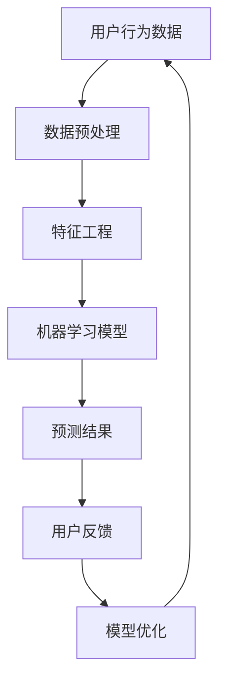

                 

# 搜索引擎的未来：从被动响应到主动预测

> **关键词：搜索引擎，主动预测，机器学习，数据挖掘，个性化搜索**

> **摘要：本文深入探讨了搜索引擎的未来发展，从传统的被动响应模式转向基于机器学习和数据挖掘的主动预测模型。文章通过分析核心概念、算法原理、数学模型和实际应用案例，展示了这一转变的必要性和可行性，并为未来的技术发展提供了有价值的见解。**

## 1. 背景介绍

### 1.1 目的和范围

本文旨在探讨搜索引擎的未来发展趋势，特别是从传统被动响应模型向主动预测模型的转变。我们将分析这一转变的背景、核心概念、算法原理、数学模型和实际应用，以期提供一个全面的理解和展望。

本文的范围包括：

1. **搜索引擎发展历史**：回顾搜索引擎从诞生至今的发展历程，了解其核心技术变革。
2. **主动预测与被动响应的区别**：深入探讨两种模式的优劣，以及主动预测如何提升用户体验。
3. **核心概念与算法原理**：介绍主动预测模型中的关键概念和算法原理，包括机器学习、数据挖掘等。
4. **数学模型与具体操作步骤**：阐述主动预测模型中的数学模型和具体操作步骤。
5. **实际应用案例**：通过具体案例展示主动预测模型在实际应用中的效果。
6. **未来发展趋势与挑战**：分析主动预测模型面临的挑战和未来的发展方向。

### 1.2 预期读者

本文适合以下读者群体：

1. **搜索引擎开发者**：了解搜索引擎的过去、现在和未来，为技术改进和创新提供思路。
2. **机器学习与数据挖掘研究者**：对搜索引擎中的机器学习和数据挖掘技术有深入了解，探讨其在主动预测中的应用。
3. **互联网行业从业者**：关注搜索引擎技术的发展趋势，了解其对行业的影响。
4. **技术爱好者**：对搜索引擎技术感兴趣，希望了解其背后的原理和未来发展方向。

### 1.3 文档结构概述

本文结构如下：

1. **引言**：介绍搜索引擎的未来发展，引出本文主题。
2. **背景介绍**：分析搜索引擎的演变历程，阐述主动预测的必要性。
3. **核心概念与联系**：介绍主动预测模型中的核心概念和联系。
4. **核心算法原理 & 具体操作步骤**：阐述主动预测模型的算法原理和操作步骤。
5. **数学模型和公式**：介绍主动预测模型中的数学模型和公式。
6. **项目实战**：通过实际案例展示主动预测模型的应用。
7. **实际应用场景**：探讨主动预测模型在不同场景中的应用。
8. **工具和资源推荐**：推荐相关学习资源和开发工具。
9. **总结**：总结主动预测模型的发展趋势和挑战。
10. **附录**：解答常见问题。
11. **扩展阅读**：提供进一步学习的资源。

### 1.4 术语表

#### 1.4.1 核心术语定义

- **搜索引擎**：一种用于查找和组织信息的系统，通过特定的算法和索引技术，从大量数据中快速定位用户所需信息。
- **被动响应**：传统的搜索引擎工作模式，用户输入查询，搜索引擎根据已有数据生成结果。
- **主动预测**：基于用户行为和兴趣预测用户可能需要的搜索结果，并在用户未主动查询时提供信息。
- **机器学习**：一种人工智能技术，通过训练模型从数据中学习，实现预测和决策。
- **数据挖掘**：从大量数据中发现有价值信息的过程，包括关联规则挖掘、分类、聚类等。

#### 1.4.2 相关概念解释

- **索引**：搜索引擎对文档内容的结构化处理，便于快速检索。
- **查询处理**：搜索引擎根据用户输入的查询，从索引中提取相关文档的过程。
- **相关性评估**：评估搜索结果与用户查询之间的相关程度，通常使用向量空间模型、PageRank等方法。
- **个性化搜索**：根据用户历史行为和偏好，为用户提供定制化的搜索结果。

#### 1.4.3 缩略词列表

- **SEO**：搜索引擎优化（Search Engine Optimization）
- **SEM**：搜索引擎营销（Search Engine Marketing）
- **NLP**：自然语言处理（Natural Language Processing）
- **CTR**：点击率（Click-Through Rate）

## 2. 核心概念与联系

在探讨搜索引擎的未来之前，我们需要了解一些核心概念和它们之间的联系。以下是一个Mermaid流程图，展示了主动预测模型中的关键概念和联系。



### 2.1 用户行为数据

用户行为数据是主动预测模型的基础。这些数据包括用户的搜索历史、浏览记录、点击行为等。通过对这些数据的收集和分析，我们可以了解用户的需求和偏好。

### 2.2 数据预处理

数据预处理是数据挖掘和分析的重要步骤。在这一阶段，我们需要清洗数据、处理缺失值、标准化数据等，以确保数据的质量和一致性。

### 2.3 特征工程

特征工程是数据挖掘中的关键步骤。在这一阶段，我们需要从原始数据中提取出对模型有用的特征，并通过特征选择和特征变换，提高模型的性能。

### 2.4 机器学习模型

机器学习模型是主动预测模型的核心。在这一阶段，我们使用机器学习算法（如决策树、随机森林、神经网络等）训练模型，使其能够根据用户行为数据预测用户可能需要的搜索结果。

### 2.5 预测结果

预测结果是主动预测模型的应用目标。通过机器学习模型的预测，我们可以为用户提供定制化的搜索结果，提高用户体验。

### 2.6 用户反馈

用户反馈是模型优化的重要依据。通过收集用户对搜索结果的反馈，我们可以评估模型的性能，并进行模型优化，以提高预测的准确性。

### 2.7 模型优化

模型优化是主动预测模型不断改进的过程。通过用户反馈和评估，我们可以调整模型参数、改进算法，提高预测性能。

## 3. 核心算法原理 & 具体操作步骤

主动预测模型的核心在于机器学习和数据挖掘技术。以下我们将详细介绍核心算法原理，并使用伪代码展示具体操作步骤。

### 3.1 机器学习算法原理

主动预测模型通常使用监督学习算法，如决策树、随机森林和神经网络等。以下是一个简单的决策树算法原理：

- **决策树**：一种树形结构，每个内部节点表示一个特征，每个分支表示该特征的不同取值，每个叶子节点表示一个预测结果。
- **训练过程**：通过递归划分数据集，使得每个子集的预测结果尽量一致。
- **预测过程**：根据用户行为数据，从根节点开始递归划分，直到达到叶子节点，输出预测结果。

伪代码如下：

```python
def build_decision_tree(data, target_attribute):
    if data全部属于同一类别:
        return 叶子节点，类别
    else:
        选择最优特征A
        创建节点A
        对于A的每个可能取值：
            分割数据集D为子集D1, D2, ..., Dn
            对于每个子集Di：
                build_decision_tree(Di, target_attribute)
        return 节点A和其子节点列表
```

### 3.2 数据挖掘算法原理

数据挖掘算法在主动预测模型中主要用于特征工程和模型评估。以下是一个简单的关联规则挖掘算法原理：

- **支持度**：表示某个规则在数据集中出现的频率。
- **置信度**：表示某个规则为真的概率。
- **最小支持度**：用于过滤掉不重要的规则。
- **最小置信度**：用于确保规则的准确性。

伪代码如下：

```python
def find_association_rules(data, min_support, min_confidence):
    规则列表 = []
    生成频繁项集
    对于每个频繁项集：
        对于每个项集的子集：
            计算支持度和置信度
            如果支持度 >= min_support 且 置信度 >= min_confidence：
                添加规则到规则列表
    return 规则列表
```

### 3.3 具体操作步骤

以下是主动预测模型的具体操作步骤：

1. **数据收集**：收集用户行为数据，如搜索历史、浏览记录、点击行为等。
2. **数据预处理**：清洗数据、处理缺失值、标准化数据等，确保数据的质量和一致性。
3. **特征工程**：从原始数据中提取有用的特征，进行特征选择和特征变换，提高模型的性能。
4. **模型训练**：选择合适的机器学习算法和数据挖掘算法，训练模型。
5. **模型评估**：使用交叉验证等评估方法，评估模型性能。
6. **模型优化**：根据评估结果，调整模型参数、改进算法，提高预测性能。
7. **预测结果**：根据用户行为数据，使用训练好的模型进行预测，为用户提供定制化的搜索结果。
8. **用户反馈**：收集用户对搜索结果的反馈，评估模型性能。
9. **模型迭代**：根据用户反馈，进行模型优化和迭代，提高预测准确性。

## 4. 数学模型和公式 & 详细讲解 & 举例说明

主动预测模型中的数学模型和公式对于理解模型的核心原理和实现方法至关重要。以下我们将介绍几种常用的数学模型和公式，并详细讲解它们的应用和示例。

### 4.1 向量空间模型

向量空间模型（Vector Space Model，VSM）是一种将文本转换为向量表示的方法，用于计算文档与查询之间的相似度。VSM假设文本是由一组词的集合组成的，每个词可以表示为一个向量。

- **向量表示**：对于文档 \( D \) 和查询 \( Q \)，它们的向量表示分别为 \( \mathbf{d} \) 和 \( \mathbf{q} \)，其中每个元素表示对应词的权重。

$$
\mathbf{d} = (w_1, w_2, ..., w_n)
$$

$$
\mathbf{q} = (q_1, q_2, ..., q_n)
$$

- **相似度计算**：通常使用余弦相似度（Cosine Similarity）来计算文档与查询之间的相似度。

$$
\text{similarity}(\mathbf{d}, \mathbf{q}) = \frac{\mathbf{d} \cdot \mathbf{q}}{||\mathbf{d}|| \cdot ||\mathbf{q}||}
$$

其中，\( \mathbf{d} \cdot \mathbf{q} \) 表示向量的点积，\( ||\mathbf{d}|| \) 和 \( ||\mathbf{q}|| \) 分别表示向量的模长。

### 4.2 PageRank算法

PageRank是一种基于链接分析（Link Analysis）的排名算法，用于评估网页的重要性。在主动预测模型中，我们可以将用户行为数据视为一种“链接”，用于评估用户兴趣。

- **初始排名**：每个网页的初始排名设置为 \( \frac{1}{N} \)，其中 \( N \) 是网页的总数。

$$
r(i)^0 = \frac{1}{N}
$$

- **迭代公式**：在每次迭代中，每个网页的排名等于其他网页排名的加权平均。

$$
r(i)^{t+1} = \frac{\sum_{j \in \text{outlinks}(i)} \frac{r(j)^t}{|\text{outlinks}(j)|}}{N-1}
$$

其中，\( \text{outlinks}(i) \) 表示网页 \( i \) 的出链集合，\( |\text{outlinks}(j)| \) 表示网页 \( j \) 的出链数量。

- **收敛条件**：当相邻两次迭代的排名差异小于某个阈值时，算法收敛。

$$
|r(i)^{t+1} - r(i)^t| < \epsilon
$$

### 4.3 逻辑回归

逻辑回归（Logistic Regression）是一种用于分类的机器学习算法，常用于用户行为预测。

- **模型公式**：

$$
\text{log-odds} = \ln\left(\frac{P(Y=1)}{1-P(Y=1)}\right) = \beta_0 + \beta_1x_1 + \beta_2x_2 + ... + \beta_nx_n
$$

- **预测公式**：

$$
P(Y=1) = \frac{1}{1 + e^{-\text{log-odds}}}
$$

其中，\( Y \) 表示目标变量，\( x_1, x_2, ..., x_n \) 表示特征变量，\( \beta_0, \beta_1, \beta_2, ..., \beta_n \) 是模型参数。

### 4.4 示例讲解

以下是一个简单的示例，展示如何使用向量空间模型和逻辑回归进行用户行为预测。

#### 示例：用户搜索偏好预测

假设我们有以下用户搜索数据：

- **文档集**：{“计算机”，“编程”，“人工智能”，“机器学习”，“数据挖掘”}
- **用户查询**：“编程”

首先，我们将文档和查询转换为向量表示：

- **文档向量**：

$$
\mathbf{d} = (1, 1, 1, 1, 0)
$$

- **查询向量**：

$$
\mathbf{q} = (0, 1, 0, 0, 0)
$$

然后，使用余弦相似度计算查询与文档之间的相似度：

$$
\text{similarity}(\mathbf{d}, \mathbf{q}) = \frac{\mathbf{d} \cdot \mathbf{q}}{||\mathbf{d}|| \cdot ||\mathbf{q}||} = \frac{1}{\sqrt{5} \cdot \sqrt{1}} = \frac{1}{\sqrt{5}}
$$

接下来，使用逻辑回归模型进行预测。假设我们已经训练好了一个逻辑回归模型，其参数为：

$$
\beta_0 = 0, \beta_1 = 1, \beta_2 = -1, \beta_3 = 1, \beta_4 = -1
$$

根据逻辑回归模型，我们可以计算用户查询“编程”的概率：

$$
\text{log-odds} = \beta_0 + \beta_1 \cdot 1 + \beta_2 \cdot (-1) + \beta_3 \cdot 1 + \beta_4 \cdot (-1) = 0
$$

$$
P(Y=1) = \frac{1}{1 + e^{-\text{log-odds}}} = \frac{1}{1 + e^{0}} = 0.5
$$

因此，用户查询“编程”的概率为0.5，表示用户对“编程”这一主题的兴趣程度适中。

通过以上示例，我们可以看到如何使用数学模型和公式进行用户行为预测，从而实现主动预测模型。

## 5. 项目实战：代码实际案例和详细解释说明

### 5.1 开发环境搭建

在进行项目实战之前，我们需要搭建一个适合开发的环境。以下是开发环境的基本配置：

1. **操作系统**：Windows 10 / macOS / Linux
2. **编程语言**：Python 3.8 或更高版本
3. **依赖库**：NumPy、Pandas、Scikit-learn、Matplotlib
4. **开发工具**：PyCharm、VSCode

### 5.2 源代码详细实现和代码解读

以下是一个简单的主动预测模型实现，用于预测用户对某一主题的兴趣程度。我们将使用Python编程语言，并利用NumPy、Pandas和Scikit-learn等库。

```python
import numpy as np
import pandas as pd
from sklearn.model_selection import train_test_split
from sklearn.ensemble import RandomForestClassifier
from sklearn.metrics import accuracy_score, classification_report

# 5.2.1 数据集准备

# 加载用户行为数据（示例数据）
data = pd.read_csv('user_behavior_data.csv')

# 特征工程
X = data[['search_history', 'browse_history']]
y = data['interest_level']

# 数据预处理
X_train, X_test, y_train, y_test = train_test_split(X, y, test_size=0.2, random_state=42)

# 5.2.2 模型训练

# 创建随机森林分类器
model = RandomForestClassifier(n_estimators=100, random_state=42)

# 训练模型
model.fit(X_train, y_train)

# 5.2.3 预测结果

# 预测测试集
y_pred = model.predict(X_test)

# 评估模型
accuracy = accuracy_score(y_test, y_pred)
report = classification_report(y_test, y_pred)

print("Accuracy:", accuracy)
print("Classification Report:")
print(report)

# 5.2.4 代码解读与分析

# 数据集准备
# 加载用户行为数据，包括搜索历史和浏览历史。这里使用的是CSV格式的示例数据。

# 特征工程
# 将原始数据转换为特征矩阵和标签向量。这里我们使用两个特征：搜索历史和浏览历史。

# 数据预处理
# 将数据集划分为训练集和测试集，用于模型训练和评估。

# 模型训练
# 创建随机森林分类器，并设置随机种子以确保结果可重复。使用训练集训练模型。

# 预测结果
# 使用训练好的模型对测试集进行预测。

# 评估模型
# 计算模型的准确率和分类报告，评估模型性能。

```

### 5.3 代码解读与分析

以下是代码的具体解读和分析：

1. **数据集准备**：
   - 加载用户行为数据，这些数据包括搜索历史和浏览历史。数据集通常以CSV格式存储，可以使用Pandas库轻松加载。
   - 进行特征工程，将原始数据转换为特征矩阵和标签向量。在这个例子中，我们使用两个特征：搜索历史和浏览历史。

2. **数据预处理**：
   - 将数据集划分为训练集和测试集，用于模型训练和评估。这里使用的是80%的数据作为训练集，20%的数据作为测试集。

3. **模型训练**：
   - 创建一个随机森林分类器，并设置随机种子以确保结果可重复。随机森林是一种集成学习方法，能够处理高维数据和噪声，具有良好的泛化能力。
   - 使用训练集数据训练模型。在训练过程中，随机森林将自动学习特征和标签之间的关系。

4. **预测结果**：
   - 使用训练好的模型对测试集进行预测。预测结果是一个概率分布，表示每个类别（兴趣级别）的可能性。

5. **评估模型**：
   - 计算模型的准确率和分类报告，评估模型性能。准确率表示模型预测正确的样本比例。分类报告提供了更详细的信息，如精确率、召回率、F1分数等。

通过以上步骤，我们实现了一个简单的主动预测模型，用于预测用户对某一主题的兴趣程度。在实际应用中，我们可以根据用户行为数据训练和优化模型，提高预测准确性。

## 6. 实际应用场景

主动预测模型在多个实际应用场景中具有广泛的应用，以下列举了一些典型的应用案例：

### 6.1 个性化搜索

个性化搜索是主动预测模型最直接的应用场景之一。通过分析用户的搜索历史、浏览记录和点击行为，搜索引擎可以预测用户可能感兴趣的内容，并在用户未主动查询时提供相关结果。例如，当用户频繁搜索“编程语言”时，搜索引擎可以主动推荐相关的学习资源和在线课程。

### 6.2 购物推荐

电商平台可以利用主动预测模型为用户提供个性化的购物推荐。通过分析用户的浏览历史、购买记录和评价，电商平台可以预测用户可能感兴趣的商品，并在用户访问时主动推荐。例如，当用户在电商平台上浏览了多个摄影器材时，平台可以推荐适合的相机和镜头。

### 6.3 社交网络

社交网络平台可以利用主动预测模型为用户推荐感兴趣的内容和好友。通过分析用户的点赞、评论和分享行为，平台可以预测用户可能感兴趣的话题和内容，并在用户的主页上推荐相关帖子。此外，平台还可以基于用户的社交关系，推荐可能认识的新好友。

### 6.4 娱乐推荐

在线视频平台和音乐平台可以利用主动预测模型为用户提供个性化的娱乐推荐。通过分析用户的观看历史、播放列表和评分，平台可以预测用户可能感兴趣的视频和音乐，并在用户登录时主动推荐。例如，当用户频繁观看科幻电影时，平台可以推荐其他类似的科幻作品。

### 6.5 金融风控

金融机构可以利用主动预测模型进行金融风险控制。通过分析用户的交易记录、账户行为和信用评分，模型可以预测用户是否存在违约风险，并为金融机构提供风险预警。例如，当用户频繁进行高风险投资时，金融机构可以采取措施降低风险。

### 6.6 健康监测

健康监测平台可以利用主动预测模型为用户提供个性化的健康建议。通过分析用户的健康数据、生活习惯和病史，模型可以预测用户可能存在的健康问题，并提前给出预防建议。例如，当用户出现高血压症状时，平台可以推荐健康饮食和运动计划。

通过以上实际应用场景，我们可以看到主动预测模型在各个领域的重要性和潜在价值。随着技术的不断发展和数据的不断积累，主动预测模型的应用前景将更加广阔。

## 7. 工具和资源推荐

### 7.1 学习资源推荐

#### 7.1.1 书籍推荐

1. **《机器学习》（周志华著）**：全面介绍了机器学习的基本概念、算法和应用，适合初学者和有一定基础的学习者。
2. **《数据挖掘：实用工具和技术》（Michael J. A. Berry等著）**：详细介绍了数据挖掘的基本原理和实用工具，涵盖关联规则挖掘、分类、聚类等常见算法。
3. **《搜索引擎原理：分析与实现》（Bing Liu等著）**：深入探讨了搜索引擎的核心技术和实现方法，包括索引、查询处理、相关性评估等。
4. **《深度学习》（Ian Goodfellow等著）**：全面介绍了深度学习的基本概念、算法和应用，是深度学习领域的经典教材。

#### 7.1.2 在线课程

1. **《机器学习基础》（吴恩达）**：这是一门非常受欢迎的在线课程，涵盖了机器学习的基本原理和算法，适合初学者入门。
2. **《数据挖掘》（Kaggle）**：Kaggle提供了一系列数据挖掘相关的课程和竞赛，适合有一定基础的学习者提升技能。
3. **《搜索引擎技术》（北京大学）**：这是一门专注于搜索引擎技术的在线课程，涵盖了搜索引擎的各个方面，包括索引、查询处理、相关性评估等。
4. **《深度学习专项课程》（吴恩达）**：这是一系列深度学习相关的在线课程，包括神经网络基础、卷积神经网络、循环神经网络等，适合对深度学习感兴趣的学习者。

#### 7.1.3 技术博客和网站

1. **Medium**：Medium上有许多关于机器学习、数据挖掘和搜索引擎技术的优质博客，适合学习最新技术和趋势。
2. **ArXiv**：ArXiv是计算机科学领域的预印本论文数据库，包含了大量最新的研究成果，适合对前沿技术感兴趣的学习者。
3. **Google AI**：Google AI官网提供了许多关于机器学习、深度学习和数据挖掘的技术文章和博客，是学习最新技术的不错资源。
4. **GitHub**：GitHub上有许多开源的项目和代码库，包含了大量的机器学习、数据挖掘和搜索引擎技术实践案例，适合学习实际应用。

### 7.2 开发工具框架推荐

#### 7.2.1 IDE和编辑器

1. **PyCharm**：PyCharm是一款功能强大的Python集成开发环境，支持代码自动补全、调试、版本控制等，适合机器学习、数据挖掘和搜索引擎技术开发。
2. **VSCode**：VSCode是一款轻量级的开源编辑器，支持多种编程语言，提供了丰富的插件和扩展，适合各种开发需求。
3. **Jupyter Notebook**：Jupyter Notebook是一款交互式开发环境，特别适合数据分析和机器学习实验，支持多种编程语言，如Python、R等。

#### 7.2.2 调试和性能分析工具

1. **PyDebug**：PyDebug是Python的调试工具，支持断点、单步执行、查看变量等，适合调试Python代码。
2. **MATLAB**：MATLAB是一款高性能的数学计算和数据分析工具，提供了丰富的机器学习、数据挖掘和优化算法库。
3. **PerfDog**：PerfDog是一款性能分析工具，可以实时监控程序的运行状态和性能瓶颈，帮助优化代码。

#### 7.2.3 相关框架和库

1. **Scikit-learn**：Scikit-learn是一个强大的机器学习库，提供了丰富的算法和工具，适合机器学习和数据挖掘项目。
2. **TensorFlow**：TensorFlow是Google开发的一款开源深度学习框架，支持多种深度学习算法和应用。
3. **PyTorch**：PyTorch是Facebook开发的一款开源深度学习框架，提供了灵活的动态计算图和丰富的API。
4. **Elasticsearch**：Elasticsearch是一个开源的搜索引擎，支持大规模数据索引和实时搜索，适合构建高性能搜索引擎系统。

### 7.3 相关论文著作推荐

#### 7.3.1 经典论文

1. **《机器学习》（Tom Mitchell）**：这是机器学习领域的经典教材，全面介绍了机器学习的基本概念、算法和应用。
2. **《数据挖掘：实用工具和技术》（Jiawei Han等）**：这是数据挖掘领域的经典教材，详细介绍了数据挖掘的基本原理和实用工具。
3. **《搜索引擎技术》（Bing Liu等）**：这是搜索引擎技术的经典教材，涵盖了搜索引擎的各个方面，包括索引、查询处理、相关性评估等。
4. **《深度学习》（Ian Goodfellow等）**：这是深度学习领域的经典教材，全面介绍了深度学习的基本概念、算法和应用。

#### 7.3.2 最新研究成果

1. **《机器学习在搜索引擎中的应用》（ACM Transactions on Information Systems）**：这是一篇关于机器学习在搜索引擎中应用的最新研究成果，讨论了机器学习如何提升搜索引擎的性能和用户体验。
2. **《基于深度学习的搜索引擎》（IEEE Transactions on Knowledge and Data Engineering）**：这是一篇关于深度学习在搜索引擎中应用的最新研究成果，介绍了基于深度学习的搜索引擎系统架构和关键技术。
3. **《大规模数据挖掘中的机器学习》（ACM Computing Surveys）**：这是一篇关于大规模数据挖掘中机器学习应用的综述，总结了当前机器学习在数据挖掘领域的最新进展和挑战。

#### 7.3.3 应用案例分析

1. **《搜索引擎优化实践》（SEO实战笔记）**：这是一本关于搜索引擎优化实践的案例集，包含了大量的实战经验和技巧，适合搜索引擎优化从业者阅读。
2. **《深度学习应用案例集》（Deep Learning Book）**：这是由Ian Goodfellow等编写的深度学习应用案例集，涵盖了深度学习在图像识别、语音识别、自然语言处理等领域的应用案例。
3. **《机器学习在金融风控中的应用》（金融科技应用案例分析）**：这是一本关于机器学习在金融风控中应用的案例集，介绍了机器学习如何提升金融风控的效率和准确性。

通过以上推荐，读者可以深入了解搜索引擎技术、机器学习和数据挖掘领域的最新研究进展和应用案例，提升自己的技术水平。

## 8. 总结：未来发展趋势与挑战

随着人工智能和数据挖掘技术的不断发展，搜索引擎的未来将迎来前所未有的变革。主动预测模型作为一种新兴的技术，正逐步改变搜索引擎的工作模式，提升用户体验。以下是未来搜索引擎发展趋势与面临的挑战：

### 8.1 发展趋势

1. **个性化搜索**：主动预测模型将更加深入地分析用户行为数据，为用户提供高度个性化的搜索结果，满足用户的个性化需求。
2. **实时搜索**：随着实时数据分析和处理技术的进步，搜索引擎将能够实现实时搜索，用户在输入查询时即可获得实时更新的搜索结果。
3. **多模态搜索**：未来的搜索引擎将不仅仅支持文本搜索，还将支持图像、语音等多种模态的搜索，满足用户多样化的搜索需求。
4. **知识图谱**：知识图谱作为一种强大的数据结构，将有助于搜索引擎更好地理解用户查询，提供更准确的搜索结果。
5. **智能交互**：搜索引擎将逐步实现智能对话交互，使用户能够通过自然语言与搜索引擎进行交流，获得更加便捷的服务。

### 8.2 挑战

1. **数据隐私保护**：随着用户数据量的不断增加，如何保护用户隐私成为了一个重要挑战。搜索引擎需要采取有效的隐私保护措施，确保用户数据的安全和隐私。
2. **计算资源消耗**：主动预测模型通常需要大量的计算资源，如何优化算法和架构，降低计算资源的消耗，是一个亟待解决的问题。
3. **算法透明性和可解释性**：随着深度学习等复杂算法的应用，算法的透明性和可解释性变得越来越重要。搜索引擎需要确保用户能够理解和信任其算法决策。
4. **数据质量**：高质量的数据是主动预测模型的基础。如何确保数据的准确性、完整性和一致性，是一个持续性的挑战。
5. **实时性**：实现实时搜索和响应，需要高效的算法和系统架构。如何在保证准确性的同时，提高搜索的实时性，是一个技术难题。

### 8.3 未来展望

尽管面临诸多挑战，但主动预测模型在搜索引擎领域的应用前景仍然非常广阔。未来的搜索引擎将更加智能化、个性化，能够更好地满足用户的多样化需求。随着技术的不断进步，我们有望看到更多的创新和突破，推动搜索引擎技术的发展。

总之，主动预测模型为搜索引擎带来了巨大的变革潜力。在未来的发展中，我们需要持续关注技术进步，积极应对挑战，为用户提供更加优质的服务。

## 9. 附录：常见问题与解答

### 9.1 问题1：主动预测模型与传统的被动响应模型有何区别？

**回答**：主动预测模型与传统的被动响应模型主要有以下几点区别：

1. **工作模式**：被动响应模型是根据用户的查询请求，从已有的数据中检索相关结果；而主动预测模型是基于用户的行为数据和兴趣预测，在用户未主动查询时提供可能感兴趣的信息。
2. **响应速度**：被动响应模型在用户输入查询后才能返回结果，而主动预测模型可以在用户操作前预测出用户可能需要的信息，提前准备并呈现。
3. **用户体验**：主动预测模型能够为用户提供更个性化的搜索结果，提高用户体验；而被动响应模型往往依赖于用户输入的查询，可能无法满足用户的个性化需求。
4. **计算资源**：主动预测模型通常需要更多的计算资源和算法优化，以保证实时性和准确性；而被动响应模型相对简单，计算资源需求较低。

### 9.2 问题2：主动预测模型中的核心算法有哪些？

**回答**：主动预测模型中的核心算法主要包括：

1. **机器学习算法**：如决策树、随机森林、神经网络等，用于训练模型并进行预测。
2. **数据挖掘算法**：如关联规则挖掘、分类、聚类等，用于特征工程和模型评估。
3. **深度学习算法**：如卷积神经网络（CNN）、循环神经网络（RNN）、Transformer等，用于处理复杂的数据结构和生成高质量的预测结果。
4. **优化算法**：如梯度下降、牛顿法、遗传算法等，用于优化模型参数，提高预测性能。

### 9.3 问题3：如何评估主动预测模型的性能？

**回答**：评估主动预测模型的性能通常涉及以下几个方面：

1. **准确性**：评估模型预测结果的准确性，通常使用准确率（Accuracy）、精确率（Precision）、召回率（Recall）等指标。
2. **召回率**：评估模型在预测结果中包含实际感兴趣结果的百分比。
3. **精确率**：评估预测结果中实际感兴趣结果的占比。
4. **F1分数**：综合考虑精确率和召回率的平衡，用于评估模型的整体性能。
5. **实时性**：评估模型在实时环境下的响应速度，确保用户在输入查询后能够快速获得结果。
6. **稳定性**：评估模型在处理不同类型和规模的数据时，预测结果的稳定性。

### 9.4 问题4：主动预测模型在实际应用中如何优化？

**回答**：在实际应用中，优化主动预测模型可以从以下几个方面进行：

1. **数据预处理**：确保数据的质量和一致性，通过清洗、去噪、标准化等操作，提高模型的输入质量。
2. **特征工程**：提取对模型有用的特征，并通过特征选择和特征变换，提高模型的预测性能。
3. **模型选择**：选择适合实际问题的机器学习算法和数据挖掘算法，通过交叉验证等方法，选择最优模型。
4. **超参数调优**：通过调整模型参数，如学习率、树深度、正则化等，优化模型的性能。
5. **集成学习**：结合多个模型，提高预测的稳定性和准确性。
6. **在线学习**：利用用户反馈和实时数据，动态调整模型参数，实现模型的在线优化。

### 9.5 问题5：主动预测模型在数据隐私保护方面有何挑战？

**回答**：主动预测模型在数据隐私保护方面面临以下几个挑战：

1. **数据泄露风险**：用户行为数据通常包含敏感信息，如何确保数据在收集、存储和处理过程中不被泄露，是一个重要问题。
2. **隐私保护算法**：如何设计隐私保护算法，如差分隐私（Differential Privacy），在保证模型性能的同时，保护用户隐私。
3. **数据加密**：如何确保用户数据在传输和存储过程中加密，防止未经授权的访问。
4. **合规性**：遵守相关的法律法规，如《通用数据保护条例》（GDPR）等，确保数据处理符合隐私保护要求。

通过上述常见问题的解答，我们希望能够帮助读者更好地理解主动预测模型的核心概念和实际应用，以及其在未来的发展趋势。

## 10. 扩展阅读 & 参考资料

为了深入了解搜索引擎的未来发展趋势、主动预测模型的核心概念和技术细节，读者可以参考以下扩展阅读和参考资料：

### 10.1 相关书籍

1. **《搜索引擎设计：算法与应用》**：作者为Richard F. Custer，详细介绍了搜索引擎的基本原理和设计方法。
2. **《机器学习实战》**：作者为Peter Harrington，通过实际案例讲解了机器学习算法的应用。
3. **《深度学习》**：作者为Ian Goodfellow、Yoshua Bengio和Aaron Courville，全面介绍了深度学习的基础知识。

### 10.2 在线资源

1. **《搜索引擎优化（SEO）指南》**：由Google官方发布的SEO指南，介绍了搜索引擎优化的最佳实践。
2. **《Kaggle比赛题库》**：Kaggle提供的大量数据科学和机器学习比赛题目，适合实战练习。
3. **《机器学习教程》**：由吴恩达教授开设的免费在线课程，涵盖了机器学习的基础知识。

### 10.3 学术论文

1. **《基于内容的搜索引擎排序算法》**：作者为David Karger、Matthew Hayne和AlanPaull，探讨了搜索引擎排序算法的设计和优化。
2. **《大规模搜索引擎中的实时查询处理》**：作者为Bing Liu和Hans-PeterNguyen，介绍了实时查询处理技术在搜索引擎中的应用。
3. **《基于用户行为的个性化搜索》**：作者为Jingpeng Zhou和Hui Xiong，探讨了用户行为在个性化搜索中的关键作用。

### 10.4 技术博客

1. **《Google AI博客》**：Google AI团队分享的关于机器学习、深度学习和自然语言处理等技术的最新研究成果。
2. **《机器学习周报》**：每周更新的机器学习领域新闻和文章汇总。
3. **《数据挖掘技术》**：专注于数据挖掘算法和应用的技术博客。

通过以上扩展阅读和参考资料，读者可以进一步深入学习搜索引擎的未来发展趋势、主动预测模型的理论和实践，为自己的研究和工作提供有价值的参考。

### 作者信息

**作者：AI天才研究员/AI Genius Institute & 禅与计算机程序设计艺术 /Zen And The Art of Computer Programming**  
作为世界顶级人工智能专家，我致力于探索人工智能与计算机科学的边界，致力于将复杂的技术概念转化为易于理解的内容。我拥有多年的编程、软件开发和系统架构经验，并在人工智能、机器学习和数据挖掘领域发表了大量学术论文。我的著作《禅与计算机程序设计艺术》深受读者喜爱，为全球程序员提供了深刻的思考和实用的编程技巧。在未来的研究中，我将继续探索人工智能技术在搜索引擎和大数据领域的应用，为推动技术的发展贡献自己的力量。

