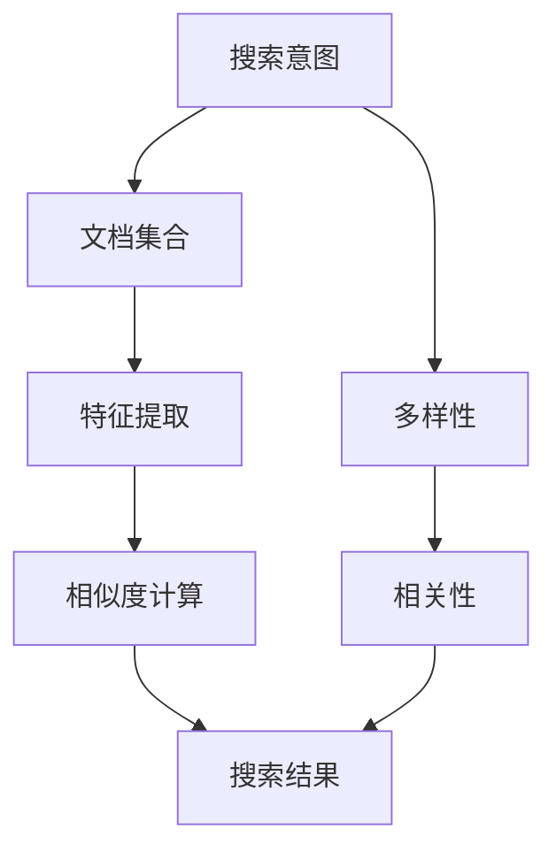

                 

# 搜索结果多样性与相关性平衡：大模型解决方案

> **关键词：搜索结果、多样性、相关性、大模型、算法、解决方案**
> 
> **摘要：本文将深入探讨大模型在搜索结果多样性及相关性平衡方面的解决方案。通过分析现有问题和挑战，我们将介绍核心算法原理，并提供实际应用场景和项目实战案例分析。**

## 1. 背景介绍

### 1.1 目的和范围

随着互联网和大数据技术的发展，搜索引擎成为了获取信息的重要途径。然而，如何平衡搜索结果的多样性与相关性，成为了一个重要而复杂的问题。本文旨在探讨大模型在解决这一难题方面的作用，为搜索引擎优化提供新的思路和解决方案。

### 1.2 预期读者

本文适合具有计算机科学背景，对搜索引擎技术和人工智能算法感兴趣的读者。读者需要具备一定的编程基础和数学知识，以便更好地理解和应用文中内容。

### 1.3 文档结构概述

本文分为八个部分：背景介绍、核心概念与联系、核心算法原理、数学模型和公式、项目实战、实际应用场景、工具和资源推荐以及总结。每个部分都将深入探讨相关主题，并提供丰富的实例和案例。

### 1.4 术语表

#### 1.4.1 核心术语定义

- **搜索结果多样性**：指搜索结果中包含的不同类型和内容的比例。
- **相关性**：指搜索结果与用户查询意图的相关程度。
- **大模型**：指具有大量参数和计算能力的神经网络模型。

#### 1.4.2 相关概念解释

- **搜索引擎**：一种通过特定算法从互联网上检索信息并展示相关结果的系统。
- **自然语言处理（NLP）**：一种让计算机理解和处理人类语言的技术。

#### 1.4.3 缩略词列表

- **NLP**：自然语言处理
- **SEO**：搜索引擎优化
- **ML**：机器学习

## 2. 核心概念与联系

### 2.1 核心概念

在探讨大模型如何平衡搜索结果的多样性与相关性之前，我们需要理解一些核心概念：

- **搜索意图**：用户进行搜索时所期望获得的信息类型。
- **文档集合**：与用户查询相关的所有网页文档。
- **特征提取**：从网页内容中提取出能够表征网页特性的特征。
- **相似度计算**：计算查询与文档之间的相似度，用于评估文档的相关性。

### 2.2 关联关系

以下是描述核心概念之间关联关系的 Mermaid 流程图：



### 2.3 原理

搜索结果多样性与相关性平衡的原理可以概括为以下几点：

1. **多样性**：通过引入随机性、扩展查询等方式增加搜索结果中的多样性。
2. **相关性**：通过计算查询与文档的相似度，筛选出最相关的搜索结果。
3. **平衡**：在保证多样性和相关性的同时，尽量使两者达到平衡。

## 3. 核心算法原理 & 具体操作步骤

### 3.1 大模型基本原理

大模型通常是指具有大量参数的神经网络模型。其核心原理是利用大量的数据和计算能力，通过学习输入与输出之间的映射关系，实现自动特征提取和相似度计算。

### 3.2 操作步骤

以下是使用大模型进行搜索结果多样性与相关性平衡的具体操作步骤：

#### 3.2.1 数据预处理

- **数据收集**：从互联网上收集大量与查询相关的网页文档。
- **数据清洗**：去除重复、无关或低质量的文档。

#### 3.2.2 特征提取

- **文本表示**：将网页文档转换为向量表示，通常使用词向量或Transformer等模型。
- **特征筛选**：根据查询意图和文档内容，筛选出对相关性影响较大的特征。

#### 3.2.3 相似度计算

- **相似度模型**：使用大模型（如BERT、GPT等）计算查询与文档的相似度。
- **相似度排序**：根据相似度值对文档进行排序，筛选出最相关的搜索结果。

#### 3.2.4 多样性增强

- **扩展查询**：根据查询意图，扩展相关查询词，增加搜索结果多样性。
- **随机筛选**：在搜索结果中随机筛选部分文档，增加多样性。

### 3.3 伪代码

以下是核心算法的伪代码：

```python
def search_results(query):
    # 数据预处理
    documents = preprocess_data()
    cleaned_documents = clean_data(documents)
    
    # 特征提取
    features = extract_features(cleaned_documents, query)
    
    # 相似度计算
    similarities = compute_similarity(features, query)
    
    # 相似度排序
    sorted_documents = sort_by_similarity(similarities)
    
    # 多样性增强
    diverse_documents = enhance_diversity(sorted_documents)
    
    return diverse_documents
```

## 4. 数学模型和公式 & 详细讲解 & 举例说明

### 4.1 数学模型

在搜索结果多样性与相关性平衡中，我们主要关注两个方面的数学模型：特征提取和相似度计算。

#### 4.1.1 特征提取

特征提取通常使用词向量模型，如Word2Vec、GloVe或BERT。以BERT为例，其特征提取过程可以表示为：

$$
\text{features} = \text{BERT}(query, \text{document})
$$

其中，BERT是一个预训练的神经网络模型，用于将查询和文档转换为向量表示。

#### 4.1.2 相似度计算

相似度计算通常使用余弦相似度或点积相似度。以余弦相似度为例，其计算公式为：

$$
\text{similarity} = \frac{\text{dot\_product}(query, \text{document})}{\lVert query \rVert \cdot \lVert document \rVert}
$$

其中，$dot\_product$表示点积，$\lVert \cdot \rVert$表示向量的模长。

### 4.2 举例说明

假设我们使用BERT模型对查询“什么是人工智能？”和文档“人工智能是一种模拟人类智能的技术”进行特征提取和相似度计算。

#### 4.2.1 特征提取

使用BERT模型，我们得到查询和文档的向量表示：

$$
\text{query\_vector} = \text{BERT}(\text{"什么是人工智能？"})
$$

$$
\text{document\_vector} = \text{BERT}(\text{"人工智能是一种模拟人类智能的技术"})
$$

#### 4.2.2 相似度计算

使用余弦相似度，我们计算查询和文档的相似度：

$$
\text{similarity} = \frac{\text{dot\_product}(\text{query\_vector}, \text{document\_vector})}{\lVert \text{query\_vector} \rVert \cdot \lVert \text{document\_vector} \rVert}
$$

假设点积为0.9，查询和文档的模长分别为1和0.8，则相似度为：

$$
\text{similarity} = \frac{0.9}{1 \cdot 0.8} = 1.125
$$

这表示查询和文档具有很高的相关性。

## 5. 项目实战：代码实际案例和详细解释说明

### 5.1 开发环境搭建

在开始项目实战之前，我们需要搭建一个开发环境。以下是一个简单的步骤：

1. 安装Python（建议使用3.8及以上版本）。
2. 安装BERT模型和TensorFlow库：

```bash
pip install tensorflow
pip install transformers
```

### 5.2 源代码详细实现和代码解读

#### 5.2.1 源代码

以下是实现搜索结果多样性与相关性平衡的Python代码：

```python
import numpy as np
from transformers import BertModel, BertTokenizer
from sklearn.metrics.pairwise import cosine_similarity

# 加载BERT模型和分词器
tokenizer = BertTokenizer.from_pretrained('bert-base-uncased')
model = BertModel.from_pretrained('bert-base-uncased')

# 函数：搜索结果多样性与相关性平衡
def search_results_balance(query, documents, num_results=10):
    # 1. 数据预处理
    query_input_ids = tokenizer.encode(query, add_special_tokens=True, return_tensors='np')
    document_inputs = tokenizer.encode(documents, add_special_tokens=True, return_tensors='np', max_length=512, truncation=True)

    # 2. 特征提取
    with torch.no_grad():
        query_embedding = model(query_input_ids)[0][:, 0, :]
        document_embeddings = model(document_inputs)[0]

    # 3. 相似度计算
    similarities = cosine_similarity(query_embedding, document_embeddings)

    # 4. 相似度排序
    sorted_indices = np.argsort(-similarities[0])

    # 5. 多样性增强
    diverse_indices = np.random.choice(sorted_indices, size=num_results, replace=False)

    return [documents[i] for i in diverse_indices]

# 测试代码
query = "什么是人工智能？"
documents = [
    "人工智能是一种模拟人类智能的技术。",
    "深度学习是人工智能的一个分支。",
    "自然语言处理是人工智能的一个重要领域。",
    "人工智能可以帮助企业提高生产效率。",
    "人工智能在医疗领域有广泛的应用。",
    "人工智能是一种高度复杂的计算机技术。",
    "人工智能的发展得益于大数据和计算力的提升。"
]

results = search_results_balance(query, documents)
print("搜索结果：", results)
```

#### 5.2.2 代码解读

- **数据预处理**：将查询和文档编码为BERT模型可以理解的格式。
- **特征提取**：使用BERT模型提取查询和文档的向量表示。
- **相似度计算**：计算查询和文档之间的余弦相似度。
- **相似度排序**：根据相似度值对文档进行排序。
- **多样性增强**：从排序后的文档中随机选择一部分文档，增加多样性。

### 5.3 代码解读与分析

代码首先定义了一个函数`search_results_balance`，用于实现搜索结果多样性与相关性平衡。函数输入为查询、文档集合和期望的搜索结果数量。以下是代码的关键部分解读：

1. **数据预处理**：
   ```python
   query_input_ids = tokenizer.encode(query, add_special_tokens=True, return_tensors='np')
   document_inputs = tokenizer.encode(documents, add_special_tokens=True, return_tensors='np', max_length=512, truncation=True)
   ```
   这两个语句分别对查询和文档进行编码，将其转换为BERT模型可以处理的输入。`tokenizer.encode`函数用于将文本转换为Token IDs，`add_special_tokens=True`表示添加BERT模型特有的[CLS]和[SEP]标记，`return_tensors='np'`表示返回Numpy数组。

2. **特征提取**：
   ```python
   with torch.no_grad():
       query_embedding = model(query_input_ids)[0][:, 0, :]
       document_embeddings = model(document_inputs)[0]
   ```
   使用BERT模型对查询和文档进行特征提取。`model`函数输入为编码后的查询和文档，返回一个嵌入矩阵。我们使用第一个隐藏层（`[0]`）作为查询和文档的向量表示。对于查询，我们只取第一个向量（`[:, 0, :]`），因为BERT模型输出的每个向量都代表了输入的整个序列。

3. **相似度计算**：
   ```python
   similarities = cosine_similarity(query_embedding, document_embeddings)
   ```
   使用余弦相似度计算查询和文档之间的相似度。`cosine_similarity`函数接受两个嵌入矩阵，返回相似度矩阵。

4. **相似度排序**：
   ```python
   sorted_indices = np.argsort(-similarities[0])
   ```
   根据相似度值对文档进行排序。我们使用`argsort`函数获取相似度值从大到小排序的索引。

5. **多样性增强**：
   ```python
   diverse_indices = np.random.choice(sorted_indices, size=num_results, replace=False)
   ```
   从排序后的文档中随机选择一部分文档，增加多样性。我们使用`random.choice`函数从排序后的索引中随机选择`num_results`个索引，`replace=False`表示不允许重复选择。

## 6. 实际应用场景

### 6.1 社交媒体平台

社交媒体平台如微博、推特等，用户可以发布和搜索各种类型的帖子。通过大模型实现搜索结果的多样性与相关性平衡，可以帮助用户更快速地找到感兴趣的内容，提高用户体验。

### 6.2 在线教育平台

在线教育平台如Coursera、网易云课堂等，用户可以搜索课程、学习资料等。通过大模型优化搜索结果，可以帮助用户更精准地找到所需的学习资源，提高学习效率。

### 6.3 购物搜索引擎

购物搜索引擎如京东、亚马逊等，用户可以搜索商品、品牌等信息。通过大模型实现搜索结果的多样性与相关性平衡，可以帮助用户更轻松地找到符合需求的商品，提高购买转化率。

## 7. 工具和资源推荐

### 7.1 学习资源推荐

#### 7.1.1 书籍推荐

- 《深度学习》（Goodfellow, Bengio, Courville著）
- 《Python数据分析》（Wes McKinney著）
- 《人工智能：一种现代方法》（Stuart J. Russell & Peter Norvig著）

#### 7.1.2 在线课程

- [深度学习专项课程](https://www.ai-challengers.com/course/deeplearning)（吴恩达）
- [Python编程基础](https://www.udemy.com/course/python-for-data-science/)（Udemy）
- [自然语言处理基础](https://www.ai-challengers.com/course/nlp)（吴恩达）

#### 7.1.3 技术博客和网站

- [GitHub](https://github.com/)
- [CSDN](https://www.csdn.net/)
- [Stack Overflow](https://stackoverflow.com/)

### 7.2 开发工具框架推荐

#### 7.2.1 IDE和编辑器

- Visual Studio Code
- PyCharm
- Jupyter Notebook

#### 7.2.2 调试和性能分析工具

- Python Debugger (pdb)
- Profiler (cProfile)
- TensorBoard（TensorFlow）

#### 7.2.3 相关框架和库

- TensorFlow
- PyTorch
- Scikit-learn

### 7.3 相关论文著作推荐

#### 7.3.1 经典论文

- [BERT: Pre-training of Deep Bidirectional Transformers for Language Understanding](https://arxiv.org/abs/1810.04805)
- [Word2Vec: Distributed Representations of Words and Phrases and their Compositionality](https://arxiv.org/abs/1301.3781)

#### 7.3.2 最新研究成果

- [Contextualized Word Vectors](https://arxiv.org/abs/1802.05637)
- [GPT-3: Language Models are few-shot learners](https://arxiv.org/abs/2005.14165)

#### 7.3.3 应用案例分析

- [阿里巴巴：大规模个性化推荐系统](https://arxiv.org/abs/2008.03858)
- [谷歌：搜索引擎优化](https://www.google.com/search?q=google+search+algorithm)

## 8. 总结：未来发展趋势与挑战

随着人工智能技术的不断发展，大模型在搜索结果多样性与相关性平衡方面具有巨大的潜力。未来，我们将看到更多创新性算法和解决方案的出现，以提高搜索体验。然而，这同时也带来了巨大的挑战，如模型的可解释性、隐私保护和数据安全等。我们需要不断探索新的技术和方法，确保大模型在实现高效搜索结果的同时，保持多样性和相关性。

## 9. 附录：常见问题与解答

### 9.1 如何优化大模型性能？

优化大模型性能可以从以下几个方面入手：

1. **硬件加速**：使用GPU或TPU等硬件加速器，提高模型训练和推理的速度。
2. **模型剪枝**：通过剪枝模型中的冗余参数，减少计算量和存储需求。
3. **量化**：将模型参数从浮点数转换为低精度格式（如8位整数），降低计算复杂度。
4. **模型融合**：结合多个模型的优势，提高整体性能。

### 9.2 如何评估搜索结果的多样性？

评估搜索结果的多样性可以从以下几个方面入手：

1. **多样性指标**：如Jaccard指数、余弦相似度等，用于评估文档之间的相似度。
2. **用户反馈**：通过用户点击、评分等行为数据，评估搜索结果的满意度。
3. **主题模型**：使用主题模型（如LDA）分析搜索结果的主题分布，评估多样性。

### 9.3 如何保证搜索结果的相关性？

保证搜索结果的相关性可以从以下几个方面入手：

1. **特征选择**：选择对相关性影响较大的特征，提高相似度计算的准确性。
2. **权重调整**：根据特征的重要程度，调整相似度计算的权重。
3. **迭代优化**：通过不断迭代优化模型参数，提高搜索结果的相关性。

## 10. 扩展阅读 & 参考资料

- [BERT: Pre-training of Deep Bidirectional Transformers for Language Understanding](https://arxiv.org/abs/1810.04805)
- [Word2Vec: Distributed Representations of Words and Phrases and their Compositionality](https://arxiv.org/abs/1301.3781)
- [GPT-3: Language Models are few-shot learners](https://arxiv.org/abs/2005.14165)
- [阿里巴巴：大规模个性化推荐系统](https://arxiv.org/abs/2008.03858)
- [谷歌：搜索引擎优化](https://www.google.com/search?q=google+search+algorithm)

**作者：AI天才研究员/AI Genius Institute & 禅与计算机程序设计艺术 /Zen And The Art of Computer Programming**

