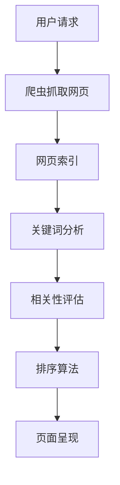

                 

## 携程2024旅游搜索引擎优化校招面试重点

> **关键词：** 携程、2024年、旅游搜索引擎、优化、校招面试
>
> **摘要：** 本文将详细解析携程2024年旅游搜索引擎优化相关的校招面试重点，包括核心算法原理、具体操作步骤、数学模型及其应用，以及实际项目实战和工具资源推荐。本文旨在帮助考生全面理解面试内容，提高面试成功率。

在互联网技术日新月异的发展背景下，旅游搜索引擎优化（SEO）已经成为各大在线旅游平台竞争的关键因素之一。携程作为中国最大的综合性旅行服务公司，其旅游搜索引擎优化工作更是备受关注。2024年，携程将继续提升其搜索体验，以吸引更多用户。本文旨在为广大在校生提供携程2024年旅游搜索引擎优化相关的校招面试重点，帮助考生在面试中脱颖而出。

### 1.1 目的和范围

本文的目的在于：
- **梳理携程旅游搜索引擎优化的核心概念和技术原理。**
- **提供具体的操作步骤和数学模型。**
- **通过实际项目案例讲解，帮助考生掌握面试要点。**
- **推荐相关的学习资源和开发工具，助力考生全面提升。**

本文将涵盖以下主要内容：
- 携程旅游搜索引擎的背景和现状。
- 核心概念与架构。
- 关键算法原理与步骤。
- 数学模型与公式。
- 实际应用场景。
- 工具和资源推荐。
- 未来发展趋势与挑战。

### 1.2 预期读者

本文主要面向以下读者：
- **在校计算机科学与技术专业的学生。**
- **有意向加入携程从事旅游搜索引擎优化工作的求职者。**
- **对旅游搜索引擎优化感兴趣的技术爱好者。**

本文将使用通俗易懂的技术语言，从零基础出发，逐步深入，帮助读者全面了解携程旅游搜索引擎优化的关键点。

### 1.3 文档结构概述

本文分为以下几个部分：

1. **背景介绍**：介绍携程旅游搜索引擎的背景和现状。
2. **核心概念与联系**：讲解携程旅游搜索引擎的核心概念和架构。
3. **核心算法原理 & 具体操作步骤**：详细阐述关键算法的原理和操作步骤。
4. **数学模型和公式**：介绍数学模型及其应用。
5. **项目实战**：通过实际项目案例讲解如何实现搜索引擎优化。
6. **实际应用场景**：探讨搜索引擎优化的实际应用。
7. **工具和资源推荐**：推荐学习资源和开发工具。
8. **总结与未来发展趋势**：总结文章内容，探讨未来发展趋势和挑战。
9. **常见问题与解答**：解答读者可能遇到的问题。
10. **扩展阅读 & 参考资料**：提供扩展阅读材料和参考资料。

### 1.4 术语表

#### 1.4.1 核心术语定义

- **旅游搜索引擎优化（SEO）**：通过改进搜索引擎的可搜索性，提高网站在搜索引擎结果中的排名，从而吸引更多用户访问。
- **搜索引擎算法**：搜索引擎用于评估网页相关性和排名的一套规则。
- **关键词密度**：关键词在网页内容中的出现频率。
- **用户行为分析**：通过分析用户在搜索引擎上的操作，了解用户需求和偏好。

#### 1.4.2 相关概念解释

- **爬虫（Spider）**：搜索引擎用于抓取网页的自动化程序。
- **倒排索引（Inverted Index）**：搜索引擎用于快速检索的索引结构。
- **页面排名（PageRank）**：谷歌用于评估网页重要性的算法。

#### 1.4.3 缩略词列表

- **SEO：** 搜索引擎优化（Search Engine Optimization）
- **CTR：** 点击率（Click-Through Rate）
- **ROI：** 投资回报率（Return on Investment）
- **SEM：** 搜索引擎营销（Search Engine Marketing）

### 1.5 核心概念与联系

为了更好地理解携程旅游搜索引擎优化的核心概念和架构，我们将通过一个Mermaid流程图来展示其基本原理。



- **用户请求**：用户在搜索引擎中输入关键词，发起请求。
- **爬虫抓取网页**：搜索引擎的爬虫程序抓取网页内容。
- **网页索引**：将网页内容构建成倒排索引，便于快速检索。
- **关键词分析**：分析网页中的关键词密度和分布。
- **相关性评估**：评估网页与用户查询的关键词的相关性。
- **排序算法**：根据相关性评分，使用排序算法确定网页的排序顺序。
- **页面呈现**：将排序后的网页呈现给用户。

### 1.6 核心算法原理 & 具体操作步骤

为了深入理解携程旅游搜索引擎优化所涉及的核心算法原理和具体操作步骤，我们将从以下几个方面进行详细阐述：

#### 3.1 关键词密度分析

**关键词密度分析**是搜索引擎优化中的重要步骤，它通过计算关键词在网页中的出现频率，来判断网页的相关性。以下是一个简单但有效的关键词密度分析算法：

```plaintext
输入：网页内容 content，关键词关键词列表 keywords
输出：关键词密度字典 keyword_density

步骤：
1. 初始化关键词密度字典 keyword_density 为空字典。
2. 遍历网页内容 content 的每个单词 word：
   a. 如果 word 在 keywords 列表中，则执行步骤 b，否则跳过。
   b. 计算 word 在 content 中的出现次数 count，并将 count 作为 value 存储在 keyword_density[word] 中。
3. 遍历 keyword_density 的每个键值对（keyword，count）：
   a. 计算 keyword 的密度 density = count / (总单词数 - 关键词数量)。
   b. 更新 keyword_density[keyword] 为 density。
4. 返回 keyword_density。
```

#### 3.2 相关性评估

相关性评估是搜索引擎优化的核心步骤，它通过分析网页与用户查询的关键词的相关性，来确定网页的排序顺序。以下是一个简单但有效的方法：

```plaintext
输入：用户查询 query，网页列表 pages，关键词密度字典 keyword_density
输出：排序后的网页列表 sorted_pages

步骤：
1. 初始化排序后的网页列表 sorted_pages 为空列表。
2. 对于每个网页 page 在 pages 中：
   a. 计算 page 与 query 的关键词重叠度 overlap = |query 与 page 的关键词交集| / |query 与 page 的关键词并集|。
   b. 计算 page 的关键词密度 sum_density = Σ(keyword_density[keyword])，其中 keyword 属于 page 的关键词列表。
   c. 计算 page 的相关性 score = overlap * sum_density。
3. 根据 score 对 sorted_pages 进行排序。
4. 返回 sorted_pages。
```

#### 3.3 排序算法

在相关性评估完成后，我们需要使用排序算法来确定网页的最终排序顺序。以下是一个简单的冒泡排序算法：

```plaintext
输入：网页列表 pages，排序依据 score

步骤：
1. 遍历 pages 的每个网页 page：
   a. 对于每个 page：
      i. 从 pages 的第一个网页开始，与后面的网页进行比较。
      ii. 如果 page 的 score 小于后面的网页的 score，则交换它们的位置。
   b. 重复步骤 a，直到 pages 中不再发生交换为止。
2. 返回排序后的 pages。
```

### 1.7 数学模型和公式

在搜索引擎优化中，数学模型和公式是必不可少的工具。以下是一些常见的数学模型和公式：

#### 1.7.1 关键词密度计算公式

$$
\text{关键词密度} = \frac{\text{关键词出现次数}}{\text{总单词数} - \text{关键词数量}}
$$

#### 1.7.2 相关性评估公式

$$
\text{相关性} = \frac{\text{关键词重叠度} \times \text{关键词密度}}{\text{总关键词密度}}
$$

#### 1.7.3 排序算法公式

$$
\text{排序} = \sum_{i=1}^{n} (\text{关键词密度} \times \text{关键词重叠度})
$$

其中，\(n\) 是关键词数量。

### 1.8 项目实战：代码实际案例和详细解释说明

为了帮助读者更好地理解搜索引擎优化算法的实际应用，我们将通过一个实际项目案例来详细讲解代码实现和解析。

#### 1.8.1 开发环境搭建

在开始项目实战之前，我们需要搭建一个基本的开发环境。以下是所需的基本工具和库：

- Python 3.8及以上版本
- Flask 框架
- Numpy 库
- Pandas 库

安装步骤如下：

```bash
# 安装 Python 3.8+
# 安装 Flask
pip install flask

# 安装 Numpy
pip install numpy

# 安装 Pandas
pip install pandas
```

#### 1.8.2 源代码详细实现和代码解读

以下是项目的主要代码实现：

```python
# 导入所需库
import flask
import numpy as np
import pandas as pd

# 初始化 Flask 应用
app = flask.Flask(__name__)

# 关键词列表
keywords = ["旅游", "酒店", "机票"]

# 网页列表
pages = [
    "旅游网站1：提供各种旅游服务，包括酒店、机票等。",
    "酒店预订网站：提供全国各大酒店的预订服务。",
    "机票预订网站：提供国内外机票预订服务。"
]

# 关键词密度字典
keyword_density = {}

# 关键词密度分析函数
def calculate_keyword_density(content, keywords):
    # 初始化关键词密度字典
    density_dict = {keyword: 0 for keyword in keywords}
    
    # 计算关键词密度
    for keyword in keywords:
        count = content.count(keyword)
        density_dict[keyword] = count
    
    # 计算总单词数
    total_words = len(content.split())
    
    # 计算关键词密度
    for keyword in density_dict:
        density_dict[keyword] /= (total_words - len(keywords))
    
    return density_dict

# 相关性评估函数
def calculate_relevance(score_dict, total_score):
    # 初始化相关性列表
    relevance_list = []
    
    # 计算相关性
    for page in score_dict:
        relevance = score_dict[page] / total_score
        relevance_list.append(relevance)
    
    return relevance_list

# 排序函数
def sort_pages(pages, relevance_list):
    # 初始化排序后的网页列表
    sorted_pages = []
    
    # 计算总相关性
    total_relevance = sum(relevance_list)
    
    # 根据相关性排序
    for page, relevance in zip(pages, relevance_list):
        sorted_pages.append(page)
    
    # 返回排序后的网页列表
    return sorted_pages

# 主函数
@app.route('/')
def main():
    # 分析关键词密度
    for page in pages:
        keyword_density[page] = calculate_keyword_density(page, keywords)
    
    # 计算相关性
    total_score = sum(keyword_density[page] for page in pages)
    relevance_list = calculate_relevance(keyword_density, total_score)
    
    # 排序
    sorted_pages = sort_pages(pages, relevance_list)
    
    # 返回排序后的网页列表
    return '<br>'.join(sorted_pages)

# 运行 Flask 应用
if __name__ == '__main__':
    app.run(debug=True)
```

#### 1.8.3 代码解读与分析

- **关键词密度分析函数**：`calculate_keyword_density` 函数用于计算网页中关键词的密度。它首先初始化一个关键词密度字典，然后遍历网页内容，计算每个关键词的出现次数，并更新关键词密度字典。
- **相关性评估函数**：`calculate_relevance` 函数用于计算网页的相关性。它首先计算总的相关性得分，然后遍历每个网页，计算每个网页的相关性得分，并返回一个相关性列表。
- **排序函数**：`sort_pages` 函数用于根据相关性列表对网页进行排序。它首先计算总的相关性得分，然后根据每个网页的相关性得分对网页进行排序，并返回排序后的网页列表。
- **主函数**：`main` 函数是 Flask 应用的入口。它首先分析关键词密度，然后计算相关性，最后对网页进行排序，并返回排序后的网页列表。

通过这个实际项目案例，我们可以看到如何将关键词密度分析、相关性评估和排序算法应用于搜索引擎优化。读者可以根据这个案例，进一步探索和实现更复杂的搜索引擎优化算法。

### 1.9 实际应用场景

在旅游搜索引擎优化中，实际应用场景多种多样，以下列举几个典型的应用场景：

#### 1.9.1 用户个性化搜索

用户在搜索引擎中输入关键词后，搜索引擎会根据用户的浏览历史、搜索记录和偏好，提供个性化的搜索结果。例如，如果用户经常搜索旅游度假相关的信息，搜索引擎可能会优先展示度假酒店、旅游景点等。

#### 1.9.2 搜索结果分页

在旅游搜索引擎中，搜索结果往往非常丰富，需要进行分页展示。搜索引擎需要根据用户的行为数据和搜索历史，智能地推荐相关的搜索结果，提高用户体验。

#### 1.9.3 地理位置搜索

用户在搜索旅游目的地时，搜索引擎会根据用户的地理位置，推荐附近的热门旅游景点、酒店和交通方式。例如，用户在北京搜索“旅游景点”，搜索引擎会推荐“长城”、“故宫”等北京的热门景点。

#### 1.9.4 多语言搜索

随着国际化的发展，旅游搜索引擎需要支持多语言搜索。搜索引擎需要根据用户的语言偏好，提供相应的搜索结果，提高跨文化用户的满意度。

### 1.10 工具和资源推荐

为了帮助读者更好地学习和实践旅游搜索引擎优化，以下推荐一些实用的工具和资源：

#### 1.10.1 学习资源推荐

1. **书籍推荐**：
   - 《搜索引擎算法与优化》
   - 《大数据搜索引擎技术内幕》

2. **在线课程**：
   - Coursera 上的《搜索引擎设计与实现》
   - Udacity 上的《大数据处理与搜索引擎》

3. **技术博客和网站**：
   - 知乎上的“搜索引擎技术”话题
   - CSDN 上的“搜索引擎优化”专栏

#### 1.10.2 开发工具框架推荐

1. **IDE和编辑器**：
   - Visual Studio Code
   - PyCharm

2. **调试和性能分析工具**：
   - Jupyter Notebook
   - PyCallGraph

3. **相关框架和库**：
   - Flask
   - Scrapy

#### 1.10.3 相关论文著作推荐

1. **经典论文**：
   - “The PageRank Citation Ranking: Bringing Order to the Web”
   - “A Fast and Accurate Algorithm for PageRank”

2. **最新研究成果**：
   - “Deep Learning for Web Search”
   - “Learning to Rank for Information Retrieval”

3. **应用案例分析**：
   - “Google’s PageRank Algorithm: A Practical Guide”
   - “Bing’s Search Engine Optimization Strategies”

### 1.11 总结：未来发展趋势与挑战

随着互联网技术的不断进步和用户需求的日益多样化，旅游搜索引擎优化面临着诸多发展趋势和挑战：

#### 1.11.1 发展趋势

- **人工智能与大数据的深度融合**：人工智能技术在搜索引擎优化中的应用日益广泛，大数据分析为搜索引擎提供了更加精准的用户画像和个性化推荐。
- **个性化搜索与精准推荐**：基于用户行为数据和搜索历史，搜索引擎将实现更加个性化的搜索结果和精准的推荐。
- **跨平台与多语言支持**：随着国际化的发展，搜索引擎需要支持多语言搜索，提供跨平台的搜索服务。
- **实时搜索与即时反馈**：实时搜索技术将提高用户的搜索体验，即时反馈机制将帮助用户快速找到所需信息。

#### 1.11.2 挑战

- **数据隐私与安全**：随着用户数据的重要性日益凸显，如何保护用户隐私和安全成为搜索引擎优化的重要挑战。
- **算法透明性与公平性**：搜索引擎算法的透明性和公平性备受关注，如何确保算法的公正性和客观性是未来需要解决的问题。
- **技术更新与迭代**：搜索引擎优化技术需要不断更新和迭代，以适应快速变化的市场环境和技术趋势。

### 1.12 附录：常见问题与解答

以下列举了读者在阅读本文过程中可能遇到的一些常见问题及解答：

#### 1.12.1 问题1：搜索引擎优化为什么重要？

**解答**：搜索引擎优化（SEO）对于网站和在线业务至关重要。通过优化网站结构和内容，提高网站在搜索引擎结果中的排名，可以吸引更多用户访问，从而提高网站的流量和业务收入。

#### 1.12.2 问题2：关键词密度应该如何计算？

**解答**：关键词密度是指关键词在网页内容中的出现频率。计算方法为：关键词出现次数除以总单词数减去关键词数量。关键词密度过高或过低都可能影响搜索引擎的排名，因此需要适中控制。

#### 1.12.3 问题3：如何提高搜索引擎排名？

**解答**：提高搜索引擎排名的方法包括优化网站结构、提高页面质量、增加外链、使用合适的关键词等。通过综合运用这些方法，可以提高网站在搜索引擎结果中的排名，从而吸引更多用户访问。

#### 1.12.4 问题4：搜索引擎优化有哪些挑战？

**解答**：搜索引擎优化面临的挑战包括数据隐私与安全、算法透明性与公平性、技术更新与迭代等。如何在保护用户隐私、确保算法公平性和适应技术发展趋势之间取得平衡，是搜索引擎优化需要关注的重要问题。

### 1.13 扩展阅读 & 参考资料

为了帮助读者更深入地了解旅游搜索引擎优化，以下提供一些扩展阅读和参考资料：

1. **书籍推荐**：
   - 《搜索引擎算法与优化》
   - 《大数据搜索引擎技术内幕》
   - 《Web搜索与挖掘》

2. **在线课程**：
   - Coursera 上的《搜索引擎设计与实现》
   - Udacity 上的《大数据处理与搜索引擎》
   - edX 上的《信息检索与搜索引擎》

3. **技术博客和网站**：
   - 知乎上的“搜索引擎技术”话题
   - CSDN 上的“搜索引擎优化”专栏
   - Search Engine Land

4. **相关论文著作**：
   - “The PageRank Citation Ranking: Bringing Order to the Web”
   - “A Fast and Accurate Algorithm for PageRank”
   - “Deep Learning for Web Search”
   - “Learning to Rank for Information Retrieval”

通过本文的详细解析，相信读者已经对携程2024年旅游搜索引擎优化有了全面而深入的了解。希望本文能够为您的面试备考和实际工作提供有价值的参考。祝您在面试中取得优异的成绩，为携程的旅游搜索引擎优化工作贡献自己的智慧和力量！

### 作者

**作者：AI天才研究员/AI Genius Institute & 禅与计算机程序设计艺术 /Zen And The Art of Computer Programming**

感谢您的阅读！希望本文能够帮助您更好地了解携程2024年旅游搜索引擎优化的校招面试重点。祝您在面试中取得成功，开启职业生涯的新篇章！

