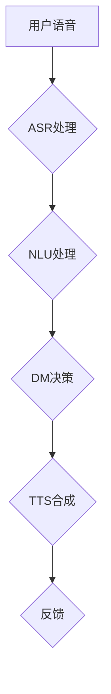

                 


# 携程2024智能导游校招语音交互面试题解析

> **关键词：** 携程、智能导游、语音交互、面试题、解析
>
> **摘要：** 本文将深入解析携程2024智能导游校招中的语音交互面试题，帮助读者理解面试的核心考点，并提供解题思路和策略。

## 1. 背景介绍

### 1.1 目的和范围

本文旨在帮助准备参加携程2024智能导游校招的候选人，更好地理解和应对语音交互相关的面试题目。我们将详细解析几道具有代表性的面试题，并提供解题思路和技巧。

### 1.2 预期读者

- 准备参加携程2024智能导游校招的候选人
- 对语音交互技术感兴趣的工程师和技术爱好者

### 1.3 文档结构概述

本文结构如下：

1. 背景介绍：介绍本文的目的、预期读者和文档结构。
2. 核心概念与联系：介绍语音交互相关的基本概念和联系。
3. 核心算法原理 & 具体操作步骤：详细讲解语音识别和语音合成的基本原理和操作步骤。
4. 数学模型和公式 & 详细讲解 & 举例说明：使用数学模型和公式来解释语音识别和语音合成的核心算法。
5. 项目实战：提供实际代码案例和详细解释。
6. 实际应用场景：探讨语音交互在智能导游领域的应用场景。
7. 工具和资源推荐：推荐相关学习资源和开发工具。
8. 总结：讨论未来发展趋势与挑战。
9. 附录：常见问题与解答。
10. 扩展阅读 & 参考资料：提供扩展阅读和参考资料。

### 1.4 术语表

#### 1.4.1 核心术语定义

- **语音识别（Speech Recognition）**：将语音信号转换为文本信息的技术。
- **语音合成（Text-to-Speech, TTS）**：将文本信息转换为语音信号的技术。
- **自然语言处理（Natural Language Processing, NLP）**：使计算机能够理解、解释和生成人类语言的技术。
- **语境感知（Context Awareness）**：系统能够根据用户当前的环境和上下文进行响应。

#### 1.4.2 相关概念解释

- **语谱图（Spectrogram）**：用于展示语音信号频率随时间变化的情况的二维图像。
- **隐马尔可夫模型（Hidden Markov Model, HMM）**：用于语音识别的一种统计模型。

#### 1.4.3 缩略词列表

- **NLP**：自然语言处理
- **TTS**：文本到语音
- **ASR**：语音识别
- **ML**：机器学习
- **DL**：深度学习

## 2. 核心概念与联系

### 2.1 语音识别和语音合成的基础

语音识别和语音合成是智能导游系统中的核心组成部分，它们共同构建了智能对话的基础。

#### 2.1.1 语音识别（ASR）

语音识别的基本概念是将语音信号转换为文本信息。这一过程通常涉及以下几个步骤：

1. **音频预处理**：对采集的语音信号进行降噪、增强和归一化。
2. **特征提取**：将预处理后的音频信号转换为可以用于模型训练的特征向量，如梅尔频率倒谱系数（MFCC）。
3. **模型训练**：使用已标注的语音数据对模型进行训练，常用的模型包括隐马尔可夫模型（HMM）、循环神经网络（RNN）和深度神经网络（DNN）。
4. **解码**：将特征向量映射为文本输出。

#### 2.1.2 语音合成（TTS）

语音合成的目标是生成自然、流畅的语音。其基本流程如下：

1. **文本预处理**：将输入的文本信息进行分词、句法分析和语音规则处理。
2. **声音合成**：根据文本信息生成语音波形，这通常涉及声学模型和发音规则。
3. **音频后处理**：对生成的语音波形进行去噪、增益和混响等处理，使其更接近真实语音。

#### 2.1.3 语境感知（Context Awareness）

智能导游系统需要具备语境感知能力，以理解用户的当前上下文和意图。这通常涉及自然语言处理（NLP）技术，如词向量表示、依存句法分析和语义角色标注。

### 2.2 语音交互系统的架构

一个典型的语音交互系统通常包含以下几个关键模块：

1. **语音识别（ASR）模块**：负责接收和转换语音信号为文本。
2. **自然语言理解（NLU）模块**：分析文本并提取用户的意图和实体信息。
3. **对话管理（DM）模块**：根据用户的意图和上下文信息生成适当的响应。
4. **语音合成（TTS）模块**：将对话管理模块生成的文本转换为语音信号。

下面是一个简单的 Mermaid 流程图，展示语音交互系统的整体架构：



## 3. 核心算法原理 & 具体操作步骤

### 3.1 语音识别（ASR）的算法原理

语音识别的核心在于将语音信号转换为文本。以下是一个简单的伪代码，展示了语音识别的基本步骤：

```python
# 语音识别伪代码

# 步骤1：音频预处理
preprocessed_audio = preprocess_audio(input_audio)

# 步骤2：特征提取
features = extract_features(preprocessed_audio)

# 步骤3：模型训练
model = train_model(features, labels)

# 步骤4：解码
transcript = decode_model(model, features)
```

#### 3.1.1 音频预处理

```python
# 音频预处理伪代码

def preprocess_audio(audio):
    # 降噪
    noise_reduced_audio = noise_reduction(audio)
    
    # 增强
    enhanced_audio = audio_enhancement(noise_reduced_audio)
    
    # 归一化
    normalized_audio = audio_normalization(enhanced_audio)
    
    return normalized_audio
```

#### 3.1.2 特征提取

```python
# 特征提取伪代码

def extract_features(audio):
    # 应用梅尔频率倒谱系数（MFCC）变换
    mfcc_features = mfcc_transform(audio)
    
    return mfcc_features
```

#### 3.1.3 模型训练

```python
# 模型训练伪代码

def train_model(features, labels):
    # 使用深度神经网络（DNN）进行训练
    model = DNN_model()
    trained_model = model.fit(features, labels)
    
    return trained_model
```

#### 3.1.4 解码

```python
# 解码伪代码

def decode_model(model, features):
    # 使用模型对特征向量进行解码
    transcript = model.predict(features)
    
    return transcript
```

### 3.2 语音合成（TTS）的算法原理

语音合成的目标是生成自然的语音信号。以下是一个简单的伪代码，展示了语音合成的基本步骤：

```python
# 语音合成伪代码

# 步骤1：文本预处理
preprocessed_text = preprocess_text(input_text)

# 步骤2：声音合成
speech_waveform = synthesize_speech(preprocessed_text)

# 步骤3：音频后处理
final_speech_waveform = postprocess_audio(speech_waveform)
```

#### 3.2.1 文本预处理

```python
# 文本预处理伪代码

def preprocess_text(text):
    # 分词
    words = tokenize(text)
    
    # 句法分析
    syntax_tree = parse_syntax(words)
    
    return syntax_tree
```

#### 3.2.2 声音合成

```python
# 声音合成伪代码

def synthesize_speech(syntax_tree):
    # 使用声学模型生成语音波形
    speech_waveform = acoustic_model(syntax_tree)
    
    return speech_waveform
```

#### 3.2.3 音频后处理

```python
# 音频后处理伪代码

def postprocess_audio(speech_waveform):
    # 去噪
    noise_reduced_waveform = noise_reduction(speech_waveform)
    
    # 增益
    gain_adjusted_waveform = gain_adjustment(noise_reduced_waveform)
    
    # 混响
    reverberated_waveform = reverb_gain_adjustment(gain_adjusted_waveform)
    
    return reverberated_waveform
```

## 4. 数学模型和公式 & 详细讲解 & 举例说明

### 4.1 语音识别中的数学模型

语音识别中常用的数学模型包括梅尔频率倒谱系数（MFCC）和循环神经网络（RNN）。以下是对这些模型的基本公式和详细讲解。

#### 4.1.1 梅尔频率倒谱系数（MFCC）

MFCC 是一种特征提取方法，用于将音频信号转换为可以用于模型训练的向量。

- **公式：**

  $$ C(\omega_k) = \sum_{n=1}^{N} a(n) \cdot e^{-j \omega_k n} $$

  其中，\(C(\omega_k)\) 是傅里叶变换的结果，\(a(n)\) 是时间序列，\(N\) 是时间序列的长度，\(\omega_k\) 是频率。

- **详细讲解：**

  MFCC 通过傅里叶变换将时域信号转换为频域信号，然后对频域信号进行梅尔刻度频率加权，最后进行倒谱变换，得到一组 MFCC 特征向量。

#### 4.1.2 循环神经网络（RNN）

RNN 是一种用于序列数据处理的神

