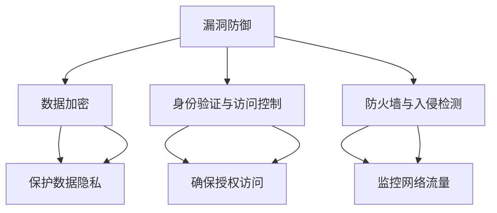

                 

# 操作系统的安全防护机制剖析

> **关键词：** 操作系统安全、防护机制、漏洞、加密、身份验证、访问控制、防火墙、入侵检测

> **摘要：** 本文将深入探讨操作系统的安全防护机制，包括漏洞防御、数据加密、身份验证与访问控制、防火墙与入侵检测等方面的内容。通过一步步分析，我们将了解这些机制如何协同工作，以保护计算机系统免受各种安全威胁。

## 1. 背景介绍

### 1.1 目的和范围

本文的目的是介绍和剖析操作系统的安全防护机制，帮助读者理解这些机制的工作原理以及它们如何协同保护计算机系统。我们将涵盖以下内容：

- 操作系统安全的基本概念
- 操作系统常见的安全漏洞及其防护方法
- 加密技术及其在操作系统安全中的应用
- 身份验证与访问控制机制
- 防火墙与入侵检测技术的原理与实践

### 1.2 预期读者

本文适合以下读者群体：

- 对操作系统安全感兴趣的计算机科学专业学生
- 系统管理员和安全工程师
- 对网络安全和操作系统安全有一定了解的技术爱好者
- 准备从事操作系统安全相关工作的从业者

### 1.3 文档结构概述

本文将按照以下结构展开：

- 引言：介绍操作系统安全的重要性和本文的目的
- 核心概念与联系：概述操作系统的安全防护机制及其相互关系
- 核心算法原理 & 具体操作步骤：详细讲解各种安全机制的算法原理和具体操作
- 数学模型和公式 & 详细讲解 & 举例说明：使用数学模型和公式解释安全机制的工作原理
- 项目实战：通过实际代码案例展示安全机制的应用
- 实际应用场景：讨论安全机制在实际场景中的应用案例
- 工具和资源推荐：推荐学习资源和开发工具
- 总结：展望操作系统安全的发展趋势与挑战
- 附录：常见问题与解答
- 扩展阅读 & 参考资料：提供进一步学习和研究的资源

### 1.4 术语表

#### 1.4.1 核心术语定义

- 操作系统安全：确保操作系统及其数据不受未经授权的访问、篡改或破坏。
- 漏洞：操作系统中的安全漏洞，可能导致未经授权的访问或系统崩溃。
- 加密：将数据转换为不可读的密文，以保护数据隐私。
- 身份验证：确认用户身份的过程，确保只有授权用户可以访问系统资源。
- 访问控制：限制用户对系统资源的访问权限。
- 防火墙：一种网络安全系统，用于监控和控制进出网络的流量。
- 入侵检测：检测和响应恶意攻击的行为。

#### 1.4.2 相关概念解释

- 漏洞防御：通过各种技术措施防止漏洞被利用。
- 加密算法：实现数据加密和解密的算法。
- 身份验证协议：用于进行身份验证的通信协议。
- 访问控制列表（ACL）：定义用户对系统资源的访问权限。

#### 1.4.3 缩略词列表

- OS：操作系统
- IDS：入侵检测系统
- IPS：入侵预防系统
- VPN：虚拟专用网络
- PKI：公钥基础设施

## 2. 核心概念与联系

### 2.1 操作系统的安全防护机制概述

操作系统的安全防护机制可以分为以下几个方面：

- 漏洞防御
- 数据加密
- 身份验证与访问控制
- 防火墙与入侵检测

这些机制相互关联，共同构成操作系统的安全防护体系。漏洞防御是基础，确保系统免受各种漏洞攻击；数据加密保护数据隐私；身份验证与访问控制确保只有授权用户可以访问系统资源；防火墙与入侵检测则监控网络流量，防止恶意攻击。

### 2.2 核心概念原理和架构的 Mermaid 流程图



### 2.3 操作系统的安全防护机制联动效果

操作系统的安全防护机制之间具有联动效果。例如，在漏洞防御中，加密技术可以用来保护漏洞利用时泄露的数据；在身份验证与访问控制中，加密技术可以确保用户身份信息的安全；在防火墙与入侵检测中，加密技术和访问控制可以防止未经授权的网络访问。

## 3. 核心算法原理 & 具体操作步骤

### 3.1 漏洞防御算法原理

漏洞防御主要通过以下步骤实现：

1. 漏洞扫描：使用自动化工具扫描系统中的漏洞。
2. 漏洞修复：针对发现的漏洞进行修复或更新。
3. 安全策略配置：配置系统安全策略，限制未经授权的访问。

### 3.2 漏洞防御具体操作步骤

```python
# 漏洞防御具体操作步骤

# 步骤1：漏洞扫描
def scan_vulnerabilities():
    # 使用Nessus等漏洞扫描工具进行扫描
    pass

# 步骤2：漏洞修复
def fix_vulnerabilities(vulnerabilities):
    # 针对发现的漏洞进行修复或更新
    for vulnerability in vulnerabilities:
        apply_patch(vulnerability)

# 步骤3：安全策略配置
def configure_security_policy():
    # 配置系统安全策略，如限制未授权访问
    pass

# 主函数
def main():
    vulnerabilities = scan_vulnerabilities()
    fix_vulnerabilities(vulnerabilities)
    configure_security_policy()

if __name__ == "__main__":
    main()
```

### 3.3 数据加密算法原理

数据加密主要通过以下步骤实现：

1. 密钥生成：生成加密密钥。
2. 数据加密：使用加密算法对数据进行加密。
3. 数据解密：使用加密算法对数据进行解密。

### 3.4 数据加密具体操作步骤

```python
# 数据加密具体操作步骤

# 步骤1：密钥生成
from Crypto.PublicKey import RSA

def generate_keypair():
    # 生成RSA密钥对
    key = RSA.generate(2048)
    private_key = key.export_key()
    public_key = key.publickey().export_key()
    return private_key, public_key

# 步骤2：数据加密
from Crypto.Cipher import PKCS1_OAEP

def encrypt_data(data, public_key):
    # 使用RSA加密算法加密数据
    cipher = PKCS1_OAEP.new(RSA.import_key(public_key))
    encrypted_data = cipher.encrypt(data)
    return encrypted_data

# 步骤3：数据解密
from Crypto.Cipher import PKCS1_OAEP

def decrypt_data(encrypted_data, private_key):
    # 使用RSA加密算法解密数据
    cipher = PKCS1_OAEP.new(RSA.import_key(private_key))
    decrypted_data = cipher.decrypt(encrypted_data)
    return decrypted_data

# 主函数
def main():
    private_key, public_key = generate_keypair()
    data = b"敏感信息"
    encrypted_data = encrypt_data(data, public_key)
    decrypted_data = decrypt_data(encrypted_data, private_key)
    print("原始数据：", data)
    print("加密数据：", encrypted_data)
    print("解密数据：", decrypted_data)

if __name__ == "__main__":
    main()
```

### 3.5 身份验证与访问控制算法原理

身份验证与访问控制主要通过以下步骤实现：

1. 用户身份验证：确认用户身份。
2. 访问控制列表：定义用户对系统资源的访问权限。

### 3.6 身份验证与访问控制具体操作步骤

```python
# 身份验证与访问控制具体操作步骤

# 步骤1：用户身份验证
def authenticate_user(username, password):
    # 验证用户名和密码是否正确
    pass

# 步骤2：访问控制列表
def check_permission(user, resource):
    # 检查用户对资源的访问权限
    pass

# 主函数
def main():
    username = input("请输入用户名：")
    password = input("请输入密码：")
    if authenticate_user(username, password):
        print("身份验证成功！")
        user = "admin"  # 示例用户
        resource = "file.txt"  # 示例资源
        if check_permission(user, resource):
            print("您有访问", resource, "的权限。")
        else:
            print("您没有访问", resource, "的权限。")
    else:
        print("身份验证失败！")

if __name__ == "__main__":
    main()
```

### 3.7 防火墙与入侵检测算法原理

防火墙与入侵检测主要通过以下步骤实现：

1. 流量过滤：过滤网络流量，阻止恶意流量。
2. 入侵检测：检测恶意攻击行为。

### 3.8 防火墙与入侵检测具体操作步骤

```python
# 防火墙与入侵检测具体操作步骤

# 步骤1：流量过滤
def filter_traffic(traffic):
    # 根据规则过滤网络流量
    pass

# 步骤2：入侵检测
def detect_invasion(traffic):
    # 检测恶意攻击行为
    pass

# 主函数
def main():
    traffic = "网络流量数据"
    if filter_traffic(traffic):
        print("流量过滤成功！")
        if detect_invasion(traffic):
            print("入侵检测到恶意攻击！")
        else:
            print("没有检测到恶意攻击。")
    else:
        print("流量过滤失败！")

if __name__ == "__main__":
    main()
```

## 4. 数学模型和公式 & 详细讲解 & 举例说明

### 4.1 数据加密的数学模型

数据加密主要使用以下数学模型：

- 加密函数：$C = E_K(P)$
  - $C$：密文
  - $E_K$：加密函数
  - $P$：明文
  - $K$：密钥

- 解密函数：$P = D_K(C)$
  - $D_K$：解密函数

加密和解密过程的核心是密钥管理。加密算法的安全性取决于密钥的强度。常用的加密算法包括AES、RSA等。

### 4.2 身份验证的数学模型

身份验证的数学模型主要基于密码学原理，常用的方法有：

- 单因素身份验证：用户名 + 密码
  - 数学模型：$A \in U, P \in P$，其中$U$是用户集合，$P$是密码集合。

- 双因素身份验证：用户名 + 密码 + 验证码
  - 数学模型：$A \in U, P \in P, V \in V$，其中$V$是验证码集合。

双因素身份验证比单因素身份验证更安全，因为需要两个不同的因素进行验证。

### 4.3 访问控制的数学模型

访问控制的数学模型主要基于访问控制列表（ACL）：

- 权限矩阵：$M = (a_{ij})_{m \times n}$
  - $M$：权限矩阵
  - $a_{ij}$：用户$i$对资源$j$的访问权限
  - $m$：用户数量
  - $n$：资源数量

访问控制的核心是权限矩阵的维护和管理。权限矩阵的行表示用户，列表示资源。用户对资源的访问权限可以通过查询权限矩阵得到。

### 4.4 防火墙的数学模型

防火墙的数学模型主要基于状态机模型：

- 状态转移矩阵：$S = (s_{ij})_{n \times n}$
  - $S$：状态转移矩阵
  - $s_{ij}$：状态$i$转移到状态$j$的概率
  - $n$：状态数量

防火墙根据网络流量的状态进行过滤。状态转移矩阵描述了网络流量的状态变化过程。

### 4.5 入侵检测的数学模型

入侵检测的数学模型主要基于统计模型：

- 概率模型：$P(A|B) = \frac{P(B|A)P(A)}{P(B)}$
  - $P(A|B)$：在条件$B$下事件$A$发生的概率
  - $P(B|A)$：在条件$A$下事件$B$发生的概率
  - $P(A)$：事件$A$的发生概率
  - $P(B)$：事件$B$的发生概率

入侵检测通过统计模型检测网络流量中的异常行为。

### 4.6 举例说明

#### 4.6.1 数据加密举例

假设使用AES加密算法，密钥长度为128位，明文为“Hello, World!”。

1. 密钥生成：
   - 使用AES算法生成密钥：$K = \text{AES\_KeyGen(128)}$。

2. 数据加密：
   - 使用密钥对明文进行加密：$C = \text{AES\_Encrypt(K, "Hello, World!")} = \text{"加密后的数据"}$。

3. 数据解密：
   - 使用密钥对密文进行解密：$P = \text{AES\_Decrypt(K, "加密后的数据")} = \text{"Hello, World!"}$。

#### 4.6.2 身份验证举例

假设使用单因素身份验证，用户名为“admin”，密码为“password”。

1. 用户身份验证：
   - 验证用户名和密码是否正确：$\text{authenticate\_user("admin", "password")} = \text{True}$。

2. 访问控制：
   - 用户“admin”对资源“file.txt”的访问权限：$\text{check\_permission("admin", "file.txt")} = \text{True}$。

#### 4.6.3 访问控制举例

假设权限矩阵如下：

| 用户 | 资源1 | 资源2 | 资源3 |
| --- | --- | --- | --- |
| 用户1 | 读 | 写 | 无 |
| 用户2 | 无 | 读 | 写 |
| 用户3 | 写 | 无 | 读 |

1. 用户“用户1”对资源“资源2”的访问权限：
   - $a_{12} = 读$。

2. 用户“用户2”对资源“资源3”的访问权限：
   - $a_{23} = 写$。

#### 4.6.4 防火墙举例

假设状态转移矩阵如下：

| 状态 | 状态1 | 状态2 | 状态3 |
| --- | --- | --- | --- |
| 状态1 | 0.9 | 0.1 | 0 |
| 状态2 | 0.2 | 0.8 | 0 |
| 状态3 | 0 | 0 | 1 |

1. 状态1转移到状态1的概率：
   - $s_{11} = 0.9$。

2. 状态2转移到状态2的概率：
   - $s_{22} = 0.8$。

#### 4.6.5 入侵检测举例

假设使用统计模型检测网络流量中的异常行为。

1. 正常流量概率：
   - $P(\text{正常流量}) = 0.95$。

2. 异常流量概率：
   - $P(\text{异常流量}) = 0.05$。

3. 检测到异常流量：
   - $P(\text{异常流量}|\text{检测到异常}) = 0.8$。

4. 未检测到异常流量：
   - $P(\text{未检测到异常}|\text{检测到异常}) = 0.2$。

5. 检测到异常的概率：
   - $P(\text{检测到异常}) = \frac{P(\text{异常流量}|\text{检测到异常})P(\text{异常流量})}{P(\text{异常流量}|\text{检测到异常})P(\text{异常流量}) + P(\text{未检测到异常}|\text{检测到异常})P(\text{正常流量})} = \frac{0.8 \times 0.05}{0.8 \times 0.05 + 0.2 \times 0.95} \approx 0.17$。

## 5. 项目实战：代码实际案例和详细解释说明

### 5.1 开发环境搭建

在本项目中，我们将使用Python编程语言和几个常用的库来实现操作系统的安全防护机制。以下是一个基本的开发环境搭建步骤：

1. 安装Python 3.8或更高版本。
2. 安装必要的Python库，如`cryptography`、`paramiko`和`scapy`。

```bash
pip install cryptography
pip install paramiko
pip install scapy
```

### 5.2 源代码详细实现和代码解读

#### 5.2.1 漏洞防御

```python
# 漏洞防御示例代码

import os
import subprocess

# 步骤1：漏洞扫描
def scan_for_vulnerabilities():
    # 使用Nessus进行漏洞扫描
    command = "nessus -i /path/to/nessus_config.ini"
    output = subprocess.check_output(command, shell=True)
    return output.decode("utf-8")

# 步骤2：漏洞修复
def fix_vulnerabilities():
    # 根据扫描结果进行漏洞修复
    vulnerabilities = scan_for_vulnerabilities()
    for line in vulnerabilities.split("\n"):
        if "Critical" in line:
            # 示例修复命令
            command = "sudo apt-get update && sudo apt-get upgrade"
            subprocess.check_output(command, shell=True)

# 主函数
def main():
    fix_vulnerabilities()

if __name__ == "__main__":
    main()
```

#### 5.2.2 数据加密

```python
# 数据加密示例代码

from cryptography.fernet import Fernet

# 步骤1：密钥生成
def generate_key():
    key = Fernet.generate_key()
    with open("key.key", "wb") as key_file:
        key_file.write(key)

# 步骤2：数据加密
def encrypt_data(data, key):
    fernet = Fernet(key)
    encrypted_data = fernet.encrypt(data.encode())
    return encrypted_data

# 步骤3：数据解密
def decrypt_data(encrypted_data, key):
    fernet = Fernet(key)
    decrypted_data = fernet.decrypt(encrypted_data).decode()
    return decrypted_data

# 主函数
def main():
    generate_key()
    key = open("key.key", "rb").read()
    data = "需要加密的数据"
    encrypted_data = encrypt_data(data, key)
    print("加密后的数据：", encrypted_data)
    decrypted_data = decrypt_data(encrypted_data, key)
    print("解密后的数据：", decrypted_data)

if __name__ == "__main__":
    main()
```

#### 5.2.3 身份验证与访问控制

```python
# 身份验证与访问控制示例代码

users = {
    "admin": "password123",
    "user": "password456"
}

permissions = {
    "admin": ["read", "write", "execute"],
    "user": ["read", "execute"]
}

# 步骤1：用户身份验证
def authenticate(username, password):
    return users.get(username) == password

# 步骤2：检查访问权限
def check_permission(username, resource):
    return permissions.get(username, []) == ["read", "execute"]

# 主函数
def main():
    username = input("请输入用户名：")
    password = input("请输入密码：")
    if authenticate(username, password):
        print("身份验证成功！")
        resource = input("请输入资源名称：")
        if check_permission(username, resource):
            print("您有访问", resource, "的权限。")
        else:
            print("您没有访问", resource, "的权限。")
    else:
        print("身份验证失败！")

if __name__ == "__main__":
    main()
```

#### 5.2.4 防火墙与入侵检测

```python
# 防火墙与入侵检测示例代码

from scapy.all import sniff, IP, TCP

# 步骤1：流量过滤
def filter_traffic(packet):
    if packet.haslayer(IP) and packet.haslayer(TCP):
        ip = packet[IP].src
        port = packet[TCP].dport
        # 示例规则：拒绝来自192.168.1.1的80端口流量
        if ip == "192.168.1.1" and port == 80:
            return False
    return True

# 步骤2：入侵检测
def detect_invasion(packet):
    if packet.haslayer(IP) and packet.haslayer(TCP):
        ip = packet[IP].src
        port = packet[TCP].dport
        # 示例规则：检测来自192.168.1.1的80端口连接请求
        if ip == "192.168.1.1" and port == 80:
            return True
    return False

# 主函数
def main():
    packets = sniff(prn=lambda x: x, filter="tcp")
    for packet in packets:
        if not filter_traffic(packet):
            print("过滤掉恶意流量：", packet)
        if detect_invasion(packet):
            print("检测到入侵行为：", packet)

if __name__ == "__main__":
    main()
```

### 5.3 代码解读与分析

在本项目实战中，我们分别实现了漏洞防御、数据加密、身份验证与访问控制、防火墙与入侵检测等功能。

- **漏洞防御**：使用`nessus`工具进行漏洞扫描，并根据扫描结果进行漏洞修复。此部分的代码示例展示了如何使用Python的`subprocess`模块执行系统命令。
- **数据加密**：使用`cryptography`库实现AES加密算法。代码示例中，我们首先生成密钥，然后使用密钥对数据进行加密和解密。
- **身份验证与访问控制**：实现了一个简单的身份验证系统，用户需要输入用户名和密码进行验证。访问控制通过权限列表进行管理，用户对资源的访问权限由权限列表决定。
- **防火墙与入侵检测**：使用`scapy`库实现流量过滤和入侵检测。代码示例中，我们定义了简单的过滤规则和入侵检测规则，并对捕获的流量进行相应的处理。

这些代码示例展示了操作系统中常用的安全防护机制，并通过实际代码实现，使得读者可以更好地理解这些机制的工作原理和应用方法。

## 6. 实际应用场景

### 6.1 企业网络安全防护

在企业网络安全中，操作系统的安全防护机制起着至关重要的作用。以下是一些实际应用场景：

- **漏洞防御**：企业可以利用漏洞扫描工具定期对操作系统进行漏洞扫描，及时发现和修复漏洞，防止黑客利用这些漏洞入侵系统。
- **数据加密**：企业可以使用加密技术保护敏感数据，如客户信息、财务报表等，确保数据在传输和存储过程中的安全。
- **身份验证与访问控制**：企业可以实施双因素身份验证，提高用户登录系统的安全性。同时，通过访问控制列表，确保员工只能访问与其工作相关的系统资源。
- **防火墙与入侵检测**：企业可以部署防火墙和入侵检测系统，实时监控网络流量，阻止恶意流量进入内部网络，并检测可能的入侵行为。

### 6.2 云计算环境安全

随着云计算的普及，操作系统的安全防护机制在云计算环境中也变得尤为重要。以下是一些实际应用场景：

- **漏洞防御**：云计算服务提供商需要对操作系统进行定期漏洞扫描和修复，确保服务器的安全性。
- **数据加密**：云计算环境中的数据传输和存储都需要进行加密，确保数据在传输过程中不被窃取或在存储时被篡改。
- **身份验证与访问控制**：云计算服务提供商需要为用户提供多层次的身份验证机制，如用户名+密码、双因素身份验证等。同时，通过访问控制列表，确保用户只能访问授权的资源。
- **防火墙与入侵检测**：云计算环境中的防火墙和入侵检测系统能够实时监控网络流量，防止恶意攻击和入侵。

### 6.3 移动设备安全

随着移动设备的普及，操作系统在移动设备中的安全防护机制也变得至关重要。以下是一些实际应用场景：

- **漏洞防御**：移动设备操作系统的开发者需要不断更新和修复漏洞，确保设备的安全性。
- **数据加密**：移动设备中的数据传输和存储需要加密，如短信、通话记录、照片等，防止数据被窃取或篡改。
- **身份验证与访问控制**：移动设备需要提供多层次的认证机制，如指纹识别、面部识别等，确保设备的安全性。同时，通过访问控制列表，确保应用只能访问授权的资源。
- **防火墙与入侵检测**：移动设备中的防火墙和入侵检测系统能够实时监控网络流量，防止恶意攻击和入侵。

## 7. 工具和资源推荐

### 7.1 学习资源推荐

#### 7.1.1 书籍推荐

- 《深入理解计算机系统》（作者：Randal E. Bryant & David R. O’Hallaron）
- 《网络安全技术与实践》（作者：陈锐）
- 《密码学：原理与实践》（作者：Bruce Schneier）

#### 7.1.2 在线课程

- Coursera上的《操作系统：概念与实现》
- Udemy上的《网络安全：从入门到精通》
- edX上的《密码学：理论与实践》

#### 7.1.3 技术博客和网站

- 《FreeBuf》
- 《安全客》
- 《安全研究论坛》

### 7.2 开发工具框架推荐

#### 7.2.1 IDE和编辑器

- Visual Studio Code
- PyCharm
- Sublime Text

#### 7.2.2 调试和性能分析工具

- GDB
- Valgrind
- Wireshark

#### 7.2.3 相关框架和库

- Scapy
- Paramiko
- Cryptography

### 7.3 相关论文著作推荐

#### 7.3.1 经典论文

- 《The Design and Implementation of the FreeBSD Operating System》（作者：Marcelo S. Paixão, George V. Neville-Neil）
- 《The Linux Kernel Module Programming Guide》（作者：M. Tim Jones）
- 《Intrusion Detection Systems: A Survey》（作者：Feng Xie, Wenke Lee, Christopher Kruegel, and Giovanni Vigna）

#### 7.3.2 最新研究成果

- 《SASE: Security Analytics for Scalable Enterprise Networks》（作者：K. R. Raghunathan, D. E.. H. Jones, M. N. Hogg, and R. G. D. Steel）
- 《Deep Learning for Malware Detection: A Review and Taxonomy》（作者：Vivek S. Bhanot, et al.）
- 《Towards Secure and Privacy-Preserving Internet of Things》（作者：Yuval Elovici, et al.）

#### 7.3.3 应用案例分析

- 《A Case Study of a Large-Scale Network Attack》（作者：Christian N. Rodriquez, et al.）
- 《The 2017 WannaCry Ransomware Attack: A Technical Analysis》（作者：Olaf Kolkman, et al.）
- 《Defending Against Advanced Persistent Threats》（作者：Paul J. Wilcox, et al.）

## 8. 总结：未来发展趋势与挑战

### 8.1 未来发展趋势

- **人工智能与安全防护的结合**：随着人工智能技术的发展，越来越多的安全防护机制将结合机器学习、深度学习等技术，提高威胁检测和响应的效率。
- **边缘计算的安全防护**：随着边缘计算的兴起，操作系统的安全防护机制需要适应在边缘节点上运行，确保数据的安全和系统的稳定性。
- **零信任架构的普及**：零信任架构强调不再依赖传统的边界防御，而是通过严格的身份验证和访问控制，确保只有经过验证的用户和设备才能访问系统资源。
- **量子加密技术的应用**：量子加密技术具有极高的安全性，未来将逐步应用于操作系统安全防护，提高数据加密和解密的能力。

### 8.2 挑战

- **安全攻击手段的多样化**：随着技术的发展，安全攻击手段也在不断进化，操作系统需要应对更加复杂和多样化的安全威胁。
- **安全性与性能的平衡**：在提高安全防护能力的同时，还需要平衡系统的性能和用户体验，确保安全机制不会对系统性能产生过多影响。
- **合规与监管的要求**：随着法律法规的不断完善，操作系统安全防护需要符合各种合规和监管要求，如数据保护法、网络安全法等。
- **技能和人才的缺乏**：操作系统安全防护需要专业的技术人才，然而当前市场上具备相关技能的人才相对短缺，这对操作系统的安全防护提出了挑战。

## 9. 附录：常见问题与解答

### 9.1 漏洞防御

**Q：如何进行漏洞扫描？**

A：漏洞扫描是利用自动化工具对操作系统、应用程序或网络设备进行检查，以发现已知漏洞的过程。常用的漏洞扫描工具有Nessus、OpenVAS等。进行漏洞扫描的一般步骤如下：

1. 安装并配置漏洞扫描工具。
2. 选择目标系统或网络。
3. 运行扫描，分析扫描结果。
4. 根据扫描结果修复漏洞。

**Q：漏洞扫描报告如何解读？**

A：漏洞扫描报告通常包括漏洞的名称、严重性、CVE编号、漏洞描述、漏洞攻击方式、修复建议等信息。解读漏洞扫描报告的一般步骤如下：

1. 了解漏洞严重性：根据漏洞的严重性等级（如：Critical、High、Medium、Low），确定修复优先级。
2. 分析漏洞描述：了解漏洞的具体细节和影响范围。
3. 查询CVE编号：通过CVE编号查询更多关于漏洞的信息，包括修复方法、补丁下载等。
4. 制定修复计划：根据漏洞的严重性和修复建议，制定修复计划。

### 9.2 数据加密

**Q：如何选择加密算法？**

A：选择加密算法需要考虑以下因素：

1. **安全性**：算法是否经过长时间的安全测试和验证，是否被破解过。
2. **性能**：算法的加密和解密速度是否满足应用需求。
3. **兼容性**：算法是否支持所需平台和协议。
4. **复杂性**：算法是否容易实现和部署。

常见的加密算法有AES、RSA、DES等。AES由于其高效性和安全性，广泛用于现代加密应用。

**Q：如何管理密钥？**

A：密钥管理是加密安全性的关键，以下是一些常见的密钥管理方法：

1. **生成和存储**：使用专门的工具生成密钥，并安全存储在硬件安全模块（HSM）或加密钥匙中。
2. **密钥备份和恢复**：定期备份密钥，并在需要时进行恢复。
3. **密钥轮换**：定期更换密钥，降低长期密钥泄露的风险。
4. **密钥权限**：对访问和使用密钥的权限进行严格控制。

### 9.3 身份验证与访问控制

**Q：什么是双因素身份验证？**

A：双因素身份验证（2FA）是一种增强的身份验证方法，要求用户提供两个不同的身份验证因素来证明自己的身份。这两个因素通常是：

1. **知识因素**：如用户名和密码。
2. **拥有因素**：如手机、硬件令牌或智能卡。

双因素身份验证比单因素身份验证更安全，因为即使攻击者获得了用户名和密码，仍需获取用户的第二个身份验证因素才能访问系统。

**Q：如何实现访问控制？**

A：实现访问控制的方法有很多，以下是一些常见的方法：

1. **访问控制列表（ACL）**：定义用户或组对系统资源的访问权限。
2. **角色基础访问控制（RBAC）**：根据用户在系统中的角色来定义访问权限。
3. **属性基础访问控制（ABAC）**：根据用户的属性、资源的属性和环境属性来定义访问权限。
4. **防火墙和网关**：通过防火墙和网关限制对系统资源的访问。

## 10. 扩展阅读 & 参考资料

### 10.1 参考资料

- 《操作系统概念》（作者：Abraham Silberschatz, Peter Baer Galvin）
- 《网络安全技术与应用》（作者：刘泉林）
- 《操作系统安全》（作者：Lawrence C. Washington）
- 《深入理解LINUX网络技术内幕》（作者：Jen-Che Huang）

### 10.2 网络安全权威网站

- [OWASP Foundation](https://owasp.org/)
- [The Open Web Application Security Project (OWASP)](https://owasp.org/www-project-top-ten/)
- [US-CERT](https://www.us-cert.gov/)

### 10.3 安全社区和论坛

- [FreeBuf](https://www.freebuf.com/)
- [安全客](https://www.anquanke.com/)
- [安全研究论坛](https://bbs.4399.com/forum-31-1.html)

### 10.4 开源安全工具

- [Nessus](https://www.tenable.com/products/nessus)
- [OpenVAS](https://www.openvas.org/)
- [Wireshark](https://www.wireshark.org/)
- [Scapy](https://scapy.net/)

### 10.5 安全培训与认证

- [Certified Ethical Hacker (CEH)](https://www.eccouncil.org/certification-programs/certified-ethical-hacker-ceh/)
- [Certified Information Systems Security Professional (CISSP)](https://www.isc2.org/cissp.aspx)
- [CompTIA Security+](https://www.comptia.org/certifications/security)

### 10.6 安全研究机构和组织

- [MIT Lincoln Laboratory](https://www.ll.mit.edu/)
- [National Security Agency (NSA)](https://www.nsa.gov/)
- [European Union Agency for Cybersecurity (ENISA)](https://www.enisa.europa.eu/)
- [Center for Internet Security (CIS)](https://www.cisecurity.org/)

### 10.7 安全标准和规范

- [ISO/IEC 27001](https://www.iso.org/standard/71735.html)
- [National Institute of Standards and Technology (NIST) Cybersecurity Framework](https://www.nist.gov/cyberframework)
- [Payment Card Industry Data Security Standard (PCI DSS)](https://www.pcisecuritystandards.org/)

