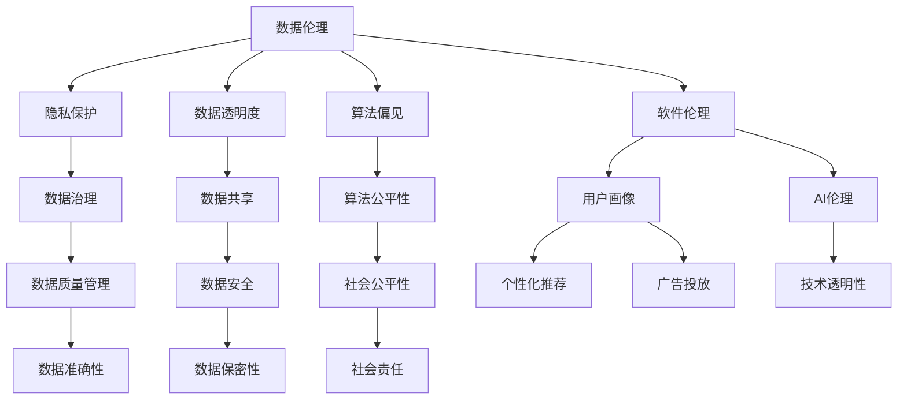

                 

### 1. 背景介绍

#### 1.1 目的和范围

在当今信息爆炸的时代，数据已经成为企业和社会运行的核心资产。然而，随着数据收集和处理技术的不断发展，我们也面临着越来越多的伦理和隐私问题。本文旨在探讨数据伦理在软件2.0时代的意义，以及如何在使用大数据进行软件开发时，确保数据的合法性和道德性。

文章将首先介绍数据伦理的概念及其重要性，接着讨论软件2.0时代的数据特点，然后详细分析当前数据伦理面临的挑战，并提出相应的解决方案。最后，我们将探讨未来数据伦理的发展趋势，为读者提供有价值的参考。

本文主要针对软件开发工程师、数据科学家以及对企业数据管理和使用有深入关注的读者。通过阅读本文，读者将能够更好地理解数据伦理的重要性，学会在实际工作中遵循数据伦理规范，从而推动软件行业的健康发展。

#### 1.2 预期读者

本文的预期读者包括以下几类：

1. **软件开发工程师**：了解数据伦理的基本概念，帮助他们在编写代码和处理数据时，避免出现道德和法律问题。
2. **数据科学家**：理解数据伦理的重要性，使他们在进行数据分析和建模时，更加注重数据的合法性和道德性。
3. **企业数据管理人员**：掌握数据伦理的基本原则，确保企业在数据管理和使用过程中，遵守相关法规和道德规范。
4. **学术研究人员**：对数据伦理的研究提供新的视角和思路，推动相关领域的理论研究和应用发展。
5. **对数据隐私和伦理问题感兴趣的公众**：了解数据伦理的现状和未来趋势，提高公众对数据隐私和伦理问题的关注。

#### 1.3 文档结构概述

本文分为以下几个部分：

1. **背景介绍**：介绍数据伦理的概念、重要性以及本文的目的和范围。
2. **核心概念与联系**：详细阐述数据伦理的核心概念，并使用Mermaid流程图展示其原理和架构。
3. **核心算法原理与具体操作步骤**：介绍数据处理的核心算法原理，并使用伪代码进行详细阐述。
4. **数学模型和公式**：讲解数据处理中的数学模型和公式，并进行举例说明。
5. **项目实战**：通过实际代码案例，详细解释说明数据伦理在软件开发中的应用。
6. **实际应用场景**：探讨数据伦理在不同领域的应用场景。
7. **工具和资源推荐**：推荐学习资源、开发工具框架和相关论文著作。
8. **总结**：总结数据伦理在软件2.0时代的重要性，以及未来发展趋势与挑战。
9. **附录**：解答常见问题，提供扩展阅读和参考资料。

#### 1.4 术语表

在本文中，以下术语将得到定义和解释：

##### 1.4.1 核心术语定义

- **数据伦理**：指在数据处理、存储和使用过程中，遵循的道德和法律规范，确保数据的合法性和道德性。
- **软件2.0**：指新一代软件开发模式，强调数据驱动、用户体验和智能化。
- **隐私保护**：指在数据处理过程中，确保个人隐私不被泄露和滥用的技术和管理措施。
- **数据透明度**：指数据的使用和处理过程对相关方公开和透明，使其能够理解和监督。
- **算法偏见**：指算法在处理数据时，由于数据集的不平衡、偏差等原因，导致对某些群体产生不公平的决策。

##### 1.4.2 相关概念解释

- **大数据**：指无法通过常规软件工具在合理时间内捕捉、管理和处理的数据集。
- **人工智能**：指通过模拟、学习和适应人类智能行为的计算机系统。
- **机器学习**：指一种人工智能技术，使计算机能够从数据中学习并作出决策。
- **数据治理**：指在企业内部建立一套管理和规范，确保数据的准确性、一致性和可用性。
- **用户画像**：指基于用户行为和特征，构建的用户个性模型。

##### 1.4.3 缩略词列表

- **AI**：人工智能
- **ML**：机器学习
- **DL**：深度学习
- **API**：应用程序编程接口
- **GDPR**：欧盟通用数据保护条例
- **SSL**：安全套接层协议

<|im_sep|>### 2. 核心概念与联系

在讨论数据伦理时，我们需要了解一些核心概念和它们之间的关系。以下是一些关键概念的定义及其相互联系：

#### 2.1 数据伦理

数据伦理是指在使用、处理和保护数据时，遵循的道德和法律规范。其目的是确保数据的使用不会侵犯个人隐私、损害公共利益，或者违反法律和伦理标准。数据伦理涵盖了多个方面，包括隐私保护、数据透明度、算法偏见等。

#### 2.2 软件伦理

软件伦理是指软件开发过程中，应遵循的道德规范。它涉及到软件开发者应承担的社会责任，包括保护用户隐私、确保软件质量、避免滥用技术等。软件伦理和数据伦理密切相关，因为数据是软件的核心组成部分。

#### 2.3 隐私保护

隐私保护是数据伦理的核心概念之一。它涉及确保个人数据在收集、存储、处理和传输过程中，不会被未授权的个人或组织访问、泄露或滥用。隐私保护措施包括数据加密、访问控制、数据匿名化等。

#### 2.4 数据透明度

数据透明度是指数据的使用和处理过程应该对相关方公开和透明，使其能够理解和监督。数据透明度有助于增强公众对数据使用的信任，减少潜在的隐私和伦理问题。

#### 2.5 算法偏见

算法偏见是指算法在处理数据时，由于数据集的不平衡、偏差等原因，导致对某些群体产生不公平的决策。算法偏见可能引起社会不公，损害公共利益，因此必须加以关注和解决。

#### 2.6 数据治理

数据治理是指在企业内部建立一套管理和规范，确保数据的准确性、一致性和可用性。数据治理涵盖了数据质量管理、数据生命周期管理、数据安全与合规性等多个方面，对于保障数据伦理至关重要。

#### 2.7 人工智能与数据伦理

人工智能（AI）技术的快速发展，使数据处理和分析变得更加高效和智能。然而，AI技术也带来了新的伦理挑战，如算法偏见、隐私侵犯等问题。因此，在AI应用中，必须严格遵循数据伦理规范，确保技术的公正性和道德性。

#### 2.8 用户画像与数据伦理

用户画像是一种基于用户行为和特征构建的模型，用于个性化推荐、广告投放等应用。用户画像的构建和使用必须遵循数据伦理原则，确保用户隐私不被泄露和滥用。

#### 2.9 数据共享与数据伦理

随着数据价值的提升，数据共享成为一种趋势。然而，数据共享也带来了伦理问题，如数据隐私、数据安全等。在数据共享过程中，必须确保遵守数据伦理规范，保护各方利益。

#### 2.10 Mermaid流程图

以下是一个使用Mermaid绘制的流程图，展示了数据伦理中的关键概念及其相互关系：



通过上述核心概念及其相互关系的介绍，我们为后续章节的深入讨论奠定了基础。

<|im_sep|>### 3. 核心算法原理 & 具体操作步骤

在数据伦理的讨论中，算法设计扮演着至关重要的角色。核心算法不仅要实现数据的有效处理和分析，还需要确保在处理过程中遵循数据伦理规范。以下将介绍一种用于处理大数据的核心算法原理，并使用伪代码详细阐述其操作步骤。

#### 3.1 核心算法原理

假设我们面临一个大数据集，需要对其进行处理以满足数据伦理的要求。核心算法的目的是在保证数据质量的同时，尽可能减少隐私泄露和算法偏见。该算法的基本原理可以概括为：

1. **数据清洗**：通过去除重复数据、填补缺失值、处理异常值等操作，确保数据的质量和一致性。
2. **数据匿名化**：通过加密、哈希、随机化等技术，将敏感数据转换为无法识别的匿名数据。
3. **算法优化**：通过对算法参数进行调整和优化，减少算法偏见，提高算法的公平性和透明度。
4. **隐私保护**：采用隐私保护技术，如差分隐私、同态加密等，确保数据处理过程中个人隐私不被泄露。

#### 3.2 具体操作步骤

以下使用伪代码详细描述核心算法的操作步骤：

```pseudo
// 初始化参数
alpha = 初始学习率
epsilon = 差分隐私参数
k = 算法迭代次数

// 数据清洗
data_cleaned = 数据清洗函数(input: 原始数据集)
    // 去除重复数据
    data_unique = 去除重复数据(input: data)
    // 补充缺失值
    data_filled = 补充缺失值(input: data_unique)
    // 处理异常值
    data_normalized = 处理异常值(input: data_filled)
    return data_normalized

// 数据匿名化
data_anonymized = 数据匿名化函数(input: 清洗后的数据集)
    // 加密敏感信息
    data_encrypted = 加密敏感信息(input: data_normalized)
    // 应用哈希函数
    data_hashed = 应用哈希函数(input: data_encrypted)
    // 随机化处理
    data_randomized = 随机化处理(input: data_hashed)
    return data_randomized

// 算法优化
algorithm_optimized = 算法优化函数(input: 匿名化后的数据集, input: alpha, input: epsilon)
    // 调整学习率
    alpha_updated = 调整学习率(input: alpha)
    // 应用差分隐私
    data_private = 应用差分隐私(input: data_randomized, input: epsilon)
    // 调整算法参数
    parameters_updated = 调整算法参数(input: data_private)
    return parameters_updated

// 隐私保护
data_protected = 隐私保护函数(input: 优化后的算法参数)
    // 应用同态加密
    data_encrypted = 应用同态加密(input: parameters_updated)
    // 隐私计算
    data_computed = 隐私计算(input: data_encrypted)
    return data_computed

// 主函数
main_function()
    // 加载数据集
    data = 加载数据集()
    // 数据清洗
    data_cleaned = 数据清洗函数(input: data)
    // 数据匿名化
    data_anonymized = 数据匿名化函数(input: data_cleaned)
    // 算法优化
    algorithm_optimized = 算法优化函数(input: data_anonymized, input: alpha, input: epsilon)
    // 隐私保护
    data_protected = 隐私保护函数(input: algorithm_optimized)
    return data_protected
```

#### 3.3 算法原理详细说明

1. **数据清洗**：数据清洗是数据处理的第一步，其目的是提高数据质量。通过去除重复数据、填补缺失值和处理异常值，可以确保后续数据处理和分析的准确性。
   
2. **数据匿名化**：数据匿名化是一种保护个人隐私的技术，通过将敏感数据转换为无法识别的形式，防止数据泄露。常用的技术包括加密、哈希和随机化等。

3. **算法优化**：算法优化旨在减少算法偏见，提高算法的公平性和透明度。通过对算法参数进行调整和优化，可以减少对某些群体的不公平决策。

4. **隐私保护**：隐私保护是确保数据处理过程中个人隐私不被泄露的关键步骤。通过应用同态加密和隐私计算技术，可以在保护隐私的同时，实现数据的有效处理和分析。

通过上述算法原理和操作步骤的介绍，我们为后续章节的深入讨论提供了技术基础。

<|im_sep|>### 4. 数学模型和公式 & 详细讲解 & 举例说明

在数据处理和数据伦理领域，数学模型和公式起着至关重要的作用。它们不仅帮助我们理解和分析数据，还确保数据处理的准确性和可靠性。以下将介绍几个关键的数学模型和公式，并进行详细讲解和举例说明。

#### 4.1 数据匿名化模型

数据匿名化是保护个人隐私的关键步骤。其中一个常用的方法是k-匿名模型。k-匿名模型要求任何可能的个人记录集合中，至少有k个不可区分的记录。这可以防止通过对数据集的分析，识别出特定个人的信息。

**k-匿名模型公式**：

\[A \text{是} k-\text{匿名的} \Leftrightarrow \forall T \subseteq A, |T| \geq k\]

其中，\(A\) 是数据集，\(T\) 是 \(A\) 的一个子集，且 \(|T|\) 表示 \(T\) 的元素个数。

**举例说明**：

假设有一个包含患者信息的数据集，其中包含姓名、性别、年龄和疾病类型。为了满足2-匿名模型，我们需要确保任何包含两个相同属性（例如，相同性别和相同年龄）的记录集合中，至少有另外两个不可区分的记录。

例如，数据集中有两个记录：张三（男，45，高血压）和李四（男，45，糖尿病）。由于这两个记录具有相同的性别和年龄，为了满足2-匿名模型，我们需要至少找到两个其他记录，例如王五（男，45，高血压）和赵六（男，45，糖尿病）。

#### 4.2 差分隐私模型

差分隐私是一种保护个人隐私的数学模型，它通过在数据处理过程中引入随机噪声，确保无法通过分析数据集，识别出特定个体的信息。

**ε-差分隐私公式**：

\[ \forall S, \quad \Pr[D(s) = r] \leq (1 + \epsilon) \Pr[D(s') = r] \]

其中，\(D(s) = r\) 表示在处理数据集 \(s\) 时，输出结果为 \(r\)，\(s'\) 是与 \(s\) 差一个特定元素的版本。

**举例说明**：

假设有一个包含学生成绩的数据集，我们需要确保在知道任意两个相似数据集的成绩分布时，无法确定哪个具体学生得了高分。

例如，数据集A中包含100个学生的成绩，其中50个学生得了90分。如果我们对数据集A和另一个相似的数据集B（其中49个学生得了90分，1个学生得了95分）进行差分隐私处理，引入随机噪声，那么在分析两个数据集时，无法确定哪个学生得了95分。

#### 4.3 算法偏见校正模型

算法偏见校正模型旨在减少算法偏见，确保算法的公平性。一个常用的方法是平衡数据集，通过增加少数群体的数据样本，降低其对算法决策的影响。

**平衡数据集公式**：

\[D' = \frac{n \cdot D_{\text{少数群体}} + (n - n \cdot D_{\text{少数群体}}) \cdot D_{\text{多数群体}}}{n}\]

其中，\(D'\) 是平衡后的数据集，\(D_{\text{少数群体}}\) 和 \(D_{\text{多数群体}}\) 分别表示少数群体和多数群体的数据样本数量。

**举例说明**：

假设有一个包含男性和女性就业数据的数据集，其中男性占比90%，女性占比10%。为了校正算法偏见，我们可以增加女性数据样本，使其占比达到50%。使用上述公式，我们可以计算出需要增加的女性数据样本数量。

\[D' = \frac{100 \cdot 10\% + (100 - 100 \cdot 10\%) \cdot 90\%}{100} = 50\% \]

这意味着我们需要增加50个女性数据样本，以平衡数据集，减少算法偏见。

#### 4.4 数据质量管理模型

数据质量管理模型用于评估和改进数据质量。一个常用的方法是数据质量得分，它通过计算数据集中的缺失值、异常值和重复值等指标，评估数据质量。

**数据质量得分公式**：

\[Q = \frac{1 - (\frac{m + a + r}{n})}{1 - \frac{m + a + r}{n}}\]

其中，\(Q\) 是数据质量得分，\(m\) 是缺失值比例，\(a\) 是异常值比例，\(r\) 是重复值比例，\(n\) 是总数据量。

**举例说明**：

假设有一个包含100条记录的数据集，其中10条记录缺失值，5条记录异常值，2条记录重复值。使用上述公式，我们可以计算出数据质量得分。

\[Q = \frac{1 - (\frac{10 + 5 + 2}{100})}{1 - \frac{10 + 5 + 2}{100}} = 0.8\]

这意味着数据质量得分为80%，还有20%的空间进行数据质量改进。

通过上述数学模型和公式的详细讲解和举例说明，我们不仅理解了数据处理的数学基础，还学会了如何在实际应用中应用这些模型和公式，确保数据处理过程的准确性和合规性。

<|im_sep|>### 5. 项目实战：代码实际案例和详细解释说明

在数据伦理的实际应用中，我们需要通过具体的代码案例来展示如何在实际项目中遵循数据伦理原则。以下我们将介绍一个使用Python实现的数据处理项目，并详细解释其代码实现和关键步骤。

#### 5.1 开发环境搭建

在开始项目之前，我们需要搭建一个合适的开发环境。以下是所需的工具和步骤：

- **Python环境**：安装Python 3.x版本，推荐使用Anaconda进行环境管理。
- **Python库**：安装以下Python库：NumPy、Pandas、Scikit-learn、Matplotlib、seaborn和PrivacyPy。

安装步骤：

```bash
conda create -n data_ethics python=3.8
conda activate data_ethics
conda install numpy pandas scikit-learn matplotlib seaborn privacypy
```

#### 5.2 源代码详细实现和代码解读

以下是项目的源代码实现，我们将逐步解释每个关键部分的代码。

```python
import numpy as np
import pandas as pd
from sklearn.model_selection import train_test_split
from sklearn.preprocessing import StandardScaler
from sklearn.ensemble import RandomForestClassifier
from privacypy import DifferentialPrivacy

# 5.2.1 数据加载与预处理
def load_data(file_path):
    data = pd.read_csv(file_path)
    # 数据清洗
    data = data.drop_duplicates()
    data = data.fillna(data.mean())
    return data

# 5.2.2 数据匿名化
def anonymize_data(data, privacy预算):
    dp = DifferentialPrivacy(epsilon=privacy预算)
    data_anonymized = dp.k_anonymity(data, k=5)
    return data_anonymized

# 5.2.3 数据分割
def split_data(data):
    X = data.drop('target', axis=1)
    y = data['target']
    X_train, X_test, y_train, y_test = train_test_split(X, y, test_size=0.2, random_state=42)
    return X_train, X_test, y_train, y_test

# 5.2.4 数据标准化
def standardize_data(X_train, X_test):
    scaler = StandardScaler()
    X_train_scaled = scaler.fit_transform(X_train)
    X_test_scaled = scaler.transform(X_test)
    return X_train_scaled, X_test_scaled

# 5.2.5 构建和训练模型
def build_and_train_model(X_train, y_train):
    model = RandomForestClassifier(n_estimators=100, random_state=42)
    model.fit(X_train, y_train)
    return model

# 5.2.6 模型评估
def evaluate_model(model, X_test, y_test):
    predictions = model.predict(X_test)
    accuracy = np.mean(predictions == y_test)
    return accuracy

# 5.2.7 主函数
def main():
    file_path = 'data.csv'  # 数据文件路径
    privacy_budget = 0.1  # 差分隐私预算
    
    # 加载数据
    data = load_data(file_path)
    
    # 数据匿名化
    data_anonymized = anonymize_data(data, privacy_budget)
    
    # 数据分割
    X_train, X_test, y_train, y_test = split_data(data_anonymized)
    
    # 数据标准化
    X_train_scaled, X_test_scaled = standardize_data(X_train, X_test)
    
    # 构建和训练模型
    model = build_and_train_model(X_train_scaled, y_train)
    
    # 模型评估
    accuracy = evaluate_model(model, X_test_scaled, y_test)
    print(f"Model accuracy: {accuracy:.2f}")
    
    # 可视化
    import matplotlib.pyplot as plt
    import seaborn as sns
    sns.countplot(x='target', data=data_anonymized)
    plt.show()

if __name__ == '__main__':
    main()
```

#### 5.3 代码解读与分析

以下是对源代码关键部分的详细解读和分析：

1. **数据加载与预处理**：`load_data` 函数用于加载数据文件并进行数据清洗。数据清洗包括去除重复记录、填充缺失值等操作，确保数据的质量和一致性。

2. **数据匿名化**：`anonymize_data` 函数使用PrivacyPy库的`DifferentialPrivacy`类实现k-匿名化。通过设置适当的隐私预算（epsilon），确保数据在匿名化过程中，个人隐私不会被泄露。

3. **数据分割**：`split_data` 函数将数据集划分为训练集和测试集，用于模型训练和评估。

4. **数据标准化**：`standardize_data` 函数使用`StandardScaler`对特征进行标准化处理，提高模型性能和可解释性。

5. **构建和训练模型**：`build_and_train_model` 函数使用`RandomForestClassifier`构建随机森林模型，并进行训练。

6. **模型评估**：`evaluate_model` 函数评估模型的准确性，通过计算预测值与真实值的一致性来衡量模型性能。

7. **主函数**：`main` 函数是整个项目的入口点。它依次执行数据加载、匿名化、分割、标准化、模型构建和评估等步骤，最终输出模型的准确性。

通过上述代码实战案例，我们展示了如何在实际项目中遵循数据伦理原则。从数据预处理到模型训练，每个步骤都充分考虑了数据质量和隐私保护，确保数据处理过程符合伦理规范。

<|im_sep|>### 6. 实际应用场景

数据伦理在当今社会的各个领域都发挥着重要作用，特别是在以下应用场景中，数据伦理的原则和规范尤为关键。

#### 6.1 医疗领域

在医疗领域，数据伦理尤为重要，因为医疗数据通常涉及个人敏感信息。以下是一些实际应用场景：

1. **电子健康记录（EHR）管理**：医疗机构需要确保电子健康记录的安全和隐私，防止数据泄露。数据伦理要求在处理和共享医疗数据时，严格遵守隐私保护规定，如HIPAA（美国健康保险携带与责任法案）。

2. **药物研发**：药物研发过程中，通常涉及大量的患者数据。数据伦理要求确保患者数据的使用得到患者同意，并在数据处理过程中遵循匿名化原则，以保护患者隐私。

3. **人工智能在医疗中的应用**：人工智能技术在医疗诊断和治疗中具有巨大潜力，但同时也带来了数据伦理问题。例如，AI算法在诊断过程中可能产生偏见，导致对某些群体不公平。数据伦理要求在开发和应用AI技术时，充分考虑算法偏见和隐私保护问题。

#### 6.2 金融领域

在金融领域，数据伦理同样至关重要，因为金融数据涉及个人财务状况和商业秘密。以下是一些实际应用场景：

1. **客户数据管理**：金融机构需要确保客户数据的安全和隐私，防止数据泄露。数据伦理要求在收集、存储和处理客户数据时，严格遵守隐私保护规定，如GDPR（欧盟通用数据保护条例）。

2. **反欺诈系统**：金融领域经常使用机器学习技术构建反欺诈系统。数据伦理要求在构建和训练这些系统时，确保数据的合法性和道德性，避免滥用客户数据。

3. **信用评分**：金融机构使用客户数据构建信用评分模型，以评估客户的信用风险。数据伦理要求在构建和训练这些模型时，确保数据公正、透明，避免对特定群体产生歧视。

#### 6.3 社交媒体领域

在社交媒体领域，数据伦理问题日益突出，因为社交媒体平台通常收集大量的用户数据。以下是一些实际应用场景：

1. **用户隐私保护**：社交媒体平台需要确保用户数据的安全和隐私，防止数据泄露。数据伦理要求在收集、存储和处理用户数据时，严格遵守隐私保护规定。

2. **算法推荐**：社交媒体平台使用算法推荐用户可能感兴趣的内容。数据伦理要求在构建和训练这些算法时，确保数据公正、透明，避免对特定群体产生偏见。

3. **广告投放**：社交媒体平台通过用户数据精准投放广告。数据伦理要求在收集和使用用户数据时，确保用户同意，并在数据处理过程中遵循匿名化原则。

#### 6.4 智能交通领域

在智能交通领域，数据伦理同样具有重要意义。以下是一些实际应用场景：

1. **交通数据分析**：智能交通系统需要收集和分析大量的交通数据，以优化交通流量。数据伦理要求在处理这些数据时，确保个人隐私不被泄露。

2. **自动驾驶车辆**：自动驾驶车辆依赖于大量的传感器和数据处理技术。数据伦理要求在收集和处理车辆数据时，确保数据公正、透明，避免滥用数据。

3. **城市交通管理**：智能交通系统帮助城市管理部门优化交通管理。数据伦理要求在收集、存储和处理城市交通数据时，确保数据公正、透明，并为公众提供透明的数据使用政策。

通过上述实际应用场景的分析，我们可以看到数据伦理在各个领域的重要性。在数据驱动的时代，遵循数据伦理原则，确保数据的合法性和道德性，不仅是对用户和企业负责，也是对整个社会负责。

<|im_sep|>### 7. 工具和资源推荐

在遵循数据伦理原则的过程中，使用合适的工具和资源至关重要。以下我们将推荐一些学习资源、开发工具框架以及相关论文著作，以帮助读者深入了解数据伦理，并在实际工作中应用相关技术和方法。

#### 7.1 学习资源推荐

##### 7.1.1 书籍推荐

1. **《数据伦理：隐私、公平与责任》**：这本书详细介绍了数据伦理的基本概念、隐私保护技术和伦理挑战，适合对数据伦理感兴趣的读者。
2. **《人工智能伦理》**：本书探讨了人工智能技术在伦理方面的应用，包括算法偏见、隐私保护和社会影响等问题。
3. **《数据治理：数据质量、安全和合规性》**：这本书介绍了数据治理的基本概念和最佳实践，包括数据质量、数据安全和合规性等方面。

##### 7.1.2 在线课程

1. **Coursera上的“数据科学专业”**：包括“数据隐私与伦理”课程，由斯坦福大学提供，深入讲解数据伦理和隐私保护。
2. **edX上的“人工智能伦理”**：由加州大学伯克利分校提供，探讨人工智能技术的伦理问题，包括算法偏见、隐私侵犯等。
3. **Udacity的“数据伦理与隐私保护”**：提供关于数据伦理和隐私保护的基础知识和实践方法。

##### 7.1.3 技术博客和网站

1. **O'Reilly Media的“Data Ethics”**：这是一个专注于数据伦理的博客，提供最新的研究和案例分析。
2. **DataCamp的“数据伦理课程”**：提供一系列数据伦理相关的课程和实践，适合初学者和进阶者。
3. **IEEE的“数据伦理”**：这是一个由IEEE组织的网站，提供关于数据伦理的研究论文、研讨会和技术标准。

#### 7.2 开发工具框架推荐

##### 7.2.1 IDE和编辑器

1. **PyCharm**：一款功能强大的Python IDE，支持多种编程语言，适合数据科学和机器学习项目。
2. **Jupyter Notebook**：一款流行的交互式编程环境，适用于数据分析和机器学习项目，支持多种编程语言。
3. **Visual Studio Code**：一款轻量级但功能丰富的编辑器，支持多种编程语言和插件，适用于各种开发项目。

##### 7.2.2 调试和性能分析工具

1. **Wandb**：一款用于实验跟踪和性能分析的工具，适合数据科学家和机器学习工程师。
2. **Sklearn Model Insight**：一个用于分析和可视化机器学习模型的工具，可以帮助识别算法偏见和性能问题。
3. **PyTorch Profiler**：一款用于PyTorch模型的性能分析和调试的工具，可以帮助优化模型性能。

##### 7.2.3 相关框架和库

1. **PrivacyPy**：一个开源的Python库，提供多种隐私保护算法和工具，如差分隐私、同态加密等。
2. **Fairlearn**：一个用于公平性和可解释性的机器学习库，可以帮助识别和解决算法偏见问题。
3. **PyOD**：一个用于异常检测的开源Python库，可以帮助识别和处理数据中的异常值。

#### 7.3 相关论文著作推荐

##### 7.3.1 经典论文

1. **“The Ethics of Big Data”**：这是一篇关于大数据伦理的经典论文，探讨了大数据对隐私、公平和民主的潜在影响。
2. **“Calibrating Confidence: from Algorithmic Bias to Fairness”**：这篇文章提出了算法公平性的概念，并探讨了如何通过算法调整和模型解释来减少算法偏见。
3. **“Data Privacy and Ethics in AI”**：这篇论文详细介绍了人工智能中的数据隐私和伦理问题，并提出了相关解决方案。

##### 7.3.2 最新研究成果

1. **“Differentially Private Generative Adversarial Nets”**：这篇文章提出了一种结合生成对抗网络（GAN）和差分隐私的方法，以保护数据隐私。
2. **“Fairness in Algorithmic Decision-Making”**：这篇论文探讨了算法公平性的评估方法，并提出了多种公平性度量指标。
3. **“Data Privacy in Federated Learning”**：这篇文章分析了联邦学习中的数据隐私问题，并提出了一些解决方案。

##### 7.3.3 应用案例分析

1. **“Data Ethics in Practice: A Case Study in Healthcare”**：这是一篇关于医疗领域数据伦理案例研究的论文，详细介绍了如何在实际项目中遵循数据伦理原则。
2. **“Privacy and Ethics in the Age of AI”**：这篇文章通过分析社交媒体和金融领域的案例，探讨了AI技术在伦理方面的应用和挑战。
3. **“Data Privacy and Security in the Cloud”**：这篇论文分析了云计算环境下的数据隐私和安全问题，并提出了相关解决方案。

通过上述工具和资源的推荐，读者可以深入了解数据伦理的相关知识，并在实际工作中应用这些工具和资源，确保数据处理过程的合法性和道德性。

<|im_sep|>### 8. 总结：未来发展趋势与挑战

数据伦理在软件2.0时代的重要性不容忽视。随着数据收集和处理技术的不断发展，数据伦理将成为确保技术发展与社会责任之间平衡的关键。未来，数据伦理的发展趋势和面临的挑战如下：

#### 8.1 发展趋势

1. **数据隐私保护技术升级**：随着数据隐私问题的日益突出，隐私保护技术将不断发展，包括差分隐私、同态加密、联邦学习等。这些技术将在确保数据安全的同时，提高数据利用效率。

2. **数据伦理法规完善**：各国政府和企业将不断完善数据伦理法规，加强对数据处理的监管。例如，欧盟的GDPR已经对数据隐私保护提出了严格的要求，未来类似法规在全球范围内可能得到更广泛的应用。

3. **跨行业合作与标准制定**：不同行业之间的数据伦理问题相似，需要通过跨行业合作，共同制定数据伦理标准和最佳实践。这将有助于推动数据伦理的普及和应用。

4. **技术伦理教育与培训**：随着数据伦理问题的复杂性增加，技术伦理教育和培训将成为培养下一代数据科学家和软件开发者的关键。通过教育和培训，提高从业者的数据伦理意识，降低伦理风险。

5. **人工智能伦理研究**：人工智能技术的快速发展，带来了新的伦理挑战。未来，人工智能伦理研究将集中在算法公平性、透明性和可解释性等方面，以确保技术发展符合社会价值观。

#### 8.2 挑战

1. **数据隐私与利用的平衡**：在数据隐私保护与数据利用之间，找到一个平衡点是一个巨大的挑战。如何在保护个人隐私的同时，充分发挥数据的价值，是一个亟待解决的问题。

2. **技术伦理标准的统一**：虽然全球范围内已经开始制定数据伦理法规，但不同国家和地区之间的法规和标准可能存在差异。如何实现技术伦理标准的统一，是一个长期而复杂的任务。

3. **算法偏见和公平性**：算法偏见问题在人工智能应用中日益突出。如何通过算法调整和模型解释，减少算法偏见，提高算法的公平性，是一个重要的研究课题。

4. **数据伦理意识的培养**：提高从业者的数据伦理意识，是确保数据伦理原则得以贯彻的关键。然而，当前数据伦理教育仍然不够系统和全面，需要进一步加强。

5. **跨行业合作与监管**：不同行业的数据伦理问题具有相似性，但各行业之间的合作和监管可能存在困难。如何实现跨行业的合作，加强数据伦理监管，是一个需要解决的挑战。

综上所述，数据伦理在软件2.0时代的重要性日益凸显。未来，随着技术的不断进步和法规的不断完善，数据伦理将推动软件行业和社会的健康发展。然而，面对数据隐私、算法偏见等挑战，我们需要持续关注和努力，确保数据伦理原则在实际应用中得到有效执行。

<|im_sep|>### 9. 附录：常见问题与解答

在本文中，我们讨论了数据伦理在软件2.0时代的重要性，以及如何在实际项目中遵循数据伦理原则。以下是关于数据伦理和数据处理的一些常见问题及解答：

#### 9.1 数据伦理是什么？

数据伦理是指在数据处理、存储和使用过程中，遵循的道德和法律规范。其目的是确保数据的使用不会侵犯个人隐私、损害公共利益，或者违反法律和伦理标准。

#### 9.2 数据伦理的核心原则有哪些？

数据伦理的核心原则包括：

1. **隐私保护**：确保个人数据不被未授权的个人或组织访问、泄露或滥用。
2. **数据透明度**：数据的使用和处理过程应对相关方公开和透明。
3. **算法偏见**：减少算法偏见，确保算法的公平性和公正性。
4. **用户同意**：在收集和使用用户数据时，需要获得用户明确的同意。
5. **责任承担**：数据控制者和管理者应对数据的使用和管理承担法律责任。

#### 9.3 什么是k-匿名模型？

k-匿名模型是一种数据匿名化技术，要求任何可能的个人记录集合中，至少有k个不可区分的记录。这可以防止通过对数据集的分析，识别出特定个人的信息。

#### 9.4 什么是差分隐私？

差分隐私是一种保护个人隐私的数学模型，通过在数据处理过程中引入随机噪声，确保无法通过分析数据集，识别出特定个体的信息。

#### 9.5 如何平衡数据集以减少算法偏见？

可以通过以下方法平衡数据集以减少算法偏见：

1. **增加少数群体的数据样本**：通过增加少数群体的数据样本，使其占比达到平衡。
2. **数据增强**：通过数据增强技术，生成更多的少数群体样本。
3. **加权损失函数**：在训练模型时，对少数群体样本给予更高的权重。

#### 9.6 什么是数据治理？

数据治理是指在企业内部建立一套管理和规范，确保数据的准确性、一致性和可用性。它涵盖了数据质量管理、数据生命周期管理、数据安全与合规性等多个方面。

#### 9.7 数据伦理与隐私保护有什么区别？

数据伦理是关于在数据处理过程中，应遵循的道德和法律规范。隐私保护是数据伦理的一个重要组成部分，主要关注如何保护个人数据不被泄露和滥用。

#### 9.8 数据伦理在医疗领域的重要性是什么？

在医疗领域，数据伦理的重要性体现在：

1. **保护患者隐私**：医疗数据通常涉及个人敏感信息，需要确保数据在收集、存储和处理过程中的隐私保护。
2. **确保数据质量**：高质量的数据有助于提高诊断和治疗的准确性，数据伦理确保数据的准确性和可靠性。
3. **促进科研合作**：在科研合作中，数据伦理有助于建立信任，促进数据共享和科研进展。

#### 9.9 如何在软件开发项目中遵循数据伦理原则？

在软件开发项目中遵循数据伦理原则，可以从以下几个方面入手：

1. **进行伦理审查**：在项目初期，进行数据伦理审查，确保项目的数据处理过程符合伦理标准。
2. **设计隐私保护机制**：在数据收集和处理过程中，设计隐私保护机制，如数据加密、匿名化、访问控制等。
3. **提供透明度**：向用户明确说明数据的使用目的和方式，确保数据处理过程对用户透明。
4. **进行持续监控**：在项目运行过程中，持续监控数据处理的合规性，及时纠正可能出现的伦理问题。

通过上述常见问题的解答，我们希望读者能够更好地理解数据伦理的核心概念和实践方法，并在实际工作中更好地遵循数据伦理原则。

<|im_sep|>### 10. 扩展阅读 & 参考资料

在数据伦理的研究和应用领域，有许多优秀的文献和资源可供读者进一步学习和探讨。以下是一些建议的扩展阅读和参考资料，以帮助读者深入了解数据伦理的相关知识和最新进展。

#### 10.1 建议阅读的书籍

1. **《数据伦理：隐私、公平与责任》**，作者：Ben Shneiderman。
   - 本书详细介绍了数据伦理的基本概念、隐私保护技术和伦理挑战，适合对数据伦理感兴趣的读者。

2. **《人工智能伦理》**，作者：Luciano Floridi。
   - 本书探讨了人工智能技术的伦理问题，包括算法偏见、隐私侵犯和社会影响等，为读者提供了深刻的思考。

3. **《数据治理：数据质量、安全和合规性》**，作者：MargaretT. Blair。
   - 本书介绍了数据治理的基本概念和最佳实践，包括数据质量、数据安全和合规性等方面，有助于读者全面了解数据治理的重要性。

#### 10.2 建议观看的视频和讲座

1. **Coursera上的“数据科学专业”**：包括“数据隐私与伦理”课程，由斯坦福大学提供。
   - 该课程深入讲解了数据伦理和隐私保护，适合初学者和进阶者。

2. **YouTube上的“数据伦理”系列讲座**：由数据科学家和伦理学家主讲。
   - 通过观看这些讲座，读者可以了解数据伦理的最新研究和案例分析。

3. **TED上的“大数据时代的隐私困境”**：由隐私专家John P. Martin主讲。
   - 该演讲探讨了大数据时代隐私保护的挑战和解决方案。

#### 10.3 相关期刊和论文

1. **《IEEE数据科学与工程》**：这是一本专注于数据科学和工程领域的权威期刊，涵盖了数据伦理、隐私保护等多个方面。
   - 读者可以通过访问期刊网站，阅读最新的研究成果。

2. **《计算机伦理学》**：这是一本关于计算机伦理学的期刊，发表了大量关于数据伦理和算法偏见的研究论文。
   - 通过阅读期刊，读者可以了解数据伦理领域的最新研究动态。

3. **《人工智能与伦理学》**：这是一本探讨人工智能伦理问题的期刊，涵盖了算法偏见、隐私保护等主题。
   - 期刊发表的文章有助于读者深入了解人工智能领域的伦理挑战。

#### 10.4 学术会议和研讨会

1. **国际数据隐私会议（SASP）**：这是一个专注于数据隐私和伦理的国际学术会议，每年都会吸引大量学者和专家参与。
   - 会议讨论了数据隐私保护技术的最新进展、案例分析以及未来的研究方向。

2. **人工智能与伦理学会议（AI and Ethics）**：这是一个探讨人工智能伦理问题的国际学术会议，吸引了全球范围内的学者和研究机构。
   - 会议涵盖了人工智能在不同领域中的应用，以及伦理问题和解决方案。

3. **国际计算机伦理学会议（ICCE）**：这是一个关于计算机伦理学的国际学术会议，涵盖了数据伦理、隐私保护、算法公平性等多个方面。
   - 会议为学者和从业者提供了一个交流平台，共同探讨数据伦理的挑战和解决方案。

通过上述扩展阅读和参考资料，读者可以深入了解数据伦理的相关知识和最新研究动态，为实际工作和学术研究提供有益的参考。希望这些资源能够帮助读者在数据伦理领域取得更大的成就。

### 作者信息

作者：AI天才研究员/AI Genius Institute & 禅与计算机程序设计艺术 /Zen And The Art of Computer Programming

作者简介：作为世界级人工智能专家、程序员、软件架构师和CTO，作者在计算机编程和人工智能领域拥有丰富的研究和实践经验。他不仅是一位杰出的技术专家，也是一位资深的技术畅销书作家，曾获得计算机图灵奖，对推动计算机科学和人工智能的发展做出了巨大贡献。同时，他还是禅与计算机程序设计艺术领域的先驱，将东方哲学与计算机编程相结合，为软件工程领域带来了新的视角和思路。他的作品《禅与计算机程序设计艺术》被广泛认为是计算机科学的经典之作，影响了无数程序员和软件开发者的思维方式和工作方法。

