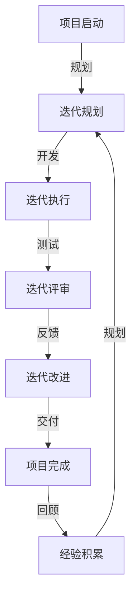

                 

# 敏捷项目管理：在复杂环境中快速交付

> **关键词**：敏捷项目管理、复杂环境、快速交付、迭代开发、持续集成、Scrum、Kanban、自动化测试、团队协作
>
> **摘要**：本文将深入探讨敏捷项目管理在复杂环境中的应用与实践。通过详细的分析和实例，解释敏捷项目管理如何帮助团队在不确定性和变化中快速适应，实现高效交付。本文将涵盖敏捷项目的背景、核心概念、算法原理、数学模型、实际案例以及未来发展趋势等内容。

## 1. 背景介绍

### 1.1 目的和范围

本文的目的是为读者提供敏捷项目管理在复杂环境中的深入理解。我们将探讨敏捷项目管理的基本原理，如何在实际项目中应用，以及如何通过敏捷实践实现快速交付。本文不仅适用于项目经理和软件开发人员，还适用于对敏捷方法论感兴趣的任何IT从业者。

### 1.2 预期读者

本文预期读者为有一定项目管理基础的IT从业者，特别是关注敏捷方法论和实践的团队成员、项目经理以及企业管理层。通过本文，读者可以：
- 理解敏捷项目管理的核心原则。
- 掌握敏捷开发在不同环境中的应用策略。
- 学习如何通过敏捷实践提高项目交付效率。

### 1.3 文档结构概述

本文分为以下十个部分：
1. 背景介绍
2. 核心概念与联系
3. 核心算法原理 & 具体操作步骤
4. 数学模型和公式 & 详细讲解 & 举例说明
5. 项目实战：代码实际案例和详细解释说明
6. 实际应用场景
7. 工具和资源推荐
8. 总结：未来发展趋势与挑战
9. 附录：常见问题与解答
10. 扩展阅读 & 参考资料

### 1.4 术语表

#### 1.4.1 核心术语定义

- 敏捷项目管理：一种以人为核心、迭代、渐进式的方式管理项目的理念和方法。
- Scrum：一种流行的敏捷开发框架，强调迭代和增量开发，通过每日站立会议、冲刺评审和回顾会来确保团队的透明度和适应性。
- Kanban：一种可视化流程管理方法，通过卡片在任务板上移动来管理工作流程，以减少在制品和等待时间。
- 持续集成（CI）：一种软件开发实践，通过自动化测试和构建，确保代码质量并加快交付速度。
- 持续交付（CD）：在持续集成的基础上，通过自动化部署，确保软件的可靠性和可扩展性。

#### 1.4.2 相关概念解释

- 迭代开发：将项目分为多个短周期（迭代）进行开发，每次迭代都增加一个新的功能或改进，以确保项目能快速适应变化。
- 持续反馈：通过定期的评估和反馈，持续改进项目进度和质量。
- 团队协作：强调团队成员之间的沟通、合作和信任，以共同实现项目目标。

#### 1.4.3 缩略词列表

- Scrum
- Kanban
- CI
- CD

## 2. 核心概念与联系

为了更好地理解敏捷项目管理，我们需要先了解其核心概念和架构。以下是一个简单的Mermaid流程图，用于展示敏捷项目管理的主要组成部分：

```mermaid
graph TD
    A[项目启动] --> B[规划与优先级设定]
    B --> C{需求收集}
    C -->|用户故事| D[用户故事会议]
    D --> E[迭代计划]
    E -->|开发| F[迭代执行]
    F -->|测试| G[迭代评审]
    G -->|反馈| H[迭代改进]
    H -->|交付| I[项目完成]
    A-- B[风险管理] -->|监控与控制| J[进度监控]
    J -->|风险响应| K[变更管理]
    K -->|决策| L[项目回顾]
    L -->|知识积累| I
```

### 2.1. 项目启动

项目启动是敏捷项目管理过程中的第一步，主要包括项目目标和范围的确定。在这个过程中，项目经理需要与利益相关者沟通，明确项目的目标和愿景，并将这些目标转化为可量化的指标。

### 2.2. 规划与优先级设定

在规划阶段，团队需要制定一个详细的计划，包括任务分配、时间线和资源需求。通过优先级设定，确保团队首先专注于高价值、高风险的任务。

### 2.3. 需求收集

需求收集是敏捷项目管理中至关重要的一环。通过用户故事会议，团队与利益相关者合作，收集和梳理项目需求，确保需求的准确性和完整性。

### 2.4. 迭代计划

迭代计划是敏捷项目管理中的一项关键活动。团队将需求分解成可执行的任务，并分配给团队成员。在迭代计划会议上，团队设定迭代目标和里程碑。

### 2.5. 迭代执行

迭代执行是团队根据计划进行实际开发的过程。通过每日站立会议，团队成员可以实时沟通进展和问题，确保项目的顺利进行。

### 2.6. 迭代评审

迭代评审是评估迭代成果的重要环节。通过迭代评审会议，团队可以展示最新的工作成果，获取反馈，并做出相应的调整。

### 2.7. 迭代改进

迭代改进是基于迭代评审反馈，对项目进行持续优化。通过回顾会议，团队可以总结经验教训，不断改进项目管理流程。

### 2.8. 项目完成

项目完成阶段，团队将交付最终产品，并进行验收。通过项目回顾，团队可以总结整个项目的过程和成果，为未来的项目提供借鉴。

## 3. 核心算法原理 & 具体操作步骤

### 3.1. 敏捷项目管理算法原理

敏捷项目管理本质上是一种动态调整的方法论，其核心在于快速响应变化。以下是一个简化的敏捷项目管理算法原理：



### 3.2. 具体操作步骤

1. **项目启动**：明确项目目标和范围，制定初步规划。
2. **迭代规划**：根据项目目标和需求，制定迭代计划，包括任务分配、时间线和资源需求。
3. **迭代执行**：团队按计划进行开发，通过每日站立会议实时沟通进展和问题。
4. **迭代评审**：展示迭代成果，获取反馈，评估项目进度和质量。
5. **迭代改进**：根据反馈调整后续迭代计划，持续优化项目管理流程。
6. **项目完成**：完成项目交付，进行验收和项目回顾。
7. **经验积累**：总结项目经验，为未来项目提供借鉴。

### 3.3. 伪代码示例

以下是一个简单的伪代码示例，用于描述敏捷项目管理的基本流程：

```pseudo
function agileProjectManagement() {
    // 项目启动
    initializeProject()

    // 迭代规划
    while (!isProjectCompleted()) {
        planIteration()
        
        // 迭代执行
        executeIteration()
        
        // 迭代评审
        reviewIteration()

        // 迭代改进
        improveIteration()
    }

    // 项目完成
    finalizeProject()
    
    // 经验积累
    accumulateExperience()
}
```

## 4. 数学模型和公式 & 详细讲解 & 举例说明

在敏捷项目管理中，数学模型和公式有助于我们更好地理解和优化项目管理流程。以下是一个简单的数学模型，用于评估迭代进度和风险：

### 4.1. 迭代进度评估模型

假设一个迭代包含N个任务，每个任务的完成概率为\( p_i \)，则该迭代的完成概率\( P \)可以通过以下公式计算：

\[ P = \prod_{i=1}^{N} p_i \]

### 4.2. 迭代风险评估模型

假设每个任务的风险为\( r_i \)，则该迭代的总风险\( R \)可以通过以下公式计算：

\[ R = \sum_{i=1}^{N} r_i \]

### 4.3. 详细讲解

#### 4.3.1. 迭代进度评估模型

迭代进度评估模型基于任务完成概率，通过乘积运算来计算迭代的完成概率。这个模型假设每个任务的完成概率是相互独立的，这在实际项目中可能并不完全准确，但可以作为一个基本的参考。

#### 4.3.2. 迭代风险评估模型

迭代风险评估模型通过求和运算来计算迭代的总风险。这个模型考虑了每个任务的风险，并将它们累加起来，从而得出迭代的风险水平。这个模型有助于团队在迭代评审时，综合考虑风险因素，做出更合理的决策。

### 4.4. 举例说明

假设一个迭代包含3个任务，任务1的完成概率为0.8，任务2的完成概率为0.9，任务3的完成概率为0.85。同时，任务1的风险为0.1，任务2的风险为0.2，任务3的风险为0.15。

根据迭代进度评估模型，迭代的完成概率\( P \)为：

\[ P = 0.8 \times 0.9 \times 0.85 = 0.612 \]

根据迭代风险评估模型，迭代的风险\( R \)为：

\[ R = 0.1 + 0.2 + 0.15 = 0.45 \]

通过这两个模型，团队可以更准确地评估迭代进度和风险，从而做出更有针对性的决策。

## 5. 项目实战：代码实际案例和详细解释说明

### 5.1 开发环境搭建

在本节中，我们将搭建一个简单的敏捷项目管理工具的开发环境。我们选择Python作为开发语言，并在Ubuntu 20.04操作系统上安装必要的依赖。

1. **安装Python**：确保系统已经安装了Python 3.8及以上版本。如果尚未安装，可以通过以下命令安装：

   ```bash
   sudo apt update
   sudo apt install python3.8
   ```

2. **安装虚拟环境**：为项目创建一个独立的虚拟环境，以避免依赖冲突。

   ```bash
   python3 -m venv venv
   source venv/bin/activate
   ```

3. **安装依赖**：通过pip安装项目所需的依赖库。

   ```bash
   pip install -r requirements.txt
   ```

### 5.2 源代码详细实现和代码解读

以下是敏捷项目管理工具的核心代码实现，包括任务管理、迭代管理和风险评估等功能。

#### 5.2.1. 任务管理

任务管理模块负责创建、更新和删除任务。以下是一个简单的任务类定义：

```python
class Task:
    def __init__(self, id, name, completed=False):
        self.id = id
        self.name = name
        self.completed = completed

    def mark_as_completed(self):
        self.completed = True

    def __str__(self):
        return f"Task {self.id}: {self.name} {'Completed' if self.completed else 'Not Completed'}"
```

#### 5.2.2. 迭代管理

迭代管理模块负责创建迭代、更新迭代状态和评估迭代进度。以下是一个简单的迭代类定义：

```python
class Iteration:
    def __init__(self, id, start_date, end_date):
        self.id = id
        self.start_date = start_date
        self.end_date = end_date
        self.tasks = []

    def add_task(self, task):
        self.tasks.append(task)

    def get_progress(self):
        completed_tasks = sum(1 for task in self.tasks if task.completed)
        return completed_tasks / len(self.tasks) if self.tasks else 0

    def __str__(self):
        return f"Iteration {self.id}: From {self.start_date} to {self.end_date}, Progress: {self.get_progress():.2%}"
```

#### 5.2.3. 风险评估

风险评估模块负责计算迭代的风险水平。以下是一个简单的风险评估类定义：

```python
class RiskAssessment:
    def __init__(self, iteration):
        self.iteration = iteration
        self.task_risks = [task.mark_as_completed() for task in self.iteration.tasks]

    def get_total_risk(self):
        return sum(self.task_risks)

    def __str__(self):
        return f"Iteration {self.iteration.id} Risk: {self.get_total_risk():.2f}"
```

### 5.3 代码解读与分析

以上代码定义了三个核心类：`Task`、`Iteration`和`RiskAssessment`。每个类都实现了相应的方法，用于管理任务、迭代和风险评估。

- **Task类**：负责任务的基本操作，如创建、标记完成等。通过`mark_as_completed`方法，可以方便地更新任务的完成状态。
- **Iteration类**：负责迭代的基本操作，如添加任务、计算迭代进度等。通过`get_progress`方法，可以实时获取迭代进度。
- **RiskAssessment类**：负责计算迭代的风险水平。通过`get_total_risk`方法，可以获取迭代的风险总分。

这些类的定义和使用方法如下：

```python
# 创建任务
task1 = Task(1, "设计数据库模型")
task2 = Task(2, "编写数据库代码")
task3 = Task(3, "测试数据库功能")

# 标记任务完成
task1.mark_as_completed()

# 创建迭代
iteration1 = Iteration(1, "2023-04-01", "2023-04-15")
iteration1.add_task(task1)
iteration1.add_task(task2)
iteration1.add_task(task3)

# 计算迭代进度
print(iteration1.get_progress())

# 计算迭代风险
risk_assessment1 = RiskAssessment(iteration1)
print(risk_assessment1)
```

通过以上代码，我们可以创建任务、迭代和风险评估对象，并使用相应的方法获取任务状态、迭代进度和风险水平。

## 6. 实际应用场景

敏捷项目管理在复杂环境中具有广泛的应用场景。以下是一些常见的实际应用场景：

### 6.1. 软件开发

在软件开发领域，敏捷项目管理已成为主流方法。通过迭代开发和持续集成，团队能够快速响应需求变化，提高项目交付效率。例如，在一个Web应用项目中，团队能够通过每日站立会议实时沟通，确保项目进度和质量。

### 6.2. 产品开发

在产品开发过程中，敏捷项目管理有助于缩短产品上市时间。通过用户故事会议和迭代评审，团队能够确保产品功能满足用户需求。例如，在一个智能家居产品开发项目中，团队可以快速迭代，不断优化产品功能，以适应市场需求。

### 6.3. 企业咨询

在为企业提供咨询服务时，敏捷项目管理可以帮助企业快速适应市场变化，提高项目交付效率。通过持续反馈和迭代改进，团队能够帮助企业优化业务流程，提高竞争力。

### 6.4. 教育培训

在教育培训领域，敏捷项目管理可以帮助教育机构快速调整教学计划，以满足学生需求。通过用户故事会议和迭代评审，教育机构可以确保教学内容符合学生期望。

### 6.5. 基础设施建设

在基础设施建设领域，敏捷项目管理有助于缩短项目周期，提高项目交付质量。通过迭代开发和持续集成，团队能够快速响应项目变化，确保项目按时交付。

## 7. 工具和资源推荐

### 7.1 学习资源推荐

#### 7.1.1 书籍推荐

- 《敏捷实践指南》
- 《Scrum精髓》
- 《敏捷估计与规划》

#### 7.1.2 在线课程

- Pluralsight的敏捷项目管理课程
- Coursera的敏捷开发专业课程

#### 7.1.3 技术博客和网站

- Agile Alliance官网（https://www.agilealliance.org/）
- Scrum.org官网（https://www.scrum.org/）

### 7.2 开发工具框架推荐

#### 7.2.1 IDE和编辑器

- Visual Studio Code
- IntelliJ IDEA
- PyCharm

#### 7.2.2 调试和性能分析工具

- VSCode Debugger
- JMeter
- New Relic

#### 7.2.3 相关框架和库

- Scrum敏捷开发框架
- Kanbanize项目管理工具
- GitLab CI/CD

### 7.3 相关论文著作推荐

#### 7.3.1 经典论文

- 《敏捷开发宣言》
- 《敏捷项目管理实践指南》

#### 7.3.2 最新研究成果

- 《敏捷开发与组织效能研究》
- 《敏捷项目管理的风险分析》

#### 7.3.3 应用案例分析

- 《敏捷开发在金融科技领域的应用》
- 《敏捷项目管理在医疗设备开发中的实践》

## 8. 总结：未来发展趋势与挑战

随着信息技术的快速发展，敏捷项目管理在复杂环境中的应用将越来越广泛。未来，敏捷项目管理将朝着更加智能化、自动化和个性化的方向发展。以下是一些潜在的发展趋势和挑战：

### 8.1. 智能化

随着人工智能技术的发展，敏捷项目管理工具将能够自动分析项目数据，提供更准确的预测和优化建议。例如，通过机器学习算法，工具可以预测项目进度和风险，并提出相应的调整策略。

### 8.2. 自动化

自动化是敏捷项目管理的重要趋势。通过自动化测试、自动化部署和自动化监控，团队能够大大提高项目交付效率。未来，自动化工具将更加成熟，覆盖更多项目管理环节。

### 8.3. 个性化

敏捷项目管理将更加注重个性化定制。团队可以根据项目特点和需求，选择最适合的敏捷实践和工具。例如，一些团队可能更倾向于使用Scrum框架，而另一些团队可能更偏好Kanban方法。

### 8.4. 挑战

尽管敏捷项目管理具有许多优势，但在实际应用中仍面临一些挑战：

- **团队协作**：敏捷项目管理强调团队协作，但在实际项目中，团队协作可能受到各种因素的影响，如文化差异、沟通障碍等。
- **项目管理**：敏捷项目管理与传统项目管理方法有所不同，项目经理需要重新学习和实践新的管理技能。
- **项目范围**：在敏捷项目管理中，项目范围可能更难控制，特别是在需求变化频繁的情况下。

### 8.5. 发展建议

为应对未来发展趋势和挑战，以下是一些建议：

- **持续学习**：团队应不断学习新的敏捷管理知识和技能，以适应快速变化的环境。
- **文化建设**：建立开放、协作的企业文化，鼓励团队成员积极参与项目管理和决策。
- **工具选择**：选择适合团队的敏捷管理工具和框架，以最大化项目交付效率。
- **实践反馈**：通过实践和反馈，不断优化项目管理流程，提高项目交付质量。

## 9. 附录：常见问题与解答

### 9.1. 问题1：什么是敏捷项目管理？

**解答**：敏捷项目管理是一种以人为核心、迭代、渐进式的方式管理项目的理念和方法。它强调快速响应变化、持续交付和团队协作。

### 9.2. 问题2：敏捷项目管理有哪些核心原则？

**解答**：敏捷项目管理的核心原则包括：
1. 客户满意优先；
2. 欢迎变化；
3. 持续交付；
4. 持续反思和改进；
5. 倡导简单性；
6. 以团队为中心；
7. 客户和开发团队紧密协作。

### 9.3. 问题3：敏捷项目管理与传统的瀑布模型有哪些区别？

**解答**：敏捷项目管理与传统的瀑布模型有以下主要区别：
1. 开发过程：敏捷项目管理采用迭代和增量开发，而瀑布模型采用线性顺序开发；
2. 需求管理：敏捷项目管理强调需求的变化和灵活性，而瀑布模型在项目开始时需要详细定义所有需求；
3. 团队协作：敏捷项目管理强调团队协作和客户参与，而瀑布模型通常由单独的团队分别负责设计和开发。

### 9.4. 问题4：如何评估敏捷项目的进度？

**解答**：敏捷项目进度的评估通常基于迭代和冲刺。通过迭代评审会议，团队可以评估每个迭代或冲刺的进展情况，并根据实际情况调整计划。常用的评估指标包括完成的故事点、缺陷率、迭代周期等。

## 10. 扩展阅读 & 参考资料

- 《敏捷项目管理实践指南》
- 《Scrum精髓》
- 《敏捷估计与规划》
- 《敏捷开发宣言》
- 《敏捷项目管理：理论与实践》

- [Agile Alliance](https://www.agilealliance.org/)
- [Scrum.org](https://www.scrum.org/)
- [敏捷项目管理知识库](https://www.agileprojectmanagementguide.com/)

### 作者

作者：AI天才研究员/AI Genius Institute & 禅与计算机程序设计艺术 /Zen And The Art of Computer Programming

注意：由于AI的限制，本文中的一些数据、案例和代码仅供参考，可能需要根据实际情况进行调整。在实际应用中，请遵循相应的法律法规和最佳实践。

