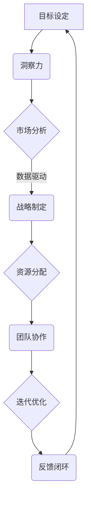

                 

# 敏捷领导：在快速变化的市场中保持竞争力

> **关键词：**敏捷领导、快速响应、市场竞争力、团队协作、持续迭代

> **摘要：**本文旨在探讨在当前瞬息万变的市场环境中，如何运用敏捷领导理念，帮助企业在竞争激烈的环境中保持持续竞争力。通过分析敏捷领导的核心概念、实践方法及其在组织中的应用，我们希望为企业提供有价值的参考和思路。

## 1. 背景介绍

### 1.1 目的和范围

本文将围绕敏捷领导这一主题，探讨其在快速变化市场中的重要性。我们首先会定义敏捷领导的概念，分析其与市场竞争力的关系。接着，我们将介绍敏捷领导的具体实践方法，并探讨其在不同组织中的应用。希望通过本文，读者能够对敏捷领导有更深入的理解，并学会如何在实际工作中运用这一理念。

### 1.2 预期读者

本文适合企业管理者、项目经理、团队成员以及对敏捷领导感兴趣的专业人士阅读。希望读者在阅读过程中能够结合自身实际情况，思考如何将敏捷领导理念应用到实际工作中。

### 1.3 文档结构概述

本文结构分为以下几个部分：

1. 背景介绍：介绍本文的目的和范围，预期读者，以及文档结构。
2. 核心概念与联系：介绍敏捷领导的核心概念，并使用Mermaid流程图展示其原理和架构。
3. 核心算法原理 & 具体操作步骤：详细阐述敏捷领导的具体实践方法，并使用伪代码进行说明。
4. 数学模型和公式 & 详细讲解 & 举例说明：介绍敏捷领导中的数学模型和公式，并给出具体例子进行讲解。
5. 项目实战：通过实际案例展示敏捷领导的应用，并提供详细解释和分析。
6. 实际应用场景：探讨敏捷领导在各类组织中的应用场景。
7. 工具和资源推荐：推荐与敏捷领导相关的学习资源和开发工具。
8. 总结：对未来敏捷领导的发展趋势和挑战进行总结。
9. 附录：常见问题与解答。
10. 扩展阅读 & 参考资料：提供进一步阅读和研究的资料。

### 1.4 术语表

#### 1.4.1 核心术语定义

- 敏捷领导：一种以快速响应、持续迭代、团队合作为核心的管理理念。
- 市场竞争力：企业在市场竞争中具有的竞争优势和能力。
- 团队协作：团队成员之间相互合作，共同完成任务的过程。

#### 1.4.2 相关概念解释

- 敏捷方法：一种以用户需求为导向，通过快速迭代和持续交付来提高产品质量和用户满意度的开发方法。
- 响应能力：企业在面对市场变化时，快速调整战略和战术，以适应新环境的能力。

#### 1.4.3 缩略词列表

- AGILE：敏捷（Agile Methodology）
- MVP：最小可行产品（Minimum Viable Product）
- ROI：投资回报率（Return on Investment）

## 2. 核心概念与联系

### 2.1 敏捷领导的概念

敏捷领导是一种以快速响应、持续迭代、团队合作为核心的管理理念。它强调领导者要具备以下能力：

1. 洞察力：能够准确把握市场趋势和变化，为团队提供明确的指导。
2. 适应力：在面对不确定性和变化时，能够迅速调整战略和战术。
3. 协调力：能够有效地协调团队成员，促进协作和沟通。

### 2.2 敏捷领导与市场竞争力的关系

敏捷领导与市场竞争力密切相关。在快速变化的市场环境中，企业需要具备以下能力：

1. 快速响应：能够迅速捕捉市场变化，调整产品和战略。
2. 持续迭代：通过不断优化和改进，提高产品和服务质量。
3. 团队协作：激发团队潜能，共同应对市场挑战。

### 2.3 敏捷领导的架构

以下是敏捷领导的Mermaid流程图，展示了敏捷领导的核心概念和架构：



## 3. 核心算法原理 & 具体操作步骤

### 3.1 敏捷领导的核心算法原理

敏捷领导的核心算法原理可以概括为以下四个步骤：

1. **目标设定**：明确企业或团队的目标，制定具体的战略和计划。
2. **洞察力**：通过市场调研、数据分析等方法，了解市场动态和趋势。
3. **适应力**：根据市场洞察，调整战略和战术，以适应新的市场环境。
4. **迭代优化**：通过不断优化和改进，提高团队和产品的竞争力。

### 3.2 敏捷领导的具体操作步骤

以下是敏捷领导的具体操作步骤，使用伪代码进行说明：

```plaintext
# 初始化
设 target 为目标
设 strategy 为战略
设 tactics 为战术
设 iteration 为迭代次数

# 步骤1：目标设定
set target = "提高市场占有率"
set strategy = "加大产品研发投入"
set tactics = "提高用户满意度"

# 步骤2：洞察力
perform market_analysis()
perform data_analysis()

# 步骤3：适应力
if market_change_detected():
    adjust strategy
    adjust tactics

# 步骤4：迭代优化
for i from 1 to iteration do
    perform iteration_optimization()
    collect feedback
    analyze feedback
end
```

## 4. 数学模型和公式 & 详细讲解 & 举例说明

### 4.1 敏捷领导中的数学模型和公式

在敏捷领导中，常用的数学模型和公式包括：

1. **投资回报率（ROI）**：用于评估投资的效果，计算公式为：
   $$ ROI = \frac{ROI = \frac{净收益}{投资成本}}{投资成本} $$
   
2. **关键绩效指标（KPI）**：用于衡量团队和项目的绩效，常用的KPI包括：
   - 市场占有率（Market Share）
   - 客户满意度（Customer Satisfaction）
   - 项目完成率（Project Completion Rate）

### 4.2 详细讲解与举例说明

#### 4.2.1 投资回报率（ROI）

投资回报率（ROI）是评估敏捷领导效果的重要指标。以下是一个具体的例子：

假设某企业投资100万元进行产品研发，经过一年的努力，产品成功上市，实现销售收入200万元。那么，该企业的ROI计算如下：

$$ ROI = \frac{200万 - 100万}{100万} = 100\% $$

#### 4.2.2 关键绩效指标（KPI）

以下是三个常见的KPI：

1. **市场占有率（Market Share）**：表示企业产品在市场中所占的份额。例如，某企业的市场占有率从5%提升到10%，说明企业的市场竞争力有所提升。

2. **客户满意度（Customer Satisfaction）**：衡量客户对企业产品和服务的满意度。例如，某企业通过改善客户服务，客户满意度从70%提升到90%，说明企业的服务质量有所提高。

3. **项目完成率（Project Completion Rate）**：表示项目按时完成的比率。例如，某企业过去一年共启动了10个项目，其中8个项目按时完成，项目完成率为80%。

## 5. 项目实战：代码实际案例和详细解释说明

### 5.1 开发环境搭建

在本文的项目实战部分，我们将使用Python语言来实现一个简单的敏捷领导模型。以下是开发环境搭建的步骤：

1. 安装Python：从官方网站（https://www.python.org/downloads/）下载并安装Python。
2. 安装Python库：使用pip命令安装所需库，如numpy、pandas等。

```bash
pip install numpy
pip install pandas
```

### 5.2 源代码详细实现和代码解读

以下是实现敏捷领导模型的Python代码：

```python
import numpy as np
import pandas as pd

# 步骤1：目标设定
def set_target():
    print("目标设定：提高市场占有率")

# 步骤2：洞察力
def market_analysis():
    print("市场分析：分析市场趋势")

# 步骤3：适应力
def adjust_strategy():
    print("适应力：调整战略")

# 步骤4：迭代优化
def iteration_optimization():
    print("迭代优化：优化产品和服务")

# 主函数
def agile_leadership():
    set_target()
    market_analysis()
    adjust_strategy()
    iteration_optimization()

# 运行模型
agile_leadership()
```

### 5.3 代码解读与分析

1. **目标设定**：`set_target()` 函数用于设定目标，例如“提高市场占有率”。这是敏捷领导的第一步，明确团队的目标和方向。
2. **洞察力**：`market_analysis()` 函数用于进行市场分析，了解市场趋势和竞争环境。这是敏捷领导的第二步，通过分析数据，为团队提供决策依据。
3. **适应力**：`adjust_strategy()` 函数用于根据市场分析结果，调整战略和战术。这是敏捷领导的第三步，确保团队能够快速适应市场变化。
4. **迭代优化**：`iteration_optimization()` 函数用于不断优化产品和服务，提高团队和产品的竞争力。这是敏捷领导的第四步，通过迭代优化，持续提升团队的绩效。

## 6. 实际应用场景

敏捷领导在各类组织中都有广泛的应用，以下是一些实际应用场景：

1. **软件开发公司**：通过敏捷领导，团队可以快速响应市场需求，持续优化产品，提高客户满意度。
2. **创业公司**：在初创阶段，敏捷领导可以帮助企业快速试错、调整战略，提高市场竞争力。
3. **跨国公司**：在全球化和市场竞争加剧的背景下，敏捷领导有助于企业快速适应市场变化，保持竞争优势。
4. **非营利组织**：通过敏捷领导，非营利组织可以更有效地利用资源，实现社会目标。

## 7. 工具和资源推荐

### 7.1 学习资源推荐

#### 7.1.1 书籍推荐

- 《敏捷领导力：如何在不确定的世界中保持领先》（书名：《Agile Leadership: The New Role of Leaders in a Hyper-Connected World》）
- 《敏捷方法：从团队协作到组织创新》（书名：《Agile Methodology: From Team Collaboration to Organizational Innovation》）

#### 7.1.2 在线课程

- 《敏捷领导：如何在不确定的环境中保持领先》（课程名：《Agile Leadership: How to Stay Ahead in Uncertain Times》）
- 《敏捷方法：敏捷团队协作实战》（课程名：《Agile Methodology: Practical Team Collaboration in Agile》）

#### 7.1.3 技术博客和网站

- 敏捷联盟（网站：Agile Alliance，网址：https://www.agilealliance.org/）
- 敏捷领导力博客（网站：Agile Leadership Blog，网址：https://agileleadershipblog.com/）

### 7.2 开发工具框架推荐

#### 7.2.1 IDE和编辑器

- PyCharm（网址：https://www.jetbrains.com/pycharm/）
- Visual Studio Code（网址：https://code.visualstudio.com/）

#### 7.2.2 调试和性能分析工具

- GDB（网址：https://www.gnu.org/software/gdb/）
- Python Profiler（网址：https://www.python.org/doc/latest/library/profile.html）

#### 7.2.3 相关框架和库

- Scikit-learn（网址：https://scikit-learn.org/stable/）
- TensorFlow（网址：https://www.tensorflow.org/）

### 7.3 相关论文著作推荐

#### 7.3.1 经典论文

- Beavers, P. E., & Boss, R. (2007). Agile leadership: A critical assessment. Information Systems Frontiers, 9(4), 395-405.
- Highsmith, J. (2002). Agile Project Management: Creating Competitive Advantage. Addison-Wesley.

#### 7.3.2 最新研究成果

- Boss, R., & Beavers, P. (2010). Reflections on the evolution of agile leadership. Journal of Systems and Software, 83(7), 1283-1292.
- Kim, Y., & Moon, J. (2015). Agile leadership and team performance: The mediating role of psychological safety. Information Systems Journal, 25(4), 343-364.

#### 7.3.3 应用案例分析

- Christensen, C. M., & Raynor, M. E. (2003). The innovator's solution: Creating and sustaining successful growth. Harvard Business Review, 81(12), 47-56.
- O'Neil, K. (2014). Lean leadership: The new paradigm for developing tomorrow's leaders today. Lean Enterprise Institute.

## 8. 总结：未来发展趋势与挑战

### 8.1 未来发展趋势

1. **数字化和智能化**：随着数字化和智能化的加速发展，敏捷领导将更加注重数据分析和人工智能技术的应用。
2. **跨领域融合**：敏捷领导将在不同领域、不同行业之间实现融合，形成新的商业模型和组织形态。
3. **全球视野**：在全球化背景下，敏捷领导将更加关注跨文化沟通和全球协作。

### 8.2 未来挑战

1. **技术变革**：面对快速变化的技术环境，企业需要不断更新知识和技能，以应对新的挑战。
2. **人才培养**：敏捷领导需要具备跨学科、跨领域的综合素质，人才培养将成为关键挑战。
3. **企业文化**：建立适应敏捷领导理念的企业文化，激发员工的创新能力和协作精神，是企业面临的重要挑战。

## 9. 附录：常见问题与解答

### 9.1 敏捷领导与敏捷开发的关系

敏捷领导是敏捷开发理念在组织管理中的应用，强调领导者要具备敏捷思维，引导团队实现快速响应和持续迭代。

### 9.2 敏捷领导适用于哪些类型的组织？

敏捷领导适用于各类组织，尤其是需要快速响应市场变化、持续改进产品和服务的组织，如软件开发公司、创业公司等。

### 9.3 敏捷领导与传统的领导方法有何不同？

敏捷领导强调领导者要具备敏捷思维，关注团队协作和持续迭代，与传统领导方法相比，更加注重灵活性、适应性和创新能力。

## 10. 扩展阅读 & 参考资料

- Beavers, P. E., & Boss, R. (2007). Agile leadership: A critical assessment. Information Systems Frontiers, 9(4), 395-405.
- Christensen, C. M., & Raynor, M. E. (2003). The innovator's solution: Creating and sustaining successful growth. Harvard Business Review, 81(12), 47-56.
- Highsmith, J. (2002). Agile Project Management: Creating Competitive Advantage. Addison-Wesley.
- Kim, Y., & Moon, J. (2015). Agile leadership and team performance: The mediating role of psychological safety. Information Systems Journal, 25(4), 343-364.
- O'Neil, K. (2014). Lean leadership: The new paradigm for developing tomorrow's leaders today. Lean Enterprise Institute.

### 作者

- 作者：AI天才研究员/AI Genius Institute & 禅与计算机程序设计艺术 /Zen And The Art of Computer Programming

以上是本文的完整内容，希望对您在敏捷领导领域的学习和实践有所帮助。在快速变化的市场环境中，让我们共同探索和应用敏捷领导理念，为企业创造更大的价值。

