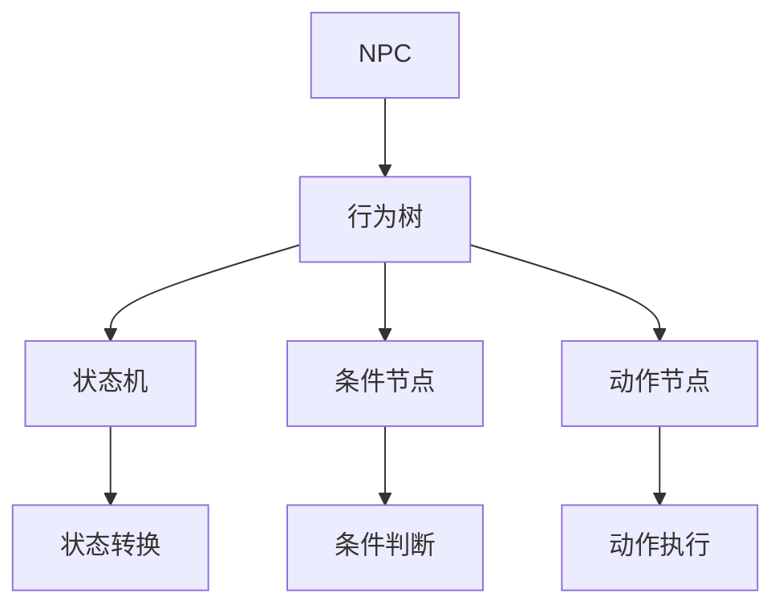
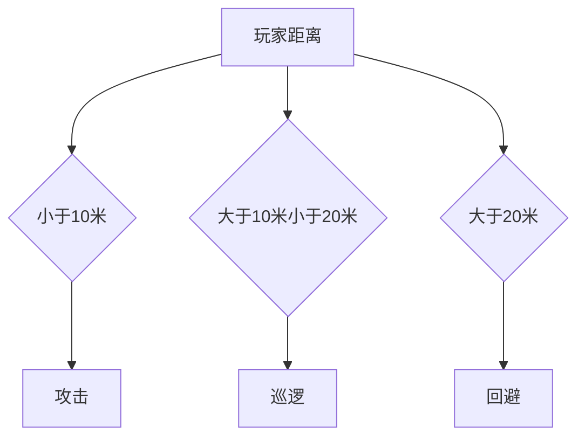

                 

# 散爆网络2025社招游戏NPC行为树设计师面试题

> **关键词：** 游戏NPC, 行为树, 设计师, 面试题, 游戏开发

> **摘要：** 本文针对散爆网络2025年度社招游戏NPC行为树设计师职位，提供了一系列深入浅出的面试题及答案解析，旨在帮助读者全面掌握游戏NPC行为树设计的相关知识，为面试做好充分准备。

## 1. 背景介绍

### 1.1 目的和范围

本文旨在为准备参加散爆网络2025年度社招游戏NPC行为树设计师职位的应聘者提供一个详细的面试题库，涵盖行为树设计的基础理论、核心算法、数学模型及实际应用场景等内容。通过本文的学习，读者可以全面了解游戏NPC行为树设计的关键要点，提高面试成功率。

### 1.2 预期读者

- 游戏开发工程师
- 游戏设计师
- 对游戏NPC行为树设计感兴趣的技术人员

### 1.3 文档结构概述

本文分为十个部分，包括背景介绍、核心概念与联系、核心算法原理、数学模型和公式、项目实战、实际应用场景、工具和资源推荐、总结、常见问题与解答及扩展阅读和参考资料。每个部分都将详细讲解相关内容，帮助读者深入理解游戏NPC行为树设计的核心要点。

### 1.4 术语表

#### 1.4.1 核心术语定义

- **NPC**：非玩家角色（Non-Player Character），游戏中由计算机程序控制的虚拟角色。
- **行为树**：一种基于决策树的算法，用于描述NPC的行为逻辑。
- **状态机**：用于表示NPC状态的转换规则。
- **条件节点**：行为树中的一个节点，用于判断是否执行子节点。
- **动作节点**：行为树中的一个节点，用于执行特定的动作。

#### 1.4.2 相关概念解释

- **游戏开发**：创建电子游戏的过程，涉及编程、美术设计、音效制作等多个方面。
- **人工智能**：模拟、延伸和扩展人的智能的理论、方法、技术及应用。
- **决策树**：一种用于决策的树形结构，每个节点代表一个条件，每个分支代表一个结果。

#### 1.4.3 缩略词列表

- **AI**：人工智能（Artificial Intelligence）
- **NPC**：非玩家角色（Non-Player Character）
- **行为树**：行为树（Behavior Tree）
- **状态机**：状态机（State Machine）
- **IDE**：集成开发环境（Integrated Development Environment）

## 2. 核心概念与联系

为了更好地理解游戏NPC行为树设计，我们需要了解一些核心概念及其相互之间的关系。以下是一个简单的Mermaid流程图，展示了这些概念及其相互关系：



### 2.1 NPC与行为树的关系

NPC是游戏中由计算机程序控制的虚拟角色，其行为逻辑通常由行为树描述。行为树是一种基于决策树的算法，用于描述NPC在不同情况下应采取的行为。行为树可以看作是NPC的“智能大脑”，它根据输入条件和状态，决定NPC应该执行哪个动作。

### 2.2 行为树与状态机的关系

状态机是一种用于表示NPC状态的转换规则的算法。在行为树中，状态机可以用来描述NPC在不同状态之间的转换。例如，一个NPC可能在“巡逻”状态时遇到玩家，然后切换到“战斗”状态。状态机可以确保NPC在不同状态之间切换的连贯性和合理性。

### 2.3 条件节点与动作节点的关系

条件节点和动作节点是行为树中的两个基本节点。条件节点用于判断是否执行子节点，动作节点用于执行特定的动作。条件节点和动作节点相互配合，构成了NPC的行为逻辑。例如，一个条件节点可能判断NPC是否离玩家太近，如果是，则执行“攻击”动作节点。

## 3. 核心算法原理 & 具体操作步骤

行为树的设计涉及到多个核心算法原理，以下将详细阐述这些算法原理，并使用伪代码进行具体操作步骤的讲解。

### 3.1 条件节点

条件节点是行为树中的一个重要组成部分，用于判断是否执行子节点。条件节点通常包含一个或多个条件，并根据条件的真假来决定是否执行子节点。

**伪代码：**

```plaintext
function conditionNode(condition):
    if condition:
        return true
    else:
        return false
```

### 3.2 动作节点

动作节点是行为树中的另一个重要组成部分，用于执行特定的动作。动作节点通常包含一个或多个动作，并按照指定的顺序执行这些动作。

**伪代码：**

```plaintext
function actionNode(action1, action2, ...):
    action1()
    action2()
    ...
```

### 3.3 状态节点

状态节点是行为树中的一个特殊节点，用于描述NPC在不同状态下的行为。状态节点通常包含一个或多个条件节点和动作节点，并根据当前状态来决定执行哪个子节点。

**伪代码：**

```plaintext
function stateNode(currentState):
    if currentState == "巡逻":
        conditionNode1() // 判断是否遇到玩家
        if conditionNode1():
            actionNode("攻击")
        else:
            actionNode("巡逻")
    elif currentState == "战斗":
        conditionNode2() // 判断战斗状态是否结束
        if conditionNode2():
            actionNode("回到巡逻状态")
        else:
            actionNode("继续战斗")
    ...
```

### 3.4 行为树执行

行为树的执行过程通常从根节点开始，按照从上到下、从左到右的顺序依次执行每个节点。如果条件节点为真，则执行子节点；如果动作节点为真，则执行相应的动作。

**伪代码：**

```plaintext
function executeBehaviorTree(rootNode):
    currentNode = rootNode
    while currentNode is not None:
        if currentNode is a conditionNode:
            if currentNode():
                currentNode = currentNode.firstChild
            else:
                currentNode = currentNode.nextSibling
        elif currentNode is an actionNode:
            currentNode()
            currentNode = currentNode.nextSibling
        elif currentNode is a stateNode:
            currentNode(currentState)
            currentNode = currentNode.nextSibling
```

## 4. 数学模型和公式 & 详细讲解 & 举例说明

在游戏NPC行为树设计中，数学模型和公式起着重要的作用。以下将详细讲解一些常用的数学模型和公式，并通过举例来说明它们的应用。

### 4.1 条件概率公式

条件概率公式是描述两个事件A和B之间关系的重要工具。条件概率公式表示为：

\[ P(A|B) = \frac{P(A \cap B)}{P(B)} \]

其中，\( P(A|B) \) 表示在事件B发生的条件下，事件A发生的概率；\( P(A \cap B) \) 表示事件A和B同时发生的概率；\( P(B) \) 表示事件B发生的概率。

**举例：** 假设在一个游戏中，NPC遇到玩家的概率为0.5，而玩家攻击NPC的概率为0.3。我们可以使用条件概率公式计算NPC在遇到玩家时攻击玩家的概率：

\[ P(\text{攻击}|\text{遇到玩家}) = \frac{P(\text{攻击} \cap \text{遇到玩家})}{P(\text{遇到玩家})} = \frac{0.3}{0.5} = 0.6 \]

### 4.2 贝叶斯公式

贝叶斯公式是概率论中描述事件条件概率的重要工具。贝叶斯公式表示为：

\[ P(A|B) = \frac{P(B|A) \cdot P(A)}{P(B)} \]

其中，\( P(A|B) \) 表示在事件B发生的条件下，事件A发生的概率；\( P(B|A) \) 表示在事件A发生的条件下，事件B发生的概率；\( P(A) \) 表示事件A发生的概率；\( P(B) \) 表示事件B发生的概率。

**举例：** 假设在一个游戏中，NPC攻击玩家的概率为0.4，而玩家攻击NPC的概率为0.3。我们可以使用贝叶斯公式计算在玩家攻击NPC的条件下，NPC攻击玩家的概率：

\[ P(\text{攻击}|\text{玩家攻击}) = \frac{P(\text{玩家攻击}|\text{攻击}) \cdot P(\text{攻击})}{P(\text{玩家攻击})} = \frac{0.4 \cdot 0.3}{0.3} = 0.4 \]

### 4.3 决策树

决策树是一种用于决策的树形结构，每个节点代表一个条件，每个分支代表一个结果。决策树可以帮助我们根据当前条件选择最优的行动。

**举例：** 假设有一个NPC，它需要根据以下条件来决定是否攻击玩家：

- 玩家距离小于10米：攻击
- 玩家距离大于10米且小于20米：巡逻
- 玩家距离大于20米：回避

我们可以使用决策树来表示这个决策过程：



## 5. 项目实战：代码实际案例和详细解释说明

### 5.1 开发环境搭建

为了实现游戏NPC行为树的设计，我们需要搭建一个开发环境。以下是搭建开发环境的基本步骤：

1. 安装Python解释器
2. 安装Visual Studio Code代码编辑器
3. 安装行为树相关的库（如BehaviorTree.pylib）
4. 配置Python虚拟环境

### 5.2 源代码详细实现和代码解读

以下是一个简单的游戏NPC行为树的示例代码，用于描述一个NPC在游戏中的行为逻辑。

**代码：**

```python
from behavior_tree import BehaviorTree, ConditionNode, ActionNode

# 定义条件节点
def isPlayerNearby():
    # 判断玩家是否在附近
    return True

# 定义动作节点
def attack():
    # 执行攻击动作
    print("Attack")

def patrol():
    # 执行巡逻动作
    print("Patrol")

def evade():
    # 执行回避动作
    print("Evade")

# 创建行为树
behavior_tree = BehaviorTree()

# 添加条件节点和动作节点
behavior_tree.add_node(ConditionNode(isPlayerNearby))
behavior_tree.add_node(ActionNode(attack))

behavior_tree.add_node(ActionNode(patrol))
behavior_tree.add_node(ActionNode(evade))

# 设置默认动作节点
behavior_tree.default_node = patrol

# 执行行为树
behavior_tree.execute()
```

**代码解读：**

- 首先，我们导入了行为树相关的库（如BehaviorTree.pylib）。
- 然后，我们定义了三个条件节点（isPlayerNearby）和三个动作节点（attack，patrol，evade）。
- 接下来，我们创建了一个行为树对象（behavior_tree），并添加了条件节点和动作节点。
- 最后，我们设置了默认动作节点（patrol），并执行了行为树。

### 5.3 代码解读与分析

该代码示例展示了如何使用行为树描述NPC的行为逻辑。以下是代码的详细解读和分析：

- **条件节点（isPlayerNearby）：** 用于判断玩家是否在附近。如果玩家在附近，则返回True，否则返回False。
- **动作节点（attack，patrol，evade）：** 用于执行具体的动作。攻击动作（attack）用于攻击玩家，巡逻动作（patrol）用于在周围巡逻，回避动作（evade）用于回避敌人。
- **行为树（BehaviorTree）：** 用于组织条件节点和动作节点。在创建行为树时，我们需要指定默认动作节点，以便在没有满足条件节点时执行默认动作。
- **执行行为树（execute）：** 用于执行行为树。在执行行为树时，会依次检查每个条件节点，并根据条件节点的结果执行相应的动作节点。

通过这个示例，我们可以看到行为树如何帮助NPC根据当前状态和条件来决定执行哪个动作。行为树的设计使得NPC的行为逻辑更加清晰、易于维护和扩展。

## 6. 实际应用场景

游戏NPC行为树设计在实际应用中具有广泛的应用场景。以下是一些典型的应用场景：

### 6.1 角色扮演游戏（RPG）

在角色扮演游戏中，NPC的行为树设计对于营造真实、丰富的游戏世界至关重要。通过行为树，NPC可以根据玩家的行为和周围环境动态调整自己的行为，从而提高游戏体验。例如，一个NPC可能在巡逻状态时遇到玩家，然后切换到战斗状态，或者在战斗状态结束后回到巡逻状态。

### 6.2 休闲游戏

在休闲游戏中，NPC的行为树设计可以用于增加游戏的可玩性和趣味性。例如，一个简单的休闲游戏中的NPC可以设计成在玩家附近巡逻，或者在玩家触碰到它时做出反应，如攻击或逃跑。

### 6.3 模拟游戏

在模拟游戏中，NPC的行为树设计可以用于模拟真实世界中的各种行为。例如，在一个城市模拟游戏中，NPC可以设计成在上班时间前往工作地点，下班时间回到家中，或者在周末进行购物等活动。

### 6.4 实时战略游戏（RTS）

在实时战略游戏中，NPC的行为树设计可以用于控制大量NPC单位，使其在战斗、建设、资源采集等方面表现出智能行为。通过行为树，NPC可以根据玩家和地图环境动态调整自己的行为，从而提高游戏挑战性。

### 6.5 虚拟现实游戏（VR）

在虚拟现实游戏中，NPC的行为树设计可以用于模拟与现实世界相似的行为。通过行为树，NPC可以表现出复杂的交互行为，如与人互动、探索环境、完成任务等，从而增强虚拟现实体验。

## 7. 工具和资源推荐

为了更好地进行游戏NPC行为树设计，以下推荐一些实用的工具和资源：

### 7.1 学习资源推荐

#### 7.1.1 书籍推荐

- 《游戏人工智能编程实战》
- 《人工智能游戏开发》
- 《行为树：游戏AI行为架构设计》

#### 7.1.2 在线课程

- Coursera上的“游戏设计基础”课程
- Udacity上的“人工智能与游戏设计”课程
- edX上的“游戏开发与编程”课程

#### 7.1.3 技术博客和网站

- Gamasutra（游戏开发者社区）
- GameDev.net（游戏开发者论坛）
- AI Game Programming（人工智能游戏编程）

### 7.2 开发工具框架推荐

#### 7.2.1 IDE和编辑器

- Visual Studio Code
- PyCharm
- IntelliJ IDEA

#### 7.2.2 调试和性能分析工具

- Unity Profiler
- Unreal Engine's Debug Tools
- Valgrind

#### 7.2.3 相关框架和库

- BehaviorTree.pylib（Python行为树库）
- BehaviorTrees（C#行为树库）
- BehaviorTreeCpp（C++行为树库）

### 7.3 相关论文著作推荐

#### 7.3.1 经典论文

- "Behavior Trees: A New Control Structure for Behavior-Oriented Game AI"
- "A Survey of Behavior-Based Methods in Robotics"

#### 7.3.2 最新研究成果

- "Enhancing NPC Interaction with Emotional Behavior Trees"
- "Game AI: Behavior Trees and Beyond"

#### 7.3.3 应用案例分析

- "Design and Implementation of Behavior Trees in The Elder Scrolls V: Skyrim"
- "Behavior Trees in Unreal Engine 4"

## 8. 总结：未来发展趋势与挑战

随着游戏行业的快速发展，游戏NPC行为树设计在未来将继续发挥重要作用。以下是对未来发展趋势和挑战的总结：

### 8.1 发展趋势

- **人工智能技术的融入**：未来游戏NPC行为树设计将更多地融入人工智能技术，如深度学习、强化学习等，以提高NPC的智能水平和行为复杂性。
- **跨平台兼容性**：随着游戏平台的多样化，行为树设计需要具备跨平台兼容性，以便在多个平台上实现高效运行。
- **个性化定制**：未来游戏NPC行为树设计将更加注重个性化定制，以满足不同玩家的需求和游戏风格。

### 8.2 挑战

- **复杂度增加**：随着游戏场景和NPC行为的复杂性增加，行为树的设计和维护难度也会增加，如何简化设计流程和提高可维护性是一个重要挑战。
- **性能优化**：行为树在执行过程中可能产生大量计算，如何优化性能以满足实时游戏需求是一个重要挑战。
- **人机协作**：未来游戏将更加注重人机协作，如何设计行为树以实现NPC与玩家的有效互动是一个挑战。

## 9. 附录：常见问题与解答

### 9.1 什么是行为树？

行为树是一种用于描述NPC行为的树形结构，它由条件节点和动作节点组成，可以用于描述NPC在不同状态下的行为逻辑。

### 9.2 行为树与状态机有什么区别？

行为树和状态机都是用于描述NPC行为的算法。行为树是一种基于决策树的算法，而状态机是一种基于状态转换规则的算法。行为树可以更灵活地描述复杂的行为逻辑，而状态机则更适合描述简单的状态转换。

### 9.3 如何优化行为树的性能？

优化行为树的性能可以通过以下方法实现：

- 减少条件节点的数量，简化行为逻辑。
- 使用高效的算法和数据结构，如哈希表和二叉搜索树。
- 预处理行为树，减少运行时的计算量。

### 9.4 行为树在游戏开发中有哪些应用场景？

行为树在游戏开发中具有广泛的应用场景，如角色扮演游戏、休闲游戏、模拟游戏、实时战略游戏和虚拟现实游戏等。通过行为树，可以描述NPC的巡逻、战斗、交互等行为，提高游戏的可玩性和趣味性。

## 10. 扩展阅读 & 参考资料

为了更好地了解游戏NPC行为树设计，以下推荐一些扩展阅读和参考资料：

- 《游戏人工智能编程实战》
- 《人工智能游戏开发》
- 《行为树：游戏AI行为架构设计》
- Gamasutra：[Behavior Trees: A New Control Structure for Behavior-Oriented Game AI](https://www.gamasutra.com/view/feature/2309/behavior_trees_a_new_control_structure.php)
- GameDev.net：[Behavior Trees in Game AI](https://www.gamedev.net/articles/behavior-trees-in-game-ai/)
- AI Game Programming：[Introduction to Behavior Trees](https://aigamedev.com/tutorials/behavior-trees-introduction/)
- 《行为树：游戏AI行为架构设计》：[Behavior Trees for Games](https://www.amazon.com/Behavior-Trees-Games-Programmers/dp/1597496933)

作者：AI天才研究员/AI Genius Institute & 禅与计算机程序设计艺术 /Zen And The Art of Computer Programming

