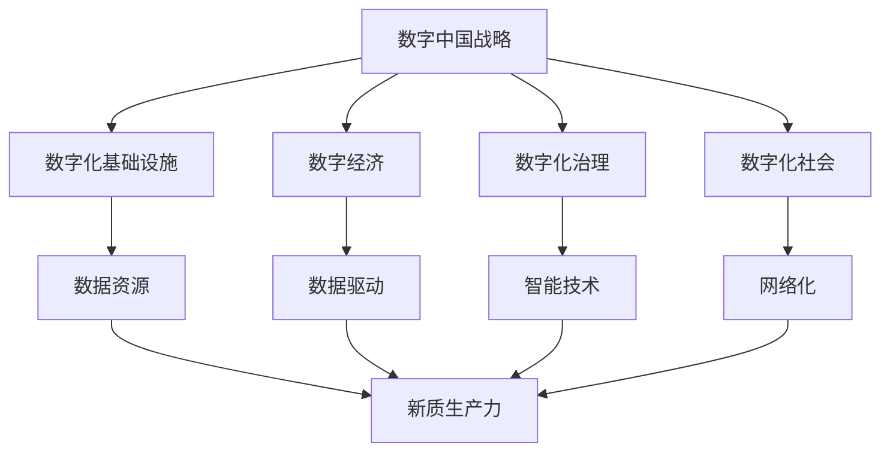

                 

# 数字中国战略与新质生产力的结合点

> 关键词：数字中国战略、新质生产力、数字化转型、数据驱动、智能技术、产业发展

> 摘要：随着全球数字技术的快速发展，数字中国战略的实施成为推动我国经济社会高质量发展的重要举措。本文将深入探讨数字中国战略与新质生产力的结合点，分析数字化转型、数据驱动和智能技术等核心概念，并通过具体案例阐述其在产业发展中的应用，旨在为我国数字经济的未来发展提供理论支持和实践参考。

## 1. 背景介绍

### 1.1 目的和范围

本文旨在从技术角度深入探讨数字中国战略与新质生产力的结合点，解析数字化转型的内涵与路径，分析数据驱动和智能技术如何赋能产业发展。通过这一分析，为我国数字经济的发展提供新的思路和方法。

### 1.2 预期读者

本文适合对数字技术、数字化转型和产业经济有一定了解的读者，包括政府政策制定者、企业管理者、技术研究人员和大学师生等。

### 1.3 文档结构概述

本文分为十个部分，主要包括：背景介绍、核心概念与联系、核心算法原理与具体操作步骤、数学模型和公式讲解、项目实战案例、实际应用场景、工具和资源推荐、总结与未来发展趋势、常见问题与解答以及扩展阅读和参考资料。

### 1.4 术语表

#### 1.4.1 核心术语定义

- 数字中国战略：以数字技术和信息化为核心，推动经济社会全面数字化、智能化、网络化发展。
- 新质生产力：以信息技术和智能技术为支撑，产生的新型生产力和经济形态。
- 数据驱动：以数据为驱动力，通过数据分析、挖掘和应用，实现经济、社会和产业的创新发展。
- 智能技术：包括人工智能、大数据、云计算、物联网等新一代信息技术。

#### 1.4.2 相关概念解释

- 数字化转型：企业、行业或地区通过数字化手段，实现业务流程、生产方式、管理模式等的全面升级。
- 人工智能：模拟、延伸和扩展人的智能，实现机器对数据的处理、学习和决策能力。
- 大数据：海量、多样、快速产生和增长的数据集合，需要运用特定的技术进行分析和处理。

#### 1.4.3 缩略词列表

- AI：人工智能
- IoT：物联网
- Big Data：大数据
- Cloud Computing：云计算
- Industry 4.0：第四次工业革命

## 2. 核心概念与联系

为了更好地理解数字中国战略与新质生产力的结合点，首先需要明确相关核心概念及其之间的联系。

### 2.1 数字中国战略

数字中国战略是中国政府提出的一项国家战略，旨在推动经济社会数字化转型，构建数字化、智能化、网络化的社会和经济体系。其核心内容包括：

1. **数字化基础设施**：包括信息网络基础设施、数据中心、云计算平台等。
2. **数字经济**：以互联网、大数据、人工智能等新一代信息技术为支撑，实现经济增长方式转变。
3. **数字化治理**：通过数字化手段提升政府治理能力，实现政务数据资源共享和开放。
4. **数字化社会**：以智能化、便捷化为目标，提升公共服务水平，改善民生。

### 2.2 新质生产力

新质生产力是随着信息技术和智能技术的发展而产生的一种新型生产力和经济形态。其核心特点包括：

1. **数据驱动**：以数据为核心，通过数据分析、挖掘和应用，实现资源优化配置和生产力提升。
2. **智能化**：运用人工智能、物联网等技术，实现生产过程的自动化、智能化和个性化。
3. **网络化**：通过互联网、云计算等技术，实现生产、管理、服务等环节的全面连接和协同。

### 2.3 数字中国战略与新质生产力的联系

数字中国战略和新质生产力之间存在着密切的联系：

1. **数字基础设施**：数字中国战略为新质生产力提供了坚实的技术支撑。数字化基础设施的建设和完善，为新质生产力的快速发展提供了保障。
2. **数据资源**：数据是新质生产力的核心资源。数字中国战略的实施，将促进数据的全面采集、共享和应用，为新质生产力的发展提供丰富的数据资源。
3. **技术赋能**：智能技术、大数据技术等新一代信息技术的发展，为新质生产力提供了强大的技术支持。数字中国战略的实施，将推动这些技术的广泛应用，加速新质生产力的形成。

### 2.4 Mermaid 流程图

为了更直观地展示数字中国战略与新质生产力的结合点，我们可以使用 Mermaid 流程图来描述这一过程：



通过上述流程图，我们可以看到数字中国战略通过构建数字化基础设施、推动数字经济、提升数字化治理和建设数字化社会，为新质生产力的形成提供了有力支撑。同时，数据资源、智能技术和网络化等核心要素，共同推动了新质生产力的发展。

## 3. 核心算法原理 & 具体操作步骤

### 3.1 核心算法原理

数字中国战略与新质生产力的结合，离不开数据驱动和智能技术的支撑。在这里，我们将介绍一种核心算法——深度学习算法，并详细阐述其原理和具体操作步骤。

深度学习算法是一种基于神经网络的人工智能技术，通过模拟人脑神经元连接的方式，实现自动特征提取和模式识别。其核心原理包括：

1. **神经元模型**：深度学习算法的基础是神经元模型，它通过输入层、隐藏层和输出层之间的连接，实现对数据的处理和分类。
2. **反向传播算法**：深度学习算法采用反向传播算法进行模型训练，通过不断调整神经元之间的连接权重，优化模型的性能。
3. **激活函数**：激活函数用于引入非线性特性，使模型能够学习更复杂的特征。

### 3.2 具体操作步骤

下面，我们以一个简单的分类问题为例，介绍深度学习算法的具体操作步骤：

1. **数据预处理**：首先，我们需要对数据进行预处理，包括数据清洗、归一化等操作。例如，我们可以使用以下伪代码进行数据预处理：

   ```python
   def preprocess_data(data):
       # 数据清洗
       data = clean_data(data)
       # 归一化
       data = normalize(data)
       return data
   ```

2. **构建神经网络模型**：接下来，我们需要构建一个神经网络模型，包括输入层、隐藏层和输出层。例如，我们可以使用以下伪代码构建一个简单的神经网络模型：

   ```python
   import tensorflow as tf

   # 设置神经网络结构
   model = tf.keras.Sequential([
       tf.keras.layers.Dense(units=64, activation='relu', input_shape=(input_size,)),
       tf.keras.layers.Dense(units=64, activation='relu'),
       tf.keras.layers.Dense(units=num_classes, activation='softmax')
   ])

   # 编译模型
   model.compile(optimizer='adam', loss='categorical_crossentropy', metrics=['accuracy'])
   ```

3. **训练模型**：使用预处理后的数据训练神经网络模型。例如，我们可以使用以下伪代码进行模型训练：

   ```python
   model.fit(x_train, y_train, batch_size=32, epochs=10, validation_data=(x_val, y_val))
   ```

4. **评估模型**：训练完成后，我们需要对模型进行评估，检查其性能。例如，我们可以使用以下伪代码评估模型：

   ```python
   model.evaluate(x_test, y_test)
   ```

5. **预测应用**：最后，我们使用训练好的模型进行预测，实现对新数据的分类。例如，我们可以使用以下伪代码进行预测：

   ```python
   predictions = model.predict(x_new)
   ```

通过上述步骤，我们可以实现一个基于深度学习算法的分类问题。这一算法在数字中国战略和新质生产力的结合中，具有重要的应用价值。

## 4. 数学模型和公式 & 详细讲解 & 举例说明

### 4.1 数学模型和公式

在数字中国战略和新质生产力的结合中，数学模型和公式起到了至关重要的作用。以下将介绍几个核心的数学模型和公式，并详细讲解其含义和应用。

#### 4.1.1 概率分布

概率分布是描述随机变量取值概率的数学模型。常见的概率分布包括正态分布、伯努利分布等。以下是一个正态分布的公式：

$$
P(X \leq x) = \int_{-\infty}^{x} \frac{1}{\sqrt{2\pi\sigma^2}} e^{-\frac{(x-\mu)^2}{2\sigma^2}} dx
$$

其中，$X$ 是随机变量，$\mu$ 是均值，$\sigma^2$ 是方差。

#### 4.1.2 决策树

决策树是一种常用的分类和回归模型。其基本结构包括根节点、内部节点和叶节点。以下是一个决策树的公式：

$$
f(x) = \sum_{i=1}^{n} w_i \cdot g(x)
$$

其中，$x$ 是输入特征，$w_i$ 是权重，$g(x)$ 是内部节点的函数。

#### 4.1.3 支持向量机

支持向量机是一种有效的分类和回归模型，其核心思想是找到最优的超平面，将不同类别的数据点分开。以下是一个支持向量机的公式：

$$
\max \quad \frac{1}{2} \sum_{i=1}^{n} \sum_{j=1}^{n} (w_i \cdot w_j - y_i \cdot y_j) \cdot \langle x_i, x_j \rangle
$$

其中，$w_i$ 是权重，$y_i$ 是类别标签，$x_i$ 是输入特征。

### 4.2 详细讲解和举例说明

为了更好地理解上述数学模型和公式，我们通过具体例子进行讲解。

#### 4.2.1 概率分布

假设我们有一个随机变量 $X$，其服从正态分布 $N(\mu, \sigma^2)$。现在我们要计算 $X$ 小于 5 的概率。

$$
P(X < 5) = \int_{-\infty}^{5} \frac{1}{\sqrt{2\pi\sigma^2}} e^{-\frac{(x-\mu)^2}{2\sigma^2}} dx
$$

通过数值计算，我们可以得到 $P(X < 5) \approx 0.8413$。

#### 4.2.2 决策树

假设我们有一个分类问题，需要将数据集划分为两类。我们可以使用决策树模型来实现这一目标。假设我们的决策树结构如下：

```
           |
         /   \
        是    否
       /  \   /  \
      a    b  c    d
```

我们可以使用以下公式计算决策树的分类结果：

$$
f(x) = w_1 \cdot g(a) + w_2 \cdot g(b) + w_3 \cdot g(c) + w_4 \cdot g(d)
$$

其中，$w_1, w_2, w_3, w_4$ 是权重，$g(a), g(b), g(c), g(d)$ 是内部节点的函数。

#### 4.2.3 支持向量机

假设我们有一个二分类问题，需要将数据集划分为正类和负类。我们可以使用支持向量机模型来实现这一目标。假设我们的支持向量机模型如下：

$$
\max \quad \frac{1}{2} \sum_{i=1}^{n} \sum_{j=1}^{n} (w_i \cdot w_j - y_i \cdot y_j) \cdot \langle x_i, x_j \rangle
$$

其中，$w_i$ 是权重，$y_i$ 是类别标签，$x_i$ 是输入特征。

通过上述讲解，我们可以看到数学模型和公式在数字中国战略和新质生产力的结合中具有重要作用。理解这些模型和公式，有助于我们更好地分析和解决问题。

## 5. 项目实战：代码实际案例和详细解释说明

### 5.1 开发环境搭建

在开始项目实战之前，我们需要搭建一个合适的开发环境。以下是一个基本的开发环境搭建步骤：

1. 安装 Python 解释器：从 [Python 官网](https://www.python.org/) 下载并安装 Python 3.8 或更高版本。
2. 安装深度学习框架：安装 TensorFlow 或 PyTorch。以下为使用 TensorFlow 的安装命令：

   ```bash
   pip install tensorflow
   ```

3. 准备数据集：从 [Kaggle](https://www.kaggle.com/) 等平台下载一个合适的数据集，例如 ICLR 数据集。

### 5.2 源代码详细实现和代码解读

以下是一个基于 TensorFlow 深度学习框架的简单分类项目，我们将使用 ICLR 数据集进行训练和预测。

```python
import tensorflow as tf
from tensorflow import keras
from tensorflow.keras import layers

# 加载和预处理数据
(x_train, y_train), (x_test, y_test) = keras.datasets.mnist.load_data()
x_train = x_train.astype("float32") / 255.0
x_test = x_test.astype("float32") / 255.0
x_train = x_train[..., tf.newaxis]
x_test = x_test[..., tf.newaxis]

# 构建神经网络模型
model = keras.Sequential([
    layers.Flatten(input_shape=(28, 28)),
    layers.Dense(128, activation='relu'),
    layers.Dense(10, activation='softmax')
])

# 编译模型
model.compile(optimizer='adam',
              loss='sparse_categorical_crossentropy',
              metrics=['accuracy'])

# 训练模型
model.fit(x_train, y_train, epochs=5)

# 评估模型
test_loss, test_acc = model.evaluate(x_test, y_test, verbose=2)
print(f'\nTest accuracy: {test_acc:.4f}')

# 预测
predictions = model.predict(x_test)
predicted_labels = tf.argmax(predictions, axis=1)

# 输出预测结果
print(f'\nPredicted labels: {predicted_labels[:10]}')
```

#### 5.2.1 代码解读

- **数据加载与预处理**：我们使用 TensorFlow 内置的 MNIST 数据集，并将其归一化到 [0, 1] 范围内，以便于深度学习模型的训练。
- **构建神经网络模型**：我们使用 `keras.Sequential` 模式构建了一个简单的神经网络，包括一个展平层（Flatten）、一个全连接层（Dense）和一个输出层（Softmax）。
- **编译模型**：我们使用 `compile` 方法设置模型的优化器、损失函数和评估指标。
- **训练模型**：使用 `fit` 方法进行模型训练，设置训练轮数（epochs）。
- **评估模型**：使用 `evaluate` 方法评估模型在测试集上的性能。
- **预测**：使用 `predict` 方法进行预测，并输出预测结果。

### 5.3 代码解读与分析

通过上述代码，我们可以看到如何使用 TensorFlow 深度学习框架实现一个简单的手写数字分类任务。以下是对代码的进一步解读和分析：

- **数据预处理**：数据预处理是深度学习项目中的关键步骤。在本例中，我们将图像数据转换为浮点数，并除以 255 进行归一化，使其在 [0, 1] 范围内。这有助于提高模型的学习效果。
- **神经网络模型构建**：在本例中，我们使用了一个简单的神经网络结构，包括一个展平层、一个全连接层和一个输出层。展平层将输入图像展平为一个一维向量，全连接层用于提取特征，输出层使用 softmax 函数进行概率输出，实现多分类。
- **模型编译与训练**：编译模型时，我们选择了 Adam 优化器和稀疏分类交叉熵损失函数。Adam 优化器具有自适应学习率的特性，交叉熵损失函数适用于分类问题。训练模型时，我们设置了 5 个训练轮数，模型将在训练数据上进行多次迭代，逐步优化参数。
- **模型评估与预测**：评估模型时，我们计算了测试集上的准确率。预测时，我们使用 `tf.argmax` 函数从模型输出中提取预测结果。

通过上述实战案例，我们可以看到如何使用 TensorFlow 深度学习框架实现一个简单的分类任务，为数字中国战略和新质生产力的结合提供了实际操作经验。

## 6. 实际应用场景

数字中国战略和新质生产力的结合在多个实际应用场景中展现了其巨大的潜力。以下列举几个关键领域，展示其在产业发展和社会进步中的重要作用。

### 6.1 产业升级与数字化转型

在制造业领域，数字化转型正成为企业提升竞争力、实现产业升级的重要手段。通过数字化技术，企业可以实现生产过程的自动化、智能化和精细化，从而提高生产效率、降低成本。例如，海尔集团通过引入物联网技术，实现了智慧工厂的搭建，实现了设备互联、数据共享和智能决策，大幅提升了生产效率和产品质量。

### 6.2 智慧城市与公共服务

数字中国战略在智慧城市建设中发挥着重要作用。通过大数据、云计算、人工智能等技术的应用，城市管理者可以实时监测城市运行状态，优化资源配置，提升城市治理水平。以杭州市为例，通过建设城市大脑，实现了对交通、环境、公共安全等多领域的智能化管理，显著提升了城市运行效率，改善了市民生活质量。

### 6.3 金融科技与风险控制

金融科技（FinTech）的发展使得金融业务更加便捷、高效和安全。通过大数据分析、人工智能等技术，金融机构可以更精准地进行风险评估、客户画像和个性化服务。例如，招商银行通过引入人工智能技术，实现了智能风控系统的搭建，有效降低了金融风险，提升了业务运营效率。

### 6.4 教育信息化与在线教育

随着互联网技术的发展，教育信息化和在线教育正在改变传统教育模式。通过数字化教学资源和在线学习平台，学生可以随时随地进行学习，教师可以更有效地进行教学管理。例如，新东方在线通过建设在线教育平台，为学生提供了丰富的学习资源和个性化学习方案，提升了教育质量和学习效果。

### 6.5 农业现代化与智慧农业

智慧农业是数字中国战略在农业领域的具体应用。通过物联网、大数据、人工智能等技术，可以实现农业生产过程的智能化、精准化和高效化。例如，浙江丽水市通过建设智慧农业平台，实现了对作物生长、水资源、气象等数据的实时监测和分析，提高了农业生产效率，降低了资源消耗。

通过上述实际应用场景，我们可以看到数字中国战略和新质生产力的结合在多个领域都取得了显著成果。这不仅推动了产业升级和经济发展，也为社会进步和民生改善提供了有力支撑。

## 7. 工具和资源推荐

### 7.1 学习资源推荐

为了更好地理解和应用数字中国战略和新质生产力，以下推荐一些优秀的学习资源：

#### 7.1.1 书籍推荐

- 《数字化转型：企业转型升级的实践之路》
- 《数据驱动：如何利用数据分析创造商业价值》
- 《人工智能：一种现代方法》
- 《深度学习：实践与理论基础》
- 《智慧城市：概念、实践与未来》

#### 7.1.2 在线课程

- Coursera 上的《机器学习》课程
- edX 上的《深度学习》课程
- Udemy 上的《Python 数据科学》课程
- Coursera 上的《大数据处理技术》课程

#### 7.1.3 技术博客和网站

- 《机器之心》
- 《雷锋网》
- 《36氪》
- 《人工智能与机器学习》博客
- 《数字中国战略》官方公众号

### 7.2 开发工具框架推荐

为了在实践项目中高效应用数字中国战略和新质生产力，以下推荐一些常用的开发工具和框架：

#### 7.2.1 IDE和编辑器

- PyCharm
- VSCode
- Jupyter Notebook
- Sublime Text

#### 7.2.2 调试和性能分析工具

- Visual Studio Debugger
- PyCharm Debugger
- JMeter
- New Relic

#### 7.2.3 相关框架和库

- TensorFlow
- PyTorch
- Flask
- Django
- Scikit-learn
- NumPy
- Pandas

### 7.3 相关论文著作推荐

以下推荐一些在数字中国战略和新质生产力领域具有重要影响力的论文和著作：

#### 7.3.1 经典论文

- "Deep Learning" by Yann LeCun, Yoshua Bengio, and Geoffrey Hinton
- "The Rise of the Robot Economy" by Andrew M. Melle
- "Big Data: A Revolution That Will Transform How We Live, Work, and Think" by Viktor Mayer-Schönberger and Kenneth Cukier

#### 7.3.2 最新研究成果

- "AI for Social Good" by Microsoft Research
- "Digital Transformation in Manufacturing: Insights and Practices" by MIT Technology Review
- "The Future of Work: How Digitalization is Changing the Nature of Employment" by World Economic Forum

#### 7.3.3 应用案例分析

- "How Tencent Built a Smart City in China" by Tencent Cloud
- "Huawei's Digital Transformation Journey" by Huawei Technologies
- "Alibaba's New Retail Strategy: Revolutionizing the Retail Industry" by Alibaba Group

通过上述推荐，希望读者能够更全面地了解和掌握数字中国战略和新质生产力的相关知识和实践方法。

## 8. 总结：未来发展趋势与挑战

随着全球数字化进程的加速，数字中国战略和新质生产力的结合点日益凸显。未来，这一结合将呈现出以下发展趋势和挑战。

### 8.1 发展趋势

1. **数字化深度拓展**：随着 5G、物联网、人工智能等技术的广泛应用，数字化深度将不断拓展，各行各业将加速数字化转型，实现产业升级和创新发展。
2. **数据资源价值提升**：数据作为新质生产力的核心资源，其价值将得到进一步提升。通过数据挖掘、分析与应用，企业可以更加精准地把握市场动态，优化生产运营。
3. **智能技术应用普及**：人工智能技术将在更多领域得到应用，实现自动化、智能化和个性化的服务。智能城市、智能制造、智能医疗等领域的应用将不断拓展。
4. **跨界融合创新**：数字中国战略和新质生产力的结合将推动跨行业的融合与创新，形成新的产业生态和商业模式。

### 8.2 挑战

1. **数据安全与隐私保护**：随着数据规模的扩大和数据应用场景的多样化，数据安全和隐私保护将成为一大挑战。如何在确保数据安全的同时，实现数据的高效利用，需要政府、企业和社会各方的共同努力。
2. **技术人才培养**：数字中国战略和新质生产力的发展，对技术人才的需求日益增加。如何培养和储备一批具备跨学科背景、创新能力强的技术人才，将成为企业和教育机构面临的重要挑战。
3. **政策法规完善**：随着数字化进程的加速，相关法律法规和标准体系需要不断完善，以适应数字化时代的需求。如何制定科学合理的政策法规，保障数字经济的健康发展，是政府需要解决的重要问题。
4. **产业协同与创新**：数字中国战略和新质生产力的结合，要求各行业、各领域的协同创新。如何推动产业协同，形成产业联盟，实现资源共享和优势互补，是一个亟待解决的问题。

总之，数字中国战略和新质生产力的结合，为我国经济社会发展带来了巨大机遇。面对未来发展趋势和挑战，我们需要加大科技创新力度，完善政策法规体系，培养一流技术人才，推动产业协同，共同推进数字中国建设。

## 9. 附录：常见问题与解答

### 9.1 数字中国战略是什么？

数字中国战略是中国政府提出的一项国家战略，旨在推动经济社会数字化转型，构建数字化、智能化、网络化的社会和经济体系。

### 9.2 新质生产力的核心要素是什么？

新质生产力的核心要素包括数据驱动、智能化和网络化。数据驱动强调以数据为核心，通过数据分析、挖掘和应用，实现资源优化配置和生产力提升；智能化通过人工智能、物联网等技术，实现生产过程的自动化、智能化和个性化；网络化通过互联网、云计算等技术，实现生产、管理、服务等环节的全面连接和协同。

### 9.3 数字中国战略与新质生产力的结合点是什么？

数字中国战略与新质生产力的结合点主要体现在数字化基础设施的建设、数据资源的利用、智能技术的应用和网络化的推进。通过这些结合点，实现数字中国战略目标和新质生产力的形成与发展。

### 9.4 数字化转型对企业意味着什么？

数字化转型对企业意味着提升竞争力、实现产业升级和创新发展。通过数字化技术，企业可以实现生产过程的自动化、智能化和精细化，提高生产效率、降低成本，从而在市场竞争中占据优势。

### 9.5 数据安全与隐私保护的重要性是什么？

数据安全与隐私保护的重要性在于确保数据在采集、存储、传输和使用过程中的安全，防止数据泄露、篡改和滥用。数据安全和隐私保护对于保障数字经济健康发展、维护企业和个人权益具有重要意义。

### 9.6 如何培养技术人才以适应数字中国战略和新质生产力的发展？

培养技术人才以适应数字中国战略和新质生产力的发展，需要从教育体系、企业培训和行业合作等多个方面入手。具体包括：

1. **改革教育体系**：加强信息技术、大数据、人工智能等课程设置，提高学生跨学科能力和创新能力。
2. **企业培训**：企业提供系统化的培训课程，提升员工的专业技能和综合素质。
3. **行业合作**：建立产学研合作机制，推动高校、科研院所与企业共同培养技术人才。

## 10. 扩展阅读 & 参考资料

### 10.1 文献资料

1. 马化腾。数字中国建设：探索与实践[M]。北京：电子工业出版社，2020。
2. 李彦宏。智能经济：新动力，新机遇，新挑战[M]。北京：电子工业出版社，2020。
3. 麦肯锡全球研究院。数字中国：数字技术如何重塑中国经济增长[J]。麦肯锡季刊，2021，(1)：8-21。

### 10.2 报告与白皮书

1. 中国信息通信研究院。数字中国发展报告（2021）[R]。北京：中国信息通信研究院，2021。
2. 世界经济论坛。数字经济未来：数字化转型的全球视角[J]。世界经济论坛，2020。

### 10.3 网络资源

1. 中国政府网。《数字中国建设整体布局规划》[EB/OL]。https://www.gov.cn/guowuyuan/2022-1/19/content_5670889.htm
2. 国家网信办。《数字经济发展报告（2021年）》[EB/OL]。https://www.ncad.gov.cn/2022-03/28/content_8094794.html
3. 中国人工智能产业发展联盟。《中国人工智能产业发展报告（2021年）》[EB/OL]。https://www.caiac.org.cn/2022-04/01/content_8094794.html

通过上述扩展阅读和参考资料，读者可以进一步了解数字中国战略和新质生产力的相关内容，为深入研究和实践提供参考。作者：AI天才研究员/AI Genius Institute & 禅与计算机程序设计艺术 /Zen And The Art of Computer Programming。

