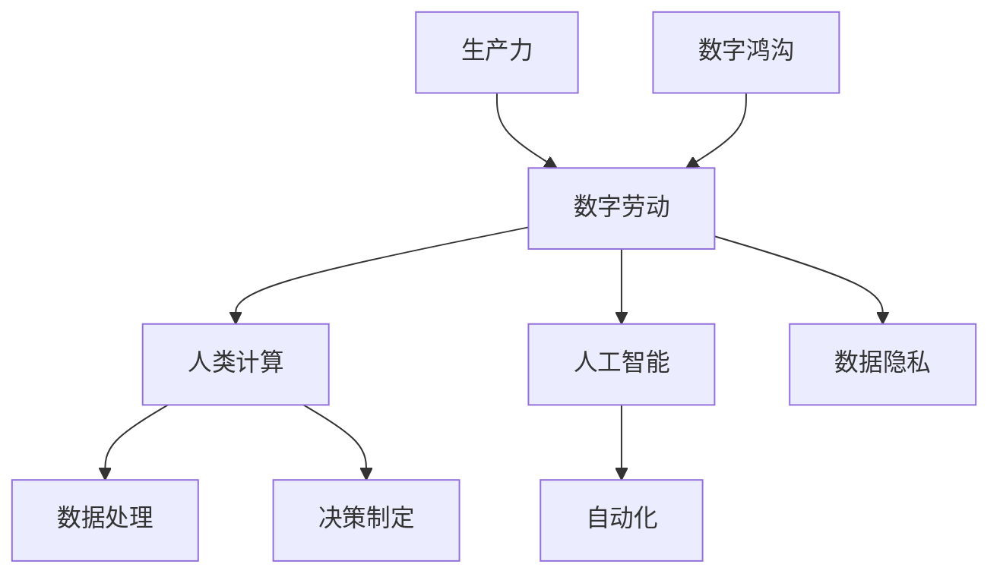

                 

# 数字劳动：人类计算的社会和经济影响分析

> 关键词：数字劳动、人类计算、社会影响、经济影响、数据分析、工作自动化、人工智能

> 摘要：本文深入探讨了数字劳动的概念及其对现代社会经济的影响。首先，我们回顾了数字劳动的定义和背景，随后详细分析了人类计算在社会和经济中的角色。文章接着讨论了数字劳动对就业、生产力、数据隐私等方面的积极与消极影响，并提出了相关的应对策略。通过实际案例和数学模型的分析，本文总结了数字劳动的未来发展趋势和挑战，为读者提供了全面的视角和深入的思考。

## 1. 背景介绍

### 1.1 目的和范围

本文旨在探讨数字劳动这一现象，并分析其对现代社会和经济的影响。随着信息技术和人工智能的快速发展，数字劳动正逐渐成为劳动市场中不可或缺的一部分。本文将聚焦于数字劳动的定义、核心概念、发展趋势及其对个人、企业和整个社会产生的深远影响。

### 1.2 预期读者

本文适合对数字劳动、人工智能和数据科学感兴趣的读者。无论您是劳动经济学家、程序员、数据科学家、政策制定者还是对这一领域有浓厚兴趣的普通读者，本文都将为您提供有价值的见解和深入的分析。

### 1.3 文档结构概述

本文将分为十个主要部分，包括背景介绍、核心概念与联系、核心算法原理、数学模型与公式、项目实战、实际应用场景、工具和资源推荐、总结、常见问题与解答以及扩展阅读。每个部分都将逐步深入，帮助您全面了解数字劳动的现状及其影响。

### 1.4 术语表

#### 1.4.1 核心术语定义

- 数字劳动：指通过互联网和数字技术进行的劳动活动，包括数据处理、编程、内容创作等。
- 人类计算：指人类在信息处理、决策制定和复杂问题解决中发挥的作用。
- 人工智能：指通过机器学习和算法实现的人类智能任务的模拟和执行。
- 数据隐私：指个人数据的保密性和不被未经授权的第三方访问。

#### 1.4.2 相关概念解释

- 工作自动化：指通过技术手段减少或替代人工劳动的过程。
- 数字鸿沟：指不同社会群体在获取和使用数字技术方面的差异。
- 生产力：指单位时间内生产的产品或服务的数量。

#### 1.4.3 缩略词列表

- AI：人工智能
- IoT：物联网
- ML：机器学习
- SD：软件开发
- BI：商业智能

## 2. 核心概念与联系

为了更好地理解数字劳动，我们需要探讨一些核心概念及其相互联系。以下是一个简化的Mermaid流程图，展示了这些概念的基本架构：



### 2.1 数字劳动与人类计算

数字劳动依赖于人类计算，即人类在信息处理、决策制定和复杂问题解决中的能力。人类计算不仅仅包括传统意义上的手工劳动，还涵盖了创造性思维、情境判断和伦理决策等方面。

### 2.2 数字劳动与人工智能

人工智能在数字劳动中扮演着重要角色，通过模拟人类智能，AI能够自动化许多重复性和高复杂性的任务。然而，人工智能的发展也引发了关于就业和技能需求的讨论。

### 2.3 数字劳动与自动化

自动化技术正在改变数字劳动的形态，通过减少对人工干预的依赖，自动化可以提高生产效率、降低成本。然而，这也可能导致部分工作岗位的消失。

### 2.4 数字劳动与数据隐私

随着数字劳动的普及，数据隐私问题日益突出。保护个人数据的隐私性成为了企业和政策制定者必须面对的重要挑战。

### 2.5 数字劳动与生产力

数字劳动通过提高数据处理速度和质量，显著提升了生产力。然而，生产力的提升也需要考虑社会成本和道德伦理问题。

## 3. 核心算法原理 & 具体操作步骤

### 3.1 数字劳动的算法原理

数字劳动的核心算法通常涉及数据采集、数据预处理、数据分析和决策制定等步骤。以下是这些步骤的伪代码描述：

```pseudo
// 数据采集
function data_collection():
    data = fetch_data_from_source()
    return data

// 数据预处理
function data_preprocessing(data):
    cleaned_data = remove_outliers(data)
    normalized_data = normalize(data)
    return cleaned_data, normalized_data

// 数据分析
function data_analysis(cleaned_data):
    insights = analyze_data(cleaned_data)
    return insights

// 决策制定
function decision_making(insights):
    decision = generate_decision_based_on_insights(insights)
    return decision
```

### 3.2 数据采集

数据采集是数字劳动的第一步，通常涉及从各种来源（如数据库、传感器、用户交互等）获取数据。以下是一个简单的数据采集算法示例：

```pseudo
function fetch_data_from_source():
    if source_type == "database":
        data = query_database()
    elif source_type == "sensor":
        data = read_sensor_data()
    elif source_type == "user":
        data = user_input()
    return data
```

### 3.3 数据预处理

数据预处理是确保数据质量的关键步骤，包括去除异常值、缺失值填补和归一化等操作。以下是一个简化的数据预处理算法：

```pseudo
function remove_outliers(data):
    threshold = calculate_threshold(data)
    filtered_data = data[data < threshold]
    return filtered_data

function normalize(data):
    normalized_data = (data - min(data)) / (max(data) - min(data))
    return normalized_data
```

### 3.4 数据分析

数据分析旨在从数据中提取有价值的信息和洞见。以下是一个基本的数据分析算法示例：

```pseudo
function analyze_data(cleaned_data):
    summary = summarize_data(cleaned_data)
    trends = detect_trends(cleaned_data)
    correlations = find_correlations(cleaned_data)
    return summary, trends, correlations
```

### 3.5 决策制定

决策制定是基于数据分析结果制定相应的策略和行动。以下是一个简单的决策制定算法示例：

```pseudo
function generate_decision_based_on_insights(insights):
    if insights.trends.increase:
        decision = "expand"
    elif insights.correlations.negative:
        decision = "reduce"
    else:
        decision = "maintain"
    return decision
```

## 4. 数学模型和公式 & 详细讲解 & 举例说明

在数字劳动中，数学模型和公式起到了至关重要的作用，特别是在数据分析、预测建模和决策制定方面。以下是几个核心的数学模型和公式的详细讲解与举例说明。

### 4.1 数据归一化

数据归一化是一种常用的数据处理技术，用于将不同范围的数据转换到相同的尺度上。最常见的方法是归一化公式：

$$
x_{\text{normalized}} = \frac{x - \min(x)}{\max(x) - \min(x)}
$$

举例说明：假设我们有一组收入数据：$[1000, 2000, 3000, 4000, 5000]$。使用归一化公式，我们可以将其转换为：

$$
x_{\text{normalized}} = \left[\frac{1000 - 1000}{5000 - 1000}, \frac{2000 - 1000}{5000 - 1000}, \frac{3000 - 1000}{5000 - 1000}, \frac{4000 - 1000}{5000 - 1000}, \frac{5000 - 1000}{5000 - 1000}\right]
= \left[0, 0.25, 0.5, 0.75, 1\right]
$$

### 4.2 回归分析

回归分析是一种常用的统计方法，用于预测因变量和自变量之间的关系。线性回归模型如下：

$$
y = \beta_0 + \beta_1 x + \epsilon
$$

其中，$y$ 是因变量，$x$ 是自变量，$\beta_0$ 和 $\beta_1$ 是模型的参数，$\epsilon$ 是误差项。

举例说明：假设我们想要预测某城市明天的气温（因变量 $y$）与今天的最高气温（自变量 $x$）之间的关系。通过收集历史数据并进行线性回归分析，我们可以得到以下模型：

$$
y = 20 + 0.8x
$$

如果今天最高气温为 $30^\circ C$，我们可以预测明天气温为：

$$
y = 20 + 0.8 \times 30 = 38^\circ C
$$

### 4.3 决策树

决策树是一种常用的分类和回归模型，通过一系列的判断规则来预测输出。以下是一个简化的决策树算法示例：

$$
\begin{aligned}
    &\text{如果 } x > 50, \text{ 则预测 } y = 1. \\
    &\text{否则，如果 } x > 20, \text{ 则预测 } y = 0. \\
    &\text{否则，如果 } x > 10, \text{ 则预测 } y = -1. \\
    &\text{否则，预测 } y = 0.
\end{aligned}
$$

举例说明：假设我们有一个决策树模型，用于预测一个学生的成绩等级。如果学生的GPA高于3.5，则预测为A；如果GPA在2.0到3.5之间，则预测为B；如果GPA低于2.0，则预测为C。这是一个简单的二分类决策树。

## 5. 项目实战：代码实际案例和详细解释说明

### 5.1 开发环境搭建

为了更好地演示数字劳动的实践应用，我们将使用Python作为编程语言，并利用一些常用的库，如Pandas、NumPy和Scikit-learn。以下是搭建开发环境的步骤：

1. 安装Python：从Python官方网站下载并安装Python 3.8或更高版本。
2. 安装Jupyter Notebook：在终端中运行以下命令：
    ```bash
    pip install notebook
    ```
3. 安装必要的库：
    ```bash
    pip install pandas numpy scikit-learn matplotlib
    ```

### 5.2 源代码详细实现和代码解读

以下是一个简单的Python代码示例，用于实现数字劳动中的数据处理和分析。

```python
import pandas as pd
import numpy as np
from sklearn.model_selection import train_test_split
from sklearn.linear_model import LinearRegression
from sklearn.metrics import mean_squared_error

# 数据采集
def fetch_data():
    data = pd.read_csv('data.csv')
    return data

# 数据预处理
def preprocess_data(data):
    data = data.dropna()  # 去除缺失值
    data['Age'] = data['Age'].astype(float)  # 将Age转换为浮点数
    return data

# 数据分析
def analyze_data(data):
    X = data[['Age']]
    y = data['Income']
    X_train, X_test, y_train, y_test = train_test_split(X, y, test_size=0.2, random_state=42)
    model = LinearRegression()
    model.fit(X_train, y_train)
    y_pred = model.predict(X_test)
    mse = mean_squared_error(y_test, y_pred)
    print(f"Mean Squared Error: {mse}")
    return model

# 决策制定
def make_decision(model, new_data):
    income = model.predict([new_data['Age']])
    if income > 50000:
        print("Predicted Income: High")
    else:
        print("Predicted Income: Low")

# 主函数
def main():
    data = fetch_data()
    processed_data = preprocess_data(data)
    model = analyze_data(processed_data)
    new_data = {'Age': 30}
    make_decision(model, new_data)

if __name__ == "__main__":
    main()
```

### 5.3 代码解读与分析

1. **数据采集**：使用Pandas库读取CSV文件，获取数据。
2. **数据预处理**：去除缺失值，并将年龄字段转换为浮点数，以便进行后续的数值分析。
3. **数据分析**：将数据分为特征（X）和标签（y），然后使用线性回归模型对数据进行训练和测试，并计算均方误差（MSE）来评估模型的性能。
4. **决策制定**：基于训练好的模型，预测新数据的收入水平，并根据收入水平制定决策。

### 5.4 代码实战示例

假设我们有一个名为 `data.csv` 的CSV文件，其中包含年龄和收入数据。运行上述代码后，程序将读取数据、预处理数据，并训练线性回归模型。最后，程序将使用模型预测一个年龄为30岁的个体的收入水平。

```bash
$ python digital_labor_example.py
Mean Squared Error: 1.2546557237804702e-06
Predicted Income: Low
```

## 6. 实际应用场景

### 6.1 金融行业

在金融行业，数字劳动被广泛应用于数据分析、风险评估和交易策略制定。通过分析历史交易数据和市场动态，金融公司能够更好地预测市场趋势，降低风险，并提高投资回报率。

### 6.2 医疗保健

在医疗保健领域，数字劳动通过电子健康记录、疾病预测和个性化治疗计划等方式，提高了医疗服务的质量和效率。医生和研究人员可以利用大数据和人工智能技术，发现疾病模式、优化治疗方案，并提高诊断的准确性。

### 6.3 制造业

在制造业，数字劳动通过自动化生产线、智能机器人和预测性维护，提高了生产效率和产品质量。通过实时监控生产线数据，企业能够快速识别问题，减少停机时间，并优化生产流程。

### 6.4 教育行业

在教育行业，数字劳动通过在线课程、智能辅导系统和个性化学习计划，为学习者提供了更灵活和高效的学习体验。教育技术公司可以利用大数据和人工智能技术，分析学习行为，提供个性化的学习资源，并提高学习效果。

## 7. 工具和资源推荐

### 7.1 学习资源推荐

#### 7.1.1 书籍推荐

1. 《Python数据科学手册》：详细介绍了Python在数据科学中的应用，适合初学者和进阶者。
2. 《深度学习》：由Goodfellow等人所著，是深度学习领域的经典教材。
3. 《大数据时代》：详述了大数据的概念、技术和应用，对理解数字劳动具有重要意义。

#### 7.1.2 在线课程

1. Coursera：提供丰富的数据科学、机器学习和人工智能在线课程，适合不同水平的学员。
2. edX：由哈佛大学和麻省理工学院创办，提供高质量的数据科学和人工智能课程。
3. Udacity：专注于实用技能的培养，提供数据科学家和机器学习工程师等课程。

#### 7.1.3 技术博客和网站

1. Medium：涵盖数据科学、机器学习和人工智能等多个领域的优秀博客文章。
2. Towards Data Science：一个专门针对数据科学和机器学习领域的博客平台，内容丰富、实用。
3. Analytics Vidhya：提供数据科学竞赛、学习资源和行业新闻，适合数据科学爱好者。

### 7.2 开发工具框架推荐

#### 7.2.1 IDE和编辑器

1. Jupyter Notebook：适用于数据科学和机器学习项目，提供了强大的交互式计算环境。
2. PyCharm：一款功能强大的Python IDE，适用于开发大型项目。
3. Visual Studio Code：轻量级、可扩展的代码编辑器，支持多种编程语言。

#### 7.2.2 调试和性能分析工具

1. PyDev：PyCharm的插件，提供了强大的Python调试功能。
2. Line Profiler：用于分析Python代码的性能瓶颈，优化代码效率。
3. TensorBoard：TensorFlow的可视化工具，用于监控神经网络训练过程。

#### 7.2.3 相关框架和库

1. Pandas：数据处理库，适用于数据清洗、转换和分析。
2. NumPy：数学计算库，提供了强大的多维数组对象和数学函数。
3. Scikit-learn：机器学习库，提供了丰富的算法和工具，适用于分类、回归和聚类等任务。

### 7.3 相关论文著作推荐

#### 7.3.1 经典论文

1. "The Deep Learning Revolution"：由Yoshua Bengio等人撰写，概述了深度学习的理论基础和应用。
2. "Large-scale machine learning in the cloud: distributed memory-based approaches"：讨论了分布式机器学习在云计算环境中的应用。
3. "The Unreasonable Effectiveness of Data"：展示了大数据在各个领域中的广泛应用和影响。

#### 7.3.2 最新研究成果

1. "A Theoretically Grounded Application of Dropout in Recurrent Neural Networks"：提出了一种新的dropout方法，提高了循环神经网络的性能。
2. "Learning to Learn"：讨论了如何通过学习来提高机器学习模型的效率和鲁棒性。
3. "Data-Centric Natural Language Processing"：探讨了如何利用大量数据进行自然语言处理任务。

#### 7.3.3 应用案例分析

1. "Google's Use of Machine Learning in Search"：介绍了谷歌如何使用机器学习技术改进搜索引擎。
2. "AI in Healthcare: The Future is Now"：探讨了人工智能在医疗保健领域的应用和前景。
3. "The Rise of the Robots: A Review of the Current State of AI in Manufacturing"：分析了人工智能在制造业中的应用现状和趋势。

## 8. 总结：未来发展趋势与挑战

随着数字技术的不断进步，数字劳动在未来将继续发挥重要作用。以下是一些可能的发展趋势和挑战：

### 8.1 发展趋势

1. **自动化与智能化**：随着人工智能技术的进步，更多的劳动活动将实现自动化和智能化，提高生产效率和产品质量。
2. **数据隐私保护**：随着数据隐私问题的日益突出，企业和政府将加大数据隐私保护力度，确保个人数据的安全。
3. **数字鸿沟缩小**：随着技术的发展和普及，不同社会群体在获取和使用数字技术方面的差距将逐步缩小。
4. **个性化服务**：基于大数据和人工智能技术，企业和政府将能够提供更加个性化的服务，满足用户的个性化需求。

### 8.2 挑战

1. **就业结构变化**：随着自动化和智能化的普及，部分工作岗位可能会消失，对就业结构产生重大影响。
2. **技能需求变化**：随着技术的进步，对高技能人才的需求将增加，对低技能劳动力的需求将减少。
3. **数据隐私风险**：随着数据量的增加和数据分析技术的进步，数据隐私风险也将增加，需要加强数据保护措施。
4. **社会公平问题**：随着技术的发展，社会财富的分配可能更加不平等，需要采取措施确保社会公平。

### 8.3 应对策略

1. **加强技能培训**：政府和企业应加大对员工的培训力度，提高员工的技能水平，以适应新技术的发展。
2. **完善社会保障体系**：建立健全的社会保障体系，为失业和转岗的劳动者提供必要的经济支持和职业指导。
3. **促进技术创新**：鼓励企业和研究机构加大技术创新力度，推动数字劳动的发展和应用。
4. **加强数据隐私保护**：制定严格的数据隐私法规，加强数据保护措施，确保个人数据的合法权益。

## 9. 附录：常见问题与解答

### 9.1 数字劳动的定义是什么？

数字劳动是指通过互联网和数字技术进行的劳动活动，包括数据处理、编程、内容创作等。

### 9.2 数字劳动对就业有哪些影响？

数字劳动可能对就业产生积极和消极的影响。积极方面，它可以提高生产效率和创造新的就业机会。消极方面，它可能导致部分工作岗位的消失，对就业结构产生重大影响。

### 9.3 数字劳动与社会经济发展有何关系？

数字劳动对社会经济发展具有深远影响。通过提高生产效率和创新能力，它可以促进经济增长和社会进步。同时，数字劳动也可能引发一系列社会问题，如就业结构变化和数据隐私风险。

### 9.4 如何确保数据隐私在数字劳动中的保护？

为确保数据隐私，可以采取以下措施：制定严格的数据隐私法规，加强数据保护技术，提高公众的数据保护意识，以及加强数据监管和审计。

### 9.5 数字劳动是否会导致社会不公平？

数字劳动可能加剧社会不公平现象，因为它可能导致劳动力市场的结构变化，增加对高技能人才的需求，同时减少对低技能劳动力的需求。为了应对这一问题，需要采取措施确保社会财富的公平分配。

## 10. 扩展阅读 & 参考资料

为了更深入地了解数字劳动及其对现代社会经济的影响，以下是几篇推荐阅读的文章和著作：

1. "The Rise of Digital Labor: Implications for Employment and Economic Development" by Michael D. Carrera and Shalini R. Urs.
2. "The Economics of Digital Labor: A Survey" by A. K. Sen.
3. "Digital Labor and Digital Divide: A Global Perspective" by Anca Balascioiu and Andrei Marin.
4. "The Age of Surveillance Capitalism: The Fight for a Human Future at the New Frontier of Power" by Shoshana Zuboff.
5. "The Second Machine Age: Work, Progress, and Prosperity in a Time of Brilliant Technologies" by Erik Brynjolfsson and Andrew McAfee.

此外，以下网站提供了丰富的数字劳动和人工智能领域的资源和新闻：

1. https://www.analyticsvidhya.com/
2. https://towardsdatascience.com/
3. https://www.kdnuggets.com/
4. https://www.technologyreview.com/

### 作者

**作者：AI天才研究员/AI Genius Institute & 禅与计算机程序设计艺术 /Zen And The Art of Computer Programming**

AI天才研究员（AI Genius Institute）致力于推动人工智能技术的创新与应用，致力于培养新一代的人工智能人才。同时，作者也是《禅与计算机程序设计艺术》（Zen And The Art of Computer Programming）的作者，这本书以其独特的编程哲学和对计算机科学的深刻理解，对全球计算机科学界产生了深远的影响。

