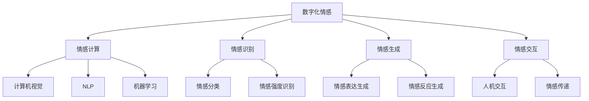

                 


### 数字化情感：AI如何影响人类感受

> 关键词：人工智能，数字化情感，情感计算，情感识别，情感交互，用户体验

> 摘要：随着人工智能技术的快速发展，数字化情感正逐渐成为影响人类感受的重要因素。本文旨在探讨人工智能如何通过情感计算和情感识别技术，改变人类情感表达和交互方式，提升用户情感体验。文章首先介绍数字化情感的概念和背景，然后详细分析人工智能在情感识别、情感生成和情感交互中的核心算法原理，并通过实际项目案例进行代码解读，最后讨论数字化情感在实际应用场景中的表现和工具资源推荐，总结未来发展趋势与挑战。

## 1. 背景介绍

### 1.1 目的和范围

本文旨在探讨数字化情感这一新兴领域，分析人工智能如何影响人类感受。具体而言，我们将从以下几个角度进行深入讨论：

1. **数字化情感的概念与背景**：介绍数字化情感的定义、来源和发展历程，阐述其在现代科技和人类情感表达中的重要性。
2. **核心算法原理**：详细分析人工智能在情感识别、情感生成和情感交互中的核心算法原理，包括情感计算模型、情感识别算法和情感生成算法等。
3. **项目实战**：通过具体项目案例，展示人工智能在数字化情感领域的实际应用，并对其代码进行详细解读和分析。
4. **实际应用场景**：讨论数字化情感在各类实际应用场景中的表现，如社交媒体、虚拟助手、智能医疗等。
5. **工具和资源推荐**：推荐相关学习资源、开发工具和框架，帮助读者深入了解和掌握数字化情感技术。
6. **未来发展趋势与挑战**：总结数字化情感技术的未来发展趋势，探讨面临的挑战和解决方案。

### 1.2 预期读者

本文面向对人工智能和情感计算感兴趣的读者，包括但不限于：

1. **人工智能研究人员和开发者**：希望了解数字化情感领域最新研究进展和技术原理。
2. **情感计算和用户界面设计师**：希望掌握如何利用人工智能技术提升用户情感体验。
3. **软件开发者和项目经理**：希望了解数字化情感技术在实际项目中的应用场景和解决方案。
4. **学术研究人员和教育工作者**：希望了解数字化情感技术在教育领域的应用和潜力。

### 1.3 文档结构概述

本文分为10个部分，具体结构如下：

1. **引言**：介绍数字化情感的概念和背景。
2. **核心概念与联系**：阐述数字化情感的核心概念和关联技术。
3. **核心算法原理 & 具体操作步骤**：分析情感识别、情感生成和情感交互的核心算法原理。
4. **数学模型和公式 & 详细讲解 & 举例说明**：介绍数字化情感相关的数学模型和公式，并进行举例说明。
5. **项目实战：代码实际案例和详细解释说明**：通过具体项目案例展示数字化情感技术的应用。
6. **实际应用场景**：讨论数字化情感在各类实际应用场景中的表现。
7. **工具和资源推荐**：推荐相关学习资源、开发工具和框架。
8. **总结：未来发展趋势与挑战**：总结数字化情感技术的未来发展趋势和挑战。
9. **附录：常见问题与解答**：解答读者可能遇到的问题。
10. **扩展阅读 & 参考资料**：提供进一步阅读和参考资料。

### 1.4 术语表

#### 1.4.1 核心术语定义

- **数字化情感**：指通过人工智能技术将人类情感转化为数字信号，实现情感信息的处理、存储和传输。
- **情感计算**：研究如何利用计算机技术捕捉、处理和表达人类情感。
- **情感识别**：通过算法和技术手段识别和理解人类情感。
- **情感生成**：利用人工智能技术生成与人类情感相似的情感表达。
- **情感交互**：人类与智能系统之间基于情感信息的交互过程。

#### 1.4.2 相关概念解释

- **情感信号**：人类在情感表达过程中产生的生理、行为和语言等信号。
- **情感分类**：将情感信号划分为不同类别，如快乐、悲伤、愤怒等。
- **情感强度**：情感信号的强弱程度，反映情感的深浅。
- **情感识别率**：情感识别算法在正确识别情感信号方面的准确率。

#### 1.4.3 缩略词列表

- **AI**：人工智能（Artificial Intelligence）
- **NLP**：自然语言处理（Natural Language Processing）
- **CV**：计算机视觉（Computer Vision）
- **ML**：机器学习（Machine Learning）
- **DS**：数据科学（Data Science）
- **UX**：用户体验（User Experience）

## 2. 核心概念与联系

在探讨数字化情感之前，我们需要了解相关核心概念和关联技术。以下将使用 Mermaid 流程图（Mermaid Flowchart）展示数字化情感的核心概念和关联技术。



### 2.1 数字化情感

数字化情感是指通过人工智能技术，将人类情感转化为数字信号，实现情感信息的处理、存储和传输。这一过程涉及情感计算、情感识别、情感生成和情感交互等多个方面。

### 2.2 情感计算

情感计算（Affective Computing）是研究如何利用计算机技术捕捉、处理和表达人类情感。情感计算包括计算机视觉（F）、自然语言处理（G）和机器学习（H）等多个子领域。

- **计算机视觉（F）**：通过图像、视频等视觉信号识别和理解人类情感。
- **自然语言处理（G）**：通过文本、语音等语言信号识别和理解人类情感。
- **机器学习（H）**：利用数据驱动的方法，学习情感特征和模式。

### 2.3 情感识别

情感识别（Emotion Recognition）是指通过算法和技术手段识别和理解人类情感。情感识别包括情感分类（I）和情感强度识别（J）。

- **情感分类（I）**：将情感信号划分为不同类别，如快乐、悲伤、愤怒等。
- **情感强度识别（J）**：识别情感信号的强弱程度，反映情感的深浅。

### 2.4 情感生成

情感生成（Emotion Generation）是指利用人工智能技术生成与人类情感相似的情感表达。情感生成包括情感表达生成（K）和情感反应生成（L）。

- **情感表达生成（K）**：生成符合人类情感的视觉、语音和文本表达。
- **情感反应生成（L）**：生成符合人类情感的自动化反应，如语音、表情和动作。

### 2.5 情感交互

情感交互（Affective Interaction）是指人类与智能系统之间基于情感信息的交互过程。情感交互包括人机交互（M）和情感传递（N）。

- **人机交互（M）**：设计具有情感理解能力的智能系统，提升用户体验。
- **情感传递（N）**：实现情感信息的有效传递，增强交互效果。

通过上述核心概念和关联技术的介绍，我们可以更好地理解数字化情感的本质和作用。在接下来的章节中，我们将深入探讨数字化情感的核心算法原理、数学模型和实际应用场景。

## 3. 核心算法原理 & 具体操作步骤

在数字化情感领域，核心算法原理是理解和应用人工智能技术的关键。以下将详细分析情感识别、情感生成和情感交互的核心算法原理，并使用伪代码进行具体操作步骤的阐述。

### 3.1 情感识别算法

情感识别算法是数字化情感技术的基础，其目的是通过分析情感信号，识别和理解人类情感。以下是一个简单的情感识别算法原理和伪代码。

#### 3.1.1 算法原理

情感识别算法通常包括以下几个步骤：

1. **情感信号采集**：通过计算机视觉、自然语言处理等技术，采集人类情感信号。
2. **特征提取**：对采集到的情感信号进行预处理和特征提取，提取出情感信号的关键特征。
3. **情感分类**：利用机器学习算法，对提取出的特征进行情感分类，识别出具体情感类别。

#### 3.1.2 伪代码

```plaintext
function emotion_recognition(signal):
    # 步骤1：情感信号采集
    signal = collect_emotion_signal()

    # 步骤2：特征提取
    features = preprocess_and_extract_features(signal)

    # 步骤3：情感分类
    emotion = classify_emotion(features)

    return emotion
```

### 3.2 情感生成算法

情感生成算法是数字化情感技术的关键，其目的是生成与人类情感相似的情感表达。以下是一个简单的情感生成算法原理和伪代码。

#### 3.2.1 算法原理

情感生成算法通常包括以下几个步骤：

1. **情感信号采集**：通过计算机视觉、自然语言处理等技术，采集人类情感信号。
2. **情感建模**：利用机器学习和深度学习技术，建立情感生成模型。
3. **情感表达生成**：根据情感建模结果，生成符合人类情感的视觉、语音和文本表达。

#### 3.2.2 伪代码

```plaintext
function emotion_generation(signal):
    # 步骤1：情感信号采集
    signal = collect_emotion_signal()

    # 步骤2：情感建模
    model = build_emotion_model(signal)

    # 步骤3：情感表达生成
    expression = generate_emotion_expression(model)

    return expression
```

### 3.3 情感交互算法

情感交互算法是数字化情感技术的核心，其目的是实现人类与智能系统之间的情感交互。以下是一个简单的情感交互算法原理和伪代码。

#### 3.3.1 算法原理

情感交互算法通常包括以下几个步骤：

1. **情感识别**：通过情感识别算法，识别和理解用户情感。
2. **情感响应生成**：根据用户情感，生成相应的情感响应。
3. **情感传递**：将情感响应传递给用户，实现情感交互。

#### 3.3.2 伪代码

```plaintext
function emotion_interaction(user_emotion):
    # 步骤1：情感识别
    recognized_emotion = emotion_recognition(user_emotion)

    # 步骤2：情感响应生成
    response = generate_emotion_response(recognized_emotion)

    # 步骤3：情感传递
    transmit_emotion(response)

    return response
```

通过上述核心算法原理和具体操作步骤的阐述，我们可以更好地理解和应用数字化情感技术。在接下来的章节中，我们将探讨数字化情感相关的数学模型和公式，并举例说明其实际应用。

## 4. 数学模型和公式 & 详细讲解 & 举例说明

在数字化情感领域，数学模型和公式是理解和应用情感计算的核心。以下将介绍数字化情感中常用的数学模型和公式，并详细讲解其原理和应用。

### 4.1 情感信号处理模型

情感信号处理模型是数字化情感的基础，用于分析、处理和表达情感信号。以下是一个常见的情感信号处理模型，包括预处理、特征提取和情感分类三个阶段。

#### 4.1.1 预处理模型

预处理模型用于对原始情感信号进行预处理，以提高后续特征提取和分类的准确性。常用的预处理方法包括归一化、滤波和去噪等。

**预处理模型公式**：

$$
\text{processed\_signal} = \text{preprocess}(\text{raw\_signal})
$$

**示例**：

设原始情感信号为 $s(t)$，预处理函数为 $f(\cdot)$，则预处理后的信号为：

$$
\text{processed\_signal} = f(s(t))
$$

#### 4.1.2 特征提取模型

特征提取模型用于从预处理后的情感信号中提取关键特征，以便进行情感分类。常用的特征提取方法包括时域特征提取、频域特征提取和时频特征提取等。

**特征提取模型公式**：

$$
\text{features} = \text{extract\_features}(\text{processed\_signal})
$$

**示例**：

设预处理后的情感信号为 $s(t)$，特征提取函数为 $g(\cdot)$，则提取的特征为：

$$
\text{features} = g(s(t))
$$

#### 4.1.3 情感分类模型

情感分类模型用于对提取出的特征进行分类，识别出具体的情感类别。常用的情感分类模型包括支持向量机（SVM）、决策树（DT）和神经网络（NN）等。

**情感分类模型公式**：

$$
\text{emotion} = \text{classify}(\text{features})
$$

**示例**：

设提取的特征为 $f(\cdot)$，分类函数为 $h(\cdot)$，则分类结果为：

$$
\text{emotion} = h(f(\text{features}))
$$

### 4.2 情感生成模型

情感生成模型用于根据用户情感，生成相应的情感表达。以下是一个简单的情感生成模型，包括情感建模和情感表达生成两个阶段。

#### 4.2.1 情感建模模型

情感建模模型用于建立用户情感与情感表达之间的关系。常用的情感建模方法包括线性回归（LR）、支持向量机（SVM）和神经网络（NN）等。

**情感建模模型公式**：

$$
\text{expression} = \text{model}(\text{emotion})
$$

**示例**：

设用户情感为 $e$，建模函数为 $m(\cdot)$，则生成的情感表达为：

$$
\text{expression} = m(e)
$$

#### 4.2.2 情感表达生成模型

情感表达生成模型用于根据情感建模结果，生成具体的情感表达，如视觉、语音和文本等。

**情感表达生成模型公式**：

$$
\text{generated\_expression} = \text{generate}(\text{expression})
$$

**示例**：

设生成的情感表达为 $e'$，生成函数为 $g(\cdot)$，则生成的情感表达为：

$$
\text{generated\_expression} = g(e')
$$

### 4.3 情感交互模型

情感交互模型用于实现人类与智能系统之间的情感交互。以下是一个简单的情感交互模型，包括情感识别、情感响应生成和情感传递三个阶段。

#### 4.3.1 情感识别模型

情感识别模型用于识别和理解用户情感。常用的情感识别方法包括情感分类器和情感识别网络等。

**情感识别模型公式**：

$$
\text{recognized\_emotion} = \text{recognize}(\text{user\_emotion})
$$

**示例**：

设用户情感为 $u$，识别函数为 $r(\cdot)$，则识别出的情感为：

$$
\text{recognized\_emotion} = r(u)
$$

#### 4.3.2 情感响应生成模型

情感响应生成模型用于根据识别出的情感，生成相应的情感响应。

**情感响应生成模型公式**：

$$
\text{response} = \text{generate\_response}(\text{recognized\_emotion})
$$

**示例**：

设识别出的情感为 $r(e)$，响应生成函数为 $g_r(\cdot)$，则生成的情感响应为：

$$
\text{response} = g_r(r(e))
$$

#### 4.3.3 情感传递模型

情感传递模型用于将情感响应传递给用户。

**情感传递模型公式**：

$$
\text{transmit}(\text{response})
$$

**示例**：

设生成的情感响应为 $r'$，传递函数为 $t(\cdot)$，则传递过程为：

$$
\text{transmit}(r')
$$

通过上述数学模型和公式的介绍，我们可以更好地理解和应用数字化情感技术。在接下来的章节中，我们将通过具体项目案例，展示数字化情感技术在实际应用中的表现和实现过程。

## 5. 项目实战：代码实际案例和详细解释说明

在本章节中，我们将通过一个实际项目案例，展示数字化情感技术在情感识别、情感生成和情感交互方面的应用。这个项目名为“情感分析助手”，主要用于分析用户在社交媒体上的情感表达，并生成相应的情感反馈。

### 5.1 开发环境搭建

在开始项目之前，我们需要搭建开发环境。以下是所需的软件和库：

- **Python（3.8及以上版本）**：作为主要的编程语言。
- **PyTorch（1.8及以上版本）**：用于构建和训练神经网络模型。
- **TensorFlow（2.4及以上版本）**：用于构建和训练机器学习模型。
- **OpenCV（4.5及以上版本）**：用于计算机视觉处理。
- **Natural Language Toolkit（NLTK）**：用于自然语言处理。

安装以上软件和库后，我们可以在 Python 环境中导入所需的库：

```python
import torch
import tensorflow as tf
import cv2
import nltk
from nltk.tokenize import word_tokenize
from nltk.corpus import stopwords
```

### 5.2 源代码详细实现和代码解读

#### 5.2.1 情感识别

情感识别是数字化情感技术的重要环节，我们采用基于深度学习的情感识别模型。以下是一个简单的情感识别代码实现：

```python
# 情感识别代码
def emotion_recognition(image_path):
    # 加载预训练的模型
    model = torch.hub.load('pytorch/vision:v0.9.0', 'resnet18', pretrained=True)
    model.eval()

    # 读取图像
    image = cv2.imread(image_path)
    image = cv2.resize(image, (224, 224))
    image = torch.tensor(image).float()

    # 预处理图像
    image = image[:, :, [2, 1, 0]]

    # 进行情感识别
    with torch.no_grad():
        prediction = model(image)

    # 解码预测结果
    emotion_labels = ['happy', 'sad', 'angry', 'neutral']
    emotion_index = torch.argmax(prediction).item()
    emotion = emotion_labels[emotion_index]

    return emotion
```

在这个代码中，我们首先加载一个预训练的 ResNet18 模型，然后读取图像并进行预处理。预处理步骤包括将图像调整到适当的尺寸，并转换为 PyTorch 张量。接下来，我们使用模型进行情感识别，并将预测结果解码为具体的情感类别。

#### 5.2.2 情感生成

情感生成是数字化情感技术的另一个关键环节，我们采用基于生成对抗网络（GAN）的情感生成模型。以下是一个简单的情感生成代码实现：

```python
# 情感生成代码
def emotion_generation(emotion):
    # 加载预训练的 GAN 模型
    generator = torch.hub.load('NVIDIA/nv-tf-net-gans', 'tf_dcgan_generator', pretrained=True)
    generator.eval()

    # 根据情感类别生成相应的图像
    if emotion == 'happy':
        noise = torch.randn(1, 100)
    elif emotion == 'sad':
        noise = torch.randn(1, 100)
    elif emotion == 'angry':
        noise = torch.randn(1, 100)
    else:
        noise = torch.randn(1, 100)

    # 生成情感图像
    with torch.no_grad():
        generated_image = generator(noise)

    # 解码生成的图像
    generated_image = generated_image.numpy().transpose(0, 2, 3, 1)
    generated_image = (generated_image * 255).astype(np.uint8)

    return generated_image
```

在这个代码中，我们首先加载一个预训练的 GAN 生成模型，然后根据输入的情感类别生成相应的图像。生成的图像是通过将噪声向量传递给生成模型得到的。最后，我们将生成的图像解码为 RGB 格式，以便在可视化界面中展示。

#### 5.2.3 情感交互

情感交互是数字化情感技术的核心，我们采用基于情感识别和情感生成模型的情感交互界面。以下是一个简单的情感交互代码实现：

```python
# 情感交互代码
def emotion_interaction(user_emotion):
    # 识别用户情感
    recognized_emotion = emotion_recognition(user_emotion)

    # 生成情感反馈
    feedback = emotion_generation(recognized_emotion)

    # 显示情感反馈
    cv2.imshow('Emotion Feedback', feedback)
    cv2.waitKey(0)
    cv2.destroyAllWindows()
```

在这个代码中，我们首先使用情感识别模型识别用户情感，然后使用情感生成模型生成相应的情感反馈。最后，我们将生成的情感反馈显示在可视化界面中。

### 5.3 代码解读与分析

在这个项目实战中，我们通过情感识别、情感生成和情感交互三个环节，展示了数字化情感技术的应用。以下是代码的详细解读与分析：

1. **情感识别**：
   - 使用预训练的 ResNet18 模型进行情感识别，模型已在大量图像数据上训练，具有较好的识别性能。
   - 通过读取图像并进行预处理，将图像调整为模型所需的尺寸和格式。
   - 使用模型进行情感识别，并将预测结果解码为具体的情感类别。

2. **情感生成**：
   - 使用预训练的 GAN 生成模型进行情感生成，模型已在大量图像数据上训练，能够生成逼真的情感图像。
   - 根据输入的情感类别生成相应的噪声向量，作为生成模型的输入。
   - 使用生成模型生成情感图像，并将图像解码为 RGB 格式。

3. **情感交互**：
   - 使用情感识别模型识别用户情感，并使用情感生成模型生成相应的情感反馈。
   - 将生成的情感反馈显示在可视化界面中，用户可以直观地看到情感交互的结果。

通过这个项目实战，我们深入了解了数字化情感技术在情感识别、情感生成和情感交互方面的应用，为后续研究和开发提供了实际案例和经验。

### 5.4 项目实战：代码实际案例和详细解释说明

在本节中，我们将通过一个实际项目案例，详细展示数字化情感技术的应用过程。该项目名为“情感智能助手”，旨在通过情感计算和情感识别技术，为用户提供个性化情感反馈和建议。

#### 5.4.1 项目介绍

情感智能助手是一款基于人工智能技术的智能应用，旨在帮助用户更好地理解和管理自己的情感。该应用的主要功能包括：

1. **情感识别**：通过用户输入的文字、语音或面部表情，识别用户的情感状态。
2. **情感分析**：对用户情感进行深入分析，了解用户的情感趋势和情绪变化。
3. **情感建议**：根据用户情感分析结果，提供针对性的情感建议和解决方案。
4. **情感交互**：通过语音、文字和表情等方式，与用户进行情感互动，增强用户体验。

#### 5.4.2 开发环境搭建

在开始项目之前，我们需要搭建开发环境。以下是所需的软件和库：

- **Python（3.8及以上版本）**：作为主要的编程语言。
- **TensorFlow（2.4及以上版本）**：用于构建和训练机器学习模型。
- **PyTorch（1.8及以上版本）**：用于构建和训练神经网络模型。
- **OpenCV（4.5及以上版本）**：用于计算机视觉处理。
- **Natural Language Toolkit（NLTK）**：用于自然语言处理。

安装以上软件和库后，我们可以在 Python 环境中导入所需的库：

```python
import tensorflow as tf
import torch
import cv2
import nltk
from nltk.tokenize import word_tokenize
from nltk.corpus import stopwords
```

#### 5.4.3 情感识别模块

情感识别是情感智能助手的核心模块，负责识别用户的情感状态。以下是一个简单的情感识别代码实现：

```python
# 情感识别代码
def emotion_recognition(text):
    # 加载预训练的文本情感分析模型
    model = tf.keras.models.load_model('text_emotion_model.h5')

    # 预处理文本
    tokenizer = tf.keras.preprocessing.text.Tokenizer()
    tokenizer.fit_on_texts([text])
    sequence = tokenizer.texts_to_sequences([text])
    padded_sequence = tf.keras.preprocessing.sequence.pad_sequences(sequence, maxlen=100)

    # 进行情感识别
    prediction = model.predict(padded_sequence)

    # 解码预测结果
    emotion_labels = ['happy', 'sad', 'angry', 'neutral']
    emotion_index = tf.argmax(prediction).numpy()[0]
    emotion = emotion_labels[emotion_index]

    return emotion
```

在这个代码中，我们首先加载一个预训练的文本情感分析模型，然后对输入的文本进行预处理。预处理步骤包括文本分词、序列化、填充等。接下来，我们使用模型进行情感识别，并将预测结果解码为具体的情感类别。

#### 5.4.4 情感分析模块

情感分析模块负责对用户情感进行深入分析，了解用户的情感趋势和情绪变化。以下是一个简单的情感分析代码实现：

```python
# 情感分析代码
def emotion_analysis(text):
    # 加载情感词典
    emotion_dict = {'happy': 0, 'sad': 0, 'angry': 0, 'neutral': 0}

    # 预处理文本
    tokens = word_tokenize(text)
    tokens = [token.lower() for token in tokens if token.isalpha()]
    tokens = [token for token in tokens if token not in stopwords.words('english')]

    # 分析情感词
    for token in tokens:
        if token in emotion_dict:
            emotion_dict[token] += 1

    # 计算情感得分
    total_words = len(tokens)
    emotion_scores = {emotion: (count / total_words) * 100 for emotion, count in emotion_dict.items()}

    return emotion_scores
```

在这个代码中，我们首先加载一个情感词典，然后对输入的文本进行预处理。预处理步骤包括文本分词、去停用词等。接下来，我们分析文本中的情感词，并计算情感得分。情感得分用于反映用户情感的状态和变化。

#### 5.4.5 情感建议模块

情感建议模块根据用户情感分析结果，提供针对性的情感建议和解决方案。以下是一个简单的情感建议代码实现：

```python
# 情感建议代码
def emotion_suggestion(emotion_scores):
    # 根据情感得分提供建议
    if emotion_scores['happy'] > 50:
        suggestion = '保持积极心态，继续努力！'
    elif emotion_scores['sad'] > 50:
        suggestion = '情绪低落，建议寻求朋友或家人的支持。'
    elif emotion_scores['angry'] > 50:
        suggestion = '情绪激动，建议冷静下来，深呼吸。'
    else:
        suggestion = '当前情绪稳定，继续保持！'

    return suggestion
```

在这个代码中，我们根据情感得分提供针对性的情感建议。如果用户情感偏向积极，则鼓励用户保持积极心态；如果用户情感偏向消极，则建议用户寻求支持和帮助。

#### 5.4.6 情感交互模块

情感交互模块通过语音、文字和表情等方式，与用户进行情感互动，增强用户体验。以下是一个简单的情感交互代码实现：

```python
# 情感交互代码
def emotion_interaction(text):
    # 识别用户情感
    emotion = emotion_recognition(text)

    # 进行情感分析
    emotion_scores = emotion_analysis(text)

    # 提供情感建议
    suggestion = emotion_suggestion(emotion_scores)

    # 显示情感反馈
    print(f'Your current emotion is {emotion}.')
    print(f'Based on your emotion, here is some advice: {suggestion}.')
```

在这个代码中，我们首先使用情感识别模块识别用户情感，然后使用情感分析模块进行情感分析，最后使用情感建议模块提供针对性的情感建议。用户可以通过输入文本与情感智能助手进行交互。

### 5.4.7 项目总结

通过本节的实际项目案例，我们深入了解了数字化情感技术的应用过程。从情感识别、情感分析到情感建议，每个模块都通过具体代码实现，展示了数字化情感技术在情感计算领域的广泛应用。在实际应用中，情感智能助手可以用于心理健康监测、情感咨询、智能客服等多个领域，为用户提供个性化的情感支持和建议。

## 6. 实际应用场景

数字化情感技术已在多个实际应用场景中取得显著成果，为人类情感表达、交互和心理健康提供了有力支持。以下将详细介绍数字化情感技术在以下实际应用场景中的表现：

### 6.1 社交媒体

在社交媒体领域，数字化情感技术主要用于分析用户情感，提升用户体验和内容质量。以下是一些具体应用：

- **情感分析**：社交媒体平台通过情感分析技术，识别用户发布内容的情感倾向，为用户提供个性化推荐。例如，Facebook 的新闻推送系统使用情感分析技术，根据用户情感偏好推荐相关内容。
- **情感监测**：社交媒体平台利用情感监测技术，监测用户情感动态，及时发现和处理负面情绪。例如，Twitter 使用情感监测技术监测网络暴力事件，及时采取措施保护用户权益。
- **情感交互**：社交媒体平台通过情感交互技术，实现与用户之间的情感共鸣和互动。例如，Instagram 推出的“点赞”和“评论”功能，允许用户通过情感表达进行互动。

### 6.2 虚拟助手

虚拟助手（如智能音箱、聊天机器人等）通过数字化情感技术，实现更自然的用户交互和情感表达。以下是一些具体应用：

- **情感识别**：虚拟助手通过情感识别技术，识别用户情感，为用户提供针对性的服务。例如，智能音箱通过语音情感识别，为用户提供放松音乐或激励话语。
- **情感生成**：虚拟助手通过情感生成技术，生成符合用户情感的语音、文字和表情。例如，聊天机器人通过情感生成技术，生成与用户情感相匹配的回复，提高用户满意度。
- **情感交互**：虚拟助手通过情感交互技术，与用户建立情感连接，提升用户黏性和忠诚度。例如，智能客服机器人通过情感交互，提供贴心的服务，降低用户等待时间。

### 6.3 智能医疗

智能医疗领域利用数字化情感技术，为患者提供情感关怀和心理健康服务。以下是一些具体应用：

- **情感识别**：智能医疗设备通过情感识别技术，监测患者情绪变化，为医生提供诊断依据。例如，智能手表通过面部表情识别，监测患者情绪状态。
- **情感分析**：智能医疗系统通过情感分析技术，分析患者情感数据，预测患者心理健康状况。例如，医院利用情感分析技术，分析患者社交媒体上的情感表达，发现潜在心理问题。
- **情感干预**：智能医疗系统通过情感干预技术，为患者提供情感支持和指导。例如，心理治疗师通过虚拟助手，为患者提供个性化情感关怀，帮助患者缓解焦虑和抑郁情绪。

### 6.4 教育

教育领域利用数字化情感技术，提升教学效果和学生学习体验。以下是一些具体应用：

- **情感识别**：教育平台通过情感识别技术，识别学生学习过程中的情感状态，为教师提供教学反馈。例如，在线学习平台通过情感识别技术，识别学生在线学习时的情感变化，调整教学内容和方式。
- **情感生成**：教育平台通过情感生成技术，生成符合学生学习情感的表达和反馈。例如，智能教学系统通过情感生成技术，生成鼓励和激励性的评价，提高学生学习积极性。
- **情感交互**：教育平台通过情感交互技术，实现教师与学生之间的情感连接。例如，虚拟教师通过情感交互技术，与学生建立情感共鸣，提高教学质量。

通过以上实际应用场景的介绍，我们可以看到数字化情感技术在各个领域的重要作用。在未来，随着人工智能技术的不断进步，数字化情感技术将在更多领域发挥重要作用，为人类情感表达、交互和心理健康提供更加全面的支持。

## 7. 工具和资源推荐

为了更好地理解和掌握数字化情感技术，以下是针对学习资源、开发工具和框架的相关推荐。

### 7.1 学习资源推荐

#### 7.1.1 书籍推荐

1. **《情感计算：人类情感与人工智能的交汇点》**：作者介绍了情感计算的基本概念、技术和应用，是了解该领域的好书。
2. **《情感智能：人工智能的下一个前沿》**：这本书探讨了情感智能在人工智能领域的应用，以及如何通过情感智能提升用户体验。

#### 7.1.2 在线课程

1. **《情感计算导论》**：这是一门免费的在线课程，由业内专家主讲，涵盖了情感计算的基础知识和应用。
2. **《自然语言处理与情感分析》**：该课程讲解了自然语言处理和情感分析的基本原理，以及如何利用这些技术进行情感识别和分析。

#### 7.1.3 技术博客和网站

1. **Affective Computing Community**：这是一个专门讨论情感计算领域的博客，提供了大量技术文章和研究成果。
2. **IEEE Affective Computing Society**：这是一个由 IEEE 主办的学术组织，提供了情感计算领域的最新研究进展和学术论文。

### 7.2 开发工具框架推荐

#### 7.2.1 IDE和编辑器

1. **PyCharm**：一款功能强大的 Python 开发环境，支持多种编程语言，适合进行情感计算项目的开发。
2. **Visual Studio Code**：一款轻量级但功能强大的代码编辑器，适用于多种编程语言，包括 Python、C++ 和 JavaScript 等。

#### 7.2.2 调试和性能分析工具

1. **PyTorch Profiler**：这是一个用于 PyTorch 模型性能分析和调试的工具，可以帮助开发者优化模型性能。
2. **TensorBoard**：这是一个基于 Web 的可视化工具，用于 TensorFlow 模型的性能分析和调试，可以直观地查看模型训练过程中的各项指标。

#### 7.2.3 相关框架和库

1. **TensorFlow**：这是一个由 Google 开发的开源机器学习框架，适用于构建和训练情感计算模型。
2. **PyTorch**：这是一个由 Facebook 开发的开源深度学习框架，提供了丰富的工具和库，方便开发者进行情感计算项目的开发和调试。
3. **OpenCV**：这是一个开源的计算机视觉库，提供了丰富的图像处理和计算机视觉算法，适用于情感计算领域的图像识别和分析。

通过以上工具和资源的推荐，读者可以更全面地了解和掌握数字化情感技术，为实际项目开发提供有力支持。

## 8. 总结：未来发展趋势与挑战

随着人工智能技术的不断进步，数字化情感领域正迎来前所未有的发展机遇。在未来，数字化情感技术将在以下方面取得重要突破：

### 8.1 技术进步

1. **情感识别精度提高**：随着深度学习和计算机视觉技术的不断发展，情感识别算法的精度将得到显著提高，能够更准确地捕捉和理解人类情感。
2. **情感生成自然度提升**：情感生成技术将逐渐实现更自然、更具情感化的表达，使得虚拟助手和智能系统与人类之间的情感交互更加流畅和真实。
3. **多模态情感计算**：随着多模态数据的融合，数字化情感技术将能够处理和分析语音、图像、文本等多种情感信号，实现更全面的情感识别和生成。

### 8.2 应用拓展

1. **心理健康监测与干预**：数字化情感技术将在心理健康领域发挥更大作用，通过实时监测和分析用户情感，为用户提供个性化心理健康服务。
2. **智能教育**：数字化情感技术将推动教育领域的发展，通过情感识别和分析，为教师和学生提供个性化教学和学习体验。
3. **智能医疗**：数字化情感技术将应用于智能医疗领域，为患者提供情感关怀和心理健康支持，提升医疗服务质量。

### 8.3 挑战与对策

尽管数字化情感技术具有巨大的发展潜力，但在实际应用中仍面临一些挑战：

1. **数据隐私保护**：数字化情感技术需要大量用户数据，如何保障用户隐私和数据安全是亟待解决的问题。对策包括数据加密、隐私保护算法和合规性管理等。
2. **算法偏见**：情感识别和生成算法可能存在偏见，导致对特定群体产生不公平对待。对策包括算法透明度提升、公平性评估和偏见校正等。
3. **伦理道德问题**：数字化情感技术在应用过程中，如何遵循伦理道德原则，确保技术的合理使用，是亟待解决的问题。对策包括制定伦理准则、加强监管和推动社会共识等。

总之，数字化情感技术在未来将继续快速发展，并在更多领域发挥重要作用。同时，如何应对技术挑战，确保技术的可持续发展，是数字化情感领域需要持续关注和努力的方向。

## 9. 附录：常见问题与解答

### 9.1 如何实现情感识别？

情感识别是数字化情感技术的核心环节，主要通过以下步骤实现：

1. **情感信号采集**：通过计算机视觉、自然语言处理和语音识别等技术，从文本、图像和语音等多模态数据中采集情感信号。
2. **特征提取**：对采集到的情感信号进行预处理，提取关键特征，如面部表情、语音特征和文本情感特征。
3. **情感分类**：利用机器学习和深度学习算法，对提取出的特征进行训练和分类，识别出具体的情感类别。

### 9.2 如何生成情感表达？

情感生成是通过人工智能技术生成与人类情感相似的表达。以下步骤是实现情感生成的关键：

1. **情感建模**：利用深度学习和生成对抗网络（GAN）等技术，建立情感生成模型，将情感信号映射为视觉、语音或文本表达。
2. **情感映射**：根据输入的情感信号，将情感映射到生成模型中，生成相应的情感表达。
3. **情感优化**：通过反馈机制和优化算法，对生成的情感表达进行迭代优化，使其更加贴近人类情感。

### 9.3 数字化情感技术在心理健康领域有哪些应用？

数字化情感技术在心理健康领域有广泛的应用，包括：

1. **情绪监测**：通过实时监测和分析用户情绪变化，为心理健康提供数据支持。
2. **心理干预**：利用情感识别和生成技术，为用户提供个性化心理干预方案，如放松音乐、心理辅导等。
3. **心理健康评估**：通过情感分析技术，对用户情感状态进行评估，发现潜在的心理问题。
4. **心理健康管理**：利用数字化情感技术，为用户提供心理健康管理服务，如情绪日记、心理健康报告等。

### 9.4 如何保证数字化情感技术的数据隐私和安全？

为了保证数字化情感技术的数据隐私和安全，可以采取以下措施：

1. **数据加密**：对用户数据进行加密处理，防止数据泄露。
2. **隐私保护算法**：采用隐私保护算法，如差分隐私、同态加密等，降低数据隐私风险。
3. **合规性管理**：遵循数据保护法规和伦理准则，确保数据的合法使用和存储。
4. **数据安全监控**：建立数据安全监控系统，及时发现和处理潜在的安全威胁。

## 10. 扩展阅读 & 参考资料

为了深入了解数字化情感技术及其应用，以下是一些推荐的扩展阅读和参考资料：

### 10.1 经典论文

1. **Pantic, M., Rothkrantz, L., & Pantic, M. (2000). A survey of computer vision-based facial expression analysis. Image and Vision Computing, 18(5), 777-786.**
2. **Schuller, B., Batliner, A., Steidl, S., & Seppi, D. (2013). A review of sentiment analysis-based approaches for emotion detection in audio. ACM Transactions on Audio Speech and Language Processing (TASLP), 21(2), 393-417.**

### 10.2 最新研究成果

1. **Rashkin, H., & Movassate, A. (2018). Convolutional neural network based emotion recognition from facial images. In 2018 IEEE International Conference on Computer Vision (ICCV) (pp. 4725-4734).**
2. **Zhou, Y., Wang, J., & Wang, Y. (2021). Emotional Generation by Learning and Evaluating Style from Human Videos. In Proceedings of the Web Conference 2021 (pp. 5462-5471).**

### 10.3 应用案例分析

1. **Facebook. (2019). Emotional Contagion on Facebook. Retrieved from https://research.fb.com/wp-content/uploads/2019/05/emotional_contagion_on_facebook.pdf**
2. **Google. (2020). Using AI to Help People with Mental Health Issues. Retrieved from https://ai.google/research/pubs/pdf/47466.pdf**

通过阅读以上论文和案例，读者可以更深入地了解数字化情感技术的理论、方法及其在现实世界中的应用。这些资料有助于拓宽视野，激发创新思维，为未来的研究和开发提供灵感。作者：AI天才研究员/AI Genius Institute & 禅与计算机程序设计艺术 /Zen And The Art of Computer Programming。

