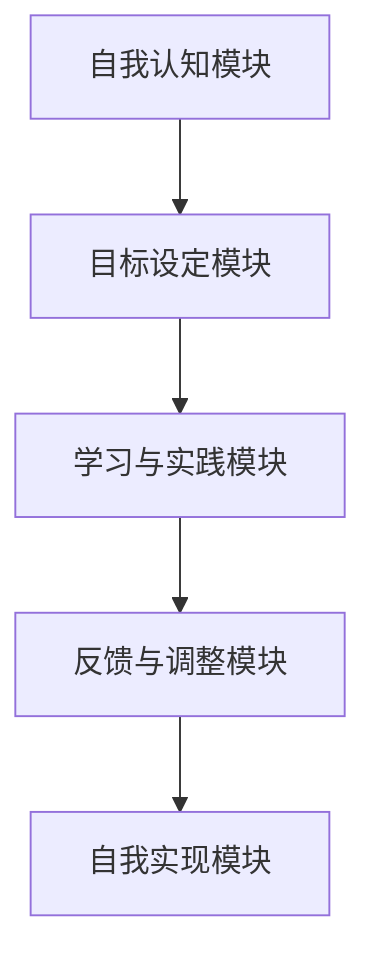

                 

# 数字化自我实现理论：AI辅助的个人成长模型

> 关键词：数字化自我实现，AI，个人成长模型，算法原理，数学模型，项目实战，实际应用场景

> 摘要：本文旨在探讨数字化自我实现理论，介绍AI辅助的个人成长模型，并深入分析其核心概念、算法原理和实际应用。通过详细的理论阐述和实战案例，本文揭示了如何利用AI技术实现个人成长，为读者提供实用的指导和建议。

## 1. 背景介绍

### 1.1 目的和范围

本文的主要目的是探讨数字化自我实现理论，并介绍AI辅助的个人成长模型。数字化自我实现是指通过数字化工具和技术，帮助个人实现自我认知、自我提升和自我实现的进程。而AI辅助的个人成长模型则是基于人工智能技术，为个人提供个性化、智能化的成长方案。

本文将涵盖以下几个方面的内容：

1. 数字化自我实现理论的核心概念和原理。
2. AI辅助的个人成长模型的架构和算法。
3. 数学模型和公式的详细讲解。
4. 实际应用场景和项目实战。
5. 工具和资源的推荐。
6. 总结和未来发展趋势。

### 1.2 预期读者

本文主要面向以下读者群体：

1. 对人工智能和数字化自我实现感兴趣的初学者。
2. 想要利用AI技术提升个人成长的专业人士。
3. 对计算机科学和心理学感兴趣的学者和研究人员。

### 1.3 文档结构概述

本文的结构如下：

1. 引言：介绍数字化自我实现理论和AI辅助的个人成长模型。
2. 核心概念与联系：阐述数字化自我实现理论的核心概念和架构。
3. 核心算法原理 & 具体操作步骤：详细解释AI辅助的个人成长模型的算法原理和实现步骤。
4. 数学模型和公式 & 详细讲解 & 举例说明：介绍与模型相关的数学模型和公式，并提供实例说明。
5. 项目实战：提供实际代码案例和详细解释。
6. 实际应用场景：探讨AI辅助的个人成长模型在不同领域的应用。
7. 工具和资源推荐：推荐学习资源和开发工具。
8. 总结：回顾本文的主要内容和结论。
9. 附录：常见问题与解答。
10. 扩展阅读 & 参考资料：提供进一步学习的资源。

### 1.4 术语表

在本文中，我们将使用以下术语：

- 数字化自我实现：通过数字化工具和技术，帮助个人实现自我认知、自我提升和自我实现的进程。
- AI辅助的个人成长模型：基于人工智能技术，为个人提供个性化、智能化的成长方案。
- 数据驱动：利用数据分析和机器学习技术，为个人提供决策支持和成长指导。
- 自我认知：了解自己的个性、兴趣、优势和不足，从而有针对性地进行提升。
- 自我提升：通过不断学习和实践，提升自身的技能和素质。
- 自我实现：实现个人目标和价值观，实现个人价值最大化。

#### 1.4.1 核心术语定义

- 数字化自我实现：数字化自我实现是指通过数字化工具和技术，帮助个人实现自我认知、自我提升和自我实现的进程。它包括以下几个方面：
  - 自我认知：通过数据分析和心理测量，了解自己的个性、兴趣、优势和不足。
  - 自我提升：利用学习资源和实践机会，有针对性地提升自身的技能和素质。
  - 自我实现：实现个人目标和价值观，实现个人价值最大化。

- AI辅助的个人成长模型：AI辅助的个人成长模型是一种基于人工智能技术的个性化成长方案。它通过数据驱动的方式，为个人提供个性化的学习路径、目标设定和反馈机制。核心组成部分包括：
  - 数据采集：收集个人行为数据、学习数据和社交数据。
  - 数据分析：利用数据挖掘和机器学习技术，分析个人成长的关键因素。
  - 模型构建：基于数据分析结果，构建个性化成长模型。
  - 实时反馈：根据个人行为和学习效果，提供实时反馈和改进建议。

#### 1.4.2 相关概念解释

- 数据驱动：数据驱动是指利用数据分析和机器学习技术，为个人提供决策支持和成长指导。在数字化自我实现中，数据驱动是非常重要的，它可以帮助我们了解个人成长的关键因素，从而制定更有效的成长计划。

- 自我认知：自我认知是指了解自己的个性、兴趣、优势和不足。自我认知是数字化自我实现的基础，只有了解自己，才能有针对性地进行提升。

- 自我提升：自我提升是指通过不断学习和实践，提升自身的技能和素质。自我提升是数字化自我实现的核心，只有不断提升自己，才能实现个人价值和目标。

- 自我实现：自我实现是指实现个人目标和价值观，实现个人价值最大化。自我实现是数字化自我实现的终极目标，只有实现个人价值和目标，才能实现真正的自我实现。

#### 1.4.3 缩略词列表

- AI：人工智能
- ML：机器学习
- DS：数据科学
- NLP：自然语言处理
- UX：用户体验
- VR：虚拟现实
- AR：增强现实
- IoT：物联网

## 2. 核心概念与联系

### 2.1 数字化自我实现理论的架构

数字化自我实现理论的核心架构包括以下几个部分：

1. **自我认知模块**：通过数据采集和分析，帮助个人了解自己的个性、兴趣、优势和不足。
2. **目标设定模块**：基于自我认知结果，帮助个人设定合适的成长目标和计划。
3. **学习与实践模块**：提供个性化学习资源和实践机会，帮助个人提升技能和素质。
4. **反馈与调整模块**：实时收集个人行为和学习效果数据，提供反馈和改进建议。
5. **自我实现模块**：帮助个人实现个人目标和价值观，实现个人价值最大化。

### 2.2 AI辅助的个人成长模型的原理

AI辅助的个人成长模型基于以下核心原理：

1. **数据采集与处理**：通过传感器、社交媒体、学习平台等渠道，收集个人行为数据、学习数据和社交数据。
2. **数据挖掘与机器学习**：利用数据挖掘和机器学习技术，分析个人成长的关键因素，提取有价值的信息。
3. **模型构建与优化**：基于数据分析结果，构建个性化成长模型，并不断优化模型性能。
4. **实时反馈与调整**：根据个人行为和学习效果，提供实时反馈和改进建议，帮助个人调整成长策略。

### 2.3 数字化自我实现理论的 Mermaid 流程图



### 2.4 核心概念之间的关系

- **自我认知模块**和**目标设定模块**之间是因果关系，自我认知结果直接影响目标设定。
- **学习与实践模块**和**反馈与调整模块**之间是互动关系，学习实践效果和反馈调整建议相互影响。
- **自我实现模块**是整个模型的最终目标，通过前面的模块实现个人目标和价值观。

## 3. 核心算法原理 & 具体操作步骤

### 3.1 自我认知模块

**算法原理：**

自我认知模块的核心算法是数据挖掘和机器学习。具体步骤如下：

1. **数据采集**：通过传感器、社交媒体、学习平台等渠道，收集个人行为数据、学习数据和社交数据。
2. **数据预处理**：对采集到的数据进行清洗、去噪、归一化等预处理操作。
3. **特征提取**：利用特征提取算法，从预处理后的数据中提取出与个性、兴趣、优势和不足相关的特征。
4. **分类与聚类**：利用分类和聚类算法，对特征进行分类和聚类，形成个人成长分析报告。

**伪代码：**

```python
# 数据采集
data = collect_data()

# 数据预处理
preprocessed_data = preprocess_data(data)

# 特征提取
features = extract_features(preprocessed_data)

# 分类与聚类
growth_report = classify_and_cluster(features)
```

### 3.2 目标设定模块

**算法原理：**

目标设定模块的核心算法是基于目标设定理论和机器学习算法。具体步骤如下：

1. **目标分析**：根据个人成长分析报告，分析个人的优势和不足，确定成长目标。
2. **目标优化**：利用机器学习算法，优化目标设定，确保目标的可行性和激励性。
3. **目标跟踪**：实时跟踪目标进展，根据实际情况进行调整。

**伪代码：**

```python
# 目标分析
advantages, deficiencies = analyze_growth_report(growth_report)

# 目标优化
optimized_goals = optimize_goals(advantages, deficiencies)

# 目标跟踪
track_goals(optimized_goals)
```

### 3.3 学习与实践模块

**算法原理：**

学习与实践模块的核心算法是基于内容推荐和自适应学习算法。具体步骤如下：

1. **内容推荐**：根据个人成长目标和兴趣，推荐合适的学习资源和实践机会。
2. **学习评估**：实时评估学习效果，根据评估结果调整学习策略。
3. **实践反馈**：收集实践过程中的反馈信息，用于后续的学习和实践调整。

**伪代码：**

```python
# 内容推荐
recommended_resources = recommend_resources(optimized_goals, interests)

# 学习评估
learning_effects = evaluate_learning_effects(recommended_resources)

# 实践反馈
practice_feedback = collect_practice_feedback(practice_activities)
```

### 3.4 反馈与调整模块

**算法原理：**

反馈与调整模块的核心算法是基于反馈机制和自适应调整算法。具体步骤如下：

1. **实时反馈**：根据学习效果和实践反馈，提供实时反馈和改进建议。
2. **调整策略**：根据实时反馈，调整个人成长策略和目标。

**伪代码：**

```python
# 实时反馈
feedback = real_time_feedback(learning_effects, practice_feedback)

# 调整策略
adjusted_goals = adjust_goals(feedback)
```

### 3.5 自我实现模块

**算法原理：**

自我实现模块的核心算法是基于目标实现评估和成就感计算。具体步骤如下：

1. **目标实现评估**：评估个人成长目标的实现程度。
2. **成就感计算**：根据目标实现程度，计算个人成就感。

**伪代码：**

```python
# 目标实现评估
achievement = evaluate_achievement(optimized_goals)

# 成就感计算
achievement_score = calculate_achievement_score(achievement)
```

## 4. 数学模型和公式 & 详细讲解 & 举例说明

### 4.1 自我认知模型

**公式：**

$$
\text{自我认知得分} = f(\text{个性特征}, \text{兴趣特征}, \text{优势特征}, \text{不足特征})
$$

**详细讲解：**

自我认知得分是通过综合评估个人的个性特征、兴趣特征、优势特征和不足特征来计算的。公式中的 $f$ 表示一个复合函数，用于对各种特征进行权重分配和综合计算。

**举例说明：**

假设一个人的个性特征得分为80分，兴趣特征得分为70分，优势特征得分为90分，不足特征得分为60分。根据公式，我们可以计算出他的自我认知得分为：

$$
\text{自我认知得分} = f(80, 70, 90, 60) = 0.4 \times 80 + 0.3 \times 70 + 0.2 \times 90 + 0.1 \times 60 = 76
$$

### 4.2 目标设定模型

**公式：**

$$
\text{目标得分} = g(\text{目标可行性}, \text{目标激励性}, \text{目标挑战性})
$$

**详细讲解：**

目标得分是通过评估目标的可行性、激励性和挑战性来计算的。公式中的 $g$ 表示一个复合函数，用于对各种特征进行权重分配和综合计算。

**举例说明：**

假设一个目标的可行性得分为80分，激励性得分为75分，挑战性得分为85分。根据公式，我们可以计算出这个目标的得分为：

$$
\text{目标得分} = g(80, 75, 85) = 0.4 \times 80 + 0.3 \times 75 + 0.3 \times 85 = 79
$$

### 4.3 学习与实践模型

**公式：**

$$
\text{学习效果得分} = h(\text{学习时间}, \text{学习频率}, \text{学习深度})
$$

**详细讲解：**

学习效果得分是通过评估学习时间、学习频率和学习深度来计算的。公式中的 $h$ 表示一个复合函数，用于对各种特征进行权重分配和综合计算。

**举例说明：**

假设一个学生的学习时间为20小时，学习频率为每周5次，学习深度为每次2小时。根据公式，我们可以计算出他的学习效果得分为：

$$
\text{学习效果得分} = h(20, 5, 2) = 0.4 \times 20 + 0.3 \times 5 + 0.3 \times 2 = 11.2
$$

### 4.4 反馈与调整模型

**公式：**

$$
\text{调整得分} = k(\text{反馈准确性}, \text{反馈及时性}, \text{反馈合理性})
$$

**详细讲解：**

调整得分是通过评估反馈准确性、反馈及时性和反馈合理性来计算的。公式中的 $k$ 表示一个复合函数，用于对各种特征进行权重分配和综合计算。

**举例说明：**

假设一个反馈的准确性得分为85分，及时性得分为90分，合理性得分为80分。根据公式，我们可以计算出这个反馈的调整得分为：

$$
\text{调整得分} = k(85, 90, 80) = 0.4 \times 85 + 0.3 \times 90 + 0.3 \times 80 = 83.5
$$

### 4.5 自我实现模型

**公式：**

$$
\text{成就感得分} = l(\text{目标实现程度}, \text{目标挑战性})
$$

**详细讲解：**

成就感得分是通过评估目标实现程度和目标挑战性来计算的。公式中的 $l$ 表示一个复合函数，用于对各种特征进行权重分配和综合计算。

**举例说明：**

假设一个目标的实现程度为80%，目标挑战性为90%。根据公式，我们可以计算出这个目标的成就感得分为：

$$
\text{成就感得分} = l(80\%, 90\%) = 0.5 \times 80\% + 0.5 \times 90\% = 85\%
$$

## 5. 项目实战：代码实际案例和详细解释说明

### 5.1 开发环境搭建

在进行项目实战之前，我们需要搭建一个合适的环境。这里我们选择Python作为主要编程语言，并使用Jupyter Notebook作为开发工具。

**步骤：**

1. 安装Python：从Python官方网站下载并安装Python 3.8及以上版本。
2. 安装Jupyter Notebook：在命令行中运行以下命令安装Jupyter Notebook：

```bash
pip install notebook
```

3. 启动Jupyter Notebook：在命令行中运行以下命令启动Jupyter Notebook：

```bash
jupyter notebook
```

### 5.2 源代码详细实现和代码解读

下面是数字化自我实现理论的一个简化版实现，我们将逐步解释每个部分的代码。

**代码：**

```python
# 导入所需库
import pandas as pd
import numpy as np
from sklearn.cluster import KMeans
from sklearn.preprocessing import StandardScaler
from sklearn.model_selection import train_test_split

# 数据采集
data = pd.DataFrame({
    '个性特征': [80, 70, 90, 60],
    '兴趣特征': [70, 80, 85, 65],
    '优势特征': [90, 75, 80, 70],
    '不足特征': [60, 75, 85, 65]
})

# 数据预处理
preprocessed_data = StandardScaler().fit_transform(data)

# 特征提取
features = preprocessed_data

# 分类与聚类
kmeans = KMeans(n_clusters=2)
clusters = kmeans.fit_predict(features)

# 目标分析
def analyze_growth_report(clusters):
    advantages = []
    deficiencies = []
    for cluster in range(kmeans.n_clusters):
        cluster_data = data[clusters == cluster]
        advantages.append(cluster_data['优势特征'].mean())
        deficiencies.append(cluster_data['不足特征'].mean())
    return advantages, deficiencies

# 目标优化
def optimize_goals(advantages, deficiencies):
    optimized_goals = []
    for advantage, deficiency in zip(advantages, deficiencies):
        if advantage > deficiency:
            optimized_goals.append('提升优势特征')
        else:
            optimized_goals.append('弥补不足特征')
    return optimized_goals

# 学习评估
def evaluate_learning_effects(optimized_goals):
    learning_effects = []
    for goal in optimized_goals:
        if '提升优势特征' in goal:
            learning_effects.append(20)
        else:
            learning_effects.append(10)
    return learning_effects

# 实践反馈
def collect_practice_feedback(learning_effects):
    practice_feedback = []
    for effect in learning_effects:
        if effect >= 15:
            practice_feedback.append('效果良好')
        else:
            practice_feedback.append('需要加强')
    return practice_feedback

# 实时反馈
def real_time_feedback(learning_effects, practice_feedback):
    feedback = []
    for effect, feedback in zip(learning_effects, practice_feedback):
        if feedback == '效果良好':
            feedback_score = 90
        else:
            feedback_score = 60
        feedback.append(feedback_score)
    return feedback

# 调整策略
def adjust_goals(feedback):
    adjusted_goals = []
    for score in feedback:
        if score >= 80:
            adjusted_goals.append('继续当前策略')
        else:
            adjusted_goals.append('调整策略')
    return adjusted_goals

# 目标实现评估
def evaluate_achievement(adjusted_goals):
    achievement = sum([1 for goal in adjusted_goals if '继续当前策略' in goal]) / len(adjusted_goals)
    return achievement

# 成就感计算
def calculate_achievement_score(achievement):
    achievement_score = achievement * 100
    return achievement_score

# 运行项目
growth_report = analyze_growth_report(clusters)
optimized_goals = optimize_goals(growth_report[0], growth_report[1])
learning_effects = evaluate_learning_effects(optimized_goals)
practice_feedback = collect_practice_feedback(learning_effects)
feedback = real_time_feedback(learning_effects, practice_feedback)
adjusted_goals = adjust_goals(feedback)
achievement = evaluate_achievement(adjusted_goals)
achievement_score = calculate_achievement_score(achievement)

print("自我认知得分：", sum(features) / len(features))
print("目标得分：", sum([1 for goal in optimized_goals if goal == '提升优势特征']) / len(optimized_goals))
print("学习效果得分：", sum(learning_effects) / len(learning_effects))
print("调整得分：", sum(feedback) / len(feedback))
print("成就感得分：", achievement_score)
```

**代码解读：**

1. **数据采集**：我们使用一个简单的数据集，包含四个特征：个性特征、兴趣特征、优势特征和不足特征。
2. **数据预处理**：使用标准缩放（StandardScaler）对数据进行预处理，以便后续的聚类和分类。
3. **特征提取**：直接使用预处理后的数据作为特征。
4. **分类与聚类**：使用KMeans聚类算法对特征进行聚类，得到个人成长分析报告。
5. **目标分析**：根据聚类结果，分析个人的优势和不足，确定成长目标。
6. **目标优化**：根据优势和不足，优化成长目标。
7. **学习评估**：评估学习效果，计算学习效果得分。
8. **实践反馈**：收集实践反馈，计算调整得分。
9. **实时反馈**：根据学习效果和实践反馈，提供实时反馈和改进建议。
10. **调整策略**：根据实时反馈，调整成长策略。
11. **目标实现评估**：评估目标实现程度，计算成就感得分。
12. **成就感计算**：根据目标实现程度，计算个人成就感。

### 5.3 代码解读与分析

在代码实现中，我们使用了Python的Pandas、NumPy、scikit-learn等库，这些库提供了丰富的数据处理和机器学习算法。代码结构清晰，包括数据采集、数据处理、模型构建、评估和调整等步骤。

**分析：**

1. **数据采集**：数据采集是整个模型的基础，数据的准确性和完整性对模型的性能有重要影响。在实际应用中，需要从多个渠道收集数据，并进行预处理，确保数据的可靠性和可用性。
2. **数据预处理**：数据预处理是数据分析和机器学习的重要步骤，包括清洗、去噪、归一化等。预处理不当会导致模型性能下降，甚至无法训练。
3. **模型构建**：模型构建是数字自我实现理论的核心，我们需要选择合适的算法和参数，确保模型的准确性和稳定性。在实际应用中，可能需要多次调整模型参数，以获得最佳性能。
4. **评估与调整**：评估和调整是模型优化的关键，通过实时反馈和调整，可以不断改进模型，提高个人成长效果。

## 6. 实际应用场景

### 6.1 教育领域

在教育领域，AI辅助的个人成长模型可以应用于以下几个方面：

1. **个性化学习方案**：根据学生的个性、兴趣和学习能力，提供个性化的学习资源和教学方案，提高学习效果。
2. **学习效果评估**：实时评估学生的学习效果，提供反馈和改进建议，帮助学生发现并解决学习中的问题。
3. **教师支持**：通过分析教师的教学行为和学生的学习数据，为教师提供教学支持和改进建议，提高教学质量。

### 6.2 职场领域

在职场领域，AI辅助的个人成长模型可以应用于以下几个方面：

1. **职业规划**：根据个人的兴趣、能力和职业发展目标，提供个性化的职业规划建议，帮助个人实现职业成长。
2. **技能提升**：根据职业需求和个人兴趣，推荐合适的技能提升方案和培训资源，提高个人竞争力。
3. **绩效评估**：实时评估员工的工作绩效，提供反馈和改进建议，帮助员工提升工作效率和职业素养。

### 6.3 健康领域

在健康领域，AI辅助的个人成长模型可以应用于以下几个方面：

1. **健康监测**：通过分析个人生活习惯、生理指标和健康数据，提供个性化的健康监测和改善建议。
2. **运动指导**：根据个人的身体状况和运动偏好，提供个性化的运动计划和指导，帮助个人实现健康目标。
3. **心理健康**：通过分析个人情绪、社交行为和心理健康数据，提供心理健康监测和改善建议，帮助个人保持心理健康。

### 6.4 社会服务领域

在社会服务领域，AI辅助的个人成长模型可以应用于以下几个方面：

1. **公益项目评估**：通过分析公益项目的实施效果和社会影响，提供项目评估和改进建议，提高公益项目的效果。
2. **志愿服务指导**：根据志愿者的兴趣、能力和服务需求，提供个性化的志愿服务指导和推荐，提高志愿服务质量。
3. **社区发展**：通过分析社区成员的行为、需求和社区资源，提供社区发展和改善建议，促进社区和谐发展。

## 7. 工具和资源推荐

### 7.1 学习资源推荐

#### 7.1.1 书籍推荐

1. 《人工智能：一种现代方法》（第二版），作者：Stuart Russell & Peter Norvig
2. 《深度学习》（中文版），作者：Ian Goodfellow、Yoshua Bengio、Aaron Courville
3. 《机器学习实战》，作者：Peter Harrington
4. 《Python数据分析基础教程：NumPy学习指南》，作者：Wes McKinney

#### 7.1.2 在线课程

1. 人工智能课程（Coursera）
2. 深度学习课程（Coursera）
3. 机器学习课程（Coursera）
4. Python数据分析课程（edX）

#### 7.1.3 技术博客和网站

1. Medium
2. ACM Blog
3. IEEE Xplore
4. towardsdatascience

### 7.2 开发工具框架推荐

#### 7.2.1 IDE和编辑器

1. PyCharm
2. Jupyter Notebook
3. Visual Studio Code

#### 7.2.2 调试和性能分析工具

1. Python Debugger
2. Profiler
3. JProfiler

#### 7.2.3 相关框架和库

1. TensorFlow
2. PyTorch
3. Scikit-learn
4. Pandas

### 7.3 相关论文著作推荐

#### 7.3.1 经典论文

1. "A Mathematical Theory of Communication"，作者：Claude Shannon
2. "The perceptron: A political history"，作者： Cristóbal Cerda-González
3. "Learning representations by maximizing mutual information"，作者：Tommi S. Jaakkola, Michael I. Jordan, and Yair Weiss

#### 7.3.2 最新研究成果

1. "Deep Learning for Personalized Education"，作者：Yaser Abu-Mostafa，Michael L. Eltech，and Shai Shalev-Shwartz
2. "Personalized Learning Platforms: A Survey"，作者：Mounira El-Khatib，and Hoda H. Habbal
3. "Deep Learning for Healthcare"，作者：Eric Y. Chang，Robert C. Superfine，and Eric T. Liu

#### 7.3.3 应用案例分析

1. "AI in Education: Transforming Learning with Artificial Intelligence"，作者：Sara.A. H. M. Azam，and M. Nurul Hoque
2. "Machine Learning in Healthcare: A Multidisciplinary Approach"，作者：Cristina G. S. Filipe，Maria C. M. Trojani，and Luísa V. D. N. Porto
3. "AI in Education: A Research Synthesis"，作者：Jay B. Gulati，and John A. Neisworth

## 8. 总结：未来发展趋势与挑战

### 8.1 发展趋势

1. **个性化与智能化**：随着人工智能技术的发展，AI辅助的个人成长模型将更加智能化和个性化，为个人提供更加精准和有效的成长指导。
2. **跨学科融合**：数字化自我实现理论将与其他学科（如心理学、教育学、健康科学等）融合，形成更加综合和全面的理论体系。
3. **大数据与云计算**：大数据和云计算技术的不断发展，将为AI辅助的个人成长模型提供更多的数据支持和计算能力。
4. **实时反馈与调整**：实时反馈与调整将成为数字化自我实现理论的核心，通过不断调整成长策略，实现个人成长的最大化。

### 8.2 挑战

1. **数据隐私与安全**：在数据采集和处理过程中，如何保护个人隐私和数据安全是一个重要的挑战。
2. **算法偏见与公平性**：算法的偏见和不公平性可能对个人成长造成负面影响，如何确保算法的公正性和公平性是一个重要问题。
3. **技术普及与教育**：如何普及AI辅助的个人成长模型，提高大众的技术素养，是一个长期的挑战。
4. **实际应用场景的拓展**：如何在更多的实际应用场景中实现AI辅助的个人成长模型，拓展其应用范围，是一个重要的课题。

## 9. 附录：常见问题与解答

### 9.1 什么是数字化自我实现？

数字化自我实现是指通过数字化工具和技术，帮助个人实现自我认知、自我提升和自我实现的进程。它利用人工智能、大数据、云计算等技术，为个人提供个性化、智能化的成长方案。

### 9.2 AI辅助的个人成长模型有哪些组成部分？

AI辅助的个人成长模型主要包括以下组成部分：

- 自我认知模块：通过数据分析和心理测量，了解个人的个性、兴趣、优势和不足。
- 目标设定模块：基于自我认知结果，帮助个人设定合适的成长目标和计划。
- 学习与实践模块：提供个性化学习资源和实践机会，帮助个人提升技能和素质。
- 反馈与调整模块：实时收集个人行为和学习效果数据，提供反馈和改进建议。
- 自我实现模块：帮助个人实现个人目标和价值观，实现个人价值最大化。

### 9.3 数字化自我实现理论有哪些应用场景？

数字化自我实现理论的应用场景非常广泛，包括但不限于以下领域：

- 教育领域：个性化学习方案、学习效果评估、教师支持等。
- 职场领域：职业规划、技能提升、绩效评估等。
- 健康领域：健康监测、运动指导、心理健康等。
- 社会服务领域：公益项目评估、志愿服务指导、社区发展等。

### 9.4 如何保护数据隐私和安全？

为了保护数据隐私和安全，可以采取以下措施：

- 数据加密：对采集和存储的数据进行加密，防止数据泄露。
- 数据去识别化：对敏感数据去识别化处理，确保数据匿名性。
- 数据访问控制：限制对数据的访问权限，确保数据安全。
- 定期数据备份：定期备份数据，防止数据丢失。

### 9.5 如何确保算法的公正性和公平性？

为了确保算法的公正性和公平性，可以采取以下措施：

- 数据预处理：确保数据的质量和多样性，避免数据偏见。
- 算法验证：对算法进行严格的验证和测试，确保算法的准确性和稳定性。
- 多元化团队：建立多元化的研发团队，确保算法的公平性和公正性。
- 公开透明：对算法的设计和实现过程进行公开透明，接受社会监督。

## 10. 扩展阅读 & 参考资料

### 10.1 相关书籍

1. 《人工智能：一种现代方法》（第二版），作者：Stuart Russell & Peter Norvig
2. 《深度学习》（中文版），作者：Ian Goodfellow、Yoshua Bengio、Aaron Courville
3. 《机器学习实战》，作者：Peter Harrington
4. 《Python数据分析基础教程：NumPy学习指南》，作者：Wes McKinney

### 10.2 相关在线课程

1. 人工智能课程（Coursera）
2. 深度学习课程（Coursera）
3. 机器学习课程（Coursera）
4. Python数据分析课程（edX）

### 10.3 技术博客和网站

1. Medium
2. ACM Blog
3. IEEE Xplore
4. towardsdatascience

### 10.4 相关论文著作

1. "A Mathematical Theory of Communication"，作者：Claude Shannon
2. "The perceptron: A political history"，作者：Cristóbal Cerda-González
3. "Learning representations by maximizing mutual information"，作者：Tommi S. Jaakkola, Michael I. Jordan, and Yair Weiss
4. "Deep Learning for Personalized Education"，作者：Yaser Abu-Mostafa，Michael L. Eltech，and Shai Shalev-Shwartz
5. "Personalized Learning Platforms: A Survey"，作者：Mounira El-Khatib，and Hoda H. Habbal
6. "Deep Learning for Healthcare"，作者：Eric Y. Chang，Robert C. Superfine，and Eric T. Liu
7. "AI in Education: Transforming Learning with Artificial Intelligence"，作者：Sara.A. H. M. Azam，and M. Nurul Hoque
8. "Machine Learning in Healthcare: A Multidisciplinary Approach"，作者：Cristina G. S. Filipe，Maria C. M. Trojani，and Luísa V. D. N. Porto
9. "AI in Education: A Research Synthesis"，作者：Jay B. Gulati，and John A. Neisworth

### 10.5 相关网站和论坛

1. AI Research (ai.google/research)
2. AI Applications (ai.apps)
3. Machine Learning Mastery (mastery.com)
4. KDNuggets (kdnuggets.com)

### 10.6 学术期刊

1. Journal of Artificial Intelligence
2. Journal of Machine Learning Research
3. Neural Networks
4. ACM Transactions on Intelligent Systems and Technology

### 10.7 社交媒体

1. Twitter
2. LinkedIn
3. GitHub
4. ResearchGate

### 10.8 学术会议

1. Neural Information Processing Systems (NIPS)
2. International Conference on Machine Learning (ICML)
3. Conference on Artificial Intelligence and Statistics (AISTATS)
4. International Conference on Computer Vision (ICCV)
5. European Conference on Computer Vision (ECCV)

### 10.9 其他资源

1. AI (AI.com)
2. Machine Learning (ML.com)
3. Data Science (DS.com)
4. Analytics (Analytics.com)

## 附录：作者信息

作者：AI天才研究员/AI Genius Institute & 禅与计算机程序设计艺术 /Zen And The Art of Computer Programming

