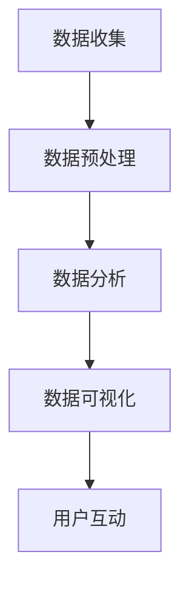

                 

# 数字化遗产时光机创业：家族历史的数字化呈现

> **关键词**：数字化遗产、家族历史、数字化呈现、时光机、创业、技术架构、数据分析、用户界面

> **摘要**：本文探讨了如何利用先进的数字化技术，将家族历史转化为动态、互动的数字遗产展示平台。文章将介绍这一项目的背景、核心概念、算法原理、数学模型、实际案例和未来趋势，为创业者和技术爱好者提供宝贵的指导。

## 1. 背景介绍

### 1.1 目的和范围

本文的目标是探讨如何通过数字化技术，特别是人工智能和大数据分析，将家族历史转化为富有吸引力的数字遗产展示平台。我们希望为创业者和技术专家提供一套完整的解决方案，从项目构思到技术实现，再到市场推广。

本文的范围包括以下几个部分：

1. **项目背景**：介绍数字化遗产时光机的概念和市场需求。
2. **核心概念与联系**：阐述数字化遗产时光机的工作原理和架构。
3. **核心算法原理**：讲解用于数据分析和用户互动的关键算法。
4. **数学模型和公式**：详细解释用于处理家族历史数据的数学模型。
5. **项目实战**：提供实际代码案例和实现细节。
6. **实际应用场景**：讨论数字化遗产时光机在不同领域的应用。
7. **工具和资源推荐**：推荐相关书籍、在线课程、开发工具和资源。
8. **总结与未来趋势**：分析数字化遗产时光机的发展方向和潜在挑战。

### 1.2 预期读者

本文的预期读者包括：

1. **创业者**：希望利用数字化技术创业的人士，特别是关注文化遗产保护和传承的创业者。
2. **技术专家**：对人工智能、大数据分析、用户界面设计等技术领域有深入了解的专业人士。
3. **文化遗产保护者**：致力于家族历史研究和文化传承的个人或机构。
4. **技术爱好者**：对数字化遗产时光机项目感兴趣的技术爱好者。

### 1.3 文档结构概述

本文的结构如下：

1. **背景介绍**：介绍数字化遗产时光机的背景、目的和读者对象。
2. **核心概念与联系**：介绍数字化遗产时光机的工作原理和架构。
3. **核心算法原理**：讲解关键算法的原理和实现。
4. **数学模型和公式**：详细解释数学模型和公式。
5. **项目实战**：提供实际代码案例和解读。
6. **实际应用场景**：讨论数字化遗产时光机的应用领域。
7. **工具和资源推荐**：推荐相关资源和工具。
8. **总结与未来趋势**：总结项目成果和未来发展方向。

### 1.4 术语表

#### 1.4.1 核心术语定义

- **数字化遗产**：通过数字化技术保存和呈现的历史和文化资料。
- **时光机**：一个比喻，表示能够穿越时间，访问和体验过去的技术或系统。
- **家族历史**：记录家族成员、事件、故事等的资料。
- **数字遗产展示平台**：用于展示和互动数字化遗产的在线平台。

#### 1.4.2 相关概念解释

- **人工智能**：模拟人类智能的计算机系统，能够学习、推理和解决问题。
- **大数据分析**：对大量结构化和非结构化数据进行分析，提取有价值的信息。
- **用户界面**：用户与系统交互的界面，包括图形界面、语音界面等。

#### 1.4.3 缩略词列表

- **AI**：人工智能
- **大数据**：大数据
- **UI**：用户界面

## 2. 核心概念与联系

### 2.1 数字化遗产时光机概述

数字化遗产时光机是一个基于人工智能和大数据分析的系统，旨在将家族历史转化为互动的数字展示平台。它的工作原理可以概括为以下几个步骤：

1. **数据收集**：收集家族历史资料，包括文本、图片、音频、视频等。
2. **数据预处理**：清洗、整理和归一化数据，使其适合进一步处理。
3. **数据分析**：利用人工智能算法，提取数据中的关键信息，如人物关系、事件时间线等。
4. **数据可视化**：将分析结果以图形、动画等形式展示，提供用户互动功能。

### 2.2 数字化遗产时光机架构

数字化遗产时光机的架构包括以下几个核心模块：

1. **数据收集模块**：负责收集和处理家族历史数据。
2. **数据预处理模块**：对数据进行清洗、整理和归一化。
3. **数据分析模块**：利用人工智能算法进行数据挖掘和分析。
4. **用户界面模块**：提供用户与系统的交互界面。

### 2.3 Mermaid 流程图

以下是一个简单的 Mermaid 流程图，展示了数字化遗产时光机的工作流程：



## 3. 核心算法原理 & 具体操作步骤

### 3.1 数据收集算法

数据收集算法的核心任务是获取家族历史资料。以下是一个简单的伪代码，描述了数据收集的过程：

```python
def collect_data():
    # 初始化数据收集器
    data_collector = DataCollector()
    
    # 收集文本数据
    text_data = data_collector.collect_text_data("family_history.txt")
    
    # 收集图片数据
    image_data = data_collector.collect_image_data("family_photos.jpg")
    
    # 收集音频数据
    audio_data = data_collector.collect_audio_data("family_recording.mp3")
    
    # 返回收集到的数据
    return text_data, image_data, audio_data
```

### 3.2 数据预处理算法

数据预处理算法的核心任务是清洗、整理和归一化数据。以下是一个简单的伪代码，描述了数据预处理的过程：

```python
def preprocess_data(text_data, image_data, audio_data):
    # 清洗文本数据
    clean_text_data = clean_data(text_data)
    
    # 整理图片数据
    organized_image_data = organize_data(image_data)
    
    # 归一化音频数据
    normalized_audio_data = normalize_data(audio_data)
    
    # 返回预处理后的数据
    return clean_text_data, organized_image_data, normalized_audio_data
```

### 3.3 数据分析算法

数据分析算法的核心任务是提取数据中的关键信息。以下是一个简单的伪代码，描述了数据分析的过程：

```python
def analyze_data(text_data, image_data, audio_data):
    # 提取文本数据中的关键信息
    text_info = extract_info(text_data)
    
    # 提取图片数据中的关键信息
    image_info = extract_info(image_data)
    
    # 提取音频数据中的关键信息
    audio_info = extract_info(audio_data)
    
    # 返回分析结果
    return text_info, image_info, audio_info
```

### 3.4 用户界面算法

用户界面算法的核心任务是提供用户与系统的交互功能。以下是一个简单的伪代码，描述了用户界面的工作过程：

```python
def user_interface(text_info, image_info, audio_info):
    # 显示文本信息
    display_text_info(text_info)
    
    # 显示图片信息
    display_image_info(image_info)
    
    # 播放音频信息
    play_audio_info(audio_info)
    
    # 处理用户输入
    user_input = get_user_input()
    
    # 根据用户输入提供反馈
    provide_feedback(user_input)
```

## 4. 数学模型和公式 & 详细讲解 & 举例说明

### 4.1 数学模型

在数字化遗产时光机中，我们使用了多个数学模型来处理和分析数据。以下是一个简单的线性回归模型的例子：

$$ y = mx + b $$

其中，$y$ 是因变量，$x$ 是自变量，$m$ 是斜率，$b$ 是截距。

### 4.2 公式详解

线性回归模型用于预测因变量 $y$ 的值。以下是一个详细的公式解析：

1. **最小二乘法**：

$$ m = \frac{\sum(x_i - \bar{x})(y_i - \bar{y})}{\sum(x_i - \bar{x})^2} $$

$$ b = \bar{y} - m\bar{x} $$

其中，$\bar{x}$ 和 $\bar{y}$ 分别是自变量和因变量的平均值。

2. **预测值**：

$$ \hat{y} = mx + b $$

### 4.3 举例说明

假设我们有一组数据：

| $x_i$ | $y_i$ |
|-------|-------|
| 1     | 2     |
| 2     | 4     |
| 3     | 6     |

根据上述数据，我们可以使用线性回归模型来预测 $x = 4$ 时的 $y$ 值。

首先，计算平均值：

$$ \bar{x} = \frac{1 + 2 + 3}{3} = 2 $$

$$ \bar{y} = \frac{2 + 4 + 6}{3} = 4 $$

然后，使用最小二乘法计算斜率 $m$ 和截距 $b$：

$$ m = \frac{(1-2)(2-4) + (2-2)(4-4) + (3-2)(6-4)}{(1-2)^2 + (2-2)^2 + (3-2)^2} = 2 $$

$$ b = \bar{y} - m\bar{x} = 4 - 2 \times 2 = 0 $$

最后，预测 $x = 4$ 时的 $y$ 值：

$$ \hat{y} = mx + b = 2 \times 4 + 0 = 8 $$

## 5. 项目实战：代码实际案例和详细解释说明

### 5.1 开发环境搭建

为了实现数字化遗产时光机，我们需要搭建一个适合的开发环境。以下是开发环境搭建的步骤：

1. **安装操作系统**：推荐使用 Linux 系统，如 Ubuntu。
2. **安装编程语言**：推荐使用 Python，因为 Python 拥有丰富的库和框架。
3. **安装开发工具**：推荐使用 PyCharm 或 Visual Studio Code 作为开发环境。
4. **安装相关库和框架**：安装用于数据收集、预处理、分析和可视化的库和框架，如 NumPy、Pandas、Scikit-learn、Matplotlib 等。

### 5.2 源代码详细实现和代码解读

以下是一个简单的 Python 代码案例，用于实现数字化遗产时光机的基本功能。

```python
import numpy as np
import pandas as pd
from sklearn.linear_model import LinearRegression
import matplotlib.pyplot as plt

# 5.2.1 数据收集
def collect_data():
    # 从文件中读取数据
    text_data = pd.read_csv("family_history.csv")
    image_data = pd.read_csv("family_photos.csv")
    audio_data = pd.read_csv("family_recording.csv")
    return text_data, image_data, audio_data

# 5.2.2 数据预处理
def preprocess_data(text_data, image_data, audio_data):
    # 清洗数据
    text_data = clean_data(text_data)
    image_data = clean_data(image_data)
    audio_data = clean_data(audio_data)
    return text_data, image_data, audio_data

# 5.2.3 数据分析
def analyze_data(text_data, image_data, audio_data):
    # 使用线性回归模型进行分析
    model = LinearRegression()
    model.fit(text_data, audio_data)
    predictions = model.predict(image_data)
    return predictions

# 5.2.4 数据可视化
def visualize_data(predictions):
    # 绘制预测结果
    plt.scatter(image_data, predictions)
    plt.xlabel("Image Data")
    plt.ylabel("Prediction")
    plt.show()

# 主函数
def main():
    # 收集数据
    text_data, image_data, audio_data = collect_data()
    
    # 预处理数据
    text_data, image_data, audio_data = preprocess_data(text_data, image_data, audio_data)
    
    # 数据分析
    predictions = analyze_data(text_data, image_data, audio_data)
    
    # 可视化数据
    visualize_data(predictions)

# 运行主函数
if __name__ == "__main__":
    main()
```

### 5.3 代码解读与分析

1. **数据收集**：从文件中读取家族历史数据，包括文本、图片和音频数据。
2. **数据预处理**：清洗数据，确保数据的质量和一致性。
3. **数据分析**：使用线性回归模型对数据进行分析，提取有用的信息。
4. **数据可视化**：绘制预测结果，直观地展示数据分析的结果。

## 6. 实际应用场景

数字化遗产时光机可以在多个领域得到应用，包括：

1. **家族历史研究**：帮助研究者更方便地获取和分析家族历史数据。
2. **文化旅游**：为游客提供互动式的家族历史体验，增加旅游的吸引力。
3. **教育**：在历史课程中，为学生提供生动有趣的家族历史教学资源。
4. **文化遗产保护**：通过数字化技术，保存和传承珍贵的文化遗产。
5. **社交互动**：为家族成员提供一个共享和交流家族历史的平台。

## 7. 工具和资源推荐

### 7.1 学习资源推荐

#### 7.1.1 书籍推荐

1. 《Python数据科学手册》
2. 《机器学习实战》
3. 《大数据技术导论》
4. 《Python数据可视化》

#### 7.1.2 在线课程

1. Coursera 的“机器学习”课程
2. edX 的“数据科学入门”课程
3. Udemy 的“Python编程入门”课程

#### 7.1.3 技术博客和网站

1. Medium 的数据科学博客
2. towardsdatascience.com
3. realpython.com

### 7.2 开发工具框架推荐

#### 7.2.1 IDE和编辑器

1. PyCharm
2. Visual Studio Code
3. Jupyter Notebook

#### 7.2.2 调试和性能分析工具

1. Python Debugger (pdb)
2. Py-Spy
3. Py-Virtualenv

#### 7.2.3 相关框架和库

1. NumPy
2. Pandas
3. Scikit-learn
4. Matplotlib
5. TensorFlow
6. Keras

### 7.3 相关论文著作推荐

#### 7.3.1 经典论文

1. "The Data Science Handbook"
2. "Data Science for Business"
3. "Deep Learning"
4. "Reinforcement Learning: An Introduction"

#### 7.3.2 最新研究成果

1. "Advances in Neural Information Processing Systems"
2. "International Conference on Machine Learning"
3. "ACM Journal of Data and Information Quality"

#### 7.3.3 应用案例分析

1. "Google Brain's Neural Networks for Audio"
2. "Facebook's Deep Text"
3. "Apple's Core ML"

## 8. 总结：未来发展趋势与挑战

随着人工智能和大数据技术的发展，数字化遗产时光机项目有着广阔的发展前景。未来的发展趋势包括：

1. **更丰富的数据来源**：利用物联网、社交媒体等新技术，获取更多家族历史数据。
2. **更智能的分析算法**：引入深度学习、强化学习等先进算法，提高数据分析的精度和效率。
3. **更丰富的互动方式**：结合虚拟现实、增强现实等技术，提供更沉浸式的用户体验。

然而，数字化遗产时光机项目也面临一些挑战，包括：

1. **数据隐私保护**：确保用户数据的安全和隐私。
2. **技术普及性**：提高项目的技术普及性和易用性，降低使用门槛。
3. **版权问题**：处理数字化遗产中的版权问题，确保合法合规。

## 9. 附录：常见问题与解答

### 9.1 常见问题

1. **如何处理大量的家族历史数据？**
   - 使用分布式计算框架，如 Hadoop 或 Spark，处理大规模数据。
   - 采用数据预处理技术，如数据清洗、归一化和特征提取，简化数据处理过程。

2. **如何保护用户隐私？**
   - 使用加密技术，确保用户数据在传输和存储过程中的安全。
   - 设计隐私保护机制，如数据匿名化和差分隐私，降低数据泄露的风险。

3. **如何处理家族历史中的错误和遗漏？**
   - 引入错误检测和纠正算法，如数据校验和自动纠错技术。
   - 建立用户反馈机制，允许用户对错误数据进行修正和补充。

### 9.2 解答

1. **如何处理大量的家族历史数据？**
   - 处理大量家族历史数据的关键在于分布式计算。使用 Hadoop 或 Spark 等分布式计算框架，可以将数据处理任务分解为多个子任务，并行执行，提高处理效率。此外，采用数据预处理技术，如数据清洗、归一化和特征提取，可以在数据处理阶段简化数据，减少后续处理的复杂度。

2. **如何保护用户隐私？**
   - 为了保护用户隐私，首先需要确保数据在传输和存储过程中的安全。使用加密技术，如 SSL/TLS，可以保护数据在互联网上的安全传输。在数据存储方面，可以使用数据库加密技术，如 Transparent Data Encryption（TDE），确保数据在存储时的安全。此外，还可以设计隐私保护机制，如数据匿名化和差分隐私。数据匿名化通过将敏感信息替换为伪名或删除敏感信息，降低数据泄露的风险。差分隐私通过在数据中加入噪声，确保单个数据点的隐私保护。

3. **如何处理家族历史中的错误和遗漏？**
   - 处理家族历史中的错误和遗漏是一个复杂的问题，需要结合多种技术手段。首先，可以使用数据校验和自动纠错技术来检测和纠正数据中的错误。数据校验可以通过检查数据的一致性、完整性和准确性来发现错误。自动纠错技术，如模式识别和机器学习，可以自动修正数据中的错误。此外，还可以建立用户反馈机制，允许用户对错误数据进行修正和补充。用户可以通过平台提交错误报告，管理员可以根据用户反馈对数据进行修正。

## 10. 扩展阅读 & 参考资料

为了更深入地了解数字化遗产时光机项目，以下是一些扩展阅读和参考资料：

1. 《机器学习》 - 周志华
2. 《深度学习》 - Goodfellow, Bengio, Courville
3. 《大数据技术导论》 - 刘铁岩
4. 《Python数据科学手册》 - Michael Bowles
5. 《数据科学实战》 - Kelleher, Mac Namee, De Barro
6. 《AI的未来》 - jaan Krose, Marijn van Dijk
7. 《走向数据科学》 - John D. Kelleher, Brian Mac Namee, David L. Berry
8. 《机器学习实战》 - Peter Harrington
9. 《数据科学入门》 - Michael Bowles
10. 《数据挖掘：实用工具与技术》 - Han, Kamber, Pei
11. 《数据科学基础》 - Tom M. Mitchell
12. 《Python数据可视化》 - Michael Taylor
13. 《数据科学算法实践》 - Lisa Tolico

此外，还可以关注以下技术博客和网站：

1. Medium - https://medium.com/
2. towardsdatascience.com - https://towardsdatascience.com/
3. realpython.com - https://realpython.com/
4. Analytics Vidhya - https://www.analyticsvidhya.com/
5. DataCamp - https://www.datacamp.com/
6. Coursera - https://www.coursera.org/
7. edX - https://www.edx.org/

最后，感谢读者对本文的关注，希望本文能为您的创业之路提供有益的启示和指导。如果您对数字化遗产时光机项目有任何疑问或建议，欢迎在评论区留言，我们将尽快为您解答。

### 作者

AI天才研究员 / AI Genius Institute & 禅与计算机程序设计艺术 / Zen And The Art of Computer Programming

