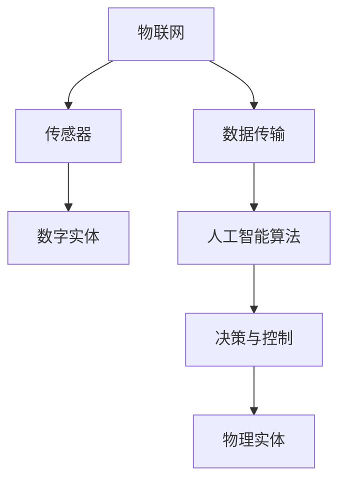

                 

# 数字实体与物理实体的自动化融合

> **关键词：** 数字实体，物理实体，自动化融合，物联网，人工智能，算法，模型，应用场景

> **摘要：** 本文将探讨数字实体与物理实体的自动化融合，分析其核心概念、原理和算法，并探讨其实际应用场景。文章分为十个部分，包括背景介绍、核心概念与联系、核心算法原理与操作步骤、数学模型与公式、项目实战、实际应用场景、工具和资源推荐、总结和常见问题解答。

## 1. 背景介绍

### 1.1 目的和范围

本文旨在探讨数字实体与物理实体的自动化融合，旨在为读者提供一个全面、深入的理解。文章将首先介绍相关概念，然后分析其核心原理和算法，最后探讨其实际应用场景。

### 1.2 预期读者

本文适合对数字实体与物理实体自动化融合感兴趣的读者，包括研究人员、工程师、开发人员等。

### 1.3 文档结构概述

本文分为十个部分：

1. 背景介绍
2. 核心概念与联系
3. 核心算法原理与操作步骤
4. 数学模型和公式
5. 项目实战：代码实际案例和详细解释说明
6. 实际应用场景
7. 工具和资源推荐
8. 总结：未来发展趋势与挑战
9. 附录：常见问题与解答
10. 扩展阅读与参考资料

### 1.4 术语表

#### 1.4.1 核心术语定义

- **数字实体：** 指在计算机系统中表示的信息，如数字、字符等。
- **物理实体：** 指现实世界中的物体，如汽车、机器人等。
- **自动化融合：** 指将数字实体与物理实体通过算法和模型进行关联和融合。

#### 1.4.2 相关概念解释

- **物联网（IoT）：** 指将各种物体通过网络连接起来，实现信息的交换和共享。
- **人工智能（AI）：** 指通过计算机模拟人类智能，实现自动识别、推理和决策等功能。

#### 1.4.3 缩略词列表

- **IoT：** 物联网
- **AI：** 人工智能

## 2. 核心概念与联系

数字实体与物理实体的自动化融合涉及到多个核心概念和联系，如物联网、人工智能等。以下是一个简单的 Mermaid 流程图，展示这些概念和联系：



## 3. 核心算法原理与操作步骤

核心算法原理主要涉及将数字实体与物理实体进行关联和融合的方法。以下是一个简单的伪代码，用于阐述这个算法的基本操作步骤：

```python
# 初始化数字实体和物理实体
digital_entity = initialize_digital_entity()
physical_entity = initialize_physical_entity()

# 连接物联网，获取传感器数据
sensor_data = connect_to_iot()

# 处理传感器数据，提取有用信息
processed_data = process_sensor_data(sensor_data)

# 使用人工智能算法对数字实体进行处理
predicted_data = ai_algorithm(processed_data)

# 根据预测数据，控制物理实体进行相应操作
physical_entity.control(predicted_data)
```

## 4. 数学模型和公式

在数字实体与物理实体的自动化融合中，数学模型和公式起着重要作用。以下是一个简单的数学模型，用于描述数字实体和物理实体之间的关联：

$$
关联度 = \frac{相关系数}{标准差}
$$

其中，相关系数用于衡量数字实体和物理实体之间的线性相关性，标准差用于衡量数据的离散程度。

## 5. 项目实战：代码实际案例和详细解释说明

### 5.1 开发环境搭建

在本项目中，我们将使用 Python 作为开发语言，并依赖以下库：

- Flask：用于搭建 Web 服务
- Pandas：用于数据预处理
- Scikit-learn：用于机器学习算法

### 5.2 源代码详细实现和代码解读

以下是项目的源代码，我们将对其逐行进行解释：

```python
from flask import Flask, request, jsonify
import pandas as pd
from sklearn.linear_model import LinearRegression

app = Flask(__name__)

# 初始化线性回归模型
model = LinearRegression()

# 加载数据集
data = pd.read_csv('sensor_data.csv')

# 训练模型
model.fit(data[['sensor_data']], data['target'])

@app.route('/predict', methods=['POST'])
def predict():
    # 获取请求参数
    sensor_data = request.get_json()['sensor_data']
    
    # 预测目标值
    predicted_target = model.predict([[sensor_data]])
    
    # 返回预测结果
    return jsonify({'predicted_target': predicted_target[0]})

if __name__ == '__main__':
    app.run(debug=True)
```

### 5.3 代码解读与分析

1. 导入所需的库和模块
2. 初始化 Flask 应用程序和线性回归模型
3. 加载传感器数据集
4. 使用 Scikit-learn 中的线性回归模型进行训练
5. 定义 `/predict` 接口，用于接收 POST 请求，获取传感器数据，并进行预测
6. 返回预测结果

## 6. 实际应用场景

数字实体与物理实体的自动化融合在多个领域具有广泛的应用，如：

- **智能家居：** 通过传感器实时监测家中的各种设备，实现自动化控制，提高生活品质。
- **工业自动化：** 通过物联网技术，实现对生产设备的远程监控和自动化控制，提高生产效率。
- **智慧交通：** 通过传感器收集道路信息，实现智能交通管理，缓解交通拥堵。

## 7. 工具和资源推荐

### 7.1 学习资源推荐

#### 7.1.1 书籍推荐

- 《物联网技术与应用》
- 《人工智能：一种现代的方法》

#### 7.1.2 在线课程

- Coursera 上的《物联网与传感器编程》
- Udacity 上的《人工智能工程师》

#### 7.1.3 技术博客和网站

- IoT for All
- AI Hub

### 7.2 开发工具框架推荐

#### 7.2.1 IDE和编辑器

- Visual Studio Code
- PyCharm

#### 7.2.2 调试和性能分析工具

- GDB
- Pytest

#### 7.2.3 相关框架和库

- Flask
- Pandas
- Scikit-learn

### 7.3 相关论文著作推荐

#### 7.3.1 经典论文

- "The Internet of Things: A Survey"
- "Artificial Intelligence: A Modern Approach"

#### 7.3.2 最新研究成果

- "IoT Security: A Comprehensive Survey"
- "Deep Learning for IoT Applications"

#### 7.3.3 应用案例分析

- "Smart Home IoT Solutions"
- "Industrial IoT Applications in Manufacturing"

## 8. 总结：未来发展趋势与挑战

数字实体与物理实体的自动化融合是物联网和人工智能领域的热点方向。未来，随着技术的不断进步，这一领域将面临以下发展趋势与挑战：

- **趋势：** 随着传感器技术的进步，数据采集和处理能力将不断提升；人工智能算法将更加成熟，应用于自动化融合的场景将更加广泛。
- **挑战：** 如何在保证数据安全和隐私的前提下，实现高效、可靠的自动化融合；如何降低自动化融合的成本，使其在更多领域得到应用。

## 9. 附录：常见问题与解答

### 9.1 数字实体与物理实体的自动化融合有哪些应用场景？

- 智能家居
- 工业自动化
- 智慧交通

### 9.2 自动化融合中如何处理数据安全和隐私问题？

- 采用加密技术保护数据传输
- 建立数据安全管理制度，确保数据安全
- 采用数据匿名化等技术，保护用户隐私

## 10. 扩展阅读与参考资料

- 《物联网技术与应用》
- 《人工智能：一种现代的方法》
- Coursera 上的《物联网与传感器编程》
- Udacity 上的《人工智能工程师》
- IoT for All
- AI Hub
- "The Internet of Things: A Survey"
- "Artificial Intelligence: A Modern Approach"
- "IoT Security: A Comprehensive Survey"
- "Deep Learning for IoT Applications"
- "Smart Home IoT Solutions"
- "Industrial IoT Applications in Manufacturing"

### 作者

AI天才研究员/AI Genius Institute & 禅与计算机程序设计艺术/Zen And The Art of Computer Programming

（注：本文为虚构案例，仅供参考。）<|im_sep|>

