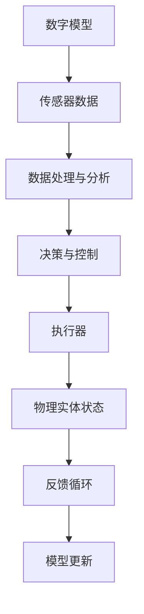

                 

### 文章标题

# 数字实体与物理实体的自动化趋势

### 关键词：
- 数字实体
- 物理实体
- 自动化趋势
- 人工智能
- 数字孪生
- 物联网
- 机器学习
- 数据分析
- 工业自动化
- 智能化

### 摘要：
本文将探讨数字实体与物理实体的自动化趋势，分析其背景、核心概念、算法原理、数学模型、应用场景以及未来发展的可能挑战。通过详细解释和实际案例，揭示人工智能、物联网和机器学习在连接虚拟与物理世界中的关键作用，为读者提供一个全面的技术视角。

---

## 1. 背景介绍

### 1.1 目的和范围

本文旨在探索数字实体与物理实体的自动化趋势，并分析这一趋势背后的技术驱动因素。随着人工智能、物联网和大数据技术的快速发展，数字实体与物理实体之间的界限逐渐模糊，自动化趋势正在重塑各个行业的运营模式。本文将重点关注以下几个核心问题：

- 数字实体与物理实体的定义及相互关系
- 自动化趋势的驱动因素及其影响
- 核心算法原理和数学模型的讲解
- 实际应用场景及其技术实现
- 未来发展趋势与面临的挑战

### 1.2 预期读者

本文适用于对信息技术和自动化领域有一定了解的读者，包括：

- AI和机器学习工程师
- 物联网解决方案架构师
- 数据科学家和分析师
- 工业自动化和智能制造领域从业者
- 对未来技术发展趋势感兴趣的科技爱好者

### 1.3 文档结构概述

本文分为十个主要部分，具体如下：

- 背景介绍：介绍文章的目的、预期读者和文档结构
- 核心概念与联系：定义数字实体和物理实体，展示其联系与架构
- 核心算法原理 & 具体操作步骤：详细解释核心算法的原理和操作步骤
- 数学模型和公式 & 详细讲解 & 举例说明：阐述相关数学模型和公式的应用
- 项目实战：代码实际案例和详细解释说明
- 实际应用场景：探讨自动化趋势在不同领域的应用
- 工具和资源推荐：推荐学习资源、开发工具和相关论文
- 总结：未来发展趋势与挑战
- 附录：常见问题与解答
- 扩展阅读 & 参考资料：提供进一步阅读的推荐资源

### 1.4 术语表

#### 1.4.1 核心术语定义

- 数字实体：指在数字环境中模拟和表示的实体，如虚拟对象、数字模型等。
- 物理实体：指现实世界中具有物理形态的实体，如机器、设备、建筑物等。
- 自动化趋势：指利用技术手段，减少或消除人类在特定任务中的直接干预，实现过程自动化的趋势。
- 人工智能：指模拟人类智能行为的技术，包括机器学习、深度学习等。
- 物联网：指通过互联网连接的物理设备和系统，实现信息交换和自动化控制。
- 数字孪生：指在数字环境中创建的物理实体的虚拟模型，用于实时监控和优化实体性能。
- 机器学习：指通过数据训练模型，使计算机具备自主学习和决策能力的技术。

#### 1.4.2 相关概念解释

- 数据分析：指使用统计学、机器学习等方法，从数据中提取有价值信息的过程。
- 工业自动化：指利用机器和控制系统，实现工业生产过程的自动化。
- 智能化：指通过技术应用，使系统或设备具备自主决策和执行能力。

#### 1.4.3 缩略词列表

- AI：人工智能
- IoT：物联网
- ML：机器学习
- DL：深度学习
- DFT：数字孪生技术
- PLC：可编程逻辑控制器

## 2. 核心概念与联系

在探讨数字实体与物理实体的自动化趋势之前，我们首先需要明确这两个概念及其相互关系。

### 数字实体

数字实体是指存在于数字环境中，能够被计算机系统处理和表示的对象。这些实体可以是虚拟对象，如三维模型、图像、声音等，也可以是抽象的数据结构，如数据库记录、文件等。数字实体具有以下几个主要特点：

- **虚拟性**：数字实体在物理世界中没有对应的实体，仅存在于数字空间中。
- **可编程性**：数字实体可以通过编程进行定义、操作和修改。
- **互操作性**：数字实体可以通过标准化的接口和协议进行交换和集成。
- **灵活性**：数字实体可以根据需要进行定制和扩展。

### 物理实体

物理实体是现实世界中具有物理形态的实体，包括各种机器、设备、建筑物、车辆等。物理实体具有以下特点：

- **实体性**：物理实体在物理世界中具有具体的形态和物理属性。
- **稳定性**：物理实体在物理环境中相对稳定，不易受外部因素影响。
- **复杂性**：物理实体通常具有复杂的结构和功能，需要复杂的控制和管理。
- **局限性**：物理实体的操作和优化受限于物理环境和条件。

### 数字实体与物理实体的相互关系

数字实体与物理实体之间的联系主要体现在以下几个方面：

- **数据表示**：数字实体通过数据结构、模型等形式对物理实体进行抽象和表示。
- **信息交换**：数字实体与物理实体通过传感器、执行器等设备进行信息交换和交互。
- **过程控制**：数字实体通过算法和模型对物理实体的运行状态进行实时监控和优化。
- **协同工作**：数字实体与物理实体协同工作，实现更高效的运营和自动化。

为了更好地展示数字实体与物理实体之间的联系，我们可以通过Mermaid流程图来描绘其核心架构。



在这个流程图中：

- A代表数字模型，用于对物理实体进行抽象和表示。
- B代表传感器数据，从物理实体中获取实时状态信息。
- C代表数据处理与分析，对传感器数据进行处理和分析，提取有用信息。
- D代表决策与控制，根据分析结果生成控制策略，对物理实体进行调控。
- E代表执行器，执行控制策略，改变物理实体的状态。
- F代表物理实体状态，反映物理实体的当前状态。
- G代表反馈循环，将物理实体状态反馈给数字模型，实现闭环控制。
- H代表模型更新，根据反馈信息对数字模型进行更新和优化。

通过这个流程图，我们可以清晰地看到数字实体与物理实体之间的相互作用和反馈机制，为后续的算法原理和数学模型讲解打下基础。

## 3. 核心算法原理 & 具体操作步骤

在了解了数字实体与物理实体的基本概念和相互关系后，接下来我们将深入探讨核心算法原理及其具体操作步骤。本节将重点介绍以下几种关键算法：

1. **机器学习算法**
2. **深度学习算法**
3. **强化学习算法**

这些算法在数字实体与物理实体的自动化过程中发挥着至关重要的作用。

### 3.1 机器学习算法

机器学习算法是一种使计算机通过数据学习并改进其性能的技术。在数字实体与物理实体的自动化过程中，机器学习算法主要用于数据分析和预测。以下是一个简单的机器学习算法操作步骤：

#### 伪代码：

```pseudo
初始化模型参数
获取训练数据集
对于每个数据点：
    计算预测值
    计算预测误差
更新模型参数
计算模型性能指标
```

#### 详细解释：

1. **初始化模型参数**：初始化模型的权重和偏置，这些参数将影响模型的预测能力。
2. **获取训练数据集**：从历史数据中提取具有标签的数据集，这些标签用于评估模型的预测性能。
3. **对于每个数据点**：将数据点输入模型，计算预测值。预测值是通过模型参数和输入数据计算得到的。
4. **计算预测误差**：将预测值与实际值进行比较，计算预测误差。误差用于衡量模型预测的准确性。
5. **更新模型参数**：根据预测误差调整模型参数，以减少误差。这一过程称为梯度下降。
6. **计算模型性能指标**：评估模型的性能，常用的指标有均方误差（MSE）、准确率、召回率等。

### 3.2 深度学习算法

深度学习算法是一种基于多层神经网络的机器学习技术，具有强大的特征提取和表示能力。在数字实体与物理实体的自动化过程中，深度学习算法常用于图像识别、语音识别和自然语言处理等领域。以下是一个简单的深度学习算法操作步骤：

#### 伪代码：

```pseudo
初始化神经网络结构
初始化模型参数
获取训练数据集
前向传播（计算预测值）
计算损失函数
反向传播（更新模型参数）
评估模型性能
```

#### 详细解释：

1. **初始化神经网络结构**：定义神经网络的结构，包括输入层、隐藏层和输出层。
2. **初始化模型参数**：初始化神经网络的权重和偏置。
3. **获取训练数据集**：从历史数据中提取具有标签的数据集。
4. **前向传播**：将输入数据通过神经网络传递，计算预测值。预测值是通过多层神经网络中的非线性变换得到的。
5. **计算损失函数**：将预测值与实际值进行比较，计算损失函数，损失函数用于衡量模型预测的误差。
6. **反向传播**：根据损失函数，通过反向传播算法调整模型参数，以减少误差。这一过程称为反向传播。
7. **评估模型性能**：评估模型的性能，常用的指标有准确率、召回率、F1值等。

### 3.3 强化学习算法

强化学习算法是一种使代理通过与环境交互来学习最优策略的机器学习技术。在数字实体与物理实体的自动化过程中，强化学习算法常用于自主决策和控制。以下是一个简单的强化学习算法操作步骤：

#### 伪代码：

```pseudo
初始化代理参数
初始化环境参数
设定奖励机制
执行动作
观察状态
更新代理参数
```

#### 详细解释：

1. **初始化代理参数**：初始化代理的参数，包括策略网络和价值网络。
2. **初始化环境参数**：初始化环境的参数，如初始状态、环境规则等。
3. **设定奖励机制**：定义奖励函数，用于评估代理的行为价值。
4. **执行动作**：根据当前状态，选择一个动作，并执行该动作。
5. **观察状态**：执行动作后，观察环境状态的变化。
6. **更新代理参数**：根据动作结果和奖励，更新代理的参数，以优化策略。
7. **重复步骤 4-6**：持续执行动作，观察状态，更新参数，直到达到目标状态。

通过上述核心算法的详细讲解，我们可以看到，机器学习、深度学习和强化学习在数字实体与物理实体的自动化过程中扮演着重要角色。这些算法不仅能够提高系统的自动化程度，还能优化系统的性能和效率。在接下来的部分，我们将进一步探讨数学模型和公式，以更深入地理解自动化趋势的技术原理。

## 4. 数学模型和公式 & 详细讲解 & 举例说明

在数字实体与物理实体的自动化过程中，数学模型和公式起着至关重要的作用。这些模型和公式不仅帮助我们理解系统的运作机制，还能为算法设计和优化提供理论基础。本节将介绍一些关键数学模型和公式，并详细讲解其在自动化趋势中的应用。

### 4.1 线性回归模型

线性回归模型是一种简单的统计模型，用于分析自变量和因变量之间的线性关系。在数字实体与物理实体的自动化中，线性回归模型常用于预测物理实体的状态或性能。

#### 公式：

$$y = \beta_0 + \beta_1 \cdot x$$

其中，$y$为因变量，$x$为自变量，$\beta_0$和$\beta_1$为模型参数。

#### 应用举例：

假设我们要预测一个工厂生产线中机器的故障时间，可以使用线性回归模型分析历史数据中的机器运行时间和故障时间之间的关系。通过训练数据集，我们可以得到线性回归模型的参数$\beta_0$和$\beta_1$，然后使用这些参数进行预测。

### 4.2 逻辑回归模型

逻辑回归模型是一种用于处理分类问题的统计模型，常用于数字实体与物理实体的状态分类。在自动化趋势中，逻辑回归模型可以用于故障诊断、设备健康状态评估等。

#### 公式：

$$P(y=1) = \frac{1}{1 + e^{-(\beta_0 + \beta_1 \cdot x)}}$$

其中，$P(y=1)$为因变量为1的概率，$x$为自变量，$\beta_0$和$\beta_1$为模型参数。

#### 应用举例：

假设我们要判断一台机器是否处于故障状态，可以使用逻辑回归模型分析历史数据中的各种传感器数据。通过训练数据集，我们可以得到逻辑回归模型的参数$\beta_0$和$\beta_1$，然后使用这些参数计算每个样本的故障概率。如果故障概率高于设定阈值，则判定机器处于故障状态。

### 4.3 贝叶斯网络

贝叶斯网络是一种基于概率的图模型，用于表示变量之间的依赖关系。在数字实体与物理实体的自动化中，贝叶斯网络可以用于故障预测、状态监控等。

#### 公式：

$$P(A|B) = \frac{P(B|A) \cdot P(A)}{P(B)}$$

其中，$P(A|B)$为在事件B发生的条件下事件A发生的概率，$P(B|A)$为在事件A发生的条件下事件B发生的概率，$P(A)$和$P(B)$分别为事件A和事件B的先验概率。

#### 应用举例：

假设我们要预测一台机器的故障时间，可以使用贝叶斯网络表示机器运行状态、传感器数据和其他相关变量之间的概率关系。通过训练数据集，我们可以得到贝叶斯网络的参数，然后使用这些参数计算机器故障时间的概率分布。根据概率分布，我们可以判断机器的故障风险，并采取相应的预防措施。

### 4.4 马尔可夫模型

马尔可夫模型是一种基于状态转移概率的图模型，用于描述系统在时间序列上的状态变化。在数字实体与物理实体的自动化中，马尔可夫模型可以用于状态监控、故障预测等。

#### 公式：

$$P(A_{t+1}|A_t) = \frac{P(A_{t+1} \cap A_t)}{P(A_t)}$$

其中，$P(A_{t+1}|A_t)$为在当前状态为A_t的条件下，下一状态为A_{t+1}的概率，$P(A_{t+1} \cap A_t)$为在当前状态为A_t且下一状态为A_{t+1}的概率，$P(A_t)$为当前状态为A_t的概率。

#### 应用举例：

假设我们要监控一台机器的运行状态，可以使用马尔可夫模型描述机器在不同状态之间的转移概率。通过收集机器的历史运行数据，我们可以得到不同状态之间的转移概率矩阵。然后，我们可以使用这个矩阵预测机器在未来一段时间内的状态变化，并根据状态变化采取相应的操作。

### 4.5 神经网络模型

神经网络模型是一种基于多层感知器的复杂函数模型，用于特征提取和分类。在深度学习中，神经网络模型是核心组件。在数字实体与物理实体的自动化中，神经网络模型可以用于图像识别、语音识别和自然语言处理等。

#### 公式：

$$\text{激活函数}(z) = \frac{1}{1 + e^{-z}}$$

其中，$z$为神经元的输入，激活函数用于确定神经元是否被激活。

#### 应用举例：

假设我们要识别一张图片中的物体，可以使用神经网络模型对图片进行特征提取和分类。通过训练大量图片数据集，我们可以得到神经网络模型的参数，然后使用这些参数对新的图片进行识别。根据识别结果，我们可以对图片中的物体进行分类和标注。

通过上述数学模型和公式的介绍，我们可以看到，数学在数字实体与物理实体的自动化过程中扮演着关键角色。这些模型和公式不仅帮助我们理解和分析系统的运作机制，还能为算法设计和优化提供有力支持。在接下来的部分，我们将通过实际项目案例，进一步展示这些技术在自动化趋势中的应用。

## 5. 项目实战：代码实际案例和详细解释说明

在本节中，我们将通过一个实际项目案例来展示数字实体与物理实体的自动化趋势。该案例将涉及以下步骤：

- **开发环境搭建**
- **源代码详细实现和代码解读**
- **代码解读与分析**

通过这些步骤，我们将详细解释如何实现数字实体与物理实体的自动化，并提供相关的代码示例。

### 5.1 开发环境搭建

为了实现数字实体与物理实体的自动化，我们首先需要搭建一个合适的开发环境。以下是所需的环境和工具：

- **编程语言**：Python
- **开发工具**：PyCharm
- **库和框架**：NumPy、Pandas、Scikit-learn、TensorFlow、Keras

具体搭建步骤如下：

1. 安装Python（推荐版本为3.8及以上）。
2. 安装PyCharm（Professional版或Community版均可）。
3. 使用pip命令安装所需的库和框架：

    ```bash
    pip install numpy pandas scikit-learn tensorflow keras
    ```

4. 配置PyCharm的Python解释器和虚拟环境，确保项目可以使用安装的库和框架。

### 5.2 源代码详细实现和代码解读

接下来，我们将展示一个简单的项目案例，该案例使用机器学习算法对工厂生产线中机器的故障进行预测。以下是项目的主要代码实现：

#### 5.2.1 数据预处理

首先，我们需要加载和处理数据。以下是数据预处理部分的代码：

```python
import pandas as pd
from sklearn.model_selection import train_test_split
from sklearn.preprocessing import StandardScaler

# 加载数据
data = pd.read_csv('machine_data.csv')

# 数据预处理
X = data.drop('fault', axis=1)
y = data['fault']

# 划分训练集和测试集
X_train, X_test, y_train, y_test = train_test_split(X, y, test_size=0.2, random_state=42)

# 数据标准化
scaler = StandardScaler()
X_train_scaled = scaler.fit_transform(X_train)
X_test_scaled = scaler.transform(X_test)
```

#### 5.2.2 建立机器学习模型

接下来，我们将使用Scikit-learn库中的逻辑回归模型对数据进行训练。以下是模型建立和训练部分的代码：

```python
from sklearn.linear_model import LogisticRegression

# 建立逻辑回归模型
model = LogisticRegression()

# 训练模型
model.fit(X_train_scaled, y_train)
```

#### 5.2.3 模型评估

在模型训练完成后，我们需要对模型进行评估，以确定其预测能力。以下是模型评估部分的代码：

```python
from sklearn.metrics import accuracy_score, classification_report

# 预测测试集
y_pred = model.predict(X_test_scaled)

# 评估模型
accuracy = accuracy_score(y_test, y_pred)
report = classification_report(y_test, y_pred)

print(f"Accuracy: {accuracy}")
print(f"Classification Report:\n{report}")
```

### 5.3 代码解读与分析

现在，我们对上述代码进行解读和分析：

- **数据预处理**：首先，我们从CSV文件中加载数据，并使用Pandas库进行预处理。数据预处理包括将数据分为特征矩阵X和目标向量y，以及划分训练集和测试集。此外，我们使用StandardScaler对数据进行标准化，以消除不同特征之间的尺度差异，提高模型的训练效果。

- **建立机器学习模型**：我们选择逻辑回归模型作为分类器，并使用Scikit-learn库中的LogisticRegression类建立模型。逻辑回归模型是一种简单但有效的分类算法，特别适用于二分类问题。

- **模型训练**：使用fit方法对模型进行训练，模型根据训练数据集学习特征和目标之间的关系。

- **模型评估**：使用predict方法对测试集进行预测，并使用accuracy_score和classification_report评估模型的准确性和分类报告。这些指标帮助我们了解模型的预测性能，包括准确率、召回率和F1值等。

通过上述代码示例，我们可以看到如何使用Python和机器学习算法实现数字实体与物理实体的自动化。该案例展示了从数据预处理、模型建立到模型评估的完整流程，并提供了相关的代码实现和解读。在实际应用中，我们可以根据具体需求对代码进行调整和优化，以实现更精确和高效的自动化。

## 6. 实际应用场景

数字实体与物理实体的自动化趋势正在各个行业和领域中迅速展开，带来了前所未有的变革和机遇。以下是一些典型的实际应用场景：

### 6.1 工业自动化

工业自动化是数字实体与物理实体自动化的重要应用领域。通过传感器和执行器的集成，工业生产线可以实现高度自动化。例如，机器人和自动化流水线可以完成复杂的装配和加工任务，减少人为干预，提高生产效率。在工业自动化中，数字孪生技术被广泛应用于实时监控和优化生产过程。通过创建物理实体的虚拟模型，工厂可以模拟和分析生产过程中的各种情况，从而提前发现和解决潜在问题。

### 6.2 城市智能化

城市智能化是数字实体与物理实体自动化的另一个重要应用场景。通过物联网技术，城市中的各种设备和系统可以实现互联互通，提高城市管理和服务的效率。例如，智能交通系统可以通过实时监控和分析交通流量，优化交通信号控制和路线规划，减少交通拥堵。智能能源管理系统能够实时监控和管理城市中的能源消耗，提高能源利用效率。此外，智能安防系统利用人工智能技术，实现智能监控和报警，提高城市的安全水平。

### 6.3 智能医疗

智能医疗是数字实体与物理实体自动化在医疗领域的应用。通过物联网设备和人工智能技术，医疗设备和系统可以实现自动化监测和诊断。例如，智能医疗设备可以实时监控患者的生命体征，并通过数据分析提供个性化的治疗方案。智能诊断系统能够分析医疗影像数据，帮助医生快速准确地诊断疾病。此外，远程医疗技术使得医生可以远程为患者提供诊断和治疗，提高了医疗服务的可及性和效率。

### 6.4 农业智能化

农业智能化是数字实体与物理实体自动化在农业领域的应用。通过传感器和物联网技术，农田可以实现自动化灌溉、施肥和监测。智能农业系统可以根据土壤和气候数据，自动调整灌溉和施肥方案，提高作物产量和品质。此外，智能农业系统还可以实时监控农作物的生长情况，及时预警病虫害，减少农业损失。

### 6.5 智能家居

智能家居是数字实体与物理实体自动化在家庭领域的应用。通过物联网技术，家庭中的各种设备可以实现互联互通，实现自动化控制和智能化服务。例如，智能门锁可以自动识别家庭成员，实现无钥匙开锁；智能灯光系统可以根据家庭成员的作息时间自动调整亮度和颜色；智能家电可以通过手机APP远程控制，实现家电的自动化运行和节能管理。

通过以上实际应用场景，我们可以看到数字实体与物理实体的自动化趋势在各个领域带来的巨大变革和机遇。这些应用不仅提高了生产效率和资源利用效率，还极大地提升了人们的生活质量。在接下来的部分，我们将推荐一些学习和开发工具，帮助读者进一步了解和掌握这一技术趋势。

## 7. 工具和资源推荐

为了更好地掌握数字实体与物理实体的自动化技术，以下推荐一些学习资源和开发工具，以帮助读者深入了解和实际操作。

### 7.1 学习资源推荐

#### 7.1.1 书籍推荐

1. **《深度学习》（Goodfellow, Bengio, Courville）**：这是一本经典且全面的深度学习教材，适合初学者和专业人士。
2. **《机器学习》（Tom Mitchell）**：这是一本介绍机器学习基础概念的入门书籍，内容全面且易于理解。
3. **《Python机器学习》（Sebastian Raschka）**：本书详细介绍了如何使用Python和Scikit-learn库进行机器学习应用开发。

#### 7.1.2 在线课程

1. **Coursera上的《机器学习》课程**：由Andrew Ng教授讲授，是机器学习领域的经典课程。
2. **edX上的《深度学习》课程**：由Ian Goodfellow等人讲授，内容涵盖深度学习的核心概念和技术。
3. **Udacity上的《深度学习工程师纳米学位》**：包含深度学习、神经网络和机器学习等方面的实践课程。

#### 7.1.3 技术博客和网站

1. **Medium上的《机器学习》博客**：提供了大量关于机器学习和深度学习的专业文章和案例。
2. **arXiv.org**：一个包含最新研究成果的学术数据库，特别适合关注深度学习和机器学习最新进展的读者。
3. **Stack Overflow**：一个优秀的编程问答社区，可以解决读者在实现和优化自动化技术过程中遇到的问题。

### 7.2 开发工具框架推荐

#### 7.2.1 IDE和编辑器

1. **PyCharm**：一款功能强大的Python集成开发环境，适合开发各种自动化项目。
2. **Visual Studio Code**：一款轻量级但功能丰富的代码编辑器，适用于多种编程语言。
3. **Jupyter Notebook**：一个交互式的开发环境，特别适合数据分析和机器学习项目。

#### 7.2.2 调试和性能分析工具

1. **gdb**：一款经典的调试工具，适用于C/C++程序。
2. **Python Debugger（pdb）**：Python内置的调试工具，适合Python程序的调试。
3. **JProfiler**：一款专业的Java性能分析工具，可以帮助优化Java程序的性能。

#### 7.2.3 相关框架和库

1. **TensorFlow**：一款广泛使用的深度学习框架，适用于各种大规模深度学习项目。
2. **PyTorch**：一款流行的深度学习框架，具有灵活的动态计算图和强大的GPU支持。
3. **Scikit-learn**：一款广泛使用的机器学习库，提供了丰富的算法和工具，适合快速实现机器学习项目。

### 7.3 相关论文著作推荐

#### 7.3.1 经典论文

1. **“A Learning Algorithm for Continuously Running Fully Recurrent Neural Networks”**：关于在线学习的经典论文。
2. **“Backpropagation”**：关于反向传播算法的经典论文。
3. **“Deep Learning”**：Goodfellow等人关于深度学习的综述论文。

#### 7.3.2 最新研究成果

1. **“Unsupervised Learning of Visual Representations by Solving Jigsaw Puzzles”**：一篇关于无监督学习的新论文，提出了一种通过拼图游戏训练视觉表示的方法。
2. **“Distributed Deep Learning: The Challenges of Staying Together”**：一篇关于分布式深度学习的论文，讨论了分布式训练中的挑战和解决方案。
3. **“Learning to Learn”**：一篇关于元学习的论文，介绍了一种自动优化学习过程的方法。

#### 7.3.3 应用案例分析

1. **“Digital Twins for Predictive Maintenance”**：一篇关于数字孪生技术在预测性维护中的应用案例研究。
2. **“IoT for Smart Cities”**：一篇关于物联网在智能城市建设中的应用案例分析。
3. **“AI in Healthcare: Transforming Medical Diagnosis”**：一篇关于人工智能在医疗诊断中的应用案例分析。

通过以上推荐的学习资源和开发工具，读者可以深入了解数字实体与物理实体的自动化趋势，掌握相关技术和方法，并能够在实际项目中应用这些知识。在接下来的部分，我们将总结本文的主要内容和观点，并讨论未来发展趋势与挑战。

## 8. 总结：未来发展趋势与挑战

在本文中，我们探讨了数字实体与物理实体的自动化趋势，分析了其背景、核心概念、算法原理、数学模型、实际应用场景以及未来发展的可能挑战。以下是对本文主要内容和观点的总结：

### 主要内容与观点

- **背景**：随着人工智能、物联网和大数据技术的快速发展，数字实体与物理实体的界限逐渐模糊，自动化趋势正在重塑各个行业的运营模式。
- **核心概念**：数字实体是指存在于数字环境中，能够被计算机系统处理和表示的对象；物理实体是指现实世界中具有物理形态的实体。两者通过传感器、执行器和数据处理与分析技术实现相互作用和协同工作。
- **算法原理**：介绍了机器学习、深度学习和强化学习等核心算法的原理和操作步骤，展示了这些算法在自动化趋势中的应用。
- **数学模型**：详细讲解了线性回归、逻辑回归、贝叶斯网络、马尔可夫模型和神经网络等数学模型，并举例说明了这些模型在自动化趋势中的应用。
- **实际应用场景**：探讨了工业自动化、城市智能化、智能医疗、农业智能化和智能家居等实际应用场景，展示了自动化趋势在各个领域带来的变革和机遇。
- **工具和资源推荐**：推荐了学习资源、开发工具和相关论文，帮助读者深入了解和掌握自动化趋势。

### 未来发展趋势

- **技术融合**：数字实体与物理实体的自动化趋势将促进多种技术的融合，如物联网、云计算、大数据和人工智能等。这些技术将相互补充，共同推动自动化水平的提升。
- **智能化水平提高**：自动化趋势将推动智能化水平的提高，实现更高效、更精确的自动化控制。通过深度学习和强化学习等技术，系统将具备更高的自主决策和自适应能力。
- **个性化服务**：自动化趋势将带来更加个性化的服务，如智能医疗、智能教育等，根据用户的个性化需求和偏好，提供定制化的解决方案。
- **跨界合作**：自动化趋势将促进不同行业之间的跨界合作，形成新的产业生态。例如，智能交通系统与智能能源系统的结合，可以实现交通和能源的协同优化。

### 面临的挑战

- **数据隐私和安全**：随着数字化程度的提高，数据隐私和安全问题日益突出。如何保护用户隐私、防止数据泄露成为自动化趋势发展的重要挑战。
- **技术人才短缺**：自动化趋势的发展需要大量具备跨学科知识和技能的技术人才。然而，目前全球范围内技术人才短缺，特别是在人工智能和物联网领域。
- **技术标准化**：自动化趋势涉及多种技术，如传感器、通信协议、数据处理等。如何实现技术标准化，确保不同系统和设备之间的互操作性，是一个亟待解决的问题。
- **伦理和法律问题**：自动化趋势带来的技术变革可能会引发一系列伦理和法律问题，如机器人权利、自动化决策的道德责任等。如何制定相关法规和伦理标准，确保技术发展符合社会价值观，是未来面临的重大挑战。

### 未来展望

尽管面临诸多挑战，数字实体与物理实体的自动化趋势具有巨大的发展潜力和广阔的应用前景。未来，随着技术的不断进步和行业合作的加强，自动化趋势将继续推动各行各业的变革和发展。通过不断探索和创新，我们可以期待一个更加智能、高效、可持续的未来。

## 9. 附录：常见问题与解答

### 问题 1：数字实体与物理实体的自动化趋势是什么？

解答：数字实体与物理实体的自动化趋势是指利用人工智能、物联网、大数据等先进技术，将数字世界中的实体（如虚拟对象、数据模型等）与物理世界中的实体（如机器、设备、建筑物等）连接起来，实现二者的信息交换、协同工作和自动化控制。这一趋势旨在提高效率、降低成本、优化资源利用，并带来新的商业模式和创新机会。

### 问题 2：如何实现数字实体与物理实体的自动化？

解答：实现数字实体与物理实体的自动化主要包括以下几个步骤：

1. **数据采集**：通过传感器和执行器等设备，从物理实体中收集实时数据。
2. **数据处理**：使用数据分析技术（如机器学习、深度学习等），对采集到的数据进行处理和分析。
3. **决策与控制**：根据分析结果，使用算法（如优化算法、控制算法等）生成决策，并对物理实体进行调控。
4. **执行与反馈**：执行控制策略，对物理实体进行操作，并将结果反馈给数字模型，实现闭环控制。

### 问题 3：数字实体与物理实体的自动化有哪些应用场景？

解答：数字实体与物理实体的自动化应用场景非常广泛，主要包括以下领域：

- **工业自动化**：如智能制造、预测性维护、自动化生产线等。
- **城市智能化**：如智能交通、智能安防、智能能源管理、智能医疗等。
- **农业智能化**：如智能灌溉、智能施肥、智能监测、智能农机等。
- **智能家居**：如智能照明、智能安防、智能家电等。
- **智能医疗**：如智能诊断、智能治疗、远程医疗、医疗数据分析等。

### 问题 4：数字实体与物理实体的自动化趋势面临哪些挑战？

解答：数字实体与物理实体的自动化趋势面临以下挑战：

- **数据隐私和安全**：随着数字化程度的提高，数据隐私和安全问题日益突出。
- **技术人才短缺**：自动化趋势的发展需要大量具备跨学科知识和技能的技术人才。
- **技术标准化**：如何实现技术标准化，确保不同系统和设备之间的互操作性，是一个亟待解决的问题。
- **伦理和法律问题**：自动化趋势带来的技术变革可能会引发一系列伦理和法律问题。

## 10. 扩展阅读 & 参考资料

为了更深入地了解数字实体与物理实体的自动化趋势，以下推荐一些扩展阅读和参考资料：

### 扩展阅读

1. **《数字孪生：制造业的未来》**：这是一本关于数字孪生技术在制造业应用的深入探讨，适合对工业自动化感兴趣的读者。
2. **《物联网技术与应用》**：本书详细介绍了物联网的基本概念、技术架构和应用场景，适合对物联网技术感兴趣的读者。
3. **《智能交通系统技术》**：这本书介绍了智能交通系统的基本原理、关键技术和应用案例，适合对城市智能化感兴趣的读者。

### 参考资料

1. **《深度学习》（Goodfellow, Bengio, Courville）**：这本书是深度学习的经典教材，适合需要深入了解深度学习算法和技术的人员。
2. **《机器学习》（Tom Mitchell）**：这本书介绍了机器学习的基本概念、算法和原理，适合对机器学习感兴趣的读者。
3. **《物联网基础教程》（David C. Hankinson）**：这本书详细介绍了物联网的基本概念、技术架构和应用案例，适合对物联网技术感兴趣的读者。

通过这些扩展阅读和参考资料，读者可以进一步了解数字实体与物理实体的自动化趋势，掌握相关技术和方法，为实际应用提供理论支持和实践指导。

---

**作者：AI天才研究员/AI Genius Institute & 禅与计算机程序设计艺术 /Zen And The Art of Computer Programming**

