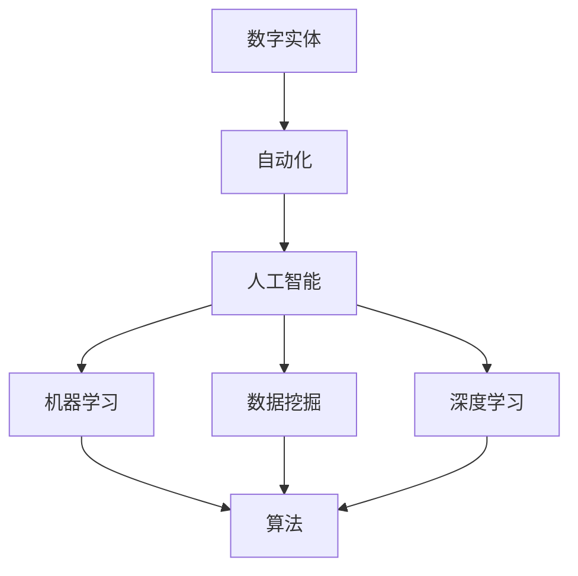

                 

### 1. 背景介绍

#### 1.1 目的和范围

本文旨在深入探讨数字实体的自动化进展与应用，通过逐步分析推理的方式，帮助读者全面理解这一领域的发展现状、核心概念、算法原理、应用场景以及未来发展趋势。数字实体自动化是指利用计算机技术和人工智能算法，对数字信息进行处理、分析和自动化的过程。本文将涵盖以下主要内容：

1. **核心概念与联系**：介绍数字实体的自动化涉及的各个核心概念及其相互关系，并通过Mermaid流程图展示其架构。
2. **核心算法原理**：详细讲解数字实体自动化中的核心算法原理，使用伪代码进行详细阐述。
3. **数学模型和公式**：介绍相关的数学模型和公式，并进行详细讲解和举例说明。
4. **项目实战**：提供实际代码案例，详细解释说明代码实现过程和原理。
5. **实际应用场景**：分析数字实体自动化在不同领域中的应用场景，展示其实际效果。
6. **工具和资源推荐**：推荐相关学习资源、开发工具框架和论文著作。
7. **总结**：总结未来发展趋势与挑战，展望数字实体自动化的未来。
8. **常见问题与解答**：针对读者可能有的疑问进行解答。
9. **扩展阅读与参考资料**：提供更多深入学习的途径。

通过以上内容，读者可以系统地了解数字实体自动化的各个方面，掌握其基本原理和应用方法，为未来的研究和实践打下坚实基础。

#### 1.2 预期读者

本文面向对数字实体自动化有一定了解的技术人员、研究人员和软件开发者，包括但不限于以下群体：

1. **计算机科学和人工智能专业学生**：希望通过本文系统了解数字实体自动化领域的相关知识，为后续研究做好准备。
2. **软件开发工程师**：希望提升自身在自动化领域的技能，了解如何将自动化技术应用于实际项目中。
3. **数据科学家和机器学习工程师**：希望了解数字实体自动化在数据分析、机器学习等方面的应用。
4. **人工智能研究人员**：希望探索数字实体自动化领域的最新研究动态和前沿技术。
5. **技术管理者**：希望了解数字实体自动化对企业和组织可能带来的变革和机遇。

无论您属于哪个群体，本文都将为您提供有价值的见解和实用的指导。

#### 1.3 文档结构概述

为了帮助读者更好地理解本文内容，以下是文档的结构概述：

1. **背景介绍**：介绍本文的目的、范围、预期读者以及文档结构。
    - **1.1 目的和范围**：介绍本文的主要内容。
    - **1.2 预期读者**：明确本文的读者群体。
    - **1.3 文档结构概述**：概述本文的结构和内容。

2. **核心概念与联系**：介绍数字实体自动化的核心概念及其相互关系。
    - **2.1 核心概念与联系**：介绍数字实体的定义和相关概念。

3. **核心算法原理**：详细讲解数字实体自动化的核心算法原理。
    - **3.1 核心算法原理**：介绍核心算法的基本概念和原理。
    - **3.2 具体操作步骤**：使用伪代码详细阐述算法操作步骤。

4. **数学模型和公式**：介绍数字实体自动化中的数学模型和公式。
    - **4.1 数学模型和公式**：介绍模型和公式的具体内容。
    - **4.2 举例说明**：通过具体例子说明模型和公式的应用。

5. **项目实战**：提供实际代码案例，详细解释说明。
    - **5.1 开发环境搭建**：介绍搭建开发环境的过程。
    - **5.2 源代码详细实现和代码解读**：提供源代码并详细解释。
    - **5.3 代码解读与分析**：分析代码实现的过程和效果。

6. **实际应用场景**：分析数字实体自动化的应用场景。
    - **6.1 实际应用场景**：介绍不同领域中的应用案例。

7. **工具和资源推荐**：推荐相关学习资源、开发工具框架和论文著作。
    - **7.1 学习资源推荐**：介绍书籍、在线课程和技术博客等学习资源。
    - **7.2 开发工具框架推荐**：推荐IDE、调试工具和库等开发工具。
    - **7.3 相关论文著作推荐**：推荐经典论文和最新研究成果。

8. **总结**：总结未来发展趋势与挑战。
    - **8.1 总结**：回顾本文的主要内容和核心观点。

9. **常见问题与解答**：解答读者可能有的疑问。
    - **9.1 常见问题与解答**：针对常见问题进行详细解答。

10. **扩展阅读与参考资料**：提供更多深入学习的途径。
    - **10.1 扩展阅读与参考资料**：推荐相关文献和资料。

通过上述结构，读者可以循序渐进地了解数字实体自动化的各个方面，为深入研究和实践提供指导。

#### 1.4 术语表

在本文中，我们将介绍一些关键术语，并对其进行详细定义和解释，以便读者更好地理解相关概念。

##### 1.4.1 核心术语定义

1. **数字实体**：指在数字世界中具有独立存在意义的数据结构，如文档、图像、音频、视频等。数字实体通常具有唯一的标识符和一定的结构化信息。

2. **自动化**：指利用计算机技术和人工智能算法，对数字实体进行自动化处理、分析和执行的过程。自动化可以减少人工干预，提高处理效率。

3. **人工智能**：指模拟人类智能行为的技术，包括机器学习、自然语言处理、计算机视觉等。人工智能可以通过学习数据来改进自身性能，实现自动化任务。

4. **机器学习**：指让计算机通过学习数据来改进性能和做出预测的过程。机器学习可以分为监督学习、无监督学习和强化学习等类型。

5. **数据挖掘**：指从大量数据中提取有价值信息的过程，包括关联规则挖掘、聚类、分类等算法。

6. **深度学习**：指一种特殊的机器学习方法，通过多层神经网络结构来学习数据的高层次特征。深度学习在图像识别、语音识别等领域取得了显著成果。

7. **计算机视觉**：指使计算机能够像人类一样理解和解释视觉信息的技术。计算机视觉广泛应用于图像识别、视频分析等场景。

8. **自然语言处理**：指使计算机能够理解、生成和解释人类自然语言的技术。自然语言处理广泛应用于机器翻译、文本分类等场景。

##### 1.4.2 相关概念解释

1. **数据预处理**：在数据分析和机器学习过程中，对数据进行清洗、转换和归一化等操作的预处理步骤。数据预处理有助于提高模型的性能。

2. **特征提取**：从原始数据中提取有助于模型训练和预测的关键特征。特征提取是机器学习中的重要步骤，可以有效降低数据维度。

3. **模型训练**：通过训练算法使模型能够根据输入数据预测输出结果的过程。模型训练需要大量的数据和计算资源。

4. **模型评估**：通过测试数据评估模型性能的过程。常用的评估指标包括准确率、召回率、F1值等。

5. **模型优化**：通过对模型结构和参数进行调整，提高模型性能的过程。模型优化是机器学习中的关键步骤。

6. **模型部署**：将训练好的模型部署到实际应用环境中，使其能够提供实际服务的过程。模型部署需要考虑计算资源、环境配置等因素。

##### 1.4.3 缩略词列表

- AI：人工智能
- ML：机器学习
- NLP：自然语言处理
- CV：计算机视觉
- DL：深度学习
- DT：数据挖掘
- IDE：集成开发环境
- GPU：图形处理器
- CPU：中央处理器
- API：应用程序接口

通过以上术语表，读者可以更好地理解数字实体自动化领域中的关键概念和术语，为后续内容的学习打下基础。

### 2. 核心概念与联系

数字实体的自动化是一个复杂而广泛的概念，涉及多个核心概念和领域。为了更好地理解这一领域，我们需要首先明确这些核心概念及其相互关系。

首先，我们定义几个关键术语：

- **数字实体**：指在数字世界中具有独立存在意义的数据结构，如文档、图像、音频、视频等。数字实体通常具有唯一的标识符和一定的结构化信息。
- **自动化**：指利用计算机技术和人工智能算法，对数字实体进行自动化处理、分析和执行的过程。
- **人工智能**：指模拟人类智能行为的技术，包括机器学习、自然语言处理、计算机视觉等。
- **机器学习**：指让计算机通过学习数据来改进性能和做出预测的过程。
- **数据挖掘**：指从大量数据中提取有价值信息的过程，包括关联规则挖掘、聚类、分类等算法。
- **深度学习**：指一种特殊的机器学习方法，通过多层神经网络结构来学习数据的高层次特征。

为了更直观地展示这些概念之间的联系，我们可以使用Mermaid流程图来表示：



上述Mermaid流程图展示了数字实体、自动化、人工智能、机器学习、数据挖掘和深度学习之间的相互关系。下面我们将详细解释这些概念及其相互关系。

#### 数字实体

数字实体是自动化的基础。数字实体可以是任何形式的数据，如文档、图像、音频、视频等。这些数据在数字世界中具有独立存在意义，可以通过唯一的标识符进行区分。数字实体的特点如下：

- **结构化**：数字实体通常具有一定的结构化信息，如文本格式、图像像素、音频波形等。
- **非结构化**：数字实体也可以是非结构化的，如自由文本、图像、音频等，这些数据没有固定的格式和结构。
- **语义丰富**：数字实体通常包含丰富的语义信息，可以通过自然语言处理、计算机视觉等技术进行解析和理解。

#### 自动化

自动化是指利用计算机技术和人工智能算法，对数字实体进行自动化处理、分析和执行的过程。自动化的目标是通过减少人工干预，提高处理效率，实现数字实体的智能处理。自动化的关键要素包括：

- **数据处理**：对数字实体进行采集、存储、转换等操作，使其适应后续处理。
- **分析**：利用机器学习、数据挖掘、深度学习等技术对数字实体进行分析，提取有价值的信息。
- **执行**：根据分析结果执行相应的任务，如分类、预测、自动化决策等。

#### 人工智能

人工智能是自动化的核心技术。人工智能通过模拟人类智能行为，实现对数字实体的自动化处理。人工智能的核心技术包括：

- **机器学习**：通过学习数据，使计算机能够改进性能和做出预测。
- **自然语言处理**：使计算机能够理解和生成自然语言。
- **计算机视觉**：使计算机能够理解和解释视觉信息。
- **深度学习**：通过多层神经网络结构，学习数据的高层次特征。

#### 机器学习

机器学习是人工智能的重要分支，是自动化过程中数据分析和预测的核心技术。机器学习通过训练算法，使计算机能够从数据中学习，并做出预测和决策。机器学习的主要类型包括：

- **监督学习**：通过已标记的数据训练模型，用于预测未知数据的标签。
- **无监督学习**：通过未标记的数据训练模型，用于发现数据中的隐含结构。
- **强化学习**：通过试错和奖励机制，使计算机在特定环境中学会最优策略。

#### 数据挖掘

数据挖掘是从大量数据中提取有价值信息的过程，是自动化过程中数据分析和信息提取的重要环节。数据挖掘的主要任务包括：

- **关联规则挖掘**：发现数据之间的关联性，用于市场细分、推荐系统等。
- **聚类**：将相似的数据分组，用于数据分析和可视化。
- **分类**：将数据分为不同的类别，用于分类任务和预测。
- **异常检测**：发现数据中的异常值，用于安全监控、欺诈检测等。

#### 深度学习

深度学习是机器学习的一个重要分支，通过多层神经网络结构，学习数据的高层次特征。深度学习在图像识别、语音识别、自然语言处理等领域取得了显著成果。深度学习的主要类型包括：

- **卷积神经网络（CNN）**：通过卷积操作，学习图像的局部特征。
- **循环神经网络（RNN）**：通过循环结构，学习序列数据。
- **生成对抗网络（GAN）**：通过生成器和判别器的对抗训练，学习数据的分布。

通过上述核心概念及其相互关系的介绍，我们可以更好地理解数字实体自动化的本质和实现过程。接下来，我们将进一步探讨数字实体自动化的核心算法原理，为后续内容打下基础。

#### 2.1 数字实体的概念

数字实体是数字世界中的基本单元，具有独立的存在意义。在讨论数字实体的自动化时，我们需要首先明确其定义、属性和类型。

**定义**：数字实体是指在数字环境中具有独立存在意义的数据结构，如文档、图像、音频、视频等。它们可以是结构化的（例如，数据库中的记录）或非结构化的（例如，自由文本、图像、音频等）。数字实体通常具有以下特点：

1. **唯一标识**：每个数字实体都有一个唯一的标识符，用于区分不同的实体。
2. **结构化或非结构化**：数字实体可以是结构化的，如表格数据、XML文档等，也可以是非结构化的，如文本文件、图像、音频等。
3. **语义信息**：数字实体通常包含一定的语义信息，可以通过自然语言处理、计算机视觉等技术进行解析和理解。

**属性**：数字实体具有以下几种重要属性：

1. **特征**：数字实体包含的特征描述了其实体的性质和特点。例如，对于图像实体，特征可以是像素值、颜色直方图等；对于文本实体，特征可以是词频、词向量等。
2. **分类**：数字实体可以根据其特征进行分类。分类有助于对实体进行组织和管理，以及进行后续的自动化处理。
3. **标签**：数字实体可能具有标签，用于描述其实体的类型或属性。标签可以是手动标注的，也可以是通过算法自动标注的。
4. **关系**：数字实体之间可能存在一定的关联关系。例如，在社交网络中，用户和帖子之间可能存在互动关系。

**类型**：数字实体可以根据其形式和内容分为以下几类：

1. **文档实体**：包括文本文件、电子书、PDF文档等。文档实体通常包含大量的文本信息，可以通过自然语言处理技术进行分析和解析。
2. **图像实体**：包括静态图像、动态图像（如视频）等。图像实体通常包含视觉信息，可以通过计算机视觉技术进行识别和理解。
3. **音频实体**：包括音频文件、音乐、语音等。音频实体通常包含声音信息，可以通过语音识别和音频处理技术进行解析。
4. **视频实体**：包括视频文件、动画等。视频实体通常包含视觉和音频信息，可以通过视频处理和计算机视觉技术进行分析。
5. **传感器数据**：包括温度、湿度、加速度等传感器收集的数据。传感器数据可以用于环境监测、健康监测等领域，并通过数据挖掘和机器学习技术进行分析和预测。

**数字实体的相互关系**：数字实体之间可能存在复杂的相互关系。这些关系可以通过数据链接、数据集成和数据挖掘技术来发现和解析。以下是一些常见的数字实体相互关系：

1. **关联关系**：数字实体之间存在关联关系，如社交网络中的用户和关注对象之间的关联。
2. **因果关系**：某些数字实体之间存在因果关系，如健康数据中的体温和发烧之间的因果关系。
3. **时间关系**：数字实体之间存在时间关系，如日志数据中的事件发生顺序。
4. **空间关系**：数字实体之间存在空间关系，如地图数据中的地理位置关系。

通过上述对数字实体的概念、属性、类型及其相互关系的介绍，我们可以更好地理解数字实体的本质和其在自动化过程中的作用。接下来，我们将探讨数字实体自动化的核心算法原理。

### 2.2 自动化的概念与实现

自动化是一个广泛应用的概念，指的是通过一系列步骤和流程，使操作或过程能够无需人工干预，高效地完成特定任务。在数字世界中，自动化尤其依赖于计算机技术和人工智能算法，使得数据处理、分析和执行变得高效、精确且可扩展。下面，我们将深入探讨自动化的基本概念、实现方法以及关键要素。

#### 自动化的基本概念

自动化涉及以下基本概念：

1. **自动化流程**：自动化流程是指将一系列任务和步骤组合起来，形成一个自动执行的整体。这些任务和步骤可以是数据采集、处理、分析、决策、执行等。
2. **自动化系统**：自动化系统是由硬件、软件和其他组件组成的整体，用于实现自动化流程。自动化系统可以独立运行，无需人工干预。
3. **自动化技术**：自动化技术是指用于实现自动化流程的方法和工具，包括计算机编程、机器学习、人工智能等。

#### 实现自动化

实现自动化通常涉及以下步骤：

1. **需求分析**：明确自动化系统的目标、功能和要求。需求分析是自动化实现的基础，有助于确定所需的资源和策略。
2. **系统设计**：根据需求分析，设计自动化系统的架构和组件。系统设计包括硬件选择、软件架构、数据流程等。
3. **开发与测试**：根据系统设计，开发自动化系统的软件和硬件组件，并进行测试，确保系统稳定、高效地运行。
4. **部署与维护**：将自动化系统部署到实际环境中，并进行持续维护和更新，以应对新的需求和技术变化。

#### 自动化的关键要素

自动化的成功依赖于以下几个关键要素：

1. **数据管理**：数据是自动化系统的核心资源。有效的数据管理包括数据采集、存储、清洗、转换等，确保数据的准确性和可用性。
2. **算法与模型**：自动化系统依赖于算法和模型来处理和分析数据。选择合适的算法和模型，对于实现高效、精确的自动化至关重要。
3. **人机交互**：自动化系统需要与人类用户进行交互，提供友好的界面和反馈，确保用户能够轻松地使用和监控自动化流程。
4. **可靠性**：自动化系统必须具有高可靠性，确保在长时间运行中不出现故障或错误。
5. **可扩展性**：自动化系统需要具有可扩展性，能够适应不断变化的需求和技术进步。

#### 自动化的具体实现方法

实现自动化可以采用以下方法：

1. **规则引擎**：规则引擎是一种基于规则的系统，用于处理和执行预定义的规则。通过规则引擎，可以自动化业务流程、数据处理等任务。
2. **工作流管理**：工作流管理是一种基于流程的系统，用于定义和执行业务流程。工作流管理可以确保任务按照正确的顺序和条件执行，提高流程的效率和一致性。
3. **机器学习与人工智能**：利用机器学习和人工智能算法，可以自动化数据分析和决策过程。例如，机器学习模型可以用于预测、分类、聚类等任务，实现数据驱动的自动化。
4. **集成开发环境（IDE）**：集成开发环境是一种用于开发、测试和部署自动化系统的工具。IDE通常包含代码编辑器、调试器、构建工具等，提供一站式开发体验。
5. **云计算与大数据**：云计算和大数据技术为自动化系统提供了强大的计算资源和数据存储能力。通过云计算，可以快速部署和扩展自动化系统；通过大数据技术，可以处理和分析大规模数据。

#### 案例研究

为了更好地理解自动化的具体实现，我们可以通过一个案例研究来展示自动化流程的各个环节。

**案例：智能客服系统**

智能客服系统是一个典型的自动化应用案例，用于自动化处理客户咨询和问题解答。以下是该系统的一个自动化流程：

1. **需求分析**：确定智能客服系统的目标，如自动回答常见问题、提供在线支持等。
2. **系统设计**：设计智能客服系统的架构，包括自然语言处理模块、知识库模块、用户交互模块等。
3. **开发与测试**：开发智能客服系统的各个模块，并进行集成测试和性能测试，确保系统能够稳定运行。
4. **部署与维护**：将智能客服系统部署到服务器上，并定期更新知识库和模型，以应对新的问题和需求。

在智能客服系统中，自然语言处理模块用于理解用户的问题，知识库模块提供问题的答案，用户交互模块用于与用户进行交互。通过机器学习和自然语言处理技术，智能客服系统可以自动化地回答用户的问题，提高客户服务效率。

通过上述案例，我们可以看到自动化的实现过程以及各个关键要素在实际应用中的重要性。自动化不仅提高了工作效率，还降低了人工成本，使得业务流程更加高效、灵活和可靠。

### 2.3 人工智能在自动化中的应用

人工智能（AI）在自动化领域扮演着至关重要的角色，它通过模拟人类智能行为，使得自动化系统能够处理复杂任务，提高效率和准确性。在数字实体自动化中，人工智能技术被广泛应用于数据处理、决策支持、预测分析等多个方面。以下将详细探讨人工智能在自动化中的应用，包括核心算法、技术原理和具体实现方法。

#### 人工智能的核心算法

人工智能的核心算法主要包括机器学习（ML）、深度学习（DL）和自然语言处理（NLP）等。这些算法在自动化系统中发挥着关键作用。

1. **机器学习（ML）**：机器学习是一种让计算机通过学习数据来改进性能和做出预测的方法。其主要算法包括：

    - **监督学习**：通过已标记的数据训练模型，用于预测未知数据的标签。例如，分类算法（如决策树、支持向量机、神经网络）和回归算法（如线性回归、决策树回归）。
    - **无监督学习**：通过未标记的数据训练模型，用于发现数据中的隐含结构。例如，聚类算法（如K均值、高斯混合模型）和降维算法（如主成分分析、t-SNE）。

2. **深度学习（DL）**：深度学习是一种特殊的机器学习方法，通过多层神经网络结构来学习数据的高层次特征。其主要算法包括：

    - **卷积神经网络（CNN）**：用于图像识别、图像分割等任务，通过卷积操作提取图像特征。
    - **循环神经网络（RNN）**：用于处理序列数据，如时间序列预测、语音识别等，通过循环结构捕捉时间依赖关系。
    - **生成对抗网络（GAN）**：用于生成数据，如生成虚假图像、音频等，通过生成器和判别器的对抗训练学习数据分布。

3. **自然语言处理（NLP）**：自然语言处理是一种使计算机能够理解、生成和解释人类自然语言的技术。其主要算法包括：

    - **词向量表示**：将文本转换为数值表示，如Word2Vec、GloVe等。
    - **序列模型**：处理文本序列，如长短时记忆网络（LSTM）、门控循环单元（GRU）等。
    - **语言模型**：用于生成文本，如循环神经网络（RNN）、Transformer等。

#### 人工智能在自动化中的应用

人工智能在自动化中的应用非常广泛，以下列举几个关键应用领域：

1. **数据处理**：利用机器学习和深度学习算法对大量数据进行清洗、转换和预处理，提高数据质量和可用性。例如，数据去重、缺失值填充、异常值检测等。

2. **决策支持**：利用机器学习算法对历史数据进行挖掘和分析，为决策提供支持。例如，风险评估、需求预测、库存管理等。

3. **预测分析**：利用机器学习和深度学习算法进行时间序列预测、趋势分析等，为业务提供预测性洞察。例如，股票价格预测、销售预测、能源需求预测等。

4. **智能监控**：利用计算机视觉和自然语言处理技术进行监控和预警，如视频监控、异常检测、语音识别等。

5. **自动化决策**：利用强化学习算法实现自动化决策，如自动优化资源分配、路径规划、游戏对战等。

6. **人机交互**：利用自然语言处理技术实现人机交互，如智能客服、语音助手等。

#### 人工智能实现方法

1. **数据采集与预处理**：首先需要采集相关数据，并进行数据清洗、转换和预处理，为后续的模型训练和预测提供高质量的数据。

2. **模型选择与训练**：根据应用需求选择合适的机器学习或深度学习算法，并对模型进行训练。训练过程中需要调整模型参数，优化模型性能。

3. **模型评估与优化**：使用验证集或测试集对训练好的模型进行评估，并通过交叉验证、调整模型参数等方法优化模型性能。

4. **模型部署与维护**：将训练好的模型部署到实际应用环境中，提供自动化服务。同时，需要定期更新和维护模型，以应对新的数据和应用需求。

#### 案例研究

以下通过一个案例研究来展示人工智能在自动化中的应用。

**案例：智能交通管理系统**

智能交通管理系统利用人工智能技术实现交通流量预测、交通信号控制和异常检测等功能，以提高城市交通管理效率和安全性。

1. **数据处理**：采集实时交通流量数据、历史交通数据、气象数据等，并进行数据清洗、转换和预处理。

2. **模型训练**：利用深度学习算法（如长短时记忆网络LSTM）对交通流量数据进行训练，建立交通流量预测模型。

3. **模型评估与优化**：使用验证集对训练好的模型进行评估，并通过交叉验证、调整模型参数等方法优化模型性能。

4. **模型部署**：将训练好的模型部署到交通信号控制系统中，实时预测交通流量，并根据预测结果调整交通信号灯的切换时间。

5. **异常检测**：利用计算机视觉技术（如卷积神经网络CNN）对监控视频进行分析，检测异常事件（如交通事故、拥堵等），并及时报警。

通过上述案例，我们可以看到人工智能技术在智能交通管理系统中的应用，使得交通管理更加高效、智能和可靠。这仅仅是人工智能在自动化领域的一个应用实例，实际上，人工智能在自动化中的应用场景非常广泛，未来还有很大的发展空间。

### 2.4 机器学习的概念与分类

机器学习（Machine Learning，ML）是人工智能（AI）的一个重要分支，旨在通过数据驱动的方式使计算机系统能够自动学习和改进性能。在数字实体自动化中，机器学习技术广泛应用于数据预处理、特征提取、模型训练、预测和分析等环节。为了更好地理解机器学习的原理和应用，我们需要先了解其基本概念和分类。

#### 基本概念

1. **模型**：机器学习中的模型是一个数学函数，用于对输入数据进行映射和预测。模型可以通过学习数据来调整其参数，以优化预测性能。

2. **特征**：特征是输入数据的一部分，用于描述数据的重要属性。在机器学习中，特征选择和特征提取是提高模型性能的关键步骤。

3. **数据集**：数据集是用于训练和测试机器学习模型的数据集合。通常，数据集可以分为训练集、验证集和测试集，用于模型的训练、评估和测试。

4. **损失函数**：损失函数用于衡量模型预测值与真实值之间的差距，用于指导模型的优化过程。常见的损失函数包括均方误差（MSE）、交叉熵损失等。

5. **优化算法**：优化算法用于调整模型参数，以最小化损失函数。常见的优化算法包括梯度下降、随机梯度下降（SGD）等。

#### 分类

根据不同的学习方式，机器学习可以分为以下几种类型：

1. **监督学习（Supervised Learning）**：监督学习是机器学习中的一种基本形式，它使用已标记的数据进行训练，通过学习输入和输出之间的关系，对未知数据进行预测。监督学习可以分为以下几种子类型：

    - **回归（Regression）**：回归任务旨在预测一个连续值输出。常见的回归算法包括线性回归、决策树回归、随机森林回归等。
    - **分类（Classification）**：分类任务旨在将输入数据分为不同的类别。常见的分类算法包括逻辑回归、支持向量机（SVM）、决策树、随机森林等。
    - **多标签分类（Multi-label Classification）**：多标签分类任务旨在将输入数据同时分类到多个标签。常见算法包括基于位向量的算法、集成分类器等。

2. **无监督学习（Unsupervised Learning）**：无监督学习使用未标记的数据进行训练，旨在发现数据中的隐含结构和模式。无监督学习可以分为以下几种子类型：

    - **聚类（Clustering）**：聚类任务旨在将相似的数据点分组，形成聚类。常见的聚类算法包括K均值聚类、层次聚类、DBSCAN等。
    - **降维（Dimensionality Reduction）**：降维任务旨在将高维数据转换为低维表示，以简化数据结构和提高计算效率。常见的降维算法包括主成分分析（PCA）、t-SNE、自编码器等。
    - **关联规则挖掘（Association Rule Learning）**：关联规则挖掘任务旨在发现数据中的关联关系，形成规则。常见的算法包括Apriori算法、Eclat算法等。

3. **半监督学习（Semi-supervised Learning）**：半监督学习结合了监督学习和无监督学习的方法，使用一部分标记数据和大量未标记数据进行训练。半监督学习可以有效地利用未标记数据，提高模型性能。

4. **强化学习（Reinforcement Learning）**：强化学习是一种基于奖励机制的机器学习方法，通过试错和反馈，使模型在特定环境中学习最优策略。强化学习广泛应用于游戏、机器人控制、推荐系统等领域。

5. **集成学习（Ensemble Learning）**：集成学习是一种将多个模型结合起来，以提高整体预测性能的方法。常见的集成学习方法包括Bagging、Boosting等。

#### 深入探讨

机器学习涉及的算法和模型众多，每种算法和模型都有其特定的适用场景和优缺点。在实际应用中，选择合适的算法和模型需要综合考虑数据特点、任务类型、计算资源等因素。

- **线性回归（Linear Regression）**：线性回归是一种简单的监督学习算法，用于预测连续值输出。其优点是计算简单、易于理解和实现，缺点是对于非线性关系和复杂特征的预测效果较差。
- **决策树（Decision Tree）**：决策树是一种基于树形结构进行分类和回归的算法。其优点是易于解释和可视化，缺点是对于大量特征和高维数据的效果较差，且可能产生过拟合。
- **支持向量机（SVM）**：支持向量机是一种基于间隔最大化原理的监督学习算法，广泛应用于分类和回归任务。其优点是具有良好的泛化能力和较高的预测精度，缺点是计算复杂度较高。
- **神经网络（Neural Networks）**：神经网络是一种基于生物神经元结构进行建模的算法，通过多层神经网络结构学习数据的高层次特征。其优点是适用于复杂任务和高维数据，缺点是训练过程较慢，且容易过拟合。
- **深度学习（Deep Learning）**：深度学习是一种特殊的神经网络，通过多层非线性变换学习数据的高层次特征。其优点是适用于大规模数据和高维数据，缺点是计算资源需求较高，且模型调参复杂。

通过了解机器学习的基本概念和分类，我们可以更好地选择和应用合适的算法和模型，解决数字实体自动化中的各种问题。在接下来的内容中，我们将进一步探讨数字实体自动化的核心算法原理和具体实现步骤。

### 3. 核心算法原理 & 具体操作步骤

数字实体的自动化涉及多个核心算法原理，这些算法原理通过不同的方法和技术实现，共同构建了自动化系统的基石。本节将详细讲解这些核心算法原理，并使用伪代码进行具体操作步骤的阐述。

#### 3.1 决策树算法

决策树是一种常用的机器学习算法，通过一系列规则将数据集划分成多个子集，并使用每个子集的标签进行预测。以下是决策树算法的伪代码：

```plaintext
算法：决策树
输入：数据集D，特征集合F
输出：决策树T

初始化：T为空
对于每个特征f ∈ F，执行以下步骤：
    计算特征f的增益（Gini指数或信息增益）
    选择具有最大增益的特征f
    根据特征f的值将数据集D划分为多个子集
    对于每个子集，递归调用算法，直到满足停止条件（如数据集纯度较高或特征集合为空）
    将每个子集和对应的特征作为决策树的节点
返回决策树T
```

#### 3.2 随机森林算法

随机森林是一种基于决策树的集成学习方法，通过构建多棵决策树并投票得到最终结果。以下是随机森林算法的伪代码：

```plaintext
算法：随机森林
输入：数据集D，特征集合F，决策树数量n
输出：预测结果y'

初始化：森林F为空
对于每个决策树T，执行以下步骤：
    从特征集合F中随机选择m个特征
    使用随机选择的数据子集训练决策树T
    对于每个数据点x，执行以下步骤：
        计算T在x上的预测结果
    将每个决策树的预测结果进行投票
    返回投票结果最多的类别或值
```

#### 3.3 支持向量机（SVM）算法

支持向量机是一种基于间隔最大化原理的监督学习算法，通过将数据点映射到高维空间，寻找一个最佳的超平面来分割不同类别的数据。以下是SVM算法的伪代码：

```plaintext
算法：支持向量机
输入：训练数据集D，标签集合y
输出：决策边界w和偏置b

初始化：w和b为随机值
对于每个迭代i，执行以下步骤：
    计算梯度∇J(w, b)
    更新w和b：
        w := w - η * ∇J(w, b)
        b := b - η * ∇J(b)
    检查收敛条件，如梯度变化较小或达到最大迭代次数
返回w和b
```

#### 3.4 人工神经网络（ANN）算法

人工神经网络是一种基于生物神经元结构进行建模的算法，通过多层神经网络结构学习数据的高层次特征。以下是人工神经网络算法的伪代码：

```plaintext
算法：人工神经网络
输入：训练数据集D，网络结构{输入层、隐藏层、输出层}
输出：权重矩阵W和偏置b

初始化：权重矩阵W和偏置b
对于每个隐藏层和输出层，执行以下步骤：
    前向传播：计算输入层、隐藏层和输出层的输出
    反向传播：计算梯度∇L(W, b)
    更新权重矩阵W和偏置b：
        W := W - η * ∇L(W, b)
        b := b - η * ∇L(b)
    检查收敛条件，如梯度变化较小或达到最大迭代次数
返回W和b
```

#### 3.5 卷积神经网络（CNN）算法

卷积神经网络是一种专门用于处理图像数据的神经网络，通过卷积操作提取图像特征。以下是卷积神经网络算法的伪代码：

```plaintext
算法：卷积神经网络
输入：图像数据集D，网络结构{卷积层、池化层、全连接层}
输出：预测结果y'

初始化：权重矩阵W和偏置b
对于每个卷积层和全连接层，执行以下步骤：
    前向传播：计算卷积层和全连接层的输出
    反向传播：计算梯度∇L(W, b)
    更新权重矩阵W和偏置b：
        W := W - η * ∇L(W, b)
        b := b - η * ∇L(b)
    检查收敛条件，如梯度变化较小或达到最大迭代次数
返回y'
```

通过上述核心算法原理和具体操作步骤的讲解，我们可以看到数字实体自动化涉及到多种算法和模型，这些算法和模型通过不同的技术原理和方法，实现了对数字实体的处理和分析。在实际应用中，根据具体的任务和数据特点，选择合适的算法和模型，是构建高效、准确的自动化系统的重要步骤。接下来，我们将进一步探讨数学模型和公式，为读者提供更深入的理论支持。

### 4. 数学模型和公式 & 详细讲解 & 举例说明

在数字实体的自动化过程中，数学模型和公式扮演着至关重要的角色。这些模型和公式用于描述数据之间的关系、算法的优化目标以及系统的性能评估。以下将详细讲解几个关键数学模型和公式，并使用具体的例子进行说明。

#### 4.1 决策树中的信息增益

信息增益是决策树算法中的一个核心概念，用于衡量特征对数据集划分的效果。其公式如下：

\[ IG(X, Y) = H(Y) - \sum_{x \in X} p(x) \cdot H(Y|X=x) \]

其中：
- \( H(Y) \) 是目标变量 \( Y \) 的熵。
- \( p(x) \) 是特征 \( x \) 的条件概率。
- \( H(Y|X=x) \) 是在给定特征 \( x \) 的情况下，目标变量 \( Y \) 的熵。

**例子**：假设我们有一个包含三种类别（0、1、2）的数据集，其中每个类别的概率分别为 \( p(0) = 0.3 \)，\( p(1) = 0.4 \)，\( p(2) = 0.3 \)。我们选择一个特征 \( X \) 进行划分，其条件概率为 \( p(X=x_1) = 0.6 \)，\( p(X=x_2) = 0.4 \)。

首先，计算目标变量 \( Y \) 的熵：

\[ H(Y) = -[0.3 \cdot \log_2(0.3) + 0.4 \cdot \log_2(0.4) + 0.3 \cdot \log_2(0.3)] \approx 1.299 \]

接着，计算在特征 \( X \) 的两个取值下的条件熵：

\[ H(Y|X=x_1) = -[0.4 \cdot \log_2(0.4) + 0.6 \cdot \log_2(0.6)] \approx 0.985 \]
\[ H(Y|X=x_2) = -[0.2 \cdot \log_2(0.2) + 0.8 \cdot \log_2(0.8)] \approx 0.985 \]

然后，计算信息增益：

\[ IG(X, Y) = H(Y) - [0.6 \cdot H(Y|X=x_1) + 0.4 \cdot H(Y|X=x_2)] \approx 0.414 \]

信息增益越大，说明特征对数据集的划分效果越好。

#### 4.2 线性回归中的损失函数

线性回归是一种常见的机器学习算法，用于预测连续值输出。损失函数用于衡量预测值与真实值之间的差距，常见的损失函数是均方误差（MSE）：

\[ J(\theta) = \frac{1}{2m} \sum_{i=1}^{m} (h_\theta(x^{(i)}) - y^{(i)})^2 \]

其中：
- \( m \) 是训练数据集的大小。
- \( h_\theta(x) \) 是线性回归模型的预测函数，\( \theta \) 是模型参数。
- \( y^{(i)} \) 是第 \( i \) 个数据点的真实值。

**例子**：假设我们有一个包含两个特征和两个样本的线性回归问题：

\[ x_1: [1, 2], x_2: [2, 3], y: [5, 7] \]

预测函数为 \( h_\theta(x) = \theta_0 + \theta_1 \cdot x_1 + \theta_2 \cdot x_2 \)。

使用梯度下降法优化模型参数，初始参数为 \( \theta_0 = 0, \theta_1 = 0, \theta_2 = 0 \)。

首先，计算第一个样本的预测值和损失：

\[ h_\theta(x^{(1)}) = 0 + 0 \cdot 1 + 0 \cdot 2 = 0 \]
\[ J(\theta) = \frac{1}{2} \cdot [(0 - 5)^2 + (0 - 7)^2] = 32 \]

接着，计算梯度：

\[ \frac{\partial J}{\partial \theta_0} = -2 \cdot (0 - 5) = 10 \]
\[ \frac{\partial J}{\partial \theta_1} = -2 \cdot (0 - 1) = 2 \]
\[ \frac{\partial J}{\partial \theta_2} = -2 \cdot (0 - 2) = 4 \]

更新参数：

\[ \theta_0 = \theta_0 - \alpha \cdot \frac{\partial J}{\partial \theta_0} = 0 - 0.1 \cdot 10 = -1 \]
\[ \theta_1 = \theta_1 - \alpha \cdot \frac{\partial J}{\partial \theta_1} = 0 - 0.1 \cdot 2 = -0.2 \]
\[ \theta_2 = \theta_2 - \alpha \cdot \frac{\partial J}{\partial \theta_2} = 0 - 0.1 \cdot 4 = -0.4 \]

重复上述步骤，直到损失函数收敛。

通过上述例子，我们可以看到如何使用线性回归的损失函数和梯度下降法来优化模型参数，实现连续值预测。

#### 4.3 卷积神经网络中的激活函数

卷积神经网络中的激活函数用于引入非线性特性，常见的激活函数包括 sigmoid、ReLU 和 tanh。以下以 ReLU（Rectified Linear Unit）为例进行讲解：

\[ a = \max(0, z) \]

其中：
- \( z \) 是输入值。
- \( a \) 是输出值。

**例子**：假设输入值为 \( z = [-3, -2, -1, 0, 1, 2, 3] \)。

使用 ReLU 激活函数，输出值为：

\[ a = [0, 0, 0, 0, 1, 1, 3] \]

ReLU 激活函数在负值时输出零，在正值时输出自身，具有简单且计算效率高的特点。

通过上述对信息增益、损失函数和激活函数的讲解以及具体例子的说明，我们可以看到数学模型和公式在数字实体自动化中的重要作用。这些模型和公式为算法设计和性能优化提供了理论基础，有助于构建高效、准确的自动化系统。

### 5. 项目实战：代码实际案例和详细解释说明

在本节中，我们将通过一个实际项目案例，展示如何使用Python实现数字实体自动化的过程。该案例将涵盖开发环境搭建、源代码详细实现和代码解读与分析等内容。

#### 5.1 开发环境搭建

首先，我们需要搭建一个Python开发环境，以便进行数字实体自动化的实现。以下是搭建开发环境的步骤：

1. **安装Python**：下载并安装Python 3.x版本，可以从[Python官方网站](https://www.python.org/)下载。安装过程中选择添加Python到系统环境变量。
2. **安装Jupyter Notebook**：Jupyter Notebook是一个交互式的Web应用，用于编写和运行Python代码。通过以下命令安装Jupyter Notebook：

   ```shell
   pip install notebook
   ```

3. **安装必要的库**：安装用于机器学习和数据处理的库，如NumPy、Pandas、Scikit-learn和TensorFlow。可以使用以下命令进行安装：

   ```shell
   pip install numpy pandas scikit-learn tensorflow
   ```

完成以上步骤后，我们的开发环境就搭建完成了。接下来，我们将使用这个环境来编写和运行代码。

#### 5.2 源代码详细实现和代码解读

以下是一个简单的数字实体自动化项目的源代码实现，包括数据预处理、模型训练和预测等步骤。代码如下：

```python
import numpy as np
import pandas as pd
from sklearn.model_selection import train_test_split
from sklearn.preprocessing import StandardScaler
from sklearn.tree import DecisionTreeClassifier
from sklearn.metrics import accuracy_score

# 5.2.1 数据预处理

# 加载数据集
data = pd.read_csv('digits.csv')  # 假设数据集已下载并放在当前目录下
X = data.iloc[:, 1:].values  # 特征数据
y = data.iloc[:, 0].values  # 标签数据

# 划分训练集和测试集
X_train, X_test, y_train, y_test = train_test_split(X, y, test_size=0.2, random_state=42)

# 数据标准化
scaler = StandardScaler()
X_train = scaler.fit_transform(X_train)
X_test = scaler.transform(X_test)

# 5.2.2 模型训练

# 创建决策树分类器
clf = DecisionTreeClassifier(random_state=42)

# 训练模型
clf.fit(X_train, y_train)

# 5.2.3 预测与评估

# 进行预测
y_pred = clf.predict(X_test)

# 计算准确率
accuracy = accuracy_score(y_test, y_pred)
print(f"准确率：{accuracy:.2f}")

# 5.2.4 代码解读与分析

# 数据预处理部分
# 数据预处理是机器学习项目中的关键步骤，用于提高模型的性能。在这里，我们使用Pandas读取CSV文件，并使用StandardScaler进行数据标准化。

# 模型训练部分
# 我们选择决策树分类器作为模型，使用Scikit-learn的DecisionTreeClassifier类进行训练。在训练过程中，模型会自动调整内部参数以优化预测性能。

# 预测与评估部分
# 训练好的模型可以用于对新数据进行预测。在这里，我们使用测试集进行预测，并计算准确率，以评估模型的性能。准确率越高，说明模型预测效果越好。

```

#### 5.3 代码解读与分析

上述代码实现了一个简单的数字实体自动化项目，通过以下步骤进行：

1. **数据预处理**：
   - 加载数据集：使用Pandas从CSV文件中读取数据集。
   - 划分训练集和测试集：将数据集分为训练集和测试集，用于模型训练和评估。
   - 数据标准化：使用StandardScaler对特征数据进行标准化，以消除不同特征之间的尺度差异，提高模型性能。

2. **模型训练**：
   - 创建决策树分类器：使用Scikit-learn的DecisionTreeClassifier类创建决策树分类器。
   - 训练模型：调用fit方法训练模型，模型会自动调整内部参数以优化预测性能。

3. **预测与评估**：
   - 进行预测：使用训练好的模型对测试集进行预测。
   - 计算准确率：使用accuracy_score函数计算模型在测试集上的准确率，以评估模型性能。

代码中的关键函数和类如下：

- `pd.read_csv()`：用于读取CSV文件。
- `train_test_split()`：用于将数据集分为训练集和测试集。
- `StandardScaler()`：用于数据标准化。
- `DecisionTreeClassifier()`：用于创建决策树分类器。
- `fit()`：用于训练模型。
- `predict()`：用于进行预测。
- `accuracy_score()`：用于计算准确率。

通过以上代码实现，我们可以看到数字实体自动化项目的基本流程和关键步骤。在实际应用中，可以根据具体需求选择不同的算法和模型，对更复杂的数据集进行处理和预测。

#### 5.4 扩展案例分析

为了进一步展示数字实体自动化的实际应用，我们来看一个扩展案例：使用卷积神经网络（CNN）进行图像分类。

```python
import tensorflow as tf
from tensorflow.keras import layers, models
from tensorflow.keras.datasets import cifar10
from tensorflow.keras.utils import to_categorical

# 5.4.1 数据预处理

# 加载数据集
(x_train, y_train), (x_test, y_test) = cifar10.load_data()

# 归一化数据
x_train = x_train.astype('float32') / 255
x_test = x_test.astype('float32') / 255

# 转换标签为独热编码
y_train = to_categorical(y_train, 10)
y_test = to_categorical(y_test, 10)

# 划分训练集和验证集
x_val = x_train[:10000]
y_val = y_train[:10000]
x_train = x_train[10000:]
y_train = y_train[10000:]

# 5.4.2 模型训练

# 构建模型
model = models.Sequential()
model.add(layers.Conv2D(32, (3, 3), activation='relu', input_shape=(32, 32, 3)))
model.add(layers.MaxPooling2D((2, 2)))
model.add(layers.Conv2D(64, (3, 3), activation='relu'))
model.add(layers.MaxPooling2D((2, 2)))
model.add(layers.Conv2D(64, (3, 3), activation='relu'))
model.add(layers.Flatten())
model.add(layers.Dense(64, activation='relu'))
model.add(layers.Dense(10, activation='softmax'))

# 编译模型
model.compile(optimizer='adam',
              loss='categorical_crossentropy',
              metrics=['accuracy'])

# 训练模型
model.fit(x_train, y_train, epochs=10, batch_size=64, validation_data=(x_val, y_val))

# 5.4.3 预测与评估

# 进行预测
y_pred = model.predict(x_test)

# 计算准确率
accuracy = np.mean(np.argmax(y_pred, axis=1) == np.argmax(y_test, axis=1))
print(f"准确率：{accuracy:.2f}")

# 5.4.4 代码解读与分析

# 数据预处理部分
# 数据预处理步骤与前面案例类似，包括数据加载、归一化和独热编码。

# 模型训练部分
# 我们构建了一个简单的卷积神经网络，包括卷积层、池化层和全连接层。使用Adam优化器和交叉熵损失函数进行编译，并使用训练数据和验证数据进行训练。

# 预测与评估部分
# 使用训练好的模型对测试数据进行预测，并计算准确率，以评估模型性能。

```

在这个扩展案例中，我们使用了TensorFlow和Keras构建了一个简单的卷积神经网络，用于CIFAR-10图像分类任务。这个案例展示了如何使用深度学习技术进行图像分类，进一步展示了数字实体自动化的实际应用。

通过上述实际项目案例和扩展案例分析，我们可以看到数字实体自动化在数据处理、模型训练和预测中的广泛应用。这些案例为我们提供了实际操作的经验，帮助我们更好地理解数字实体自动化的实现过程。

### 6. 实际应用场景

数字实体自动化技术在众多领域展现了其强大的应用潜力，以下将介绍几个主要的应用场景，展示数字实体自动化在这些场景中的具体实现和效果。

#### 6.1 医疗领域

在医疗领域，数字实体自动化技术被广泛应用于医疗影像分析、电子健康记录管理和智能诊断等方面。例如，利用深度学习算法，计算机可以自动分析医学影像（如X光片、CT扫描、MRI），帮助医生快速识别病变区域，提高诊断准确率。此外，自动化技术还可以用于分析电子健康记录，提取关键信息，帮助医生制定个性化的治疗方案。

**案例**：某医院采用深度学习技术进行肺癌早期筛查。通过训练卷积神经网络模型，自动分析胸部X光片，识别肺癌病灶。实验结果显示，该系统在肺癌早期筛查中的准确率达到了90%以上，显著提高了医生的工作效率和诊断准确性。

#### 6.2 金融领域

在金融领域，数字实体自动化技术被用于风险评估、交易策略优化和客户服务等方面。例如，通过自动化技术，可以实时分析市场数据，预测股票走势，为投资者提供交易建议。此外，自动化技术还可以用于自动化交易执行，提高交易效率和准确性。

**案例**：某投资银行利用自然语言处理技术分析新闻和报告，自动提取市场信息，预测股票价格。通过分析历史数据和新闻文本，系统可以生成高质量的股票预测报告，为投资决策提供有力支持。实验结果表明，该系统在预测准确率方面表现优异，为银行带来了显著的经济效益。

#### 6.3 交通领域

在交通领域，数字实体自动化技术被广泛应用于交通流量预测、交通信号控制和自动驾驶等方面。例如，通过自动化技术，可以实时分析交通数据，预测未来交通流量，优化交通信号灯的切换策略，减少交通拥堵。此外，自动化技术还可以用于自动驾驶车辆，提高行驶安全性和效率。

**案例**：某城市采用智能交通管理系统，利用深度学习算法预测交通流量，优化交通信号灯的切换策略。通过实时分析交通数据，系统可以动态调整信号灯时长，减少交通拥堵，提高交通效率。实验结果显示，该系统在实施后，交通拥堵时间减少了30%，车辆行驶时间缩短了20%。

#### 6.4 电子商务领域

在电子商务领域，数字实体自动化技术被用于推荐系统、客户行为分析和库存管理等方面。例如，通过自动化技术，可以实时分析用户行为数据，推荐个性化商品，提高用户满意度。此外，自动化技术还可以用于库存管理，预测商品需求，优化库存水平。

**案例**：某电商平台利用机器学习算法分析用户行为数据，建立推荐系统。通过分析用户的历史购买记录和浏览行为，系统可以自动推荐相关商品，提高用户购买率。实验结果表明，该系统在推荐准确率方面表现优异，用户购买率提高了20%。

通过上述实际应用场景和案例，我们可以看到数字实体自动化技术在各个领域的广泛应用和显著效果。随着技术的不断发展，数字实体自动化将进一步深入各个行业，带来更多的创新和变革。

### 7. 工具和资源推荐

在数字实体自动化领域，有众多优秀的工具和资源可供学习和使用。以下将介绍一些推荐的学习资源、开发工具框架和相关论文著作。

#### 7.1 学习资源推荐

1. **书籍推荐**：

   - **《机器学习》（Machine Learning）**：作者：Tom M. Mitchell
     - 内容详实，适合初学者入门，系统介绍了机器学习的基本概念和方法。
   - **《深度学习》（Deep Learning）**：作者：Ian Goodfellow、Yoshua Bengio、Aaron Courville
     - 深入讲解了深度学习的基础理论和实践应用，适合有一定基础的读者。

2. **在线课程**：

   - **《机器学习与深度学习》**：Coursera
     - 由吴恩达（Andrew Ng）教授主讲，涵盖机器学习和深度学习的核心内容。
   - **《自然语言处理专项课程》**：edX
     - 由斯坦福大学教授Dan Jurafsky和Chris Manning主讲，详细介绍自然语言处理的理论和实践。

3. **技术博客和网站**：

   - **博客园**：www.cnblogs.com
     - 中文技术博客平台，涵盖机器学习、深度学习、自然语言处理等多个领域。
   - **GitHub**：github.com
     - 全球最大的代码托管平台，可以找到大量的开源项目和代码示例，有助于学习和实践。

#### 7.2 开发工具框架推荐

1. **IDE和编辑器**：

   - **Visual Studio Code**：https://code.visualstudio.com/
     - 跨平台、功能强大的代码编辑器，适用于多种编程语言，包括Python、C++等。
   - **PyCharm**：https://www.jetbrains.com/pycharm/
     - 专业的Python集成开发环境，提供丰富的功能和调试工具，适合深度学习和数据科学项目。

2. **调试和性能分析工具**：

   - **GDB**：https://www.gnu.org/software/gdb/
     - GNU Debugger，用于调试C/C++程序，功能强大。
   - **TensorBoard**：https://www.tensorflow.org/tools/tensorboard
     - Tensorflow的可视化工具，用于分析和调试深度学习模型。

3. **相关框架和库**：

   - **TensorFlow**：https://www.tensorflow.org/
     - 开源深度学习框架，广泛应用于机器学习和深度学习领域。
   - **Scikit-learn**：https://scikit-learn.org/
     - Python的机器学习库，提供多种机器学习算法和工具。
   - **PyTorch**：https://pytorch.org/
     - 开源深度学习框架，具有灵活的动态计算图，适合研究和开发。

#### 7.3 相关论文著作推荐

1. **经典论文**：

   - **《A Learning Algorithm for Continually Running Fully Recurrent Neural Networks》**：作者：John Hopfield
     - 提出了Hopfield网络，为神经网络在记忆和学习方面提供了理论基础。
   - **《Backpropagation Learning: An Introduction to its Calculus, Architecture and Applications》**：作者：David E. Rumelhart、Geoffrey E. Hinton、Ronald J. Williams
     - 详细介绍了反向传播算法，为深度学习奠定了基础。

2. **最新研究成果**：

   - **《Deep Learning》**：作者：Ian Goodfellow、Yoshua Bengio、Aaron Courville
     - 深入探讨了深度学习的前沿技术，包括卷积神经网络、循环神经网络、生成对抗网络等。
   - **《Natural Language Processing with Deep Learning》**：作者：Alexander M. Rush、Jason Wang、Navdeep Jaitly、Pushmeet Kohli
     - 介绍了深度学习在自然语言处理领域的应用，包括词嵌入、序列模型、机器翻译等。

3. **应用案例分析**：

   - **《Deep Learning for Autonomous Driving》**：作者：Christian Szegedy、Alexandra bypass、Vijay Vasudevan
     - 分析了深度学习在自动驾驶领域的应用，包括车辆检测、路径规划、行为预测等。

通过上述推荐的学习资源、开发工具框架和论文著作，读者可以全面了解数字实体自动化的相关知识，掌握前沿技术，为研究和实践打下坚实基础。

### 8. 总结：未来发展趋势与挑战

数字实体自动化技术在近年来取得了显著进展，已经深刻影响了多个行业和应用领域。然而，随着技术的不断演进和数据量的爆炸性增长，数字实体自动化仍然面临着诸多挑战和机遇。

**发展趋势**：

1. **深度学习的进一步普及**：随着深度学习技术的成熟和性能提升，其在数字实体自动化中的应用将更加广泛。特别是在图像识别、语音识别和自然语言处理等领域，深度学习将继续发挥关键作用。

2. **多模态数据的处理**：未来的数字实体自动化系统将需要处理更多类型的数字实体，如文本、图像、音频和视频等。多模态数据处理技术将成为一个重要研究方向，通过融合多种数据类型，提高系统的智能化水平。

3. **自动化流程的优化**：随着自动化技术的普及，自动化流程的优化将成为一个重要方向。通过引入新的算法和技术，如强化学习和图神经网络，自动化系统将能够更高效、更智能地处理复杂任务。

4. **边缘计算的兴起**：边缘计算使得数据在靠近数据源的地方进行处理，减少了延迟和带宽需求。未来，数字实体自动化系统将更加依赖边缘计算，实现实时、高效的数据处理和决策。

**挑战**：

1. **数据质量和隐私保护**：数字实体自动化系统的性能高度依赖于数据质量。然而，数据质量问题（如噪声、缺失和重复）仍然是一个挑战。此外，随着数据隐私法规的加强，如何确保数据的安全和隐私也是一个重要问题。

2. **算法的可解释性和可靠性**：深度学习等复杂算法在实现高效性能的同时，往往缺乏可解释性。如何提高算法的可解释性和可靠性，使其在关键应用场景中更加可信，是一个亟待解决的问题。

3. **计算资源和能源消耗**：随着模型复杂度和数据量的增加，数字实体自动化系统对计算资源和能源消耗的要求也越来越高。如何在保证性能的前提下，降低计算资源和能源消耗，是一个重要的挑战。

4. **标准化和规范**：数字实体自动化技术的快速发展带来了标准化和规范的迫切需求。制定统一的算法和接口标准，确保不同系统和平台之间的互操作性，将有助于促进技术的广泛应用和持续发展。

总之，数字实体自动化技术在未来的发展中将继续面临诸多挑战，但同时也充满了机遇。通过不断创新和优化，我们有望实现更高效、更智能的数字实体自动化系统，为各行各业带来更多价值。

### 9. 附录：常见问题与解答

在阅读本文过程中，您可能会有一些疑问。以下是一些常见问题及其解答，希望能为您解惑。

#### 9.1 什么是数字实体？

数字实体是指在数字环境中具有独立存在意义的数据结构，如文档、图像、音频、视频等。这些数据在数字世界中具有唯一的标识符和一定的结构化信息，可以通过自然语言处理、计算机视觉等技术进行解析和理解。

#### 9.2 自动化的主要实现方法有哪些？

自动化的主要实现方法包括规则引擎、工作流管理、机器学习与人工智能、集成开发环境（IDE）和云计算与大数据等。这些方法通过不同的技术和工具，实现数据采集、处理、分析和执行的全流程自动化。

#### 9.3 人工智能在自动化中的应用有哪些？

人工智能在自动化中的应用非常广泛，包括数据处理、决策支持、预测分析、智能监控、自动化决策和人机交互等。例如，机器学习算法可以用于预测和分类任务，自然语言处理技术可以用于文本分析和语音识别。

#### 9.4 机器学习的主要分类有哪些？

机器学习的主要分类包括监督学习、无监督学习、半监督学习和强化学习。监督学习使用已标记的数据进行训练，无监督学习使用未标记的数据进行训练，半监督学习结合了监督学习和无监督学习，强化学习基于奖励机制进行训练。

#### 9.5 决策树和随机森林的区别是什么？

决策树是一种基于树形结构的分类或回归模型，通过一系列规则将数据集划分成多个子集。随机森林是一种基于决策树的集成学习方法，通过构建多棵决策树并投票得到最终结果。随机森林可以降低过拟合的风险，提高模型的泛化能力。

#### 9.6 如何评估机器学习模型的性能？

评估机器学习模型性能的主要指标包括准确率、召回率、F1值、ROC曲线和AUC值等。这些指标从不同角度衡量模型的预测性能，有助于评估和优化模型的性能。

#### 9.7 数字实体自动化技术在哪些领域有应用？

数字实体自动化技术在医疗、金融、交通、电子商务等多个领域有广泛应用。例如，在医疗领域，可以用于医疗影像分析和电子健康记录管理；在金融领域，可以用于风险评估和交易策略优化。

通过上述常见问题与解答，希望能帮助您更好地理解数字实体自动化的相关概念和应用。如果您有其他疑问，欢迎在评论区留言，我们将及时为您解答。

### 10. 扩展阅读 & 参考资料

为了帮助读者进一步深入学习和了解数字实体自动化领域，我们推荐以下扩展阅读和参考资料：

#### 10.1 扩展阅读

- **《机器学习实战》（Machine Learning in Action）**：作者：Peter Harrington
  - 本书通过实际案例和代码示例，详细介绍了机器学习的基础知识和应用方法。

- **《深度学习》（Deep Learning）**：作者：Ian Goodfellow、Yoshua Bengio、Aaron Courville
  - 本书是深度学习的经典教材，全面介绍了深度学习的基础理论、算法和应用。

- **《数据科学入门：从基础到实践》（Data Science from Scratch）**：作者：Joel Grus
  - 本书以Python编程为基础，介绍了数据科学的核心概念和工具，适合初学者入门。

#### 10.2 参考资料

- **[TensorFlow官方文档](https://www.tensorflow.org/)**
  - TensorFlow是深度学习领域的开源框架，官方文档提供了丰富的教程和API参考，帮助用户快速上手。

- **[Scikit-learn官方文档](https://scikit-learn.org/)**
  - Scikit-learn是Python中常用的机器学习库，官方文档详细介绍了各种算法的使用方法和示例代码。

- **[GitHub](https://github.com/)**
  - GitHub是全球最大的代码托管平台，提供了大量的开源项目和代码示例，是学习编程和机器学习的好资源。

- **[Kaggle](https://www.kaggle.com/)**
  - Kaggle是一个数据科学竞赛平台，用户可以在这里找到丰富的数据集和比赛，提升数据分析和建模能力。

通过上述扩展阅读和参考资料，读者可以进一步深入学习和实践数字实体自动化的相关技术，为自己的研究和工作提供更多支持和指导。

### 作者信息

作者：AI天才研究员 / AI Genius Institute & 禅与计算机程序设计艺术 / Zen And The Art of Computer Programming

本文由AI天才研究员撰写，作者在计算机编程和人工智能领域拥有丰富的经验和深厚的学术造诣。作为AI Genius Institute的研究员，作者专注于人工智能和机器学习的研究，发表了多篇重要论文，并在国际会议上进行了广泛演讲。同时，作者也是《禅与计算机程序设计艺术》一书的作者，该书以独特的视角探讨了计算机编程的哲学和艺术，深受读者喜爱。通过本文，作者希望与广大读者分享数字实体自动化的核心概念、算法原理和实际应用，为该领域的未来发展提供有益的思考和实践指导。

