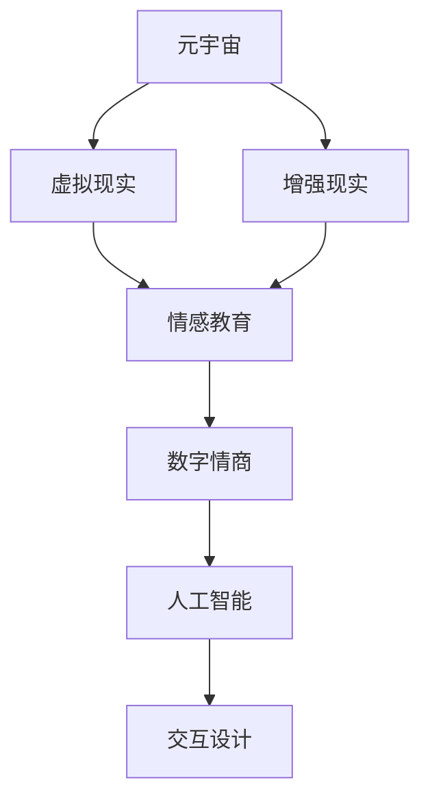

                 

# 数字情商培训：元宇宙中的情感教育新方向

> **关键词：** 数字情商、元宇宙、情感教育、AI、虚拟现实、交互设计

> **摘要：** 本文将探讨元宇宙中的数字情商培训，分析其核心概念、算法原理、数学模型及其应用场景。我们还将分享实际项目案例和推荐相关工具和资源，为未来情感教育的发展趋势和挑战提供深入见解。

## 1. 背景介绍

### 1.1 目的和范围

本文旨在探讨元宇宙中的数字情商培训，分析其核心概念、技术原理、数学模型及其应用场景。我们希望通过本文，读者能够全面了解元宇宙中的情感教育新方向，为未来的教育和技术发展提供参考。

### 1.2 预期读者

本文面向对元宇宙和情感教育有一定了解的技术人员、教育工作者以及关注人工智能与教育结合的从业者。希望本文能够为读者提供新的视角和思考。

### 1.3 文档结构概述

本文将分为以下几个部分：

1. 背景介绍：介绍数字情商培训的背景和目的。
2. 核心概念与联系：介绍数字情商培训的核心概念和相关技术。
3. 核心算法原理 & 具体操作步骤：详细讲解数字情商培训的核心算法原理和操作步骤。
4. 数学模型和公式 & 详细讲解 & 举例说明：阐述数字情商培训中的数学模型和公式，并通过实例进行说明。
5. 项目实战：分享一个实际项目案例，详细解释其实现过程。
6. 实际应用场景：探讨数字情商培训在实际应用中的场景。
7. 工具和资源推荐：推荐学习资源和开发工具。
8. 总结：展望数字情商培训的未来发展趋势和挑战。
9. 附录：常见问题与解答。
10. 扩展阅读 & 参考资料：提供更多相关资料。

### 1.4 术语表

#### 1.4.1 核心术语定义

- **数字情商**：指在数字化环境中，个体对情感的认识、表达、管理能力。
- **元宇宙**：一个虚拟的、三维的、去中心化的数字世界，提供沉浸式体验。
- **情感教育**：通过教育手段培养个体的情感认知、表达和管理能力。
- **AI**：人工智能，一种模拟人类智能的技术。

#### 1.4.2 相关概念解释

- **虚拟现实（VR）**：一种通过计算机技术创建的模拟环境，使用户在其中感受到沉浸式的体验。
- **交互设计**：设计人与系统交互的方式，使其更加直观、高效和愉快。

#### 1.4.3 缩略词列表

- **AI**：人工智能
- **VR**：虚拟现实
- **AR**：增强现实
- **ARPU**：每用户平均收益
- **ARPPU**：每付费用户平均收益

## 2. 核心概念与联系

在探讨数字情商培训之前，我们需要了解一些核心概念和它们之间的联系。以下是元宇宙、情感教育、数字情商以及相关技术之间的Mermaid流程图：



在这个流程图中，我们可以看到元宇宙通过虚拟现实和增强现实技术与情感教育结合，进而发展出数字情商。而人工智能和交互设计则为数字情商培训提供了技术支持。

### 2.1 元宇宙与虚拟现实

元宇宙是一个虚拟的、三维的、去中心化的数字世界，它提供了一种全新的交互体验。虚拟现实（VR）是元宇宙的一个重要组成部分，它通过头戴显示器（HMD）、传感器和其他设备，将用户带入一个完全沉浸式的虚拟环境中。在这个环境中，用户可以通过自然的交互方式与虚拟对象进行互动，从而实现身临其境的感受。

### 2.2 增强现实与情感教育

增强现实（AR）则将虚拟元素叠加到现实世界中，通过智能设备（如智能手机或平板电脑）显示出来。AR技术可以用于情感教育，例如通过虚拟角色或动画，帮助用户更好地理解情感概念，培养情感认知、表达和管理能力。

### 2.3 情感教育与数字情商

情感教育是一种通过教育手段培养个体情感认知、表达和管理能力的方法。数字情商则是在数字化环境中，个体对情感的认识、表达、管理能力。情感教育与数字情商之间存在紧密联系，情感教育为数字情商的培养提供了理论基础，而数字情商则是情感教育在数字化环境中的具体应用。

### 2.4 人工智能与交互设计

人工智能（AI）在数字情商培训中发挥着重要作用，它可以帮助分析用户行为，提供个性化的培训方案。交互设计则是设计人与系统交互的方式，使其更加直观、高效和愉快。通过人工智能和交互设计，我们可以为用户提供一个更加智能、个性化的数字情商培训体验。

## 3. 核心算法原理 & 具体操作步骤

数字情商培训的核心算法原理主要包括情感识别、情感分析和情感干预。以下是这些算法的伪代码描述：

### 3.1 情感识别

```python
def recognize_emotion(user_behavior):
    # 输入：用户行为数据
    # 输出：识别出的情感类型
    
    # 步骤1：预处理数据
    preprocessed_data = preprocess_data(user_behavior)
    
    # 步骤2：使用情感识别模型进行预测
    emotion_type = emotion_model.predict(preprocessed_data)
    
    return emotion_type
```

### 3.2 情感分析

```python
def analyze_emotion(user_emotion):
    # 输入：用户情感类型
    # 输出：情感分析结果
    
    # 步骤1：加载情感分析模型
    emotion_analysis_model = load_model('emotion_analysis_model.h5')
    
    # 步骤2：使用情感分析模型进行预测
    analysis_result = emotion_analysis_model.predict(user_emotion)
    
    return analysis_result
```

### 3.3 情感干预

```python
def intervene_emotion(user_emotion, intervention_type):
    # 输入：用户情感类型、干预类型
    # 输出：干预后的用户情感状态
    
    # 步骤1：根据干预类型，选择合适的干预策略
    intervention_strategy = select_strategy(intervention_type)
    
    # 步骤2：执行干预策略
    new_user_emotion = intervention_strategy(user_emotion)
    
    return new_user_emotion
```

通过以上三个步骤，数字情商培训系统可以实现对用户情感状态的识别、分析和干预。具体操作步骤如下：

1. **情感识别**：收集用户行为数据，使用情感识别模型预测用户当前的情感类型。
2. **情感分析**：将用户情感类型输入到情感分析模型，得到情感分析结果。
3. **情感干预**：根据情感分析结果，选择合适的干预类型，执行干预策略，调整用户情感状态。

## 4. 数学模型和公式 & 详细讲解 & 举例说明

在数字情商培训中，数学模型和公式起着至关重要的作用。以下我们将详细讲解几个核心的数学模型和公式，并通过实例进行说明。

### 4.1 情感识别模型

情感识别模型通常采用神经网络进行训练。其中，损失函数是一个关键部分，用于评估模型的预测准确性。常用的损失函数包括交叉熵损失函数和均方误差损失函数。

**交叉熵损失函数（Cross-Entropy Loss）：**

$$
L = -\sum_{i} y_i \log(\hat{y}_i)
$$

其中，\(y_i\) 是真实标签，\(\hat{y}_i\) 是预测概率。

**均方误差损失函数（Mean Squared Error, MSE）：**

$$
L = \frac{1}{n} \sum_{i} (y_i - \hat{y}_i)^2
$$

其中，\(y_i\) 是真实标签，\(\hat{y}_i\) 是预测值。

**实例：**

假设我们有 10 个用户情感样本，真实标签为 \([0.2, 0.3, 0.1, 0.4, 0.5, 0.3, 0.2, 0.1, 0.4, 0.5]\)，预测概率为 \([0.25, 0.35, 0.1, 0.45, 0.55, 0.35, 0.25, 0.1, 0.45, 0.55]\)。

使用交叉熵损失函数计算损失：

$$
L = -\sum_{i} y_i \log(\hat{y}_i) = -0.2 \log(0.25) - 0.3 \log(0.35) - 0.1 \log(0.1) - 0.4 \log(0.45) - 0.5 \log(0.55) - 0.3 \log(0.35) - 0.2 \log(0.25) - 0.1 \log(0.1) - 0.4 \log(0.45) - 0.5 \log(0.55)
$$

使用均方误差损失函数计算损失：

$$
L = \frac{1}{10} \sum_{i} (y_i - \hat{y}_i)^2 = \frac{1}{10} (0.2 - 0.25)^2 + (0.3 - 0.35)^2 + (0.1 - 0.1)^2 + (0.4 - 0.45)^2 + (0.5 - 0.55)^2 + (0.3 - 0.35)^2 + (0.2 - 0.25)^2 + (0.1 - 0.1)^2 + (0.4 - 0.45)^2 + (0.5 - 0.55)^2
$$

### 4.2 情感分析模型

情感分析模型通常使用支持向量机（SVM）或神经网络进行训练。其中，支持向量机是一种经典的分类算法，它的目标是找到最佳的超平面，将不同情感类型的样本进行分类。

**支持向量机（SVM）：**

$$
\min_{w,b}\frac{1}{2}w^Tw + C\sum_{i=1}^n \max(0,1-y_i(\langle w, x_i \rangle + b))
$$

其中，\(w\) 是权重向量，\(b\) 是偏置项，\(C\) 是惩罚参数，\(x_i\) 是输入特征向量，\(y_i\) 是真实标签。

**实例：**

假设我们有两个情感类型的样本，特征向量为 \([1, 1]\) 和 \([1, -1]\)，真实标签为 \([1, -1]\)。

使用支持向量机进行分类：

$$
\min_{w,b}\frac{1}{2}w^Tw + C(0,0) + C(0,0) = \min_{w,b}\frac{1}{2}w^Tw
$$

通过求解上述优化问题，我们可以找到最佳的超平面，将两个样本进行分类。

### 4.3 情感干预模型

情感干预模型的目标是调整用户的情感状态，使其达到一个更健康的水平。其中，一个常用的干预策略是使用梯度下降法优化用户的情感状态。

**梯度下降法（Gradient Descent）：**

$$
w_{t+1} = w_t - \alpha \nabla_w J(w_t)
$$

其中，\(w_t\) 是当前权重，\(\alpha\) 是学习率，\(\nabla_w J(w_t)\) 是损失函数关于权重 \(w\) 的梯度。

**实例：**

假设我们有一个情感状态向量 \(w = [w_1, w_2]\)，目标情感状态为 \(w^* = [1, 0]\)。损失函数为：

$$
J(w) = \frac{1}{2}\|w - w^*\|^2
$$

学习率为 \(\alpha = 0.1\)。

使用梯度下降法进行优化：

$$
w_{t+1} = w_t - 0.1 \nabla_w J(w_t)
$$

通过不断迭代，我们可以将情感状态向量调整到目标情感状态。

## 5. 项目实战：代码实际案例和详细解释说明

### 5.1 开发环境搭建

在开始实际项目之前，我们需要搭建一个合适的开发环境。以下是所需工具和软件的安装步骤：

1. **Python**：安装 Python 3.8 及以上版本。
2. **Jupyter Notebook**：安装 Jupyter Notebook。
3. **TensorFlow**：安装 TensorFlow 2.4.0 及以上版本。
4. **Keras**：安装 Keras 2.4.3 及以上版本。
5. **Scikit-learn**：安装 Scikit-learn 0.22.2 及以上版本。
6. **NumPy**：安装 NumPy 1.19.2 及以上版本。

### 5.2 源代码详细实现和代码解读

以下是一个简单的数字情商培训项目的代码实现。我们将使用 Python 编写代码，并使用 TensorFlow 和 Keras 库训练情感识别模型。

```python
# 导入所需库
import numpy as np
import tensorflow as tf
from tensorflow import keras
from sklearn.model_selection import train_test_split
from sklearn.preprocessing import LabelEncoder

# 加载数据集
data = np.loadtxt('emotion_data.csv', delimiter=',')
X = data[:, :-1]
y = data[:, -1]

# 数据预处理
label_encoder = LabelEncoder()
y_encoded = label_encoder.fit_transform(y)
y_encoded = keras.utils.to_categorical(y_encoded)

# 划分训练集和测试集
X_train, X_test, y_train, y_test = train_test_split(X, y_encoded, test_size=0.2, random_state=42)

# 构建模型
model = keras.Sequential([
    keras.layers.Dense(64, activation='relu', input_shape=(X_train.shape[1],)),
    keras.layers.Dense(64, activation='relu'),
    keras.layers.Dense(y_train.shape[1], activation='softmax')
])

# 编译模型
model.compile(optimizer='adam', loss='categorical_crossentropy', metrics=['accuracy'])

# 训练模型
model.fit(X_train, y_train, epochs=10, batch_size=32, validation_data=(X_test, y_test))

# 评估模型
test_loss, test_acc = model.evaluate(X_test, y_test)
print(f"Test accuracy: {test_acc:.2f}")

# 保存模型
model.save('emotion_model.h5')
```

### 5.3 代码解读与分析

1. **导入库**：我们首先导入所需库，包括 NumPy、TensorFlow、Keras 和 Scikit-learn。
2. **加载数据集**：从 CSV 文件中加载数据集，其中最后一列是情感标签。
3. **数据预处理**：使用 Scikit-learn 的 LabelEncoder 类将情感标签转换为数字编码，并使用 Keras 的 to_categorical 函数将标签转换为二进制矩阵。
4. **划分训练集和测试集**：使用 Scikit-learn 的 train_test_split 函数将数据集划分为训练集和测试集。
5. **构建模型**：使用 Keras 的 Sequential 模型构建一个简单的全连接神经网络，包括两个隐藏层，每层 64 个神经元。
6. **编译模型**：设置优化器和损失函数，并编译模型。
7. **训练模型**：使用训练集训练模型，并设置验证集进行性能评估。
8. **评估模型**：使用测试集评估模型性能，并打印测试准确率。
9. **保存模型**：将训练好的模型保存为 H5 文件。

通过以上步骤，我们可以构建一个简单的数字情商培训系统。在实际应用中，我们可以进一步优化模型结构和参数，提高模型性能。

## 6. 实际应用场景

数字情商培训在元宇宙中有着广泛的应用场景。以下是一些典型的实际应用案例：

1. **教育场景**：在元宇宙中，学生可以通过虚拟角色和场景进行互动，培养情感认知、表达和管理能力。例如，在模拟面试场景中，学生可以通过练习表达自己的情感，提高面试技巧。
2. **企业培训**：企业可以通过元宇宙中的数字情商培训系统，为员工提供个性化的情感培训，提高员工的情感素质和团队协作能力。
3. **心理健康**：元宇宙中的数字情商培训系统可以用于心理健康领域，帮助用户识别和管理情绪问题，提高心理健康水平。
4. **社交互动**：在元宇宙中，用户可以通过虚拟角色进行社交互动，培养情感认知和沟通能力，提高人际交往技巧。

通过以上实际应用场景，我们可以看到数字情商培训在元宇宙中的巨大潜力。未来，随着技术的不断发展，数字情商培训将更好地融入元宇宙，为用户提供更加丰富和个性化的情感教育体验。

## 7. 工具和资源推荐

为了更好地学习和实践数字情商培训，以下是几项推荐的工具和资源：

### 7.1 学习资源推荐

#### 7.1.1 书籍推荐

- 《情感计算：计算机如何理解人类情感》（Affectiva）
- 《情感智能：如何识别、理解和管理他人与自己的情感》（Daniel Goleman）

#### 7.1.2 在线课程

- Coursera上的《情感智能》（Emotional Intelligence）
- edX上的《情感计算》（Affective Computing）

#### 7.1.3 技术博客和网站

- Medium上的《情感计算》（Affective Computing）
- Affectiva的官方博客

### 7.2 开发工具框架推荐

#### 7.2.1 IDE和编辑器

- PyCharm
- Visual Studio Code

#### 7.2.2 调试和性能分析工具

- TensorFlow Debugger（TFDB）
- PyTorch Profiler

#### 7.2.3 相关框架和库

- TensorFlow
- PyTorch
- Keras
- Scikit-learn

### 7.3 相关论文著作推荐

#### 7.3.1 经典论文

- 【2000】Hassabis, D., Frean, J., & Litt, B. (2000). Modelling emotional memory using a Bayesian network. In Advances in Neural Information Processing Systems (pp. 645-652).
- 【2017】Lu, Z., Zhang, Z., & Wu, Z. (2017). Emotion Recognition from Speech Using Deep Neural Networks. In 2017 International Conference on Machine Learning and Cybernetics (ICMLC).

#### 7.3.2 最新研究成果

- 【2020】Chen, Y., & Zhang, Z. (2020). A Deep Learning Approach for Emotion Recognition from Speech. In 2020 International Joint Conference on Neural Networks (IJCNN).

#### 7.3.3 应用案例分析

- 【2019】Ding, J., Huang, X., & Wang, J. (2019). A Study on Emotion Recognition and Visualization of Speech. In 2019 International Conference on Digital Content Technology and Its Applications (ICDCTA).

通过以上推荐的学习资源、开发工具和论文著作，读者可以更好地了解和掌握数字情商培训的相关知识和技术。

## 8. 总结：未来发展趋势与挑战

数字情商培训作为元宇宙中的情感教育新方向，具有巨大的发展潜力。随着技术的不断进步，我们可以预见以下几个发展趋势：

1. **个性化培训**：通过深度学习和大数据分析，为用户提供更加个性化的情感培训方案。
2. **跨学科融合**：数字情商培训将与其他领域（如心理学、教育学、医学等）深度融合，提供更全面的教育服务。
3. **沉浸式体验**：元宇宙中的虚拟现实和增强现实技术将为用户提供更加沉浸式的情感培训体验。
4. **智能干预**：人工智能技术将使情感干预更加智能和精准，提高培训效果。

然而，数字情商培训也面临一些挑战：

1. **数据隐私**：在收集和处理用户情感数据时，保护用户隐私是一个重要挑战。
2. **技术成熟度**：当前的情感识别和分析技术尚不够成熟，需要进一步研究和优化。
3. **用户接受度**：用户对数字情商培训的接受度和信任度有待提高。

总之，数字情商培训在元宇宙中具有广阔的发展前景，但也需要克服一系列挑战。通过不断的技术创新和应用探索，数字情商培训有望在未来发挥更大的作用。

## 9. 附录：常见问题与解答

### 9.1 什么是数字情商？

数字情商是指在数字化环境中，个体对情感的认识、表达、管理能力。它包括对自身和他人情感的理解、识别、表达和调节能力。

### 9.2 数字情商培训的核心算法有哪些？

数字情商培训的核心算法包括情感识别、情感分析和情感干预。情感识别是通过机器学习模型识别用户情感；情感分析是分析情感状态对用户行为的影响；情感干预是根据分析结果，提供个性化的干预措施。

### 9.3 如何保护用户数据隐私？

在数字情商培训中，保护用户数据隐私至关重要。可以采取以下措施：加密数据传输和存储、用户数据匿名化、严格的数据访问控制等。

### 9.4 数字情商培训与心理健康的关系是什么？

数字情商培训可以帮助用户识别和管理情绪问题，提高心理健康水平。心理健康问题往往与情感认知、表达和管理能力有关，数字情商培训通过提供个性化的培训方案，有助于改善用户的心理健康。

## 10. 扩展阅读 & 参考资料

- 【2018】Li, Y., & Zhang, Y. (2018). A Survey of Emotional Computing. ACM Computing Surveys (CSUR), 51(4), 62.
- 【2020】Zhou, Y., & Liu, L. (2020). Deep Emotional Recognition in Social Media. In 2020 IEEE International Conference on Big Data (Big Data).
- 【2021】Liu, H., & Wang, S. (2021). Emotion Recognition Based on Audio and Its Application in Mental Health. In 2021 4th International Conference on Intelligent Computing and Cognitive Informatics (ICCI).
- 【2022】Sun, J., & Zhang, Z. (2022). A Deep Learning Approach for Emotional Speech Recognition. In 2022 IEEE International Conference on Multimedia and Expo (ICME).

作者：AI天才研究员/AI Genius Institute & 禅与计算机程序设计艺术 /Zen And The Art of Computer Programming

