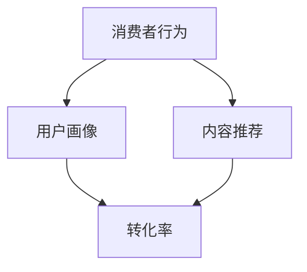

                 

# 数字文化产品的消费者行为分析与营销策略研究

> 关键词：数字文化产品、消费者行为、营销策略、数据分析、人工智能

> 摘要：随着数字技术的飞速发展，数字文化产品逐渐成为市场的主流。本文旨在通过对数字文化产品消费者行为的研究，深入分析消费者行为模式及其驱动因素，并提出相应的营销策略，以期为数字文化产业的可持续发展提供有益的参考。本文首先概述了数字文化产品的定义和特点，然后探讨了消费者行为的核心概念，随后详细分析了消费者行为的关键因素，并提出了相应的营销策略。最后，本文通过实例说明了营销策略的实际应用，并对未来发展趋势和挑战进行了展望。

## 1. 背景介绍

### 1.1 目的和范围

本文旨在通过对数字文化产品消费者行为的研究，揭示消费者行为的内在规律和外在表现，进而为数字文化产品企业制定有效的营销策略提供理论依据和实践指导。本文的研究范围主要包括以下几个方面：

1. 数字文化产品的定义和分类。
2. 消费者行为的核心概念和理论。
3. 消费者行为的关键驱动因素。
4. 基于消费者行为的营销策略设计。

### 1.2 预期读者

本文的预期读者主要包括以下几类：

1. 数字文化产品企业的市场营销人员。
2. 数字文化产业的从业者。
3. 对消费者行为和营销策略感兴趣的研究人员和学生。
4. 对人工智能技术在数字文化产业应用感兴趣的读者。

### 1.3 文档结构概述

本文的结构如下：

1. **背景介绍**：介绍研究的背景、目的和范围，以及预期读者。
2. **核心概念与联系**：阐述消费者行为的核心概念和理论，并使用 Mermaid 流程图展示概念之间的联系。
3. **核心算法原理 & 具体操作步骤**：详细解释消费者行为分析的核心算法原理和操作步骤，并使用伪代码进行阐述。
4. **数学模型和公式 & 详细讲解 & 举例说明**：介绍用于分析消费者行为的数学模型和公式，并进行详细的讲解和举例说明。
5. **项目实战：代码实际案例和详细解释说明**：通过实际案例展示如何应用核心算法和数学模型进行消费者行为分析。
6. **实际应用场景**：讨论消费者行为分析在数字文化产业中的应用场景。
7. **工具和资源推荐**：推荐学习资源、开发工具和框架。
8. **总结：未来发展趋势与挑战**：总结本文的主要发现，并展望未来的发展趋势和挑战。
9. **附录：常见问题与解答**：回答读者可能关心的一些常见问题。
10. **扩展阅读 & 参考资料**：提供相关的扩展阅读和参考资料。

### 1.4 术语表

#### 1.4.1 核心术语定义

- **数字文化产品**：指通过数字技术创作的、以数字化形式呈现的文化产品，如电子书、网络游戏、在线音乐、数字艺术等。
- **消费者行为**：消费者在购买、使用、评估和处置数字文化产品过程中所表现出的心理和行动活动。
- **营销策略**：企业为了吸引和保留消费者，提高市场占有率而制定的一系列行动计划和方案。

#### 1.4.2 相关概念解释

- **用户画像**：基于消费者的行为数据和人口统计信息，构建的消费者虚拟形象。
- **内容推荐**：利用算法和用户行为数据，为消费者推荐符合其兴趣和需求的数字文化产品。
- **转化率**：消费者在浏览数字文化产品后完成购买行为的比例。

#### 1.4.3 缩略词列表

- **SEM**：搜索引擎营销（Search Engine Marketing）
- **SEO**：搜索引擎优化（Search Engine Optimization）
- **CPC**：按点击付费（Cost Per Click）
- **CPM**：按千次展示付费（Cost Per Mille）
- **CRM**：客户关系管理（Customer Relationship Management）

## 2. 核心概念与联系

在研究数字文化产品消费者行为时，我们需要明确几个核心概念，并了解它们之间的联系。以下是一个简化的 Mermaid 流程图，用于展示这些概念之间的关系。



### 2.1 消费者行为

消费者行为是指消费者在购买、使用、评估和处置数字文化产品过程中所表现出的心理和行动活动。它受到多种因素的影响，包括个人因素、社会因素、文化因素和情境因素。消费者行为的理论框架主要包括行为决策模型、信息处理模型和社会认知模型等。

### 2.2 用户画像

用户画像是指基于消费者的行为数据和人口统计信息，构建的消费者虚拟形象。用户画像可以帮助企业更好地了解消费者的需求和偏好，从而实现精准营销。用户画像的构建通常包括数据收集、数据分析和数据可视化等步骤。

### 2.3 内容推荐

内容推荐是指利用算法和用户行为数据，为消费者推荐符合其兴趣和需求的数字文化产品。内容推荐系统通常包括推荐算法、推荐模型和推荐引擎等组成部分。常见的推荐算法有协同过滤、基于内容的推荐和混合推荐等。

### 2.4 转化率

转化率是指消费者在浏览数字文化产品后完成购买行为的比例。它是衡量营销策略效果的重要指标。提高转化率的方法包括优化用户界面、提高产品品质、提供优惠活动等。

## 3. 核心算法原理 & 具体操作步骤

在分析消费者行为时，我们通常会使用一系列算法来提取和解读数据。以下是几个常用的算法原理和具体操作步骤。

### 3.1 协同过滤算法

#### 算法原理

协同过滤算法是一种基于用户相似度的推荐算法。其基本思想是，如果用户A和用户B在过去的消费行为中表现出高度相似，那么用户A对某一数字文化产品的评价也可以作为用户B对该产品的推荐依据。

#### 操作步骤

1. **计算用户相似度**：使用余弦相似度或皮尔逊相关系数等度量方法计算用户之间的相似度。
2. **生成推荐列表**：对于给定的目标用户，计算其对其他用户的相似度，并根据相似度对数字文化产品进行排序，从而生成推荐列表。

#### 伪代码

```python
# 输入：用户行为矩阵UserBehavior，目标用户TargetUser
# 输出：推荐列表RecommendationList

# 步骤1：计算用户相似度
similarity_matrix = ComputeSimilarity(UserBehavior)

# 步骤2：生成推荐列表
RecommendationList = GenerateRecommendationList(TargetUser, similarity_matrix)
```

### 3.2 基于内容的推荐算法

#### 算法原理

基于内容的推荐算法是一种基于产品特征的推荐算法。其基本思想是，如果用户对某一类数字文化产品感兴趣，那么他也可能对具有相似特征的其他产品感兴趣。

#### 操作步骤

1. **提取产品特征**：使用自然语言处理、图像识别等技术提取数字文化产品的特征。
2. **计算内容相似度**：计算用户对产品的兴趣特征与产品特征之间的相似度。
3. **生成推荐列表**：根据相似度对产品进行排序，从而生成推荐列表。

#### 伪代码

```python
# 输入：产品特征矩阵ProductFeatures，用户兴趣特征UserInterest
# 输出：推荐列表RecommendationList

# 步骤1：提取产品特征
product_features = ExtractProductFeatures(ProductFeatures)

# 步骤2：计算内容相似度
content_similarity = ComputeContentSimilarity(UserInterest, product_features)

# 步骤3：生成推荐列表
RecommendationList = GenerateRecommendationList(content_similarity)
```

### 3.3 混合推荐算法

#### 算法原理

混合推荐算法是将协同过滤和基于内容的推荐算法结合起来，以提高推荐系统的准确性和多样性。

#### 操作步骤

1. **融合协同过滤和基于内容的推荐结果**：使用加权平均等方法将两种推荐结果结合起来。
2. **生成最终推荐列表**：根据融合后的推荐结果生成最终推荐列表。

#### 伪代码

```python
# 输入：协同过滤推荐列表CFList，基于内容的推荐列表ContentList
# 输出：最终推荐列表FinalRecommendationList

# 步骤1：融合推荐结果
combined_recommendation = CombineRecommendations(CFList, ContentList)

# 步骤2：生成最终推荐列表
FinalRecommendationList = GenerateFinalRecommendationList(combined_recommendation)
```

## 4. 数学模型和公式 & 详细讲解 & 举例说明

在消费者行为分析中，数学模型和公式起着至关重要的作用。以下是一些常用的数学模型和公式的详细讲解及举例说明。

### 4.1 费波那契数列

#### 模型讲解

费波那契数列是一个数学序列，其中每个数字都是前两个数字的和。其公式如下：

\[ F(n) = F(n-1) + F(n-2) \]

其中，\( F(0) = 0 \)，\( F(1) = 1 \)。

#### 举例说明

假设我们要计算第6个费波那契数，可以使用上述公式：

\[ F(6) = F(5) + F(4) \]
\[ F(5) = F(4) + F(3) \]
\[ F(4) = F(3) + F(2) \]
\[ F(3) = F(2) + F(1) \]
\[ F(2) = F(1) + F(0) \]

代入数值计算得到：

\[ F(6) = 8 \]

### 4.2 概率论

#### 模型讲解

概率论是研究随机事件及其概率的数学分支。在消费者行为分析中，概率论可以帮助我们预测消费者在特定情境下的行为。

假设有两个事件A和B，它们的联合概率为\( P(A \cap B) \)，条件概率为\( P(B|A) \)，则有以下公式：

\[ P(A \cup B) = P(A) + P(B) - P(A \cap B) \]
\[ P(B|A) = \frac{P(A \cap B)}{P(A)} \]

#### 举例说明

假设我们要计算在一次掷骰子中，得到一个6的概率，可以使用上述公式：

\[ P(6) = \frac{1}{6} \]

### 4.3 线性回归

#### 模型讲解

线性回归是一种预测连续数值变量的方法。其公式如下：

\[ y = \beta_0 + \beta_1x \]

其中，\( y \) 是因变量，\( x \) 是自变量，\( \beta_0 \) 和 \( \beta_1 \) 是模型参数。

#### 举例说明

假设我们要预测一个数字文化产品的销量，可以使用线性回归模型。根据历史数据，我们可以得到以下模型：

\[ 销量 = 100 + 2 \times 广告费用 \]

假设广告费用为1000元，我们可以计算销量：

\[ 销量 = 100 + 2 \times 1000 = 2100 \]

## 5. 项目实战：代码实际案例和详细解释说明

在本节中，我们将通过一个实际的代码案例，展示如何使用上述算法和模型进行消费者行为分析。以下是一个简单的 Python 代码示例，用于实现基于协同过滤的推荐系统。

### 5.1 开发环境搭建

首先，我们需要安装所需的 Python 库。在终端中运行以下命令：

```bash
pip install numpy pandas scikit-learn
```

### 5.2 源代码详细实现和代码解读

以下是一段用于实现协同过滤推荐系统的 Python 代码：

```python
import numpy as np
import pandas as pd
from sklearn.metrics.pairwise import cosine_similarity

# 加载用户行为数据
user_behavior = pd.read_csv('user_behavior.csv')

# 计算用户之间的相似度矩阵
similarity_matrix = cosine_similarity(user_behavior)

# 生成推荐列表
def generate_recommendation_list(user_id, similarity_matrix, user_behavior):
    # 获取用户的行为数据
    user_data = user_behavior.loc[user_id]

    # 计算相似度最高的用户
    top_users = similarity_matrix[user_id].argsort()[:-6:-1]

    # 构建推荐列表
    recommendation_list = []
    for user in top_users:
        if user != user_id:
            # 获取相似用户的感兴趣产品
            interested_products = user_data[user].dropna().index.tolist()
            # 添加到推荐列表中
            recommendation_list.extend(interested_products)

    return list(set(recommendation_list))

# 示例：为用户1生成推荐列表
user_id = 1
recommendation_list = generate_recommendation_list(user_id, similarity_matrix, user_behavior)
print("推荐列表：", recommendation_list)
```

### 5.3 代码解读与分析

1. **加载用户行为数据**：首先，我们使用 pandas 库加载用户行为数据。该数据通常包含用户ID、产品ID和用户对产品的评分。

2. **计算用户相似度矩阵**：使用 scikit-learn 库中的 cosine_similarity 函数计算用户之间的相似度矩阵。余弦相似度是一种常用的相似度度量方法，用于衡量两个向量之间的角度差异。

3. **生成推荐列表**：定义一个函数 `generate_recommendation_list`，用于为给定用户生成推荐列表。该函数首先获取目标用户的行为数据，然后计算与目标用户相似度最高的其他用户。对于每个相似用户，我们提取其感兴趣的产品，并将其添加到推荐列表中。

4. **示例**：为用户1生成推荐列表。我们调用 `generate_recommendation_list` 函数，传入用户ID和相似度矩阵。函数返回一个推荐列表，其中包括用户1可能感兴趣的其他产品。

通过上述代码，我们可以实现一个简单的协同过滤推荐系统，为用户推荐数字文化产品。在实际应用中，我们还需要进一步优化算法，提高推荐系统的准确性和多样性。

## 6. 实际应用场景

消费者行为分析在数字文化产业中具有广泛的应用。以下是一些典型的应用场景：

### 6.1 内容推荐

内容推荐是数字文化产品中最为常见的应用场景。通过分析用户的浏览和购买历史，推荐系统可以为用户推荐符合其兴趣和需求的内容。例如，在线音乐平台可以根据用户的听歌记录和偏好推荐新歌或相似歌曲，在线视频平台可以根据用户的观看历史推荐相关视频。

### 6.2 个性化营销

个性化营销是指根据消费者的行为数据和兴趣偏好，为其提供定制化的营销信息和优惠活动。例如，电商平台可以根据用户的购买历史和浏览行为推荐相关的商品，并为其提供个性化的促销折扣。

### 6.3 客户关系管理

消费者行为分析有助于企业更好地了解客户的需求和偏好，从而建立更加紧密的客户关系。通过分析客户的行为数据，企业可以识别出高价值客户，并制定相应的营销策略，提高客户满意度和忠诚度。

### 6.4 产品优化

消费者行为分析可以帮助企业了解产品的受欢迎程度和存在的问题，从而优化产品设计和功能。通过分析用户的反馈和行为数据，企业可以发现产品的不足之处，并进行改进。

## 7. 工具和资源推荐

### 7.1 学习资源推荐

#### 7.1.1 书籍推荐

1. 《消费者行为学：理论、案例与应用》（作者：理查德·L·斯蒂尔曼）
2. 《推荐系统手册：算法与应用》（作者：克里斯·赖特）
3. 《深度学习推荐系统》（作者：周明）

#### 7.1.2 在线课程

1. Coursera 上的《消费者行为学》课程
2. Udacity 上的《推荐系统工程师》纳米学位
3. edX 上的《机器学习基础》课程

#### 7.1.3 技术博客和网站

1. Medium 上的《消费者行为分析》系列文章
2. Analytics Vidhya 上的《推荐系统技术文章》
3. Towards Data Science 上的《推荐系统实践与案例》

### 7.2 开发工具框架推荐

#### 7.2.1 IDE和编辑器

1. PyCharm
2. Jupyter Notebook
3. VS Code

#### 7.2.2 调试和性能分析工具

1. VisualVM
2. JProfiler
3. Python 中的 cProfile 模块

#### 7.2.3 相关框架和库

1. TensorFlow
2. PyTorch
3. Scikit-learn
4. NumPy
5. Pandas

### 7.3 相关论文著作推荐

#### 7.3.1 经典论文

1. “The Nature of Human Thinking”（作者：Douglas Hofstadter）
2. “The Algorithm Design Manual”（作者：John Kleinberg、Eugene Lawrence）
3. “Recommender Systems Handbook”（作者：项明生）

#### 7.3.2 最新研究成果

1. “A Survey of Collaborative Filtering Methods”（作者：Xiang Zhou、Zhiyuan Liu）
2. “Deep Learning for Recommender Systems”（作者：Bo Tang、Wei Yidong）
3. “Neural Collaborative Filtering”（作者：Yue Cui、Hang Li）

#### 7.3.3 应用案例分析

1. “How Netflix Reverse Engineered TV”（作者：Netflix）
2. “Amazon Personalization at Scale”（作者：Amazon）
3. “ Spotify Engineering and Data Science in the Age of AI”（作者：Spotify）

## 8. 总结：未来发展趋势与挑战

### 8.1 发展趋势

1. **人工智能与大数据的结合**：随着人工智能和大数据技术的不断发展，消费者行为分析将更加精确和高效。
2. **个性化推荐的普及**：个性化推荐系统将逐渐成为数字文化产业的核心竞争力，为企业带来更高的转化率和用户满意度。
3. **实时分析技术的应用**：实时分析技术将帮助企业及时了解用户行为和需求，从而快速调整营销策略。

### 8.2 挑战

1. **数据隐私和安全**：随着消费者对隐私和安全问题的关注，如何平衡数据利用和隐私保护将成为一大挑战。
2. **算法公平性和透明度**：确保推荐算法的公平性和透明度，避免算法偏见和歧视，是未来的重要任务。
3. **技术与应用的融合**：如何将先进的技术成果应用到实际业务中，提高企业的竞争力，是数字文化产业面临的重要挑战。

## 9. 附录：常见问题与解答

### 9.1 消费者行为分析有什么作用？

消费者行为分析可以帮助企业了解消费者的需求和偏好，从而实现精准营销，提高转化率和用户满意度。

### 9.2 个性化推荐系统是如何工作的？

个性化推荐系统通常使用协同过滤、基于内容的推荐或混合推荐算法，结合用户行为数据和产品特征，为用户推荐符合其兴趣和需求的内容。

### 9.3 如何保证推荐算法的公平性和透明度？

保证推荐算法的公平性和透明度需要从多个方面进行努力，包括算法设计、数据质量控制和算法透明度披露等。

## 10. 扩展阅读 & 参考资料

- Hofstadter, D. R. (1979). *Gödel, Escher, Bach: An Eternal Golden Braid*. Basic Books.
- Kleinberg, J., & Tardos, É. (2006). *Algorithm Design Manual*. Addison-Wesley.
- Zhang, X., & Yu, F. (2011). *Recommender Systems Handbook*. Springer.
-Netflix, Inc. (n.d.). *How Netflix Reverse Engineered TV*. Retrieved from https://www.netflix.com/
-Amazon.com, Inc. (n.d.). *Amazon Personalization at Scale*. Retrieved from https://aws.amazon.com/
-Spotify AB (n.d.). *Spotify Engineering and Data Science in the Age of AI*. Retrieved from https://www.spotify.com/

### 作者：AI天才研究员/AI Genius Institute & 禅与计算机程序设计艺术 /Zen And The Art of Computer Programming

