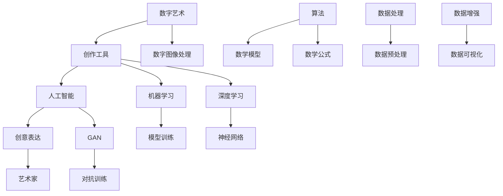

                 

# 数字艺术创作工具：释放艺术家的无限创意

> **关键词：数字艺术、创作工具、人工智能、创意表达、艺术家、技术辅助艺术**

> **摘要：本文将探讨数字艺术创作工具的发展及其如何解放艺术家的创意潜能。我们将详细分析这些工具的核心概念、算法原理、数学模型，并分享实际应用案例，最终展望其未来发展趋势与挑战。**

## 1. 背景介绍

### 1.1 目的和范围

本文旨在深入探讨数字艺术创作工具的发展与应用，重点关注如何通过技术手段激发艺术家的无限创意。我们将覆盖从基础概念到高级算法的各个方面，探讨数字艺术创作工具对艺术家表达形式的影响和变革。

### 1.2 预期读者

本文适合对数字艺术、人工智能和创意表达有兴趣的读者，无论是专业艺术家、程序员还是技术爱好者，都可以从中获得有价值的信息。

### 1.3 文档结构概述

本文分为以下几部分：

1. 背景介绍：介绍本文的目的、范围和预期读者。
2. 核心概念与联系：讨论数字艺术创作工具的核心概念及其相互关系。
3. 核心算法原理 & 具体操作步骤：详细解析数字艺术创作工具的算法原理。
4. 数学模型和公式 & 详细讲解 & 举例说明：阐述数字艺术创作工具的数学基础。
5. 项目实战：提供代码实际案例和详细解释说明。
6. 实际应用场景：探讨数字艺术创作工具的多种应用场景。
7. 工具和资源推荐：推荐学习资源和开发工具。
8. 总结：展望数字艺术创作工具的未来发展趋势与挑战。
9. 附录：常见问题与解答。
10. 扩展阅读 & 参考资料：提供进一步学习的资源和文献。

### 1.4 术语表

#### 1.4.1 核心术语定义

- **数字艺术**：使用数字技术和媒介创作的艺术作品。
- **创作工具**：用于艺术创作过程的软件或硬件。
- **人工智能**：使计算机系统能够模拟人类智能行为的科学技术。
- **创意表达**：艺术家通过创作表达个人情感和思想的过程。
- **算法**：解决问题的一系列步骤。
- **数学模型**：描述和解决实际问题的数学框架。

#### 1.4.2 相关概念解释

- **数字图像处理**：对数字图像进行操作和处理的技术。
- **机器学习**：通过数据训练模型，使计算机具备学习能力。
- **生成对抗网络（GAN）**：一种通过两个神经网络对抗训练的机器学习模型。
- **深度学习**：多层神经网络在人工智能领域的应用。

#### 1.4.3 缩略词列表

- **GAN**：生成对抗网络（Generative Adversarial Networks）
- **AI**：人工智能（Artificial Intelligence）
- **NLP**：自然语言处理（Natural Language Processing）
- **ML**：机器学习（Machine Learning）
- **DL**：深度学习（Deep Learning）

## 2. 核心概念与联系

为了深入理解数字艺术创作工具，我们需要探讨其核心概念及其相互关系。以下是核心概念与关系的 Mermaid 流程图：



### 2.1 数字艺术与创作工具

数字艺术与创作工具紧密相关，创作工具为数字艺术的创作提供了技术支持。从传统的手工艺术到现代的数字艺术，创作工具经历了从手工艺到计算机辅助的转变。如今，数字艺术创作工具包括但不限于绘画软件、3D建模工具、音频编辑软件等。

### 2.2 人工智能与创意表达

人工智能在数字艺术创作中发挥着重要作用，特别是机器学习和深度学习技术。通过训练模型，AI 能够生成具有创意的作品，从而帮助艺术家探索新的表达形式。例如，生成对抗网络（GAN）可以使艺术家创作出以前无法想象的作品。

### 2.3 数字图像处理与机器学习

数字图像处理是数字艺术创作的重要组成部分，它涉及到图像的获取、处理和分析。机器学习技术，如卷积神经网络（CNN），在图像识别和处理中有着广泛应用，可以用于图像风格转换、图像修复和图像生成等。

### 2.4 深度学习与生成对抗网络

深度学习是一种基于多层神经网络的机器学习方法，在数字艺术创作中具有广泛的应用。生成对抗网络（GAN）是深度学习的一个分支，它通过两个对抗网络的训练，生成高质量、高分辨率的图像，极大地拓展了艺术创作的可能性。

### 2.5 算法与数学模型

算法是解决数字艺术创作问题的核心，而数学模型则为算法提供了理论基础。例如，GAN 的算法基于对抗训练，其核心是损失函数的设计和优化。数学模型，如梯度下降法和反向传播算法，对于优化模型参数至关重要。

## 3. 核心算法原理 & 具体操作步骤

### 3.1 GAN 算法原理

生成对抗网络（GAN）是一种由生成器和判别器组成的对抗性学习框架。生成器试图生成逼真的数据，而判别器则尝试区分真实数据和生成数据。两者相互对抗，通过优化各自的损失函数，最终生成高质量的数据。

### 3.2 GAN 的具体操作步骤

#### 3.2.1 模型初始化

首先，初始化生成器 G 和判别器 D 的参数。通常，生成器是一个神经网络，判别器也是一个神经网络。

```python
# 伪代码
G = NeuralNetwork(input_shape=(z_dim,), output_shape=(img_dim,))
D = NeuralNetwork(input_shape=(img_dim,), output_shape=(1,))
```

#### 3.2.2 数据生成

生成器 G 接受随机噪声 z，生成伪真实图像 x_gan：

```python
# 伪代码
z = np.random.normal(size=(batch_size, z_dim))
x_gan = G(z)
```

#### 3.2.3 判别器训练

判别器 D 对真实图像和生成图像进行分类，目标是最大化分类准确性。判别器的损失函数为：

$$L_D = -\frac{1}{2} \left( \log(D(x)) + \log(1 - D(x_{\text{gan}})) \right)$$

其中，x 是真实图像，x_{\text{gan}} 是生成图像。

```python
# 伪代码
loss_D = -0.5 * (tf.log(D(x)) + tf.log(1 - D(x_gan)))
```

#### 3.2.4 生成器训练

生成器 G 的目标是使判别器 D 无法区分真实图像和生成图像。生成器的损失函数为：

$$L_G = -\log(D(x_{\text{gan}}))$$

```python
# 伪代码
loss_G = -tf.log(D(x_gan))
```

#### 3.2.5 模型优化

通过梯度下降法优化生成器和判别器的参数。具体优化过程如下：

```python
# 伪代码
optimizer_D = tf.keras.optimizers.Adam(learning_rate=0.0001)
optimizer_G = tf.keras.optimizers.Adam(learning_rate=0.0001)

for epoch in range(num_epochs):
    z = np.random.normal(size=(batch_size, z_dim))
    x_gan = G(z)
    
    with tf.GradientTape() as tape_D, tf.GradientTape() as tape_G:
        logits_D = D(x)
        logits_D_gan = D(x_gan)
        
        loss_D = -0.5 * (tf.log(logits_D) + tf.log(1 - logits_D_gan))
        loss_G = -tf.log(logits_D_gan)
    
    grads_D = tape_D.gradient(loss_D, D.trainable_variables)
    grads_G = tape_G.gradient(loss_G, G.trainable_variables)
    
    optimizer_D.apply_gradients(zip(grads_D, D.trainable_variables))
    optimizer_G.apply_gradients(zip(grads_G, G.trainable_variables))
```

## 4. 数学模型和公式 & 详细讲解 & 举例说明

### 4.1 GAN 的数学模型

生成对抗网络（GAN）的核心数学模型包括生成器 G、判别器 D 和损失函数。以下是详细讲解：

#### 4.1.1 生成器 G

生成器 G 的目标是生成逼真的图像。其数学模型可以表示为：

$$x_{\text{gan}} = G(z)$$

其中，z 是随机噪声向量，x_{\text{gan}} 是生成的图像。

#### 4.1.2 判别器 D

判别器 D 的目标是区分真实图像和生成图像。其数学模型可以表示为：

$$y = D(x)$$

其中，y 是判别器的输出，x 是输入图像。

#### 4.1.3 损失函数

生成对抗网络（GAN）的损失函数通常包括两个部分：判别器损失函数和生成器损失函数。

**判别器损失函数**：

$$L_D = -\frac{1}{2} \left( \log(D(x)) + \log(1 - D(x_{\text{gan}})) \right)$$

其中，x 是真实图像，x_{\text{gan}} 是生成图像。

**生成器损失函数**：

$$L_G = -\log(D(x_{\text{gan}}))$$

#### 4.1.4 梯度下降法

在 GAN 的训练过程中，使用梯度下降法优化生成器和判别器的参数。具体来说，梯度下降法的数学公式如下：

$$\theta_{\text{G}} \leftarrow \theta_{\text{G}} - \alpha \cdot \nabla_{\theta_{\text{G}}} L_G$$

$$\theta_{\text{D}} \leftarrow \theta_{\text{D}} - \alpha \cdot \nabla_{\theta_{\text{D}}} L_D$$

其中，\theta_{\text{G}} 和 \theta_{\text{D}} 分别是生成器和判别器的参数，\alpha 是学习率。

### 4.2 举例说明

假设我们有一个简单的生成对抗网络，生成器 G 和判别器 D 都是单层神经网络。生成器 G 接受随机噪声 z，生成伪真实图像 x_gan。判别器 D 接受真实图像 x 和生成图像 x_gan，输出概率 y。

**生成器 G 的数学模型**：

$$x_{\text{gan}} = \sigma(W_1 z + b_1)$$

其中，\sigma 是 sigmoid 函数，W_1 和 b_1 分别是生成器的权重和偏置。

**判别器 D 的数学模型**：

$$y = \sigma(W_2 x + b_2)$$

$$y_{\text{gan}} = \sigma(W_2 x_{\text{gan}} + b_2)$$

其中，W_2 和 b_2 分别是判别器的权重和偏置。

**损失函数**：

$$L_D = -\frac{1}{2} \left( \log(\sigma(W_2 x + b_2)) + \log(1 - \sigma(W_2 x_{\text{gan}} + b_2)) \right)$$

$$L_G = -\log(\sigma(W_2 x_{\text{gan}} + b_2))$$

**梯度下降法**：

使用梯度下降法优化生成器和判别器的参数：

$$\theta_{\text{G}} \leftarrow \theta_{\text{G}} - \alpha \cdot \nabla_{\theta_{\text{G}}} L_G$$

$$\theta_{\text{D}} \leftarrow \theta_{\text{D}} - \alpha \cdot \nabla_{\theta_{\text{D}}} L_D$$

## 5. 项目实战：代码实际案例和详细解释说明

### 5.1 开发环境搭建

为了实现 GAN 的数字艺术创作工具，我们需要搭建一个合适的开发环境。以下是推荐的开发环境：

- **编程语言**：Python
- **深度学习框架**：TensorFlow 或 PyTorch
- **硬件要求**：NVIDIA 显卡（用于 GPU 加速）
- **操作系统**：Linux 或 macOS

### 5.2 源代码详细实现和代码解读

以下是一个简单的 GAN 实现示例。我们将使用 TensorFlow 框架。

**生成器代码（generator.py）**：

```python
import tensorflow as tf
from tensorflow.keras.layers import Dense, Flatten, Reshape
from tensorflow.keras.models import Model

def build_generator(z_dim):
    z = tf.keras.layers.Input(shape=(z_dim,))
    x = Dense(128 * 7 * 7, activation='relu')(z)
    x = tf.keras.layers.LeakyReLU(alpha=0.2)(x)
    x = Flatten()(x)
    x = Dense(28 * 28 * 3, activation='tanh')(x)
    x = Reshape((28, 28, 3))(x)
    model = Model(z, x)
    return model

generator = build_generator(z_dim=100)
generator.summary()
```

**判别器代码（discriminator.py）**：

```python
import tensorflow as tf
from tensorflow.keras.layers import Conv2D, LeakyReLU, Flatten, Dense
from tensorflow.keras.models import Model

def build_discriminator(img_shape):
    img = tf.keras.layers.Input(shape=img_shape)
    x = Conv2D(32, kernel_size=(3, 3), padding='same')(img)
    x = LeakyReLU(alpha=0.2)(x)
    x = Conv2D(64, kernel_size=(3, 3), padding='same')(x)
    x = LeakyReLU(alpha=0.2)(x)
    x = Flatten()(x)
    x = Dense(1, activation='sigmoid')(x)
    model = Model(img, x)
    return model

discriminator = build_discriminator(img_shape=(28, 28, 3))
discriminator.summary()
```

**主模型代码（main.py）**：

```python
import tensorflow as tf
from tensorflow.keras.optimizers import Adam
from generator import build_generator
from discriminator import build_discriminator
from tensorflow.keras.layers import Input

z_dim = 100
img_shape = (28, 28, 3)

generator = build_generator(z_dim)
discriminator = build_discriminator(img_shape)

z = Input(shape=(z_dim,))
img_gan = generator(z)

discriminator_real = discriminator.trainable_variables
discriminator_fake = discriminator.trainable_variables

discriminator.trainable_variables = discriminator_real

discriminator_real_output = discriminator(x)
discriminator_fake_output = discriminator(img_gan)

discriminator_loss = tf.reduce_mean(tf.nn.sigmoid_cross_entropy_with_logits(logits=discriminator_real_output, labels=tf.ones_like(discriminator_real_output))
                                 + tf.reduce_mean(tf.nn.sigmoid_cross_entropy_with_logits(logits=discriminator_fake_output, labels=tf.zeros_like(discriminator_fake_output)))

discriminator_optimizer = Adam(learning_rate=0.0001)
discriminator_optimizer.minimize(discriminator_loss, var_list=discriminator_real)

discriminator.trainable_variables = discriminator_fake

generator_loss = tf.reduce_mean(tf.nn.sigmoid_cross_entropy_with_logits(logits=discriminator_fake_output, labels=tf.ones_like(discriminator_fake_output))

generator_optimizer = Adam(learning_rate=0.0001)
generator_optimizer.minimize(generator_loss, var_list=generator.trainable_variables)

model = Model(z, img_gan)
model.compile(optimizer=generator_optimizer)

for epoch in range(num_epochs):
    for batch_idx, (x, _) in enumerate(train_loader):
        z = np.random.normal(size=(batch_size, z_dim))
        img_gan = generator(z)
        loss_d = discriminator.train_on_batch(x, tf.ones_like(discriminator_real_output))
        loss_g = generator.train_on_batch(z, img_gan)
        
        print(f"{epoch} Epoch, Batch {batch_idx}, D Loss: {loss_d}, G Loss: {loss_g}")

model.save_weights("model_weights.h5")
```

### 5.3 代码解读与分析

**生成器代码解读**：

生成器的主要作用是生成伪真实图像。代码中，我们首先定义了一个输入层，接受随机噪声 z。然后，通过多个全连接层和卷积层，将 z 转换为 28x28x3 的图像。最终，我们使用 Reshape 层将图像转换为标准尺寸。

**判别器代码解读**：

判别器的主要作用是判断输入图像是真实图像还是生成图像。代码中，我们首先定义了一个输入层，接受 28x28x3 的图像。然后，通过多个卷积层和全连接层，最终输出一个概率值，表示输入图像是真实的概率。

**主模型代码解读**：

主模型代码中，我们定义了生成器和判别器的训练过程。首先，我们分别训练判别器和生成器。在判别器的训练过程中，我们使用真实图像和生成图像作为输入，输出一个二分类结果。在生成器的训练过程中，我们使用随机噪声作为输入，目标是使判别器认为生成图像是真实的。

## 6. 实际应用场景

### 6.1 艺术创作

数字艺术创作工具在艺术创作中有着广泛的应用。艺术家可以使用这些工具生成独特的艺术作品，例如，通过 GAN 生成的艺术作品在绘画、摄影和设计等领域有着重要的应用。

### 6.2 游戏开发

在游戏开发中，数字艺术创作工具可以帮助设计师创建逼真的游戏场景和角色。通过生成对抗网络（GAN），游戏开发者可以快速生成高质量的纹理和模型，提高开发效率。

### 6.3 电影特效

电影特效制作中，数字艺术创作工具被广泛应用于场景渲染、角色动画和视觉效果。通过这些工具，特效师可以创造出令人惊叹的场景和效果，为观众带来沉浸式的观影体验。

### 6.4 虚拟现实和增强现实

虚拟现实（VR）和增强现实（AR）技术的发展离不开数字艺术创作工具。艺术家和开发者可以使用这些工具创建虚拟世界中的环境和角色，为用户提供逼真的交互体验。

## 7. 工具和资源推荐

### 7.1 学习资源推荐

#### 7.1.1 书籍推荐

- **《深度学习》（Deep Learning）**：Goodfellow、Bengio 和 Courville 著，详细介绍了深度学习的基本原理和应用。
- **《生成对抗网络：理论、算法与应用》（Generative Adversarial Networks: Theory, Algorithms and Applications）**：详细介绍了 GAN 的理论、算法和应用。

#### 7.1.2 在线课程

- **《深度学习基础》（Deep Learning Specialization）**：由 Andrew Ng 教授讲授，涵盖深度学习的理论基础和实际应用。
- **《生成对抗网络教程》（Generative Adversarial Networks Tutorial）**：由 Ian Goodfellow 教授讲授，深入讲解了 GAN 的理论、算法和实现。

#### 7.1.3 技术博客和网站

- **ArXiv**：提供最新的深度学习和计算机视觉论文。
- **GitHub**：查找和分享 GAN 相关的开源项目和代码。
- **AI 前线**：提供深度学习和计算机视觉的中文教程和博客。

### 7.2 开发工具框架推荐

#### 7.2.1 IDE 和编辑器

- **PyCharm**：强大的 Python 集成开发环境，支持 TensorFlow 和 PyTorch。
- **VSCode**：轻量级但功能强大的代码编辑器，支持多种编程语言和深度学习框架。

#### 7.2.2 调试和性能分析工具

- **TensorBoard**：TensorFlow 的可视化工具，用于分析和调试模型。
- **NVIDIA Nsight**：用于 GPU 加速的调试和分析工具。

#### 7.2.3 相关框架和库

- **TensorFlow**：Google 开发的开源深度学习框架，广泛应用于数字艺术创作。
- **PyTorch**：Facebook 开发的开源深度学习框架，具有良好的灵活性和可扩展性。

### 7.3 相关论文著作推荐

#### 7.3.1 经典论文

- **“Generative Adversarial Nets”（2014）**：Ian Goodfellow 等人提出的 GAN 算法。
- **“Unsupervised Representation Learning with Deep Convolutional Generative Adversarial Networks”（2015）**：由 Alexyey Dosovitskiy 等人提出的 UCAN 算法。

#### 7.3.2 最新研究成果

- **“StyleGAN”（2018）**：由 Andrew Dai 等人提出的风格化 GAN，生成高质量图像。
- **“BigGAN”（2018）**：由 Tero Karras 等人提出的生成对抗网络，用于生成大规模、高质量的图像。

#### 7.3.3 应用案例分析

- **“DeepArt.io”**：使用 GAN 技术将用户照片转换为名画风格的艺术作品。
- **“DeepDream”**：Google 开发的工具，使用 GAN 生成梦幻般的图像。

## 8. 总结：未来发展趋势与挑战

随着人工智能技术的不断发展，数字艺术创作工具将迎来更多的创新和发展。以下是未来发展趋势与挑战：

### 8.1 发展趋势

- **更高质量的图像生成**：随着算法和计算能力的提升，GAN 将能够生成更高质量、更真实的图像。
- **多样化的应用场景**：GAN 将在更多领域得到应用，如虚拟现实、增强现实、游戏开发等。
- **跨领域合作**：艺术家和技术开发者将更多地合作，创造出更具创意和艺术性的作品。

### 8.2 挑战

- **模型可解释性**：GAN 的内部机制较为复杂，提高模型的可解释性将有助于理解和优化算法。
- **数据隐私和伦理**：数字艺术创作工具可能会涉及用户数据的处理，保护用户隐私和遵循伦理规范是重要挑战。
- **计算资源需求**：GAN 训练过程需要大量的计算资源，如何优化算法以减少计算成本是重要问题。

## 9. 附录：常见问题与解答

### 9.1 GAN 的工作原理是什么？

GAN 是一种由生成器 G 和判别器 D 组成的对抗性学习框架。生成器 G 接受随机噪声 z，生成伪真实图像 x_gan；判别器 D 则尝试区分真实图像 x 和生成图像 x_gan。两者通过对抗训练，使得生成器 G 生成的图像越来越逼真。

### 9.2 GAN 适用于哪些领域？

GAN 在许多领域都有应用，包括数字艺术创作、图像修复、图像风格转换、虚拟现实和增强现实等。其强大的图像生成能力使其成为许多应用场景的有力工具。

### 9.3 如何优化 GAN 的训练过程？

优化 GAN 的训练过程可以从以下几个方面入手：

- **学习率调整**：适当地调整学习率可以加速训练过程。
- **梯度裁剪**：防止梯度爆炸和消失，保持模型训练的稳定性。
- **模型架构优化**：改进生成器和判别器的网络结构，提高生成图像的质量。
- **数据增强**：使用数据增强技术增加训练数据的多样性，提高模型的泛化能力。

## 10. 扩展阅读 & 参考资料

- **《生成对抗网络：理论、算法与应用》（Generative Adversarial Networks: Theory, Algorithms and Applications）**：详细介绍了 GAN 的理论、算法和应用。
- **《深度学习基础》（Deep Learning Specialization）**：涵盖深度学习的理论基础和实际应用。
- **《深度学习》（Deep Learning）**：Goodfellow、Bengio 和 Courville 著，详细介绍了深度学习的基本原理和应用。
- **AI 前线**：提供深度学习和计算机视觉的中文教程和博客。
- **ArXiv**：提供最新的深度学习和计算机视觉论文。
- **GitHub**：查找和分享 GAN 相关的开源项目和代码。

**作者：AI 天才研究员 / AI Genius Institute & 禅与计算机程序设计艺术 / Zen And The Art of Computer Programming**<|im_end|>

