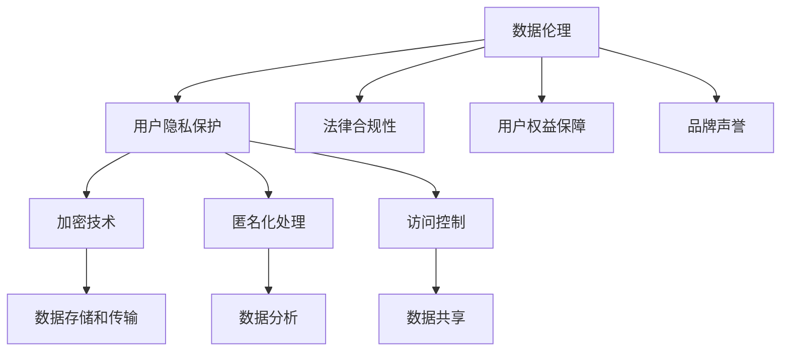

                 

### 1. 背景介绍

#### 1.1 目的和范围

随着信息技术的飞速发展，大数据、云计算和人工智能等新兴技术为人类带来了前所未有的便利。然而，这些技术的同时，也引发了关于数据伦理和用户隐私保护的深刻讨论。数据伦理，即如何在数据收集、处理和使用过程中，尊重和保护用户隐私，已成为社会各界广泛关注的话题。

本文旨在探讨数据伦理与平台用户隐私保护的重要性，分析当前的数据隐私保护措施及其存在的问题，并提出一些有效的解决方案。文章将围绕以下几个核心问题展开：

- 数据伦理的定义及其重要性是什么？
- 平台用户隐私保护的现状如何？
- 存在哪些隐私保护的技术和方法？
- 如何在实际项目中应用这些技术？
- 未来数据隐私保护的发展趋势和挑战是什么？

通过以上问题的探讨，本文希望能够为读者提供一份全面、深入的数据隐私保护指南，帮助他们在面对复杂的数字世界时，能够做出更加明智的选择。

#### 1.2 预期读者

本文的预期读者主要包括以下几类：

1. **IT行业从业者**：包括程序员、数据科学家、软件工程师等，他们需要了解如何在日常工作中遵守数据伦理，保护用户隐私。
2. **企业管理者**：需要了解数据伦理和隐私保护对企业的潜在影响，以及如何制定相关政策和措施。
3. **政策制定者和监管人员**：需要了解当前的数据隐私保护法律法规，以及如何进行有效的监管。
4. **普通用户**：希望通过阅读本文，增强对数据隐私保护的认识，更好地保护自己的个人信息。

无论读者属于哪一类，本文都将提供有价值的内容，帮助他们更好地理解和应对数据伦理和隐私保护的问题。

#### 1.3 文档结构概述

为了使读者能够清晰地跟随文章的思路，本文将采用以下结构：

1. **背景介绍**：介绍数据伦理与平台用户隐私保护的重要性和预期读者。
2. **核心概念与联系**：阐述数据伦理、用户隐私保护等相关概念，并提供Mermaid流程图。
3. **核心算法原理与具体操作步骤**：详细讲解隐私保护技术的算法原理和操作步骤，使用伪代码进行阐述。
4. **数学模型和公式**：介绍相关的数学模型和公式，并进行举例说明。
5. **项目实战**：通过实际代码案例，展示隐私保护技术的应用。
6. **实际应用场景**：分析隐私保护技术的应用场景。
7. **工具和资源推荐**：推荐学习资源、开发工具和框架。
8. **相关论文著作推荐**：介绍经典和最新的研究论文。
9. **总结**：总结未来发展趋势与挑战。
10. **附录**：提供常见问题与解答。
11. **扩展阅读与参考资料**：推荐进一步阅读的材料。

通过这种结构化的方式，读者可以逐步深入了解数据伦理与平台用户隐私保护的相关知识。

#### 1.4 术语表

在本文中，我们将使用一些专业术语，为了确保读者能够准确理解，下面是对这些术语的定义和解释：

##### 1.4.1 核心术语定义

- **数据伦理**：指在数据收集、处理、存储和使用过程中，遵循道德和法律规范，尊重和保护个人隐私和数据安全的原则。
- **用户隐私**：指用户在使用数字平台时，其个人信息和活动记录不被未经授权的第三方访问、使用和泄露。
- **隐私保护技术**：包括加密技术、匿名化处理、访问控制等，用于保护用户隐私不被泄露。
- **匿名化**：通过去除或修改个人身份信息，使数据无法直接识别特定个人。
- **加密**：使用算法将原始数据转换为密文，只有拥有解密密钥的人才能恢复原始数据。
- **访问控制**：通过限制对数据的访问权限，确保只有授权用户才能访问和操作数据。

##### 1.4.2 相关概念解释

- **隐私泄露**：指用户的个人信息未经授权被访问、使用或泄露。
- **数据挖掘**：从大量数据中提取有价值的信息和知识。
- **隐私合规**：指企业在数据收集、处理和使用过程中，遵守相关隐私保护法律法规。

##### 1.4.3 缩略词列表

- **GDPR**：通用数据保护条例（General Data Protection Regulation）
- **CCPA**：加州消费者隐私法案（California Consumer Privacy Act）
- **SSL**：安全套接层协议（Secure Sockets Layer）
- **PII**：个人身份信息（Personally Identifiable Information）
- **API**：应用程序编程接口（Application Programming Interface）

这些术语和缩略词在本文中将频繁出现，理解它们对于深入探讨数据伦理和用户隐私保护至关重要。

## 2. 核心概念与联系

在深入探讨数据伦理与平台用户隐私保护之前，我们需要明确一些核心概念和它们之间的关系。以下是对这些概念及其相互关系的详细描述，并提供一个Mermaid流程图来直观地展示这些概念之间的联系。

### 2.1 数据伦理的定义及其重要性

数据伦理，是指在数据收集、处理、存储和使用过程中，遵循道德和法律规范，尊重和保护个人隐私和数据安全的原则。数据伦理的重要性体现在以下几个方面：

- **保护用户隐私**：数据伦理确保用户的个人信息不被未经授权的第三方访问、使用或泄露。
- **维护数据安全**：通过遵守数据伦理，可以降低数据泄露和滥用的风险，从而维护数据安全。
- **增强用户信任**：当用户意识到他们的个人信息得到了有效保护，他们更愿意使用和信任数字平台。

### 2.2 用户隐私保护的定义及其重要性

用户隐私保护，指在数字平台上，通过技术和管理手段，确保用户个人信息不被未经授权的第三方访问、使用或泄露。用户隐私保护的重要性体现在以下几个方面：

- **法律合规性**：遵守隐私保护法规，如GDPR和CCPA，是企业避免法律风险的关键。
- **用户权益保障**：保护用户隐私，是尊重用户权益、提升用户满意度的必要条件。
- **品牌声誉**：良好的隐私保护措施，有助于提升企业的品牌形象和用户信任度。

### 2.3 隐私保护技术及其应用

隐私保护技术是实施用户隐私保护的重要工具，包括加密技术、匿名化处理、访问控制等。以下是对这些技术的简要介绍和应用场景：

- **加密技术**：通过算法将原始数据转换为密文，只有拥有解密密钥的人才能恢复原始数据。应用场景包括数据存储和传输过程中的隐私保护。
- **匿名化处理**：通过去除或修改个人身份信息，使数据无法直接识别特定个人。应用场景包括数据分析和数据共享时的隐私保护。
- **访问控制**：通过限制对数据的访问权限，确保只有授权用户才能访问和操作数据。应用场景包括企业内部数据管理和数据共享平台的安全控制。

### 2.4 数据伦理与用户隐私保护的关系

数据伦理与用户隐私保护密切相关，两者之间的关系可以总结为以下几点：

- **数据伦理是用户隐私保护的基础**：只有当数据收集、处理和使用过程遵循道德规范，用户隐私保护才能真正落到实处。
- **用户隐私保护是数据伦理的具体体现**：通过实施隐私保护技术和管理措施，可以有效地贯彻数据伦理原则。

### 2.5 Mermaid流程图

为了更好地展示这些核心概念之间的联系，我们使用Mermaid流程图进行描述。以下是一个简化的Mermaid流程图，描述了数据伦理、用户隐私保护、隐私保护技术之间的逻辑关系：



在这个流程图中，A代表数据伦理，它是整个流程的起点和基础；B代表用户隐私保护，它是数据伦理的具体实现；C、D、E分别代表加密技术、匿名化处理和访问控制，它们是用户隐私保护的主要手段；F、G、H分别代表数据存储和传输、数据分析和数据共享，它们是数据伦理和用户隐私保护的具体应用场景；I、J、K分别代表法律合规性、用户权益保障和品牌声誉，它们是数据伦理和用户隐私保护的重要目标。

通过这个流程图，我们可以直观地理解数据伦理、用户隐私保护和隐私保护技术之间的相互关系，为后续内容的深入探讨打下坚实的基础。

### 2.6 数学模型和公式

在数据隐私保护中，数学模型和公式扮演着至关重要的角色。以下将介绍几个关键的数学模型和公式，并进行详细讲解。

#### 2.6.1 加密技术中的加密与解密公式

加密技术是保护数据隐私的重要手段。加密过程中，使用加密函数E和密钥k1，将明文P转换为密文C，公式表示为：
$$ C = E_k(P) $$
解密过程中，使用解密函数D和解密密钥k2，将密文C恢复为明文P，公式表示为：
$$ P = D_{k2}(C) $$
其中，E和D分别是加密算法和解密算法，k1是加密密钥，k2是解密密钥。

#### 2.6.2 零知识证明的数学模型

零知识证明（Zero-Knowledge Proof）是一种重要的隐私保护技术，它允许证明者证明某个陈述为真，而无需透露任何具体信息。零知识证明的数学模型可以表示为三元组：
$$ (P, V, ZK) $$
其中，P是证明者，V是验证者，ZK是零知识证明协议。数学模型的核心在于证明者如何使用零知识证明协议向验证者证明某个陈述为真，而无需透露任何具体信息。具体过程如下：

1. **初始化**：证明者P选择一个随机数r，并计算初始值g^r mod n。
2. **挑战生成**：验证者V选择一个随机数a，并将其发送给证明者P。
3. **响应计算**：证明者P计算证明值，公式为：
   $$ (g^a \cdot c)^r \cdot h^{-ar} $$
   其中，c是初始化时的值，h是哈希函数。
4. **证明验证**：验证者V使用哈希函数h对证明值进行验证，确保其满足零知识证明的要求。

#### 2.6.3 匿名化处理中的Laplace机制

在匿名化处理中，Laplace机制是一种常用的数据扰动技术，用于防止数据中的敏感信息被直接识别。Laplace机制通过在原始数据上添加噪声来保护隐私，其数学模型可以表示为：
$$ X' = X + \epsilon $$
其中，X是原始数据，X'是添加噪声后的数据，ε是Laplace噪声。

Laplace噪声ε的分布可以表示为：
$$ \epsilon \sim Laplace(\mu, b) $$
其中，μ是均值，b是离散度。

通过Laplace机制，原始数据X被扰动为X'，使得X'在添加噪声后具有更高的不确定性，从而降低了直接识别敏感信息的风险。

#### 2.6.4 冲突性分析中的Jaccard相似度

在数据隐私保护中，冲突性分析是一种重要的技术，用于检测数据集中的隐私泄露风险。Jaccard相似度是一种常用的冲突性分析指标，用于衡量两个数据集的相似度。其数学模型可以表示为：
$$ J(A, B) = \frac{|A \cap B|}{|A \cup B|} $$
其中，A和B是两个数据集，|A|和|B|分别表示A和B的元素个数，A ∩ B表示A和B的交集，A ∪ B表示A和B的并集。

Jaccard相似度的取值范围在0到1之间，值越接近1，表示两个数据集的相似度越高，隐私泄露风险越大。

通过以上数学模型和公式的介绍，我们可以更好地理解和应用数据隐私保护技术，为用户隐私保护提供坚实的理论基础。

### 2.7 项目实战：代码实际案例和详细解释说明

在实际应用中，数据隐私保护技术的有效实现需要结合具体的项目背景和需求。以下是一个具体的代码实际案例，通过逐步讲解，我们将展示如何在实际项目中应用数据隐私保护技术。

#### 2.7.1 开发环境搭建

为了实现数据隐私保护，我们需要搭建一个支持多种隐私保护技术的开发环境。以下是一个简单的开发环境搭建步骤：

1. 安装Python环境
2. 安装必要的Python库，如`cryptography`（用于加密技术）、`numpy`（用于数据处理）和`matplotlib`（用于数据可视化）
3. 配置代码编辑器，如Visual Studio Code或PyCharm，以支持Python开发

```bash
pip install cryptography numpy matplotlib
```

#### 2.7.2 源代码详细实现和代码解读

以下是一个简单的Python代码示例，展示了如何使用加密技术保护用户数据。代码分为三个部分：加密函数、解密函数和主程序。

```python
from cryptography.fernet import Fernet

# 2.7.2.1 加密函数
def encrypt_message(message, key):
    f = Fernet(key)
    encrypted_message = f.encrypt(message.encode())
    return encrypted_message

# 2.7.2.2 解密函数
def decrypt_message(encrypted_message, key):
    f = Fernet(key)
    decrypted_message = f.decrypt(encrypted_message).decode()
    return decrypted_message

# 2.7.2.3 主程序
if __name__ == "__main__":
    # 生成加密密钥
    key = Fernet.generate_key()
    
    # 待加密的明文消息
    message = "这是一个敏感信息，需要加密保护"
    
    # 加密消息
    encrypted_message = encrypt_message(message, key)
    print(f"加密后的消息：{encrypted_message}")
    
    # 解密消息
    decrypted_message = decrypt_message(encrypted_message, key)
    print(f"解密后的消息：{decrypted_message}")
```

**代码解读**：

- **加密函数`encrypt_message`**：使用`Fernet`类进行加密。首先生成一个加密对象`f`，然后使用该对象将输入的`message`（明文）转换为加密后的字节流`encrypted_message`。
- **解密函数`decrypt_message`**：同样使用`Fernet`类进行解密。首先生成一个加密对象`f`，然后使用该对象将输入的`encrypted_message`（密文）转换为解密后的字节流，并解码为字符串`decrypted_message`。
- **主程序**：首先生成一个加密密钥`key`，然后使用该密钥对明文消息进行加密和解密，并打印结果。

#### 2.7.3 代码解读与分析

上述代码示例中，加密和解密函数的核心在于使用`cryptography`库中的`Fernet`类。`Fernet`类是一个对称加密类，它使用AES加密算法和一个密钥对消息进行加密和解密。

- **加密过程**：首先生成一个随机密钥`key`，然后将待加密的消息`message`编码为字节流，并使用`Fernet`对象对其进行加密，最终返回加密后的字节流`encrypted_message`。
- **解密过程**：首先生成一个`Fernet`对象，然后使用该对象对加密后的字节流`encrypted_message`进行解密，并解码为字符串`decrypted_message`，从而恢复原始消息。

通过这种对称加密方式，可以确保消息在传输和存储过程中得到有效保护，防止未经授权的第三方访问和理解消息内容。

在实际项目中，可以根据具体需求，扩展上述代码，以支持更复杂的加密场景，如使用非对称加密技术、多密钥管理、加密数据的存储和备份等。

#### 2.7.4 实际应用案例分析

以下是一个实际应用案例，展示了如何将加密技术应用于用户数据保护。

**案例背景**：假设一个在线商城需要保护用户订单信息，防止信息泄露。

**解决方案**：在用户提交订单后，系统将订单信息（包括用户姓名、地址、电话和订单详情）进行加密处理，确保只有授权用户才能访问和解读订单信息。

**具体实现**：

1. **加密订单信息**：使用加密函数`encrypt_message`对订单信息进行加密，生成加密后的订单信息。
2. **存储加密订单信息**：将加密后的订单信息存储在数据库中，数据库需配置适当的访问控制策略，确保只有授权用户可以访问。
3. **授权访问**：当授权用户（如管理员或客户服务人员）需要访问订单信息时，使用解密函数`decrypt_message`对订单信息进行解密，以便查看和操作。

通过这种加密和授权访问机制，可以有效保护用户订单信息，防止信息泄露，提升用户数据安全。

通过上述项目实战的讲解，我们可以看到，在实际应用中，数据隐私保护技术的实现需要结合具体需求和场景，灵活运用加密、匿名化、访问控制等技术手段，确保用户数据得到有效保护。

### 3. 实际应用场景

数据隐私保护技术的应用场景广泛，涵盖了从个人隐私保护到企业数据安全等多个领域。以下将详细探讨几个典型的实际应用场景，并分析这些场景中数据隐私保护的需求和技术实现。

#### 3.1 社交媒体平台

社交媒体平台是用户数据泄露的主要来源之一。平台需要处理大量的用户个人信息，如姓名、联系方式、地理位置和社交关系等。为了保护用户隐私，社交媒体平台通常会采用以下措施：

- **用户数据加密**：社交媒体平台会使用加密技术对用户数据进行加密存储和传输，确保数据在存储和传输过程中不被窃取。
- **数据匿名化**：通过匿名化处理，平台可以减少用户数据的识别性，防止个人隐私泄露。
- **访问控制**：对用户数据的访问权限进行严格管理，确保只有授权用户才能访问和操作敏感数据。
- **隐私设置**：提供用户隐私设置选项，允许用户自定义数据的可见性和共享范围。

#### 3.2 金融行业

金融行业对数据隐私保护的需求尤为严格，因为涉及大量的敏感数据，如账户信息、交易记录和个人财务状况等。金融行业通常会采用以下隐私保护技术：

- **多重加密**：使用多层加密技术，对敏感数据进行多次加密，增加数据破解的难度。
- **同态加密**：允许在加密数据上进行计算，而无需解密，确保数据在处理过程中的隐私保护。
- **安全多方计算**：通过安全多方计算技术，实现多方数据的安全联合分析，避免数据泄露。
- **合规性审查**：定期进行合规性审查，确保数据收集、处理和存储过程符合相关法律法规要求。

#### 3.3 健康医疗领域

健康医疗领域的数据隐私保护至关重要，因为涉及用户个人的健康信息。健康医疗领域通常会采用以下隐私保护技术：

- **加密存储**：对健康医疗数据进行加密存储，确保数据在存储介质上不被未授权访问。
- **匿名化处理**：对健康医疗数据进行匿名化处理，确保数据在分析和使用过程中无法直接识别个人身份。
- **访问控制**：通过严格的访问控制策略，确保只有授权的医疗人员和研究人员可以访问敏感数据。
- **隐私保护算法**：使用隐私保护算法，如差分隐私，确保数据分析和报告过程中不泄露个人隐私。

#### 3.4 智能家居

随着智能家居设备的普及，用户隐私保护成为关键问题。智能家居设备通常收集用户的日常行为数据，如家庭活动、设备使用习惯和偏好等。智能家居领域通常会采用以下隐私保护技术：

- **设备端加密**：对智能家居设备上的数据存储和传输进行加密，确保数据在设备内部和传输过程中不被窃取。
- **用户权限管理**：提供用户权限管理功能，允许用户自定义设备数据的共享范围。
- **数据去标识化**：对收集的数据进行去标识化处理，确保数据无法直接关联到特定用户。
- **隐私设置**：允许用户在设备上设置隐私选项，如关闭某些传感器的数据收集功能。

#### 3.5 公共领域

在公共领域，如智慧城市和公共服务项目中，数据隐私保护也是关键挑战。公共领域通常会采用以下隐私保护技术：

- **数据匿名化**：对收集的数据进行匿名化处理，确保数据在分析和共享过程中无法直接识别个人身份。
- **差分隐私**：在数据分析和报告过程中使用差分隐私技术，确保报告结果的隐私性。
- **隐私保护计算**：通过隐私保护计算技术，实现多方数据的安全联合分析，避免数据泄露。
- **隐私政策**：制定明确的隐私政策，向公众公开数据收集、处理和使用的规则，提高透明度。

通过以上实际应用场景的分析，我们可以看到，数据隐私保护技术在不同的领域有着不同的应用需求和技术实现方法。为了实现有效的数据隐私保护，需要综合考虑技术手段、法律法规和用户需求，制定全面的隐私保护策略。

### 4. 工具和资源推荐

在数据隐私保护领域，有许多优秀的工具和资源可以帮助开发者、企业和个人更好地理解并实施隐私保护措施。以下是对一些关键工具和资源的推荐，包括学习资源、开发工具框架以及相关论文著作。

#### 4.1 学习资源推荐

**书籍推荐**：

1. 《数据隐私保护：原理与实践》（Data Privacy Protection: Principles and Practice） - 这本书详细介绍了数据隐私保护的基本原理和实际应用方法，适合初学者和有一定基础的读者。
2. 《加密技术与应用》（Cryptography: Theory and Practice） - 该书全面介绍了加密技术的理论知识和实际应用，对了解加密技术在数据隐私保护中的作用有很大帮助。

**在线课程**：

1. Coursera上的《隐私保护数据科学》（Privacy-Preserving Data Science） - 这门课程涵盖了隐私保护技术在数据科学领域的应用，从基础到高级内容都有涉及。
2. Udacity的《隐私保护算法》（Privacy-Preserving Algorithms） - 通过实际案例分析，了解如何使用算法实现数据隐私保护。

**技术博客和网站**：

1. O'Reilly Media的《Data Privacy》 - 提供一系列关于数据隐私保护的深入文章和资源。
2. Towards Data Science - 一个专注于数据科学和机器学习的博客，其中有许多关于数据隐私保护的技术文章。

#### 4.2 开发工具框架推荐

**IDE和编辑器**：

1. Visual Studio Code - 一个开源的跨平台代码编辑器，支持多种编程语言和开发工具。
2. PyCharm - 一款专业的Python IDE，适合进行数据隐私保护相关项目开发。

**调试和性能分析工具**：

1. Wireshark - 用于网络数据包分析，可以帮助开发者识别和解决数据传输过程中的隐私泄露问题。
2. Valgrind - 用于程序性能分析和内存泄漏检测，确保数据隐私保护措施得到有效执行。

**相关框架和库**：

1. **PyCryptoDome** - 一个强大的Python加密库，支持多种加密算法和协议，非常适合用于数据隐私保护项目。
2. **Fido Alliance** - 提供一系列隐私保护技术和标准，包括Web身份验证和生物识别技术。

#### 4.3 相关论文著作推荐

**经典论文**：

1. "A Digital Signature in 70 Lines of Python"（数字签名在70行Python代码中实现） - 这篇论文展示了如何使用Python实现数字签名，是学习加密技术的好材料。
2. "Homomorphic Encryption and Applications to Optimistic Electronic Markets"（同态加密及其在乐观电子市场中的应用） - 探讨了同态加密技术在隐私保护计算中的应用。

**最新研究成果**：

1. "Private Information Retrieval with Poly Secure Computation"（利用聚合安全计算实现的隐私信息检索） - 这篇论文介绍了一种新的隐私信息检索方法，结合了多项隐私保护技术。
2. "Privacy-Preserving Machine Learning"（隐私保护机器学习） - 研究隐私保护机器学习的最新进展和挑战。

**应用案例分析**：

1. "Data Privacy in the Age of Big Data"（大数据时代的数据隐私） - 分析了大数据环境下数据隐私保护的挑战和解决方案。
2. "Protecting Privacy in Genomic Data Sharing"（保护基因组数据共享中的隐私） - 探讨了在基因组数据共享过程中如何实现隐私保护。

通过这些工具和资源的推荐，开发者可以更好地了解数据隐私保护的相关知识和实践方法，为构建更加安全和可靠的隐私保护系统提供支持。

### 5. 总结：未来发展趋势与挑战

随着数字技术的迅猛发展，数据隐私保护成为当今社会的重要议题。未来，数据隐私保护将呈现出以下发展趋势和面临诸多挑战。

#### 5.1 发展趋势

1. **隐私保护技术的创新**：随着区块链、人工智能和量子计算等新兴技术的兴起，隐私保护技术也将不断进化。例如，同态加密和联邦学习等新技术的应用，将使得数据隐私保护更加深入和广泛。

2. **跨领域合作与标准化**：为了应对日益复杂的隐私保护需求，跨领域合作和标准化将成为趋势。各国政府和国际组织将共同制定隐私保护标准，推动全球隐私保护法规的统一和协调。

3. **用户隐私意识的提高**：随着公众对数据隐私保护的重视，用户隐私意识将逐渐提高。用户将更加关注个人信息的安全，并选择更加注重隐私保护的平台和服务。

4. **隐私保护产品的普及**：隐私保护产品和服务将逐渐普及，成为企业和个人日常使用的一部分。例如，加密存储、匿名通信和隐私保护浏览器等工具将更加普及，帮助用户保护自身数据安全。

#### 5.2 面临的挑战

1. **隐私保护与数据利用的平衡**：在保护用户隐私的同时，如何有效利用数据以推动创新和服务优化，是当前的一大挑战。隐私保护技术需要在不影响数据利用的前提下，提供有效的隐私保护。

2. **技术实现与法律合规性**：隐私保护技术的实现需要遵循相关法律法规，但不同国家和地区的隐私保护法律法规存在差异，如何在全球范围内实现一致的法律合规性，是一个复杂的问题。

3. **隐私泄露的预防和应对**：尽管隐私保护技术不断进步，但隐私泄露事件仍然频繁发生。预防和应对隐私泄露事件，提高系统的抗攻击能力，是未来隐私保护的重要方向。

4. **隐私保护的成本与效益**：隐私保护技术的应用需要投入大量资源和成本，如何确保这些投入的效益最大化，是一个重要问题。企业和个人需要在成本和效益之间做出权衡，选择合适的隐私保护措施。

#### 5.3 应对策略

1. **加强技术研发**：持续投入研发资源，推动隐私保护技术的创新，开发更加高效、安全的隐私保护工具。

2. **完善法律法规**：政府和企业应积极参与隐私保护法规的制定和修订，确保隐私保护与数据利用的平衡。

3. **提高隐私保护意识**：通过教育和宣传，提高公众和员工的隐私保护意识，加强隐私保护知识的普及。

4. **构建隐私保护生态系统**：建立多方参与的隐私保护生态系统，促进技术、政策和市场的协同发展。

通过上述策略，可以有效应对未来数据隐私保护面临的发展趋势和挑战，为构建安全、可靠的数字世界奠定基础。

### 6. 附录：常见问题与解答

为了帮助读者更好地理解数据隐私保护的相关概念和技术，以下列举了一些常见问题及其解答。

**Q1. 什么是数据伦理？**

A1. 数据伦理是指在数据处理过程中，遵循道德和法律规范，尊重和保护个人隐私和数据安全的原则。它涉及到数据收集、处理、存储和使用过程中的伦理问题，如隐私保护、数据透明度和用户授权等。

**Q2. 数据隐私保护与数据安全有什么区别？**

A2. 数据隐私保护和数据安全虽然密切相关，但侧重点不同。数据隐私保护主要关注如何保护用户个人信息不被未经授权的第三方访问、使用或泄露，而数据安全则更广泛，包括防止数据被篡改、破坏、丢失和泄露。

**Q3. 加密技术如何保护数据隐私？**

A3. 加密技术通过将原始数据转换为密文，只有拥有解密密钥的人才能恢复原始数据。加密技术可以在数据传输和存储过程中提供隐私保护，防止数据被窃取和解读。

**Q4. 匿名化处理有哪些常见方法？**

A4. 匿名化处理方法包括去除个人身份信息、数据混淆和混淆集构建等。去除个人身份信息是最直接的匿名化方法，而数据混淆和混淆集构建则通过在数据中加入噪声，使数据无法直接识别特定个人。

**Q5. 什么是差分隐私？**

A5. 差分隐私是一种隐私保护技术，通过在数据分析过程中添加噪声，确保单个数据的隐私不受泄露，同时保证数据分析结果的准确性。差分隐私广泛应用于聚合分析、统计报告等领域。

**Q6. 数据隐私保护技术的实现难点有哪些？**

A6. 数据隐私保护技术的实现难点包括算法复杂性、计算性能、密钥管理和数据利用之间的平衡等。如何在不影响数据利用的前提下，实现高效、安全的隐私保护，是一个重要挑战。

**Q7. 个人如何保护自己的数据隐私？**

A7. 个人可以通过以下措施保护自己的数据隐私：使用强密码和双因素认证、定期更新软件和设备、限制应用程序的权限、不轻易透露个人信息、定期检查账户活动和隐私设置等。

通过以上常见问题的解答，读者可以更深入地理解数据隐私保护的相关知识，并在实际应用中采取有效的保护措施。

### 7. 扩展阅读 & 参考资料

为了帮助读者更深入地了解数据伦理与平台用户隐私保护的相关知识，以下推荐了一些扩展阅读材料和参考资料。

**书籍推荐**：

1. **《隐私计算：理论与实践》**（Privacy Computing: Theory and Practice） - 这本书详细介绍了隐私计算的理论基础和实际应用，适合对隐私保护技术有兴趣的读者。
2. **《大数据时代的隐私保护》**（Privacy Protection in the Age of Big Data） - 该书探讨了大数据环境下隐私保护的挑战和解决方案，有助于了解当前隐私保护技术的发展趋势。

**在线课程**：

1. **Coursera上的《隐私保护机器学习》**（Privacy-Preserving Machine Learning） - 这门课程涵盖了隐私保护机器学习的核心概念和技术，适合对机器学习和隐私保护感兴趣的读者。
2. **edX上的《数据隐私保护与政策》**（Data Privacy Protection and Policy） - 该课程探讨了数据隐私保护的法律法规和政策，有助于了解隐私保护的法律合规性。

**技术博客和网站**：

1. **O'Reilly Media的《隐私保护》**（Privacy Protection） - 提供关于隐私保护的深入文章和资源，涵盖多个技术领域。
2. **ACM的《计算机隐私》**（Computer Privacy） - 一个专注于计算机隐私保护技术的专业博客，提供最新的研究动态和技术趋势。

**相关论文和报告**：

1. **“Homomorphic Encryption: A New Paradigm for Data-Intensive Science”** - 这篇论文介绍了同态加密技术在数据隐私保护中的应用，是研究隐私保护技术的必读文献。
2. **“Privacy-Preserving Machine Learning: A Survey”** - 该综述文章总结了隐私保护机器学习的最新研究进展，有助于了解这一领域的最新成果。

通过以上扩展阅读和参考资料，读者可以更全面地了解数据隐私保护的理论和实践，为深入研究和应用提供指导。

