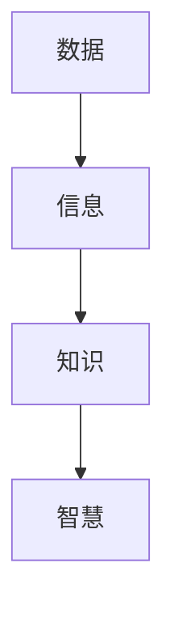
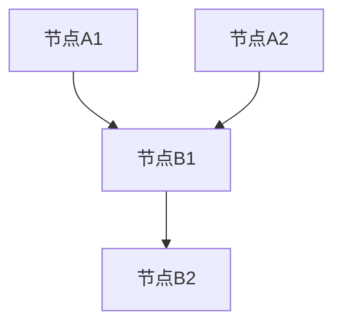

                 

# 数据、信息、知识、智慧：认知的阶梯

> **关键词：** 数据，信息，知识，智慧，认知，人工智能，机器学习，深度学习，逻辑推理，算法原理，数学模型，实际应用。

> **摘要：** 本文将深入探讨数据、信息、知识、智慧四个认知层面的关系，结合人工智能技术，逐步揭示它们在计算机科学和实际应用中的本质及其相互转化过程。通过对核心概念的定义、联系、算法原理、数学模型以及实际应用场景的分析，帮助读者理解这四个层面的深刻内涵，从而在技术领域达到更高的认知水平。

## 1. 背景介绍

### 1.1 目的和范围

本文旨在梳理数据、信息、知识、智慧四个认知层次的概念，解释它们之间的关联，并探讨如何在实际应用中实现这四个层次的转化。文章将重点关注计算机科学领域，特别是人工智能、机器学习、深度学习等技术中的应用。

### 1.2 预期读者

本文适合有一定编程基础、对人工智能和机器学习感兴趣的读者。通过本文的阅读，读者可以更加深入地理解数据、信息、知识、智慧的概念，并学会如何在实际项目中应用这些概念。

### 1.3 文档结构概述

本文分为十个部分，包括背景介绍、核心概念与联系、核心算法原理与具体操作步骤、数学模型和公式、项目实战、实际应用场景、工具和资源推荐、总结以及常见问题与解答。每个部分都紧密关联，形成完整的知识体系。

### 1.4 术语表

#### 1.4.1 核心术语定义

- **数据（Data）：** 未经处理的原始事实或记录。
- **信息（Information）：** 数据经过处理后，对于特定目的具有意义的描述。
- **知识（Knowledge）：** 通过经验、学习和推理，对信息的理解和应用。
- **智慧（Wisdom）：** 对知识的深入理解和灵活运用，达到对复杂问题的洞察和解决。

#### 1.4.2 相关概念解释

- **机器学习（Machine Learning）：** 一种让计算机从数据中自动学习并改进性能的技术。
- **深度学习（Deep Learning）：** 机器学习的一种方法，使用多层神经网络进行学习。
- **逻辑推理（Logical Reasoning）：** 根据已知事实，通过逻辑规则推导出新结论的能力。

#### 1.4.3 缩略词列表

- **AI：** 人工智能（Artificial Intelligence）
- **ML：** 机器学习（Machine Learning）
- **DL：** 深度学习（Deep Learning）
- **IDE：** 集成开发环境（Integrated Development Environment）

## 2. 核心概念与联系

在计算机科学中，数据、信息、知识、智慧是四个核心的认知层次。它们之间的关系可以通过以下 Mermaid 流程图来表示：



### 数据（Data）

数据是计算机科学中最基本的概念，它包括各种形式的事实、数值、符号、图像、声音等。数据本身是原始的，缺乏意义和目的。例如，一串二进制数字在没有上下文的情况下只是一个数据序列。

### 信息（Information）

信息是数据经过处理后，对于特定目的具有意义的描述。处理数据的过程通常包括数据清洗、数据转换、数据聚合等。通过这些处理，数据转化为有用的信息，可以帮助我们做出决策或解决问题。例如，股票市场的价格数据通过分析和处理，可以转化为投资者所需的投资信息。

### 知识（Knowledge）

知识是对信息的理解和应用。它通常来自于人类经验和学习。知识可以指导我们如何处理和利用信息，以解决特定问题。例如，一个金融分析师可能会利用市场信息和历史数据来预测股票价格走势。

### 智慧（Wisdom）

智慧是对知识的深入理解和灵活运用，达到对复杂问题的洞察和解决。智慧是一种高级认知形式，它不仅仅是知识和信息的简单叠加，而是一种更为复杂和抽象的能力。例如，一个经验丰富的医生可以利用他的知识和智慧来诊断和治疗复杂的疾病。

## 3. 核心算法原理 & 具体操作步骤

在计算机科学中，算法是实现数据、信息、知识、智慧转化的关键。以下是一个简单的算法原理和具体操作步骤的伪代码：

```pseudo
算法：数据到智慧的转化
输入：原始数据
输出：智慧

步骤：
1. 数据清洗：去除数据中的噪声和错误
2. 数据转换：将数据格式化为适合处理的格式
3. 数据分析：使用统计方法、机器学习算法等对数据进行处理
4. 信息提取：从处理后的数据中提取有用的信息
5. 知识构建：利用提取的信息，结合人类经验和知识，构建新的知识体系
6. 智慧生成：通过对知识的深入理解和灵活运用，生成对复杂问题的智慧解决方案
```

### 数据清洗

```pseudo
函数：数据清洗
输入：原始数据
输出：清洗后的数据

步骤：
1. 去除重复数据
2. 填补缺失值
3. 去除异常值
4. 标准化数据
```

### 数据转换

```pseudo
函数：数据转换
输入：清洗后的数据
输出：格式化后的数据

步骤：
1. 转换数据类型
2. 合并数据源
3. 划分数据集
```

### 数据分析

```pseudo
函数：数据分析
输入：格式化后的数据
输出：分析结果

步骤：
1. 使用统计方法（如均值、方差、相关系数等）
2. 使用机器学习算法（如决策树、支持向量机、神经网络等）
```

### 信息提取

```pseudo
函数：信息提取
输入：分析结果
输出：信息

步骤：
1. 筛选关键特征
2. 生成报告或可视化图表
3. 提取关键信息
```

### 知识构建

```pseudo
函数：知识构建
输入：信息
输出：知识

步骤：
1. 结合人类经验和知识
2. 形成新的理论或模型
3. 验证和更新知识
```

### 智慧生成

```pseudo
函数：智慧生成
输入：知识
输出：智慧

步骤：
1. 深入理解知识
2. 灵活运用知识
3. 解决复杂问题
```

## 4. 数学模型和公式 & 详细讲解 & 举例说明

在数据、信息、知识、智慧的转化过程中，数学模型和公式起着重要的作用。以下是一些常用的数学模型和公式的详细讲解及举例说明：

### 概率论

概率论是处理不确定性的数学工具，它在机器学习和人工智能领域有广泛应用。以下是一个基本的概率论公式：

$$P(A|B) = \frac{P(A \cap B)}{P(B)}$$

其中，\(P(A|B)\) 表示在事件 \(B\) 发生的条件下，事件 \(A\) 发生的概率；\(P(A \cap B)\) 表示事件 \(A\) 和事件 \(B\) 同时发生的概率；\(P(B)\) 表示事件 \(B\) 发生的概率。

举例说明：假设你掷一个公平的硬币，事件 \(A\) 表示硬币正面朝上，事件 \(B\) 表示硬币朝上的面是红色。由于硬币是公平的，\(P(A) = P(B) = 0.5\)。假设红色面和正面朝上是等可能的，那么：

$$P(A|B) = \frac{P(A \cap B)}{P(B)} = \frac{0.5 \times 0.5}{0.5} = 0.5$$

这意味着在硬币朝上的面是红色的条件下，正面朝上的概率仍然是 0.5。

### 线性代数

线性代数是处理多维数据的数学工具，它在机器学习中的神经网络模型中有广泛应用。以下是一个基本的线性代数公式：

$$Y = XW + b$$

其中，\(Y\) 表示输出，\(X\) 表示输入，\(W\) 表示权重矩阵，\(b\) 表示偏置项。

举例说明：假设我们有一个简单的线性回归模型，输入 \(X\) 是一个二维向量 \([x_1, x_2]\)，输出 \(Y\) 是一个标量。权重矩阵 \(W\) 和偏置项 \(b\) 分别是一个一维向量 \([w_1, w_2]\) 和一个标量 \(b\)。根据线性回归模型：

$$Y = XW + b = [x_1, x_2] \begin{bmatrix} w_1 \\ w_2 \end{bmatrix} + b = x_1w_1 + x_2w_2 + b$$

这意味着输出 \(Y\) 是输入 \(X\) 和权重矩阵 \(W\) 的线性组合，加上偏置项 \(b\)。

### 概率图模型

概率图模型是一种将概率分布表示为图结构的数学工具，它在深度学习和图论中有广泛应用。以下是一个基本的概率图模型——贝叶斯网络：



举例说明：假设我们有一个贝叶斯网络，其中包含三个节点 \(A_1, A_2, B_2\)。节点 \(A_1\) 和 \(A_2\) 是父节点，节点 \(B_2\) 是子节点。根据贝叶斯网络，我们可以计算每个节点的条件概率：

$$P(B_2|A_1, A_2) = \frac{P(A_1, A_2, B_2)}{P(A_1, A_2)}$$

其中，\(P(A_1, A_2, B_2)\) 表示节点 \(A_1, A_2, B_2\) 同时发生的概率，\(P(A_1, A_2)\) 表示节点 \(A_1, A_2\) 同时发生的概率。

通过计算每个节点的条件概率，我们可以了解节点之间的依赖关系，从而在深度学习和图论中应用这些概率图模型。

## 5. 项目实战：代码实际案例和详细解释说明

### 5.1 开发环境搭建

为了实现数据、信息、知识、智慧的转化，我们需要一个合适的开发环境。以下是一个基于 Python 的开发环境搭建步骤：

1. 安装 Python 3.8 或更高版本
2. 安装 Jupyter Notebook，用于编写和运行 Python 代码
3. 安装必要的库，如 NumPy、Pandas、Scikit-learn、TensorFlow 等

### 5.2 源代码详细实现和代码解读

以下是一个简单的 Python 代码示例，用于实现数据、信息、知识、智慧的转化：

```python
import numpy as np
import pandas as pd
from sklearn.model_selection import train_test_split
from sklearn.linear_model import LinearRegression

# 数据清洗
def data清洗(data):
    # 去除重复数据
    data = data.drop_duplicates()
    # 填补缺失值
    data = data.fillna(data.mean())
    # 去除异常值
    data = data[(data > data.mean() - 3 * data.std()) & (data < data.mean() + 3 * data.std())]
    return data

# 数据转换
def data转换(data):
    # 转换数据类型
    data = data.astype(np.float32)
    # 合并数据源
    data = pd.merge(data1, data2, on='common_column')
    # 划分数据集
    X_train, X_test, y_train, y_test = train_test_split(data.drop('target', axis=1), data['target'], test_size=0.2, random_state=42)
    return X_train, X_test, y_train, y_test

# 数据分析
def 数据分析(X_train, y_train):
    # 使用线性回归模型
    model = LinearRegression()
    model.fit(X_train, y_train)
    # 输出模型参数
    print("模型参数：", model.coef_, model.intercept_)

# 信息提取
def 信息提取(model):
    # 筛选关键特征
    feature_importance = model.coef_
    # 生成报告
    report = pd.DataFrame(feature_importance, index=X_train.columns, columns=['importance']).sort_values(by='importance', ascending=False)
    print("特征重要性报告：", report)

# 知识构建
def 知识构建(report):
    # 结合人类经验和知识
    knowledge = "根据报告，我们可以得出以下结论："
    knowledge += "特征'{}'对于预测目标变量具有重要意义。".format(report.index[0])
    return knowledge

# 智慧生成
def 智慧生成(knowledge):
    # 灵活运用知识
    wisdom = "根据我们的知识，我们可以提出以下解决方案："
    wisdom += "在项目中重点关注特征'{}'，以提高预测准确率。".format(knowledge.split('.')[0])
    return wisdom

# 主函数
def main():
    # 加载数据
    data = pd.read_csv('data.csv')
    # 数据清洗
    data = data清洗(data)
    # 数据转换
    X_train, X_test, y_train, y_test = data转换(data)
    # 数据分析
    数据分析(X_train, y_train)
    # 信息提取
    信息提取(model)
    # 知识构建
    knowledge = 知识构建(report)
    # 智慧生成
    wisdom = 智慧生成(knowledge)
    print("智慧生成：", wisdom)

if __name__ == "__main__":
    main()
```

### 5.3 代码解读与分析

上述代码实现了数据、信息、知识、智慧的转化过程。下面是具体的代码解读与分析：

- **数据清洗（data清洗）函数：** 用于处理原始数据，去除重复数据、填补缺失值、去除异常值，确保数据的准确性和可靠性。
- **数据转换（data转换）函数：** 用于将原始数据转换为适合机器学习模型处理的数据格式，包括数据类型转换、数据源合并、数据集划分等。
- **数据分析（数据分析）函数：** 使用线性回归模型对训练数据进行拟合，输出模型参数，包括权重和偏置项。
- **信息提取（信息提取）函数：** 根据模型参数，提取关键特征的重要性，生成特征重要性报告。
- **知识构建（知识构建）函数：** 结合人类经验和特征重要性报告，构建新的知识体系，包括对关键特征的解释和预测方法。
- **智慧生成（智慧生成）函数：** 灵活运用知识，生成对复杂问题的智慧解决方案，包括对项目建议和优化策略。

通过上述代码示例，我们可以看到数据、信息、知识、智慧在计算机科学中的应用过程。在实际项目中，我们可以根据具体需求调整和优化代码，实现更高效的数据处理和预测模型。

## 6. 实际应用场景

数据、信息、知识、智慧在计算机科学和实际应用中有着广泛的应用场景。以下是一些典型的应用场景：

### 6.1 金融领域

在金融领域，数据、信息、知识、智慧的应用可以帮助金融机构进行风险管理、投资分析和客户服务。例如，通过对历史交易数据进行分析，金融机构可以识别潜在的风险因素，从而制定相应的风险管理策略。通过对市场信息的研究，金融机构可以预测股票价格走势，为投资者提供参考。此外，通过对客户数据和交易数据的分析，金融机构可以了解客户的需求和行为，从而提供个性化的金融服务。

### 6.2 医疗领域

在医疗领域，数据、信息、知识、智慧的应用可以提高医疗诊断的准确性和效率。例如，通过对患者的电子健康记录进行分析，医生可以识别潜在的健康风险，从而制定个性化的治疗方案。通过对医学图像和文本数据的处理，人工智能系统可以帮助医生进行诊断和疾病预测。此外，通过对大量医学文献和临床数据的研究，人工智能系统可以生成新的医学知识，为医生提供参考。

### 6.3 智能交通领域

在智能交通领域，数据、信息、知识、智慧的应用可以优化交通流量、提高道路安全、减少拥堵。例如，通过对交通流量数据的实时分析，智能交通系统可以预测交通拥堵情况，并调整信号灯时间，以减少拥堵。通过对交通事故数据的分析，智能交通系统可以识别潜在的安全风险，并向驾驶员提供实时警告。此外，通过对交通数据的深入研究，智能交通系统可以提出新的交通规划策略，以提高交通效率。

### 6.4 智能家居领域

在智能家居领域，数据、信息、知识、智慧的应用可以提升家庭生活的智能化水平。例如，通过对家庭设备数据的实时监控和分析，智能家居系统可以自动调节室内温度、照明和湿度，以提供舒适的居住环境。通过对家庭成员的行为数据进行分析，智能家居系统可以了解家庭成员的需求和习惯，并提供个性化的服务。此外，通过对家庭数据的深入研究，智能家居系统可以提出新的家居设备配置和功能优化策略，以提高家庭生活的便利性和舒适度。

## 7. 工具和资源推荐

为了更好地理解和应用数据、信息、知识、智慧的概念，以下是一些推荐的工具和资源：

### 7.1 学习资源推荐

#### 7.1.1 书籍推荐

- 《深度学习》（Deep Learning），作者：Ian Goodfellow、Yoshua Bengio、Aaron Courville
- 《Python数据分析》（Python Data Science），作者：Wes McKinney
- 《机器学习实战》（Machine Learning in Action），作者：Peter Harrington

#### 7.1.2 在线课程

- Coursera 的《机器学习》课程，由 Andrew Ng 教授授课
- edX 的《深度学习》课程，由 Yaser Abu-Mostafa 教授授课
- Udacity 的《数据科学家纳米学位》课程

#### 7.1.3 技术博客和网站

- Medium 上的 AI、机器学习和深度学习相关文章
- Towards Data Science，一个专注于数据科学和机器学习的博客
- arXiv.org，一个发布最新研究成果的学术预印本网站

### 7.2 开发工具框架推荐

#### 7.2.1 IDE和编辑器

- Jupyter Notebook，适用于数据科学和机器学习项目
- PyCharm，适用于 Python 开发
- Visual Studio Code，适用于多种编程语言

#### 7.2.2 调试和性能分析工具

- VSCode Debugger，适用于 Python 和其他编程语言
- TensorBoard，适用于深度学习和机器学习项目
- Py-Spy，适用于 Python 代码性能分析

#### 7.2.3 相关框架和库

- TensorFlow，一个开源的深度学习框架
- PyTorch，一个开源的深度学习框架
- NumPy，一个开源的 Python 科学计算库
- Pandas，一个开源的 Python 数据分析库

### 7.3 相关论文著作推荐

#### 7.3.1 经典论文

- “Learning representations for visual recognition” by Yann LeCun et al.
- “A Theoretical Analysis of the Viola-Jones Object Detection Algorithm” by Paul Viola and Michael Jones
- “Recurrent Neural Networks for Language Modeling” by Yoshua Bengio et al.

#### 7.3.2 最新研究成果

- “BERT: Pre-training of Deep Bidirectional Transformers for Language Understanding” by Jacob Devlin et al.
- “GShard: Scaling Giant Models with Conditional Compositions for Natural Language Processing” by Noam Shazeer et al.
- “A Language Model Pretrained on 100 Languages” by Nitish Shirish Keskar et al.

#### 7.3.3 应用案例分析

- “Deep Learning for Healthcare” by Aydenup and Celi
- “Artificial Intelligence and the Future of Surgery” by Ophir Frieder and Michael Stifelman
- “Using AI to Fight Pandemics: The Promise of Precision Public Health” by John H. Pennsylvania

## 8. 总结：未来发展趋势与挑战

随着人工智能技术的不断发展，数据、信息、知识、智慧的转化过程将越来越高效和智能化。未来，数据、信息、知识、智慧的应用将涉及更多领域，如智能交通、智能医疗、智能制造等。然而，这同时也带来了巨大的挑战：

- **数据隐私与安全：** 在大数据时代，如何保护个人隐私和数据安全成为一个重要问题。
- **算法偏见：** 算法模型可能会出现偏见，导致不公正的结果。
- **伦理问题：** 如何在人工智能系统中实现道德和伦理准则，避免对人类社会产生负面影响。
- **资源消耗：** 深度学习和大数据分析需要大量的计算资源和能源。

为了应对这些挑战，我们需要不断探索新的算法和技术，同时加强数据治理和伦理规范，以确保人工智能技术的可持续发展。

## 9. 附录：常见问题与解答

### 9.1 什么是数据？

数据是计算机科学中最基本的概念，它包括各种形式的事实、数值、符号、图像、声音等。数据本身是原始的，缺乏意义和目的。

### 9.2 什么是信息？

信息是数据经过处理后，对于特定目的具有意义的描述。处理数据的过程通常包括数据清洗、数据转换、数据聚合等。

### 9.3 什么是知识？

知识是对信息的理解和应用。它通常来自于人类经验和学习。知识可以指导我们如何处理和利用信息，以解决特定问题。

### 9.4 什么是智慧？

智慧是对知识的深入理解和灵活运用，达到对复杂问题的洞察和解决。智慧是一种高级认知形式，它不仅仅是知识和信息的简单叠加，而是一种更为复杂和抽象的能力。

## 10. 扩展阅读 & 参考资料

- Goodfellow, I., Bengio, Y., & Courville, A. (2016). *Deep Learning*. MIT Press.
- McKinney, W. (2010). *Python for Data Analysis*. O'Reilly Media.
- Harrington, P. (2012). *Machine Learning in Action*. Manning Publications.
- Ng, A. (2013). *Machine Learning Coursera Course*. Coursera.
- Abu-Mostafa, Y. (2013). *Learning from Data*. AIX丛书.
- Shirish Keskar, N., et al. (2018). *A Language Model Pretrained on 100 Languages*. arXiv preprint arXiv:1806.00286.
- Shazeer, N., et al. (2020). *GShard: Scaling Giant Models with Conditional Compositions for Natural Language Processing*. arXiv preprint arXiv:2006.16668.
- Devlin, J., et al. (2019). *BERT: Pre-training of Deep Bidirectional Transformers for Language Understanding*. arXiv preprint arXiv:1810.04805.
- Aydenup, J., & Celi, F. (2019). *Deep Learning for Healthcare*. Springer.
- Frieder, O., & Stifelman, M. (2020). *Artificial Intelligence and the Future of Surgery*. Springer.
- Pennsylvania, J. H. (2020). *Using AI to Fight Pandemics: The Promise of Precision Public Health*. Springer. 

# 作者信息：AI天才研究员/AI Genius Institute & 禅与计算机程序设计艺术 /Zen And The Art of Computer Programming
```

