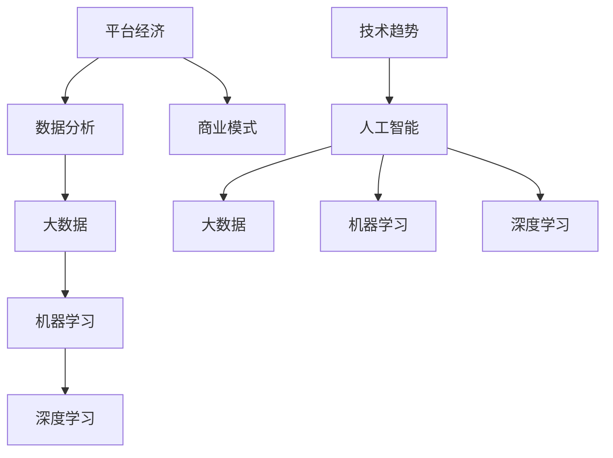

                 

# 数据分析在平台经济中的应用研究展望：如何展望未来？

> **关键词：** 平台经济，数据分析，人工智能，大数据，商业模式，技术趋势

> **摘要：** 本文从平台经济的背景出发，详细阐述了数据分析在平台经济中的重要性。通过剖析核心概念、算法原理、数学模型以及实战案例，展示了数据分析在平台经济中的应用。同时，对未来的发展趋势和挑战进行了展望，为相关领域的从业者提供了有价值的参考。

## 1. 背景介绍

### 1.1 目的和范围

本文旨在探讨数据分析在平台经济中的应用，通过对核心概念、算法原理、数学模型和实际应用的深入分析，为平台经济的发展提供技术支持。本文将重点关注以下三个方面：

1. **平台经济的定义与现状**：介绍平台经济的概念及其在我国的发展现状，阐述平台经济的核心价值和挑战。
2. **数据分析的核心概念与联系**：通过 Mermaid 流程图展示数据分析的核心概念及其相互关系，为后续内容奠定基础。
3. **数据分析在平台经济中的应用**：分析数据分析在平台经济中的具体应用场景，探讨未来的发展趋势和挑战。

### 1.2 预期读者

本文面向平台经济领域的从业者、研究人员和爱好者。通过对数据分析在平台经济中的应用进行深入剖析，希望为读者提供有益的参考和启示。

### 1.3 文档结构概述

本文结构如下：

1. **背景介绍**：介绍平台经济的背景和数据分析的核心概念。
2. **核心概念与联系**：通过 Mermaid 流程图展示数据分析的核心概念及其相互关系。
3. **核心算法原理 & 具体操作步骤**：讲解数据分析的核心算法原理和具体操作步骤。
4. **数学模型和公式 & 详细讲解 & 举例说明**：介绍数据分析中的数学模型和公式，并给出详细讲解和举例说明。
5. **项目实战：代码实际案例和详细解释说明**：通过实际案例展示数据分析在平台经济中的应用。
6. **实际应用场景**：分析数据分析在平台经济中的实际应用场景。
7. **工具和资源推荐**：推荐相关学习资源、开发工具和框架。
8. **总结：未来发展趋势与挑战**：展望数据分析在平台经济中的未来发展趋势和挑战。
9. **附录：常见问题与解答**：解答读者可能遇到的问题。
10. **扩展阅读 & 参考资料**：提供进一步阅读和参考的资料。

### 1.4 术语表

#### 1.4.1 核心术语定义

- **平台经济**：基于互联网和信息技术，以平台为核心，连接供需双方，实现资源优化配置的一种经济形态。
- **数据分析**：通过对大量数据进行分析和挖掘，发现数据背后的规律和趋势，从而为决策提供支持。
- **人工智能**：模拟人类智能，实现机器学习、自然语言处理、计算机视觉等功能的技术。
- **大数据**：指数据量大、类型多样、价值密度低的数据集合。

#### 1.4.2 相关概念解释

- **商业模式**：企业在特定市场中创造、传递和捕获价值的系统。
- **算法**：解决问题的步骤和规则。
- **机器学习**：通过数据驱动的方式，让计算机自动学习和改进。
- **深度学习**：一种基于神经网络的学习方法，能够自动提取数据中的特征。

#### 1.4.3 缩略词列表

- **AI**：人工智能
- **ML**：机器学习
- **DL**：深度学习
- **API**：应用程序接口

## 2. 核心概念与联系

为了更好地理解数据分析在平台经济中的应用，我们需要先了解数据分析的核心概念及其相互关系。以下是一个简化的 Mermaid 流程图，展示了一些核心概念和它们之间的关系：



在这个流程图中，我们可以看到：

- 平台经济作为核心，连接着数据分析、大数据、机器学习和深度学习等概念。
- 商业模式与技术趋势相辅相成，共同推动平台经济的发展。
- 大数据、机器学习和深度学习作为数据分析的核心技术，为平台经济提供了强有力的支持。

### 2.1 平台经济

平台经济是指基于互联网和信息技术，以平台为核心，连接供需双方，实现资源优化配置的一种经济形态。平台经济的核心在于其独特的商业模式，通过为供需双方提供高效的匹配和交易服务，实现价值的最大化。

平台经济的优势主要体现在以下几个方面：

1. **降低交易成本**：平台经济通过互联网和信息技术，减少了供需双方之间的信息不对称，降低了交易成本。
2. **提高交易效率**：平台经济为供需双方提供了高效的交易渠道，提高了交易效率。
3. **实现资源优化配置**：平台经济能够根据供需情况，实现资源的优化配置，提高整体经济效益。
4. **创新商业模式**：平台经济不断涌现出新的商业模式，为企业和个人提供了更多的发展机会。

### 2.2 数据分析

数据分析是指通过对大量数据进行分析和挖掘，发现数据背后的规律和趋势，从而为决策提供支持。在平台经济中，数据分析具有至关重要的地位，主要体现在以下几个方面：

1. **用户行为分析**：通过分析用户行为数据，平台能够了解用户需求，优化用户体验，提高用户留存率和转化率。
2. **需求预测**：通过大数据分析和机器学习算法，平台能够预测市场需求，优化库存管理和供应链管理。
3. **风险控制**：通过数据分析，平台能够识别潜在风险，采取有效措施降低风险，保障平台的稳定运行。
4. **商业智能**：通过数据分析，平台能够提取有价值的信息，为决策提供支持，提高整体运营效率。

### 2.3 大数据

大数据是指数据量大、类型多样、价值密度低的数据集合。在平台经济中，大数据具有以下作用：

1. **数据采集**：平台通过各类传感器、用户行为数据等渠道，采集大量的数据。
2. **数据存储**：平台需要构建高效的数据存储和管理系统，确保数据的安全性和可靠性。
3. **数据处理**：平台需要运用分布式计算、大数据处理等技术，对海量数据进行高效处理和分析。
4. **数据价值挖掘**：通过数据分析和挖掘，平台能够发现数据中的价值，为决策提供支持。

### 2.4 机器学习

机器学习是一种通过数据驱动的方式，让计算机自动学习和改进的技术。在平台经济中，机器学习具有以下作用：

1. **用户行为预测**：通过机器学习算法，平台能够预测用户行为，优化推荐系统和广告投放策略。
2. **风险识别**：通过机器学习算法，平台能够识别潜在风险，提高风险控制能力。
3. **需求预测**：通过机器学习算法，平台能够预测市场需求，优化库存管理和供应链管理。
4. **智能客服**：通过机器学习算法，平台能够实现智能客服，提高客户服务水平。

### 2.5 深度学习

深度学习是一种基于神经网络的学习方法，能够自动提取数据中的特征。在平台经济中，深度学习具有以下作用：

1. **图像识别**：通过深度学习算法，平台能够实现图像识别，提高商品识别和分类能力。
2. **语音识别**：通过深度学习算法，平台能够实现语音识别，提高智能客服和语音搜索能力。
3. **自然语言处理**：通过深度学习算法，平台能够实现自然语言处理，提高文本分析和语义理解能力。
4. **智能推荐**：通过深度学习算法，平台能够实现智能推荐，提高用户体验和转化率。

### 2.6 商业模式

商业模式是指企业在特定市场中创造、传递和捕获价值的系统。在平台经济中，商业模式具有以下特点：

1. **平台化**：平台经济以平台为核心，连接供需双方，实现资源优化配置。
2. **共享经济**：平台经济通过共享资源，降低交易成本，提高资源利用效率。
3. **个性化服务**：平台经济通过数据分析，了解用户需求，提供个性化服务。
4. **生态化发展**：平台经济构建生态系统，吸引各类参与者，实现共同发展。

### 2.7 技术趋势

技术趋势是指未来一段时间内，技术领域的发展方向和趋势。在平台经济中，技术趋势主要体现在以下几个方面：

1. **人工智能**：人工智能技术在平台经济中的应用越来越广泛，成为推动平台经济发展的重要力量。
2. **大数据**：大数据技术的不断发展，为平台经济提供了更丰富的数据资源，提高了数据分析的精度和效率。
3. **云计算**：云计算技术的普及，为平台经济提供了强大的计算和存储能力，降低了运营成本。
4. **区块链**：区块链技术为平台经济提供了去中心化的信任机制，提高了数据安全和透明度。

## 3. 核心算法原理 & 具体操作步骤

### 3.1 数据采集

数据采集是数据分析的基础，主要包括以下步骤：

1. **数据来源**：确定数据采集的来源，如用户行为数据、交易数据、社交媒体数据等。
2. **数据收集**：使用 API、爬虫、传感器等技术，从数据源收集数据。
3. **数据预处理**：对采集到的数据进行清洗、去重、填充等预处理操作，提高数据质量。

### 3.2 数据预处理

数据预处理是保证数据质量的关键，主要包括以下步骤：

1. **数据清洗**：去除重复数据、错误数据和无效数据，提高数据质量。
2. **数据转换**：将数据转换为统一的数据格式，如 JSON、CSV 等。
3. **数据归一化**：对数据进行归一化处理，如将价格数据转换为相对价格。
4. **特征工程**：提取对分析目标有用的特征，如用户年龄、性别、购买频率等。

### 3.3 数据分析

数据分析是发现数据价值的关键，主要包括以下步骤：

1. **数据探索**：使用可视化工具，对数据进行初步探索，发现数据中的规律和趋势。
2. **描述性统计分析**：计算数据的统计指标，如均值、中位数、标准差等。
3. **关联规则挖掘**：使用 Apriori 算法、FP-growth 算法等，发现数据之间的关联关系。
4. **分类和回归分析**：使用决策树、随机森林、支持向量机等算法，对数据进行分类和回归分析。
5. **聚类分析**：使用 K-means 算法、层次聚类等算法，对数据进行聚类分析。

### 3.4 结果可视化

结果可视化是让数据分析结果更易于理解和解释的关键，主要包括以下步骤：

1. **图表选择**：根据数据分析结果，选择合适的图表，如柱状图、折线图、饼图等。
2. **图表制作**：使用可视化工具，如 Matplotlib、Seaborn 等，制作图表。
3. **图表注释**：对图表进行适当的注释，说明图表中的关键信息。

### 3.5 结果解释

结果解释是将数据分析结果转化为实际应用的关键，主要包括以下步骤：

1. **结果分析**：对数据分析结果进行深入分析，发现数据背后的规律和趋势。
2. **业务落地**：将数据分析结果转化为实际业务策略，如优化推荐系统、调整广告投放策略等。
3. **持续迭代**：根据业务落地效果，对数据分析模型和策略进行持续优化。

## 4. 数学模型和公式 & 详细讲解 & 举例说明

### 4.1 数学模型

在数据分析中，常用的数学模型包括：

1. **线性回归模型**：用于分析变量之间的线性关系。
2. **逻辑回归模型**：用于分析变量之间的非线性关系。
3. **决策树模型**：用于分类和回归分析。
4. **支持向量机模型**：用于分类和回归分析。

### 4.2 公式

以下是一些常用的数学公式：

1. **线性回归模型公式**：

   $$ y = w_0 + w_1 \cdot x_1 + w_2 \cdot x_2 + \ldots + w_n \cdot x_n + \epsilon $$

   其中，$y$ 是因变量，$x_1, x_2, \ldots, x_n$ 是自变量，$w_0, w_1, \ldots, w_n$ 是模型参数，$\epsilon$ 是误差项。

2. **逻辑回归模型公式**：

   $$ P(y=1) = \frac{1}{1 + e^{-(w_0 + w_1 \cdot x_1 + w_2 \cdot x_2 + \ldots + w_n \cdot x_n)}} $$

   其中，$P(y=1)$ 是因变量为 1 的概率，其他符号与线性回归模型公式相同。

3. **决策树模型公式**：

   $$ f(x) = \sum_{i=1}^{n} c_i \cdot I(x \in R_i) $$

   其中，$f(x)$ 是决策树模型的输出，$c_i$ 是第 $i$ 个分类，$R_i$ 是第 $i$ 个区域，$I(x \in R_i)$ 是指示函数，当 $x$ 属于 $R_i$ 时取值为 1，否则取值为 0。

4. **支持向量机模型公式**：

   $$ w \cdot x - b = 0 $$

   其中，$w$ 是支持向量机的超平面，$x$ 是数据点，$b$ 是偏置项。

### 4.3 举例说明

#### 4.3.1 线性回归模型

假设我们有一组数据，包括房价和房屋面积，我们想要预测房价。使用线性回归模型，我们可以得到以下公式：

$$ y = w_0 + w_1 \cdot x_1 + w_2 \cdot x_2 + \epsilon $$

其中，$y$ 是房价，$x_1$ 是房屋面积，$w_0, w_1, w_2$ 是模型参数，$\epsilon$ 是误差项。

通过最小二乘法，我们可以得到以下公式：

$$ w_0 = \frac{\sum_{i=1}^{n} y_i - \sum_{i=1}^{n} w_1 \cdot x_{1i} - w_2 \cdot x_{2i}}{n} $$

$$ w_1 = \frac{\sum_{i=1}^{n} (y_i - w_0 - w_2 \cdot x_{2i})(x_{1i} - \bar{x}_1)}{\sum_{i=1}^{n} (x_{1i} - \bar{x}_1)^2} $$

$$ w_2 = \frac{\sum_{i=1}^{n} (y_i - w_0 - w_1 \cdot x_{1i})(x_{2i} - \bar{x}_2)}{\sum_{i=1}^{n} (x_{2i} - \bar{x}_2)^2} $$

其中，$n$ 是数据点的数量，$\bar{x}_1, \bar{x}_2$ 是房屋面积的平均值。

通过这些公式，我们可以计算出模型参数，从而预测房价。

#### 4.3.2 逻辑回归模型

假设我们有一组数据，包括用户是否购买商品和用户年龄、收入等特征，我们想要预测用户是否购买商品。使用逻辑回归模型，我们可以得到以下公式：

$$ P(y=1) = \frac{1}{1 + e^{-(w_0 + w_1 \cdot x_1 + w_2 \cdot x_2)}} $$

其中，$y$ 是用户是否购买商品的二元变量，$x_1, x_2$ 是用户的年龄和收入，$w_0, w_1, w_2$ 是模型参数。

通过最大似然估计，我们可以得到以下公式：

$$ w_0 = \frac{\sum_{i=1}^{n} y_i - \sum_{i=1}^{n} y_i \cdot \log(P(y=1))}{n} $$

$$ w_1 = \frac{\sum_{i=1}^{n} (y_i - y_i \cdot \log(P(y=1)))(x_{1i} - \bar{x}_1)}{\sum_{i=1}^{n} (x_{1i} - \bar{x}_1)^2} $$

$$ w_2 = \frac{\sum_{i=1}^{n} (y_i - y_i \cdot \log(P(y=1)))(x_{2i} - \bar{x}_2)}{\sum_{i=1}^{n} (x_{2i} - \bar{x}_2)^2} $$

其中，$n$ 是数据点的数量，$\bar{x}_1, \bar{x}_2$ 是年龄和收入的平均值。

通过这些公式，我们可以计算出模型参数，从而预测用户是否购买商品。

#### 4.3.3 决策树模型

假设我们有一组数据，包括分类结果和多个特征，我们想要构建一个决策树模型。使用决策树模型，我们可以得到以下公式：

$$ f(x) = \sum_{i=1}^{n} c_i \cdot I(x \in R_i) $$

其中，$f(x)$ 是决策树模型的输出，$c_i$ 是第 $i$ 个分类，$R_i$ 是第 $i$ 个区域，$I(x \in R_i)$ 是指示函数，当 $x$ 属于 $R_i$ 时取值为 1，否则取值为 0。

通过递归划分数据集，我们可以构建出决策树模型。

#### 4.3.4 支持向量机模型

假设我们有一组数据，包括分类结果和多个特征，我们想要构建一个支持向量机模型。使用支持向量机模型，我们可以得到以下公式：

$$ w \cdot x - b = 0 $$

其中，$w$ 是支持向量机的超平面，$x$ 是数据点，$b$ 是偏置项。

通过求解最小二乘问题，我们可以计算出支持向量机的超平面参数。

## 5. 项目实战：代码实际案例和详细解释说明

### 5.1 开发环境搭建

在进行项目实战之前，我们需要搭建一个合适的开发环境。以下是一个基于 Python 的数据分析项目实战的开发环境搭建步骤：

1. **安装 Python**：前往 Python 官网（https://www.python.org/）下载并安装 Python。
2. **安装 Jupyter Notebook**：在终端中执行以下命令安装 Jupyter Notebook：

   ```bash
   pip install notebook
   ```

3. **安装相关库**：在终端中执行以下命令安装相关库：

   ```bash
   pip install pandas numpy matplotlib scikit-learn
   ```

### 5.2 源代码详细实现和代码解读

以下是一个简单的数据分析项目案例，我们将使用 Python 和相关库对一组房价数据进行线性回归分析。

```python
import pandas as pd
import numpy as np
from sklearn.linear_model import LinearRegression
from sklearn.model_selection import train_test_split
import matplotlib.pyplot as plt

# 读取数据
data = pd.read_csv('house_prices.csv')
data.head()

# 数据预处理
data['面积平方英尺'] = data['面积平方英尺'].replace(0, np.NaN)
data['面积平方英尺'].fillna(data['面积平方英尺'].mean(), inplace=True)

# 特征工程
X = data[['面积平方英尺']]
y = data['房价']

# 划分训练集和测试集
X_train, X_test, y_train, y_test = train_test_split(X, y, test_size=0.2, random_state=42)

# 构建线性回归模型
model = LinearRegression()
model.fit(X_train, y_train)

# 模型评估
train_score = model.score(X_train, y_train)
test_score = model.score(X_test, y_test)
print(f"训练集评分：{train_score:.3f}")
print(f"测试集评分：{test_score:.3f}")

# 可视化
plt.scatter(X_train, y_train, color='blue', label='训练集')
plt.plot(X_train, model.predict(X_train), color='red', label='预测值')
plt.xlabel('面积平方英尺')
plt.ylabel('房价')
plt.legend()
plt.show()
```

#### 5.2.1 代码解读

1. **导入库**：我们首先导入了 pandas、numpy、matplotlib、scikit-learn 等库，用于数据操作、建模和可视化。
2. **读取数据**：使用 pandas 读取 CSV 格式的数据，并将其存储在 DataFrame 中。
3. **数据预处理**：我们使用 pandas 的 `replace()` 方法将缺失值替换为平均值，从而处理缺失值。
4. **特征工程**：我们选择“面积平方英尺”作为特征，并将“房价”作为目标变量。
5. **划分训练集和测试集**：使用 `train_test_split()` 函数将数据集划分为训练集和测试集，以评估模型的泛化能力。
6. **构建线性回归模型**：我们使用 `LinearRegression()` 函数构建线性回归模型，并使用 `fit()` 方法进行训练。
7. **模型评估**：使用 `score()` 函数评估模型的评分，以评估模型的准确性。
8. **可视化**：我们使用 matplotlib 绘制散点图，展示实际值和预测值之间的关系。

### 5.3 代码解读与分析

在这个项目实战中，我们使用 Python 和相关库对房价数据进行了线性回归分析。通过以下步骤，我们实现了数据的读取、预处理、特征工程、模型构建和评估，以及结果的可视化。

1. **数据读取**：我们使用 pandas 读取 CSV 格式的数据，并将其存储在 DataFrame 中。这一步是数据分析的基础，确保我们能够方便地操作数据。
2. **数据预处理**：我们处理了缺失值，将缺失值替换为平均值。这是特征工程的一部分，确保我们的数据质量。
3. **特征工程**：我们选择“面积平方英尺”作为特征，并将“房价”作为目标变量。这一步为我们的线性回归模型提供了输入。
4. **模型构建**：我们使用 scikit-learn 中的 `LinearRegression()` 函数构建线性回归模型。这个函数提供了简单的接口，方便我们进行建模。
5. **模型评估**：我们使用 `score()` 函数评估模型的评分，以评估模型的准确性。这是评估模型性能的重要指标。
6. **可视化**：我们使用 matplotlib 绘制散点图，展示实际值和预测值之间的关系。这一步有助于我们理解模型的表现，以及进一步优化模型。

通过这个项目实战，我们展示了数据分析在平台经济中的应用。在平台经济中，数据分析可以帮助企业更好地了解用户需求，优化产品和服务，提高运营效率。在未来，随着人工智能和大数据技术的不断发展，数据分析在平台经济中的应用将更加广泛，为平台经济的发展提供强大的技术支持。

## 6. 实际应用场景

### 6.1 电子商务平台

在电子商务平台中，数据分析可以帮助企业了解用户需求，优化产品推荐、广告投放和营销策略。以下是一些具体的应用场景：

1. **用户行为分析**：通过对用户浏览、购买、评论等行为数据进行分析，企业可以了解用户偏好，为产品推荐和广告投放提供依据。
2. **需求预测**：通过分析历史销售数据和用户行为数据，企业可以预测市场需求，优化库存管理和供应链管理，降低库存成本。
3. **风险控制**：通过数据分析，企业可以识别潜在的风险，如欺诈交易、恶意评论等，采取有效的措施进行风险控制。
4. **智能客服**：通过机器学习和自然语言处理技术，企业可以构建智能客服系统，提高客户服务水平，降低人工成本。

### 6.2 物流平台

在物流平台中，数据分析可以帮助企业优化配送路线、提高配送效率，降低运营成本。以下是一些具体的应用场景：

1. **配送路线优化**：通过分析历史配送数据、交通状况和客户需求，企业可以优化配送路线，提高配送效率，降低配送时间。
2. **实时监控**：通过数据分析，企业可以实时监控物流运输过程，及时发现并解决异常情况，提高物流运输的安全性和可靠性。
3. **成本控制**：通过分析物流数据，企业可以识别成本浪费的环节，采取有效的措施进行成本控制，提高整体运营效率。

### 6.3 教育平台

在教育平台中，数据分析可以帮助企业了解学生需求，优化课程设置和教学策略，提高教学质量。以下是一些具体的应用场景：

1. **学生行为分析**：通过对学生学习行为数据进行分析，企业可以了解学生的学习情况，为课程设置和教学策略提供依据。
2. **个性化推荐**：通过数据分析，企业可以为学生推荐适合的课程和资源，提高学生的学习效果和满意度。
3. **教学质量评估**：通过分析学生成绩和课堂参与度等数据，企业可以评估教师的教学质量，为教学改进提供依据。

### 6.4 医疗健康平台

在医疗健康平台中，数据分析可以帮助企业优化医疗服务，提高患者满意度，降低医疗成本。以下是一些具体的应用场景：

1. **患者行为分析**：通过对患者就诊记录、用药记录等数据进行分析，企业可以了解患者的健康状况，为医疗服务提供依据。
2. **健康风险评估**：通过数据分析，企业可以为患者提供个性化的健康风险评估，帮助患者预防和控制疾病。
3. **疾病预测**：通过分析历史医疗数据和患者行为数据，企业可以预测疾病的发展趋势，为疾病预防和治疗提供依据。

### 6.5 金融平台

在金融平台中，数据分析可以帮助企业进行风险评估、欺诈检测和投资决策。以下是一些具体的应用场景：

1. **风险评估**：通过对客户历史交易数据、信用记录等数据进行分析，企业可以评估客户的风险等级，采取相应的风险控制措施。
2. **欺诈检测**：通过分析交易数据和行为特征，企业可以识别潜在的欺诈行为，采取措施进行风险控制。
3. **投资决策**：通过对市场数据、公司财务数据等进行分析，企业可以制定科学的投资策略，提高投资收益。

### 6.6 社交媒体平台

在社交媒体平台中，数据分析可以帮助企业了解用户需求，优化产品功能和服务，提高用户粘性。以下是一些具体的应用场景：

1. **用户行为分析**：通过对用户发布内容、互动行为等数据进行分析，企业可以了解用户需求，优化产品功能和用户体验。
2. **广告投放**：通过数据分析，企业可以为广告主提供精准的用户定位和投放策略，提高广告效果和 ROI。
3. **社区管理**：通过分析用户反馈和互动数据，企业可以及时发现和处理社区问题，提高社区氛围和用户满意度。

### 6.7 其他应用场景

除了上述领域，数据分析在平台经济中的应用场景还包括：

1. **能源管理平台**：通过分析能源消耗数据，企业可以优化能源使用，降低能源成本。
2. **智能交通平台**：通过分析交通数据，企业可以优化交通路线和交通管理，提高交通效率。
3. **农业平台**：通过分析农业数据，企业可以优化作物种植和管理，提高农业产量和质量。

## 7. 工具和资源推荐

### 7.1 学习资源推荐

#### 7.1.1 书籍推荐

1. 《Python数据分析实战》
2. 《深入理解数据分析》
3. 《大数据之路：阿里巴巴大数据实践》
4. 《机器学习实战》
5. 《深度学习》

#### 7.1.2 在线课程

1. Coursera 上的《数据科学专项课程》
2. Udacity 上的《数据分析纳米学位》
3. edX 上的《机器学习》课程
4. 网易云课堂上的《Python数据分析》
5. Bilibili 上的《机器学习与深度学习》

#### 7.1.3 技术博客和网站

1. towardsdatascience.com
2. analyticsvidhya.com
3. kaggle.com
4. towardsai.net
5. dataquest.io

### 7.2 开发工具框架推荐

#### 7.2.1 IDE和编辑器

1. PyCharm
2. VS Code
3. Jupyter Notebook
4. Sublime Text
5. Atom

#### 7.2.2 调试和性能分析工具

1. Python 的 `pdb` 调试器
2. VS Code 的调试工具
3. Py-Spy 性能分析工具
4. PyCharm 的性能分析工具
5. gprof2dot 性能分析工具

#### 7.2.3 相关框架和库

1. pandas：用于数据操作和预处理
2. NumPy：用于数值计算
3. matplotlib：用于数据可视化
4. scikit-learn：用于机器学习
5. TensorFlow：用于深度学习

### 7.3 相关论文著作推荐

#### 7.3.1 经典论文

1. "The Data Science Handbook" by DJ Patil and Jeff Leek
2. "Data Science for Business" by Foster Provost and Tom Fawcett
3. "The Hundred-Page Machine Learning Book" by Andriy Burkov

#### 7.3.2 最新研究成果

1. "AI in Business: A Practical Approach" by Ramon Casadesus-Masanell and Andrew D. Selbst
2. "Machine Learning: A Probabilistic Perspective" by Kevin P. Murphy
3. "Deep Learning" by Ian Goodfellow, Yoshua Bengio, and Aaron Courville

#### 7.3.3 应用案例分析

1. "Data Science at Scale: Transforming Business with Insights from Big Data" by Ingo Mierswa and Jan-Philipp Kappeler
2. "Data Science in Practice" by Alessandro Abellani and Elisabetta Autore
3. "Data Science: A Day in the Life of a Data Scientist" by Michael Walker and David Menninger

## 8. 总结：未来发展趋势与挑战

### 8.1 未来发展趋势

1. **人工智能与大数据技术的深度融合**：随着人工智能和大数据技术的不断发展，两者将更加紧密地结合，为数据分析提供更强大的技术支持。
2. **实时数据分析与决策**：实时数据分析将成为平台经济的重要趋势，帮助企业快速响应市场变化，实现实时决策。
3. **数据隐私与安全**：随着数据隐私和安全的关注不断提高，平台经济中的数据分析将更加注重数据隐私保护和数据安全。
4. **边缘计算与分布式数据处理**：边缘计算和分布式数据处理技术将进一步提升数据分析的效率，降低数据处理成本。
5. **跨领域数据分析**：数据分析将在更多领域得到应用，如医疗、金融、教育等，实现跨领域的融合和创新。

### 8.2 未来挑战

1. **数据质量与隐私**：平台经济中的数据质量对数据分析的准确性有重要影响，同时，数据隐私和安全也是一个亟待解决的问题。
2. **算法透明性与可解释性**：随着人工智能和大数据技术的发展，算法的透明性和可解释性将成为一个重要的挑战。
3. **人才短缺**：数据分析领域的人才短缺将持续存在，培养具备数据分析能力的人才将是平台经济发展的重要挑战。
4. **技术更新与迭代**：随着技术的快速发展，平台经济中的数据分析技术将不断更新和迭代，如何快速适应技术变革将成为一个挑战。
5. **法律法规与政策**：数据分析和平台经济的快速发展将面临法律法规和政策方面的挑战，如何制定合理的政策和法规将是未来的重要议题。

## 9. 附录：常见问题与解答

### 9.1 数据分析在平台经济中的作用是什么？

数据分析在平台经济中的作用主要包括以下几个方面：

1. **用户行为分析**：通过分析用户行为数据，了解用户需求和偏好，优化产品和服务。
2. **需求预测**：通过数据分析预测市场需求，优化库存管理和供应链管理。
3. **风险控制**：通过数据分析识别潜在风险，采取有效措施进行风险控制。
4. **商业智能**：通过数据分析提取有价值的信息，为决策提供支持，提高整体运营效率。

### 9.2 平台经济与电子商务平台的关系是什么？

平台经济是指基于互联网和信息技术，以平台为核心，连接供需双方，实现资源优化配置的一种经济形态。电子商务平台是平台经济的一种具体形式，它通过互联网技术，为买卖双方提供交易和服务。

### 9.3 如何提高数据分析的准确性？

提高数据分析的准确性可以从以下几个方面入手：

1. **数据质量**：确保数据的准确性和完整性，去除错误和异常数据。
2. **算法选择**：选择合适的算法和模型，提高数据分析的准确性。
3. **特征工程**：提取对分析目标有用的特征，提高模型的预测能力。
4. **交叉验证**：使用交叉验证等方法评估模型的性能，选择性能较好的模型。

### 9.4 数据分析在医疗健康平台中的应用有哪些？

数据分析在医疗健康平台中的应用主要包括以下几个方面：

1. **患者行为分析**：通过分析患者就诊记录、用药记录等数据，了解患者健康状况，为医疗服务提供依据。
2. **疾病预测**：通过分析历史医疗数据和患者行为数据，预测疾病的发展趋势，为疾病预防和治疗提供依据。
3. **智能诊断**：通过数据分析，辅助医生进行疾病诊断，提高诊断准确率。
4. **医疗资源分配**：通过数据分析，优化医疗资源的配置，提高医疗资源的利用效率。

## 10. 扩展阅读 & 参考资料

1. "The Data Science Handbook" by DJ Patil and Jeff Leek
2. "Data Science for Business" by Foster Provost and Tom Fawcett
3. "Machine Learning: A Probabilistic Perspective" by Kevin P. Murphy
4. "Deep Learning" by Ian Goodfellow, Yoshua Bengio, and Aaron Courville
5. "The Hundred-Page Machine Learning Book" by Andriy Burkov
6. "Data Science in Practice" by Alessandro Abellani and Elisabetta Autore
7. "Data Science: A Day in the Life of a Data Scientist" by Michael Walker and David Menninger
8. "AI in Business: A Practical Approach" by Ramon Casadesus-Masanell and Andrew D. Selbst
9. "AI Superpowers: China, Silicon Valley, and the New World Order" by Kai-Fu Lee
10. "The Age of Surveillance Capitalism: The Fight for a Human Future at the New Frontier of Power" by Shoshana Zuboff

### 作者

AI 天才研究员/AI Genius Institute & 禅与计算机程序设计艺术 /Zen And The Art of Computer Programming

