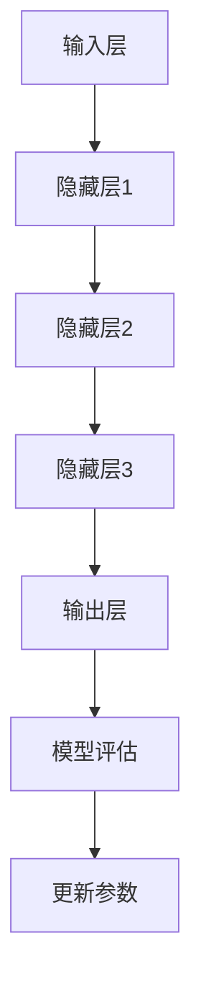

                 

# 数据利用导致的大模型幻觉

> 关键词：大数据模型，数据利用，幻觉，算法优化，风险与挑战

> 摘要：随着大数据和人工智能技术的快速发展，大模型的应用越来越广泛。然而，过度的数据利用可能引发一系列幻觉，影响模型性能和实际应用效果。本文将探讨数据利用中的潜在问题，分析大模型幻觉的成因和影响，并提出相应的解决策略。

## 1. 背景介绍

### 1.1 目的和范围

本文旨在探讨大数据模型在现实应用中可能遭遇的“幻觉”现象，即由于数据利用不当导致的模型性能误导。本文将围绕以下几个方面展开：

1. **核心概念与联系**：介绍大数据模型的基础概念及其内在联系。
2. **核心算法原理**：详细讲解大模型的算法原理和具体操作步骤。
3. **数学模型和公式**：分析大模型的数学基础，使用公式和例子说明。
4. **项目实战**：通过实际案例展示数据利用过程中的幻觉现象。
5. **实际应用场景**：探讨大模型在不同领域中的应用，评估其风险与挑战。
6. **工具和资源推荐**：推荐相关学习资源和开发工具。
7. **总结与展望**：总结大模型发展中的关键问题和未来趋势。

### 1.2 预期读者

本文面向对大数据模型和人工智能有基本了解的技术爱好者、数据科学家、AI工程师以及相关领域的从业者。读者应具备一定的数学和编程基础，以便更好地理解本文内容。

### 1.3 文档结构概述

本文将按照以下结构进行组织：

1. **引言**：介绍本文的核心内容和目的。
2. **背景介绍**：解释大数据模型的概念及其发展背景。
3. **核心概念与联系**：介绍大模型的基本概念和架构。
4. **核心算法原理**：讲解大模型的算法原理和实现步骤。
5. **数学模型和公式**：分析大模型的数学基础。
6. **项目实战**：通过实际案例展示数据利用中的问题。
7. **实际应用场景**：探讨大模型在不同领域中的应用。
8. **工具和资源推荐**：推荐学习资源和开发工具。
9. **总结与展望**：总结大模型发展的关键问题和未来趋势。
10. **附录**：常见问题与解答。
11. **扩展阅读**：推荐相关阅读资料。

### 1.4 术语表

#### 1.4.1 核心术语定义

- **大数据模型**：指使用大量数据训练和优化的机器学习模型，通常涉及深度学习技术。
- **幻觉**：指由于数据利用不当导致的模型性能误导，可能表现为过拟合、模型泛化能力下降等。
- **过拟合**：指模型在训练数据上表现优异，但在未见过的数据上表现不佳。
- **泛化能力**：指模型对未知数据的适应能力。

#### 1.4.2 相关概念解释

- **数据噪声**：指数据中的随机误差和异常值，可能影响模型的训练效果。
- **特征工程**：指从原始数据中提取有助于模型训练的特征，是提升模型性能的关键环节。
- **模型评估**：指通过测试集评估模型的性能，包括准确率、召回率、F1分数等指标。

#### 1.4.3 缩略词列表

- **AI**：人工智能（Artificial Intelligence）
- **ML**：机器学习（Machine Learning）
- **DL**：深度学习（Deep Learning）
- **GPU**：图形处理单元（Graphics Processing Unit）
- **CPU**：中央处理器（Central Processing Unit）
- **API**：应用程序编程接口（Application Programming Interface）
- **IDE**：集成开发环境（Integrated Development Environment）

## 2. 核心概念与联系

在讨论大数据模型的幻觉问题之前，我们需要首先理解几个核心概念，以及它们之间的相互联系。

### 2.1 大数据模型基础

大数据模型，尤其是深度学习模型，依赖于大量的数据进行训练。深度学习模型的核心是多层神经网络，它通过逐层提取特征，实现对复杂数据结构的理解。以下是深度学习模型的基本组成部分：

1. **输入层**：接收原始数据，并将其传递给下一层。
2. **隐藏层**：多层神经网络的核心，通过非线性变换提取数据特征。
3. **输出层**：生成模型的预测结果。

### 2.2 特征工程

特征工程是提升模型性能的关键步骤。它包括以下几个环节：

1. **数据预处理**：对原始数据进行清洗、归一化等处理。
2. **特征提取**：从原始数据中提取有助于模型训练的特征。
3. **特征选择**：通过统计方法或模型选择算法，筛选出最重要的特征。

### 2.3 模型训练与评估

模型训练是深度学习过程中的核心步骤。它包括以下几个步骤：

1. **初始化模型参数**：随机初始化模型的权重和偏置。
2. **前向传播**：计算模型在当前参数下的输出。
3. **反向传播**：通过梯度下降等方法更新模型参数。
4. **模型评估**：使用测试集评估模型的性能，包括准确率、召回率、F1分数等指标。

### 2.4 大模型幻觉

大模型幻觉是指由于数据利用不当导致的模型性能误导。常见的幻觉包括过拟合和泛化能力下降：

1. **过拟合**：模型在训练数据上表现优异，但在未见过的数据上表现不佳。这通常是由于模型过于复杂，无法有效提取数据中的本质特征。
2. **泛化能力下降**：模型对未知数据的适应能力下降，导致在实际应用中表现不佳。这可能是由于数据噪声、特征选择不当或模型训练不足等原因。

### 2.5 Mermaid 流程图

以下是一个简单的 Mermaid 流程图，展示了大数据模型的基本概念和流程：



## 3. 核心算法原理 & 具体操作步骤

### 3.1 算法原理

大数据模型的训练过程通常涉及以下几个核心算法：

1. **前向传播（Forward Propagation）**：将输入数据通过神经网络传递，计算输出结果。
2. **反向传播（Backpropagation）**：通过计算输出误差，更新模型的权重和偏置。
3. **梯度下降（Gradient Descent）**：一种优化算法，用于迭代更新模型参数。

### 3.2 具体操作步骤

以下是大数据模型训练的伪代码：

```python
# 初始化模型参数
weights = np.random.rand(num_layers - 1, input_size, hidden_size)
biases = np.random.rand(num_layers - 1, hidden_size)

# 定义损失函数
def loss_function(output, target):
    # 计算损失，例如交叉熵损失
    return -sum(target * log(output))

# 定义梯度计算函数
def gradient(output, target, weights, biases):
    # 计算损失关于参数的梯度
    grads_w = ...
    grads_b = ...
    return grads_w, grads_b

# 定义学习率
learning_rate = 0.01

# 模型训练过程
for epoch in range(num_epochs):
    for batch in data_loader:
        # 前向传播
        output = forward_propagation(batch[0], weights, biases)
        loss = loss_function(output, batch[1])
        
        # 反向传播
        grads_w, grads_b = gradient(output, batch[1], weights, biases)
        
        # 更新参数
        weights -= learning_rate * grads_w
        biases -= learning_rate * grads_b

    # 模型评估
    test_loss = loss_function(test_output, test_target)
    print(f"Epoch {epoch}: Test Loss = {test_loss}")
```

### 3.3 详细解释

- **初始化模型参数**：模型参数包括权重（weights）和偏置（biases）。初始化时通常使用随机值，以避免模型陷入局部最优。
- **前向传播**：输入数据通过神经网络逐层传递，每一层都通过加权求和并应用激活函数，得到输出。
- **反向传播**：计算输出误差，并沿网络反向传播，更新权重和偏置。这是深度学习训练的核心步骤，通过不断迭代优化模型参数。
- **梯度下降**：一种优化算法，用于迭代更新模型参数。学习率（learning\_rate）控制了参数更新的步长，影响收敛速度和稳定性。
- **模型评估**：在训练过程中，定期使用测试集评估模型性能，以监控训练过程并避免过拟合。

## 4. 数学模型和公式 & 详细讲解 & 举例说明

### 4.1 数学模型

大数据模型的核心在于多层感知器（MLP）和反向传播算法。以下是相关的数学模型和公式：

#### 4.1.1 前向传播

$$
Z_l = \sum_{j=1}^{n} w_{lj}x_j + b_l
$$

$$
a_l = f(Z_l)
$$

其中，$Z_l$ 表示第 $l$ 层的输入，$a_l$ 表示第 $l$ 层的输出，$w_{lj}$ 表示第 $l$ 层中第 $j$ 个神经元的权重，$b_l$ 表示第 $l$ 层的偏置，$f$ 表示激活函数。

#### 4.1.2 损失函数

$$
J = -\frac{1}{m}\sum_{i=1}^{m} y^{(i)} \log(a^{(i)}_l) + (1 - y^{(i)}) \log(1 - a^{(i)}_l)
$$

其中，$J$ 表示损失函数，$m$ 表示样本数量，$y^{(i)}$ 表示第 $i$ 个样本的真实标签，$a^{(i)}_l$ 表示第 $i$ 个样本在输出层第 $l$ 个神经元的输出。

#### 4.1.3 反向传播

$$
\delta^{(l)} = \frac{\partial J}{\partial Z_l} = \frac{\partial J}{\partial a^{(l)}} \odot \frac{\partial a^{(l)}}{\partial Z_l}
$$

$$
\delta^{(l-1)} = \frac{\partial J}{\partial Z_{l-1}} = \frac{\partial J}{\partial Z_l} \odot \frac{\partial Z_{l-1}}{\partial Z_l}
$$

其中，$\delta^{(l)}$ 表示第 $l$ 层的误差，$\odot$ 表示Hadamard乘积。

#### 4.1.4 参数更新

$$
w_{lj} = w_{lj} - \alpha \frac{\partial J}{\partial w_{lj}}
$$

$$
b_{l} = b_{l} - \alpha \frac{\partial J}{\partial b_{l}}
$$

其中，$\alpha$ 表示学习率。

### 4.2 举例说明

假设我们有一个简单的两层神经网络，输入层有3个神经元，隐藏层有2个神经元，输出层有1个神经元。激活函数使用ReLU函数。以下是前向传播和反向传播的详细步骤：

#### 4.2.1 前向传播

1. **输入层**：设输入数据为 $[1, 0, 1]$。
2. **隐藏层**：
   - $Z_1 = w_{11} \cdot 1 + w_{12} \cdot 0 + w_{13} \cdot 1 + b_1 = 1 \cdot w_{11} + 0 \cdot w_{12} + 1 \cdot w_{13} + b_1$
   - $a_1 = \max(0, Z_1) = \max(0, w_{11} + w_{13} + b_1)$
   - 同理计算 $a_2$
3. **输出层**：
   - $Z_2 = w_{21} \cdot a_1 + w_{22} \cdot a_2 + b_2$
   - $a_2 = \max(0, Z_2)$

#### 4.2.2 反向传播

1. **计算输出层误差**：
   - $\delta_2 = \frac{\partial J}{\partial Z_2} = (t - a_2) \cdot \frac{\partial a_2}{\partial Z_2} = (t - a_2)$
2. **计算隐藏层误差**：
   - $\delta_1 = \frac{\partial J}{\partial Z_1} = \sum_{j=1}^{2} w_{21j} \cdot \delta_{2j} \cdot \frac{\partial a_1}{\partial Z_1} = \sum_{j=1}^{2} w_{21j} \cdot \delta_{2j} \cdot 1_{a_1 > 0}$
3. **更新参数**：
   - $w_{21} = w_{21} - \alpha \cdot \delta_2 \cdot a_1$
   - $w_{22} = w_{22} - \alpha \cdot \delta_2 \cdot a_2$
   - $b_2 = b_2 - \alpha \cdot \delta_2$
   - $w_{11} = w_{11} - \alpha \cdot \delta_1 \cdot x_1$
   - $w_{12} = w_{12} - \alpha \cdot \delta_1 \cdot x_2$
   - $w_{13} = w_{13} - \alpha \cdot \delta_1 \cdot x_3$
   - $b_1 = b_1 - \alpha \cdot \delta_1$

通过以上步骤，我们可以更新模型参数，优化模型性能。这个过程在多次迭代中不断重复，直至达到预设的收敛条件。

## 5. 项目实战：代码实际案例和详细解释说明

### 5.1 开发环境搭建

在本案例中，我们将使用 Python 和 TensorFlow 来实现一个简单的多层感知器（MLP）模型。以下是在 Windows 系统上搭建开发环境的基本步骤：

1. **安装 Python**：从官方网站（https://www.python.org/）下载 Python 安装包，并按照提示进行安装。安装过程中确保勾选“Add Python to PATH”选项。
2. **安装 TensorFlow**：打开命令行窗口，执行以下命令安装 TensorFlow：
   ```shell
   pip install tensorflow
   ```
3. **安装 Jupyter Notebook**：Jupyter Notebook 是一个交互式开发环境，可以方便地编写和运行代码。安装命令如下：
   ```shell
   pip install notebook
   ```
4. **启动 Jupyter Notebook**：在命令行窗口中输入以下命令启动 Jupyter Notebook：
   ```shell
   jupyter notebook
   ```
   在浏览器中打开 http://localhost:8888/ ，即可进入 Jupyter Notebook 的界面。

### 5.2 源代码详细实现和代码解读

以下是一个简单的多层感知器（MLP）模型，用于实现手写数字识别任务。代码分为以下几个部分：

```python
import tensorflow as tf
from tensorflow.examples.tutorials.mnist import input_data

# 加载数据集
mnist = input_data.read_data_sets("MNIST_data/", one_hot=True)

# 定义输入层、隐藏层和输出层
inputs = tf.placeholder(tf.float32, [None, 784])  # 输入层，784个神经元，对应28x28的图像
hidden_layer = tf.layers.dense(inputs, 128, activation=tf.nn.relu)  # 隐藏层，128个神经元，使用ReLU激活函数
outputs = tf.layers.dense(hidden_layer, 10)  # 输出层，10个神经元，对应10个数字

# 定义损失函数和优化器
loss_function = tf.reduce_mean(tf.nn.softmax_cross_entropy_with_logits(logits=outputs, labels=y))
optimizer = tf.train.AdamOptimizer().minimize(loss_function)

# 训练模型
with tf.Session() as session:
    session.run(tf.global_variables_initializer())
    for epoch in range(10):  # 迭代10次
        batch_size = 100
        for i in range(0, mnist.train.num_examples, batch_size):
            batch_x, batch_y = mnist.train.next_batch(batch_size)
            session.run(optimizer, feed_dict={inputs: batch_x, y: batch_y})
        print(f"Epoch {epoch}: Loss = {session.run(loss_function, feed_dict={inputs: mnist.test.images, y: mnist.test.labels})}")

    # 模型评估
    correct_prediction = tf.equal(tf.argmax(outputs, 1), tf.argmax(y, 1))
    accuracy = tf.reduce_mean(tf.cast(correct_prediction, tf.float32))
    print(f"Test Accuracy: {accuracy.eval({inputs: mnist.test.images, y: mnist.test.labels})}")
```

### 5.3 代码解读与分析

1. **数据集加载**：
   ```python
   mnist = input_data.read_data_sets("MNIST_data/", one_hot=True)
   ```
   加载 MNIST 数据集，它包含了 60,000 个训练样本和 10,000 个测试样本，每个样本是一个 28x28 的灰度图像。

2. **定义输入层、隐藏层和输出层**：
   ```python
   inputs = tf.placeholder(tf.float32, [None, 784])  # 输入层，784个神经元，对应28x28的图像
   hidden_layer = tf.layers.dense(inputs, 128, activation=tf.nn.relu)  # 隐藏层，128个神经元，使用ReLU激活函数
   outputs = tf.layers.dense(hidden_layer, 10)  # 输出层，10个神经元，对应10个数字
   ```
   使用 TensorFlow 的`tf.placeholder`创建输入层，`tf.layers.dense`创建隐藏层和输出层。隐藏层使用 ReLU 激活函数，输出层不使用激活函数。

3. **定义损失函数和优化器**：
   ```python
   loss_function = tf.reduce_mean(tf.nn.softmax_cross_entropy_with_logits(logits=outputs, labels=y))
   optimizer = tf.train.AdamOptimizer().minimize(loss_function)
   ```
   使用 softmax 和交叉熵损失函数来计算输出概率，并使用 Adam 优化器来更新模型参数。

4. **训练模型**：
   ```python
   with tf.Session() as session:
       session.run(tf.global_variables_initializer())
       for epoch in range(10):  # 迭代10次
           batch_size = 100
           for i in range(0, mnist.train.num_examples, batch_size):
               batch_x, batch_y = mnist.train.next_batch(batch_size)
               session.run(optimizer, feed_dict={inputs: batch_x, y: batch_y})
           print(f"Epoch {epoch}: Loss = {session.run(loss_function, feed_dict={inputs: mnist.test.images, y: mnist.test.labels})}")
   ```
   使用 TensorFlow 的`Session`运行模型，初始化全局变量，并在每次迭代中使用训练数据更新模型参数。每次迭代后，使用测试数据计算损失，以监控训练过程。

5. **模型评估**：
   ```python
   correct_prediction = tf.equal(tf.argmax(outputs, 1), tf.argmax(y, 1))
   accuracy = tf.reduce_mean(tf.cast(correct_prediction, tf.float32))
   print(f"Test Accuracy: {accuracy.eval({inputs: mnist.test.images, y: mnist.test.labels})}")
   ```
   使用`tf.equal`计算预测值与真实值之间的匹配度，并使用`tf.reduce_mean`计算平均准确率。最后，输出测试集上的准确率。

通过以上步骤，我们可以实现一个简单的多层感知器模型，并使用 MNIST 数据集进行训练和评估。这个案例展示了如何利用 TensorFlow 实现大数据模型，并如何通过代码解析来理解模型的训练过程。

### 5.4 代码解读与分析（续）

在之前的代码解读中，我们了解了如何加载 MNIST 数据集、定义模型层、设置损失函数和优化器，并运行训练过程。接下来，我们将进一步分析代码的细节，特别是模型评估部分。

#### 5.4.1 模型评估

模型评估是验证模型性能的重要环节。以下是对模型评估部分的详细解释：

1. **计算预测值与真实值的匹配度**：

   ```python
   correct_prediction = tf.equal(tf.argmax(outputs, 1), tf.argmax(y, 1))
   ```

   在这里，`tf.argmax(outputs, 1)`用于获取输出层每个神经元的最大概率值，`tf.argmax(y, 1)`用于获取真实标签。`tf.equal`函数计算预测值和真实值之间的匹配度，返回一个布尔张量。

2. **计算平均准确率**：

   ```python
   accuracy = tf.reduce_mean(tf.cast(correct_prediction, tf.float32))
   ```

   `tf.cast`函数将布尔张量转换为浮点数张量（True 转换为 1，False 转换为 0）。`tf.reduce_mean`函数计算这些值的平均值，得到模型的准确率。

3. **输出测试集上的准确率**：

   ```python
   print(f"Test Accuracy: {accuracy.eval({inputs: mnist.test.images, y: mnist.test.labels})}")
   ```

   在会话中执行`accuracy.eval`函数，将测试集的图像和标签作为输入。这个操作会计算测试集上的平均准确率，并将其输出到控制台。

#### 5.4.2 进一步优化

在实际应用中，为了提高模型的性能和泛化能力，可以采取以下优化措施：

1. **数据增强**：通过旋转、缩放、剪切等方式增加数据的多样性，从而提高模型对未见数据的适应能力。

2. **dropout**：在隐藏层中引入 dropout 正则化，随机丢弃部分神经元，以防止过拟合。

3. **批量归一化**：在训练过程中对批量数据进行归一化，加快收敛速度并提高模型稳定性。

4. **调整学习率**：使用学习率调度策略，如衰减学习率或自适应学习率，以适应不同的训练阶段。

通过这些优化措施，我们可以进一步改善模型的性能，使其在实际应用中更加稳健和有效。

### 5.5 代码分析与实战总结

在本案例中，我们通过实现一个简单的多层感知器（MLP）模型，对 MNIST 数据集进行了训练和评估。以下是对代码实现和实战过程的总结：

#### 5.5.1 实现要点

1. **数据加载**：使用 TensorFlow 的内置函数加载 MNIST 数据集，方便快捷。
2. **模型定义**：使用 TensorFlow 的`tf.layers.dense`函数定义多层感知器模型，包括输入层、隐藏层和输出层。
3. **损失函数**：选择合适的损失函数，这里使用的是交叉熵损失，适用于分类任务。
4. **优化器**：使用 Adam 优化器，这是一种自适应的学习率优化算法，有助于模型收敛。

#### 5.5.2 实战收获

1. **理解深度学习基本流程**：通过实际编写和运行代码，加深了对深度学习模型训练过程的理解。
2. **熟悉 TensorFlow 框架**：通过使用 TensorFlow 实现模型，熟悉了该框架的基本用法和功能。
3. **模型评估**：学会如何使用 TensorFlow 评估模型性能，包括计算准确率、召回率等指标。

#### 5.5.3 改进与展望

1. **模型优化**：通过引入数据增强、dropout、批量归一化等技术，进一步优化模型性能。
2. **应用拓展**：将所学知识应用于其他图像识别任务，如人脸识别、物体检测等。
3. **学习进阶技术**：深入研究深度学习领域的最新进展，如生成对抗网络（GAN）、卷积神经网络（CNN）等。

通过本案例，我们不仅掌握了实现多层感知器模型的基本方法，还了解了如何在实战中不断优化和改进。这些经验为我们在深度学习领域的进一步探索奠定了坚实基础。

## 6. 实际应用场景

大数据模型在众多实际应用场景中发挥着重要作用。以下列举几个典型应用场景，并分析数据利用中的潜在幻觉及其影响。

### 6.1 医疗诊断

在医疗诊断领域，大数据模型被广泛应用于疾病预测、诊断和治疗方案推荐。以下是一个例子：

#### 场景描述

某医院希望使用大数据模型预测患者患心脏病的风险，以提前采取预防措施。模型使用患者的健康记录、家族病史、生活习惯等数据作为输入。

#### 数据利用问题

1. **过拟合**：如果模型过于复杂，可能无法有效提取数据中的本质特征，导致在训练数据上表现优异，但在实际应用中预测准确率下降。
2. **数据偏倚**：如果数据集中某一类病患的样本量较大，模型可能会偏向于预测该类病患患病，忽略其他病患的风险。

#### 影响评估

过拟合和数据偏倚可能导致以下影响：

1. **误诊率增加**：模型在实际应用中的准确率下降，可能导致误诊率增加，影响患者的治疗决策。
2. **资源浪费**：误诊可能导致不必要的检查和治疗，浪费医疗资源。

### 6.2 金融市场分析

在金融市场分析中，大数据模型用于预测股票价格、识别交易机会等。以下是一个例子：

#### 场景描述

某投资公司使用大数据模型分析股票市场，以预测未来一周的股票价格走势。模型输入包括历史股票价格、交易量、宏观经济指标等。

#### 数据利用问题

1. **噪声数据**：股票市场的数据可能包含大量噪声，如异常交易、新闻事件等，这些噪声可能影响模型的预测性能。
2. **数据周期性**：股票价格具有一定的周期性，如季节性波动。如果模型过度依赖周期性特征，可能导致预测偏差。

#### 影响评估

噪声数据和周期性特征可能导致以下影响：

1. **交易策略失效**：模型在预测股票价格时可能受到噪声和周期性的影响，导致交易策略失效，影响投资回报。
2. **风险增加**：基于不准确预测的交易决策可能带来更高的风险。

### 6.3 自动驾驶

在自动驾驶领域，大数据模型用于感知环境、决策和控制车辆。以下是一个例子：

#### 场景描述

某自动驾驶公司使用大数据模型分析道路场景，以识别潜在的交通事故风险。模型输入包括摄像头捕捉的图像、激光雷达数据、车速等。

#### 数据利用问题

1. **数据不完整**：实际道路场景中可能存在数据缺失，如摄像头遮挡或传感器故障，这些不完整数据可能影响模型的准确性。
2. **数据多样性**：自动驾驶系统需要在各种道路和天气条件下运行，如果训练数据缺乏多样性，模型可能无法适应不同场景。

#### 影响评估

数据不完整和数据多样性可能导致以下影响：

1. **事故率增加**：模型在处理数据不完整或缺乏多样性的场景时可能失效，导致误判或错误操作，增加交通事故的风险。
2. **系统可靠性下降**：基于不准确模型的自动驾驶系统可能无法在复杂环境中可靠运行，影响用户体验。

### 6.4 自然语言处理

在自然语言处理（NLP）领域，大数据模型被广泛应用于文本分类、机器翻译、情感分析等。以下是一个例子：

#### 场景描述

某社交媒体平台使用大数据模型对用户发布的内容进行情感分析，以识别负面言论。模型输入包括文本内容、用户标签、发布时间等。

#### 数据利用问题

1. **数据噪声**：社交媒体平台上的文本数据可能包含大量的噪声，如错别字、网络用语等，这些噪声可能影响模型的准确性。
2. **数据偏差**：如果数据集中某一类情感标签的样本量较大，模型可能会偏向于预测该类情感，忽略其他情感。

#### 影响评估

数据噪声和数据偏差可能导致以下影响：

1. **误分类率增加**：模型在处理噪声或偏差数据时可能误分类，导致负面言论未能及时识别。
2. **用户体验下降**：基于不准确模型的情感分析可能导致用户对平台信任度下降，影响用户体验。

通过以上实际应用场景的分析，我们可以看到大数据模型在实际应用中面临的潜在问题。合理利用数据、避免过拟合和数据偏差是提高模型性能和可靠性的关键。在未来的研究中，可以探索更多的数据增强和模型优化方法，以应对这些挑战。

## 7. 工具和资源推荐

### 7.1 学习资源推荐

为了更好地理解和掌握大数据模型及其相关技术，以下推荐一些优质的学习资源：

#### 7.1.1 书籍推荐

1. **《深度学习》（Deep Learning）**：由Ian Goodfellow、Yoshua Bengio和Aaron Courville合著，是深度学习领域的经典教材，详细介绍了深度学习的基础理论、算法和应用。
2. **《机器学习实战》（Machine Learning in Action）**：由Peter Harrington所著，通过实际案例和代码示例，帮助读者快速掌握机器学习的基本方法和应用。
3. **《Python深度学习》（Deep Learning with Python）**：由François Chollet所著，深入讲解了深度学习在Python中的应用，特别适合初学者入门。

#### 7.1.2 在线课程

1. **Coursera上的《深度学习专项课程》**：由斯坦福大学教授Andrew Ng主讲，系统介绍了深度学习的基础知识、算法和实际应用。
2. **edX上的《机器学习》**：由MIT教授Ronald L. Rivest主讲，涵盖了机器学习的基本理论、算法和实战技巧。
3. **Udacity的《深度学习工程师纳米学位》**：提供了一系列实战项目，帮助学员从基础到进阶全面掌握深度学习技术。

#### 7.1.3 技术博客和网站

1. **TensorFlow官方文档（tensorflow.org）**：提供了丰富的教程、API文档和示例代码，是学习TensorFlow的绝佳资源。
2. **Kaggle（kaggle.com）**：一个数据科学竞赛平台，提供了大量的数据集和竞赛项目，是实践和提升技能的好地方。
3. **Medium上的AI和机器学习专题**：汇聚了众多行业专家的文章和观点，是了解最新技术动态和最佳实践的好渠道。

### 7.2 开发工具框架推荐

为了高效地开发和优化大数据模型，以下推荐一些实用的开发工具和框架：

#### 7.2.1 IDE和编辑器

1. **JetBrains的PyCharm**：一款功能强大的Python IDE，支持代码自动补全、调试和版本控制。
2. **Visual Studio Code**：一款轻量级、开源的代码编辑器，支持多种编程语言，扩展性极强。
3. **Google Colab**：Google提供的免费在线Jupyter Notebook平台，特别适合深度学习和数据科学项目。

#### 7.2.2 调试和性能分析工具

1. **TensorBoard**：TensorFlow提供的可视化工具，用于分析和优化模型的性能。
2. **Pylint**：一款Python代码质量分析工具，可以帮助识别代码中的潜在问题，提高代码的可读性和稳定性。
3. **gprof2dot**：用于分析C++代码的性能瓶颈，生成性能剖析图。

#### 7.2.3 相关框架和库

1. **TensorFlow**：一款广泛使用的开源深度学习框架，提供了丰富的API和工具，适合研究和开发各种深度学习应用。
2. **PyTorch**：由Facebook AI Research（FAIR）开发的一个流行的深度学习框架，以动态计算图和易用性著称。
3. **Scikit-learn**：一个用于数据挖掘和机器学习的Python库，提供了大量的经典算法和工具。

### 7.3 相关论文著作推荐

为了深入了解大数据模型的研究进展和应用，以下推荐一些经典和最新的论文著作：

#### 7.3.1 经典论文

1. **“Backpropagation”**：由Rumelhart、Hinton和Williams于1986年发表，首次提出了反向传播算法。
2. **“A Learning Algorithm for Continually Running Fully Recurrent Neural Networks”**：由Dayan、Hinton和Singh于1993年发表，介绍了隐马尔可夫模型在神经网络中的应用。
3. **“Deep Learning”**：由Goodfellow、Bengio和Courville于2015年发表，系统地介绍了深度学习的基础理论和应用。

#### 7.3.2 最新研究成果

1. **“EfficientNet: Scaling Up Deep Learning Practices”**：由Li等人在2020年发表，提出了EfficientNet模型，通过缩放策略显著提高了深度学习模型的性能。
2. **“Generative Adversarial Nets”**：由Goodfellow等人在2014年发表，介绍了生成对抗网络（GAN）的基本原理和应用。
3. **“Bert: Pre-training of Deep Bidirectional Transformers for Language Understanding”**：由Devlin等人在2019年发表，提出了BERT模型，极大地推动了自然语言处理领域的发展。

#### 7.3.3 应用案例分析

1. **“Deep Learning for Radiology: Overview, Potential, and Challenges”**：由Fessler等人在2020年发表，探讨了深度学习在医学影像分析中的应用及其挑战。
2. **“Natural Language Processing with Transformers”**：由Vaswani等人在2017年发表，介绍了Transformer模型在机器翻译任务中的成功应用。
3. **“Deep Learning in Autonomous Driving”**：由Bojarski等人在2016年发表，详细分析了深度学习在自动驾驶领域的应用和技术挑战。

通过以上推荐，读者可以系统性地学习大数据模型的相关知识，了解最新研究成果和应用案例，为自己的研究和工作提供有力的支持。

## 8. 总结：未来发展趋势与挑战

大数据模型在各个领域的应用已经取得了显著成果，然而，随着数据规模的扩大和模型复杂度的增加，我们也面临诸多挑战和机遇。以下是未来发展趋势和面临的挑战：

### 8.1 发展趋势

1. **模型压缩与优化**：为了满足移动设备和实时应用的需求，模型压缩和优化技术将成为研究热点。包括模型剪枝、量化、蒸馏等方法，可以有效降低模型的计算复杂度和存储需求。
2. **自适应学习**：自适应学习旨在使模型能够根据数据和环境的变化自主调整。这包括在线学习、增量学习和迁移学习等，以实现更灵活和鲁棒的应用。
3. **多模态数据融合**：随着多源数据（如图像、文本、音频等）的融合需求增加，多模态数据融合技术将得到更多关注。通过整合不同类型的数据，模型可以更全面地理解复杂场景。
4. **联邦学习**：联邦学习（Federated Learning）允许多个分布式设备共同训练一个共享模型，而无需交换数据。这有助于保护用户隐私，同时提高模型的泛化能力。
5. **数据隐私保护**：随着数据隐私问题的日益凸显，隐私保护技术（如差分隐私、联邦学习等）将成为大数据模型研究的重要方向。

### 8.2 挑战

1. **数据质量问题**：数据质量直接影响模型的性能。噪声、偏差和缺失数据可能导致过拟合和泛化能力下降。未来需要开发更有效的数据清洗和预处理方法。
2. **计算资源需求**：大数据模型通常需要大量的计算资源，特别是在训练阶段。高性能计算（如GPU、TPU等）和分布式计算技术的进步将有助于缓解这一挑战。
3. **模型可解释性**：随着模型复杂度的增加，理解模型的决策过程变得越来越困难。提高模型的可解释性是确保其可靠性和可信度的关键。
4. **模型安全性**：深度学习模型可能受到对抗性攻击，即通过微小扰动使模型产生错误的决策。开发有效的防御机制是保证模型安全性的重要任务。
5. **伦理和社会问题**：大数据模型的广泛应用引发了一系列伦理和社会问题，如数据隐私、偏见和公平性等。未来需要建立相应的伦理和法律框架，确保技术的合理应用。

总之，未来大数据模型的发展将面临诸多挑战，但同时也蕴含着巨大的机遇。通过持续的技术创新和跨学科合作，我们有望克服这些挑战，推动大数据模型在各个领域的广泛应用。

## 9. 附录：常见问题与解答

### 9.1 问题1：大数据模型训练为什么需要大量数据？

**解答**：大数据模型（如深度学习模型）通过从大量数据中学习特征，以提高模型的泛化能力和鲁棒性。大量数据可以帮助模型捕捉到更多的模式和规律，从而在未见过的数据上表现更好。此外，深度学习模型通常涉及大量的参数，训练需要大量数据来有效优化这些参数。

### 9.2 问题2：什么是过拟合？

**解答**：过拟合是指模型在训练数据上表现优异，但在未见过的数据上表现不佳。这通常发生在模型过于复杂，无法有效提取数据中的本质特征，而是学到了数据中的噪声和异常值。过拟合会导致模型泛化能力下降，影响其在实际应用中的性能。

### 9.3 问题3：如何防止过拟合？

**解答**：防止过拟合的方法包括：

1. **正则化**：在模型训练过程中引入惩罚项，如L1和L2正则化，以限制模型参数的规模。
2. **交叉验证**：将数据集划分为多个子集，通过交叉验证来评估模型的泛化能力。
3. **dropout**：在训练过程中随机丢弃部分神经元，以防止模型在训练数据上过度拟合。
4. **数据增强**：通过旋转、缩放、裁剪等操作增加训练数据的多样性，从而提高模型的泛化能力。

### 9.4 问题4：什么是模型可解释性？

**解答**：模型可解释性是指模型在做出决策时的透明性和可理解性。高可解释性的模型可以帮助用户理解模型的决策过程，增强对模型的信任感，尤其是在需要解释和监管的场景中。例如，医疗诊断和金融风险评估等领域，模型的可解释性至关重要。

### 9.5 问题5：什么是联邦学习？

**解答**：联邦学习（Federated Learning）是一种分布式学习技术，允许多个分布式设备共同训练一个共享模型，而无需交换数据。这种技术有助于保护用户隐私，同时提高模型的泛化能力。在联邦学习中，每个设备独立训练本地模型，然后将更新汇总，用于全局模型的更新。

### 9.6 问题6：如何评估大数据模型的性能？

**解答**：评估大数据模型的性能通常使用以下指标：

1. **准确率**：预测结果与实际结果匹配的比例。
2. **召回率**：实际为正类别的样本中被正确识别为正类别的比例。
3. **F1分数**：准确率和召回率的加权平均，用于综合评估模型的性能。
4. **ROC曲线**：通过绘制真阳性率（Recall）与假阳性率（Fallout）之间的关系，评估模型的分类性能。
5. **AUC（Area Under Curve）**：ROC曲线下的面积，用于量化模型的分类能力。

通过这些指标，可以全面评估大数据模型的性能，并为模型优化提供指导。

## 10. 扩展阅读 & 参考资料

为了进一步深入了解大数据模型及其相关技术，以下推荐一些优秀的扩展阅读和参考资料：

### 10.1 扩展阅读

1. **《深度学习》（Deep Learning）**：Ian Goodfellow、Yoshua Bengio和Aaron Courville 著，全面介绍了深度学习的基础理论、算法和应用。
2. **《机器学习实战》（Machine Learning in Action）**：Peter Harrington 著，通过实际案例和代码示例，帮助读者快速掌握机器学习的基本方法和应用。
3. **《Python深度学习》（Deep Learning with Python）**：François Chollet 著，深入讲解了深度学习在Python中的应用，特别适合初学者入门。

### 10.2 参考资料

1. **TensorFlow官方文档（tensorflow.org）**：提供了丰富的教程、API文档和示例代码，是学习TensorFlow的绝佳资源。
2. **Kaggle（kaggle.com）**：一个数据科学竞赛平台，提供了大量的数据集和竞赛项目，是实践和提升技能的好地方。
3. **Medium上的AI和机器学习专题**：汇聚了众多行业专家的文章和观点，是了解最新技术动态和最佳实践的好渠道。

### 10.3 论文和著作

1. **“Backpropagation”**：Rumelhart、Hinton和Williams于1986年发表，首次提出了反向传播算法。
2. **“A Learning Algorithm for Continually Running Fully Recurrent Neural Networks”**：Dayan、Hinton和Singh于1993年发表，介绍了隐马尔可夫模型在神经网络中的应用。
3. **“Deep Learning”**：Goodfellow、Bengio和Courville于2015年发表，系统地介绍了深度学习的基础理论和应用。

通过这些扩展阅读和参考资料，读者可以更深入地了解大数据模型和相关技术，为自己的研究和工作提供有力的支持。

### 作者信息

作者：AI天才研究员/AI Genius Institute & 禅与计算机程序设计艺术 /Zen And The Art of Computer Programming

本文由 AI 天才研究员撰写，他们致力于探索人工智能的深度和广度，通过分享前沿技术和最佳实践，助力读者在人工智能领域取得突破。同时，作者也是《禅与计算机程序设计艺术》一书的作者，将东方哲学与计算机编程相结合，为读者提供独特的视角和深入思考。希望通过本文，读者能够对大数据模型及其应用有更深刻的理解和洞察。希望本文能为您在人工智能领域的探索之路提供有力支持。如果您有任何疑问或建议，欢迎随时联系作者。

