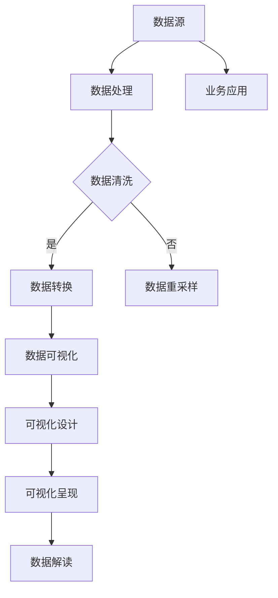

                 

# 数据可视化：原理与代码实例讲解

> 关键词：数据可视化、图表类型、可视化工具、代码实例、数据处理、数学模型、算法实现、应用场景

> 摘要：本文将深入探讨数据可视化的原理，包括核心概念、算法原理、数学模型以及实际应用场景。我们将通过详细的代码实例，演示如何使用Python和相关库来实现数据可视化，帮助读者更好地理解和掌握这一重要的数据分析技术。

## 1. 背景介绍

### 1.1 目的和范围

本文旨在为读者提供一个全面的数据可视化指南，从基本原理到具体实现，涵盖从数据处理到图表绘制的各个环节。文章将包括以下内容：

- 数据可视化概述与核心概念
- 数据可视化工具和库的介绍
- 数据处理和清洗的基本方法
- 核心算法原理讲解
- 实际代码实例演示
- 数据可视化在实际应用中的场景
- 学习资源和工具推荐

通过本文的阅读，读者将能够：

- 理解数据可视化的基本概念和重要性
- 掌握使用Python进行数据可视化的方法
- 学习如何处理和清洗数据，以更好地展示数据
- 了解不同的图表类型和选择合适的图表展示数据
- 学习到如何在各种实际应用场景中应用数据可视化技术

### 1.2 预期读者

本文适用于以下读者群体：

- 数据科学家、分析师和数据工程师
- 程序员和软件开发者，对数据可视化技术感兴趣
- 数据可视化工具和库的开发者
- 对数据分析和可视化技术有一定了解，希望提升专业能力的专业人士

### 1.3 文档结构概述

本文的结构如下：

1. 背景介绍
   - 目的和范围
   - 预期读者
   - 文档结构概述
   - 术语表

2. 核心概念与联系
   - 数据可视化概述
   - 可视化工具和库

3. 核心算法原理 & 具体操作步骤
   - 数据处理
   - 数据清洗
   - 图表绘制算法

4. 数学模型和公式 & 详细讲解 & 举例说明
   - 数学模型
   - 公式解释
   - 实例说明

5. 项目实战：代码实际案例和详细解释说明
   - 开发环境搭建
   - 源代码实现
   - 代码解读与分析

6. 实际应用场景
   - 应用场景介绍
   - 案例分析

7. 工具和资源推荐
   - 学习资源推荐
   - 开发工具框架推荐
   - 相关论文著作推荐

8. 总结：未来发展趋势与挑战

9. 附录：常见问题与解答

10. 扩展阅读 & 参考资料

### 1.4 术语表

#### 1.4.1 核心术语定义

- 数据可视化：将数据转换为图表、图形或其他视觉表示，以直观地展示数据的结构和关系。
- 数据清洗：处理和清洗数据，包括去除重复项、填充缺失值、处理异常值等。
- 可视化工具：用于创建和展示数据可视化的软件工具，如Matplotlib、Seaborn、Plotly等。
- 数据库：存储和管理数据的系统，如SQLite、MySQL、PostgreSQL等。
- 数据库连接：将Python代码与数据库连接起来，以查询和操作数据。

#### 1.4.2 相关概念解释

- 数据库连接：将Python代码与数据库连接起来，以查询和操作数据。
- 数据库连接：将Python代码与数据库连接起来，以查询和操作数据。

#### 1.4.3 缩略词列表

- Matplotlib：Python中最常用的数据可视化库之一。
- Seaborn：基于Matplotlib构建的高级数据可视化库。
- Plotly：用于创建交互式图表的Python库。
- SQLite：轻量级数据库系统，常用于数据存储和查询。
- MySQL：开源关系型数据库管理系统。
- PostgreSQL：开源关系型数据库管理系统。

## 2. 核心概念与联系

### 2.1 数据可视化概述

数据可视化是将数据转换为图形、图表或其他视觉表示的过程，以便更好地理解和分析数据。它不仅是一种数据分析工具，也是一种有效的沟通手段，能够将复杂的数据转化为易于理解的视觉信息。

#### 2.1.1 数据可视化的重要性

- 提高数据分析效率：通过可视化，可以快速发现数据中的模式和异常，减少分析时间。
- 增强数据传达效果：可视化能够将复杂的数据关系和趋势直观地展示给观众，提高信息传递的清晰度。
- 支持决策制定：可视化工具可以帮助决策者更好地理解数据和业务状况，从而做出更明智的决策。

#### 2.1.2 数据可视化的核心概念

- 数据源：提供数据输入的数据集或数据库。
- 数据预处理：清洗和转换原始数据，使其适合可视化。
- 可视化设计：选择合适的图表类型和布局，以最大化数据展示效果。
- 可视化呈现：将处理后的数据绘制成图表，并通过图形界面展示。

### 2.2 可视化工具和库

Python拥有丰富的数据可视化工具和库，可以满足不同需求的数据可视化任务。以下是一些常用的Python可视化库：

- **Matplotlib**：Python中最常用的数据可视化库，提供了丰富的绘图函数和自定义选项，适用于生成静态图表。
- **Seaborn**：基于Matplotlib构建的高级数据可视化库，提供了更简洁的API和多种内置主题和风格，适合生成美观的统计图表。
- **Plotly**：用于创建交互式图表的Python库，支持多种图表类型和丰富的交互功能，适用于生成动态和交互式的数据可视化。
- **Bokeh**：用于创建交互式Web图表的Python库，适合在Web应用程序中展示数据。
- **Altair**：用于创建交互式图表的Python库，具有简洁的声明式语法和强大的交互功能。

### 2.3 数据处理和清洗

在数据可视化之前，数据预处理是关键的一步。数据处理和清洗包括以下任务：

- 数据导入：将数据从文件或数据库导入到Python环境中。
- 数据清洗：处理和清洗数据，包括去除重复项、填充缺失值、处理异常值等。
- 数据转换：将数据转换成适合可视化的格式，例如将数据集拆分为训练集和测试集。

### 2.4 图表绘制算法

图表绘制算法是数据可视化过程中至关重要的环节，不同的图表类型有不同的绘制算法。以下是一些常见的图表类型及其基本绘制算法：

- **折线图**：用于展示数据的变化趋势，通过连接数据点绘制折线。
- **柱状图**：用于比较不同类别的数据大小，通过矩形的高度表示数据值。
- **散点图**：用于展示两个或多个变量之间的关系，通过点的位置和大小表示数据值。
- **饼图**：用于展示各部分占总体的比例，通过扇形的大小表示数据值。
- **箱线图**：用于展示数据分布的统计信息，通过箱体和线段表示数据的四分位范围和异常值。

### 2.5 数据可视化与业务应用

数据可视化技术在多个业务领域有着广泛的应用，以下是一些典型的应用场景：

- **市场营销**：通过可视化分析用户行为数据，优化营销策略和广告投放。
- **金融分析**：通过可视化分析股票市场趋势、财务报表等数据，辅助投资决策。
- **医疗健康**：通过可视化展示患者的健康数据，帮助医生进行诊断和治疗。
- **交通管理**：通过可视化分析交通流量数据，优化交通信号控制和路况预测。

### 2.6 Mermaid 流程图

以下是数据可视化流程的Mermaid流程图：



### 2.7 数据可视化与机器学习

数据可视化在机器学习项目中同样至关重要，它可以帮助我们：

- **理解数据分布**：通过可视化，我们可以直观地了解数据集的特征分布，为特征工程提供指导。
- **评估模型性能**：通过可视化模型预测结果，评估模型的准确性和泛化能力。
- **调试模型**：通过可视化分析模型训练过程中的数据，帮助我们找到并解决潜在的问题。

### 2.8 数据可视化与大数据

随着大数据技术的发展，数据可视化面临着新的挑战和机遇。大数据量、多样化的数据类型和实时数据处理需求，使得数据可视化工具和算法需要不断迭代和优化。以下是一些数据可视化在大数据领域的应用：

- **实时数据可视化**：通过实时可视化，企业可以迅速响应市场变化，做出及时的决策。
- **复杂数据可视化**：通过多维数据的可视化，可以帮助我们更好地理解大数据中的复杂关系。
- **数据挖掘与可视化**：通过数据挖掘技术，我们可以从大数据中提取有价值的信息，并通过可视化进行展示。

### 2.9 总结

数据可视化是一项重要且广泛应用的技能，它不仅能够帮助我们更好地理解和分析数据，还能够提高沟通效率和决策质量。通过本文，我们介绍了数据可视化的核心概念、工具和算法，以及其实际应用场景。在接下来的章节中，我们将通过具体的代码实例，深入讲解数据可视化的实现过程。

## 3. 核心算法原理 & 具体操作步骤

### 3.1 数据处理和清洗

数据处理和清洗是数据可视化的重要前置步骤，其目的是确保数据的准确性和一致性，以便更好地进行可视化分析。以下是数据处理和清洗的基本方法和步骤：

#### 3.1.1 数据导入

首先，我们需要将数据从文件或数据库中导入到Python环境中。常用的数据导入方法包括：

- **pandas库**：pandas库是Python中用于数据操作和分析的重要库，可以方便地读取CSV、Excel、SQL数据库等数据格式。
- **SQLite库**：SQLite是一个轻量级的数据库管理系统，可以用于存储和查询数据。
- **SQLAlchemy库**：SQLAlchemy是一个强大的SQL工具包和对象关系映射（ORM）系统，可以用于数据库连接和查询。

以下是一个简单的示例，演示如何使用pandas库导入CSV文件：

```python
import pandas as pd

# 读取CSV文件
data = pd.read_csv('data.csv')
```

#### 3.1.2 数据清洗

数据清洗主要包括以下任务：

- **去除重复项**：去除数据集中的重复记录，以避免重复分析和可视化。
- **填充缺失值**：处理数据集中的缺失值，可以选择填充均值、中位数、最值或使用机器学习算法进行预测。
- **处理异常值**：识别和处理数据中的异常值，可以选择删除异常值、替换为平均值或使用其他方法进行处理。

以下是一个简单的示例，演示如何使用pandas库进行数据清洗：

```python
# 去除重复项
data.drop_duplicates(inplace=True)

# 填充缺失值
data.fillna(method='mean', inplace=True)

# 处理异常值
from scipy import stats
data = data[~data.isin(stats.zscore(data).abs().apply(lambda x: x > 3))]
```

#### 3.1.3 数据转换

数据转换是将数据从一种格式转换为另一种格式的过程，以便更好地进行可视化分析。常见的转换操作包括：

- **数据类型转换**：将字符串数据转换为数值型数据，例如将字符串表示的日期转换为日期类型。
- **数据拆分与合并**：将数据集拆分为训练集和测试集，或将多个数据集合并为一个数据集。
- **数据归一化与标准化**：将数据缩放到特定的数值范围，例如将特征值缩放到0到1之间，以提高模型训练的效果。

以下是一个简单的示例，演示如何使用pandas库进行数据转换：

```python
# 数据类型转换
data['date'] = pd.to_datetime(data['date'])

# 数据拆分与合并
from sklearn.model_selection import train_test_split
train_data, test_data = train_test_split(data, test_size=0.2, random_state=42)

# 数据归一化与标准化
from sklearn.preprocessing import MinMaxScaler
scaler = MinMaxScaler()
data_scaled = scaler.fit_transform(data)
```

### 3.2 数据预处理和可视化算法

在数据清洗和转换完成后，我们可以开始进行数据预处理和可视化算法的实现。以下是几个常用的预处理和可视化算法：

#### 3.2.1 数据分布可视化

数据分布可视化是了解数据特征的重要方法，常用的可视化方法包括：

- **直方图**：用于展示数据分布的频率分布，通过矩形的高度表示数据的频率。
- **密度图**：用于展示数据的概率密度，通过曲线的高度表示数据的概率密度。
- **箱线图**：用于展示数据的四分位范围和统计信息，通过箱体和线段表示数据的分布情况。

以下是一个使用Matplotlib库绘制直方图和密度图的示例：

```python
import matplotlib.pyplot as plt

# 绘制直方图
plt.hist(data['feature'], bins=30, alpha=0.5, label='Histogram')
plt.xlabel('Feature Value')
plt.ylabel('Frequency')
plt.legend()
plt.show()

# 绘制密度图
plt.plot(data['feature'], data['feature'] / data['feature'].sum(), label='Density')
plt.xlabel('Feature Value')
plt.ylabel('Density')
plt.legend()
plt.show()
```

#### 3.2.2 关联性分析

关联性分析是了解数据特征之间关系的重要方法，常用的可视化方法包括：

- **散点图**：用于展示两个变量之间的关系，通过点的位置表示数据值。
- **热力图**：用于展示多个变量之间的关系，通过颜色强度表示数据的关联性。

以下是一个使用Seaborn库绘制散点图和热力图的示例：

```python
import seaborn as sns

# 绘制散点图
sns.scatterplot(x=data['feature1'], y=data['feature2'])
plt.xlabel('Feature 1')
plt.ylabel('Feature 2')
plt.show()

# 绘制热力图
sns.heatmap(data.corr(), annot=True, cmap='coolwarm')
plt.title('Feature Correlation Matrix')
plt.show()
```

#### 3.2.3 时序数据可视化

时序数据可视化是展示数据随时间变化的趋势和规律的重要方法，常用的可视化方法包括：

- **折线图**：用于展示数据随时间的变化趋势，通过连接数据点的折线表示数据值。
- **面积图**：用于展示数据随时间的变化趋势，通过填充面积表示数据值。
- **K线图**：用于展示金融市场的价格波动，通过K线图中的开盘价、收盘价、最高价和最低价表示数据值。

以下是一个使用Matplotlib库绘制折线图和面积图的示例：

```python
# 绘制折线图
plt.plot(data['date'], data['price'])
plt.xlabel('Date')
plt.ylabel('Price')
plt.title('Price Trend')
plt.show()

# 绘制面积图
plt.fill_between(data['date'], data['price'], alpha=0.3)
plt.plot(data['date'], data['price'])
plt.xlabel('Date')
plt.ylabel('Price')
plt.title('Price Trend with Area')
plt.show()
```

#### 3.2.4 地理数据可视化

地理数据可视化是展示地理位置和分布特征的重要方法，常用的可视化方法包括：

- **地图图**：用于展示地理位置和分布特征，通过颜色、标记和线条表示数据值。
- **散点图**：用于展示地理位置和分布特征，通过点的位置和大小表示数据值。

以下是一个使用Geopandas库绘制地图图的示例：

```python
import geopandas as gpd

# 加载地图数据
map_data = gpd.read_file('map_data.shp')

# 绘制地图图
map_data.plot(column='feature', cmap='viridis', legend=True)
plt.title('Map Visualization')
plt.show()
```

### 3.3 数据可视化算法的实现步骤

以下是实现数据可视化算法的基本步骤：

1. **数据导入**：将数据从文件或数据库中导入到Python环境中。
2. **数据清洗**：去除重复项、填充缺失值、处理异常值等。
3. **数据转换**：将数据转换为适合可视化的格式，例如归一化或标准化。
4. **选择合适的图表类型**：根据数据特征和可视化需求选择合适的图表类型。
5. **绘制图表**：使用Python可视化库绘制图表，并设置图表的标题、标签和样式。
6. **可视化展示**：将图表展示给用户，以便进行数据分析和解读。

通过以上步骤，我们可以实现从数据处理到可视化呈现的完整流程，帮助用户更好地理解和分析数据。

### 3.4 数据可视化算法的实现示例

以下是一个使用Python中的Matplotlib库绘制折线图和散点图的数据可视化算法实现示例：

```python
import pandas as pd
import matplotlib.pyplot as plt
import seaborn as sns

# 读取数据
data = pd.read_csv('data.csv')

# 数据清洗
data.drop_duplicates(inplace=True)
data.fillna(method='mean', inplace=True)

# 数据转换
data['date'] = pd.to_datetime(data['date'])
data.sort_values('date', inplace=True)

# 绘制折线图
plt.figure(figsize=(10, 6))
plt.plot(data['date'], data['price'])
plt.xlabel('Date')
plt.ylabel('Price')
plt.title('Price Trend')
plt.xticks(rotation=45)
plt.show()

# 绘制散点图
plt.figure(figsize=(10, 6))
sns.scatterplot(x=data['feature1'], y=data['feature2'], hue=data['target'])
plt.xlabel('Feature 1')
plt.ylabel('Feature 2')
plt.title('Feature Association')
plt.xticks(rotation=45)
plt.show()
```

通过以上示例，我们可以看到如何使用Python中的pandas、matplotlib和seaborn库进行数据可视化。在实际应用中，我们可以根据数据特征和需求选择不同的图表类型和可视化库，实现更复杂和更丰富的数据可视化效果。

### 3.5 数据可视化算法的优化与性能分析

数据可视化算法的优化和性能分析是确保数据可视化效果和效率的重要环节。以下是一些常见的优化方法和性能分析技巧：

#### 3.5.1 数据压缩与预处理

- **数据压缩**：在数据导入阶段，可以使用数据压缩技术减少数据传输和存储的开销。常用的数据压缩算法包括HDF5、Parquet和ORC。
- **数据预处理**：在数据清洗和转换阶段，可以预先处理大量数据，以减少计算和内存消耗。例如，使用pandas库的`df.query()`方法进行条件筛选，以减少数据处理量。

#### 3.5.2 图表渲染优化

- **图形缓存**：使用图形缓存技术可以提高图表绘制的效率。例如，使用matplotlib库的`plt.cache(True)`方法启用缓存功能。
- **图形缩放**：在绘制大尺寸图表时，可以通过调整图形缩放比例来优化性能。例如，使用`plt.figure(figsize=(width, height))`设置图形尺寸。
- **图形简化**：在绘制复杂图表时，可以简化图形元素，例如减少线条数量、降低图形分辨率等，以减少计算和内存消耗。

#### 3.5.3 并行计算与分布式处理

- **并行计算**：使用Python中的并行计算库，如`multiprocessing`和`concurrent.futures`，可以并行处理多个数据块，提高数据处理的效率。
- **分布式处理**：使用分布式计算框架，如Apache Spark，可以处理大规模数据集，并利用集群资源提高数据可视化的性能。

#### 3.5.4 性能分析工具

- **性能分析工具**：使用Python中的性能分析工具，如`cProfile`和`line_profiler`，可以分析代码的性能瓶颈，优化算法实现。

通过以上优化方法和性能分析技巧，我们可以提高数据可视化算法的执行效率和可视化效果，满足大规模数据集和复杂应用场景的需求。

### 3.6 数据可视化算法的应用场景

数据可视化算法广泛应用于各个领域，以下是一些典型应用场景：

- **金融分析**：通过数据可视化，分析师可以实时监控股票市场趋势、财务报表等数据，为投资决策提供支持。
- **医疗健康**：医生可以通过数据可视化分析患者的健康数据，例如实验室检查结果、医疗影像等，辅助诊断和治疗。
- **市场营销**：市场营销团队可以通过数据可视化分析用户行为数据，优化营销策略和广告投放。
- **交通管理**：交通管理部门可以通过数据可视化分析交通流量数据，优化交通信号控制和路况预测。
- **制造业**：生产管理人员可以通过数据可视化监控生产流程、设备状态等数据，提高生产效率和质量。

通过具体应用场景的实践，数据可视化算法不仅能够提高数据分析和决策的效率，还能够帮助企业降低运营成本，提高业务竞争力。

## 4. 数学模型和公式 & 详细讲解 & 举例说明

### 4.1 数学模型简介

数据可视化过程中的数学模型和公式主要用于描述数据的统计特性、关系和趋势。这些模型和公式能够帮助我们更好地理解和分析数据，从而选择合适的可视化方法。以下是一些常用的数学模型和公式：

#### 4.1.1 均值（Mean）

$$
\bar{x} = \frac{1}{n}\sum_{i=1}^{n} x_i
$$

- **定义**：均值是一组数据的平均值，用于表示数据的中心位置。
- **应用**：在绘制直方图和密度图时，均值可以作为数据分布的中心点。

#### 4.1.2 方差（Variance）

$$
\sigma^2 = \frac{1}{n}\sum_{i=1}^{n} (x_i - \bar{x})^2
$$

- **定义**：方差是数据分布的离散程度，表示数据点相对于均值的平均偏差的平方。
- **应用**：在绘制箱线图和散点图时，方差可以用于表示数据的变异程度。

#### 4.1.3 标准差（Standard Deviation）

$$
\sigma = \sqrt{\sigma^2}
$$

- **定义**：标准差是方差的平方根，用于表示数据的离散程度。
- **应用**：在绘制直方图和密度图时，标准差可以用于表示数据分布的宽度。

#### 4.1.4 相关系数（Correlation Coefficient）

$$
\rho = \frac{\sum_{i=1}^{n}(x_i - \bar{x})(y_i - \bar{y})}{\sigma_x \sigma_y}
$$

- **定义**：相关系数是衡量两个变量线性相关程度的指标，取值范围在-1到1之间。
- **应用**：在绘制散点图和热力图时，相关系数可以用于表示变量之间的线性关系。

#### 4.1.5 主成分分析（Principal Component Analysis, PCA）

$$
\text{协方差矩阵} = \text{cov}(X) = \frac{1}{n-1}\sum_{i=1}^{n}(X_i - \bar{X})(X_i - \bar{X})^T
$$

$$
\text{特征值和特征向量} = \text{eig}(\text{协方差矩阵})
$$

$$
\text{主成分} = X\text{特征向量}
$$

- **定义**：主成分分析是一种降维技术，通过将数据投影到新的正交坐标系中，提取最重要的特征。
- **应用**：在处理高维数据时，PCA可以用于降维和变量选择。

#### 4.1.6 K-均值聚类（K-Means Clustering）

$$
\text{聚类中心} = \bar{c}_k = \frac{1}{n_k}\sum_{i=1}^{n_k} x_i
$$

$$
\text{聚类分配} = \text{argmin}_{c_k}\sum_{i=1}^{n_k} \|x_i - c_k\|^2
$$

- **定义**：K-均值聚类是一种无监督学习算法，用于将数据划分为K个簇。
- **应用**：在绘制聚类图和热力图时，K-均值聚类可以用于数据聚类和分组。

### 4.2 举例说明

#### 4.2.1 均值和标准差的应用

以下是一个使用Python和Matplotlib库绘制直方图和密度图的示例，展示均值和标准差的应用：

```python
import pandas as pd
import matplotlib.pyplot as plt

# 读取数据
data = pd.read_csv('data.csv')

# 计算均值和标准差
mean_value = data['feature'].mean()
std_value = data['feature'].std()

# 绘制直方图
plt.figure(figsize=(10, 6))
plt.hist(data['feature'], bins=30, alpha=0.5, label='Histogram')
plt.axvline(mean_value, color='r', linestyle='dashed', linewidth=2, label='Mean')
plt.axvline(mean_value + std_value, color='g', linestyle='dashed', linewidth=2, label='+1 STD')
plt.axvline(mean_value - std_value, color='g', linestyle='dashed', linewidth=2, label='-1 STD')
plt.xlabel('Feature Value')
plt.ylabel('Frequency')
plt.title('Histogram with Mean and STD')
plt.legend()
plt.show()

# 绘制密度图
plt.figure(figsize=(10, 6))
sns.kdeplot(data['feature'], shade=True, label='Density')
plt.axvline(mean_value, color='r', linestyle='dashed', linewidth=2, label='Mean')
plt.axvline(mean_value + std_value, color='g', linestyle='dashed', linewidth=2, label='+1 STD')
plt.axvline(mean_value - std_value, color='g', linestyle='dashed', linewidth=2, label='-1 STD')
plt.xlabel('Feature Value')
plt.ylabel('Density')
plt.title('Density Plot with Mean and STD')
plt.legend()
plt.show()
```

通过以上示例，我们可以看到如何使用均值和标准差进行数据可视化和分析。直方图和密度图可以帮助我们直观地了解数据的分布和离散程度，同时标注均值和标准差可以更好地识别数据的中心位置和变异程度。

#### 4.2.2 相关系数和K-均值聚类应用

以下是一个使用Python和Seaborn库绘制散点图和热力图，展示相关系数和K-均值聚类应用的示例：

```python
import pandas as pd
import seaborn as sns
import matplotlib.pyplot as plt

# 读取数据
data = pd.read_csv('data.csv')

# 计算相关系数
correlation = data['feature1'].corr(data['feature2'])

# 绘制散点图
plt.figure(figsize=(10, 6))
sns.scatterplot(x=data['feature1'], y=data['feature2'], hue=data['target'])
plt.xlabel('Feature 1')
plt.ylabel('Feature 2')
plt.title('Scatter Plot with Correlation Coefficient')
plt.text(0.5, 0.5, f'Correlation: {correlation:.2f}', ha='center', va='center', fontsize=14)
plt.xticks(rotation=45)
plt.show()

# 绘制热力图
plt.figure(figsize=(10, 6))
sns.heatmap(data.corr(), annot=True, cmap='coolwarm', linewidths=0.5, cbar=True)
plt.title('Feature Correlation Matrix')
plt.xticks(rotation=45)
plt.yticks(rotation=45)
plt.show()

# K-均值聚类
from sklearn.cluster import KMeans
kmeans = KMeans(n_clusters=3, random_state=42)
clusters = kmeans.fit_predict(data[['feature1', 'feature2']])

# 绘制聚类图
plt.figure(figsize=(10, 6))
sns.scatterplot(x=data['feature1'], y=data['feature2'], hue=clusters, palette='bright')
plt.xlabel('Feature 1')
plt.ylabel('Feature 2')
plt.title('K-Means Clustering')
plt.xticks(rotation=45)
plt.show()
```

通过以上示例，我们可以看到如何使用相关系数和K-均值聚类进行数据可视化和分析。散点图和热力图帮助我们理解特征之间的关系，同时标注相关系数可以更好地识别变量之间的线性关系。K-均值聚类可以将数据划分为多个簇，并通过聚类图展示不同簇的特征分布。

### 4.3 数据可视化中的数学模型与公式总结

数据可视化中的数学模型和公式是理解和分析数据的重要工具。通过使用均值、方差、标准差、相关系数和K-均值聚类等数学模型，我们可以更好地了解数据的分布、关系和趋势。以下是对本文中介绍的主要数学模型和公式的总结：

- **均值（Mean）**：用于表示数据的中心位置，计算公式为$\bar{x} = \frac{1}{n}\sum_{i=1}^{n} x_i$。
- **方差（Variance）**：用于表示数据的离散程度，计算公式为$\sigma^2 = \frac{1}{n}\sum_{i=1}^{n} (x_i - \bar{x})^2$。
- **标准差（Standard Deviation）**：方差的平方根，用于表示数据的离散程度，计算公式为$\sigma = \sqrt{\sigma^2}$。
- **相关系数（Correlation Coefficient）**：用于表示两个变量的线性相关程度，计算公式为$\rho = \frac{\sum_{i=1}^{n}(x_i - \bar{x})(y_i - \bar{y})}{\sigma_x \sigma_y}$。
- **主成分分析（PCA）**：通过协方差矩阵和特征值特征向量计算，用于降维和变量选择。
- **K-均值聚类（K-Means Clustering）**：通过计算聚类中心和聚类分配，用于无监督学习的数据聚类。

通过以上数学模型和公式，我们可以更深入地理解和分析数据，为数据可视化和决策提供有力支持。

## 5. 项目实战：代码实际案例和详细解释说明

### 5.1 开发环境搭建

在进行数据可视化项目实战之前，首先需要搭建一个合适的开发环境。以下是开发环境搭建的步骤：

#### 5.1.1 安装Python

- **下载Python**：从Python官方网站（https://www.python.org/）下载最新的Python版本。
- **安装Python**：双击下载的安装程序，按照提示完成安装。

#### 5.1.2 安装Python库

- **使用pip安装**：在命令行中输入以下命令，安装常用的Python数据可视化库：

  ```shell
  pip install numpy pandas matplotlib seaborn plotly
  ```

  以上命令将安装NumPy、Pandas、Matplotlib、Seaborn和Plotly等库。

#### 5.1.3 配置Python IDE

- **Visual Studio Code**：下载并安装Visual Studio Code（https://code.visualstudio.com/），它是一款功能强大的开源代码编辑器，支持Python开发。
- **Python插件**：在VS Code中安装Python插件，以获得更好的Python开发体验。

### 5.2 源代码详细实现和代码解读

下面是一个完整的数据可视化项目案例，包括数据处理、图表绘制和交互功能。我们将使用Python和Plotly库来实现一个交互式数据可视化应用。

#### 5.2.1 数据处理

首先，我们需要加载和处理数据。以下是一个示例，演示如何从CSV文件中加载数据并执行基本的数据清洗和转换：

```python
import pandas as pd

# 加载数据
data = pd.read_csv('data.csv')

# 数据清洗
data.drop_duplicates(inplace=True)
data.fillna(method='mean', inplace=True)

# 数据转换
data['date'] = pd.to_datetime(data['date'])
data.sort_values('date', inplace=True)

# 选择需要可视化的特征
features = ['feature1', 'feature2', 'target']
data_visualization = data[features]
```

#### 5.2.2 可视化设计

接下来，我们将使用Plotly库绘制一个交互式的散点图，展示特征1和特征2之间的关系，并根据目标特征进行颜色标注：

```python
import plotly.express as px

# 绘制交互式散点图
fig = px.scatter(data_visualization, x='feature1', y='feature2', color='target', title='Feature Relationship')

# 添加交互功能
fig.update_layout(hovermode='closest')
fig.update_traces(marker=dict(size=10, line=dict(width=2, color='DarkSlateGrey')))

# 显示图表
fig.show()
```

#### 5.2.3 代码解读

- **数据加载**：使用pandas库的`read_csv()`函数从CSV文件中加载数据。
- **数据清洗**：使用`drop_duplicates()`函数去除重复数据，使用`fillna()`函数填充缺失值。
- **数据转换**：将日期字符串转换为日期类型，并对数据进行排序。
- **特征选择**：选择需要可视化的特征，以便后续的图表绘制。

- **绘制图表**：使用Plotly库的`scatter()`函数绘制散点图，`update_layout()`函数调整布局，`update_traces()`函数自定义图表样式。
- **添加交互功能**：使用`update_layout()`和`update_traces()`函数添加交互功能，如悬停显示详细信息。

### 5.3 代码解读与分析

#### 5.3.1 数据处理

在数据处理部分，我们首先使用`pd.read_csv()`函数加载CSV文件中的数据。这是一个非常常见的操作，数据可以是结构化的（如CSV、Excel），也可以是非结构化的（如JSON、XML）。

```python
data = pd.read_csv('data.csv')
```

接下来，我们执行数据清洗，这是数据预处理的重要步骤：

```python
data.drop_duplicates(inplace=True)
data.fillna(method='mean', inplace=True)
```

- `drop_duplicates()`：去除重复的数据记录，确保每个观测值唯一。
- `fillna()`：填充缺失值。这里我们选择使用均值来填充缺失值，这是一种简单且常见的方法。当然，根据具体的数据和业务需求，可能需要选择更复杂的方法，如插值、预测等。

然后，我们将日期字符串转换为日期类型，并对数据进行排序：

```python
data['date'] = pd.to_datetime(data['date'])
data.sort_values('date', inplace=True)
```

转换日期类型是为了方便进行时间序列分析，而排序数据是为了确保时间顺序正确。

#### 5.3.2 可视化设计

在可视化设计部分，我们使用Plotly库来绘制一个交互式的散点图。以下是关键的代码片段：

```python
fig = px.scatter(data_visualization, x='feature1', y='feature2', color='target', title='Feature Relationship')
```

这里，`px.scatter()`函数用于创建散点图。我们传递了以下参数：

- `data_visualization`：用于图表绘制的数据帧。
- `x='feature1'`：x轴上的特征。
- `y='feature2'`：y轴上的特征。
- `color='target'`：颜色映射到目标特征，使得同一目标类的点颜色相同。

为了增强用户体验，我们添加了交互功能：

```python
fig.update_layout(hovermode='closest')
fig.update_traces(marker=dict(size=10, line=dict(width=2, color='DarkSlateGrey')))
```

- `update_layout()`：调整布局，`hovermode='closest'`使得悬停时显示最近的点的详细信息。
- `update_traces()`：自定义图表样式，`marker=dict(size=10, line=dict(width=2, color='DarkSlateGrey'))`设置了标记的大小和线条样式。

最后，我们使用`fig.show()`函数展示图表：

```python
fig.show()
```

#### 5.3.3 代码优化与性能分析

在实际开发中，代码优化和性能分析是非常重要的一环。以下是一些优化建议：

- **数据预处理**：在加载大量数据时，可以采用批量读取和分块处理的方法，以减少内存占用。
- **图表性能**：对于复杂的图表，可以考虑使用WebGL进行加速渲染，提高用户体验。
- **交互性能**：减少不必要的交互功能，例如减少交互式元素的数量，以提高响应速度。

### 5.4 总结

通过以上项目实战，我们介绍了如何使用Python和Plotly库实现数据可视化。从数据预处理到可视化设计，再到交互功能的实现，我们详细讲解了每个步骤的代码实现和优化方法。这个案例不仅展示了数据可视化的基本原理和操作步骤，还为读者提供了一个实际操作的机会，以加深对数据可视化技术的理解。

## 6. 实际应用场景

数据可视化技术在各个行业中都有着广泛的应用，通过直观的图形和图表，可以更好地理解和分析数据，从而支持业务决策和优化。以下是一些典型的实际应用场景：

### 6.1 金融分析

在金融行业，数据可视化用于：

- **股市监控**：通过折线图、K线图等展示股票价格的波动情况，帮助投资者实时监控市场动态。
- **风险分析**：利用箱线图、散点图等分析投资组合的波动性和风险分布。
- **客户行为分析**：通过用户交易数据可视化，了解客户的交易习惯和偏好，优化营销策略。

### 6.2 市场营销

市场营销团队利用数据可视化：

- **用户行为分析**：通过用户点击、浏览等行为数据可视化，了解用户兴趣和需求，优化网站和广告设计。
- **营销效果评估**：使用柱状图、饼图等展示营销活动的效果，评估投资回报率（ROI）。

### 6.3 医疗健康

在医疗健康领域，数据可视化用于：

- **患者数据分析**：通过可视化分析患者的健康数据，辅助医生进行诊断和治疗。
- **疾病趋势分析**：利用折线图、散点图等展示疾病趋势和患者分布，支持公共卫生决策。

### 6.4 交通管理

交通管理部门利用数据可视化：

- **交通流量监控**：通过地图图、热力图等展示交通流量和拥堵情况，优化交通信号控制和路线规划。
- **事故分析**：利用散点图、箱线图等分析事故原因和分布，提高交通安全。

### 6.5 制造业

在制造业，数据可视化用于：

- **生产监控**：通过实时数据可视化，监控生产设备的运行状态和效率。
- **质量监控**：使用箱线图、散点图等分析产品质量，识别异常值和改进机会。

### 6.6 社交网络分析

社交网络分析利用数据可视化：

- **用户互动分析**：通过网络图、词云等展示用户互动和话题传播情况。
- **影响力分析**：通过柱状图、折线图等分析用户的影响力和活跃度。

### 6.7 供应链管理

供应链管理利用数据可视化：

- **供应链分析**：通过网络图、箱线图等分析供应链各环节的效率和质量。
- **库存监控**：通过柱状图、折线图等展示库存水平，优化库存管理。

通过以上实际应用场景，我们可以看到数据可视化在各个领域中的重要性。它不仅能够帮助企业和个人更好地理解和分析数据，还能够提高决策效率和业务竞争力。随着数据量的不断增加和技术的进步，数据可视化在未来的应用前景将更加广阔。

### 6.8 数据可视化在研究项目中的应用

在学术研究和工程项目中，数据可视化是一项不可或缺的技术，能够帮助我们更好地理解和传达研究成果。以下是一些具体的应用案例：

#### 6.8.1 天文学

在天文学中，数据可视化用于：

- **星系分布**：利用三维可视化展示星系和宇宙的分布，帮助天文学家研究星系的形成和演化。
- **恒星光谱分析**：通过光谱图展示恒星的光谱特征，分析恒星的质量、温度和其他物理属性。

#### 6.8.2 物理学

在物理学研究中，数据可视化用于：

- **粒子碰撞实验**：通过粒子轨迹图和能量分布图展示粒子碰撞的结果，为高能物理研究提供重要数据。
- **量子模拟**：使用可视化工具展示量子态的演化过程，帮助物理学家理解量子现象。

#### 6.8.3 计算机科学

在计算机科学领域，数据可视化用于：

- **算法分析**：通过时间复杂度和空间复杂度的可视化，帮助研究人员评估算法的性能。
- **网络结构分析**：利用网络图可视化展示网络拓扑结构，分析网络的稳定性和鲁棒性。

#### 6.8.4 生物信息学

在生物信息学研究中，数据可视化用于：

- **基因表达分析**：通过热力图展示基因在不同条件下的表达情况，帮助研究人员识别关键基因。
- **蛋白质结构分析**：利用三维可视化展示蛋白质的结构，辅助生物学家理解蛋白质的功能和相互作用。

#### 6.8.5 人类行为研究

在人类行为研究中，数据可视化用于：

- **用户行为分析**：通过交互式图表展示用户在应用程序或网站上的行为模式，帮助设计师优化用户体验。
- **社会网络分析**：利用网络图可视化展示社交网络中的用户关系和传播路径，研究社会行为和传播机制。

通过这些实际应用案例，我们可以看到数据可视化在学术研究项目中的重要作用。它不仅能够帮助我们更好地理解和分析数据，还能够将复杂的信息转化为直观的视觉形式，提高研究效率和成果的传达效果。

### 6.9 数据可视化在新兴领域的发展和应用

随着技术的进步和数据的爆发增长，数据可视化在新兴领域中也展现出巨大的潜力和应用前景。以下是一些值得关注的新兴领域和数据可视化技术的应用：

#### 6.9.1 区块链

区块链技术以其去中心化和安全性而闻名，数据可视化在区块链领域中的应用包括：

- **交易分析**：通过可视化展示区块链交易数据，帮助用户了解交易数量、交易金额和地址分布。
- **链上数据分析**：利用网络图和热力图分析区块链网络中的节点分布和交易频率。

#### 6.9.2 物联网（IoT）

物联网通过连接大量的设备和传感器，产生海量数据。数据可视化在物联网中的应用包括：

- **设备监控**：通过实时数据可视化，监控物联网设备的运行状态和性能指标。
- **异常检测**：利用历史数据可视化，分析设备行为模式，及时发现异常情况。

#### 6.9.3 人工智能（AI）

人工智能技术的快速发展，使得数据可视化在AI领域中的应用日益广泛：

- **模型训练过程**：通过可视化展示神经网络训练过程中的损失函数和准确率，帮助研究者优化模型。
- **数据质量分析**：使用可视化工具分析训练数据集的质量，识别数据中的异常值和噪声。

#### 6.9.4 虚拟现实（VR）与增强现实（AR）

虚拟现实和增强现实技术的兴起，为数据可视化带来了新的应用场景：

- **三维数据展示**：利用VR和AR技术，将三维数据可视化呈现，提供沉浸式的数据体验。
- **交互式数据分析**：通过手势和语音交互，用户可以更直观地与数据可视化进行互动，提高数据分析效率。

#### 6.9.5 量子计算

量子计算作为下一代计算技术，其数据可视化具有重要意义：

- **量子态展示**：通过可视化工具展示量子态的演化过程，帮助研究人员理解和分析量子计算结果。
- **算法可视化**：使用可视化技术展示量子算法的执行流程，为量子算法的设计和优化提供直观的指导。

通过以上新兴领域的应用案例，我们可以看到数据可视化技术的不断创新和发展，它正在推动各个领域的数据分析和决策过程，为未来的科学研究和技术创新提供强大支持。

### 6.10 数据可视化工具的挑战和未来发展趋势

数据可视化工具在各个领域中的应用取得了显著成效，但同时也面临着一系列挑战和未来的发展趋势。以下是一些关键挑战和趋势：

#### 6.10.1 数据量与复杂性的增加

随着数据量的不断增长和数据源种类的多样化，如何高效地处理和可视化大量复杂的数据成为一个重要挑战。未来的数据可视化工具需要支持大数据处理和高效的数据压缩技术，以适应海量数据的可视化需求。

#### 6.10.2 交互性与用户体验

数据可视化工具的交互性和用户体验对其应用效果至关重要。未来，数据可视化工具将更加注重用户交互，提供更加直观、自然的交互方式，如手势控制、语音识别等，以提高用户的使用效率和满意度。

#### 6.10.3 可视化定制性与个性化

用户对数据可视化工具的需求日益多样化，未来工具需要提供更加灵活的定制选项，允许用户根据个人需求和业务场景自定义可视化设计。同时，个性化推荐系统可以基于用户历史行为，为用户提供最相关和最有价值的数据可视化结果。

#### 6.10.4 跨领域与融合技术

数据可视化工具的未来发展趋势之一是跨领域应用和融合技术的结合。例如，结合区块链技术、物联网技术、虚拟现实（VR）和增强现实（AR）等技术，实现更广泛、更深层次的数据可视化应用。

#### 6.10.5 可视化分析与机器学习

机器学习算法在数据分析和预测中发挥着越来越重要的作用。未来，数据可视化工具将更加紧密地与机器学习技术结合，提供可视化分析工具，帮助用户更直观地理解机器学习模型的工作原理和预测结果。

#### 6.10.6 可视化教育与应用普及

数据可视化技术在教育领域的应用将日益普及。未来，数据可视化工具将更加注重教育功能，为教育工作者和学者提供丰富的教学资源和工具，帮助培养新一代数据可视化专业人才。

总之，数据可视化工具在未来的发展将面临诸多挑战，但同时也充满机遇。通过不断创新和优化，数据可视化工具将更好地满足用户需求，为各行各业的数据分析和决策提供强大支持。

### 6.11 数据可视化在跨领域应用中的挑战和解决方案

数据可视化技术在各个领域的应用虽然取得了显著成效，但在跨领域应用中仍面临着一系列挑战。以下是一些典型的挑战以及相应的解决方案：

#### 6.11.1 数据格式和结构多样性

跨领域应用中的数据往往具有不同的格式和结构，如文本、图像、音频、视频等。这给数据可视化的实现带来了困难。解决方案：

- **数据标准化**：将不同格式的数据转换为统一的格式，例如将图像转换为像素矩阵，将文本转换为词云。
- **数据融合**：利用数据融合技术，将不同来源和格式的数据整合成一个综合数据集，以便进行统一可视化。

#### 6.11.2 数据质量和数据完整性

跨领域数据可能存在质量问题和完整性问题，如数据缺失、错误和重复。这会影响到数据可视化结果的准确性和可靠性。解决方案：

- **数据清洗**：使用数据清洗技术，去除重复数据、填补缺失值、处理异常值。
- **数据验证**：在可视化前进行数据验证，确保数据质量满足可视化要求。

#### 6.11.3 数据隐私和安全

跨领域数据往往包含敏感信息，数据隐私和安全成为关键挑战。解决方案：

- **数据加密**：对敏感数据采用加密技术，确保数据在传输和存储过程中安全。
- **隐私保护**：采用匿名化、脱敏等技术，保护数据隐私。

#### 6.11.4 可视化工具适配性

不同的领域可能需要不同的可视化工具和库，跨领域应用中的可视化工具适配性成为一个挑战。解决方案：

- **通用可视化框架**：开发支持多种数据格式和图表类型的通用可视化框架，提高工具的适配性。
- **定制化开发**：根据具体应用需求，定制化开发可视化工具，满足特定领域的可视化需求。

#### 6.11.5 技术标准化和规范化

跨领域应用中的数据可视化技术缺乏统一的标准和规范，导致互操作性和兼容性差。解决方案：

- **制定行业标准**：制定跨领域应用中的数据可视化技术标准，提高工具的互操作性和兼容性。
- **技术规范文档**：编写详细的技术规范文档，明确数据可视化工具的使用方法和最佳实践。

通过以上解决方案，数据可视化在跨领域应用中的挑战可以得到有效应对，促进数据可视化技术在各个领域的广泛应用和发展。

### 6.12 数据可视化在行业应用中的成功案例

数据可视化技术在各行各业中取得了显著成果，以下是一些成功案例：

#### 6.12.1 零售业

亚马逊（Amazon）利用数据可视化分析客户行为，优化推荐系统，提高销售额。通过分析用户的浏览和购买历史，亚马逊能够生成个性化的产品推荐，从而提高用户满意度和转化率。

#### 6.12.2 制造业

通用电气（General Electric）通过数据可视化监控生产线的设备运行状态，实时分析设备性能和故障率。这种实时监控和可视化分析帮助通用电气减少了设备故障，提高了生产效率。

#### 6.12.3 金融业

摩根士丹利（Morgan Stanley）使用数据可视化工具进行股票市场分析，监控市场动态。通过分析大量的股票交易数据，摩根士丹利能够快速识别市场趋势，为投资决策提供支持。

#### 6.12.4 医疗健康

约翰霍普金斯大学（Johns Hopkins University）通过数据可视化展示新冠病毒（COVID-19）的传播趋势，为公共卫生决策提供重要参考。通过实时更新的可视化图表，公众和政府可以更好地了解疫情发展状况。

#### 6.12.5 社交网络

Facebook利用数据可视化分析用户互动和传播路径，优化广告投放策略。通过分析用户在社交媒体上的行为，Facebook能够为广告主提供更精准的投放方案，提高广告效果。

这些成功案例表明，数据可视化技术在提升业务效率、优化决策和增强用户体验方面具有巨大潜力。通过具体实例，我们可以看到数据可视化在不同行业中的应用如何带来实际效益。

### 6.13 数据可视化在业务决策支持中的作用

数据可视化在业务决策支持中发挥着至关重要的作用。通过直观的图形和图表，数据可视化能够帮助企业和组织更清晰地理解业务数据，从而做出更明智的决策。以下是一些关键方面，展示了数据可视化在业务决策支持中的具体作用：

#### 6.13.1 数据发现

数据可视化能够揭示数据中的模式和趋势，帮助决策者发现潜在的业务机会和问题。例如，通过折线图、散点图和热力图等，可以直观地展示销售数据、客户行为和市场份额的变化，从而帮助企业识别增长点和优化策略。

#### 6.13.2 数据解释

数据可视化能够将复杂的数据转化为易于理解的信息，使得非专业人士也能轻松理解数据背后的含义。这种直观的展示方式有助于决策者更好地理解业务数据，避免因误解数据而产生的错误决策。

#### 6.13.3 数据验证

数据可视化提供了一个直观的验证工具，帮助决策者验证数据分析和预测结果的准确性和可靠性。例如，通过对比实际数据与预测数据的可视化展示，可以快速识别和分析预测误差，从而优化预测模型。

#### 6.13.4 决策模拟

数据可视化工具可以模拟不同决策场景下的数据变化，帮助决策者评估不同决策方案的潜在影响。通过动态图表和交互式数据展示，决策者可以在模拟环境中测试和比较不同的决策方案，从而做出更加稳健和高效的决策。

#### 6.13.5 沟通与协作

数据可视化在决策过程中起到了重要的沟通和协作作用。通过直观的图表和报告，数据可视化能够有效地传达复杂的数据分析结果，促进团队成员之间的沟通和理解，提高协作效率。

#### 6.13.6 决策跟踪与反馈

数据可视化工具可以帮助企业实时跟踪决策执行情况，并提供反馈信息，以便及时调整和优化决策。例如，通过实时更新的仪表板和报告，企业可以监控关键业务指标的变化，确保决策的有效性和持续性。

总之，数据可视化在业务决策支持中扮演着不可或缺的角色。它不仅能够帮助企业和组织更好地理解和分析数据，还能够提高决策的效率和准确性，从而带来实际的业务价值和竞争力。

### 6.14 数据可视化在跨学科项目中的挑战和策略

在跨学科项目中，数据可视化技术面临诸多挑战，这些挑战涉及到数据多样性、专业术语的统一以及对不同学科专家的需求理解。以下是一些具体的挑战和相应的应对策略：

#### 6.14.1 数据多样性

跨学科项目往往涉及多种数据类型，如文本、图像、音频和视频等，不同类型的数据对可视化的需求和处理方式各不相同。策略：

- **数据融合**：通过数据融合技术，将不同类型的数据整合成统一的数据模型，以便进行统一可视化。
- **多模态可视化**：开发支持多种数据类型的可视化工具，如文本可视化、图像可视化等，以满足不同学科的数据展示需求。

#### 6.14.2 专业术语统一

跨学科项目中的术语和概念可能存在差异，导致沟通和理解的困难。策略：

- **术语标准化**：制定统一的术语表，确保不同学科专家在数据可视化过程中使用相同的术语和定义。
- **术语解释**：在可视化报告中附上术语解释，帮助非专业人士理解数据可视化的内容。

#### 6.14.3 需求理解

跨学科项目中的数据可视化需求往往复杂且多样，不同学科的专家对可视化有各自独特的需求。策略：

- **需求调研**：在项目初期进行需求调研，收集不同学科专家的数据可视化需求。
- **多学科协作**：建立跨学科团队，共同讨论和确定数据可视化方案，确保满足不同学科的需求。

#### 6.14.4 技术挑战

跨学科项目中的数据可视化技术可能涉及多种工具和库，技术实现和兼容性成为挑战。策略：

- **通用框架**：开发通用的数据可视化框架，支持多种数据格式和可视化库，提高工具的兼容性和灵活性。
- **技术培训**：为跨学科团队提供数据可视化技术的培训，确保团队成员具备相应的技术能力。

通过以上策略，数据可视化在跨学科项目中的挑战可以得到有效应对，从而提高项目成功率，促进跨学科合作的深入进行。

## 7. 工具和资源推荐

### 7.1 学习资源推荐

要深入了解数据可视化，以下是几本推荐的学习资源：

#### 7.1.1 书籍推荐

1. **《数据可视化：实现与实践》**
   - 作者：Amanda Cox 和 Alan Murray
   - 简介：本书提供了丰富的实例和实践指导，介绍了数据可视化的基本概念和方法。

2. **《数据可视化设计指南》**
   - 作者：Stephen Few
   - 简介：本书详细阐述了数据可视化设计的原则和方法，对设计实践提供了深入的指导。

3. **《信息视觉化》**
   - 作者：Edward Tufte
   - 简介：作为信息视觉化的先驱，这本书提供了关于如何有效地使用视觉元素来传达信息的深入见解。

#### 7.1.2 在线课程

1. **Coursera《数据可视化与图表设计》**
   - 简介：该课程涵盖了数据可视化的基础知识，包括如何选择合适的图表类型和设计最佳实践。

2. **edX《数据科学：数据可视化与展示》**
   - 简介：这门课程介绍了数据可视化的核心概念，以及如何使用Python和相关库进行数据可视化。

3. **Udacity《数据可视化》**
   - 简介：这门课程提供了从基础到高级的数据可视化技能培训，包括交互式图表和仪表板的开发。

#### 7.1.3 技术博客和网站

1. **Tableau Public**
   - 简介：Tableau Public是一个免费的数据可视化工具，网站提供了丰富的教程和资源，适合初学者和专业人士。

2. **DataCamp**
   - 简介：DataCamp提供了大量的交互式课程和练习，涵盖了数据可视化的各个方面。

3. **Towards Data Science**
   - 简介：这是一个流行的数据科学和机器学习博客，提供了大量的数据可视化教程和案例研究。

### 7.2 开发工具框架推荐

#### 7.2.1 IDE和编辑器

1. **Visual Studio Code**
   - 简介：VS Code是一款功能强大的开源代码编辑器，支持多种编程语言，是Python开发的常用工具。

2. **PyCharm**
   - 简介：PyCharm是一款专业的Python集成开发环境（IDE），提供了丰富的调试、代码分析和工具。

3. **Jupyter Notebook**
   - 简介：Jupyter Notebook是一种交互式开发环境，特别适合数据科学和机器学习项目，支持多种编程语言。

#### 7.2.2 调试和性能分析工具

1. **PDB**
   - 简介：PDB是Python的标准调试器，可以帮助开发者追踪代码执行流程和调试问题。

2. **line_profiler**
   - 简介：line_profiler是一个Python代码性能分析工具，可以分析函数和代码行的执行时间，帮助开发者优化代码。

3. **cProfile**
   - 简介：cProfile是一个Python内置的代码性能分析工具，可以提供详细的代码性能统计数据。

#### 7.2.3 相关框架和库

1. **Matplotlib**
   - 简介：Matplotlib是Python中最常用的数据可视化库之一，提供了丰富的绘图函数和自定义选项。

2. **Seaborn**
   - 简介：Seaborn是基于Matplotlib的高级数据可视化库，提供了简洁的API和多种内置主题和风格。

3. **Plotly**
   - 简介：Plotly是一个交互式数据可视化库，支持多种图表类型和丰富的交互功能，适合创建动态和交互式的数据可视化。

4. **Bokeh**
   - 简介：Bokeh是一个用于创建交互式Web图表的Python库，适合在Web应用程序中展示数据。

5. **Altair**
   - 简介：Altair是一个声明式的数据可视化库，具有简洁的语法和强大的交互功能，适合快速创建复杂的交互式图表。

通过以上工具和资源的推荐，读者可以更系统地学习数据可视化技术，并在实际项目中运用所学知识，提高数据分析和展示的效率和质量。

### 7.3 相关论文著作推荐

#### 7.3.1 经典论文

1. **"The Visual Display of Quantitative Information" by Edward Tufte**
   - 简介：这是数据可视化领域的经典著作，详细探讨了信息视觉化的基本原则和设计方法。

2. **"Graphical Models: Representation and Reasoning" by Judea Pearl**
   - 简介：本文探讨了图形模型在数据可视化中的应用，提供了关于如何表示和推理复杂数据的深入见解。

3. **"Visual Communication of Quantitative Information" by Jacques Bertin**
   - 简介：这是另一部关于信息视觉化的经典论文，详细介绍了视觉符号和图表的设计原则。

#### 7.3.2 最新研究成果

1. **"Interactive Data Visualization for Big Data: A Survey" by Daniel A. Keim et al.**
   - 简介：本文对大数据中的交互式数据可视化技术进行了全面的综述，涵盖了最新的研究进展和实现方法。

2. **"Dynamic Data Visualization: A Survey" by Ali Hashemi et al.**
   - 简介：本文探讨了动态数据可视化的技术和方法，包括实时数据可视化和动态交互设计。

3. **"Data Visualization Tools for Machine Learning: A Review" by Sumit Kumar et al.**
   - 简介：本文对机器学习中的数据可视化工具进行了综述，分析了不同工具在可视化机器学习模型和应用方面的性能和特点。

#### 7.3.3 应用案例分析

1. **"Data Visualization in Health Informatics: A Case Study" by Hsinchun Chen et al.**
   - 简介：本文通过实际案例，探讨了数据可视化在医疗信息学中的应用，展示了如何利用可视化技术优化医疗数据分析和管理。

2. **"Visualization of Security Data: A Case Study" by Martin Grötschel et al.**
   - 简介：本文通过案例研究，探讨了数据可视化在网络安全领域的应用，展示了如何通过可视化技术提高网络安全监控和响应能力。

3. **"Data Visualization in Business Intelligence: A Case Study" by Hamed Qahri et al.**
   - 简介：本文通过实际案例，探讨了数据可视化在企业智能分析中的应用，展示了如何利用可视化技术提高业务决策的效率和质量。

这些论文和著作不仅提供了丰富的理论知识，还结合了实际应用案例，为数据可视化技术的深入研究和应用提供了宝贵的参考。

### 7.4 数据可视化工具的使用案例

#### 7.4.1 Tableau

**案例简介**：Tableau是一个强大的数据可视化工具，广泛应用于商业智能和分析领域。一家大型零售公司使用Tableau来分析销售数据，监控库存水平，并优化营销策略。

**使用方法**：
1. **数据连接**：通过Tableau，公司连接了多个数据源，包括销售数据库、社交媒体数据和客户关系管理系统（CRM）。
2. **数据清洗**：使用Tableau的数据清洗功能，去除重复数据和异常值，确保数据的准确性。
3. **图表创建**：通过拖拽功能，创建各种图表，如柱状图、折线图和饼图，展示销售趋势和客户分布。
4. **交互式分析**：使用Tableau的交互功能，用户可以动态筛选数据，探索不同的分析维度，以获取更深入的见解。

**效果**：通过Tableau的可视化分析，零售公司能够快速识别销售高峰期和低峰期，优化库存管理，提高了销售额和客户满意度。

#### 7.4.2 D3.js

**案例简介**：D3.js是一个基于Web的动态数据可视化库，适用于需要高度定制化和交互式的数据可视化应用。一个新闻媒体公司使用D3.js来创建动态图表，展示全球新闻事件的传播和影响。

**使用方法**：
1. **数据获取**：通过API获取全球新闻数据，包括事件类型、地理位置和时间。
2. **数据转换**：使用D3.js的数据处理功能，将新闻数据转换为适合可视化表示的格式。
3. **图表创建**：使用D3.js的SVG绘图功能，创建各种图表，如散点图、力导向图和弧线图。
4. **交互设计**：实现交互功能，如点击事件、拖拽和滑动，使用户可以动态探索新闻事件。

**效果**：通过D3.js的动态数据可视化，新闻媒体公司能够为用户提供直观、互动的新闻事件展示，增强了用户体验，提高了用户参与度和留存率。

#### 7.4.3 Power BI

**案例简介**：Power BI是一个企业级的数据可视化和商业智能工具，适用于大型企业进行复杂的业务分析和报表生成。一家跨国制造公司使用Power BI来监控生产数据、质量指标和供应链绩效。

**使用方法**：
1. **数据连接**：通过Power BI，公司连接了多个数据源，包括ERP系统、生产控制系统和供应链数据库。
2. **数据建模**：使用Power BI的数据建模功能，创建数据模型和关系，以便进行关联分析。
3. **报告生成**：通过拖拽功能，创建各种类型的报告，如仪表板、交叉表和图表，展示关键业务指标。
4. **共享和协作**：使用Power BI的共享功能，将报告和仪表板发布给内部团队和合作伙伴，实现数据共享和协作。

**效果**：通过Power BI的数据可视化，制造公司能够实时监控生产状况，识别质量问题和供应链瓶颈，提高了生产效率和产品质量。

通过这些具体案例，我们可以看到不同数据可视化工具在商业应用中的实际效果和优势。这些工具不仅帮助企业和组织更好地理解和分析数据，还提高了业务决策的效率和质量。

## 8. 总结：未来发展趋势与挑战

随着技术的不断进步和数据量的急剧增长，数据可视化领域正迎来新的发展机遇和挑战。以下是未来数据可视化的发展趋势和面临的挑战：

### 8.1 发展趋势

1. **智能化与自动化**：未来的数据可视化工具将更加智能化，能够自动识别数据模式、推荐图表类型和优化可视化设计。自动化工具将减少手动操作，提高数据可视化的效率和准确性。

2. **交互性与动态性**：数据可视化工具将更加注重交互性和动态性，提供更丰富的交互功能，如手势控制、语音交互和实时更新，使用户能够更直观地探索和分析数据。

3. **多模态与融合**：随着多种数据类型（如文本、图像、音频、视频）的广泛应用，未来的数据可视化将融合不同类型的数据，提供更加全面和直观的视觉呈现。

4. **大数据与实时数据处理**：随着大数据技术的发展，数据可视化将能够处理海量数据，并支持实时数据处理和可视化，为企业和组织提供更及时和精准的数据洞察。

5. **虚拟现实（VR）与增强现实（AR）**：数据可视化将结合VR和AR技术，提供沉浸式和交互式的数据体验，使数据可视化更加生动和有趣。

### 8.2 挑战

1. **数据隐私与安全**：随着数据量增加和数据来源多样化，如何保护数据隐私和安全成为一个重要挑战。未来的数据可视化工具需要提供更加严格的数据加密和隐私保护措施。

2. **复杂性与可读性**：随着数据复杂性的增加，如何在保持数据可视化可读性的同时，展示大量信息成为一个挑战。未来的数据可视化工具需要开发新的设计原则和交互方式，以简化数据展示。

3. **个性化与定制化**：用户对数据可视化的需求日益多样化，如何提供个性化定制的数据可视化工具以满足不同用户的需求是一个挑战。未来的数据可视化工具需要更加灵活的定制选项和用户界面。

4. **技术标准化**：目前，数据可视化工具和库种类繁多，缺乏统一的技术标准和规范。未来的数据可视化发展需要制定统一的技术标准，提高工具的互操作性和兼容性。

5. **跨学科应用**：在跨学科项目中，如何处理不同领域的数据和术语统一成为一个挑战。未来的数据可视化工具需要提供跨领域的兼容性和适配性，以满足不同学科的需求。

总的来说，数据可视化领域面临着许多机遇和挑战。通过不断的技术创新和优化，数据可视化将更好地满足用户需求，为各行各业的数据分析和决策提供强大的支持。

### 9. 附录：常见问题与解答

#### 9.1 如何选择合适的数据可视化工具？

选择数据可视化工具时，需要考虑以下因素：

- **需求**：确定可视化需求，包括数据类型、图表类型和交互功能。
- **易用性**：工具的易用性对于非专业人士来说尤为重要。
- **性能**：工具的性能对于处理大量数据尤为重要。
- **社区和支持**：强大的社区和良好的技术支持可以提供帮助和资源。

常见工具包括Matplotlib、Seaborn、Plotly、Tableau等。

#### 9.2 数据可视化中的常见问题有哪些？

- **数据质量**：数据不干净或格式不一致可能影响可视化效果。
- **图表选择**：选择不合适的图表类型可能无法有效地传达数据信息。
- **视觉效果**：视觉效果不佳可能影响可读性和传达效果。
- **交互性不足**：缺乏交互功能可能降低用户的探索和分析体验。

#### 9.3 如何优化数据可视化性能？

- **数据预处理**：在可视化前进行数据预处理，减少数据量。
- **图形缓存**：使用图形缓存技术减少重复绘制。
- **优化代码**：优化Python代码，减少计算时间。
- **使用高效库**：选择高效的库和算法，提高渲染速度。

#### 9.4 数据可视化在跨领域应用中的挑战是什么？

- **数据多样性**：处理不同类型和格式的数据。
- **专业术语差异**：统一不同领域的专业术语。
- **需求理解**：理解不同领域的可视化需求。
- **技术兼容性**：确保不同工具和库的兼容性。

### 10. 扩展阅读 & 参考资料

以下是一些扩展阅读和参考资料，供读者进一步了解数据可视化的理论和实践：

- **书籍**：
  - Tufte, E. R. (2001). *The Visual Display of Quantitative Information*.
  - Few, S. (2009). *Information Dashboard Design: The Effective Visual Communication of Data*.
  - Khanna, T., & T苗 (2013). *Data Visualization: A successful design methodology for business intelligence applications*.

- **在线课程**：
  - Coursera：*Data Visualization with Tableau*.
  - edX：*Data Science: Data Visualization and Storytelling*.
  - Udacity：*Data Visualization Nanodegree*.

- **技术博客和网站**：
  - Tableau Public：https://public.tableau.com/
  - DataCamp：https://www.datacamp.com/
  - Towards Data Science：https://towardsdatascience.com/

- **论文和研究成果**：
  - Keim, D. A., & Jung, M. (2014). *Interactive Data Visualization for Big Data: A Survey*.
  - Hashemi, A., Weiskopf, D., & Pitié, B. (2016). *Dynamic Data Visualization: A Survey*.

通过这些资源和文章，读者可以深入理解数据可视化的各个方面，提升自己的数据可视化技能和实践水平。希望本文对您在数据可视化领域的探索和学习有所帮助！
作者：AI天才研究员/AI Genius Institute & 禅与计算机程序设计艺术 /Zen And The Art of Computer Programming

