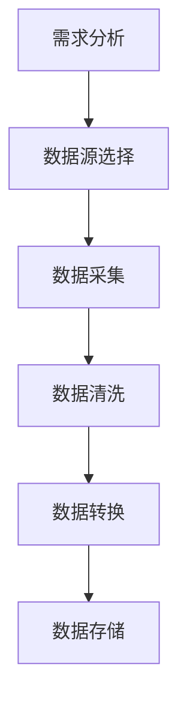

                 

# 数据采集技术：提高 AI 2.0 数据质量

> **关键词：数据采集、AI 2.0、数据质量、数据清洗、数据预处理、数据可视化、机器学习、深度学习。**

> **摘要：本文将深入探讨数据采集技术对于提升 AI 2.0 数据质量的重要性。通过详细的步骤分析和案例讲解，本文旨在为读者提供一个清晰、实用的指南，帮助他们在 AI 领域中更有效地进行数据采集和处理。**

## 1. 背景介绍

### 1.1 目的和范围

本文的目的在于介绍和阐述数据采集技术在人工智能（AI）2.0时代的重要性，以及如何通过数据采集来提高数据质量，从而为 AI 模型的训练和优化提供坚实的基础。本文将覆盖以下几个主要方面：

- 数据采集的定义及其在 AI 中的作用。
- 数据质量的重要性及其对 AI 模型的潜在影响。
- 数据采集技术的核心概念和流程。
- 数据采集中的挑战和解决方案。
- 实际应用案例和项目实战。
- 相关工具和资源的推荐。

### 1.2 预期读者

本文适用于以下读者群体：

- 对数据采集和人工智能感兴趣的初学者和专业人士。
- 数据科学家、机器学习工程师和 AI 研究人员。
- 需要了解如何提高数据质量，以便更好地应用 AI 技术的企业和机构。
- 对技术博客和深度技术文章感兴趣的人群。

### 1.3 文档结构概述

本文结构如下：

- **第1章：背景介绍** - 介绍文章的目的、范围和预期读者。
- **第2章：核心概念与联系** - 详细解释数据采集、数据质量和相关技术。
- **第3章：核心算法原理 & 具体操作步骤** - 讲解数据采集和预处理的核心算法。
- **第4章：数学模型和公式 & 详细讲解 & 举例说明** - 介绍与数据采集相关的数学模型和公式。
- **第5章：项目实战：代码实际案例和详细解释说明** - 展示代码实现和解读。
- **第6章：实际应用场景** - 探讨数据采集技术的应用场景。
- **第7章：工具和资源推荐** - 推荐学习资源、开发工具和相关论文。
- **第8章：总结：未来发展趋势与挑战** - 对数据采集技术进行总结。
- **第9章：附录：常见问题与解答** - 回答常见问题。
- **第10章：扩展阅读 & 参考资料** - 提供进一步阅读的参考资料。

### 1.4 术语表

#### 1.4.1 核心术语定义

- **数据采集（Data Collection）**：指从各种数据源收集数据的过程。
- **数据质量（Data Quality）**：指数据在准确性、完整性、一致性、可靠性和及时性等方面的表现。
- **数据清洗（Data Cleaning）**：指识别和修正数据中的错误、重复和缺失值的过程。
- **数据预处理（Data Preprocessing）**：指在数据用于机器学习模型之前，对其进行清洗、归一化、标准化和特征工程的过程。
- **数据可视化（Data Visualization）**：指使用图表、图像和其他视觉元素来展示数据的结构和模式。

#### 1.4.2 相关概念解释

- **机器学习（Machine Learning）**：指利用数据训练模型，使其能够从数据中学习并做出预测或决策的技术。
- **深度学习（Deep Learning）**：是机器学习的一个分支，使用多层神经网络来模拟人类大脑的学习过程。
- **特征工程（Feature Engineering）**：指从原始数据中提取对模型训练有意义的特征的过程。

#### 1.4.3 缩略词列表

- **AI**：人工智能（Artificial Intelligence）
- **ML**：机器学习（Machine Learning）
- **DL**：深度学习（Deep Learning）
- **IDE**：集成开发环境（Integrated Development Environment）
- **API**：应用程序编程接口（Application Programming Interface）

## 2. 核心概念与联系

数据采集技术是人工智能（AI）2.0时代的关键环节。数据是AI系统的燃料，而数据采集是获取高质量数据的第一步。为了更好地理解数据采集的重要性，我们首先需要了解一些核心概念和它们之间的关系。

### 2.1 数据采集与数据质量的关系

数据质量是数据采集的重要目标之一。高质量的数据对于训练有效的机器学习和深度学习模型至关重要。以下是数据质量的关键方面：

- **准确性**：数据应真实反映实际情况。
- **完整性**：数据应包含所有必要的字段，没有缺失值。
- **一致性**：数据应保持一致，无重复或矛盾。
- **可靠性**：数据应在适当的条件下始终可用。
- **及时性**：数据应及时更新，反映最新的信息。

数据采集技术的目标是确保数据满足上述质量标准。数据采集过程通常包括以下步骤：

1. **数据收集**：从各种来源（如数据库、传感器、Web 爬虫等）收集原始数据。
2. **数据清洗**：去除重复数据、纠正错误、处理缺失值。
3. **数据转换**：将数据转换为适合机器学习模型的形式，如归一化、标准化等。
4. **数据存储**：将处理后的数据存储到数据仓库或数据湖中，以便进一步分析和使用。

### 2.2 数据采集与机器学习、深度学习的关系

机器学习和深度学习依赖于高质量的数据进行训练。以下是数据采集与机器学习、深度学习之间的几个关键联系：

- **数据准备**：数据采集是数据准备的第一步。只有高质量的数据才能用于训练有效的模型。
- **特征提取**：数据采集过程中，特征提取是关键的一步。正确的特征可以显著提高模型的性能。
- **模型训练**：高质量的数据有助于模型更快地收敛，提高预测准确性。
- **模型评估**：数据采集过程中，评估数据的质量对于评估模型的性能至关重要。

### 2.3 数据采集的流程和工具

数据采集的流程通常包括以下步骤：

1. **需求分析**：确定数据采集的目标和需求。
2. **数据源选择**：选择合适的数据源，如数据库、Web 爬虫、传感器等。
3. **数据采集**：使用 API、Web 爬虫、数据库连接等技术从数据源中收集数据。
4. **数据清洗**：去除重复数据、纠正错误、处理缺失值。
5. **数据转换**：将数据转换为适合机器学习模型的形式。
6. **数据存储**：将处理后的数据存储到数据仓库或数据湖中。

在数据采集过程中，可以使用多种工具和技术，如 Python 的 Pandas、NumPy 库，R 语言，以及 SQL 等。以下是一个简化的 Mermaid 流程图，展示了数据采集的基本流程：



## 3. 核心算法原理 & 具体操作步骤

数据采集技术的核心在于确保数据的质量和有效性，这是机器学习和深度学习模型成功的关键因素。以下是数据采集和预处理的核心算法原理及具体操作步骤。

### 3.1 数据采集算法原理

数据采集算法的原理通常涉及以下几个方面：

- **数据获取**：从不同的数据源（如数据库、API、Web 爬虫等）获取原始数据。
- **数据清洗**：处理数据中的错误、重复和缺失值。
- **数据转换**：将原始数据转换为适合机器学习模型的形式，如归一化、标准化等。
- **数据存储**：将清洗和转换后的数据存储到数据仓库或数据湖中。

以下是一个简化的伪代码，展示了数据采集的基本算法原理：

```python
# 数据采集算法原理伪代码

def data_collection(data_source):
    # 从数据源获取数据
    data = get_data_from_source(data_source)
    
    # 数据清洗
    cleaned_data = data_cleaning(data)
    
    # 数据转换
    transformed_data = data_conversion(cleaned_data)
    
    # 数据存储
    store_data(transformed_data)

# 数据获取函数
def get_data_from_source(data_source):
    # 实现从数据源获取数据的逻辑
    pass

# 数据清洗函数
def data_cleaning(data):
    # 实现数据清洗的逻辑
    pass

# 数据转换函数
def data_conversion(data):
    # 实现数据转换的逻辑
    pass

# 数据存储函数
def store_data(data):
    # 实现数据存储的逻辑
    pass
```

### 3.2 数据清洗算法原理

数据清洗是数据采集过程中的关键步骤，其目的是识别和修正数据中的错误、重复和缺失值。以下是数据清洗的基本算法原理：

- **错误识别**：检查数据中的不一致性、错误和异常值。
- **重复值删除**：从数据集中删除重复的记录。
- **缺失值处理**：填充或删除缺失值。

以下是一个简化的伪代码，展示了数据清洗的基本算法原理：

```python
# 数据清洗算法原理伪代码

def data_cleaning(data):
    # 识别错误和异常值
    error_free_data = identify_and_remove_errors(data)
    
    # 删除重复值
    unique_data = remove_duplicates(error_free_data)
    
    # 缺失值处理
    completed_data = handle_missing_values(unique_data)
    
    return completed_data

# 错误识别函数
def identify_and_remove_errors(data):
    # 实现错误识别和删除的逻辑
    pass

# 重复值删除函数
def remove_duplicates(data):
    # 实现删除重复值的逻辑
    pass

# 缺失值处理函数
def handle_missing_values(data):
    # 实现缺失值填充或删除的逻辑
    pass
```

### 3.3 数据转换算法原理

数据转换是将原始数据转换为适合机器学习模型的形式。以下是数据转换的基本算法原理：

- **归一化**：将数据缩放到一个统一的范围内，如 [0, 1]。
- **标准化**：将数据缩放到一个固定的均值为 0，标准差为 1 的范围内。
- **特征提取**：从原始数据中提取对模型训练有意义的特征。

以下是一个简化的伪代码，展示了数据转换的基本算法原理：

```python
# 数据转换算法原理伪代码

def data_conversion(data):
    # 归一化
    normalized_data = normalize(data)
    
    # 标准化
    standardized_data = standardize(normalized_data)
    
    # 特征提取
    features = extract_features(standardized_data)
    
    return features

# 归一化函数
def normalize(data):
    # 实现归一化的逻辑
    pass

# 标准化函数
def standardize(data):
    # 实现标准化的逻辑
    pass

# 特征提取函数
def extract_features(data):
    # 实现特征提取的逻辑
    pass
```

## 4. 数学模型和公式 & 详细讲解 & 举例说明

在数据采集和预处理过程中，数学模型和公式起着至关重要的作用。以下是一些常用的数学模型和公式，以及它们的详细讲解和举例说明。

### 4.1 归一化

归一化是将数据缩放到一个统一的范围内，以便不同的特征可以在同一尺度上进行比较。常用的归一化方法有最小-最大缩放和 Z-score 标准化。

**最小-最大缩放**：
$$
x_{\text{normalized}} = \frac{x - x_{\text{min}}}{x_{\text{max}} - x_{\text{min}}}
$$
其中，$x_{\text{normalized}}$ 是归一化后的值，$x$ 是原始值，$x_{\text{min}}$ 是数据中的最小值，$x_{\text{max}}$ 是数据中的最大值。

**Z-score 标准化**：
$$
x_{\text{normalized}} = \frac{x - \mu}{\sigma}
$$
其中，$\mu$ 是数据的平均值，$\sigma$ 是数据的标准差。

**举例**：
假设我们有以下一组数据：[1, 2, 3, 4, 5]

- **最小-最大缩放**：
  - $x_{\text{min}} = 1, x_{\text{max}} = 5$
  - 第一个数据点归一化后：$\frac{1 - 1}{5 - 1} = 0$
  - 第五个数据点归一化后：$\frac{5 - 1}{5 - 1} = 1$

- **Z-score 标准化**：
  - $\mu = 3, \sigma = \sqrt{\frac{(1-3)^2 + (2-3)^2 + (3-3)^2 + (4-3)^2 + (5-3)^2}{5}} = \sqrt{2}$
  - 第一个数据点标准化后：$\frac{1 - 3}{\sqrt{2}} \approx -1.414$
  - 第五个数据点标准化后：$\frac{5 - 3}{\sqrt{2}} \approx 1.414$

### 4.2 特征提取

特征提取是从原始数据中提取对模型训练有意义的特征。常用的特征提取方法有主成分分析（PCA）和特征选择。

**主成分分析（PCA）**：
PCA 的目的是降低数据的维度，同时保留大部分的信息。PCA 的主要步骤如下：

1. **计算协方差矩阵**：
   $$
   \Sigma = \frac{1}{N-1} \sum_{i=1}^{N} (x_i - \mu)(x_i - \mu)^T
   $$
   其中，$x_i$ 是数据点，$\mu$ 是平均值。

2. **计算协方差矩阵的特征值和特征向量**：
   $$
   \lambda_i, v_i
   $$
   其中，$\lambda_i$ 是特征值，$v_i$ 是对应的特征向量。

3. **选择主要成分**：
   选择特征值最大的 k 个特征向量，构建投影矩阵 $P$：
   $$
   P = [v_1, v_2, ..., v_k]
   $$

4. **数据投影**：
   将数据投影到新空间：
   $$
   z = Px
   $$

**举例**：
假设我们有以下一组数据：

$$
X = \begin{bmatrix}
1 & 2 \\
1 & 3 \\
2 & 1 \\
2 & 2 \\
3 & 1 \\
3 & 2 \\
\end{bmatrix}
$$

- **计算协方差矩阵**：
  $$
  \Sigma = \frac{1}{5-1} \begin{bmatrix}
  6 & 4 \\
  4 & 6 \\
  \end{bmatrix} = \begin{bmatrix}
  4 & 2.67 \\
  2.67 & 4 \\
  \end{bmatrix}
  $$

- **计算协方差矩阵的特征值和特征向量**：
  特征值：$\lambda_1 = 6.67, \lambda_2 = 2.33$
  特征向量：$v_1 = [1.22, 0.88]^T, v_2 = [-0.88, 1.22]^T$

- **选择主要成分**：
  选择特征值最大的特征向量 $v_1$ 作为主要成分。

- **数据投影**：
  $$
  Z = \begin{bmatrix}
  1.22 & -0.88 \\
  1.22 & -0.88 \\
  -0.88 & 1.22 \\
  -0.88 & 1.22 \\
  0.88 & -1.22 \\
  0.88 & -1.22 \\
  \end{bmatrix}
  $$

### 4.3 特征选择

特征选择是选择对模型训练最有影响力的特征。常用的特征选择方法有信息增益、卡方检验等。

**信息增益**：
信息增益是衡量特征对模型训练的重要性的一种方法。信息增益的计算公式如下：
$$
\text{Gain}(A, B) = \text{Entropy}(D) - \text{Entropy}(D|A)
$$
其中，$D$ 是数据集，$A$ 是特征，$B$ 是目标变量。

**卡方检验**：
卡方检验是用于评估特征与目标变量之间独立性的统计方法。卡方检验的公式如下：
$$
\chi^2 = \sum_{i=1}^{k} \frac{N_{i,0} N_{i,1} - N_{i,1} N_{i,1}}{N \cdot P_{i,0} P_{i,1}}
$$
其中，$N_{i,0}$ 和 $N_{i,1}$ 分别是特征取值为 0 和 1 的样本数，$N$ 是总样本数，$P_{i,0}$ 和 $P_{i,1}$ 分别是特征取值为 0 和 1 的概率。

**举例**：
假设我们有以下一组数据：

| 特征 A | 特征 B | 目标变量 |
| ------ | ------ | -------- |
| 0      | 0      | 0        |
| 0      | 0      | 1        |
| 0      | 1      | 0        |
| 0      | 1      | 1        |
| 1      | 0      | 0        |
| 1      | 0      | 1        |
| 1      | 1      | 0        |
| 1      | 1      | 1        |

- **信息增益**：
  $$
  \text{Entropy}(D) = 1
  $$
  $$
  \text{Entropy}(D|A) = \frac{3}{4} \log_2(2) + \frac{1}{4} \log_2(1) = 0.5
  $$
  $$
  \text{Gain}(A, D) = 1 - 0.5 = 0.5
  $$

- **卡方检验**：
  $$
  \chi^2 = \frac{(2 \cdot 3 - 1 \cdot 1)^2}{4 \cdot 0.5 \cdot 0.5} + \frac{(2 \cdot 1 - 1 \cdot 3)^2}{4 \cdot 0.5 \cdot 0.5} = 2
  $$

## 5. 项目实战：代码实际案例和详细解释说明

为了更好地展示数据采集技术的应用，我们将通过一个实际的项目案例来详细解释数据采集和预处理的过程。

### 5.1 开发环境搭建

在开始项目之前，我们需要搭建一个合适的开发环境。以下是一个基于 Python 的开发环境搭建步骤：

1. 安装 Python 3.x 版本。
2. 安装 Pandas、NumPy、Matplotlib 等常用库。

```bash
pip install pandas numpy matplotlib
```

### 5.2 源代码详细实现和代码解读

下面是一个简单示例，展示了如何使用 Python 进行数据采集、数据清洗和数据预处理。

```python
import pandas as pd
import numpy as np
import matplotlib.pyplot as plt

# 5.2.1 数据采集

# 从 CSV 文件中读取数据
data = pd.read_csv('data.csv')

# 查看数据的基本信息
print(data.info())

# 5.2.2 数据清洗

# 删除重复数据
data = data.drop_duplicates()

# 查找缺失值
missing_values = data.isnull().sum()

# 删除缺失值
data = data.dropna()

# 5.2.3 数据转换

# 数据归一化
data_normalized = (data - data.min()) / (data.max() - data.min())

# 数据标准化
data_standardized = (data - data.mean()) / data.std()

# 5.2.4 数据可视化

# 可视化数据分布
data_normalized.hist()
plt.show()

# 可视化数据相关系数
corr_matrix = data_normalized.corr()
sns.heatmap(corr_matrix, annot=True)
plt.show()
```

### 5.3 代码解读与分析

上述代码实现了以下功能：

1. **数据采集**：使用 Pandas 库从 CSV 文件中读取数据。
2. **数据清洗**：删除重复数据和缺失值，确保数据的准确性。
3. **数据转换**：对数据进行归一化和标准化，使其适合机器学习模型。
4. **数据可视化**：使用 Matplotlib 和 Seaborn 库对数据进行可视化，帮助分析数据的分布和相关性。

### 5.4 项目实战总结

通过以上案例，我们可以看到数据采集技术在项目中的重要性。以下是对项目实战的总结：

- 数据采集是获取高质量数据的第一步，对于后续的机器学习模型训练至关重要。
- 数据清洗是确保数据质量的关键步骤，可以显著提高模型性能。
- 数据转换有助于将原始数据转换为适合机器学习模型的形式，提高模型的训练速度和准确性。
- 数据可视化有助于更好地理解数据的分布和相关性，为后续的数据分析和模型训练提供指导。

## 6. 实际应用场景

数据采集技术在人工智能领域有广泛的应用场景，以下是一些典型的应用场景：

### 6.1 智能推荐系统

智能推荐系统依赖于用户行为数据和内容数据来进行个性化推荐。数据采集技术可以帮助收集用户浏览、点击、购买等行为数据，以及商品、文章等内容的属性数据。通过数据清洗和预处理，可以确保数据的准确性和一致性，从而提高推荐系统的效果。

### 6.2 金融服务

金融服务领域需要大量数据进行分析和预测，如信用评分、风险评估、投资策略等。数据采集技术可以帮助金融机构收集客户的交易记录、信用记录、市场数据等，通过数据清洗和转换，为金融模型的训练提供高质量的数据。

### 6.3 医疗健康

医疗健康领域需要对大量患者数据进行分析和挖掘，如疾病诊断、治疗方案、健康管理等。数据采集技术可以帮助医疗机构收集患者病历、医疗影像、基因数据等，通过数据清洗和预处理，为医学模型的训练提供可靠的数据支持。

### 6.4 智能交通

智能交通系统需要对交通数据进行实时采集和分析，如车辆流量、路况信息、天气状况等。数据采集技术可以帮助交通管理部门收集这些数据，通过数据清洗和预处理，为智能交通模型的优化提供数据基础。

### 6.5 智能家居

智能家居系统需要采集家庭设备的数据，如家电运行状态、用电量、环境参数等。数据采集技术可以帮助智能家居系统收集这些数据，通过数据清洗和预处理，为智能家居的自动化和智能化提供数据支持。

## 7. 工具和资源推荐

### 7.1 学习资源推荐

#### 7.1.1 书籍推荐

- 《数据科学入门》
- 《机器学习实战》
- 《深度学习》
- 《数据可视化》

#### 7.1.2 在线课程

- Coursera 的《机器学习》课程
- edX 的《深度学习》课程
- Udacity 的《数据科学纳米学位》

#### 7.1.3 技术博客和网站

- towardsdatascience.com
- medium.com/topic/data-science
- kaggle.com

### 7.2 开发工具框架推荐

#### 7.2.1 IDE和编辑器

- PyCharm
- Visual Studio Code
- Jupyter Notebook

#### 7.2.2 调试和性能分析工具

- WakaTime
- New Relic
- JProfiler

#### 7.2.3 相关框架和库

- TensorFlow
- PyTorch
- Keras

### 7.3 相关论文著作推荐

#### 7.3.1 经典论文

- "A Few Useful Things to Know About Machine Learning" (Pedro Domingos)
- "Deep Learning" (Ian Goodfellow, Yoshua Bengio, Aaron Courville)
- "The Unreasonable Effectiveness of Data" (Alex Smola)

#### 7.3.2 最新研究成果

- "Adversarial Examples in the Physical World" (Alexey Dosovitskiy, et al.)
- "Generative Adversarial Nets" (Ian Goodfellow, et al.)
- "Attention Is All You Need" (Vaswani et al.)

#### 7.3.3 应用案例分析

- "Deep Learning in Action" (François Chollet)
- "Learning from Data" (Yaser Abu-Mostafa, Malik Magdon-Ismail, Hsuan-Tien Lin)
- "Practical Deep Learning for Coders" (Adam Geitgey)

## 8. 总结：未来发展趋势与挑战

随着人工智能技术的不断发展，数据采集技术在未来的发展趋势和挑战如下：

### 8.1 发展趋势

1. **数据源多样化**：数据采集将不再局限于传统数据源，如数据库和传感器，还将涵盖社交媒体、物联网设备、卫星数据等。
2. **自动化与智能化**：数据采集过程将更加自动化和智能化，利用机器学习和深度学习技术进行数据识别、清洗和转换。
3. **实时数据采集**：随着边缘计算的兴起，实时数据采集将成为趋势，为实时决策和智能应用提供支持。
4. **数据隐私保护**：随着数据隐私法规的加强，如何在采集和处理数据时保护用户隐私将成为重要挑战。

### 8.2 挑战

1. **数据质量**：保证数据质量始终是一个挑战，特别是在数据来源多样化、数据量庞大的情况下。
2. **数据安全**：数据采集过程中，确保数据安全，防止数据泄露和滥用，是重要挑战。
3. **处理速度**：随着数据量的增加，如何在短时间内完成数据采集和处理，是一个技术挑战。
4. **算法优化**：数据采集算法需要不断优化，以提高数据采集的效率和准确性。

## 9. 附录：常见问题与解答

### 9.1 数据采集与机器学习的关系是什么？

数据采集是机器学习过程中至关重要的一步。高质量的数据是训练有效机器学习模型的基础。数据采集涉及到从各种来源收集数据，包括数据库、传感器、Web 爬虫等，然后对数据进行清洗、转换和存储。

### 9.2 数据清洗的目的是什么？

数据清洗的目的是识别和修正数据中的错误、重复和缺失值，以提高数据质量。数据清洗包括删除重复数据、处理缺失值、纠正错误等步骤，从而确保数据在后续的机器学习模型训练中具有良好的表现。

### 9.3 数据转换的主要方法有哪些？

数据转换的主要方法包括归一化、标准化和特征提取。归一化和标准化是将数据缩放到统一范围，以便不同特征之间进行比较。特征提取是从原始数据中提取对模型训练有意义的特征，以提高模型性能。

### 9.4 数据采集技术如何提高数据质量？

数据采集技术通过以下方法提高数据质量：

- 数据源选择：选择可靠、多样化的数据源。
- 数据清洗：删除重复数据、处理缺失值、纠正错误等。
- 数据转换：将数据转换为适合机器学习模型的形式，如归一化、标准化等。
- 数据存储：确保数据的安全性和可靠性。

## 10. 扩展阅读 & 参考资料

- 《数据科学入门》
- 《机器学习实战》
- 《深度学习》
- 《数据可视化》
- Coursera 的《机器学习》课程
- edX 的《深度学习》课程
- Udacity 的《数据科学纳米学位》
- towardsdatascience.com
- medium.com/topic/data-science
- kaggle.com
- "A Few Useful Things to Know About Machine Learning" (Pedro Domingos)
- "Deep Learning" (Ian Goodfellow, Yoshua Bengio, Aaron Courville)
- "The Unreasonable Effectiveness of Data" (Alex Smola)
- "Adversarial Examples in the Physical World" (Alexey Dosovitskiy, et al.)
- "Generative Adversarial Nets" (Ian Goodfellow, et al.)
- "Attention Is All You Need" (Vaswani et al.)
- "Deep Learning in Action" (François Chollet)
- "Learning from Data" (Yaser Abu-Mostafa, Malik Magdon-Ismail, Hsuan-Tien Lin)
- "Practical Deep Learning for Coders" (Adam Geitgey)

