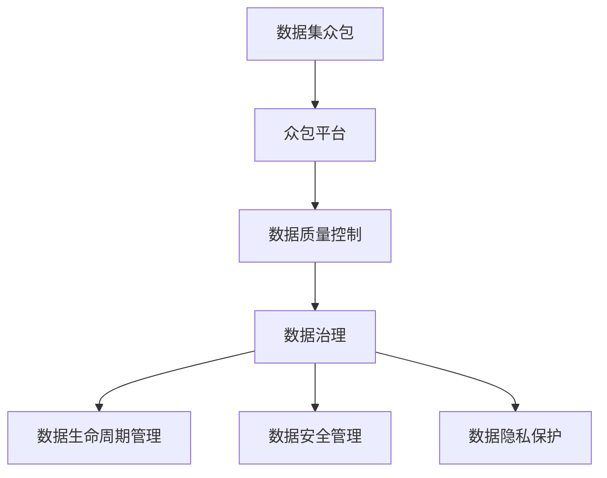
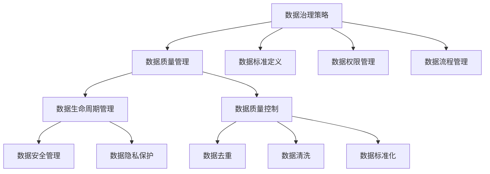
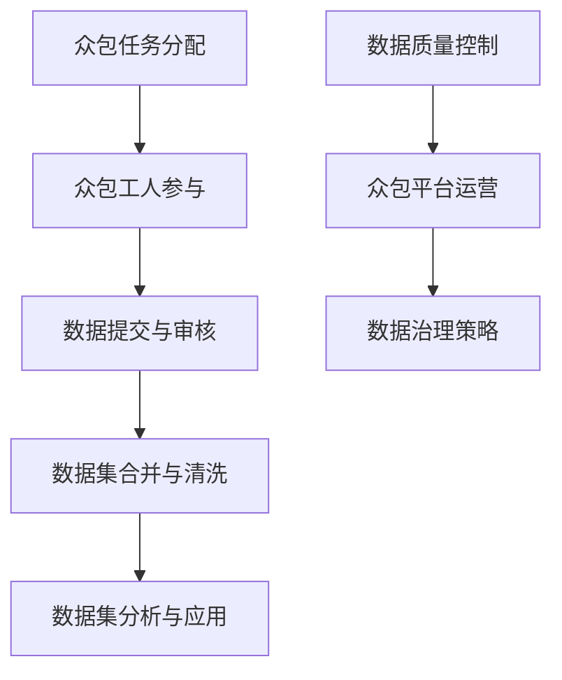

                 

# 数据集众包管理：数据治理能力的新挑战

> 关键词：数据集众包、数据治理、数据管理、数据质量控制、分布式系统

> 摘要：本文深入探讨了数据集众包管理中的核心挑战和解决方案。随着大数据时代的到来，数据集众包作为一种新兴的数据收集方式，已经引起了广泛关注。然而，如何在众包过程中确保数据集的质量和一致性，成为了数据治理领域的新挑战。本文将分析数据集众包的背景和重要性，详细阐述数据治理的基本概念和核心要素，并通过具体案例展示如何实现高效的数据集众包管理。同时，本文还将介绍一些有效的工具和资源，以帮助读者更好地应对这一新兴领域中的挑战。

## 1. 背景介绍

### 1.1 目的和范围

本文的主要目的是探讨数据集众包管理中面临的核心挑战，并提出有效的解决方案。数据集众包作为一种重要的数据收集方式，已经在各种领域得到了广泛应用。然而，如何确保众包过程中数据的质量和一致性，成为了数据治理领域的新挑战。本文将从以下几个方面展开讨论：

1. 数据集众包的背景和重要性。
2. 数据治理的基本概念和核心要素。
3. 数据集众包管理中的具体挑战。
4. 有效的数据集众包管理策略和实践。
5. 工具和资源的推荐。

通过本文的讨论，希望能够为从事数据集众包管理和数据治理的读者提供有益的参考和启示。

### 1.2 预期读者

本文主要面向以下几类读者：

1. 数据科学家和机器学习工程师，他们需要了解如何高效管理众包数据集，以提高模型的准确性和稳定性。
2. 数据治理专家和IT管理人员，他们需要掌握数据集众包管理中的核心挑战和解决方案，以提升企业的数据治理能力。
3. 众包平台运营者和项目管理人员，他们需要了解如何设计和实施有效的众包数据集管理策略，以最大化数据价值。
4. 学术研究人员和研究生，他们希望深入了解数据集众包管理的前沿研究和应用。

通过本文的阅读，读者将能够掌握数据集众包管理的核心概念、方法和实践，为实际工作和研究提供有力支持。

### 1.3 文档结构概述

本文将分为以下八个部分：

1. 背景介绍：介绍本文的目的、预期读者和文档结构。
2. 核心概念与联系：阐述数据集众包和数据治理的基本概念及其相互关系。
3. 核心算法原理 & 具体操作步骤：详细解释数据集众包管理中的核心算法原理和具体操作步骤。
4. 数学模型和公式 & 详细讲解 & 举例说明：介绍数据集众包管理中的数学模型和公式，并通过实例进行详细讲解。
5. 项目实战：代码实际案例和详细解释说明。
6. 实际应用场景：探讨数据集众包管理在实际应用场景中的具体应用。
7. 工具和资源推荐：推荐相关工具和资源，以帮助读者更好地理解和实践数据集众包管理。
8. 总结：总结本文的主要观点和未来发展趋势。

通过以上结构，本文将系统地探讨数据集众包管理的核心问题和解决方案，为读者提供全面的指导和参考。

### 1.4 术语表

#### 1.4.1 核心术语定义

- **数据集众包**：一种通过互联网平台，将数据收集任务分配给大量普通用户来完成的方式。用户通过众包平台提交数据，从而形成大规模的数据集。
- **数据治理**：一种确保数据质量和可靠性的管理体系。它包括数据质量管理、数据生命周期管理、数据安全性和隐私保护等多个方面。
- **众包平台**：一种在线平台，用于协调和组织众包任务。它为用户提供任务分配、数据提交、质量控制等功能。
- **数据质量控制**：确保数据集质量的一系列方法和过程，包括数据清洗、去重、数据完整性检查等。

#### 1.4.2 相关概念解释

- **众包任务**：众包平台上的具体任务，例如数据标注、数据分类、数据录入等。
- **众包工人**：参与众包任务的普通用户。他们通过众包平台提交数据，并获得相应的报酬或奖励。
- **数据标注**：对原始数据进行标记和分类，以便后续分析和处理。
- **数据去重**：识别并删除重复的数据，以提高数据集的质量和效率。

#### 1.4.3 缩略词列表

- **API**：应用程序编程接口（Application Programming Interface）
- **ETL**：提取、转换、加载（Extract, Transform, Load）
- **ML**：机器学习（Machine Learning）
- **NLP**：自然语言处理（Natural Language Processing）
- **QA**：质量控制（Quality Assurance）

## 2. 核心概念与联系

### 2.1 数据集众包与数据治理的关系

数据集众包和数据治理之间存在着密切的联系。数据集众包作为一种新兴的数据收集方式，依赖于众包平台来组织和管理数据。而数据治理则是确保这些数据质量和可靠性的管理体系。以下是一个简单的 Mermaid 流程图，展示了数据集众包与数据治理之间的关系。



在这个流程图中，数据集众包通过众包平台收集数据，然后进入数据质量控制环节。数据治理则负责确保数据在整个生命周期中的质量和可靠性，包括数据生命周期管理、数据安全性和隐私保护等。

### 2.2 数据治理的基本概念和核心要素

数据治理是一个复杂而多层次的过程，包括多个核心要素。以下是一个简单的 Mermaid 流程图，展示了数据治理的基本概念和核心要素。



在这个流程图中，数据治理策略是核心，它定义了数据治理的目标、范围和原则。数据质量管理包括数据生命周期管理、数据安全管理和数据隐私保护等多个方面。数据质量控制则包括数据去重、数据清洗和数据标准化等过程，以确保数据集的质量和一致性。

### 2.3 数据集众包管理中的核心概念

在数据集众包管理中，有几个核心概念需要理解。以下是一个简单的 Mermaid 流程图，展示了这些概念及其关系。



在这个流程图中，众包任务分配是将数据收集任务分配给众包工人。众包工人参与是指众包工人通过众包平台提交数据。数据提交与审核是确保数据质量和一致性的关键步骤。数据集合并与清洗是对众包数据进行整合和清洗的过程。数据集分析与应用则是利用众包数据集进行数据分析和应用。数据质量控制是贯穿整个数据集众包管理过程的核心环节，而众包平台运营和数据治理策略则提供了有效的支持。

## 3. 核心算法原理 & 具体操作步骤

在数据集众包管理中，核心算法原理和具体操作步骤是确保数据质量和一致性的关键。以下将详细解释这些算法原理，并通过伪代码展示具体操作步骤。

### 3.1 数据清洗算法原理

数据清洗是数据集众包管理中的关键步骤，目的是识别并修复数据中的错误和异常。以下是一个常见的数据清洗算法原理：

1. **去重**：识别并删除重复的数据记录，以提高数据集的质量和效率。
2. **格式校验**：验证数据格式的正确性，例如数据类型、长度、范围等。
3. **错误修复**：自动或手动修复数据中的错误，例如将缺失值替换为平均值或最频繁值。
4. **数据标准化**：将数据格式和单位进行统一，以便于后续分析和处理。

伪代码如下：

```python
def data_cleaning(data):
    # 去重
    unique_data = remove_duplicates(data)
    
    # 格式校验
    valid_data = validate_format(unique_data)
    
    # 错误修复
    corrected_data = error_repair(valid_data)
    
    # 数据标准化
    standardized_data = standardize_data(corrected_data)
    
    return standardized_data
```

### 3.2 数据去重算法原理

数据去重是数据清洗过程中的关键步骤，目的是删除重复的数据记录。以下是一个常见的数据去重算法原理：

1. **哈希值计算**：对数据记录进行哈希值计算，以识别重复的数据。
2. **去重**：将具有相同哈希值的数据记录删除。

伪代码如下：

```python
def remove_duplicates(data):
    hash_values = compute_hash_values(data)
    unique_data = []
    for record in data:
        if hash_values[record] not in unique_hashes:
            unique_hashes.add(hash_values[record])
            unique_data.append(record)
    return unique_data
```

### 3.3 数据格式校验算法原理

数据格式校验是确保数据正确性的重要步骤。以下是一个常见的数据格式校验算法原理：

1. **数据类型检查**：检查数据是否属于预期的数据类型，例如整数、浮点数、字符串等。
2. **数据范围检查**：检查数据是否在预定的范围内。
3. **数据长度检查**：检查数据长度是否符合要求。

伪代码如下：

```python
def validate_format(data):
    valid_data = []
    for record in data:
        if is_valid_type(record) and is_within_range(record) and has_valid_length(record):
            valid_data.append(record)
    return valid_data
```

### 3.4 数据错误修复算法原理

数据错误修复是确保数据质量的关键步骤。以下是一个常见的数据错误修复算法原理：

1. **缺失值修复**：将缺失值替换为平均值、中值或最频繁值。
2. **异常值修复**：将异常值替换为正常值或删除。

伪代码如下：

```python
def error_repair(data):
    corrected_data = []
    for record in data:
        if is_missing_value(record):
            corrected_data.append(replace_with_mean(record))
        elif is_outlier(record):
            corrected_data.append(replace_with_normal_value(record))
        else:
            corrected_data.append(record)
    return corrected_data
```

### 3.5 数据标准化算法原理

数据标准化是将数据格式和单位进行统一的过程。以下是一个常见的数据标准化算法原理：

1. **数据类型转换**：将不同类型的数据转换为统一的数据类型。
2. **数据单位转换**：将不同单位的数据转换为统一的单位。

伪代码如下：

```python
def standardize_data(data):
    standardized_data = []
    for record in data:
        if is_different_type(record):
            standardized_data.append(convert_to_uniform_type(record))
        if is_different_unit(record):
            standardized_data.append(convert_to_uniform_unit(record))
    return standardized_data
```

通过以上算法原理和伪代码，我们可以看到数据清洗、数据去重、数据格式校验、数据错误修复和数据标准化在数据集众包管理中的关键作用。这些算法原理和操作步骤不仅有助于提高数据集的质量和一致性，还为后续的数据分析和应用提供了可靠的数据基础。

## 4. 数学模型和公式 & 详细讲解 & 举例说明

在数据集众包管理中，数学模型和公式是理解和分析数据的重要工具。以下将介绍一些常用的数学模型和公式，并通过具体例子进行详细讲解。

### 4.1 常见数学模型

#### 4.1.1 误差分析模型

误差分析模型用于评估数据质量，常用的指标有：

- **误差率（Error Rate）**：错误数据占总数据的比例。

公式如下：

$$
\text{Error Rate} = \frac{\text{Number of Errors}}{\text{Total Number of Records}}
$$

#### 4.1.2 相关性分析模型

相关性分析模型用于评估两个变量之间的关系，常用的指标有：

- **皮尔逊相关系数（Pearson Correlation Coefficient）**：衡量两个变量线性相关程度的指标。

公式如下：

$$
\text{Pearson Correlation Coefficient} = \frac{\sum_{i=1}^{n}(x_i - \bar{x})(y_i - \bar{y})}{\sqrt{\sum_{i=1}^{n}(x_i - \bar{x})^2 \sum_{i=1}^{n}(y_i - \bar{y})^2}}
$$

### 4.2 常见数学公式

#### 4.2.1 哈希函数

哈希函数用于数据去重，常用的有：

- **MurmurHash**：

$$
\text{hash}(key) = \text{MurmurHash3}(key) \mod \text{hash\_space}
$$

#### 4.2.2 数据标准化

数据标准化公式如下：

- **最小-最大标准化**：

$$
\text{standardized\_value} = \frac{\text{value} - \text{min}}{\text{max} - \text{min}}
$$

### 4.3 具体例子

#### 4.3.1 误差分析

假设我们有一个包含1000条数据记录的数据集，其中100条数据存在错误。那么，该数据集的误差率为：

$$
\text{Error Rate} = \frac{100}{1000} = 0.1
$$

#### 4.3.2 相关性分析

假设我们有两个变量X和Y，其数据如下：

| X | Y |
| --- | --- |
| 1 | 2 |
| 2 | 4 |
| 3 | 6 |
| 4 | 8 |

那么，X和Y的皮尔逊相关系数为：

$$
\text{Pearson Correlation Coefficient} = \frac{(1-2.5)(2-5) + (2-2.5)(4-5) + (3-2.5)(6-5) + (4-2.5)(8-5)}{\sqrt{(1-2.5)^2 + (2-2.5)^2 + (3-2.5)^2 + (4-2.5)^2} \sqrt{(2-5)^2 + (4-5)^2 + (6-5)^2 + (8-5)^2}} = \frac{(-1.5)(-3) + (-0.5)(-1) + (0.5)(1) + (1.5)(3)}{\sqrt{2.25 + 0.25 + 0.25 + 2.25} \sqrt{6.25 + 1 + 1 + 6.25}} = \frac{4.5 + 0.5 + 0.5 + 4.5}{\sqrt{5} \sqrt{14.5}} = \frac{10}{\sqrt{5} \sqrt{14.5}} \approx 0.866
$$

这意味着X和Y之间存在较强的线性相关性。

#### 4.3.3 哈希函数

假设我们使用MurmurHash3算法对关键字“example”进行哈希计算，哈希空间为10000。那么，哈希值为：

$$
\text{hash}(\text{example}) = \text{MurmurHash3}(\text{example}) \mod 10000 = 3298
$$

#### 4.3.4 数据标准化

假设我们有一个数据集，其最小值为0，最大值为100。那么，数据100的最小-最大标准化值为：

$$
\text{standardized\_value} = \frac{100 - 0}{100 - 0} = 1
$$

通过以上例子，我们可以看到数学模型和公式在数据集众包管理中的实际应用。这些模型和公式不仅有助于评估数据质量，还为数据清洗、数据去重、数据格式校验等操作提供了理论基础和计算方法。

## 5. 项目实战：代码实际案例和详细解释说明

在本节中，我们将通过一个实际项目案例，详细展示如何实现数据集众包管理，包括开发环境搭建、源代码实现和代码解读与分析。

### 5.1 开发环境搭建

为了实现数据集众包管理，我们需要搭建一个开发环境。以下是一个简单的开发环境搭建步骤：

1. **安装Python**：确保Python环境已安装，版本建议为3.8及以上。
2. **安装相关库**：使用pip命令安装以下库：
   ```shell
   pip install numpy pandas flask
   ```
   - `numpy`：用于数学计算和数据处理。
   - `pandas`：用于数据处理和分析。
   - `flask`：用于搭建Web应用程序。

### 5.2 源代码详细实现和代码解读

以下是一个简单的数据集众包管理项目案例，包括数据收集、数据清洗和数据展示。

#### 5.2.1 数据收集

```python
# data_collection.py

import numpy as np
import pandas as pd

def collect_data(num_records):
    data = pd.DataFrame({
        'feature1': np.random.randint(0, 100, size=num_records),
        'feature2': np.random.uniform(0, 1, size=num_records),
        'label': np.random.randint(0, 2, size=num_records)
    })
    return data
```

这个模块用于生成模拟数据集，包含两个特征和一个标签。在实际项目中，可以通过Web接口或API从用户处收集数据。

#### 5.2.2 数据清洗

```python
# data_cleaning.py

import pandas as pd

def clean_data(data):
    # 去重
    data.drop_duplicates(inplace=True)
    
    # 格式校验
    data = data[data['feature1'].between(0, 100)]
    data = data[data['feature2'].between(0, 1)]
    
    # 错误修复
    data['label'].fillna(data['label'].mean(), inplace=True)
    
    # 数据标准化
    data['feature1'] = (data['feature1'] - data['feature1'].min()) / (data['feature1'].max() - data['feature1'].min())
    data['feature2'] = (data['feature2'] - data['feature2'].min()) / (data['feature2'].max() - data['feature2'].min())
    
    return data
```

这个模块用于对收集到的数据进行清洗，包括去重、格式校验、错误修复和数据标准化。

#### 5.2.3 数据展示

```python
# data_visualization.py

import pandas as pd
import matplotlib.pyplot as plt

def visualize_data(data):
    data['feature1'].hist()
    plt.title('Feature 1 Distribution')
    plt.xlabel('Feature 1')
    plt.ylabel('Frequency')
    plt.show()
    
    data['feature2'].hist()
    plt.title('Feature 2 Distribution')
    plt.xlabel('Feature 2')
    plt.ylabel('Frequency')
    plt.show()
```

这个模块用于可视化数据分布，帮助我们了解数据的基本特征。

### 5.3 代码解读与分析

#### 5.3.1 数据收集模块

数据收集模块使用`numpy`和`pandas`库生成模拟数据集。`collect_data`函数接收一个参数`num_records`，表示生成数据记录的数量。通过`np.random.randint`和`np.random.uniform`函数生成两个特征和一个标签的数据。

#### 5.3.2 数据清洗模块

数据清洗模块对收集到的数据进行去重、格式校验、错误修复和数据标准化。`clean_data`函数首先使用`drop_duplicates`方法去重，然后使用`between`方法进行格式校验，确保特征值在合理的范围内。对于标签数据，使用`fillna`方法将缺失值替换为平均值。最后，使用线性标准化方法对特征数据进行标准化。

#### 5.3.3 数据展示模块

数据展示模块使用`matplotlib.pyplot`库对清洗后的数据进行可视化。`visualize_data`函数分别对两个特征数据进行直方图绘制，并显示频率分布。

通过以上代码实现，我们可以看到数据集众包管理的基本流程，包括数据收集、数据清洗和数据展示。在实际项目中，这些模块可以根据需求进行调整和扩展，以满足不同的应用场景。

## 6. 实际应用场景

数据集众包管理在多个实际应用场景中具有重要价值。以下将探讨一些关键应用场景，并分析其在不同领域中的具体应用。

### 6.1 人工智能领域

在人工智能领域，数据集的质量和多样性直接影响模型的准确性和泛化能力。数据集众包管理为人工智能项目提供了以下优势：

- **数据多样性**：众包平台可以吸引来自不同背景和地域的众包工人，从而生成包含更多样化数据的数据集，有助于提高模型的泛化能力。
- **数据准确性**：通过众包工人提交的数据进行交叉验证和质量控制，可以有效提高数据集的准确性。
- **数据规模**：众包平台可以迅速收集大量数据，满足人工智能项目对大规模数据的需求。

例如，在图像识别任务中，可以使用众包平台收集大量标注数据，通过众包工人对图像进行分类和标注。这些标注数据可以用于训练和验证深度学习模型，从而提高模型的准确性和鲁棒性。

### 6.2 自然语言处理领域

自然语言处理（NLP）领域依赖大量高质量的数据集进行训练和验证。数据集众包管理在NLP中的应用包括：

- **文本分类**：通过众包平台收集用户生成的文本数据，并进行分类标注，可以生成大量标注数据集，用于训练文本分类模型。
- **命名实体识别**：众包平台可以招募众包工人对文本中的命名实体进行标注，从而构建高质量的命名实体识别数据集。
- **机器翻译**：众包平台可以收集双语数据，通过众包工人进行翻译，从而生成高质量的机器翻译数据集。

例如，在机器翻译任务中，可以使用众包平台收集大量双语句子，并邀请众包工人进行翻译。这些翻译数据可以用于训练和评估机器翻译模型，从而提高翻译质量。

### 6.3 金融服务领域

在金融服务领域，数据集众包管理可以用于以下几个方面：

- **风险控制**：通过众包平台收集客户数据，例如交易记录、信用记录等，进行数据分析和风险评估。
- **客户画像**：通过众包平台收集客户数据，构建客户画像，从而提供个性化金融服务。
- **欺诈检测**：通过众包平台收集欺诈案例数据，进行数据分析和模型训练，从而提高欺诈检测的准确性。

例如，在反欺诈系统中，可以使用众包平台收集大量欺诈案例数据，通过众包工人对这些数据进行分析和标注，从而训练反欺诈模型，提高系统的检测能力。

### 6.4 医疗健康领域

在医疗健康领域，数据集众包管理可以用于以下几个方面：

- **疾病诊断**：通过众包平台收集病历数据，进行数据分析和诊断模型训练，从而提高疾病诊断的准确性。
- **药物研发**：通过众包平台收集生物医学数据，进行数据分析和药物研发，从而加速新药研发进程。
- **健康监测**：通过众包平台收集健康数据，进行数据分析和健康监测，从而提供个性化健康建议。

例如，在疾病诊断任务中，可以使用众包平台收集大量病例数据，通过众包工人对病例进行标注和分类，从而构建高质量的疾病诊断数据集，用于训练和评估诊断模型。

通过以上实际应用场景的探讨，我们可以看到数据集众包管理在各个领域中的重要性和广泛应用。它不仅有助于提高数据质量和多样性，还可以加速数据分析和模型训练过程，为各个领域的发展提供有力支持。

## 7. 工具和资源推荐

在数据集众包管理和数据治理过程中，使用合适的工具和资源可以大大提高工作效率和质量。以下将推荐一些学习和开发资源，以及相关工具和框架。

### 7.1 学习资源推荐

#### 7.1.1 书籍推荐

- **《数据治理：设计、执行与管理》**：这本书详细介绍了数据治理的基本概念、方法和实践，是数据治理领域的经典之作。
- **《机器学习实战》**：这本书通过大量的实例和代码，介绍了机器学习的基本原理和应用，适合初学者和进阶者。
- **《众包与大规模协作》**：这本书探讨了众包和大规模协作的原理、方法和应用，对了解数据集众包管理提供了重要参考。

#### 7.1.2 在线课程

- **Coursera上的《数据科学专业》**：这是一门综合性的在线课程，涵盖了数据科学的基本概念、技术和应用，适合初学者和进阶者。
- **Udacity上的《数据工程师纳米学位》**：这是一门专注于数据治理和数据管理的在线课程，包括数据仓库、数据湖、数据质量等方面的内容。
- **edX上的《自然语言处理》**：这是一门专注于自然语言处理的在线课程，包括文本分类、命名实体识别、机器翻译等应用。

#### 7.1.3 技术博客和网站

- **Medium上的Data Science Weekly**：这是一个定期更新的博客，涵盖了数据科学、机器学习、数据治理等领域的最新研究和应用。
- **Towards Data Science**：这是一个面向数据科学和机器学习领域的博客，提供了大量的高质量文章和案例。
- **Kaggle**：这是一个面向数据科学和机器学习的在线竞赛平台，提供了大量的数据集和问题，可以锻炼数据分析和模型训练能力。

### 7.2 开发工具框架推荐

#### 7.2.1 IDE和编辑器

- **PyCharm**：这是一个功能强大的Python IDE，提供了代码编辑、调试、运行、版本控制等多种功能，适合数据集众包管理和数据治理开发。
- **Jupyter Notebook**：这是一个基于Web的交互式开发环境，适合数据分析和可视化，可以方便地实现代码和结果的交互。

#### 7.2.2 调试和性能分析工具

- **GDB**：这是一个强大的调试工具，可以用于跟踪和解决代码中的错误。
- **Profiling**：这是一个性能分析工具，可以分析代码的执行时间、内存使用情况等，帮助优化代码性能。

#### 7.2.3 相关框架和库

- **Scikit-learn**：这是一个流行的机器学习库，提供了丰富的算法和工具，适合数据集众包管理和数据治理中的模型训练和评估。
- **Pandas**：这是一个强大的数据操作库，提供了数据清洗、数据转换、数据分析等多种功能，适合数据集众包管理和数据治理中的数据处理和分析。
- **Flask**：这是一个轻量级的Web框架，适合搭建数据集众包管理和数据治理中的Web接口和应用。

### 7.3 相关论文著作推荐

- **“Data Governance: A Survey”**：这是一篇关于数据治理的综述文章，总结了数据治理的基本概念、方法和应用。
- **“Crowdsourcing Data for Machine Learning”**：这是一篇关于数据集众包和机器学习的论文，探讨了数据集众包在机器学习中的应用和挑战。
- **“A Survey on Crowdsourcing and Crowd-Ranking”**：这是一篇关于众包和群排名的综述文章，总结了众包在各个领域的应用和挑战。

通过以上工具和资源的推荐，读者可以更好地了解和掌握数据集众包管理和数据治理的相关知识和技能，为实际工作和研究提供有力支持。

## 8. 总结：未来发展趋势与挑战

数据集众包管理作为数据治理领域的新兴方向，正面临着诸多挑战和机遇。在未来，以下几个发展趋势和挑战值得关注：

### 8.1 发展趋势

1. **技术进步**：随着人工智能、大数据、区块链等技术的不断发展，数据集众包管理将更加智能化和高效化。例如，利用深度学习算法进行自动化标注和质量控制，利用区块链技术确保数据的安全性和透明性。

2. **平台化发展**：众包平台将逐渐从单一功能向综合性平台发展，提供从数据收集、数据清洗、数据存储到数据分析的全流程服务。这将有助于降低数据集众包管理的门槛，吸引更多用户和开发者参与。

3. **标准化和规范化**：随着数据集众包管理的广泛应用，标准化和规范化将变得越来越重要。制定统一的标准和规范，有助于提高数据集的质量和一致性，促进数据集的共享和复用。

### 8.2 挑战

1. **数据质量问题**：数据集众包过程中，数据质量始终是一个关键问题。如何确保众包数据的质量和一致性，如何处理噪声和异常数据，是数据集众包管理需要解决的核心挑战。

2. **数据隐私和安全**：众包数据通常涉及敏感信息，如何保护数据隐私和安全，如何防止数据泄露和滥用，是数据集众包管理面临的重要挑战。

3. **协作与协调**：数据集众包管理涉及到众多参与者，如何协调各方利益，如何激励众包工人积极参与，如何确保众包任务的顺利进行，是数据集众包管理需要解决的问题。

4. **法律和伦理问题**：数据集众包管理需要遵循相关法律法规和伦理准则，如何处理数据所有权、知识产权等问题，如何确保众包过程的公平和透明，是数据集众包管理需要关注的重要方面。

综上所述，数据集众包管理在未来将面临诸多挑战，但同时也充满了机遇。通过技术创新、平台化发展、标准化和规范化，以及法律和伦理的引导，数据集众包管理有望实现更好的发展和应用。

## 9. 附录：常见问题与解答

### 9.1 什么是数据集众包？

数据集众包是一种通过互联网平台，将数据收集任务分配给大量普通用户来完成的方式。用户通过众包平台提交数据，从而形成大规模的数据集。

### 9.2 数据治理包括哪些方面？

数据治理包括数据质量管理、数据生命周期管理、数据安全性和隐私保护等多个方面。它旨在确保数据的质量、可靠性和合规性。

### 9.3 如何确保众包数据的质量？

确保众包数据的质量可以通过以下方法：

1. **数据清洗**：识别并修复数据中的错误和异常。
2. **数据标准化**：将数据格式和单位进行统一。
3. **数据去重**：识别并删除重复的数据。
4. **众包工人筛选**：选择经验丰富、责任心强的众包工人。
5. **数据审核**：对提交的数据进行严格审核和验证。

### 9.4 数据集众包管理中如何处理数据隐私和安全问题？

处理数据隐私和安全问题的方法包括：

1. **数据加密**：对敏感数据进行加密，防止数据泄露。
2. **访问控制**：设置严格的访问权限，确保只有授权用户可以访问数据。
3. **匿名化处理**：对个人身份信息进行匿名化处理，降低隐私风险。
4. **数据安全协议**：制定和执行数据安全协议，确保数据在传输和存储过程中的安全性。

### 9.5 数据集众包管理中常用的算法有哪些？

数据集众包管理中常用的算法包括：

1. **数据清洗算法**：去重、数据格式校验、错误修复、数据标准化等。
2. **机器学习算法**：用于数据分析和模型训练，例如回归、分类、聚类等。
3. **哈希算法**：用于数据去重和快速检索，例如MurmurHash、SHA等。
4. **相关性分析算法**：用于评估变量之间的关系，例如皮尔逊相关系数等。

## 10. 扩展阅读 & 参考资料

为了深入了解数据集众包管理和数据治理的相关知识，以下推荐一些扩展阅读和参考资料：

- **书籍**：
  - 《数据治理：设计、执行与管理》
  - 《机器学习实战》
  - 《众包与大规模协作》

- **在线课程**：
  - Coursera上的《数据科学专业》
  - Udacity上的《数据工程师纳米学位》
  - edX上的《自然语言处理》

- **技术博客和网站**：
  - Medium上的Data Science Weekly
  - Towards Data Science
  - Kaggle

- **相关论文和著作**：
  - “Data Governance: A Survey”
  - “Crowdsourcing Data for Machine Learning”
  - “A Survey on Crowdsourcing and Crowd-Ranking”

- **开源项目和工具**：
  - Scikit-learn
  - Pandas
  - Flask

通过以上扩展阅读和参考资料，读者可以进一步了解数据集众包管理和数据治理的深度和广度，为实际应用和研究提供有力支持。

---

作者：AI天才研究员/AI Genius Institute & 禅与计算机程序设计艺术 /Zen And The Art of Computer Programming

本文深入探讨了数据集众包管理中的核心挑战和解决方案，通过详细的分析和实例，展示了如何实现高效的数据集众包管理。文章还推荐了相关的学习资源、工具和框架，为读者提供了全面的技术支持。在数据集众包管理领域，未来还有许多挑战和机遇等待着我们去探索和解决。希望本文能为读者带来启发和帮助。

