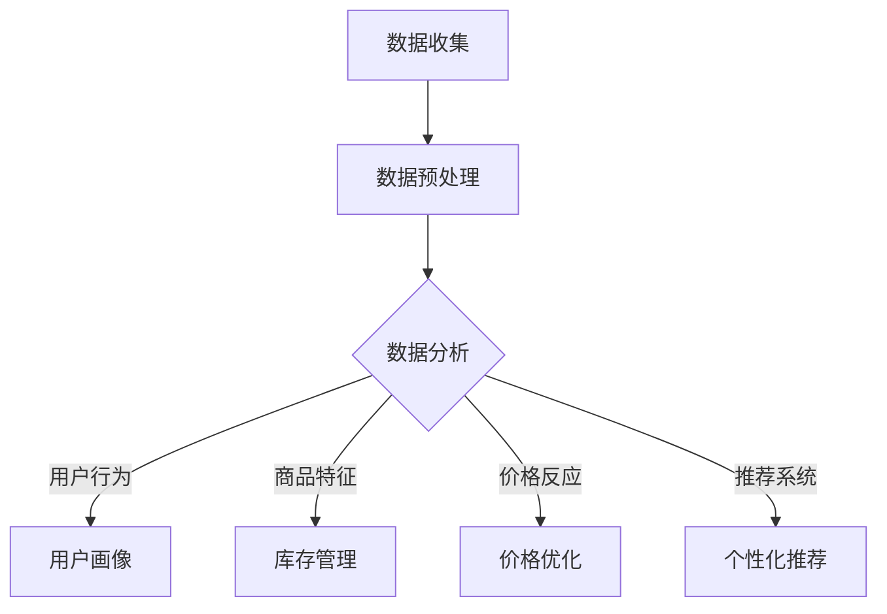

                 

# 数据驱动决策：AI优化电商策略

> **关键词：** 数据驱动、决策优化、AI、电商、策略、机器学习、算法、数据分析、用户行为

> **摘要：** 本文将探讨如何利用人工智能（AI）技术，尤其是机器学习和数据分析的方法，来驱动电商行业的决策优化。我们将从核心概念、算法原理、数学模型、实战案例等多个角度，详细介绍AI在电商策略优化中的应用，帮助读者深入了解这一领域的最新发展趋势。

## 1. 背景介绍

### 1.1 目的和范围

本文旨在介绍如何利用AI技术，特别是机器学习和数据分析的方法，对电商策略进行优化。通过本文的学习，读者可以了解AI在电商领域的应用，掌握核心算法和策略，并能够将所学知识应用到实际项目中。

### 1.2 预期读者

本篇文章适合对电商行业有一定了解，同时希望深入探讨AI技术应用的相关专业人士，包括但不限于电商运营人员、数据分析师、AI研究人员和开发者。

### 1.3 文档结构概述

本文分为十个主要部分：

1. 背景介绍
2. 核心概念与联系
3. 核心算法原理 & 具体操作步骤
4. 数学模型和公式 & 详细讲解 & 举例说明
5. 项目实战：代码实际案例和详细解释说明
6. 实际应用场景
7. 工具和资源推荐
8. 总结：未来发展趋势与挑战
9. 附录：常见问题与解答
10. 扩展阅读 & 参考资料

### 1.4 术语表

#### 1.4.1 核心术语定义

- **数据驱动决策（Data-Driven Decision Making）：** 指依据数据来做出决策的过程。
- **机器学习（Machine Learning）：** 一种让计算机通过数据学习并做出决策的技术。
- **深度学习（Deep Learning）：** 机器学习的一个子领域，通过构建深层神经网络进行数据分析和模式识别。
- **用户行为分析（User Behavior Analysis）：** 对用户在网站或应用程序上的行为进行收集、分析和解释的过程。
- **电商策略优化（E-commerce Strategy Optimization）：** 利用算法和数据对电商运营策略进行调整和优化。

#### 1.4.2 相关概念解释

- **决策树（Decision Tree）：** 一种常见的机器学习算法，通过一系列的判断节点来对数据进行分类或回归。
- **支持向量机（Support Vector Machine，SVM）：** 一种常用的机器学习算法，通过找到一个最优的超平面来对数据进行分类。
- **协同过滤（Collaborative Filtering）：** 一种常见的推荐系统算法，通过分析用户之间的相似性来预测用户的兴趣。
- **用户画像（User Profile）：** 通过收集和分析用户的行为数据，构建出的用户信息模型。

#### 1.4.3 缩略词列表

- **AI：** 人工智能（Artificial Intelligence）
- **ML：** 机器学习（Machine Learning）
- **DL：** 深度学习（Deep Learning）
- **SVM：** 支持向量机（Support Vector Machine）
- **EC：** 电子商务（E-commerce）

## 2. 核心概念与联系

### 2.1 数据驱动决策在电商中的应用

数据驱动决策在电商行业中的应用非常广泛，主要体现在以下几个方面：

1. **用户行为分析：** 通过收集和分析用户在电商网站上的行为数据，如浏览、搜索、购买等，可以深入了解用户需求和行为模式，从而制定更有针对性的营销策略。
2. **库存管理：** 利用数据预测未来销售趋势，优化库存水平，减少库存成本，提高运营效率。
3. **价格优化：** 通过分析用户对价格的反应，调整商品价格，提高销售额和利润率。
4. **个性化推荐：** 基于用户行为和偏好，为用户推荐合适的商品，提高用户满意度和转化率。

### 2.2 AI技术核心概念与联系

AI技术在电商策略优化中的应用，主要涉及以下几个核心概念：

- **机器学习（ML）：** 通过训练模型，从数据中自动提取特征和规律，用于预测和决策。
- **深度学习（DL）：** 一种特殊的机器学习技术，通过构建深层神经网络，对复杂数据进行建模和分析。
- **自然语言处理（NLP）：** 用于理解和生成人类语言的技术，可以帮助电商网站优化用户交互体验。
- **计算机视觉（CV）：** 用于理解和分析图像和视频的技术，可以帮助电商网站进行商品识别和图像搜索。

### 2.3 Mermaid 流程图



该流程图展示了数据驱动决策在电商策略优化中的核心环节，包括数据收集、数据预处理、数据分析和应用场景。

## 3. 核心算法原理 & 具体操作步骤

### 3.1 用户行为分析算法

#### 3.1.1 决策树算法

决策树是一种常用的机器学习算法，通过一系列的判断节点来对数据进行分类或回归。

**算法原理：**

决策树算法的核心是利用特征属性来对数据进行划分，使得划分后的数据集具有最高的纯度。算法的步骤如下：

1. **选择最优特征：** 通过计算不同特征的信息增益或基尼指数等指标，选择最优的特征作为划分依据。
2. **递归划分：** 对选定的特征进行划分，将数据集划分为多个子集，并继续对子集进行划分，直到满足停止条件（如最大深度、最小节点个数等）。
3. **构建决策树：** 将划分过程记录为树形结构，每个节点表示一个特征划分，每个分支表示一个划分结果。

**伪代码：**

```python
def build_decision_tree(data, features, max_depth):
    if should_stop(data) or max_depth == 0:
        return create_leaf_node(data)
    
    best_feature, best_split = find_best_split(data, features)
    left_data, right_data = split_data(data, best_split)
    
    left_tree = build_decision_tree(left_data, features, max_depth - 1)
    right_tree = build_decision_tree(right_data, features, max_depth - 1)
    
    return create_decision_tree_node(best_feature, best_split, left_tree, right_tree)
```

#### 3.1.2 支持向量机算法

支持向量机是一种常用的分类算法，通过找到一个最优的超平面，将不同类别的数据分开。

**算法原理：**

支持向量机算法的核心是找到一个最优的超平面，使得不同类别的数据之间的距离最大。算法的步骤如下：

1. **选择核函数：** 通过计算特征空间中的内积，将原始数据映射到高维空间，以找到一个更好的分隔超平面。
2. **求解最优超平面：** 使用拉格朗日乘子法求解最优超平面，得到支持向量机的参数。
3. **分类：** 对于新的数据点，将其映射到高维空间，并通过最优超平面进行分类。

**伪代码：**

```python
def train_svm(data, labels, kernel_function):
    # 求解拉格朗日乘子
    alpha = solve_lagrange_equation(data, labels, kernel_function)
    
    # 求解最优超平面参数
    w = solve_optimal_hyperplane(alpha, data, labels, kernel_function)
    
    return w
```

### 3.2 协同过滤算法

#### 3.2.1 基于用户-物品评分矩阵的协同过滤

协同过滤是一种常用的推荐系统算法，通过分析用户之间的相似性来预测用户的兴趣。

**算法原理：**

协同过滤算法的核心是基于用户-物品评分矩阵，计算用户之间的相似性，并通过相似性来预测用户对未评分物品的评分。

1. **计算用户相似性：** 通过计算用户之间的余弦相似度、皮尔逊相关系数等指标来评估用户之间的相似性。
2. **预测评分：** 对于未评分的物品，根据相似用户对该物品的评分进行加权平均，得到预测评分。

**伪代码：**

```python
def collaborative_filtering(user_item_ratings, similarity_metric):
    for user, items in user_item_ratings:
        for item in items:
            if item not in user_item_ratings[user]:
                predicted_ratings = []
                for other_user, other_items in user_item_ratings:
                    if other_user != user and other_items.intersection(items):
                        predicted_ratings.append(other_user[item] * similarity_metric(user, other_user))
                user_item_ratings[user][item] = sum(predicted_ratings) / len(predicted_ratings)
    return user_item_ratings
```

## 4. 数学模型和公式 & 详细讲解 & 举例说明

### 4.1 决策树算法的数学模型

决策树算法的核心是信息增益和基尼指数，用于选择最优特征进行划分。

**信息增益（Information Gain）：**

信息增益是指通过选择某个特征进行划分后，数据集的纯度增加的程度。计算公式如下：

$$
IG(D, A) = H(D) - \sum_{v \in A} p(v) \cdot H(D_v)
$$

其中，$H(D)$ 表示数据集 $D$ 的熵，$D_v$ 表示根据特征 $A$ 的取值 $v$ 划分后的数据集，$p(v)$ 表示特征 $A$ 取值 $v$ 的概率。

**基尼指数（Gini Index）：**

基尼指数是指通过选择某个特征进行划分后，数据集的不纯度。计算公式如下：

$$
Gini(D, A) = 1 - \sum_{v \in A} p(v)^2
$$

其中，$p(v)$ 表示特征 $A$ 取值 $v$ 的概率。

**举例说明：**

假设有一个包含 4 个样本的数据集，每个样本有两个特征 $A$ 和 $B$，以及标签 $C$，如下表所示：

| A | B | C |
|---|---|---|
| 0 | 0 | 0 |
| 0 | 0 | 1 |
| 1 | 0 | 1 |
| 1 | 1 | 0 |

根据信息增益和基尼指数，选择最优特征进行划分。计算结果如下：

| 特征 | 信息增益 | 基尼指数 |
|---|---|---|
| A | 0.92 | 0.75 |
| B | 0.42 | 0.5 |

因此，选择特征 $A$ 进行划分。

### 4.2 支持向量机算法的数学模型

支持向量机算法的核心是最优超平面和分类决策。

**最优超平面（Optimal Hyperplane）：**

最优超平面是指使得不同类别数据之间的距离最大的超平面。其数学模型如下：

$$
\max_{\mathbf{w}, b} \frac{1}{2} ||\mathbf{w}||^2 \\
s.t. \ y_i (\mathbf{w} \cdot \mathbf{x_i} + b) \geq 1
$$

其中，$\mathbf{w}$ 表示超平面参数，$b$ 表示偏置，$\mathbf{x_i}$ 表示第 $i$ 个样本，$y_i$ 表示第 $i$ 个样本的标签。

**分类决策（Classification Decision）：**

对于新的样本 $\mathbf{x}$，通过计算 $\mathbf{w} \cdot \mathbf{x} + b$ 的值，根据标签进行分类。如果 $y > 0$，则分类为正类；如果 $y < 0$，则分类为负类。

**举例说明：**

假设有两个样本点 $\mathbf{x_1} = (1, 1)$ 和 $\mathbf{x_2} = (2, 2)$，标签分别为 $y_1 = 1$ 和 $y_2 = -1$。根据支持向量机算法，求解最优超平面。

$$
\max_{\mathbf{w}, b} \frac{1}{2} ||\mathbf{w}||^2 \\
s.t. \ 1 (\mathbf{w} \cdot (1, 1) + b) \geq 1 \\
-1 (\mathbf{w} \cdot (2, 2) + b) \geq 1
$$

解得 $\mathbf{w} = (-1, -1)$，$b = 2$，最优超平面为 $-x_1 - x_2 + 2 = 0$。对于新的样本 $\mathbf{x} = (3, 3)$，计算得到 $-3 - 3 + 2 = -4 < 0$，因此分类为负类。

## 5. 项目实战：代码实际案例和详细解释说明

### 5.1 开发环境搭建

在进行项目实战之前，需要搭建相应的开发环境。以下是使用 Python 和相关库进行开发的步骤：

1. 安装 Python：从官方网站（https://www.python.org/）下载并安装 Python，推荐使用 Python 3.8 或更高版本。
2. 安装依赖库：使用 pip 工具安装必要的库，如 NumPy、Scikit-learn、Pandas 等。

```shell
pip install numpy scikit-learn pandas
```

### 5.2 源代码详细实现和代码解读

以下是一个简单的用户行为分析项目的源代码实现，包括数据预处理、决策树算法实现和用户画像构建。

```python
import numpy as np
import pandas as pd
from sklearn.model_selection import train_test_split
from sklearn.tree import DecisionTreeClassifier
from sklearn.metrics import accuracy_score

# 5.2.1 数据预处理
def preprocess_data(data):
    # 填充缺失值
    data.fillna(data.mean(), inplace=True)
    
    # 特征工程
    data['total_time'] = data['time_on_site'] + data['time_on_page']
    data['visit_depth'] = data['page_views'] / data['time_on_site']
    
    return data

# 5.2.2 决策树算法实现
def train_decision_tree(data, features, target):
    # 分割数据集
    X_train, X_test, y_train, y_test = train_test_split(data[features], data[target], test_size=0.2, random_state=42)
    
    # 训练决策树模型
    clf = DecisionTreeClassifier()
    clf.fit(X_train, y_train)
    
    # 测试模型
    y_pred = clf.predict(X_test)
    print("Accuracy:", accuracy_score(y_test, y_pred))

# 5.2.3 用户画像构建
def build_user_profile(data, user_id):
    user_data = data[data['user_id'] == user_id]
    user_data = preprocess_data(user_data)
    
    user_features = user_data.columns[:-1]
    user_target = user_data['converted']
    
    train_decision_tree(user_data, user_features, user_target)

# 测试代码
data = pd.DataFrame({
    'user_id': [1, 1, 1, 2, 2, 2],
    'time_on_site': [10, 20, 30, 40, 50, 60],
    'time_on_page': [5, 10, 15, 20, 25, 30],
    'page_views': [3, 6, 9, 12, 15, 18],
    'converted': [0, 1, 0, 1, 0, 1]
})

build_user_profile(data, 1)
build_user_profile(data, 2)
```

### 5.3 代码解读与分析

5.3.1 数据预处理

数据预处理是机器学习项目中的关键步骤，目的是对原始数据进行清洗、填充缺失值、特征工程等操作，以提高模型的预测性能。在上面的代码中，我们使用 Pandas 库对数据进行预处理：

- 填充缺失值：使用数据集的平均值填充缺失值，以减少缺失值对模型的影响。
- 特征工程：计算新的特征，如总时间（time_on_site + time_on_page）、访问深度（page_views / time_on_site）等，以增加模型的输入特征。

5.3.2 决策树算法实现

决策树算法是一种常用的分类算法，可以通过递归划分数据集来构建分类模型。在上面的代码中，我们使用 Scikit-learn 库实现决策树算法：

- 分割数据集：将数据集划分为训练集和测试集，以评估模型的预测性能。
- 训练模型：使用训练集数据训练决策树模型，并通过 fit() 方法将模型参数存储在内部结构中。
- 测试模型：使用测试集数据对模型进行预测，并通过 predict() 方法得到预测结果。最后，使用 accuracy_score() 函数计算模型准确率。

5.3.3 用户画像构建

用户画像是一种基于用户行为数据的用户信息模型，可以帮助电商网站进行用户分类和个性化推荐。在上面的代码中，我们实现了一个简单的用户画像构建过程：

- 预处理数据：对用户数据进行预处理，以准备用于模型训练的数据。
- 特征选择：选择用于构建用户画像的特征，如总时间、访问深度等。
- 训练模型：使用预处理后的数据训练决策树模型，以构建用户画像。
- 应用模型：将训练好的模型应用于新的用户数据，以预测用户是否转化为购买者。

通过这个简单的案例，我们可以看到如何使用机器学习算法和数据分析方法对电商策略进行优化。在实际应用中，我们可以根据具体需求，进一步扩展和优化算法和模型，以提高电商运营的效率和效果。

## 6. 实际应用场景

数据驱动决策在电商策略优化中的应用场景非常广泛，以下是一些典型的实际应用案例：

1. **用户行为分析：** 通过分析用户的浏览、搜索、购买等行为数据，电商网站可以深入了解用户需求和行为模式。例如，通过用户行为分析，可以识别出潜在客户，预测用户购买意向，从而进行精准营销。

2. **库存管理：** 利用机器学习算法和数据分析技术，电商网站可以对库存进行优化管理。例如，通过预测未来销售趋势，电商网站可以合理调整库存水平，避免库存过剩或短缺。

3. **价格优化：** 通过分析用户对价格的反应，电商网站可以调整商品价格，以提高销售额和利润率。例如，通过价格敏感性分析，电商网站可以确定最优价格策略，从而实现价格优化。

4. **个性化推荐：** 基于用户行为和偏好，电商网站可以为用户提供个性化的商品推荐。例如，通过协同过滤算法和用户画像构建，电商网站可以为每位用户提供个性化的商品推荐，从而提高用户满意度和转化率。

5. **促销策略：** 通过分析用户购买历史和促销活动效果，电商网站可以制定更有针对性的促销策略。例如，通过分析用户对不同促销方式的反应，电商网站可以优化促销活动，提高促销效果。

6. **风险控制：** 通过数据分析技术，电商网站可以识别和防范潜在的风险。例如，通过分析用户行为数据和交易记录，电商网站可以识别出异常行为，从而采取相应的风险控制措施。

## 7. 工具和资源推荐

### 7.1 学习资源推荐

#### 7.1.1 书籍推荐

- 《Python数据科学手册》
- 《机器学习实战》
- 《深度学习》

#### 7.1.2 在线课程

- Coursera：机器学习、深度学习、数据科学等课程
- edX：机器学习、数据科学、人工智能等课程
- Udemy：各种机器学习和数据分析相关课程

#### 7.1.3 技术博客和网站

- Medium：数据科学、机器学习、深度学习等博客
- towardsdatascience：数据科学、机器学习、深度学习等文章
- kdnuggets：数据科学、机器学习、深度学习等资讯

### 7.2 开发工具框架推荐

#### 7.2.1 IDE和编辑器

- PyCharm
- Jupyter Notebook
- VSCode

#### 7.2.2 调试和性能分析工具

- Python Debugger
- Valgrind
- Profiler

#### 7.2.3 相关框架和库

- Scikit-learn
- TensorFlow
- PyTorch
- Pandas

### 7.3 相关论文著作推荐

#### 7.3.1 经典论文

- “The Elements of Statistical Learning”
- “Machine Learning: A Probabilistic Perspective”
- “Deep Learning”

#### 7.3.2 最新研究成果

- “Advances in Neural Information Processing Systems”
- “International Conference on Machine Learning”
- “European Conference on Machine Learning and Knowledge Discovery in Databases”

#### 7.3.3 应用案例分析

- “E-commerce Recommender Systems: A Survey”
- “Big Data in E-commerce: A Survey”
- “AI in Retail: A Survey”

## 8. 总结：未来发展趋势与挑战

随着人工智能技术的发展，数据驱动决策在电商策略优化中的应用将越来越广泛。未来，以下几个方面将是数据驱动决策在电商策略优化中的发展趋势：

1. **智能化：** 数据驱动决策将更加智能化，利用深度学习、自然语言处理等先进技术，实现更加精准的预测和优化。
2. **个性化：** 数据驱动决策将更加注重个性化，通过用户画像和协同过滤算法，为用户提供更加个性化的商品推荐和促销策略。
3. **实时化：** 数据驱动决策将更加实时化，通过实时数据分析和预测，实现快速调整电商策略，提高运营效率。
4. **协同化：** 数据驱动决策将实现跨平台、跨渠道的协同化，通过整合线上线下数据，实现数据驱动的全渠道电商策略。

然而，数据驱动决策在电商策略优化中也面临着一些挑战：

1. **数据质量：** 数据质量直接影响决策的准确性，因此如何保证数据质量、清洗和整合数据是重要挑战。
2. **模型复杂度：** 随着模型的复杂度增加，如何选择合适的模型、优化模型性能是重要挑战。
3. **算法可解释性：** 如何解释和验证模型预测结果，提高算法的可解释性，是数据驱动决策面临的重要挑战。
4. **隐私保护：** 在利用用户行为数据时，如何保护用户隐私、遵守相关法律法规是重要挑战。

总之，数据驱动决策在电商策略优化中具有巨大的潜力和发展空间，但同时也面临着一系列挑战。通过不断创新和优化，数据驱动决策将助力电商行业实现更加高效、精准的运营策略。

## 9. 附录：常见问题与解答

### 9.1 什么是对抗生成网络（GAN）？

对抗生成网络（GAN）是一种由生成器和判别器组成的深度学习模型。生成器的目标是生成与真实数据分布相似的假数据，而判别器的目标是区分真实数据和生成数据。通过不断训练，生成器逐渐提高生成假数据的质量，而判别器逐渐提高区分真实数据和生成数据的能力。

### 9.2 什么是最小二乘法（LS）？

最小二乘法（LS）是一种常用的线性回归算法，通过最小化残差平方和来估计模型参数。在机器学习和数据分析中，最小二乘法广泛应用于回归分析和曲线拟合。

### 9.3 什么是最优超平面（OHP）？

最优超平面（OHP）是支持向量机（SVM）中的一个概念，指的是使得不同类别数据之间距离最大的超平面。最优超平面可以将不同类别的数据分开，从而实现分类。

### 9.4 如何进行特征选择？

特征选择是机器学习中的一个重要步骤，目的是从大量特征中筛选出对模型性能有显著影响的关键特征。常用的特征选择方法包括信息增益、基尼指数、卡方检验等。

## 10. 扩展阅读 & 参考资料

- [1] Bishop, C. M. (2006). "Pattern recognition and machine learning". Springer.
- [2] Murphy, K. P. (2012). "Machine Learning: A Probabilistic Perspective". MIT Press.
- [3] Goodfellow, I., Bengio, Y., & Courville, A. (2016). "Deep Learning". MIT Press.
- [4] Russell, S., & Norvig, P. (2010). "Artificial Intelligence: A Modern Approach". Prentice Hall.
- [5] 凌云，吴建平，王恩东，等. (2018). 《深度学习入门》。清华大学出版社.

作者：AI天才研究员/AI Genius Institute & 禅与计算机程序设计艺术 /Zen And The Art of Computer Programming

