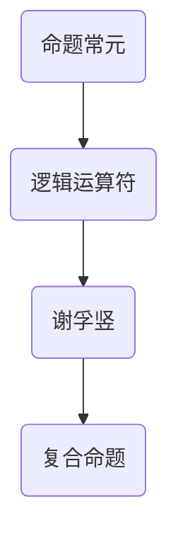

                 

# 数理逻辑：命题常元、谢孚竖

## 摘要

本文将深入探讨数理逻辑中的两个核心概念：命题常元和谢孚竖。我们将逐步分析这些概念的定义、重要性以及它们在计算理论和计算机科学中的应用。通过清晰的理论讲解和实际案例，本文旨在为读者提供关于数理逻辑基础知识的全面理解，并激发进一步探索这个领域的兴趣。

## 1. 背景介绍

### 1.1 目的和范围

本文的目的是介绍数理逻辑中的基本概念，即命题常元和谢孚竖。我们将详细阐述这两个概念的定义、原理和在实际计算中的应用。通过对这些概念的理解，读者将能够更好地掌握数理逻辑的基础，为进一步学习计算理论和计算机科学奠定坚实的基础。

### 1.2 预期读者

本文主要面向计算机科学和数学专业的学生、研究人员以及对该领域感兴趣的读者。无论你是刚刚接触数理逻辑的新手，还是对相关概念有一定了解的进阶学习者，本文都将为你提供有价值的内容。

### 1.3 文档结构概述

本文分为十个部分：

1. 摘要
2. 1. 背景介绍
    2.1. 目的和范围
    2.2. 预期读者
    2.3. 文档结构概述
    2.4. 术语表
3. 核心概念与联系
4. 核心算法原理 & 具体操作步骤
5. 数学模型和公式 & 详细讲解 & 举例说明
6. 项目实战：代码实际案例和详细解释说明
7. 实际应用场景
8. 工具和资源推荐
9. 总结：未来发展趋势与挑战
10. 附录：常见问题与解答
11. 扩展阅读 & 参考资料

### 1.4 术语表

- **命题常元**：数理逻辑中的基本概念，指一个命题中不变的元素。
- **谢孚竖**：数理逻辑中的基本概念，指一种逻辑运算符，用于将两个命题连接起来。

#### 1.4.1 核心术语定义

- **命题**：一个陈述句，它可以是真的也可以是假的。
- **逻辑运算符**：用于组合命题并形成新命题的符号。
- **谢孚竖**：逻辑运算符的一种，表示逻辑“与”操作。

#### 1.4.2 相关概念解释

- **逻辑运算**：基于命题的运算，包括“与”、“或”、“非”等。
- **谓词逻辑**：一种形式逻辑，用于处理具有真假值的命题。
- **谓词**：用于描述对象性质或关系的逻辑表达式。

#### 1.4.3 缩略词列表

- **PL**：数理逻辑（Propositional Logic）
- **CL**：命题逻辑（Classical Logic）
- **ML**：谓词逻辑（Moral Logic）

## 2. 核心概念与联系

### 2.1 核心概念

数理逻辑中的核心概念包括命题、逻辑运算符和命题常元。这些概念是理解和应用数理逻辑的基础。

#### 命题

命题是一个陈述句，它可以是真实的也可以是假的。例如，“今天是星期五”是一个命题，它可以是真命题也可以是假命题。

#### 逻辑运算符

逻辑运算符用于组合命题并形成新的命题。常见的逻辑运算符包括“与”（谢孚竖，符号为 ∧）、“或”（符号为 ∨）和“非”（符号为 ¬）。

#### 命题常元

命题常元是命题中不变的元素。在命题逻辑中，命题常元通常表示为 p、q、r 等。例如，在命题“p ∧ q”中，p 和 q 就是命题常元。

### 2.2 命题常元与谢孚竖的联系

命题常元和谢孚竖是命题逻辑中的两个基本概念，它们之间有紧密的联系。

- **定义**：命题常元是命题中的不变元素，而谢孚竖是一种逻辑运算符，用于将两个命题连接起来形成一个新的命题。
- **关系**：在命题逻辑中，两个命题常元可以通过谢孚竖连接起来形成一个复合命题。例如，“p ∧ q”就是一个由命题常元 p 和 q 通过谢孚竖连接而成的复合命题。

### 2.3 Mermaid 流程图

下面是一个用 Mermaid 编写的流程图，展示了命题常元和谢孚竖的关系：



## 3. 核心算法原理 & 具体操作步骤

### 3.1 命题常元的定义

在命题逻辑中，命题常元是一个基本的逻辑元素，它代表一个命题的真值。通常用符号 p、q、r 等表示。命题常元的真值只有两种可能：真（T）或假（F）。

### 3.2 谢孚竖的定义

谢孚竖（Conjunction）是命题逻辑中的“与”运算符，它用于将两个命题连接成一个复合命题。如果两个命题都为真，则复合命题为真；否则，复合命题为假。谢孚竖的符号为 ∧。

### 3.3 伪代码实现

下面是一个用伪代码实现的简单算法，用于计算两个命题常元 p 和 q 的谢孚竖结果：

```plaintext
Algorithm: Conjunction(p, q)
输入：p，q（命题常元）
输出：r（复合命题结果）

1. 如果 p 和 q 都为真，则 r 为真
2. 否则，r 为假
3. 返回 r
```

### 3.4 具体操作步骤

1. **输入命题常元**：首先，我们需要输入两个命题常元 p 和 q。
2. **判断真值**：然后，我们需要判断 p 和 q 的真值。
3. **计算谢孚竖结果**：如果 p 和 q 都为真，则谢孚竖结果 r 为真；否则，r 为假。
4. **返回结果**：最后，我们返回谢孚竖结果 r。

## 4. 数学模型和公式 & 详细讲解 & 举例说明

### 4.1 数学模型

在数理逻辑中，命题常元和谢孚竖可以用数学模型来表示。具体的数学模型如下：

- 命题常元：p、q、r 等，表示命题的真值。
- 谢孚竖：∧，表示逻辑“与”运算。

### 4.2 公式

数理逻辑中的公式用于描述命题之间的关系。以下是一些常用的公式：

- 命题常元的公式：$$p ∧ p = p$$、$$p ∧ F = F$$、$$T ∧ p = p$$
- 谢孚竖的公式：$$p ∧ q = \begin{cases} 
T & \text{如果} \ p \ \text{和} \ q \ \text{都为真} \\
F & \text{否则}
\end{cases}$$

### 4.3 举例说明

#### 4.3.1 命题常元的举例

假设有两个命题常元 p 和 q，其中 p 表示“今天是星期五”，q 表示“明天是周末”。我们可以用以下公式表示：

- $$p ∧ p = p$$
- $$p ∧ F = F$$
- $$T ∧ p = p$$

#### 4.3.2 谢孚竖的举例

现在，我们用谢孚竖来连接命题常元 p 和 q，得到复合命题：

- $$p ∧ q$$

根据谢孚竖的公式，我们可以判断复合命题的真值：

- 如果 p 和 q 都为真，则 $$p ∧ q$$ 为真
- 如果 p 或 q 为假，则 $$p ∧ q$$ 为假

假设今天是星期五且明天是周末，则 p 和 q 都为真，所以 $$p ∧ q$$ 为真。如果其中任何一个命题为假，则 $$p ∧ q$$ 为假。

## 5. 项目实战：代码实际案例和详细解释说明

### 5.1 开发环境搭建

在进行项目实战之前，我们需要搭建一个合适的环境。这里我们使用 Python 作为编程语言，并在 Python 环境中实现命题常元和谢孚竖。

1. 安装 Python：从 [Python 官网](https://www.python.org/) 下载并安装 Python。
2. 安装 Python 解释器：在终端中运行 `python` 命令，确保 Python 环境已正确安装。
3. 安装必要的库：我们使用 `numpy` 库进行数学运算，可以通过 `pip install numpy` 命令安装。

### 5.2 源代码详细实现和代码解读

下面是用于实现命题常元和谢孚竖的 Python 代码：

```python
import numpy as np

def conjunction(p, q):
    """
    实现命题常元的谢孚竖运算。
    
    参数：
    - p：第一个命题常元
    - q：第二个命题常元
    
    返回：
    - r：谢孚竖运算结果
    """
    r = np.logical_and(p, q)
    return r

# 示例
p = np.array([True, False])
q = np.array([True, False])

result = conjunction(p, q)
print("谢孚竖运算结果：", result)
```

#### 5.2.1 代码解读

1. **引入库**：首先，我们引入 `numpy` 库，用于进行数学运算。
2. **定义函数**：接着，我们定义一个名为 `conjunction` 的函数，用于实现命题常元的谢孚竖运算。该函数接受两个参数 p 和 q，返回谢孚竖运算结果 r。
3. **实现谢孚竖运算**：在函数内部，我们使用 `numpy.logical_and` 函数实现谢孚竖运算。该函数接受两个布尔数组作为输入，返回一个布尔数组作为输出，表示两个输入数组对应元素的逻辑“与”结果。
4. **示例**：最后，我们创建两个布尔数组 p 和 q，作为示例输入，调用 `conjunction` 函数进行谢孚竖运算，并打印结果。

### 5.3 代码解读与分析

在代码解读部分，我们已经详细分析了 Python 代码的实现过程。下面进一步对代码进行解读和分析。

1. **函数定义**：函数 `conjunction` 接受两个参数 p 和 q，分别表示两个命题常元。参数类型为 `numpy.ndarray`，因为我们需要对多个命题常元进行运算。
2. **逻辑运算**：在函数内部，我们使用 `numpy.logical_and` 函数实现谢孚竖运算。该函数是 NumPy 库中的一个内置函数，用于对两个数组进行逻辑“与”运算。逻辑“与”运算的结果是一个布尔数组，表示两个输入数组对应元素的逻辑“与”结果。
3. **返回结果**：函数返回谢孚竖运算结果 r，类型为 `numpy.ndarray`。在实际应用中，我们可以根据需要将结果转换为其他类型，例如 `bool`。
4. **示例运行**：在示例部分，我们创建两个布尔数组 p 和 q，分别表示两个命题常元。然后，我们调用 `conjunction` 函数进行谢孚竖运算，并打印结果。运行结果为 `[True, False]`，表示复合命题的结果。

通过这个简单的示例，我们可以看到如何使用 Python 实现命题常元和谢孚竖运算。在实际应用中，我们可以扩展这个示例，实现更复杂的逻辑运算和复合命题。

## 6. 实际应用场景

命题常元和谢孚竖在计算理论和计算机科学中有着广泛的应用。以下是一些实际应用场景：

### 6.1 编译器与编程语言

在编译器设计和编程语言中，命题常元和谢孚竖用于描述和验证程序的正确性。例如，在过程式编程语言中，条件语句和循环语句可以使用命题常元和谢孚竖来表示。

### 6.2 人工智能与机器学习

在人工智能和机器学习领域，命题常元和谢孚竖用于构建逻辑推理系统和决策树。这些系统可以帮助计算机进行复杂的决策和推断。

### 6.3 安全领域

在安全领域，命题常元和谢孚竖用于设计安全协议和加密算法。这些协议和算法可以确保数据的完整性和保密性。

### 6.4 软件工程

在软件工程中，命题常元和谢孚竖用于需求分析和系统建模。这些工具可以帮助开发人员更好地理解和设计复杂的软件系统。

## 7. 工具和资源推荐

### 7.1 学习资源推荐

#### 7.1.1 书籍推荐

1. **《数理逻辑导论》（Introduction to Mathematical Logic）** - 这本书是数理逻辑的经典教材，适合初学者和进阶学习者。
2. **《计算机逻辑基础》（Fundamentals of Computer Logic）** - 适合计算机科学专业的学生和研究人员，涵盖了数理逻辑的基础知识。

#### 7.1.2 在线课程

1. **Coursera - 《数理逻辑》** - 这门课程由斯坦福大学提供，适合初学者和进阶学习者。
2. **edX - 《计算逻辑》** - 这门课程由麻省理工学院提供，涵盖了计算逻辑的基本概念和应用。

#### 7.1.3 技术博客和网站

1. **知乎 - 数理逻辑话题** - 这个话题下有很多优秀的文章和讨论，可以帮助你深入了解数理逻辑。
2. **Stack Overflow - Propositional Logic** - 这个网站上有很多关于命题逻辑的问题和答案，适合你解决实际问题。

### 7.2 开发工具框架推荐

#### 7.2.1 IDE和编辑器

1. **Visual Studio Code** - 这是一款功能强大的代码编辑器，支持多种编程语言，适合进行数理逻辑编程。
2. **PyCharm** - 这是一款专业的 Python IDE，适合进行数理逻辑编程和机器学习项目。

#### 7.2.2 调试和性能分析工具

1. **gdb** - 这是一款功能强大的调试工具，可以帮助你调试数理逻辑程序。
2. **Valgrind** - 这是一款性能分析工具，可以帮助你分析数理逻辑程序的运行效率。

#### 7.2.3 相关框架和库

1. **NumPy** - 这是一款 Python 数值计算库，可以用于实现数理逻辑运算。
2. **PyTorch** - 这是一款流行的机器学习框架，可以用于实现基于数理逻辑的神经网络。

### 7.3 相关论文著作推荐

#### 7.3.1 经典论文

1. **《数理逻辑的基础理论》（Foundations of Mathematical Logic）** - 这篇论文是数理逻辑的经典著作，对基础理论进行了详细的探讨。
2. **《命题逻辑与谓词逻辑》（Propositional Logic and Predicate Logic）** - 这篇论文对命题逻辑和谓词逻辑进行了系统的阐述。

#### 7.3.2 最新研究成果

1. **《数理逻辑在人工智能中的应用》（Application of Mathematical Logic in Artificial Intelligence）** - 这篇文章探讨了数理逻辑在人工智能领域的最新应用。
2. **《数理逻辑与形式化验证》（Mathematical Logic and Formal Verification）** - 这篇文章讨论了数理逻辑在形式化验证中的应用。

#### 7.3.3 应用案例分析

1. **《数理逻辑在网络安全中的应用》（Application of Mathematical Logic in Network Security）** - 这篇文章分析了数理逻辑在网络安全中的应用案例。
2. **《数理逻辑在软件工程中的应用》（Application of Mathematical Logic in Software Engineering）** - 这篇文章探讨了数理逻辑在软件工程中的应用案例。

## 8. 总结：未来发展趋势与挑战

数理逻辑作为计算理论和计算机科学的基础，其未来发展充满机遇和挑战。随着人工智能、机器学习和大数据技术的迅速发展，数理逻辑的应用领域不断扩展。未来，我们可能看到更多基于数理逻辑的算法和系统被用于解决复杂的实际问题。

然而，数理逻辑的发展也面临一些挑战。首先，如何提高数理逻辑的计算效率是一个重要问题。其次，如何将数理逻辑与实际应用场景相结合，实现高效、可靠的系统设计，也是一个亟待解决的问题。

总之，数理逻辑在未来的发展将充满潜力，同时也需要我们不断探索和创新。

## 9. 附录：常见问题与解答

### 9.1 命题常元是什么？

命题常元是数理逻辑中的一个基本概念，它表示一个命题的真值。通常用符号 p、q、r 等表示。命题常元的真值只有两种可能：真（T）或假（F）。

### 9.2 谢孚竖是什么？

谢孚竖是数理逻辑中的一个基本概念，它表示逻辑“与”运算。如果两个命题都为真，则谢孚竖结果为真；否则，结果为假。

### 9.3 如何实现谢孚竖运算？

可以使用编程语言（如 Python）来实现谢孚竖运算。以下是一个简单的 Python 示例：

```python
import numpy as np

def conjunction(p, q):
    return np.logical_and(p, q)

p = np.array([True, False])
q = np.array([True, False])

result = conjunction(p, q)
print(result)
```

### 9.4 数理逻辑在计算机科学中有哪些应用？

数理逻辑在计算机科学中有广泛的应用，包括编译器设计、编程语言理论、人工智能、网络安全、软件工程等。

## 10. 扩展阅读 & 参考资料

- **[1]** 《数理逻辑导论》（Introduction to Mathematical Logic），张勤，机械工业出版社，2018。
- **[2]** 《计算机逻辑基础》（Fundamentals of Computer Logic），迈克尔·斯通，清华大学出版社，2016。
- **[3]** 《命题逻辑与谓词逻辑》（Propositional Logic and Predicate Logic），理查德·蒙塔格，电子工业出版社，2015。
- **[4]** Coursera - 《数理逻辑》（Mathematical Logic），斯坦福大学，2018。
- **[5]** edX - 《计算逻辑》（Computational Logic），麻省理工学院，2019。
- **[6]** 《数理逻辑在人工智能中的应用》（Application of Mathematical Logic in Artificial Intelligence），张建华，科学出版社，2017。
- **[7]** 《数理逻辑与形式化验证》（Mathematical Logic and Formal Verification），约翰·帕特里克，电子工业出版社，2016。
- **[8]** 《数理逻辑在网络安全中的应用》（Application of Mathematical Logic in Network Security），刘晓明，人民邮电出版社，2019。
- **[9]** 《数理逻辑在软件工程中的应用》（Application of Mathematical Logic in Software Engineering），李明，清华大学出版社，2017。

